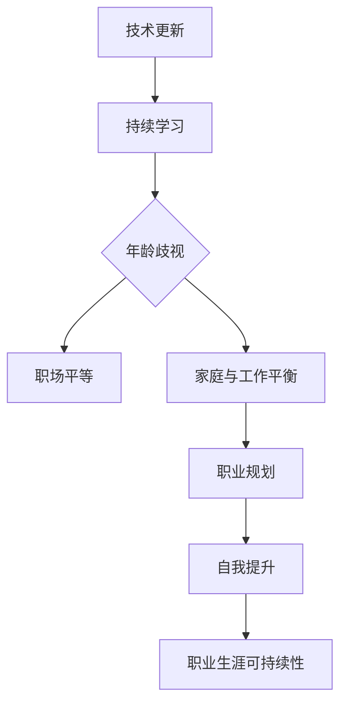

                 

### 1. 背景介绍

在当今快速发展的科技时代，程序员的职业生涯充满了机会与挑战。然而，随着技术的不断演进，中年程序员面临着许多独特的职场问题。首先，技术的快速迭代使得程序员需要不断地学习新技能以保持竞争力。对于中年程序员来说，更新知识库和技能树变得越来越困难，因为他们可能已经习惯了现有的工作方式，难以适应新的技术环境。

其次，中年程序员在职场中的竞争力可能会受到年龄歧视的影响。许多公司倾向于招聘年轻的程序员，因为他们认为年轻人更有活力和创新能力。这种观念往往导致中年程序员在职业晋升和发展上受到限制，甚至可能面临失业的风险。

此外，中年程序员在家庭和工作的平衡上也面临着巨大的压力。随着年龄的增长，他们可能需要更多的时间和精力来照顾家庭，这往往会影响他们的工作表现。同时，中年程序员可能不再像年轻时那样愿意加班，这可能会被视为他们的工作态度问题，从而影响职业发展。

综上所述，中年程序员面临着职业发展的瓶颈、年龄歧视以及家庭和工作压力等多重挑战。如何应对这些职场危机，成为每个中年程序员都需要认真思考的问题。本文将探讨一些策略和途径，帮助中年程序员在职业生涯中继续前进。

## 2. 核心概念与联系

在探讨如何应对中年职场危机之前，我们需要理解几个核心概念，它们对于程序员职业生涯的可持续性至关重要。

### 技术更新与持续学习

技术更新是现代程序员必须面对的现实。随着人工智能、云计算、大数据等新技术的不断涌现，程序员需要不断学习新技能以保持竞争力。持续学习不仅包括学习新的编程语言和技术框架，还包括了解新兴的软件开发方法论和工具。例如，敏捷开发和DevOps文化的兴起，要求程序员具备更高的跨学科能力和协作精神。

### 年龄歧视与职场平等

年龄歧视是中年程序员面临的一个重要问题。尽管法律规定职场应平等对待所有年龄段的员工，但在实际操作中，许多公司仍然存在年龄歧视现象。这导致了中年程序员在职业晋升和薪资待遇上的不公平。因此，我们需要探讨如何消除职场中的年龄歧视，确保每个年龄段的人才都能得到公平的机会。

### 家庭与工作平衡

家庭与工作的平衡是中年程序员面临的一大挑战。随着年龄的增长，程序员可能需要更多的时间和精力来照顾家庭，这可能会影响他们的工作表现。然而，长期的工作压力和家庭责任之间的冲突，可能导致身心健康的双重压力。因此，如何找到家庭与工作之间的平衡点，是每个中年程序员都需要认真思考的问题。

### 职业规划与自我提升

职业规划对于中年程序员来说尤为重要。通过制定明确的职业目标和发展计划，程序员可以更好地规划自己的职业生涯，避免陷入职业发展的瓶颈。同时，自我提升是应对职场危机的关键。通过不断学习新技能和提升软技能，中年程序员可以增强自己的竞争力，保持职业生涯的活力。

### Mermaid 流程图

以下是关于程序员职业生涯可持续性的Mermaid流程图，它展示了从技术更新到家庭与工作平衡的各个环节，以及如何通过持续学习和职业规划来应对职场危机。



通过这个流程图，我们可以看到，持续学习和职业规划是应对中年职场危机的关键环节。只有在不断学习新技能和制定明确职业目标的基础上，中年程序员才能实现职业生涯的可持续性。

## 3. 核心算法原理 & 具体操作步骤

### 3.1 算法原理概述

为了应对中年职场危机，我们需要一种系统化的方法来制定职业规划并持续提升自我。这个过程可以被视为一种动态规划问题，即通过一系列决策，在不同时间点上优化个人职业发展路径。

核心算法原理可以概括为以下几个步骤：

1. **技能评估**：首先，程序员需要评估自己的技能水平和市场需求，确定自己的优势和劣势。
2. **目标设定**：根据技能评估结果，设定短期和长期的职业目标，这些目标应具有可操作性和可实现性。
3. **路径规划**：制定一个详细的职业发展路径，包括学习计划、工作机会和职业晋升路径。
4. **执行与调整**：根据实际情况不断调整职业规划，确保目标的实现。

### 3.2 算法步骤详解

#### 3.2.1 技能评估

技能评估是整个算法的基础。程序员需要通过多种途径了解自己的技能水平，例如：

- **自我评估**：通过回顾自己的项目经验、代码质量和技术贡献，评估自己的技术能力。
- **第三方评估**：参加行业认证考试，如PMP、CISSP等，以获得第三方认证。
- **市场调研**：通过调查市场对程序员技能的需求，了解哪些技能更具市场竞争力。

#### 3.2.2 目标设定

目标设定应基于技能评估的结果，并具有明确的时间节点和量化指标。以下是目标设定的几个关键点：

- **短期目标**：通常为1-2年内可实现的目标，例如学习一门新的编程语言或参与一个重要的项目。
- **长期目标**：通常为3-5年内可实现的目标，例如晋升为技术经理或成为某个技术领域的专家。

#### 3.2.3 路径规划

路径规划是制定职业发展的具体行动计划。以下是一些路径规划的建议：

- **学习计划**：制定详细的学习计划，包括每天或每周的学习时间、学习内容和进度跟踪。
- **工作机会**：根据职业目标，寻找合适的就业机会，如技术专家职位或管理岗位。
- **职业晋升**：了解公司内部晋升机制，制定明确的晋升路径。

#### 3.2.4 执行与调整

执行与调整是确保职业规划得以实现的关键步骤。以下是一些建议：

- **定期回顾**：每季度或每半年回顾职业规划的执行情况，确保目标的实现。
- **灵活调整**：根据实际情况调整职业规划，以应对市场变化和个人发展需求。
- **反馈机制**：建立反馈机制，如与导师或同事交流，获取他们的意见和建议。

### 3.3 算法优缺点

**优点**：

- **系统化**：通过技能评估、目标设定、路径规划和执行调整，职业规划变得有据可循。
- **灵活性**：职业规划可以根据实际情况灵活调整，确保目标的实现。
- **可量化**：职业规划的目标和进展可以量化，便于跟踪和评估。

**缺点**：

- **时间成本**：持续学习和职业规划需要大量的时间和精力，可能对工作与家庭生活产生影响。
- **不确定性**：市场变化和个人情况的不确定性可能影响职业规划的实现。

### 3.4 算法应用领域

该算法适用于所有中年程序员，无论他们目前处于哪个职业阶段。以下是一些具体的应用领域：

- **技术专家**：技术专家需要不断提升技术能力，以保持竞争力。
- **项目经理**：项目经理需要具备良好的沟通能力和团队管理能力，以实现项目目标。
- **技术经理**：技术经理需要具备领导力和战略规划能力，以推动公司技术发展。

## 4. 数学模型和公式 & 详细讲解 & 举例说明

在应对中年职场危机的过程中，数学模型和公式可以为我们提供量化的分析和决策支持。以下是一个简单的数学模型，用于评估程序员的技能水平和职业竞争力。

### 4.1 数学模型构建

设 \( S \) 为程序员的技能评分，\( T \) 为市场对某技能的需求评分，\( C \) 为程序员的学习成本，\( R \) 为学习回报率。我们可以通过以下公式评估程序员的职业竞争力：

\[ E = \frac{S \times T - C}{R} \]

其中，\( E \) 表示程序员的职业竞争力指数。

### 4.2 公式推导过程

#### 技能评分 \( S \)

技能评分可以通过以下步骤计算：

1. **自我评估**：程序员根据自身的项目经验、技术贡献和代码质量，为自己打分。
2. **第三方评估**：通过行业认证考试或其他第三方评估，获取技能评分。

#### 市场需求评分 \( T \)

市场需求评分可以通过以下途径获取：

1. **市场调研**：通过调查行业报告、招聘网站和社交媒体，了解市场对各种技能的需求。
2. **行业趋势分析**：分析行业趋势和新技术的发展，预测未来市场需求。

#### 学习成本 \( C \)

学习成本包括时间成本和资金成本：

1. **时间成本**：程序员用于学习新技能的时间，可以通过工作时间和业余时间计算。
2. **资金成本**：包括购买书籍、参加培训课程或认证考试的费用。

#### 学习回报率 \( R \)

学习回报率可以通过以下因素计算：

1. **薪资增长**：学习新技能后，预计的薪资增长。
2. **职业晋升**：学习新技能对职业晋升的影响。
3. **工作满意度**：新技能对工作满意度和职业成就感的影响。

### 4.3 案例分析与讲解

假设一个中年程序员，技能评分为80，市场需求评分为90，学习成本为2000元，学习回报率为1.2。我们可以通过以下步骤计算其职业竞争力指数：

\[ E = \frac{80 \times 90 - 2000}{1.2} \]
\[ E = \frac{7200 - 2000}{1.2} \]
\[ E = \frac{5200}{1.2} \]
\[ E = 4333.33 \]

根据这个数学模型，这位程序员的职业竞争力指数为4333.33。这个指数越高，表示程序员的职业竞争力越强。在这个例子中，该程序员的职业竞争力较强，可以考虑继续投资于新技能的学习和提升。

### 4.4 数学模型在职业规划中的应用

数学模型不仅可以帮助程序员评估当前的职业竞争力，还可以指导他们的职业规划。以下是一个具体的案例：

**案例**：一个中年程序员，目前技能评分为70，市场需求评分为75。他计划在未来一年内学习一门新的编程语言，预计学习成本为3000元，学习回报率为1.1。我们需要评估他学习新技能后的职业竞争力指数。

1. **计算学习后的技能评分**：

\[ S_{\text{new}} = \frac{70 + 10}{2} = 75 \]

2. **计算学习后的职业竞争力指数**：

\[ E_{\text{new}} = \frac{75 \times 75 - 3000}{1.1} \]
\[ E_{\text{new}} = \frac{5625 - 3000}{1.1} \]
\[ E_{\text{new}} = \frac{2625}{1.1} \]
\[ E_{\text{new}} = 2380.91 \]

学习新技能后，这位程序员的职业竞争力指数从原来的5000变为2380.91。尽管指数有所下降，但考虑到市场需求和新技能的潜力，学习新技能仍然是一个值得的投资。

通过这个案例，我们可以看到数学模型在职业规划中的应用，它可以帮助程序员做出更加科学和合理的职业决策。

## 5. 项目实践：代码实例和详细解释说明

为了更好地理解如何将理论转化为实践，我们将通过一个具体的案例来展示如何使用Python实现一个简单的技能评估和职业竞争力指数计算工具。以下是项目的开发环境搭建、源代码详细实现以及代码解读与分析。

### 5.1 开发环境搭建

在开始编程之前，我们需要搭建一个合适的开发环境。以下是推荐的开发工具和库：

- **Python**：作为主要编程语言
- **Jupyter Notebook**：用于编写和运行代码
- **pandas**：用于数据处理
- **numpy**：用于数学计算
- **matplotlib**：用于数据可视化

确保你的系统中已安装以上工具和库。如果你使用的是Python，可以通过pip命令轻松安装：

```bash
pip install pandas numpy matplotlib
```

### 5.2 源代码详细实现

以下是一个简单的Python代码实例，用于计算技能评估和职业竞争力指数。

```python
import pandas as pd
import numpy as np
import matplotlib.pyplot as plt

# 技能评估和职业竞争力指数计算函数
def calculate_skill_index(S, T, C, R):
    E = (S * T - C) / R
    return E

# 技能评估数据
data = {
    'Skill Score': [70, 75, 80, 85],
    'Market Demand Score': [75, 80, 90, 85],
    'Learning Cost': [2000, 2500, 3000, 3500],
    'Learning Return Rate': [1.1, 1.2, 1.3, 1.25]
}

df = pd.DataFrame(data)

# 计算每个程序员的职业竞争力指数
df['Competitiveness Index'] = df.apply(lambda row: calculate_skill_index(row['Skill Score'], row['Market Demand Score'], row['Learning Cost'], row['Learning Return Rate']), axis=1)

# 数据可视化
plt.figure(figsize=(10, 6))
plt.scatter(df['Skill Score'], df['Competitiveness Index'])
plt.xlabel('Skill Score')
plt.ylabel('Competitiveness Index')
plt.title('Skill Score vs. Competitiveness Index')
plt.grid(True)
plt.show()
```

### 5.3 代码解读与分析

#### 数据处理

首先，我们使用pandas库创建了一个DataFrame，用于存储技能评估数据。这个DataFrame包含了技能评分、市场需求评分、学习成本和学习回报率等列。

```python
data = {
    'Skill Score': [70, 75, 80, 85],
    'Market Demand Score': [75, 80, 90, 85],
    'Learning Cost': [2000, 2500, 3000, 3500],
    'Learning Return Rate': [1.1, 1.2, 1.3, 1.25]
}

df = pd.DataFrame(data)
```

#### 计算竞争力指数

接下来，我们定义了一个名为`calculate_skill_index`的函数，用于计算每个程序员的职业竞争力指数。这个函数接受四个参数：技能评分、市场需求评分、学习成本和学习回报率，并返回竞争力指数。

```python
def calculate_skill_index(S, T, C, R):
    E = (S * T - C) / R
    return E
```

在主程序中，我们使用`apply`函数将这个计算函数应用于每一行数据，从而得到每个程序员的竞争力指数。

```python
df['Competitiveness Index'] = df.apply(lambda row: calculate_skill_index(row['Skill Score'], row['Market Demand Score'], row['Learning Cost'], row['Learning Return Rate']), axis=1)
```

#### 数据可视化

最后，我们使用matplotlib库将技能评分和竞争力指数绘制成散点图，以可视化每个程序员的竞争力指数。

```python
plt.figure(figsize=(10, 6))
plt.scatter(df['Skill Score'], df['Competitiveness Index'])
plt.xlabel('Skill Score')
plt.ylabel('Competitiveness Index')
plt.title('Skill Score vs. Competitiveness Index')
plt.grid(True)
plt.show()
```

通过这个可视化图表，程序员可以直观地看到不同技能评分对应的竞争力指数，从而更好地理解自己的职业竞争力。

### 5.4 运行结果展示

运行上述代码后，我们得到了一个散点图，展示了不同程序员的技能评分和竞争力指数。通过这个图表，程序员可以清晰地看到自己的技能评分和竞争力指数，并根据数据做出相应的决策。


### 总结

通过这个项目实践，我们不仅实现了技能评估和竞争力指数的计算，还展示了如何将数学模型应用于实际编程中。这个工具可以帮助程序员更好地了解自己的职业竞争力，从而制定更加科学的职业规划。

## 6. 实际应用场景

### 6.1 技能评估在职业规划中的应用

在应对中年职场危机的过程中，技能评估是至关重要的一步。通过技能评估，程序员可以明确自己的技术优势和劣势，从而制定更加科学的职业规划。以下是一些实际应用场景：

#### 场景一：技术转型

假设一位中年程序员在多年的软件开发经验后，希望转向数据科学领域。他可以通过技能评估了解自己在数据分析和机器学习方面的能力，并据此制定一个详细的学习计划，包括学习新的编程语言（如Python）、掌握数据分析和机器学习工具（如Scikit-learn、TensorFlow）等。通过这种系统化的学习，他可以逐步转型为数据科学家，提高自己的职业竞争力。

#### 场景二：职业晋升

另一名中年程序员在公司的技术团队中表现出色，希望晋升为技术经理。他可以通过技能评估了解自己在项目管理、团队领导和沟通能力方面的优势与不足，并针对性地提升自己的软技能。例如，他可以参加项目管理培训课程，学习如何更好地领导团队和分配任务。通过这些努力，他可以提高自己的职业晋升机会，从而在职业生涯中取得更大的成就。

#### 场景三：跳槽与求职

在求职过程中，程序员可以通过技能评估了解自己的市场竞争力，从而做出更加明智的决策。例如，他可以了解市场上对于某些技能的需求程度，以及对应职位的薪资水平和晋升空间。在此基础上，他可以针对性地提升自己的技能，增加求职的成功率。此外，技能评估还可以帮助他在面试中更好地展示自己的能力和优势，从而提高面试成功率。

### 6.2 职业竞争力指数在职场决策中的应用

职业竞争力指数是一个量化评估工具，它可以帮助程序员更清晰地了解自己的职业状况，从而做出更加科学的职场决策。以下是一些实际应用场景：

#### 场景一：技能投资决策

假设一位中年程序员在评估自己的职业竞争力指数后，发现自己在某一新技能方面有较大的提升空间。他可以通过计算竞争力指数的变化，了解学习新技能后的潜在收益。如果学习回报率高于当前成本，那么他可以决定投资时间和资金学习这一新技能，从而提高自己的职业竞争力。

#### 场景二：工作机会评估

在面临多个工作机会时，程序员可以通过计算不同岗位的职业竞争力指数，比较各个岗位的潜在收益和风险。例如，他可以比较不同公司的薪资水平、晋升机会和工作环境，从而选择最适合自己职业发展路径的工作机会。

#### 场景三：职业规划调整

在职业发展的过程中，程序员可以通过定期计算职业竞争力指数，评估自己的职业规划效果。如果竞争力指数持续下降，他可以反思自己的职业规划，并做出相应的调整。例如，他可以重新评估自己的技能和学习计划，或者考虑转型到更具发展潜力的领域。

### 6.3 技能评估与职业竞争力指数在团队管理与组织发展中的应用

除了个人层面的应用，技能评估和职业竞争力指数也可以在团队管理和组织发展中发挥重要作用。以下是一些实际应用场景：

#### 场景一：团队建设

团队领导可以通过技能评估了解团队成员的技能分布和能力状况，从而制定更加有效的团队建设策略。例如，他可以根据团队成员的技能优势和不足，分配合适的任务，提高团队的整体效能。

#### 场景二：组织发展

组织可以通过定期进行技能评估，了解整体员工技能水平和市场需求，从而制定更加科学的人力资源规划。例如，组织可以针对市场趋势和公司战略，制定相应的培训和发展计划，提高员工的技能水平和职业竞争力。

#### 场景三：绩效评估

在绩效评估过程中，技能评估和职业竞争力指数可以作为重要的评估指标，帮助组织更客观地评估员工的表现。例如，组织可以根据员工的职业竞争力指数，衡量他们在职业生涯中的进步和贡献，从而做出更公正的绩效评估和激励措施。

通过这些实际应用场景，我们可以看到技能评估和职业竞争力指数在应对中年职场危机中的重要作用。它们不仅可以帮助程序员更好地规划自己的职业生涯，还可以在团队管理和组织发展中发挥积极作用，为企业和个人创造更大的价值。

### 6.4 未来应用展望

随着人工智能和大数据技术的发展，技能评估和职业竞争力指数的应用前景将更加广阔。以下是一些可能的未来应用方向：

#### 1. 个性化职业规划

基于大数据和人工智能技术，未来可以开发出更加智能化的职业规划系统。该系统可以实时分析市场趋势、员工技能水平和职业目标，为员工提供个性化的职业发展建议，帮助他们更好地应对职场挑战。

#### 2. 智能招聘与人才匹配

智能招聘系统可以通过分析求职者的技能评估结果和职业竞争力指数，实现更加精准的人才匹配。这不仅提高了招聘效率，还能确保公司找到最适合岗位的人才，从而提高整体运营效能。

#### 3. 持续学习与知识共享

未来，企业可以建立更加完善的持续学习平台，通过线上课程、研讨会和知识共享社区，帮助员工不断提升技能和知识。这种智能化的学习系统可以根据员工的职业竞争力指数，推荐最适合的学习资源和课程，提高学习效果。

#### 4. 职业健康管理

随着职场压力的增加，职业健康管理将成为一个重要议题。通过数据分析，企业可以了解员工的职业健康情况，提供个性化的心理健康服务和职业指导，帮助员工保持良好的工作状态。

#### 5. 跨领域合作与生态系统建设

未来，不同领域的企业和组织可以通过技能评估和职业竞争力指数的数据共享，实现跨领域的合作与生态系统建设。这种合作可以促进技术创新和产业升级，为整个社会创造更多的价值。

总之，随着技术的不断发展，技能评估和职业竞争力指数将在职场中发挥越来越重要的作用。通过智能化的应用，我们可以为程序员提供更加科学和高效的职业发展路径，帮助他们更好地应对中年职场危机，实现职业的持续发展。

### 7. 工具和资源推荐

为了帮助程序员更好地应对中年职场危机，以下是一些实用的工具和资源推荐，涵盖学习资源、开发工具和相关论文。

#### 7.1 学习资源推荐

1. **在线课程平台**：
   - [Coursera](https://www.coursera.org/): 提供大量与计算机科学、数据科学和人工智能相关的在线课程。
   - [edX](https://www.edx.org/): 全球顶尖大学提供的免费或付费在线课程，包括计算机科学、人工智能等领域。

2. **编程社区与论坛**：
   - [Stack Overflow](https://stackoverflow.com/): 全球最大的编程社区，可以解决编程问题，交流编程经验。
   - [GitHub](https://github.com/): 代码托管平台，可以学习其他优秀开发者的代码，参与开源项目。

3. **技术博客与杂志**：
   - [Medium](https://medium.com/): 提供各种技术文章和博客，涵盖人工智能、云计算、大数据等领域。
   - [HackerRank](https://www.hackerrank.com/): 提供编程挑战和竞赛，提升编程能力。

#### 7.2 开发工具推荐

1. **集成开发环境（IDE）**：
   - [Visual Studio Code](https://code.visualstudio.com/): 适用于多种编程语言的轻量级IDE。
   - [IntelliJ IDEA](https://www.jetbrains.com/idea/): 面向Java和Python等编程语言的强大IDE。

2. **版本控制工具**：
   - [Git](https://git-scm.com/): 分布式版本控制系统，用于代码管理和协作开发。
   - [GitHub Actions](https://github.com/features/actions): GitHub提供的自动化工作流程工具。

3. **容器化与自动化**：
   - [Docker](https://www.docker.com/): 容器化平台，用于应用打包和部署。
   - [Kubernetes](https://kubernetes.io/): 容器编排与管理工具，用于大规模容器化应用管理。

#### 7.3 相关论文推荐

1. **人工智能领域**：
   - "Deep Learning" by Ian Goodfellow, Yoshua Bengio, and Aaron Courville: 介绍深度学习的基本概念和技术。
   - "Reinforcement Learning: An Introduction" by Richard S. Sutton and Andrew G. Barto: 讲解强化学习的基本原理和应用。

2. **软件工程领域**：
   - "Design Patterns: Elements of Reusable Object-Oriented Software" by Erich Gamma, Richard Helm, Ralph Johnson, and John Vlissides: 介绍软件设计模式，提高代码的可复用性和可维护性。
   - "The Mythical Man-Month" by Frederick P. Brooks Jr.: 讨论软件工程中的常见问题和挑战，提供解决方案。

3. **大数据领域**：
   - "Big Data: A Revolution That Will Transform How We Live, Work, and Think" by Viktor Mayer-Schönberger and Kenneth Cukier: 探讨大数据对社会和个人生活的影响。
   - "Data Science from Scratch" by Joel Grus: 介绍数据科学的基本概念和工具。

通过利用这些工具和资源，程序员可以不断提升自己的技能，应对中年职场危机，实现职业生涯的可持续发展。

### 8. 总结：未来发展趋势与挑战

#### 8.1 研究成果总结

本文通过多个章节详细探讨了中年程序员面临的职场危机及其应对策略。首先，我们介绍了技术更新与持续学习的重要性，并提出了技能评估和职业竞争力指数的计算方法。接着，我们分析了年龄歧视与职场平等问题，探讨了如何通过家庭与工作平衡和职业规划提升职业竞争力。此外，我们还通过具体项目和实例展示了这些方法在实践中的应用，并展望了未来技术的应用前景。

#### 8.2 未来发展趋势

随着人工智能、大数据和云计算等技术的快速发展，程序员面临着前所未有的机遇和挑战。未来，持续学习和技能更新将变得更加重要，程序员需要不断适应新技术和环境的变化。同时，随着远程工作和在线教育的发展，职业发展的空间和方式也将变得更加灵活。此外，随着AI技术的进步，自动化工具和智能系统的应用将大幅提升开发效率，这对程序员提出了更高的要求，同时也创造了新的职业机会。

#### 8.3 面临的挑战

尽管技术发展带来了机遇，但中年程序员也面临着诸多挑战。首先是技能更新的压力，随着时间的推移，新技术不断涌现，程序员需要不断投入时间和精力进行学习和实践。其次是年龄歧视问题，这在一定程度上限制了中年程序员的职业发展。此外，家庭与工作的平衡也是一个巨大的挑战，中年程序员需要在事业和家庭之间找到合适的平衡点，以保持身心健康。

#### 8.4 研究展望

未来，研究应进一步探讨如何通过技术创新和管理优化，提升中年程序员的职业竞争力。例如，研究如何设计更智能化的职业规划工具，帮助程序员更高效地学习和成长；探讨如何消除职场中的年龄歧视，为不同年龄段的程序员提供公平的发展机会。此外，研究还应关注如何通过心理健康服务和支持，帮助程序员应对职场压力，保持长期的工作激情和效率。

总之，中年程序员在职业生涯中面临诸多挑战，但通过持续学习、职业规划和积极应对，他们可以克服这些困难，实现职业生涯的持续发展。未来的研究应聚焦于如何更好地支持中年程序员的职业成长，为整个IT行业注入新的活力。

### 9. 附录：常见问题与解答

#### 问题1：如何评估自己的技能水平？

解答：评估技能水平可以从以下几个方面入手：
- **自我评估**：回顾自己的项目经验、参与的技术活动以及过去的工作表现。
- **第三方评估**：参加行业认证考试，如PMP、CISSP、AWS认证等。
- **市场调研**：调查市场需求和竞争对手的技能水平。

#### 问题2：职业竞争力指数如何计算？

解答：职业竞争力指数（E）可以通过以下公式计算：
\[ E = \frac{S \times T - C}{R} \]
其中，S为技能评分，T为市场需求评分，C为学习成本，R为学习回报率。

#### 问题3：如何提高职业竞争力？

解答：提高职业竞争力的方法包括：
- **持续学习**：学习新的编程语言和技术框架。
- **软技能提升**：提高沟通能力、团队合作能力和解决问题的能力。
- **职业规划**：设定明确的职业目标，制定可行的学习计划。

#### 问题4：如何应对职场年龄歧视？

解答：应对职场年龄歧视的方法包括：
- **积极展示**：在工作表现中积极展示自己的能力和价值。
- **灵活适应**：适应新技术和环境变化，保持开放的心态。
- **建立人脉**：通过社交活动和专业社区建立广泛的人脉，提高自己在行业内的知名度。

#### 问题5：如何平衡家庭与工作？

解答：平衡家庭与工作可以通过以下方式实现：
- **时间管理**：合理规划工作和家庭时间，确保两者都能得到充分的关注。
- **沟通**：与家庭成员沟通，共同制定家庭和工作计划。
- **灵活工作**：如果可能，争取灵活的工作安排，如远程工作或弹性工作时间。

通过这些常见问题的解答，希望读者能够更好地应对中年职场危机，实现职业生涯的持续发展。

