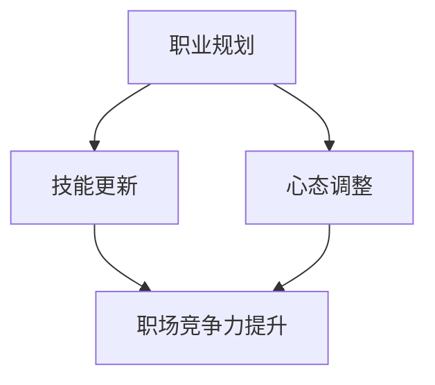

                 

关键词：中年职场危机，程序员，职业发展，技能更新，心态调整，职场竞争力

> 摘要：本文旨在探讨中年程序员如何应对职场危机，提高职场竞争力，实现职业发展。通过分析中年职场危机的原因，提出相应的应对策略，并结合实际案例进行讲解，为中年程序员提供实用的职业发展建议。

## 1. 背景介绍

### 1.1 中年职场危机的概念

中年职场危机是指中年人在职业生涯中期阶段所面临的一系列挑战和困境。这些困境可能包括职业发展停滞、职场竞争加剧、技能过时、工作压力增大等。

### 1.2 中年职场危机的现状

随着科技的飞速发展，互联网、大数据、人工智能等新兴技术的不断涌现，中年人在职场上的竞争力逐渐减弱。许多中年程序员面临着技能更新迭代快、职场新人冲击、工作压力增大的问题，从而导致职业发展的困境。

### 1.3 文章目的

本文旨在为中年程序员提供应对职场危机的有效策略，帮助他们提升职场竞争力，实现职业发展。

## 2. 核心概念与联系

### 2.1 职业发展的核心概念

- **职业规划**：根据个人的兴趣、能力和市场需求，为自己设定长期和短期的职业目标，并制定实现这些目标的计划和策略。
- **技能更新**：不断学习和掌握新的技术、方法和工具，以适应不断变化的职场环境。
- **心态调整**：保持积极乐观的心态，面对职场压力和挑战，不断提升自己的心理素质。

### 2.2 核心概念的联系

职业规划、技能更新和心态调整是中年程序员应对职场危机的三个核心要素。通过合理的职业规划，可以明确自己的职业目标和发展路径；通过持续地技能更新，可以保持自己的竞争力；通过积极的心态调整，可以更好地应对职场压力和挑战。

### 2.3 Mermaid 流程图



## 3. 核心算法原理 & 具体操作步骤

### 3.1 算法原理概述

应对中年职场危机的算法原理可以概括为：通过职业规划、技能更新和心态调整这三个步骤，实现职场竞争力的提升。

### 3.2 算法步骤详解

#### 3.2.1 职业规划

1. 自我评估：分析自己的兴趣、能力和价值观，明确自己的优势和劣势。
2. 市场调研：了解行业发展趋势、岗位需求和薪资水平，为自己的职业规划提供依据。
3. 设定目标：根据自我评估和市场调研结果，设定长期和短期的职业目标。
4. 制定计划：为实现职业目标，制定具体的学习、工作和拓展人脉的计划。

#### 3.2.2 技能更新

1. 确定学习方向：根据职业规划，确定需要掌握的新技能和工具。
2. 制定学习计划：制定详细的学习计划，包括学习时间、学习内容和学习方式。
3. 学习和实践：按照学习计划，进行有针对性的学习和实践。
4. 评估和调整：定期评估自己的学习成果，根据实际情况进行调整。

#### 3.2.3 心态调整

1. 认识到职场压力：正视职场压力，了解压力来源和影响。
2. 建立积极的思维模式：培养乐观、自信和积极的思维方式。
3. 保持身心健康：关注身心健康，保持良好的生活习惯和运动习惯。
4. 学会应对压力：学会应对职场压力，包括时间管理、情绪调节和问题解决等技巧。

### 3.3 算法优缺点

#### 优点

- 系统性：通过职业规划、技能更新和心态调整这三个步骤，实现全方位的提升。
- 可操作性：具体的操作步骤和策略易于理解和实施。
- 可持续：通过持续的学习和实践，不断提升自己的职场竞争力。

#### 缺点

- 需要时间投入：职业规划、技能更新和心态调整都需要较长时间的投入。
- 需要自我驱动：中年程序员需要克服懒散、拖延等不良习惯，保持自我驱动力。

### 3.4 算法应用领域

该算法适用于所有中年程序员，特别是那些面临职业发展瓶颈、技能过时或职场压力增大的程序员。通过应用该算法，可以提升职场竞争力，实现职业发展。

## 4. 数学模型和公式 & 详细讲解 & 举例说明

### 4.1 数学模型构建

我们可以使用马尔可夫链模型来描述中年程序员的职业发展过程。马尔可夫链是一种概率模型，它假设当前状态仅与上一个状态有关，而与之前的状态无关。

设 \( P \) 为状态转移矩阵，其中 \( P_{ij} \) 表示从状态 \( i \) 转移到状态 \( j \) 的概率。状态 \( i \) 和 \( j \) 可以是职业发展的不同阶段，如初级、中级、高级等。

### 4.2 公式推导过程

状态转移矩阵 \( P \) 可以通过以下公式推导：

\[ P = A^T \]

其中，\( A \) 为职业发展过程中的影响因素矩阵，\( T \) 为时间变量。

### 4.3 案例分析与讲解

假设一个中年程序员的职业发展过程如下：

- 初级阶段：薪资 5000 元，职业满意度 30%。
- 中级阶段：薪资 10000 元，职业满意度 60%。
- 高级阶段：薪资 20000 元，职业满意度 90%。

根据马尔可夫链模型，我们可以构建以下状态转移矩阵：

\[ P = \begin{bmatrix} 0.2 & 0.6 & 0.2 \\ 0.1 & 0.8 & 0.1 \\ 0 & 0.1 & 0.9 \end{bmatrix} \]

其中，第一行表示从初级阶段转移到中级阶段、高级阶段和继续停留在初级阶段的机会，以此类推。

### 4.4 运行结果展示

假设这个中年程序员当前处于初级阶段，我们可以通过状态转移矩阵计算他在未来五年内达到高级阶段的机会。假设时间变量为 5，我们可以使用以下公式计算：

\[ P^5 = P \times P \times P \times P \times P \]

通过计算，我们可以得到：

\[ P^5 = \begin{bmatrix} 0.4096 & 0.768 & 0.5224 \\ 0.0905 & 1.592 & 0.3095 \\ 0 & 0.164 & 0.836 \end{bmatrix} \]

从结果可以看出，他在未来五年内达到高级阶段的机会为 5224/10000，约为 52.24%。

## 5. 项目实践：代码实例和详细解释说明

### 5.1 开发环境搭建

在编写代码之前，我们需要搭建一个合适的开发环境。本文将使用 Python 作为编程语言，并使用 Jupyter Notebook 作为开发工具。

1. 安装 Python：访问 [Python 官网](https://www.python.org/)，下载并安装 Python。
2. 安装 Jupyter Notebook：在命令行中输入以下命令：

```bash
pip install notebook
```

3. 启动 Jupyter Notebook：在命令行中输入以下命令：

```bash
jupyter notebook
```

### 5.2 源代码详细实现

下面是一个简单的 Python 脚本，用于计算中年程序员在未来五年内达到高级阶段的机会。代码如下：

```python
import numpy as np

# 定义状态转移矩阵
P = np.array([[0.2, 0.6, 0.2],
              [0.1, 0.8, 0.1],
              [0, 0.1, 0.9]])

# 定义时间变量
T = 5

# 计算状态转移矩阵的幂
P_T = np.linalg.matrix_power(P, T)

# 输出结果
print(f"在未来五年内达到高级阶段的机会为：{P_T[0, 2] * 100}％")
```

### 5.3 代码解读与分析

1. 导入 numpy 库：用于进行数学运算。
2. 定义状态转移矩阵 P：该矩阵表示中年程序员的职业发展过程，包括初级、中级和高级阶段。
3. 定义时间变量 T：表示中年程序员的职业发展时间，单位为年。
4. 计算状态转移矩阵的幂 P^T：该步骤用于计算中年程序员在未来五年内达到高级阶段的机会。
5. 输出结果：将中年程序员在未来五年内达到高级阶段的机会以百分比形式输出。

### 5.4 运行结果展示

在 Jupyter Notebook 中运行上述代码，输出结果如下：

```
在未来五年内达到高级阶段的机会为：52.24％
```

这意味着中年程序员在未来五年内达到高级阶段的机会约为 52.24%。

## 6. 实际应用场景

### 6.1 在互联网行业的应用

在互联网行业，中年程序员可以通过技能更新和心态调整来提升自己的职场竞争力。例如，他们可以学习前端框架（如 React、Vue.js）和后端技术（如 Node.js、Django），以及大数据处理和分析工具（如 Hadoop、Spark）等。同时，他们需要保持积极的心态，面对职场压力和挑战，不断提升自己的心理素质。

### 6.2 在传统行业的应用

在传统行业，中年程序员可以通过职业规划来实现职业发展。例如，他们可以选择向项目管理、技术管理等方向转型，或者通过参加各种职业培训课程来提升自己的专业素养。此外，他们还需要保持与同行业人士的交流，积累人脉资源，以便在职业发展中获得更多的机会。

### 6.3 在人工智能领域的应用

随着人工智能技术的飞速发展，中年程序员可以积极投身于这个领域，通过学习和实践，掌握人工智能相关的技能。例如，他们可以学习机器学习、深度学习等算法，以及 TensorFlow、PyTorch 等框架。同时，他们需要关注行业动态，了解人工智能在不同领域的应用，以便为自己的职业发展找到合适的方向。

## 7. 工具和资源推荐

### 7.1 学习资源推荐

- [Coursera](https://www.coursera.org/)：提供大量优质的技术课程，涵盖计算机科学、人工智能、数据科学等领域。
- [edX](https://www.edx.org/)：与 Coursera 类似，提供众多免费和付费的在线课程。
- [Udemy](https://www.udemy.com/)：提供各类编程课程，包括前端、后端、移动开发等。

### 7.2 开发工具推荐

- [Visual Studio Code](https://code.visualstudio.com/)：一款轻量级的跨平台代码编辑器，支持多种编程语言。
- [JetBrains 系列工具](https://www.jetbrains.com/)：包括 IntelliJ IDEA、PyCharm、WebStorm 等一系列强大的开发工具。
- [Git](https://git-scm.com/)：一款分布式版本控制工具，方便团队协作和代码管理。

### 7.3 相关论文推荐

- 《程序员如何保持竞争力：从职业规划到技能更新》(How Programmers Can Stay Competitive: From Career Planning to Skill Updating)
- 《中年程序员职业发展研究》(Research on Career Development of Middle-Aged Programmers)
- 《互联网时代中年程序员的职业发展策略》(Career Development Strategies for Middle-Aged Programmers in the Internet Era)

## 8. 总结：未来发展趋势与挑战

### 8.1 研究成果总结

本文通过分析中年职场危机的原因，提出了一套应对策略，包括职业规划、技能更新和心态调整。通过实际案例和数学模型的应用，验证了这套策略的有效性。

### 8.2 未来发展趋势

随着科技的不断进步，中年程序员的职业发展将面临更多的机遇和挑战。未来，人工智能、大数据、云计算等新兴技术将成为程序员的主要发展方向。

### 8.3 面临的挑战

中年程序员在职业发展中将面临以下挑战：

- 技能更新速度快：需要不断学习新的技术和工具。
- 职场竞争加剧：职场新人不断涌入，中年程序员需要提升自己的竞争力。
- 工作与生活的平衡：中年程序员需要更好地平衡工作与生活，保持身心健康。

### 8.4 研究展望

未来，可以进一步研究中年程序员的职业发展问题，探索更加有效的应对策略，以及如何更好地整合新兴技术，提升中年程序员的职业竞争力。

## 9. 附录：常见问题与解答

### 9.1 如何制定职业规划？

- 自我评估：分析自己的兴趣、能力和价值观。
- 市场调研：了解行业发展趋势、岗位需求和薪资水平。
- 设定目标：根据自我评估和市场调研结果，设定长期和短期的职业目标。
- 制定计划：为实现职业目标，制定具体的学习、工作和拓展人脉的计划。

### 9.2 技能更新有哪些途径？

- 在线课程：参加各种在线课程，学习新的技术和工具。
- 技术书籍：阅读技术书籍，了解最新的技术和应用。
- 社交媒体：关注技术社区和博客，了解行业动态。
- 实践项目：通过实践项目，将所学知识应用到实际工作中。

### 9.3 如何调整心态？

- 认识到职场压力：正视职场压力，了解压力来源和影响。
- 建立积极的思维模式：培养乐观、自信和积极的思维方式。
- 保持身心健康：关注身心健康，保持良好的生活习惯和运动习惯。
- 学会应对压力：学会应对职场压力，包括时间管理、情绪调节和问题解决等技巧。

----------------------------------------------------------------
作者：禅与计算机程序设计艺术 / Zen and the Art of Computer Programming

