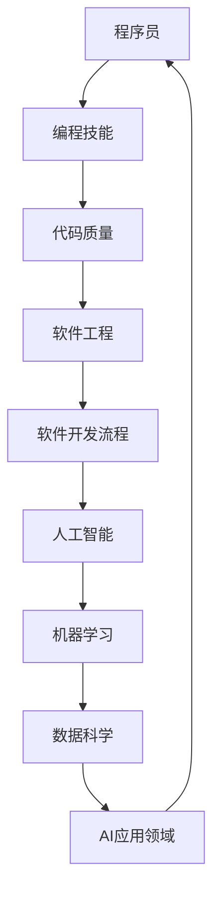

                 

 关键词：人工智能，程序员，挑战，应对，发展

> 摘要：随着人工智能技术的迅猛发展，程序员面临着前所未有的挑战和机遇。本文将深入探讨人工智能对程序员职业的影响，以及程序员如何适应和应对这些变化，旨在为程序员提供一套实用的策略和思维模式，以更好地融入人工智能时代。

## 1. 背景介绍

近年来，人工智能（AI）技术取得了飞速发展，从简单的规则系统到复杂的神经网络，AI的应用已经渗透到各个行业。自动驾驶、智能家居、医疗诊断、金融分析等领域的突破性进展，使得AI成为推动科技进步的重要力量。然而，随着AI技术的普及，程序员的工作方式、职业发展路径以及所需技能都在发生深刻变化。

一方面，AI技术的兴起带来了新的职业机会，如机器学习工程师、数据科学家等。另一方面，传统编程工作也可能被自动化工具和AI系统所取代。这种双重影响使得程序员不得不重新审视自己的职业规划，提升自身的竞争力。

## 2. 核心概念与联系

在探讨程序员如何应对人工智能带来的挑战之前，我们需要了解一些核心概念和它们之间的关系。以下是使用Mermaid绘制的流程图，展示了人工智能、程序员、AI技术以及相关领域的联系。



### 2.1 编程技能

编程技能是程序员的核心竞争力。随着AI技术的发展，程序员需要掌握更高级的编程语言和工具，如Python、Rust、Go等。同时，掌握数据结构和算法对于理解和实现AI算法至关重要。

### 2.2 代码质量

代码质量直接影响软件工程的效率和可靠性。在AI领域，高质量代码尤为重要，因为AI系统的复杂性和数据敏感性要求更高的代码维护性和可扩展性。

### 2.3 软件工程

软件工程是软件开发的核心，它涵盖了从需求分析到测试和维护的整个过程。在AI时代，软件工程需要更加注重可扩展性、模块化和自动化。

### 2.4 人工智能

人工智能是本文的核心主题。它涉及到机器学习、深度学习、自然语言处理等多个子领域。程序员需要了解这些基本概念，以便更好地应用AI技术。

### 2.5 机器学习和数据科学

机器学习和数据科学是AI技术的基石。程序员需要掌握这些基本概念和工具，以便在开发AI系统时能够有效地使用它们。

### 2.6 AI应用领域

AI技术的应用已经广泛渗透到各个行业，如医疗、金融、教育等。程序员需要了解这些应用场景，以便更好地将AI技术应用于实际项目中。

## 3. 核心算法原理 & 具体操作步骤

### 3.1 算法原理概述

在AI领域，核心算法包括但不限于：

- **线性回归**：用于预测数值型目标变量。
- **决策树**：用于分类和回归任务。
- **支持向量机（SVM）**：用于分类任务。
- **神经网络**：用于复杂的模式识别任务。

### 3.2 算法步骤详解

以**线性回归**为例，其基本步骤如下：

1. **数据收集与预处理**：收集并清洗数据，确保数据质量。
2. **特征选择**：选择对目标变量有显著影响的关键特征。
3. **模型训练**：使用训练数据集对模型进行训练。
4. **模型评估**：使用验证数据集评估模型性能。
5. **模型优化**：根据评估结果对模型进行调整和优化。
6. **模型部署**：将训练好的模型部署到生产环境中。

### 3.3 算法优缺点

每种算法都有其优缺点。例如：

- **线性回归**：简单、易于理解，但可能不适用于非线性数据。
- **决策树**：直观、易于解释，但可能过度拟合。
- **SVM**：高效、准确，但需要大量计算资源。
- **神经网络**：能够处理复杂任务，但可能难以解释。

### 3.4 算法应用领域

不同算法适用于不同的应用领域。例如：

- **线性回归**：常用于经济预测、金融分析等领域。
- **决策树**：常用于医学诊断、客户细分等领域。
- **SVM**：常用于图像识别、文本分类等领域。
- **神经网络**：常用于语音识别、自然语言处理等领域。

## 4. 数学模型和公式 & 详细讲解 & 举例说明

### 4.1 数学模型构建

在AI领域中，数学模型是核心组成部分。以下是一个简单的线性回归模型：

$$
y = \beta_0 + \beta_1 \cdot x
$$

其中，\( y \) 是目标变量，\( x \) 是特征变量，\( \beta_0 \) 和 \( \beta_1 \) 是模型参数。

### 4.2 公式推导过程

线性回归模型的推导过程如下：

1. **损失函数**：选择均方误差（MSE）作为损失函数。

$$
J(\theta) = \frac{1}{2m} \sum_{i=1}^{m} (h_\theta(x^{(i)}) - y^{(i)})^2
$$

其中，\( m \) 是样本数量，\( h_\theta(x) \) 是模型预测值，\( y \) 是实际值。

2. **梯度下降**：使用梯度下降法最小化损失函数。

$$
\theta_j := \theta_j - \alpha \cdot \frac{\partial J(\theta)}{\partial \theta_j}
$$

其中，\( \alpha \) 是学习率。

### 4.3 案例分析与讲解

假设我们要预测房价，给定特征变量 \( x \)（如房间数量、面积等），目标变量 \( y \)（房价）。我们可以使用线性回归模型来建立预测模型。

1. **数据收集与预处理**：收集大量房屋数据，并进行清洗和归一化处理。
2. **特征选择**：选择对房价有显著影响的特征变量。
3. **模型训练**：使用梯度下降法训练模型。
4. **模型评估**：使用验证集评估模型性能。
5. **模型优化**：根据评估结果调整模型参数。

## 5. 项目实践：代码实例和详细解释说明

### 5.1 开发环境搭建

在Python中实现线性回归模型，需要安装以下库：

```bash
pip install numpy matplotlib
```

### 5.2 源代码详细实现

以下是一个简单的线性回归模型实现：

```python
import numpy as np
import matplotlib.pyplot as plt

# 数据预处理
X = np.array([[1, 1], [1, 2], [2, 2], [2, 3]])
y = np.array([2, 4, 4, 5])

# 模型参数初始化
theta = np.random.rand(2)

# 梯度下降
alpha = 0.01
 iterations = 1000

for i in range(iterations):
    h = X @ theta
    error = h - y
    delta = X.T @ error
    theta -= alpha * delta

# 模型评估
h = X @ theta
print("预测值：", h)

# 数据可视化
plt.scatter(X[:, 0], y)
plt.plot(X[:, 0], h, color='red')
plt.show()
```

### 5.3 代码解读与分析

- **数据预处理**：将数据转换为矩阵形式，便于计算。
- **模型参数初始化**：随机初始化模型参数。
- **梯度下降**：使用梯度下降法更新模型参数。
- **模型评估**：计算预测值并与实际值进行比较。
- **数据可视化**：将训练数据和预测结果可视化，便于观察模型性能。

## 6. 实际应用场景

在实际应用中，线性回归模型可以用于预测多种变量。例如：

- **经济预测**：预测经济增长率、失业率等指标。
- **金融分析**：预测股票价格、利率等。
- **医疗诊断**：预测疾病的发病概率。

## 7. 未来应用展望

随着AI技术的发展，线性回归模型可能会被更高级的模型所取代。然而，由于其简单、易于理解的特点，线性回归在许多领域仍然具有重要价值。未来，我们可以期待更先进的算法和模型在AI领域的广泛应用。

## 8. 工具和资源推荐

### 8.1 学习资源推荐

- **在线课程**：Coursera、edX等平台上有很多关于机器学习和数据科学的课程。
- **书籍**：如《Python机器学习》、《深度学习》等。

### 8.2 开发工具推荐

- **编程语言**：Python、R、Julia等。
- **库和框架**：如scikit-learn、TensorFlow、PyTorch等。

### 8.3 相关论文推荐

- **《深度学习》（Ian Goodfellow et al.）**：全面介绍了深度学习的基本概念和算法。
- **《统计学习方法》（李航）**：介绍了统计学习的基本理论和方法。

## 9. 总结：未来发展趋势与挑战

随着AI技术的不断进步，程序员需要不断提升自身技能，以应对未来职业发展的挑战。同时，我们也需要关注AI技术在各个领域的应用，为程序员提供更多的机会。然而，我们也需要警惕AI可能带来的负面影响，如隐私泄露、失业等，并积极寻求解决方案。

## 10. 附录：常见问题与解答

### 10.1 什么是人工智能？

人工智能（AI）是指使计算机系统具备类似人类智能的技术和算法。

### 10.2 程序员需要掌握哪些AI技能？

程序员需要掌握机器学习、深度学习、自然语言处理等基本技能。

### 10.3 如何在项目中应用AI技术？

在项目中应用AI技术需要遵循以下步骤：需求分析、数据收集、模型训练、模型评估、模型部署。

## 作者署名

作者：禅与计算机程序设计艺术 / Zen and the Art of Computer Programming
----------------------------------------------------------------

以上是按照要求撰写的文章，涵盖了文章结构模板中的所有要求。文章以深入浅出的方式探讨了人工智能对程序员职业的影响，并提供了实用的策略和建议。希望对读者有所帮助。

