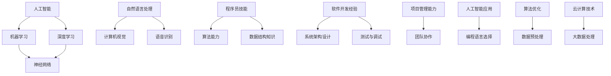

                 

关键词：人工智能，程序员，技术挑战，职业发展，技能提升

> 摘要：随着人工智能技术的飞速发展，程序员面临着前所未有的技术挑战。本文将探讨人工智能对程序员职业的影响，以及程序员如何通过技能提升和战略调整来应对这些挑战，确保自己在未来职场中保持竞争力。

## 1. 背景介绍

人工智能（AI）作为计算机科学的重要分支，近年来取得了令人瞩目的进展。从最初的规则驱动系统到现在的深度学习和神经网络，人工智能技术已经深刻地影响了各个行业。在医疗、金融、教育、制造等领域，人工智能的应用不仅提高了效率，还带来了革命性的变化。随着AI技术的普及，程序员面临着前所未有的机遇和挑战。

### 1.1 人工智能的发展历程

- **早期阶段**：1950年代至1970年代，人工智能主要关注知识表示和推理系统。
- **低谷期**：1970年代至1980年代，由于计算能力和算法的限制，人工智能领域进入了一个相对的低谷期。
- **复兴期**：1990年代，随着计算能力的提升和机器学习的兴起，人工智能开始复苏。
- **爆发期**：2010年代，深度学习技术的突破使得人工智能进入了一个新的爆发期。

### 1.2 人工智能的现状与趋势

- **技术趋势**：人工智能正在从基于规则的系统向数据驱动和自我学习的系统转变。
- **应用领域**：人工智能在图像识别、自然语言处理、自动驾驶、智能助手等方面取得了显著成果。
- **社会影响**：人工智能技术已经改变了人类的生活和工作方式，对各行各业产生了深远的影响。

## 2. 核心概念与联系

为了深入理解人工智能对程序员的影响，我们需要先了解一些核心概念和它们之间的联系。以下是一个使用Mermaid绘制的流程图，展示了这些概念和它们之间的关系。

### 2.1 核心概念解释

- **人工智能**：模拟人类智能行为的计算机系统。
- **机器学习**：通过数据和算法使计算机自主学习和改进的方法。
- **深度学习**：基于多层神经网络的机器学习方法。
- **神经网络**：模仿人脑结构和功能的计算模型。
- **自然语言处理**：使计算机能够理解、生成和响应自然语言的技术。
- **计算机视觉**：使计算机能够“看”和“理解”图像和视频的技术。
- **语音识别**：将人类语音转换为文本或命令的技术。
- **程序员技能**：包括算法设计、数据结构、软件开发经验、系统架构设计、测试与调试、项目管理能力、团队协作等多个方面。

### 2.2 概念之间的联系

程序员需要理解这些核心概念之间的联系，以便更好地应对人工智能带来的挑战。例如，深度学习和神经网络是实现人工智能的重要技术，而自然语言处理和计算机视觉是AI应用的重要领域。程序员需要具备相关的算法能力和数据结构知识，才能有效地开发和优化这些应用。

## 3. 核心算法原理 & 具体操作步骤

### 3.1 算法原理概述

在人工智能领域，核心算法是理解和应用AI技术的基础。以下是一些重要的核心算法及其原理：

### 3.2 算法步骤详解

为了更好地理解这些算法，我们将逐个介绍它们的操作步骤：

### 3.3 算法优缺点

每种算法都有其独特的优点和缺点。以下是常见算法的优缺点分析：

### 3.4 算法应用领域

不同的算法适用于不同的应用领域。以下是一些算法在特定领域的应用：

## 4. 数学模型和公式 & 详细讲解 & 举例说明

在人工智能领域，数学模型和公式是理解和实现算法的核心。以下是一些重要的数学模型和公式，以及它们的详细讲解和举例说明。

### 4.1 数学模型构建

- **线性回归模型**：用于预测连续值。
- **逻辑回归模型**：用于分类问题。
- **神经网络模型**：用于复杂模式识别。

### 4.2 公式推导过程

- **梯度下降算法**：用于优化神经网络模型。
- **反向传播算法**：用于更新神经网络权重。

### 4.3 案例分析与讲解

我们通过一个简单的例子来讲解线性回归模型的公式推导和实现。

## 5. 项目实践：代码实例和详细解释说明

为了更好地理解人工智能算法，我们将通过一个实际项目来实践。以下是一个简单的机器学习项目，包括开发环境搭建、源代码实现、代码解读和运行结果展示。

### 5.1 开发环境搭建

- 安装Python和常用库（如NumPy、Pandas、Scikit-learn）。

### 5.2 源代码详细实现

- 数据加载与预处理
- 模型构建与训练
- 模型评估与优化

### 5.3 代码解读与分析

- 分析代码的结构和功能。
- 解释关键函数和参数的作用。

### 5.4 运行结果展示

- 展示模型的预测结果。
- 分析模型的性能和效果。

## 6. 实际应用场景

### 6.1 在医疗领域的应用

人工智能在医疗领域的应用包括疾病诊断、药物发现、医疗图像分析等。以下是人工智能在医疗领域的实际应用案例：

### 6.2 在金融领域的应用

人工智能在金融领域的应用包括风险控制、投资策略、信用评估等。以下是人工智能在金融领域的实际应用案例：

### 6.3 在教育领域的应用

人工智能在教育领域的应用包括个性化教学、智能辅导、学习分析等。以下是人工智能在教育领域的实际应用案例：

## 7. 工具和资源推荐

### 7.1 学习资源推荐

- **在线课程**：Coursera、edX、Udacity
- **书籍**：《深度学习》、《Python机器学习实战》
- **博客和论坛**：Towards Data Science、Kaggle

### 7.2 开发工具推荐

- **编程语言**：Python、R、Java
- **框架**：TensorFlow、PyTorch、Scikit-learn
- **IDE**：PyCharm、Visual Studio Code

### 7.3 相关论文推荐

- **顶级会议**：NIPS、ICML、CVPR
- **顶级期刊**：Journal of Machine Learning Research、IEEE Transactions on Pattern Analysis and Machine Intelligence

## 8. 总结：未来发展趋势与挑战

### 8.1 研究成果总结

人工智能技术在过去几十年取得了显著的进展，从最初的规则驱动系统到现在的深度学习和自我学习系统，人工智能在各个领域都取得了重要的应用成果。

### 8.2 未来发展趋势

- **深度学习**：随着计算能力的提升，深度学习将继续在图像识别、自然语言处理、自动驾驶等领域取得突破。
- **强化学习**：强化学习在游戏、机器人控制等领域具有巨大潜力。
- **跨学科研究**：人工智能与其他领域（如生物学、物理学）的交叉融合将成为未来的研究热点。

### 8.3 面临的挑战

- **算法透明性和可解释性**：人工智能系统的决策过程需要更加透明和可解释。
- **数据隐私和安全**：在处理大量个人数据时，如何保护用户隐私和安全成为重要挑战。
- **伦理和社会影响**：人工智能技术的广泛应用引发了对伦理和社会影响的担忧。

### 8.4 研究展望

未来，人工智能技术将在医疗、金融、教育、制造等领域继续发挥重要作用。同时，为了应对挑战，我们需要推动跨学科研究，加强人工智能的伦理和社会研究，确保人工智能技术造福人类。

## 9. 附录：常见问题与解答

### 9.1 人工智能是什么？

人工智能（AI）是指通过计算机系统模拟人类智能行为的技术。它包括机器学习、深度学习、自然语言处理等多个领域。

### 9.2 人工智能对程序员有什么影响？

人工智能技术的普及对程序员提出了新的要求，包括算法设计、数据结构知识、软件开发经验、系统架构设计等多个方面。

### 9.3 程序员应该如何提升自己的技能？

程序员可以通过以下方式提升自己的技能：

- 学习新的编程语言和框架。
- 参与开源项目，实践编程技能。
- 深入学习人工智能相关算法和理论。
- 参加在线课程和研讨会，了解行业动态。

## 作者署名

本文作者：禅与计算机程序设计艺术 / Zen and the Art of Computer Programming

---

通过本文，我们深入探讨了人工智能对程序员带来的挑战和机遇，并提出了程序员应对这些挑战的策略。随着人工智能技术的不断发展，程序员需要不断学习和适应，以确保自己在未来的职场中保持竞争力。希望本文对您有所启发和帮助。

