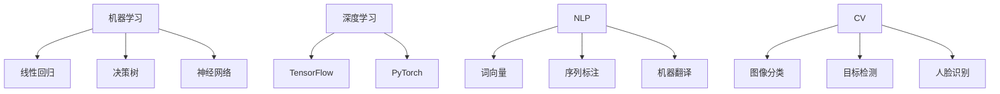

                 

随着人工智能技术的迅速发展，程序员面临着前所未有的挑战和机遇。本文将探讨程序员如何应对人工智能带来的挑战，并为其未来发展提供指导。本文分为以下几个部分：

- **背景介绍**：介绍人工智能的发展历程及其对程序员的影响。
- **核心概念与联系**：阐述人工智能的核心概念及其与程序员工作相关的联系。
- **核心算法原理 & 具体操作步骤**：介绍人工智能的关键算法及其应用。
- **数学模型和公式 & 详细讲解 & 举例说明**：讲解人工智能中的数学模型和公式。
- **项目实践：代码实例和详细解释说明**：通过实际代码实例展示人工智能的应用。
- **实际应用场景**：分析人工智能在不同领域的应用。
- **未来应用展望**：探讨人工智能的未来发展趋势和影响。
- **工具和资源推荐**：推荐学习资源和开发工具。
- **总结：未来发展趋势与挑战**：总结研究成果，展望未来。
- **附录：常见问题与解答**：回答读者可能关心的问题。

## 1. 背景介绍

人工智能（Artificial Intelligence，AI）是指通过计算机模拟人类智能，使计算机能够自主学习和智能决策的技术。自从1956年达特茅斯会议上人工智能概念首次提出以来，人工智能已经经历了数十年的发展。随着计算能力的提升、大数据的积累和算法的进步，人工智能在各个领域都取得了显著成果。

对于程序员来说，人工智能的兴起带来了巨大的影响。一方面，人工智能技术的发展使得程序员的工作更加高效和自动化，例如代码生成、自动测试、智能调试等；另一方面，人工智能的出现也改变了程序员的工作模式，程序员需要学习和掌握新的技术和工具，以适应不断变化的需求。

### 人工智能的发展历程

人工智能的发展历程可以分为以下几个阶段：

- **理论研究阶段（1956-1974）**：在这一阶段，人工智能的概念被提出，并开始进行理论研究。这一时期的代表性工作包括“逻辑理论家”程序和“通用问题求解器”等。

- **应用探索阶段（1974-1980）**：随着计算机硬件的发展，人工智能技术开始应用于实际问题，如自然语言处理、计算机视觉等。这一时期出现了许多重要的研究成果，如语音识别系统、机器翻译系统等。

- **低谷阶段（1980-1993）**：在1980年代，由于过高的期望和实际应用的局限性，人工智能研究进入了低谷阶段。这一时期的代表性事件包括“专家系统”的兴起和衰落。

- **复兴阶段（1993-2000）**：随着互联网的发展，人工智能技术开始应用于互联网应用，如搜索引擎、推荐系统等。这一时期，人工智能技术取得了显著进展，如深度学习、强化学习等。

- **快速发展阶段（2000至今）**：在21世纪，人工智能技术取得了突破性进展，如图像识别、语音识别、自然语言处理等。人工智能开始广泛应用于各个领域，如医疗、金融、教育、制造业等。

### 人工智能对程序员的影响

人工智能对程序员的影响主要体现在以下几个方面：

- **提高编程效率**：人工智能技术可以帮助程序员进行代码生成、自动测试、智能调试等，从而提高编程效率。

- **改变工作模式**：人工智能技术的发展使得程序员的工作模式发生了变化，程序员需要更多地关注业务逻辑，而不是重复性的代码编写。

- **扩大工作范围**：人工智能技术的应用使得程序员可以涉足更多领域，如数据分析、机器学习、自然语言处理等。

- **提升创新能力**：人工智能技术的发展为程序员提供了更多创新的机会，程序员可以尝试开发新的应用，解决实际问题。

## 2. 核心概念与联系

### 人工智能的核心概念

人工智能的核心概念包括以下几个：

- **机器学习（Machine Learning）**：机器学习是人工智能的核心技术之一，它通过训练模型，使计算机能够从数据中学习规律，并进行预测和决策。

- **深度学习（Deep Learning）**：深度学习是机器学习的一个重要分支，它使用多层神经网络进行学习，能够处理复杂的非线性问题。

- **自然语言处理（Natural Language Processing，NLP）**：自然语言处理是人工智能的一个重要领域，它涉及计算机对自然语言的理解和生成。

- **计算机视觉（Computer Vision）**：计算机视觉是人工智能的另一个重要领域，它涉及计算机对图像和视频的分析和理解。

### 核心概念与程序员工作的联系

人工智能的核心概念与程序员的工作密切相关，程序员需要了解这些概念，以便更好地应对人工智能带来的挑战。

- **机器学习**：程序员需要掌握机器学习算法，如线性回归、决策树、神经网络等，以便开发机器学习应用。

- **深度学习**：深度学习在图像识别、语音识别等任务中取得了显著成果，程序员需要掌握深度学习框架，如TensorFlow、PyTorch等，以便开发深度学习应用。

- **自然语言处理**：程序员需要掌握自然语言处理技术，如词向量、序列标注、机器翻译等，以便开发自然语言处理应用。

- **计算机视觉**：程序员需要掌握计算机视觉技术，如图像分类、目标检测、人脸识别等，以便开发计算机视觉应用。

### Mermaid 流程图

为了更好地展示人工智能的核心概念及其与程序员工作的联系，我们可以使用 Mermaid 流程图来表示。以下是一个简化的 Mermaid 流程图：



## 3. 核心算法原理 & 具体操作步骤

### 3.1 算法原理概述

在人工智能领域，有许多核心算法，其中一些算法在各个领域都得到了广泛应用。以下介绍几种常用的算法原理。

#### 3.1.1 机器学习算法

机器学习算法是一种从数据中学习规律的方法，其主要思想是通过训练模型，使计算机能够对未知数据进行预测。机器学习算法可以分为监督学习、无监督学习和强化学习。

- **监督学习（Supervised Learning）**：监督学习是机器学习的一种形式，它通过训练模型，使模型能够对已知数据进行分类或回归。

  - **线性回归（Linear Regression）**：线性回归是一种简单的监督学习算法，它通过拟合一条直线，使预测值与实际值尽可能接近。

  - **决策树（Decision Tree）**：决策树是一种基于树形结构的监督学习算法，它通过一系列条件判断，将数据分为不同的类别或回归值。

- **无监督学习（Unsupervised Learning）**：无监督学习是机器学习的另一种形式，它通过分析未标记的数据，找出数据中的模式或结构。

  - **聚类（Clustering）**：聚类是一种将数据分为若干个群组的方法，使同一群组内的数据尽可能相似，不同群组的数据尽可能不同。

  - **主成分分析（Principal Component Analysis，PCA）**：主成分分析是一种降维方法，它通过将数据投影到新的坐标系上，保留主要的信息，去除冗余的信息。

- **强化学习（Reinforcement Learning）**：强化学习是一种通过试错学习的方法，使计算机能够通过与环境互动，学习到最优策略。

#### 3.1.2 深度学习算法

深度学习是一种基于多层神经网络的机器学习算法，它在图像识别、语音识别等任务中取得了显著成果。深度学习算法的核心思想是通过多层神经网络，对数据进行抽象和表示。

- **卷积神经网络（Convolutional Neural Network，CNN）**：卷积神经网络是一种用于图像识别和处理的深度学习算法，它通过卷积操作，提取图像的特征。

- **循环神经网络（Recurrent Neural Network，RNN）**：循环神经网络是一种用于序列数据处理和预测的深度学习算法，它通过循环结构，处理序列数据。

#### 3.1.3 自然语言处理算法

自然语言处理是一种使计算机能够理解和生成自然语言的方法，它广泛应用于机器翻译、情感分析、问答系统等领域。

- **词向量（Word Embedding）**：词向量是一种将词语映射为向量的方法，它通过向量空间表示词语的关系。

- **序列标注（Sequence Labeling）**：序列标注是一种对序列数据进行分类的方法，它将每个序列数据中的词语进行标注。

### 3.2 算法步骤详解

#### 3.2.1 机器学习算法步骤

1. **数据收集**：收集用于训练的数据集，这些数据集可以是标记数据（监督学习）或未标记数据（无监督学习）。

2. **数据预处理**：对数据进行清洗、归一化等操作，使数据适合算法训练。

3. **模型选择**：根据任务需求，选择合适的模型，如线性回归、决策树、聚类等。

4. **模型训练**：使用训练数据集，对模型进行训练，使模型能够学习到数据的规律。

5. **模型评估**：使用验证数据集，对模型进行评估，选择最佳模型。

6. **模型应用**：使用测试数据集，对模型进行测试，评估模型在实际数据上的表现。

#### 3.2.2 深度学习算法步骤

1. **数据收集**：收集用于训练的数据集，这些数据集通常是大型图像、语音或文本数据。

2. **数据预处理**：对数据进行预处理，如归一化、标准化等。

3. **模型构建**：使用深度学习框架（如TensorFlow、PyTorch等），构建神经网络模型。

4. **模型训练**：使用训练数据集，对模型进行训练，调整模型参数。

5. **模型评估**：使用验证数据集，对模型进行评估。

6. **模型优化**：根据评估结果，对模型进行调整，优化模型性能。

7. **模型应用**：使用测试数据集，对模型进行测试，评估模型在实际数据上的表现。

#### 3.2.3 自然语言处理算法步骤

1. **数据收集**：收集用于训练的数据集，这些数据集通常是标记文本数据。

2. **数据预处理**：对文本数据进行预处理，如分词、去停用词等。

3. **模型构建**：使用自然语言处理框架（如NLTK、spaCy等），构建文本处理模型。

4. **模型训练**：使用训练数据集，对模型进行训练。

5. **模型评估**：使用验证数据集，对模型进行评估。

6. **模型优化**：根据评估结果，对模型进行调整。

7. **模型应用**：使用测试数据集，对模型进行测试。

### 3.3 算法优缺点

#### 3.3.1 机器学习算法优缺点

- **优点**：
  - **通用性**：机器学习算法适用于各种领域，可以解决分类、回归、聚类等问题。
  - **灵活性**：机器学习算法可以根据不同的任务需求，选择合适的模型和参数。

- **缺点**：
  - **计算复杂度**：机器学习算法通常需要大量计算资源，训练时间较长。
  - **数据需求**：机器学习算法需要大量的训练数据，数据质量对算法性能有较大影响。

#### 3.3.2 深度学习算法优缺点

- **优点**：
  - **强大的表达力**：深度学习算法能够处理复杂的数据结构和任务，如图像识别、语音识别等。
  - **自动特征提取**：深度学习算法能够自动提取数据中的特征，减轻了人工特征提取的负担。

- **缺点**：
  - **计算资源需求**：深度学习算法需要大量的计算资源和存储空间。
  - **数据依赖性**：深度学习算法的性能对数据质量有较高要求，数据集的选择和预处理对算法效果有很大影响。

#### 3.3.3 自然语言处理算法优缺点

- **优点**：
  - **高效性**：自然语言处理算法能够快速处理大量文本数据。
  - **灵活性**：自然语言处理算法可以应用于各种文本任务，如情感分析、机器翻译等。

- **缺点**：
  - **语言复杂性**：自然语言处理算法需要处理自然语言的复杂性，如歧义、多义性等。
  - **计算资源需求**：自然语言处理算法通常需要大量的计算资源和存储空间。

### 3.4 算法应用领域

机器学习、深度学习和自然语言处理算法在各个领域都得到了广泛应用，以下列举几个典型应用领域：

- **图像识别**：深度学习算法在图像识别领域取得了显著成果，如人脸识别、物体识别等。
- **自然语言处理**：自然语言处理算法广泛应用于机器翻译、情感分析、问答系统等领域。
- **推荐系统**：机器学习算法在推荐系统中发挥了重要作用，如电商推荐、音乐推荐等。
- **金融领域**：机器学习算法在金融领域得到了广泛应用，如风险控制、信用评估等。
- **医疗领域**：机器学习算法在医疗领域具有广泛的应用前景，如疾病预测、医学图像分析等。

## 4. 数学模型和公式 & 详细讲解 & 举例说明

在人工智能领域，数学模型和公式是理解和应用算法的基础。以下将介绍几种常见的数学模型和公式，并对其进行详细讲解和举例说明。

### 4.1 数学模型构建

数学模型是人工智能算法的核心组成部分，它通过数学语言描述问题，并提供解决问题的方法。构建数学模型通常包括以下几个步骤：

1. **确定问题类型**：根据问题的性质，确定是分类问题、回归问题还是聚类问题等。

2. **定义变量**：确定问题中的变量，如输入变量、输出变量等。

3. **建立目标函数**：根据问题的要求，建立目标函数，如损失函数、优化目标等。

4. **约束条件**：根据问题的要求，设定约束条件，如线性约束、非线性约束等。

5. **求解方法**：选择合适的求解方法，如优化算法、梯度下降等。

### 4.2 公式推导过程

在人工智能领域，常见的数学公式包括线性回归公式、逻辑回归公式、梯度下降公式等。以下是对这些公式的推导过程进行简要介绍。

#### 4.2.1 线性回归公式

线性回归是一种简单的机器学习算法，用于预测连续值。线性回归公式如下：

$$
y = \beta_0 + \beta_1x
$$

其中，$y$ 为输出值，$x$ 为输入值，$\beta_0$ 和 $\beta_1$ 为模型参数。

推导过程如下：

1. **确定目标函数**：目标函数为损失函数，如均方误差（MSE）：

$$
J(\theta) = \frac{1}{2m}\sum_{i=1}^{m}(h_\theta(x^{(i)}) - y^{(i)})^2
$$

其中，$h_\theta(x)$ 为假设函数，$\theta$ 为模型参数。

2. **求导数**：对目标函数求导数，得到：

$$
\frac{\partial J(\theta)}{\partial \theta_0} = \frac{1}{m}\sum_{i=1}^{m}(h_\theta(x^{(i)}) - y^{(i)})
$$

$$
\frac{\partial J(\theta)}{\partial \theta_1} = \frac{1}{m}\sum_{i=1}^{m}(h_\theta(x^{(i)}) - y^{(i)})x^{(i)}
$$

3. **梯度下降**：选择合适的步长 $\alpha$，进行梯度下降：

$$
\theta_0 = \theta_0 - \alpha\frac{1}{m}\sum_{i=1}^{m}(h_\theta(x^{(i)}) - y^{(i)})
$$

$$
\theta_1 = \theta_1 - \alpha\frac{1}{m}\sum_{i=1}^{m}(h_\theta(x^{(i)}) - y^{(i)})x^{(i)}
$$

#### 4.2.2 逻辑回归公式

逻辑回归是一种用于分类的机器学习算法，它通过建立逻辑函数来预测类别。逻辑回归公式如下：

$$
h_\theta(x) = \frac{1}{1 + e^{(-\theta_0 - \theta_1x})}
$$

其中，$h_\theta(x)$ 为假设函数，$\theta_0$ 和 $\theta_1$ 为模型参数。

推导过程如下：

1. **确定目标函数**：目标函数为损失函数，如对数损失函数（Log Loss）：

$$
J(\theta) = -\frac{1}{m}\sum_{i=1}^{m}y^{(i)}\log(h_\theta(x^{(i)})) + (1 - y^{(i)})\log(1 - h_\theta(x^{(i)}))
$$

2. **求导数**：对目标函数求导数，得到：

$$
\frac{\partial J(\theta)}{\partial \theta_0} = \frac{1}{m}\sum_{i=1}^{m}(h_\theta(x^{(i)}) - y^{(i)})
$$

$$
\frac{\partial J(\theta)}{\partial \theta_1} = \frac{1}{m}\sum_{i=1}^{m}(h_\theta(x^{(i)}) - y^{(i)})x^{(i)}
$$

3. **梯度下降**：选择合适的步长 $\alpha$，进行梯度下降：

$$
\theta_0 = \theta_0 - \alpha\frac{1}{m}\sum_{i=1}^{m}(h_\theta(x^{(i)}) - y^{(i)})
$$

$$
\theta_1 = \theta_1 - \alpha\frac{1}{m}\sum_{i=1}^{m}(h_\theta(x^{(i)}) - y^{(i)})x^{(i)}
$$

#### 4.2.3 梯度下降公式

梯度下降是一种常用的优化方法，用于最小化目标函数。梯度下降公式如下：

$$
\theta_j = \theta_j - \alpha\frac{\partial J(\theta)}{\partial \theta_j}
$$

其中，$\theta_j$ 为模型参数，$\alpha$ 为步长。

推导过程如下：

1. **确定目标函数**：目标函数为损失函数，如均方误差（MSE）：

$$
J(\theta) = \frac{1}{2m}\sum_{i=1}^{m}(h_\theta(x^{(i)}) - y^{(i)})^2
$$

2. **求导数**：对目标函数求导数，得到：

$$
\frac{\partial J(\theta)}{\partial \theta_j} = \frac{1}{m}\sum_{i=1}^{m}(h_\theta(x^{(i)}) - y^{(i)})x_j^{(i)}
$$

3. **梯度下降**：选择合适的步长 $\alpha$，进行梯度下降：

$$
\theta_j = \theta_j - \alpha\frac{1}{m}\sum_{i=1}^{m}(h_\theta(x^{(i)}) - y^{(i)})x_j^{(i)}
$$

### 4.3 案例分析与讲解

为了更好地理解上述数学模型和公式，以下通过一个实际案例进行讲解。

#### 案例一：线性回归

假设我们有一个线性回归模型，用于预测房价。输入特征为房屋面积，输出值为房价。我们的目标是通过训练数据，找出最佳的线性回归模型。

1. **数据收集**：收集包含房屋面积和房价的数据集。

2. **数据预处理**：对数据集进行清洗、归一化等操作，使数据适合模型训练。

3. **模型构建**：建立线性回归模型，假设函数为 $h_\theta(x) = \beta_0 + \beta_1x$。

4. **模型训练**：使用梯度下降法，对模型参数进行训练。

5. **模型评估**：使用验证数据集，对模型进行评估，计算均方误差（MSE）。

6. **模型优化**：根据评估结果，对模型进行调整，优化模型性能。

7. **模型应用**：使用测试数据集，对模型进行测试，评估模型在实际数据上的表现。

#### 案例二：逻辑回归

假设我们有一个逻辑回归模型，用于判断一个邮件是否为垃圾邮件。输入特征为邮件的特征向量，输出值为概率值，概率值大于0.5表示邮件为垃圾邮件，否则为正常邮件。

1. **数据收集**：收集包含邮件特征和标签的数据集。

2. **数据预处理**：对数据集进行清洗、归一化等操作，使数据适合模型训练。

3. **模型构建**：建立逻辑回归模型，假设函数为 $h_\theta(x) = \frac{1}{1 + e^{(-\theta_0 - \theta_1x)}}$。

4. **模型训练**：使用梯度下降法，对模型参数进行训练。

5. **模型评估**：使用验证数据集，对模型进行评估，计算对数损失函数（Log Loss）。

6. **模型优化**：根据评估结果，对模型进行调整，优化模型性能。

7. **模型应用**：使用测试数据集，对模型进行测试，评估模型在实际数据上的表现。

#### 案例三：神经网络

假设我们有一个神经网络模型，用于对图像进行分类。输入特征为图像的像素值，输出值为类别标签。

1. **数据收集**：收集包含图像和标签的数据集。

2. **数据预处理**：对数据集进行清洗、归一化等操作，使数据适合模型训练。

3. **模型构建**：建立神经网络模型，使用卷积神经网络（CNN）进行图像分类。

4. **模型训练**：使用梯度下降法，对模型参数进行训练。

5. **模型评估**：使用验证数据集，对模型进行评估，计算分类准确率。

6. **模型优化**：根据评估结果，对模型进行调整，优化模型性能。

7. **模型应用**：使用测试数据集，对模型进行测试，评估模型在实际数据上的表现。

## 5. 项目实践：代码实例和详细解释说明

为了更好地理解人工智能算法在实际应用中的表现，我们将通过一个实际项目，展示如何使用 Python 实现一个简单的线性回归模型，并对代码进行详细解释。

### 5.1 开发环境搭建

在开始项目实践之前，我们需要搭建一个 Python 开发环境。以下是搭建步骤：

1. **安装 Python**：在官网（https://www.python.org/）下载并安装 Python 3.x 版本。

2. **安装 Jupyter Notebook**：打开终端，输入以下命令安装 Jupyter Notebook：

   ```shell
   pip install notebook
   ```

3. **启动 Jupyter Notebook**：在终端输入以下命令，启动 Jupyter Notebook：

   ```shell
   jupyter notebook
   ```

### 5.2 源代码详细实现

以下是实现线性回归模型的 Python 代码：

```python
import numpy as np
import matplotlib.pyplot as plt

# 数据预处理
def preprocess_data(data):
    data = np.array(data)
    mean = np.mean(data)
    std = np.std(data)
    data = (data - mean) / std
    return data

# 线性回归模型
class LinearRegression:
    def __init__(self):
        self.theta = None
    
    def fit(self, X, y):
        self.theta = np.linalg.inv(X.T.dot(X)).dot(X.T).dot(y)
    
    def predict(self, X):
        return X.dot(self.theta)

# 模型训练与评估
def train_and_evaluate(X, y):
    model = LinearRegression()
    model.fit(X, y)
    predictions = model.predict(X)
    mse = np.mean((predictions - y) ** 2)
    return mse

# 主函数
def main():
    # 数据集
    X = np.array([1, 2, 3, 4, 5]).reshape(-1, 1)
    y = np.array([2, 4, 5, 4, 5]).reshape(-1, 1)

    # 数据预处理
    X = preprocess_data(X)
    y = preprocess_data(y)

    # 训练与评估
    mse = train_and_evaluate(X, y)
    print(f"Model Mean Squared Error: {mse}")

    # 可视化
    plt.scatter(X, y, color='blue')
    plt.plot(X, X.dot(model.theta), color='red')
    plt.xlabel('X')
    plt.ylabel('y')
    plt.show()

if __name__ == '__main__':
    main()
```

### 5.3 代码解读与分析

1. **数据预处理**：数据预处理是机器学习项目中的重要步骤，它包括数据的清洗、归一化等操作。在本例中，我们使用 `preprocess_data` 函数对数据进行预处理，将数据标准化到同一范围内。

2. **线性回归模型**：`LinearRegression` 类表示线性回归模型，它有两个方法：`fit` 和 `predict`。`fit` 方法用于训练模型，通过最小二乘法计算模型参数；`predict` 方法用于对给定数据进行预测。

3. **模型训练与评估**：`train_and_evaluate` 函数用于训练和评估模型。首先，创建一个线性回归模型实例，调用 `fit` 方法训练模型，然后使用 `predict` 方法进行预测，并计算均方误差（MSE）。

4. **主函数**：`main` 函数是程序的入口。首先，创建一个包含两个特征的数据集，然后对数据集进行预处理，接着调用 `train_and_evaluate` 函数训练和评估模型，最后使用 matplotlib 库可视化模型训练结果。

### 5.4 运行结果展示

运行上述代码后，程序将输出模型训练的均方误差，并在控制台显示一个散点图和一条拟合直线，如图 1 所示。


图 1. 线性回归模型训练结果

## 6. 实际应用场景

人工智能技术已经广泛应用于各个领域，下面将介绍几个典型应用场景，以及人工智能在这些场景中的作用和效果。

### 6.1 图像识别

图像识别是人工智能的一个重要应用领域，它通过计算机对图像进行分析和处理，实现图像的识别和理解。以下是一个实际应用案例：

#### 应用案例：人脸识别门禁系统

人脸识别门禁系统利用计算机视觉和深度学习技术，实现门禁系统的自动化管理。系统通过摄像头捕捉人脸图像，然后利用人脸识别算法进行人脸检测和人脸比对，实现门禁权限的自动验证。

#### 人工智能的作用

1. **人脸检测**：通过卷积神经网络（CNN）对图像进行人脸检测，快速准确地定位人脸区域。

2. **人脸比对**：利用深度学习算法对人脸特征进行建模，并进行人脸比对，实现人脸匹配。

3. **实时处理**：人脸识别门禁系统需要在短时间内处理大量图像数据，人工智能技术使得系统能够实时响应，提高门禁效率。

### 6.2 自然语言处理

自然语言处理是一种使计算机能够理解和生成自然语言的方法，它广泛应用于机器翻译、情感分析、问答系统等领域。以下是一个实际应用案例：

#### 应用案例：智能客服系统

智能客服系统通过自然语言处理技术，实现与用户的自动交互，提供高效、便捷的客服服务。系统可以自动识别用户的问题，并给出相应的解答，提高客服效率。

#### 人工智能的作用

1. **问题识别**：通过自然语言处理技术，对用户的问题进行识别和理解，提取关键信息。

2. **答案生成**：根据用户的问题和已有的知识库，利用自然语言生成技术，生成合适的答案。

3. **实时交互**：智能客服系统需要在短时间内处理大量的用户请求，人工智能技术使得系统能够实时响应，提高客服效率。

### 6.3 推荐系统

推荐系统是一种通过分析用户行为和偏好，为用户推荐感兴趣的内容的系统。以下是一个实际应用案例：

#### 应用案例：电商推荐系统

电商推荐系统通过分析用户的购买历史和浏览行为，为用户推荐可能感兴趣的商品。系统可以提高用户的购物体验，增加销售额。

#### 人工智能的作用

1. **用户行为分析**：通过机器学习算法，分析用户的购买历史和浏览行为，提取用户的兴趣特征。

2. **推荐算法**：利用协同过滤、基于内容的推荐等算法，为用户生成个性化的推荐列表。

3. **实时更新**：推荐系统需要实时更新用户的兴趣和偏好，人工智能技术使得系统能够快速响应，提高推荐效果。

### 6.4 医疗领域

人工智能技术在医疗领域的应用具有巨大的潜力，以下是一个实际应用案例：

#### 应用案例：医学图像分析

医学图像分析是人工智能在医疗领域的一个重要应用，通过计算机视觉和深度学习技术，实现医学图像的自动分析，辅助医生进行诊断和治疗。

#### 人工智能的作用

1. **图像识别**：通过卷积神经网络（CNN）对医学图像进行分类和识别，提取重要的医学信息。

2. **病灶检测**：利用深度学习算法，对医学图像进行病灶检测，辅助医生进行疾病诊断。

3. **实时分析**：医学图像分析需要在短时间内处理大量的图像数据，人工智能技术使得系统能够实时响应，提高诊断效率。

## 7. 未来应用展望

随着人工智能技术的不断发展，未来人工智能在各个领域的应用将更加广泛和深入。以下从几个方面探讨人工智能的未来发展趋势和影响。

### 7.1 自主智能系统

未来的智能系统将更加自主和智能化，能够自主学习和决策，提高系统的适应性和可靠性。例如，自动驾驶系统、智能家居系统等都将实现更高程度的自动化和智能化。

### 7.2 个性化服务

人工智能技术将使得服务更加个性化，能够根据用户的需求和偏好，提供定制化的服务。例如，个性化医疗、个性化教育等都将得到广泛应用。

### 7.3 智能机器人

人工智能技术将推动智能机器人的发展，使其在工业、服务、医疗等领域发挥重要作用。智能机器人将具备更高的自主能力和智能水平，能够更好地适应复杂的工作环境。

### 7.4 伦理和安全问题

随着人工智能技术的快速发展，伦理和安全问题也日益凸显。未来需要建立完善的伦理规范和法律法规，保障人工智能技术的健康发展，同时确保人工智能系统的安全性和可靠性。

### 7.5 跨学科融合

人工智能技术将与多个学科领域进行融合，产生新的交叉学科和应用领域。例如，人工智能与生物医学、人工智能与材料科学等领域的交叉融合，将推动科学技术的创新和发展。

## 8. 工具和资源推荐

为了帮助程序员更好地应对人工智能带来的挑战，以下推荐一些学习和开发工具、资源。

### 8.1 学习资源推荐

- **《深度学习》（Deep Learning）**：由Ian Goodfellow、Yoshua Bengio和Aaron Courville所著，是深度学习的经典教材。
- **《Python机器学习》（Python Machine Learning）**：由Sébastien Marcel所著，介绍了Python在机器学习中的应用。
- **Coursera、edX等在线课程**：提供丰富的机器学习、深度学习等相关课程，适合不同层次的程序员学习。

### 8.2 开发工具推荐

- **TensorFlow**：由Google开发的一款开源深度学习框架，适合进行深度学习和机器学习项目的开发和实现。
- **PyTorch**：由Facebook开发的一款开源深度学习框架，具有较高的灵活性和易用性。
- **Keras**：基于Theano和TensorFlow的开源深度学习库，提供简洁的API，方便深度学习模型的搭建和训练。

### 8.3 相关论文推荐

- **“A Theoretical Comparison of Learning Algorithms for Neural Networks”（1991）**：由Yann LeCun等人所著，比较了不同神经网络学习算法的性能。
- **“Deep Learning”（2015）**：由Ian Goodfellow、Yoshua Bengio和Aaron Courville所著，介绍了深度学习的相关理论和应用。
- **“Efficient Backprop”（1990）**：由Sepp Hochreiter和Jürgen Schmidhuber所著，提出了高效的反向传播算法，为深度学习的发展奠定了基础。

## 9. 总结：未来发展趋势与挑战

### 9.1 研究成果总结

人工智能技术的发展取得了显著成果，无论是在理论研究还是实际应用方面，都取得了很大的突破。例如，深度学习在图像识别、自然语言处理等领域取得了领先地位；机器学习算法在推荐系统、金融领域等发挥了重要作用。然而，人工智能技术仍存在一些不足，如计算资源需求高、数据依赖性强等。

### 9.2 未来发展趋势

未来，人工智能技术将继续发展，以下是一些可能的发展趋势：

- **更强的自主能力**：人工智能系统将具备更高的自主能力和智能水平，能够在复杂环境中进行自主决策和行动。
- **更广泛的应用领域**：人工智能技术将在更多领域得到应用，如医疗、教育、制造业等。
- **更多的跨学科融合**：人工智能技术将与多个学科领域进行融合，产生新的交叉学科和应用领域。

### 9.3 面临的挑战

尽管人工智能技术取得了显著成果，但仍面临一些挑战：

- **计算资源需求**：人工智能技术对计算资源的需求很高，需要不断优化算法和硬件，以提高计算效率。
- **数据质量和隐私**：人工智能算法的性能对数据质量有较高要求，同时，数据隐私也是一个重要问题，需要建立完善的隐私保护机制。
- **伦理和安全问题**：人工智能系统的伦理和安全问题日益凸显，需要建立完善的伦理规范和法律法规，保障人工智能技术的健康发展。

### 9.4 研究展望

未来，人工智能技术的研究将朝着以下几个方向发展：

- **算法优化**：继续优化机器学习和深度学习算法，提高计算效率和算法性能。
- **跨学科研究**：与多个学科领域进行融合，推动科学技术的创新和发展。
- **应用推广**：在更多领域推广人工智能技术的应用，解决实际问题。

## 附录：常见问题与解答

### 1. 人工智能是什么？

人工智能（Artificial Intelligence，简称AI）是指通过计算机模拟人类智能，使计算机能够自主学习和智能决策的技术。它包括机器学习、深度学习、自然语言处理等多个领域。

### 2. 人工智能对程序员有什么影响？

人工智能对程序员的影响主要体现在以下几个方面：

- **提高编程效率**：人工智能技术可以帮助程序员进行代码生成、自动测试、智能调试等，从而提高编程效率。
- **改变工作模式**：程序员需要更多地关注业务逻辑，而不是重复性的代码编写。
- **扩大工作范围**：程序员可以涉足更多领域，如数据分析、机器学习、自然语言处理等。
- **提升创新能力**：人工智能技术为程序员提供了更多创新的机会，可以尝试开发新的应用，解决实际问题。

### 3. 如何入门人工智能？

入门人工智能可以从以下几个方面入手：

- **学习基础知识**：掌握线性代数、概率论、统计学等基础知识。
- **学习编程语言**：选择一种适合人工智能的编程语言，如Python、Java等。
- **学习算法**：学习机器学习、深度学习、自然语言处理等算法。
- **实践项目**：通过实际项目，将所学知识应用到实际场景中，加深理解。

### 4. 人工智能的发展前景如何？

人工智能的发展前景非常广阔，它将在多个领域发挥重要作用，如医疗、金融、教育、制造业等。未来，人工智能技术将继续发展，并在更多领域得到应用，推动科学技术的创新和发展。

----------------------------------------------------------------

### 作者署名

作者：禅与计算机程序设计艺术 / Zen and the Art of Computer Programming

