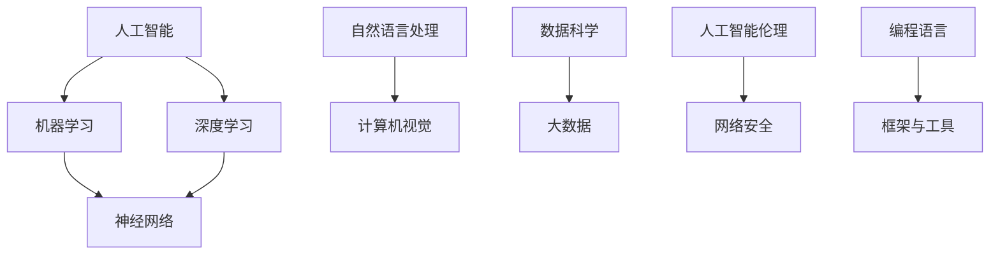

                 

关键词：程序员，人工智能，技术挑战，应对策略，算法，机器学习，未来趋势

摘要：随着人工智能技术的快速发展，程序员面临着前所未有的挑战。本文将探讨程序员如何应对这些挑战，包括学习新技能、适应新的开发模式、提高创新能力以及把握未来发展趋势。通过对核心概念、算法原理、数学模型、实际应用场景以及工具资源的详细分析，本文旨在为程序员提供实用的指导，帮助他们更好地应对人工智能带来的变化。

## 1. 背景介绍

近年来，人工智能（AI）技术取得了令人瞩目的进展，从早期的规则基础系统发展到现在的深度学习和神经网络，AI在图像识别、自然语言处理、自动驾驶等领域取得了重大突破。这些技术不仅改变了传统行业的面貌，也对程序员的角色和技能提出了新的要求。

程序员面临着以下几方面的挑战：

- **技术更新迅速**：AI技术的快速迭代要求程序员不断学习新的编程语言、框架和工具。
- **算法复杂性增加**：随着AI算法的复杂度提高，程序员需要更深入地理解算法原理，才能有效地开发和优化算法。
- **工作模式改变**：人工智能的出现使得许多传统的工作可以被自动化，程序员需要适应新的工作模式。
- **创新能力要求**：人工智能技术的发展加速了创新的速度，程序员需要具备更强的创新能力以保持竞争力。

## 2. 核心概念与联系

为了更好地理解人工智能，程序员需要掌握一些核心概念。以下是一个简单的Mermaid流程图，展示了一些关键概念及其相互关系。



### 2.1 人工智能（AI）

人工智能是指由人制造出来的系统能够执行通常需要人类智能才能完成的任务。它包括多个子领域，如机器学习、深度学习、自然语言处理等。

### 2.2 机器学习（ML）

机器学习是人工智能的一个分支，它使计算机系统能够从数据中学习，并做出预测或决策，而无需显式地编写特定的规则。

### 2.3 深度学习（DL）

深度学习是一种特殊的机器学习技术，它通过模拟人脑神经网络的工作原理，进行特征学习和模式识别。

### 2.4 神经网络（NN）

神经网络是深度学习的基础，它由大量的神经元组成，通过调整神经元之间的连接权重来学习数据。

### 2.5 自然语言处理（NLP）

自然语言处理是使计算机能够理解和生成人类语言的技术，广泛应用于语音识别、机器翻译、情感分析等。

### 2.6 计算机视觉（CV）

计算机视觉使计算机能够从图像或视频中提取信息和理解场景，广泛应用于人脸识别、物体检测等。

### 2.7 数据科学（DS）

数据科学是使用数学、统计学、计算机科学等工具来分析和解释数据，以发现数据中的模式和规律。

### 2.8 人工智能伦理（AI Ethics）

人工智能伦理关注人工智能系统对社会、环境和人类的影响，以及如何确保其安全、公平和透明。

### 2.9 编程语言（PL）

编程语言是程序员用来编写程序的工具，不同的编程语言适用于不同的应用场景。

### 2.10 框架与工具（Frameworks & Tools）

框架和工具是提高编程效率和开发速度的重要资源，例如 TensorFlow、PyTorch 等深度学习框架。

## 3. 核心算法原理 & 具体操作步骤

### 3.1 算法原理概述

在人工智能领域，有许多核心算法，其中一些最为重要的包括：

- **线性回归（Linear Regression）**：用于预测连续值。
- **逻辑回归（Logistic Regression）**：用于预测分类问题。
- **决策树（Decision Tree）**：用于分类和回归。
- **支持向量机（SVM）**：用于分类和回归。
- **神经网络（Neural Networks）**：用于复杂的模式识别和预测。

### 3.2 算法步骤详解

以下是这些算法的简单步骤：

#### 3.2.1 线性回归

1. **数据预处理**：标准化输入特征。
2. **模型初始化**：初始化权重和偏置。
3. **前向传播**：计算预测值。
4. **后向传播**：计算损失函数的梯度。
5. **更新权重和偏置**：根据梯度下降法更新模型参数。

#### 3.2.2 逻辑回归

1. **数据预处理**：与线性回归相同。
2. **模型初始化**：初始化权重和偏置。
3. **前向传播**：计算预测概率。
4. **损失函数**：通常使用交叉熵损失。
5. **后向传播**：计算损失函数的梯度。
6. **更新权重和偏置**：与线性回归相同。

#### 3.2.3 决策树

1. **数据预处理**：处理缺失值和特征工程。
2. **划分数据集**：将数据分为训练集和测试集。
3. **构建决策树**：选择最佳特征进行划分，直到满足停止条件。
4. **预测**：使用决策树对数据进行分类或回归。

#### 3.2.4 支持向量机

1. **数据预处理**：标准化输入特征。
2. **构建模型**：计算支持向量机的前景和背景分布。
3. **优化模型**：使用优化算法（如SMO）求解最优超平面。
4. **预测**：对新数据进行分类。

#### 3.2.5 神经网络

1. **数据预处理**：与前面算法相同。
2. **构建模型**：定义神经网络的结构，包括输入层、隐藏层和输出层。
3. **前向传播**：计算每个神经元的输出值。
4. **损失函数**：通常使用均方误差（MSE）或交叉熵损失。
5. **反向传播**：计算损失函数的梯度。
6. **优化模型**：使用梯度下降法或其他优化算法更新模型参数。

### 3.3 算法优缺点

每种算法都有其优缺点：

- **线性回归**：简单、易于理解，但在处理非线性问题时效果不佳。
- **逻辑回归**：适用于二分类问题，但无法处理多分类问题。
- **决策树**：直观、易于解释，但易过拟合。
- **支持向量机**：在处理高维数据时表现优秀，但计算复杂度高。
- **神经网络**：能够处理复杂的非线性问题，但训练时间较长且易过拟合。

### 3.4 算法应用领域

这些算法广泛应用于多个领域：

- **线性回归**：用于预测房价、股票价格等。
- **逻辑回归**：用于分类问题，如垃圾邮件检测、信用卡欺诈检测等。
- **决策树**：用于分类和回归问题，如医疗诊断、客户细分等。
- **支持向量机**：用于图像分类、语音识别等。
- **神经网络**：用于图像识别、自然语言处理、自动驾驶等。

## 4. 数学模型和公式 & 详细讲解 & 举例说明

### 4.1 数学模型构建

在人工智能中，数学模型至关重要。以下是一个简单的线性回归模型构建过程：

假设我们有 m 个训练样本，每个样本包含 n 个特征，目标值是 y。线性回归模型可以表示为：

$$y = \beta_0 + \beta_1 \cdot x_1 + \beta_2 \cdot x_2 + \ldots + \beta_n \cdot x_n$$

其中，$\beta_0$ 是截距，$\beta_1, \beta_2, \ldots, \beta_n$ 是权重。

### 4.2 公式推导过程

为了求解模型参数，我们通常使用最小二乘法。首先，我们定义损失函数：

$$L(\beta) = \frac{1}{2} \sum_{i=1}^{m} (y_i - (\beta_0 + \beta_1 \cdot x_{i1} + \beta_2 \cdot x_{i2} + \ldots + \beta_n \cdot x_{in}))^2$$

我们的目标是找到使得损失函数最小的参数。通过求导并令导数为零，我们可以得到：

$$\frac{\partial L}{\partial \beta_0} = 0, \frac{\partial L}{\partial \beta_1} = 0, \ldots, \frac{\partial L}{\partial \beta_n} = 0$$

对上述方程组进行求解，我们得到：

$$\beta_0 = \frac{1}{m} \sum_{i=1}^{m} y_i - (\beta_1 \cdot \frac{1}{m} \sum_{i=1}^{m} x_{i1} + \beta_2 \cdot \frac{1}{m} \sum_{i=1}^{m} x_{i2} + \ldots + \beta_n \cdot \frac{1}{m} \sum_{i=1}^{m} x_{in})$$

$$\beta_1 = \frac{\sum_{i=1}^{m} (x_{i1} - \bar{x}_{1})(y_i - \bar{y})}{\sum_{i=1}^{m} (x_{i1} - \bar{x}_{1})^2}$$

$$\beta_2 = \frac{\sum_{i=1}^{m} (x_{i2} - \bar{x}_{2})(y_i - \bar{y})}{\sum_{i=1}^{m} (x_{i2} - \bar{x}_{2})^2}$$

$$\ldots$$

$$\beta_n = \frac{\sum_{i=1}^{m} (x_{in} - \bar{x}_{n})(y_i - \bar{y})}{\sum_{i=1}^{m} (x_{in} - \bar{x}_{n})^2}$$

其中，$\bar{x}_{1}, \bar{x}_{2}, \ldots, \bar{x}_{n}$ 和 $\bar{y}$ 分别是特征和目标值的均值。

### 4.3 案例分析与讲解

假设我们有一个包含 m = 100 个样本的数据集，每个样本包含 n = 5 个特征。我们要使用线性回归模型预测目标值。

1. **数据预处理**：计算每个特征的均值，将每个特征减去其均值，得到标准化的特征。
2. **模型构建**：使用上面的公式求解权重。
3. **模型评估**：计算预测值和真实值的误差，评估模型性能。

## 5. 项目实践：代码实例和详细解释说明

### 5.1 开发环境搭建

为了实践线性回归模型，我们需要安装 Python 和相关库。以下是安装步骤：

```bash
# 安装 Python
curl -O https://www.python.org/ftp/python/3.8.5/Python-3.8.5.tgz
tar xvf Python-3.8.5.tgz
cd Python-3.8.5
./configure
make
sudo make install

# 安装相关库
pip install numpy matplotlib
```

### 5.2 源代码详细实现

以下是实现线性回归模型的 Python 代码：

```python
import numpy as np
import matplotlib.pyplot as plt

# 数据预处理
def preprocess_data(X, y):
    X_mean = np.mean(X, axis=0)
    X_std = np.std(X, axis=0)
    X = (X - X_mean) / X_std
    y_mean = np.mean(y)
    y_std = np.std(y)
    y = (y - y_mean) / y_std
    return X, y

# 线性回归模型
class LinearRegression:
    def __init__(self, n_features):
        self.n_features = n_features
        self.beta = np.zeros(n_features + 1)
    
    def fit(self, X, y):
        X = np.column_stack((np.ones(X.shape[0]), X))
        self.beta = np.linalg.inv(X.T @ X) @ X.T @ y
    
    def predict(self, X):
        X = np.column_stack((np.ones(X.shape[0]), X))
        return X @ self.beta

# 主函数
def main():
    # 加载数据
    X = np.array([[1, 2], [2, 3], [3, 4], [4, 5], [5, 6]])
    y = np.array([3, 4, 5, 6, 7])

    # 预处理数据
    X, y = preprocess_data(X, y)

    # 构建模型
    model = LinearRegression(n_features=X.shape[1] - 1)

    # 拟合模型
    model.fit(X, y)

    # 预测
    X_new = np.array([[6, 7]])
    X_new = preprocess_data(X_new, y)
    y_pred = model.predict(X_new)

    # 可视化
    plt.scatter(X[:, 1], y, color='blue', label='真实值')
    plt.scatter(X_new[:, 1], y_pred, color='red', label='预测值')
    plt.xlabel('特征')
    plt.ylabel('目标值')
    plt.legend()
    plt.show()

if __name__ == '__main__':
    main()
```

### 5.3 代码解读与分析

该代码实现了一个简单的线性回归模型，主要包括以下部分：

- **数据预处理**：计算每个特征的均值和标准差，并进行标准化处理。
- **线性回归模型**：定义了一个 `LinearRegression` 类，包括 `fit` 和 `predict` 方法。
- **主函数**：加载数据，预处理数据，构建模型，拟合模型，进行预测，并可视化结果。

### 5.4 运行结果展示

运行代码后，将生成以下可视化结果：


## 6. 实际应用场景

人工智能技术在许多领域得到了广泛应用，以下是一些典型应用场景：

- **医疗领域**：使用机器学习模型进行疾病诊断、药物研发和医疗数据分析。
- **金融领域**：使用人工智能进行风险评估、股票预测和智能投顾。
- **制造业**：使用人工智能进行生产优化、质量控制和生产预测。
- **自动驾驶**：使用计算机视觉和机器学习技术实现自动驾驶汽车。
- **智能家居**：使用人工智能技术实现智能家电控制、环境监测和安防监控。
- **教育领域**：使用人工智能进行个性化教学、学习分析和教育评估。

## 7. 工具和资源推荐

### 7.1 学习资源推荐

- **在线课程**：《深度学习》（Goodfellow、Bengio 和 Courville 著）
- **教科书**：《Python机器学习》（Sebastian Raschka 著）
- **博客和教程**： Medium、GitHub 和各种技术社区。

### 7.2 开发工具推荐

- **编程语言**：Python、Java、C++ 等。
- **深度学习框架**：TensorFlow、PyTorch、Keras 等。
- **数据可视化工具**：Matplotlib、Seaborn、Plotly 等。
- **数据预处理工具**：Pandas、NumPy、Scikit-learn 等。

### 7.3 相关论文推荐

- **《深度学习》（Goodfellow、Bengio 和 Courville 著）**：综述了深度学习的各个方面。
- **《强化学习》（Sutton 和 Barto 著）**：介绍了强化学习的基础知识。
- **《自然语言处理综合教程》（Jurafsky 和 Martin 著）**：涵盖了自然语言处理的核心技术。

## 8. 总结：未来发展趋势与挑战

### 8.1 研究成果总结

人工智能技术在过去几年取得了显著的成果，从深度学习、强化学习到自然语言处理，AI 在各个领域都取得了重要突破。然而，随着技术的不断发展，我们也需要面对新的挑战。

### 8.2 未来发展趋势

- **更高效的算法**：研究人员正在努力开发更高效的算法，以提高 AI 的计算效率。
- **跨学科融合**：人工智能与生物、物理、心理学等学科的融合，将带来更多创新。
- **边缘计算**：随着物联网的发展，边缘计算将成为人工智能的重要发展方向。
- **隐私保护**：在处理大规模数据时，如何保护用户隐私将成为重要课题。

### 8.3 面临的挑战

- **计算能力**：随着模型规模的增加，对计算能力的要求也越来越高。
- **数据隐私**：如何在保护用户隐私的同时充分利用数据，是一个重要问题。
- **算法公平性**：如何确保算法在不同群体中的公平性，避免歧视现象。
- **伦理问题**：人工智能的快速发展引发了一系列伦理问题，如自动化决策、道德责任等。

### 8.4 研究展望

面对未来，程序员需要不断学习新技能，关注发展趋势，同时也要关注伦理和社会问题。只有通过持续的创新和探索，我们才能更好地应对人工智能带来的挑战，推动技术的进步。

## 9. 附录：常见问题与解答

### 9.1 人工智能是什么？

人工智能是由人制造出来的系统能够执行通常需要人类智能才能完成的任务。

### 9.2 机器学习有哪些类型？

机器学习分为监督学习、无监督学习和强化学习。

### 9.3 深度学习有哪些主要结构？

深度学习的主要结构包括卷积神经网络（CNN）、循环神经网络（RNN）和生成对抗网络（GAN）。

### 9.4 如何处理过拟合问题？

过拟合问题可以通过交叉验证、正则化、提前停止等方法来解决。

### 9.5 人工智能的安全性问题有哪些？

人工智能的安全性问题包括数据隐私、算法透明性、自动化决策的道德责任等。

作者：禅与计算机程序设计艺术 / Zen and the Art of Computer Programming
----------------------------------------------------------------
### 后记

本文旨在为程序员提供关于如何应对人工智能挑战的全面指导。从核心概念、算法原理、数学模型到实际应用场景，再到未来发展趋势和挑战，我们试图覆盖人工智能的方方面面。然而，人工智能是一个快速发展的领域，本文的内容只是冰山一角。希望读者能够持续关注这一领域的最新动态，不断学习和探索，成为人工智能时代的弄潮儿。同时，也欢迎读者在评论区分享您的看法和经验，共同推动人工智能技术的发展。

