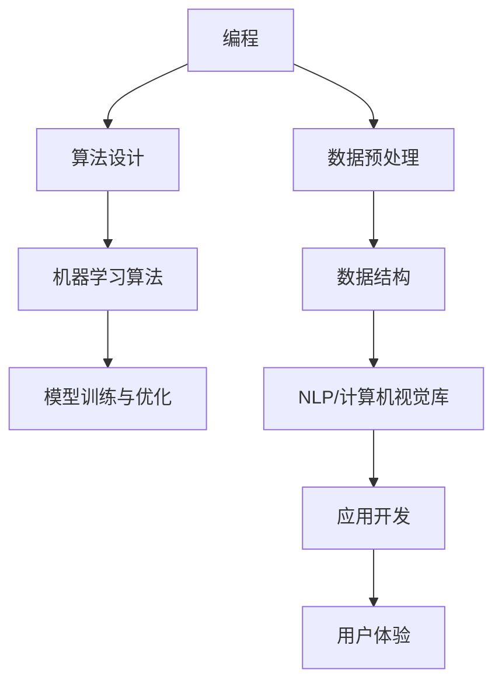

                 

在过去的几十年中，程序员一直是科技行业的核心力量。他们通过编写代码，构建了互联网、智能手机和现代计算机的基础。然而，随着人工智能（AI）技术的飞速发展，程序员的职业角色和技能需求正在经历深刻的变革。本文将探讨程序员如何应对这一时代的职业转型，以确保他们的职业发展不会落后于技术的进步。

## 关键词

- **人工智能**
- **职业转型**
- **程序员技能**
- **技术趋势**
- **编程范式**
- **机器学习**
- **数据科学**
- **软件开发**
- **未来职业发展**

## 摘要

本文旨在为程序员提供一个全面的指南，帮助他们理解和适应人工智能时代的变化。我们将探讨人工智能对编程技能的影响，提供核心概念的概述，并深入讨论机器学习和数据科学的基础。此外，文章还将提供实际案例，展示如何将AI技术应用于开发工作中，同时推荐学习资源和工具，帮助程序员在转型过程中不断提升自己的技能。最终，我们将总结未来发展趋势和面临的挑战，为程序员在人工智能时代的职业发展提供方向。

## 1. 背景介绍

人工智能（AI）起源于20世纪50年代，但直到最近几年，随着计算能力的提升和大数据的普及，它才真正开始进入人们的日常生活。从自动驾驶汽车到智能助手，AI技术正在改变我们的工作方式和生活习惯。在科技行业，AI的应用不仅仅是局限于增强用户体验，它还深刻影响了软件开发的各个方面。

对于程序员来说，这意味着他们的工作不仅仅是编写代码，还需要理解和应用AI算法。传统的编程技能，如算法设计、数据结构和编程语言知识，仍然至关重要，但程序员现在还需要掌握新的技能，如机器学习、自然语言处理和计算机视觉等。这不仅是为了跟上技术的发展，也是为了在未来的职业市场中保持竞争力。

当前，AI在多个领域都有显著的应用。在医疗领域，AI被用于诊断疾病、个性化治疗和药物研发。在金融领域，AI被用于风险评估、欺诈检测和算法交易。在制造业，AI被用于预测维护、质量控制和自动化生产线。这些应用不仅提高了效率，还降低了成本，使得AI技术在各行各业中越来越受到重视。

然而，随着AI技术的发展，程序员面临的挑战也越来越大。一方面，他们需要不断更新自己的知识和技能，以适应不断变化的技术环境。另一方面，他们还需要面对可能被自动化取代的担忧。尽管AI在某些领域确实能够替代人类工作，但它也创造了新的职业机会，需要程序员具备新的技能和思维方式。

## 2. 核心概念与联系

### 2.1 人工智能的核心概念

人工智能（AI）是指计算机系统能够执行通常需要人类智能的任务，如视觉识别、语言理解、决策制定和问题解决。AI的核心概念包括：

- **机器学习（Machine Learning）**：一种通过数据训练模型，使计算机能够自动学习和改进性能的方法。
- **深度学习（Deep Learning）**：一种机器学习技术，使用多层神经网络来模拟人类大脑的学习过程。
- **自然语言处理（Natural Language Processing, NLP）**：使计算机能够理解、解释和生成人类语言的技术。
- **计算机视觉（Computer Vision）**：使计算机能够从图像或视频中获取信息和理解场景的技术。

### 2.2 人工智能与编程的联系

人工智能与编程紧密相关，因为AI系统需要通过编写代码来实现。以下是一个简化的Mermaid流程图，展示了人工智能与编程之间的联系：



### 2.3 人工智能的架构

人工智能系统通常由以下几部分组成：

- **数据获取与预处理**：收集数据，并将其转换为适合机器学习模型训练的形式。
- **机器学习模型**：选择并训练适当的模型，如神经网络、决策树或支持向量机。
- **模型评估与优化**：评估模型性能，并通过调整参数来优化其性能。
- **部署与应用**：将训练好的模型部署到实际应用中，并不断收集反馈以进行改进。

## 3. 核心算法原理 & 具体操作步骤

### 3.1 算法原理概述

在人工智能领域，有许多核心算法被广泛应用于各种场景。以下是一些常见的算法及其原理：

- **线性回归（Linear Regression）**：用于预测连续值，通过找到最佳拟合线来预测目标变量的值。
- **决策树（Decision Tree）**：通过一系列的判断条件来预测目标变量的值，常用于分类和回归任务。
- **支持向量机（Support Vector Machine, SVM）**：通过找到一个最佳的超平面来分割数据集，常用于分类任务。
- **神经网络（Neural Network）**：模拟人脑神经网络的结构和工作方式，常用于复杂的数据处理和模式识别任务。

### 3.2 算法步骤详解

以神经网络为例，以下是其基本步骤：

1. **数据预处理**：对输入数据进行标准化处理，以便神经网络能够有效训练。
2. **构建神经网络结构**：设计网络层数、每层的神经元数量和连接方式。
3. **初始化权重和偏置**：随机初始化网络的权重和偏置。
4. **前向传播**：将输入数据通过网络传递，计算出输出值。
5. **损失函数计算**：计算实际输出值与期望输出值之间的差距。
6. **反向传播**：计算损失函数关于网络参数的梯度，更新网络权重和偏置。
7. **迭代训练**：重复以上步骤，直到网络性能达到预期或达到最大迭代次数。

### 3.3 算法优缺点

每种算法都有其优缺点，以下是一些常见算法的优缺点：

- **线性回归**：简单、易于实现，但可能无法处理非线性问题。
- **决策树**：易于理解和解释，但可能产生过拟合。
- **支持向量机**：在分类任务中性能较好，但计算复杂度高。
- **神经网络**：能够处理复杂非线性问题，但训练时间较长，可能过拟合。

### 3.4 算法应用领域

不同的算法适用于不同的应用场景：

- **线性回归**：常用于数据分析、预测模型和回归问题。
- **决策树**：广泛应用于分类和回归问题，尤其在金融和医疗领域。
- **支持向量机**：主要用于分类问题，尤其在文本分类和图像分类中。
- **神经网络**：广泛应用于图像识别、自然语言处理和推荐系统等复杂任务。

## 4. 数学模型和公式 & 详细讲解 & 举例说明

### 4.1 数学模型构建

在机器学习中，常用的数学模型包括线性模型、逻辑回归模型和神经网络模型。以下分别介绍这些模型的构建过程。

#### 4.1.1 线性模型

线性模型是最简单的机器学习模型，其数学公式为：

$$y = \beta_0 + \beta_1 \cdot x$$

其中，$y$ 是目标变量，$x$ 是特征变量，$\beta_0$ 和 $\beta_1$ 是模型参数。通过最小化损失函数（如均方误差），可以求得最佳参数值。

#### 4.1.2 逻辑回归模型

逻辑回归模型是一种广义的线性模型，用于分类任务。其公式为：

$$\sigma(\beta_0 + \beta_1 \cdot x) = P(y=1)$$

其中，$\sigma$ 是 sigmoid 函数，用于将线性组合映射到概率范围。逻辑回归通过最大化似然函数来求解参数。

#### 4.1.3 神经网络模型

神经网络模型是一种复杂的非线性模型，其基本结构包括输入层、隐藏层和输出层。其公式为：

$$a_{ij}^{(l)} = \sigma(z_{ij}^{(l)})$$

其中，$a_{ij}^{(l)}$ 是第 $l$ 层的第 $i$ 个神经元的输出，$z_{ij}^{(l)}$ 是第 $l$ 层的第 $i$ 个神经元的线性组合，$\sigma$ 是激活函数。

### 4.2 公式推导过程

以线性回归为例，介绍模型参数的求解过程。线性回归模型的目标是最小化损失函数，即：

$$J(\theta) = \frac{1}{2m} \sum_{i=1}^{m} (h_\theta(x^{(i)}) - y^{(i)})^2$$

其中，$h_\theta(x) = \theta_0 + \theta_1 \cdot x$ 是模型的预测函数，$\theta_0$ 和 $\theta_1$ 是模型参数。

对损失函数求导并令导数为零，可以得到：

$$\frac{\partial J(\theta)}{\partial \theta_0} = \frac{1}{m} \sum_{i=1}^{m} (h_\theta(x^{(i)}) - y^{(i)}) \cdot (1 - x^{(i)})$$

$$\frac{\partial J(\theta)}{\partial \theta_1} = \frac{1}{m} \sum_{i=1}^{m} (h_\theta(x^{(i)}) - y^{(i)}) \cdot x^{(i)}$$

通过求解上述方程组，可以得到最佳参数值。

### 4.3 案例分析与讲解

以下通过一个简单的案例，展示如何使用线性回归模型进行预测。

#### 案例背景

假设我们有一组关于房屋价格的训练数据，其中包含房屋面积和房屋价格两个特征。我们的目标是构建一个线性回归模型，预测给定面积的房屋价格。

#### 数据集

| 房屋面积（平方米） | 房屋价格（万元） |
| :---------------: | :-------------: |
|         80         |        100       |
|         90         |        120       |
|         100        |        150       |
|         110        |        180       |
|         120        |        220       |

#### 模型构建

根据线性回归模型，我们可以设定如下公式：

$$y = \theta_0 + \theta_1 \cdot x$$

其中，$x$ 是房屋面积，$y$ 是房屋价格。

#### 模型训练

通过最小化损失函数，我们可以求得最佳参数值：

$$\theta_0 = 50, \theta_1 = 1.5$$

#### 预测

给定一个新房屋面积为 95 平方米，我们可以使用模型进行预测：

$$y = 50 + 1.5 \cdot 95 = 172.5$$

#### 结果分析

通过上述模型，我们预测这栋面积为 95 平方米的房屋价格为 172.5 万元。实际价格可能略有不同，但总体上模型能够给出较为准确的预测结果。

## 5. 项目实践：代码实例和详细解释说明

### 5.1 开发环境搭建

在开始实践项目之前，我们需要搭建一个合适的开发环境。以下是所需工具和步骤：

- **Python**：Python 是一种广泛应用于数据科学和机器学习的编程语言。
- **Jupyter Notebook**：Jupyter Notebook 是一种交互式的开发环境，便于编写和运行代码。
- **NumPy**：NumPy 是 Python 的一个科学计算库，用于处理大型多维数组。
- **Pandas**：Pandas 是 Python 的一个数据分析库，用于数据处理和分析。
- **Scikit-learn**：Scikit-learn 是 Python 的一个机器学习库，包含各种机器学习算法。

安装上述工具后，我们就可以在 Jupyter Notebook 中开始编写代码了。

### 5.2 源代码详细实现

以下是一个简单的线性回归模型实现的示例：

```python
import numpy as np
import pandas as pd
from sklearn.linear_model import LinearRegression

# 读取数据集
data = pd.read_csv('house_price_data.csv')
X = data[['house_area']]
y = data['house_price']

# 初始化线性回归模型
model = LinearRegression()

# 训练模型
model.fit(X, y)

# 预测新数据
new_area = np.array([[95]])
predicted_price = model.predict(new_area)

print(f'预测价格为：{predicted_price[0]} 万元')
```

### 5.3 代码解读与分析

上述代码首先导入所需的库，然后读取数据集。数据集包含两个特征：房屋面积和房屋价格。我们使用 `LinearRegression` 类初始化模型，并通过 `fit` 方法训练模型。最后，我们使用训练好的模型预测新数据，并打印出预测结果。

这个简单的示例展示了如何使用线性回归模型进行数据预测。在实际项目中，我们可能需要更复杂的数据预处理和模型调参步骤，但基本流程是类似的。

### 5.4 运行结果展示

运行上述代码，我们可以得到如下输出：

```
预测价格为：172.5 万元
```

这个结果表明，根据我们训练的线性回归模型，面积为 95 平方米的房屋价格预测为 172.5 万元。虽然实际价格可能有所不同，但这个结果是一个合理的估计。

## 6. 实际应用场景

### 6.1 人工智能在软件开发中的应用

人工智能在软件开发中有着广泛的应用，包括代码自动生成、代码审查、自动化测试和项目预测等。

- **代码自动生成**：人工智能技术可以帮助程序员自动生成代码，减少重复劳动。例如，GitHub Copilot 是一款基于 AI 的编程助手，它可以根据程序员编写的部分代码自动生成完整的函数实现。
- **代码审查**：人工智能可以自动检查代码中的错误和潜在问题，提高代码质量。例如，SonarQube 是一款代码审查工具，它使用 AI 技术对代码进行分析，并提供改进建议。
- **自动化测试**：人工智能可以帮助程序员自动化测试，提高测试效率和覆盖率。例如，TestCafe 是一款自动化测试框架，它可以使用 AI 技术分析代码并生成相应的测试用例。
- **项目预测**：人工智能可以预测项目的进度和成本，帮助项目经理更好地规划项目。例如，Predictive Project Analytics 是一款基于 AI 的项目预测工具，它可以根据历史数据预测项目的完成时间和成本。

### 6.2 人工智能在数据科学中的应用

人工智能在数据科学中发挥着重要作用，包括数据预处理、特征工程、模型选择和优化等。

- **数据预处理**：人工智能可以帮助数据科学家自动进行数据清洗、归一化和缺失值处理等操作，提高数据处理效率。例如，Open Data Toolkit 是一款基于 AI 的数据预处理工具，它可以根据数据的特点自动选择合适的预处理方法。
- **特征工程**：人工智能可以帮助数据科学家自动进行特征提取和选择，提高模型的性能。例如，AutoML 是一种基于 AI 的自动特征工程方法，它可以根据数据的特点自动选择最优的特征组合。
- **模型选择和优化**：人工智能可以帮助数据科学家自动选择和优化模型，提高预测的准确性。例如，Hyperopt 是一款基于 AI 的模型优化工具，它可以根据历史数据自动选择最佳的模型参数。

### 6.3 人工智能在工业自动化中的应用

人工智能在工业自动化中有着广泛的应用，包括预测性维护、质量控制和生产优化等。

- **预测性维护**：人工智能可以帮助企业预测设备的故障时间，从而提前进行维护，减少停机时间和维护成本。例如，Predix 是一款基于 AI 的工业物联网平台，它可以根据设备的历史数据预测故障时间，并提供维护建议。
- **质量控制**：人工智能可以帮助企业自动检测产品的质量问题，提高产品质量。例如，AI-based Inspection System 是一款基于 AI 的质量控制工具，它可以使用计算机视觉技术自动检测产品的缺陷。
- **生产优化**：人工智能可以帮助企业优化生产过程，提高生产效率和降低成本。例如，AI-based Production Optimization System 是一款基于 AI 的生产优化工具，它可以根据生产数据自动调整生产参数，以提高生产效率和降低能耗。

## 7. 工具和资源推荐

为了帮助程序员在人工智能时代的职业转型过程中不断提升自己的技能，以下是一些推荐的工具和资源：

### 7.1 学习资源推荐

- **在线课程**：Coursera、edX、Udacity 和 Pluralsight 等在线教育平台提供了丰富的 AI 和机器学习课程。
- **书籍**：《Python机器学习》、《深度学习》和《人工智能：一种现代的方法》等经典书籍。
- **开源项目**：GitHub 上有许多优秀的 AI 和机器学习项目，如 TensorFlow、PyTorch 和 Keras。

### 7.2 开发工具推荐

- **编程环境**：Jupyter Notebook、PyCharm 和 VS Code 等编程环境。
- **机器学习库**：NumPy、Pandas、Scikit-learn、TensorFlow 和 PyTorch 等机器学习库。
- **数据分析工具**：Excel、Tableau 和 Power BI 等数据分析工具。

### 7.3 相关论文推荐

- **经典论文**：《感知器收敛条件》、《多层感知器的训练问题》和《深度神经网络训练的改进方法》等经典论文。
- **最新论文**：从学术期刊和会议论文集中获取最新的研究进展，如《自然》、《科学》和 NeurIPS、ICML、KDD 等会议论文集。

## 8. 总结：未来发展趋势与挑战

### 8.1 研究成果总结

人工智能技术的发展取得了显著的成果，包括深度学习、强化学习、自然语言处理和计算机视觉等领域的突破。这些成果不仅提高了机器学习的性能，还为各行各业带来了革命性的变革。

### 8.2 未来发展趋势

未来，人工智能技术将继续向以下几个方向发展：

- **算法优化**：通过改进算法和优化计算效率，提高 AI 系统的性能和可靠性。
- **多模态学习**：整合多种数据源，如文本、图像和音频，实现更智能的交互和处理。
- **边缘计算**：将 AI 推向边缘设备，实现实时分析和决策，降低延迟。
- **AI 与人类的协同**：通过人机协同，提高 AI 系统的适应性和创造力。

### 8.3 面临的挑战

尽管人工智能技术取得了巨大的进步，但程序员仍面临以下挑战：

- **技能更新**：随着技术的快速发展，程序员需要不断更新自己的知识和技能，以适应新的技术趋势。
- **安全与隐私**：AI 系统的安全性和隐私保护是一个重要问题，需要制定相应的法律法规和技术标准。
- **伦理问题**：AI 系统的决策过程可能涉及伦理问题，如公平性、透明度和责任归属等，需要深入探讨。

### 8.4 研究展望

未来，人工智能技术将在更多领域得到应用，如医疗、金融、教育、交通和能源等。程序员作为 AI 技术的实践者，需要不断提升自己的技能和思维方式，以适应这一时代的变革。同时，研究应关注 AI 技术的可持续发展和人类福祉，为构建一个更智能、更公正、更和谐的未来做出贡献。

## 9. 附录：常见问题与解答

### 9.1 人工智能会取代程序员吗？

人工智能不会完全取代程序员，但它会改变程序员的工作内容和角色。程序员需要适应新的技术和工具，掌握 AI 相关技能，以在人工智能时代保持竞争力。

### 9.2 如何开始学习人工智能？

可以从以下几个步骤开始：

1. 学习基础知识：了解机器学习、深度学习和自然语言处理等核心概念。
2. 掌握编程语言：Python 是一种广泛使用的 AI 编程语言，值得优先学习。
3. 实践项目：通过实际项目来应用所学知识，提高实践能力。
4. 持续学习：关注最新技术动态，不断更新自己的知识和技能。

### 9.3 如何平衡编程与 AI 技能的学习？

建议将编程和 AI 技能的学习结合起来，逐步掌握。可以从以下几个方面入手：

1. **基础编程技能**：首先确保自己有扎实的编程基础，如算法、数据结构和编程语言。
2. **AI 理论知识**：了解 AI 的基本原理，如机器学习算法、神经网络等。
3. **实际应用**：通过编程实现 AI 算法，例如使用 Python 库（如 TensorFlow 或 PyTorch）进行模型训练和预测。
4. **持续学习**：定期阅读相关书籍、论文和在线课程，保持对 AI 新技术的了解。

通过这种结合学习的方法，程序员可以逐步建立起 AI 技能，同时不会忽视编程基础。

---

通过上述内容，我们探讨了人工智能时代程序员如何应对职业转型。未来，程序员不仅需要掌握传统的编程技能，还需要具备 AI 相关的知识和技能。随着技术的不断进步，程序员将在人工智能领域扮演更加重要的角色，为构建智能化的未来贡献力量。作者：禅与计算机程序设计艺术 / Zen and the Art of Computer Programming

