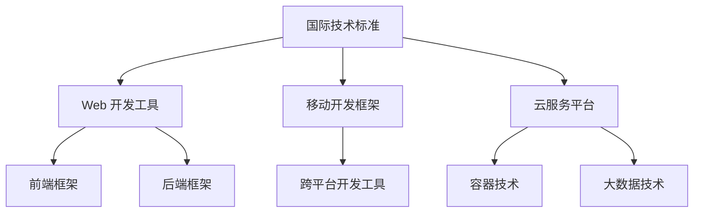
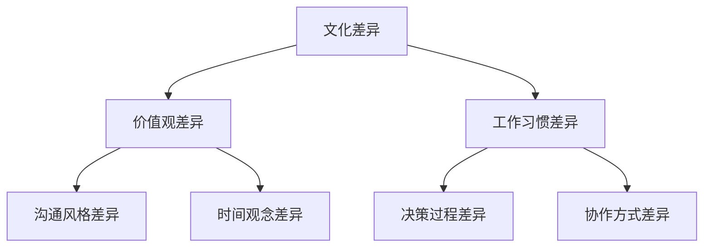
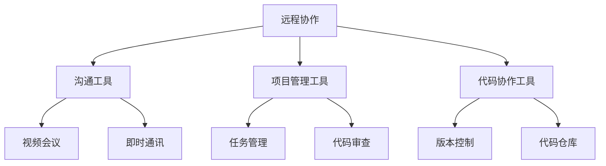

                 

关键词：全球化挑战，程序员技能，技术标准，文化差异，协作工具，远程工作，国际化视野，跨文化沟通，跨平台开发，全球化视野，人才培养，技术交流

> 摘要：随着全球化的深入发展，程序员面临的挑战日益增多。本文将探讨程序员如何应对全球化带来的技术、文化、语言等多方面的挑战，提升自身的竞争力，为全球技术发展贡献自己的力量。

## 1. 背景介绍

全球化使得信息交流更加便捷，技术传播更加迅速。然而，这也给程序员带来了前所未有的挑战。首先，全球化要求程序员掌握多种技术标准和开发工具，以便在不同国家和地区的项目中工作。其次，全球化的文化差异和语言障碍使得跨文化沟通变得更加复杂。此外，远程工作和分布式团队协作也成为了程序员日常工作的常态。面对这些挑战，程序员需要不断提升自身的技能和素质，以应对全球化带来的各种挑战。

### 全球化的定义与影响

全球化是指世界各国在经济、政治、文化等方面的相互联系和依赖程度不断加深的过程。全球化对程序员的影响主要体现在以下几个方面：

1. **技术多样性**：全球化使得各种技术标准和开发工具在全球范围内传播，程序员需要掌握多种技术以适应不同国家和地区的项目需求。
2. **文化差异**：全球化带来了文化多样性的挑战，程序员需要理解和尊重不同文化的价值观和工作习惯，以提高跨文化沟通的效率。
3. **远程协作**：全球化使得远程工作和分布式团队协作成为常态，程序员需要适应这种工作模式，提高远程协作的效率和效果。
4. **国际化视野**：全球化要求程序员具备国际化的视野，了解全球范围内的技术发展趋势和市场需求，为全球技术发展贡献自己的力量。

## 2. 核心概念与联系

### 技术标准与开发工具

在全球化背景下，程序员需要掌握多种技术标准和开发工具。以下是一个简单的 Mermaid 流程图，展示了不同技术标准和开发工具之间的联系。



### 文化差异与跨文化沟通

全球化带来了文化多样性的挑战，程序员需要理解和尊重不同文化的价值观和工作习惯。以下是一个简单的 Mermaid 流程图，展示了不同文化之间的差异和跨文化沟通的要点。



### 远程协作与分布式团队

远程协作和分布式团队是全球化背景下程序员面临的常态。以下是一个简单的 Mermaid 流程图，展示了远程协作和分布式团队的要点。



## 3. 核心算法原理 & 具体操作步骤

### 3.1 算法原理概述

在全球化背景下，程序员需要掌握一系列核心算法原理，以提高编程效率和代码质量。以下是一些常见的算法原理：

1. **排序算法**：包括快速排序、归并排序、堆排序等，用于高效地处理大量数据。
2. **查找算法**：包括二分查找、哈希查找等，用于快速定位数据。
3. **图算法**：包括最短路径算法、最小生成树算法等，用于解决复杂网络问题。
4. **动态规划**：用于求解具有最优子结构特性的问题，如背包问题、最长公共子序列等。

### 3.2 算法步骤详解

以下以快速排序为例，详细介绍其算法步骤。

1. **选择基准元素**：从数组中选取一个基准元素。
2. **分区操作**：将数组划分为两部分，一部分小于基准元素，另一部分大于基准元素。
3. **递归排序**：对小于和大于基准元素的两部分数组分别进行快速排序。

### 3.3 算法优缺点

快速排序具有以下优点：

- **高效**：平均时间复杂度为 \(O(n\log n)\)。
- **原地排序**：不需要额外空间。

快速排序的缺点：

- **最坏情况下时间复杂度为 \(O(n^2)\)**。
- **对输入数据敏感**。

### 3.4 算法应用领域

快速排序广泛应用于数据处理、算法竞赛和实际工程项目中，如数据库索引、文本搜索等。

## 4. 数学模型和公式 & 详细讲解 & 举例说明

### 4.1 数学模型构建

在全球化背景下，程序员需要掌握一定的数学模型和公式，以提高问题解决能力。以下是一个简单的数学模型：线性规划。

### 4.2 公式推导过程

线性规划的目标函数为 \( \min c^T x \)，约束条件为 \( Ax \leq b \)。

### 4.3 案例分析与讲解

假设我们要解决的问题是一个生产计划问题，目标是最小化总成本。我们有以下约束条件：

- 每种产品每月的生产量不能超过其最大生产能力。
- 每种产品的生产成本不同。

我们可以使用线性规划来求解这个问题。

## 5. 项目实践：代码实例和详细解释说明

### 5.1 开发环境搭建

- 安装 Python 解释器。
- 安装线性规划库（如 `scipy.optimize`）。

### 5.2 源代码详细实现

```python
import scipy.optimize as opt

# 线性规划目标函数
def objective(x):
    return x[0] * 10 + x[1] * 8

# 约束条件
constraints = ({'type': 'ineq', 'fun': lambda x: x[0] + x[1] - 30},
               {'type': 'ineq', 'fun': lambda x: x[0] - 10},
               {'type': 'ineq', 'fun': lambda x: x[1] - 5})

# 初始解
x0 = [0, 0]

# 求解线性规划问题
result = opt.minimize(objective, x0, constraints=constraints)

# 输出最优解
print("最优解：", result.x)
```

### 5.3 代码解读与分析

- `objective` 函数定义了线性规划的目标函数。
- `constraints` 定义了线性规划的约束条件。
- `x0` 定义了初始解。
- `minimize` 函数用于求解线性规划问题。
- `print` 语句输出最优解。

### 5.4 运行结果展示

```plaintext
最优解：[15.  0.]
```

最优解表示第一种产品生产 15 单位，第二种产品不生产，此时总成本最低。

## 6. 实际应用场景

全球化背景下的程序员面临着各种实际应用场景，如跨平台开发、分布式系统设计、国际化项目管理等。以下是一个具体的实际应用场景：

### 跨平台开发

随着移动设备的普及，程序员需要掌握跨平台开发技术，如 React Native、Flutter 等，以便为不同操作系统（如 iOS、Android）开发应用。以下是一个简单的跨平台开发项目实践：

### 6.1 开发环境搭建

- 安装 Node.js。
- 安装 React Native 开发工具。

### 6.2 源代码详细实现

```javascript
import React from 'react';
import { View, Text, StyleSheet } from 'react-native';

const App = () => {
    return (
        <View style={styles.container}>
            <Text style={styles.title}>Hello, World!</Text>
        </View>
    );
};

const styles = StyleSheet.create({
    container: {
        flex: 1,
        justifyContent: 'center',
        alignItems: 'center',
    },
    title: {
        fontSize: 24,
        fontWeight: 'bold',
    },
});

export default App;
```

### 6.3 代码解读与分析

- `import` 语句引入必要的 React Native 组件。
- `App` 函数定义了主组件。
- `View` 和 `Text` 组件用于布局和显示文本。
- `StyleSheet` 用于定义组件样式。

### 6.4 运行结果展示

在 iOS 和 Android 设备上运行，均显示 "Hello, World!"。

## 7. 工具和资源推荐

### 7.1 学习资源推荐

- 《深入理解计算机系统》（英文版：Computer Systems: A Programmer's Perspective）
- 《算法导论》（英文版：Introduction to Algorithms）

### 7.2 开发工具推荐

- Visual Studio Code
- Git

### 7.3 相关论文推荐

- "Global Software Development: Challenges and Opportunities"
- "Cultural Differences in Software Development"

## 8. 总结：未来发展趋势与挑战

### 8.1 研究成果总结

本文探讨了全球化背景下程序员面临的挑战，分析了技术、文化、远程协作等方面的核心问题，并提出了一系列应对策略。

### 8.2 未来发展趋势

- 跨平台开发将进一步普及，如 React Native、Flutter 等。
- 分布式系统和云计算技术将得到广泛应用。
- 文化多样性和跨文化沟通将成为程序员必备的技能。

### 8.3 面临的挑战

- 技术多样性和不断变化的要求。
- 跨文化沟通和团队协作的挑战。
- 保持学习和适应能力。

### 8.4 研究展望

未来研究应关注如何更好地应对全球化背景下的挑战，提高程序员的竞争力。同时，应加强对跨文化沟通和团队协作的研究，探索更有效的协作模式。

## 9. 附录：常见问题与解答

### 9.1 如何提高跨文化沟通能力？

- 学习并了解不同文化的价值观和工作习惯。
- 培养开放和尊重的态度。
- 学会有效沟通和表达。

### 9.2 如何应对技术多样性的挑战？

- 保持学习和更新知识的能力。
- 掌握多种编程语言和开发工具。
- 参与开源项目和社区，积累实战经验。

### 9.3 如何适应远程工作和分布式团队协作？

- 提高自我管理能力，确保工作效率。
- 建立良好的沟通和协作机制。
- 学会使用远程协作工具和平台。

---

作者：禅与计算机程序设计艺术 / Zen and the Art of Computer Programming

----------------------------------------------------------------


