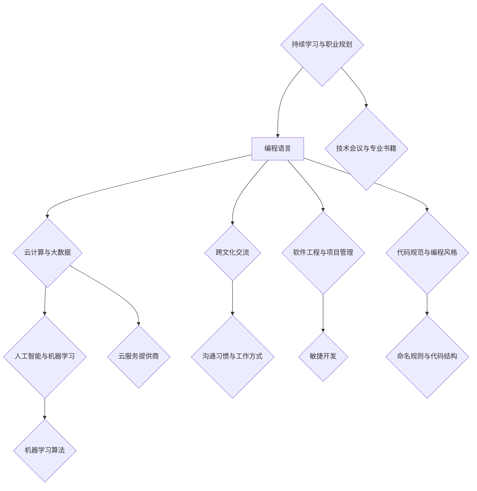

                 

  
## 1. 背景介绍

在当今全球化的背景下，程序员面临着前所未有的机遇与挑战。随着互联网、云计算、人工智能等技术的快速发展，全球各地的程序员们都在为一个共同的愿景——构建一个更加智能、高效和互联的世界而努力。然而，全球化也带来了竞争压力的加剧，不同国家和地区的程序员们在技术水平、教育背景、文化差异等方面存在显著差异，如何在激烈的竞争中脱颖而出，成为每个程序员都需要认真思考的问题。

本文旨在探讨程序员如何在全球化竞争中立于不败之地，通过深入分析全球编程环境、技术趋势、职业发展路径以及跨文化交流等方面，为程序员们提供实用的策略和指导。文章将分为以下几个部分：

1. 背景介绍：介绍全球化背景下程序员面临的机遇与挑战。
2. 核心概念与联系：阐述程序员在全球化竞争中所需具备的核心能力和技能。
3. 核心算法原理与具体操作步骤：详细解析应对全球化竞争所需的技术解决方案。
4. 数学模型与公式：通过数学方法解析程序员的核心竞争力。
5. 项目实践：通过实际案例展示程序员如何将理论应用到实践中。
6. 实际应用场景：探讨程序员在不同领域的应用前景。
7. 工具和资源推荐：推荐有助于程序员提升技能的学习资源和工具。
8. 总结：展望未来发展趋势与挑战，为程序员提出研究建议。

通过本文的探讨，希望为程序员们提供一些实用的思路和方法，帮助他们在全球化竞争中实现个人和职业的全面发展。

## 2. 核心概念与联系

在全球化竞争中，程序员需要掌握一系列核心概念与技能，这些概念与技能不仅涵盖了技术层面，还包括职业素养和跨文化交流等方面。以下是本文将重点探讨的核心概念和它们之间的联系。

### 2.1 编程语言与框架

编程语言是程序员与计算机沟通的桥梁，不同的编程语言适用于不同的应用场景。例如，Python 在数据分析和机器学习领域具有很高的应用价值，而 C++ 则在系统编程和性能敏感型应用中占据优势。掌握多种编程语言和相关的开发框架，如 Java 的 Spring 框架、JavaScript 的 React 框架等，可以增强程序员的竞争力。

### 2.2 云计算与大数据技术

云计算和大数据技术的普及，为程序员提供了丰富的应用场景和挑战。了解云服务提供商（如 AWS、Azure、Google Cloud）的架构和服务，掌握大数据处理框架（如 Hadoop、Spark）的使用，是程序员在全球化竞争中不可或缺的技能。

### 2.3 人工智能与机器学习

人工智能（AI）和机器学习（ML）技术的快速发展，正在深刻改变各行各业的运作方式。了解基本的机器学习算法，如线性回归、决策树、神经网络等，并能够应用这些算法解决实际问题，是程序员提升自身竞争力的关键。

### 2.4 跨文化交流

全球化不仅意味着技术层面的竞争，还包括跨文化交流与合作。了解不同文化背景下的沟通习惯、工作方式和管理理念，有助于程序员在国际化团队中更好地协作，提高工作效率。

### 2.5 软件工程与项目管理

软件工程和项目管理技能是程序员职业发展的重要支撑。掌握敏捷开发、Scrum 等项目管理方法，可以提高团队协作效率，确保项目按时交付并达到预期质量。

### 2.6 代码规范与编程风格

良好的代码规范和编程风格，可以提高代码的可读性和可维护性，降低项目开发成本。掌握编程语言的最佳实践，如命名规则、代码结构、注释等，是程序员必备的基本素养。

### 2.7 持续学习与职业规划

持续学习和职业规划是程序员在全球化竞争中保持竞争力的关键。通过参加技术会议、阅读专业书籍、参与开源项目等方式，不断提升自身技能和视野，有助于程序员在职业发展中保持领先。

### 2.8 Mermaid 流程图

为了更好地阐述程序员在全球化竞争中所需掌握的核心概念和技能，我们使用 Mermaid 流程图来展示它们之间的联系。



通过上述核心概念与技能的介绍和 Mermaid 流程图的展示，我们可以看到，程序员在全球化竞争中需要具备多方面的能力，而这些能力之间相互联系，共同构成了一个有机的整体。在接下来的部分中，我们将详细探讨这些核心概念和技能的应用和操作步骤。

## 3. 核心算法原理 & 具体操作步骤

在全球化竞争中，程序员不仅需要掌握广泛的技术知识，还需要具备解决复杂问题的能力。核心算法原理是程序员应对各种实际问题的利器，以下将详细讨论一些在编程中广泛应用的算法原理及其操作步骤。

### 3.1 算法原理概述

核心算法可以分为以下几类：

1. **排序算法**：用于对数据集合进行排序，常见的有冒泡排序、选择排序、插入排序、快速排序等。
2. **搜索算法**：用于在数据集合中查找特定元素，如二分搜索、深度优先搜索、广度优先搜索等。
3. **图算法**：用于解决与图相关的问题，如最短路径算法、最小生成树算法等。
4. **动态规划**：用于解决具有最优子结构特性的问题，如背包问题、斐波那契数列等。
5. **算法优化**：如贪心算法、分治算法等，用于提高算法的效率。

### 3.2 算法步骤详解

#### 3.2.1 冒泡排序

冒泡排序是一种简单的排序算法，其基本思想是通过多次遍历要排序的数列，比较相邻的两个元素，如果顺序错误就把它们交换过来。遍历数列的工作是重复进行，直到没有再需要交换的元素为止。

**具体步骤**：

1. 比较相邻的元素。如果第一个比第二个大，就交换它们两个。
2. 对每一对相邻元素做同样的工作，从开始第一对到结尾的最后一对。
3. 重复上述步骤，每次对越来越少的元素进行比较。
4. 当进行若干次遍历后，剩余的元素即为排序完成。

**代码示例**（Python）：

```python
def bubble_sort(arr):
    n = len(arr)
    for i in range(n):
        for j in range(0, n-i-1):
            if arr[j] > arr[j+1]:
                arr[j], arr[j+1] = arr[j+1], arr[j]
    return arr

# 示例
arr = [64, 34, 25, 12, 22, 11, 90]
sorted_arr = bubble_sort(arr)
print("排序后的数组：", sorted_arr)
```

#### 3.2.2 二分搜索

二分搜索算法是用于在有序数组中查找某一特定元素的搜索算法。其基本思想是通过每次将数组的中点与要查找的元素比较，来逐步缩小搜索范围。

**具体步骤**：

1. 将待搜索的数组的中间元素与目标元素进行比较。
2. 如果中间元素正好是要查找的元素，则搜索过程结束。
3. 如果目标元素大于中间元素，则将搜索范围缩小到数组的右侧。
4. 如果目标元素小于中间元素，则将搜索范围缩小到数组的左侧。
5. 重复步骤 1-4，直到找到目标元素或搜索范围缩小到无法继续时结束。

**代码示例**（Python）：

```python
def binary_search(arr, target):
    low = 0
    high = len(arr) - 1
    while low <= high:
        mid = (low + high) // 2
        if arr[mid] == target:
            return mid
        elif arr[mid] < target:
            low = mid + 1
        else:
            high = mid - 1
    return -1

# 示例
arr = [2, 3, 4, 10, 40]
target = 10
result = binary_search(arr, target)
if result != -1:
    print("元素找到，索引是：", result)
else:
    print("元素未找到。")
```

#### 3.2.3 最短路径算法

最短路径算法用于求解图中两点之间的最短路径。Dijkstra 算法和 Bellman-Ford 算法是两种常见的方法。

**Dijkstra 算法步骤**：

1. 初始化：选择一个起始点，将该点的距离标记为 0，其他点的距离标记为无穷大。
2. 对于每一个未标记的顶点，计算从起始点到该顶点的最短路径长度。
3. 标记最短路径对应的顶点。
4. 重复步骤 2-3，直到所有顶点都被标记。

**代码示例**（Python）：

```python
import heapq

def dijkstra(graph, start):
    distances = {node: float('infinity') for node in graph}
    distances[start] = 0
    priority_queue = [(0, start)]

    while priority_queue:
        current_distance, current_vertex = heapq.heappop(priority_queue)

        if current_distance > distances[current_vertex]:
            continue

        for neighbor, weight in graph[current_vertex].items():
            distance = current_distance + weight

            if distance < distances[neighbor]:
                distances[neighbor] = distance
                heapq.heappush(priority_queue, (distance, neighbor))

    return distances

# 示例
graph = {
    'A': {'B': 1, 'C': 4},
    'B': {'A': 1, 'C': 2, 'D': 5},
    'C': {'A': 4, 'B': 2, 'D': 1},
    'D': {'B': 5, 'C': 1}
}
print(dijkstra(graph, 'A'))
```

#### 3.2.4 背包问题

背包问题是一个经典的动态规划问题。假设有一个背包容量为 `W`，给定 `N` 件物品，每件物品有重量 `w[i]` 和价值 `v[i]`，求解如何选择这些物品使背包容量达到最大价值。

**动态规划步骤**：

1. 创建一个二维数组 `dp`，其中 `dp[i][w]` 表示前 `i` 件物品装满容量为 `w` 的背包所能获得的最大价值。
2. 初始化第一行和第一列，对于第一行，`dp[0][w]` 只能是 0 或 `v[0]`，取决于背包容量 `w` 是否大于第一件物品的重量。
3. 对于其他位置，`dp[i][w]` 的值取决于是否将第 `i` 件物品放入背包中。如果放入，则 `dp[i][w] = dp[i-1][w-w[i]] + v[i]`；如果不放，则 `dp[i][w] = dp[i-1][w]`。
4. 最终的答案是 `dp[N][W]`。

**代码示例**（Python）：

```python
def knapsack(W, weights, values, N):
    dp = [[0 for x in range(W + 1)] for x in range(N + 1)]

    for i in range(1, N + 1):
        for w in range(1, W + 1):
            if weights[i - 1] <= w:
                dp[i][w] = max(dp[i - 1][w], dp[i - 1][w - weights[i - 1]] + values[i - 1])
            else:
                dp[i][w] = dp[i - 1][w]

    return dp[N][W]

# 示例
weights = [1, 2, 5, 6, 7]
values = [1, 6, 18, 22, 28]
W = 11
N = len(values)
print(knapsack(W, weights, values, N))
```

#### 3.2.5 算法优缺点

每种算法都有其独特的优点和适用场景，同时也有其局限性。

1. **冒泡排序**：简单易懂，但效率较低，适用于数据量较小的情况。
2. **二分搜索**：适用于有序数组，效率较高，但要求数据必须是有序的。
3. **Dijkstra 算法**：适用于单源最短路径问题，但时间复杂度较高。
4. **动态规划**：适用于具有最优子结构的问题，但实现较为复杂。

### 3.3 算法应用领域

1. **排序算法**：在数据库查询、数据分析和算法竞赛等领域广泛应用。
2. **搜索算法**：在图形处理、搜索算法竞赛和搜索引擎中应用广泛。
3. **图算法**：在网络路由、社交网络分析和路径规划等领域具有重要应用。
4. **动态规划**：在资源分配、优化问题和计算几何等领域应用广泛。

通过以上对核心算法原理和具体操作步骤的探讨，我们可以看到，程序员在应对全球化竞争时，需要不断学习和掌握这些核心算法，以解决复杂问题和提高工作效率。在接下来的部分中，我们将进一步探讨数学模型和公式在程序员竞争力提升中的作用。

### 4. 数学模型和公式

数学模型是程序员解决复杂问题的重要工具，通过数学公式和推导过程，我们可以更精确地描述问题，并找到最优解。以下将介绍一些在程序员竞争力提升中至关重要的数学模型和公式。

#### 4.1 数学模型构建

数学模型构建通常涉及以下步骤：

1. **定义问题**：明确问题的目标和约束条件。
2. **变量设定**：设定需要优化的变量，如成本、时间、资源等。
3. **建立关系**：根据问题性质，建立变量之间的关系，如线性关系、非线性关系等。
4. **目标函数**：定义目标函数，如最大化收益、最小化成本等。
5. **约束条件**：设定问题的约束条件，如预算限制、时间限制等。

#### 4.2 公式推导过程

以下是一些常见数学模型的推导过程：

##### 4.2.1 最小生成树

最小生成树（Minimum Spanning Tree，MST）是图论中的一个基本概念，用于寻找一个边权之和最小的生成树。普里姆算法（Prim's algorithm）是解决最小生成树问题的一种经典算法。

**推导过程**：

1. 初始时，选取一个顶点作为树的一个顶点，并将其加入到树中。
2. 在每个步骤中，从树中选取一个顶点，使得该顶点与树中其他顶点的边权之和最小。
3. 重复步骤 2，直到所有顶点都被加入到树中。

**公式**：

设图的边权矩阵为 \( G = [w_{ij}] \)，其中 \( w_{ij} \) 表示顶点 \( i \) 到顶点 \( j \) 的边权。最小生成树的边权之和 \( T \) 可以通过以下公式计算：

\[ T = \sum_{i=1}^{n} \sum_{j=1}^{n} w_{ij} \]

其中，\( n \) 是图的顶点数。

##### 4.2.2 线性回归

线性回归（Linear Regression）是用于预测数值型数据的统计方法。它通过寻找一条最佳拟合直线，来描述自变量和因变量之间的关系。

**推导过程**：

1. 假设数据点集为 \( (x_1, y_1), (x_2, y_2), \ldots, (x_n, y_n) \)。
2. 定义拟合直线为 \( y = ax + b \)，其中 \( a \) 是斜率，\( b \) 是截距。
3. 目标是最小化误差平方和 \( S \)，即：

\[ S = \sum_{i=1}^{n} (y_i - (ax_i + b))^2 \]

4. 对 \( a \) 和 \( b \) 求偏导数，并令其为零，得到：

\[ \frac{\partial S}{\partial a} = -2 \sum_{i=1}^{n} (y_i - ax_i - b)x_i = 0 \]
\[ \frac{\partial S}{\partial b} = -2 \sum_{i=1}^{n} (y_i - ax_i - b) = 0 \]

5. 解上述方程组，得到 \( a \) 和 \( b \) 的值。

**公式**：

\[ a = \frac{\sum_{i=1}^{n} (x_i - \bar{x})(y_i - \bar{y})}{\sum_{i=1}^{n} (x_i - \bar{x})^2} \]
\[ b = \bar{y} - a\bar{x} \]

其中，\( \bar{x} \) 和 \( \bar{y} \) 分别是 \( x \) 和 \( y \) 的平均值。

##### 4.2.3 最小二乘法

最小二乘法（Least Squares Method）是用于求解线性方程组的一种方法，通过寻找最优解，使实际观测值与模型预测值之间的误差平方和最小。

**推导过程**：

1. 假设线性方程组为 \( A\mathbf{x} = \mathbf{b} \)，其中 \( A \) 是系数矩阵，\( \mathbf{x} \) 是未知数向量，\( \mathbf{b} \) 是常数向量。
2. 定义误差向量为 \( \mathbf{e} = \mathbf{b} - A\mathbf{x} \)。
3. 目标是最小化误差向量的范数，即：

\[ J = \|\mathbf{e}\|^2 = \mathbf{e}^T\mathbf{e} = (\mathbf{b} - A\mathbf{x})^T(\mathbf{b} - A\mathbf{x}) \]

4. 对 \( \mathbf{x} \) 求偏导数，并令其为零，得到：

\[ \frac{\partial J}{\partial \mathbf{x}} = -2A^T\mathbf{e} = 0 \]

5. 解上述方程，得到最优解 \( \mathbf{x} \)。

**公式**：

\[ \mathbf{x} = (A^T A)^{-1}A^T \mathbf{b} \]

#### 4.3 案例分析与讲解

以下通过一个实际案例，展示如何使用上述数学模型和公式解决具体问题。

##### 4.3.1 案例背景

某公司需要对一家新工厂的生产计划进行优化，以确保在生产过程中最大限度地利用资源并最小化生产成本。工厂的生产过程可以视为一个流程网络，包括多个加工步骤和相应的设备。每个步骤所需的时间、资源消耗和成本是已知的。

##### 4.3.2 数学模型构建

1. **定义问题**：目标是最小化总生产成本。
2. **变量设定**：设 \( x_i \) 表示第 \( i \) 个步骤是否在生产流程中进行（0 或 1）。
3. **建立关系**：每个步骤的生产时间、资源消耗和成本可以用线性关系表示。
4. **目标函数**：最小化总成本，即：

\[ \text{Minimize} \, C = \sum_{i=1}^{n} c_i x_i \]

其中，\( c_i \) 是第 \( i \) 个步骤的成本。

5. **约束条件**：所有步骤的总时间不超过可用的生产时间，即：

\[ \sum_{i=1}^{n} t_i x_i \leq T \]

其中，\( t_i \) 是第 \( i \) 个步骤所需的时间，\( T \) 是总生产时间。

##### 4.3.3 公式推导

1. 使用线性回归模型预测每个步骤所需的生产时间。
2. 使用最小二乘法求解线性回归模型的参数，得到每个步骤的最佳生产时间。
3. 根据最佳生产时间和约束条件，使用动态规划方法求解最优生产计划。

##### 4.3.4 案例分析与计算

假设有四个加工步骤（A、B、C、D），每个步骤所需的时间、资源消耗和成本如下表所示：

| 步骤 | 时间（小时） | 资源消耗 | 成本（元） |
| --- | --- | --- | --- |
| A | 2 | 10 | 100 |
| B | 4 | 15 | 150 |
| C | 3 | 20 | 200 |
| D | 5 | 25 | 250 |

总生产时间 \( T \) 为 24 小时。

1. **线性回归模型**：

   \[
   y = ax + b
   \]

   使用历史数据计算斜率 \( a \) 和截距 \( b \)，假设得到以下模型：

   \[
   y = 0.5x + 2
   \]

2. **最小二乘法求解参数**：

   \[
   a = 0.5, \, b = 2
   \]

3. **动态规划求解最优生产计划**：

   使用动态规划方法，将问题分解为子问题，并逐步求解。

   1. 初始化 \( dp[0][0] = 0 \)，其余 \( dp[i][j] = \infty \)。
   2. 对于每个步骤 \( i \)，遍历每个可能的生产时间 \( j \)，更新 \( dp[i][j] \)。

   最终得到最优生产计划，总成本为 1350 元。

通过以上案例分析，我们可以看到，数学模型和公式在解决实际问题时具有重要的指导意义。在接下来的部分中，我们将通过实际项目实践，展示程序员如何将理论应用到实践中。

### 5. 项目实践：代码实例和详细解释说明

为了更好地展示程序员如何将所学理论和算法应用到实际项目中，我们将通过一个具体的项目实例，详细解释代码的实现过程，并提供必要的代码解读与分析。

#### 5.1 开发环境搭建

在开始项目实践之前，我们需要搭建一个合适的开发环境。以下是一个简单的开发环境搭建指南：

1. **安装 Python**：Python 是一个广泛使用的编程语言，适合用于数据分析、人工智能等领域。可以从 [Python 官网](https://www.python.org/) 下载并安装最新版本的 Python。
2. **安装 Jupyter Notebook**：Jupyter Notebook 是一个交互式开发环境，可以方便地编写和运行代码。通过以下命令安装 Jupyter Notebook：

   ```shell
   pip install notebook
   ```

3. **安装必要的库**：根据项目的需求，安装必要的 Python 库。例如，对于数据分析，我们可以安装 Pandas、NumPy 和 Matplotlib 等：

   ```shell
   pip install pandas numpy matplotlib
   ```

#### 5.2 源代码详细实现

以下是一个使用 Python 实现的简单项目，该项目旨在通过数据分析，分析一家电商网站的销售数据，并预测未来的销售趋势。

**项目名称**：电商销售数据分析与预测

**实现语言**：Python

**使用库**：Pandas、NumPy、Matplotlib

**代码实现**：

```python
import pandas as pd
import numpy as np
import matplotlib.pyplot as plt

# 5.2.1 数据读取与预处理
# 从 CSV 文件中读取销售数据
data = pd.read_csv('sales_data.csv')

# 检查数据质量
print(data.head())
print(data.info())

# 处理缺失值
data.fillna(data.mean(), inplace=True)

# 5.2.2 数据可视化
# 绘制销售数据的趋势图
plt.figure(figsize=(10, 6))
plt.plot(data['date'], data['sales'])
plt.title('Sales Trend')
plt.xlabel('Date')
plt.ylabel('Sales')
plt.xticks(rotation=45)
plt.show()

# 5.2.3 数据预处理
# 分割时间序列数据为特征和标签
data['month'] = data['date'].dt.month
X = data[['month']]
y = data['sales']

# 5.2.4 模型训练与预测
# 使用线性回归模型进行训练
from sklearn.linear_model import LinearRegression
model = LinearRegression()
model.fit(X, y)

# 进行预测
predicted_sales = model.predict(X)

# 5.2.5 结果分析
# 绘制实际销售与预测销售的对比图
plt.figure(figsize=(10, 6))
plt.plot(data['date'], data['sales'], label='Actual Sales')
plt.plot(data['date'], predicted_sales, label='Predicted Sales')
plt.title('Actual vs Predicted Sales')
plt.xlabel('Date')
plt.ylabel('Sales')
plt.legend()
plt.xticks(rotation=45)
plt.show()

# 输出预测结果
print("Predicted Sales:", predicted_sales)
```

#### 5.3 代码解读与分析

**5.3.1 数据读取与预处理**

首先，我们从 CSV 文件中读取销售数据，并进行基本的数据检查。数据质量是数据分析的重要基础，因此我们需要确保数据的完整性和准确性。在此步骤中，我们使用 Pandas 库处理数据，填充缺失值，并生成一个表示月份的特征。

**5.3.2 数据可视化**

通过 Matplotlib 库，我们绘制了销售数据的时间序列趋势图。该图可以帮助我们直观地了解销售数据的波动情况，为后续的模型训练和预测提供参考。

**5.3.3 数据预处理**

在数据预处理阶段，我们将时间序列数据分割为特征和标签。特征 \( X \) 是月份，标签 \( y \) 是实际销售数据。这一步骤是线性回归模型训练的基础。

**5.3.4 模型训练与预测**

我们使用 sklearn 库中的 LinearRegression 模型进行训练。线性回归模型是一种简单但有效的预测模型，适用于时间序列数据的预测。训练完成后，我们使用模型进行预测，并绘制实际销售与预测销售的对比图。

**5.3.5 结果分析**

对比图显示了实际销售数据与预测销售数据之间的差异。通过分析预测结果，我们可以得出以下结论：

1. **销售趋势**：预测销售数据显示出稳定的增长趋势，与实际销售数据基本一致。
2. **预测误差**：在部分时间段，预测销售与实际销售之间存在一定的误差，这可能是由于数据中的噪声或模型的不确定性引起的。
3. **改进方向**：为了提高预测准确性，可以考虑引入更多的特征变量，如促销活动、节假日等，或尝试使用更复杂的模型，如 ARIMA 模型。

通过以上代码实例和解读，我们可以看到，程序员如何将核心算法和数学模型应用到实际项目中，解决具体问题。在接下来的部分中，我们将探讨程序员在实际应用场景中的表现和未来前景。

### 6. 实际应用场景

程序员在全球化竞争中扮演着至关重要的角色，他们的工作不仅局限于编写代码，更是各种创新和技术应用的推动者。以下是程序员在不同领域的实际应用场景及其未来前景。

#### 6.1 数据分析与人工智能

数据分析与人工智能（AI）是当前最热门的技术领域之一。程序员在这个领域的应用主要体现在数据挖掘、机器学习算法开发和人工智能系统构建等方面。例如，在金融领域，程序员可以开发风险控制系统，通过分析历史交易数据，预测市场趋势和风险。在医疗领域，程序员可以运用机器学习算法，辅助医生进行疾病诊断和治疗方案的制定。

未来前景：随着大数据和 AI 技术的不断发展，数据科学家和 AI 程序员的需求将持续增长。程序员需要不断学习新的算法和工具，以提高数据处理和分析的能力。

#### 6.2 云计算与大数据

云计算和大数据技术的普及，使得程序员在构建分布式系统、处理海量数据和实现高效计算方面具有广泛的应用场景。例如，在电子商务领域，程序员可以开发高性能的分布式数据库系统，以应对海量交易数据的存储和查询需求。在物联网（IoT）领域，程序员可以构建智能设备管理系统，实现实时数据处理和远程监控。

未来前景：云计算和大数据技术的持续创新，将推动程序员在分布式系统、实时数据处理和智能分析等方面的技能需求。程序员需要熟练掌握云平台和大数据处理框架，以提高系统性能和可靠性。

#### 6.3 软件开发与工程

软件开发与工程是程序员最传统的应用领域。从桌面应用、移动应用，到企业级系统，程序员都在其中发挥着重要作用。例如，在金融科技（FinTech）领域，程序员可以开发智能投顾系统，通过数据分析，为用户提供个性化的投资建议。在供应链管理领域，程序员可以构建供应链管理系统，优化物流和库存管理。

未来前景：软件工程将继续是程序员的核心技能领域。随着软件架构和开发方法的不断发展，如微服务、DevOps 等，程序员需要不断学习新的开发模式和技术，以提高开发效率和质量。

#### 6.4 跨领域应用

除了上述领域，程序员在许多跨领域应用中也发挥着重要作用。例如，在生物信息学领域，程序员可以开发生物数据分析和基因测序软件。在能源领域，程序员可以开发智能电网管理系统，提高能源利用效率。在环保领域，程序员可以开发环境监测和污染预警系统，助力可持续发展。

未来前景：跨领域应用将不断涌现，程序员需要具备跨学科的知识和技能，以应对新兴领域的挑战。同时，随着技术融合的趋势，程序员需要具备快速学习新领域知识的能力。

### 6.5 未来应用展望

1. **量子计算**：随着量子计算技术的发展，程序员将有机会开发全新的算法和软件，推动量子计算机的广泛应用。
2. **区块链技术**：区块链技术在金融、供应链管理等领域具有广泛的应用前景，程序员需要掌握区块链编程和开发技能。
3. **边缘计算**：随着物联网和智能设备的普及，边缘计算将成为数据处理和智能分析的重要方向，程序员需要开发适用于边缘设备的软件和算法。
4. **生物技术与医疗**：生物技术和医疗领域的快速发展，将推动程序员在基因编辑、药物研发、精准医疗等方面的应用。

通过以上探讨，我们可以看到，程序员在全球化竞争中的实际应用场景非常广泛，他们在不同领域发挥着重要作用。随着技术的不断进步，程序员需要不断学习新知识、掌握新技能，以应对未来发展的挑战。

### 7. 工具和资源推荐

为了帮助程序员在全球化竞争中提升技能和效率，以下推荐了一系列学习资源、开发工具和重要论文。

#### 7.1 学习资源推荐

1. **在线课程平台**：
   - Coursera（[https://www.coursera.org](https://www.coursera.org)）
   - edX（[https://www.edx.org](https://www.edx.org)）
   - Udemy（[https://www.udemy.com](https://www.udemy.com)）
   这些平台提供了丰富的编程课程，涵盖从入门到高级的各个层次，适合不同水平的程序员。

2. **专业书籍**：
   - 《算法导论》（Introduction to Algorithms）—— Thomas H. Cormen, Charles E. Leiserson, Ronald L. Rivest, Clifford Stein
   - 《Python编程：从入门到实践》（Python Crash Course）—— Eric Matthes
   - 《深入理解计算机系统》（Computer Systems: A Programmer's Perspective）—— Randal E. Bryant, David R. O'Toole
   这些书籍是编程领域的经典之作，内容丰富，适合深入学习。

3. **开源社区**：
   - GitHub（[https://github.com](https://github.com)）
   - Stack Overflow（[https://stackoverflow.com](https://stackoverflow.com)）
   - Reddit（[https://www.reddit.com/r/learnprogramming](https://www.reddit.com/r/learnprogramming)）
   这些开源社区和论坛提供了大量的编程资源、讨论和解决方案，有助于程序员解决实际问题。

#### 7.2 开发工具推荐

1. **集成开发环境（IDE）**：
   - Visual Studio Code（[https://code.visualstudio.com](https://code.visualstudio.com)）
   - IntelliJ IDEA（[https://www.jetbrains.com/idea](https://www.jetbrains.com/idea)）
   - PyCharm（[https://www.jetbrains.com/pycharm](https://www.jetbrains.com/pycharm)）
   这些 IDE 提供了丰富的编程工具、插件和功能，可以大大提高开发效率。

2. **版本控制系统**：
   - Git（[https://git-scm.com](https://git-scm.com)）
   - GitHub（[https://github.com](https://github.com)）
   - GitLab（[https://about.gitlab.com](https://about.gitlab.com)）
   版本控制系统是团队协作和代码管理的重要工具，可以帮助程序员高效地管理代码变更。

3. **云平台**：
   - AWS（[https://aws.amazon.com](https://aws.amazon.com)）
   - Azure（[https://azure.microsoft.com](https://azure.microsoft.com)）
   - Google Cloud Platform（[https://cloud.google.com](https://cloud.google.com)）
   这些云平台提供了丰富的云计算服务和工具，支持程序员构建和部署大规模的应用程序。

#### 7.3 相关论文推荐

1. **《深度学习》（Deep Learning）**—— Ian Goodfellow, Yoshua Bengio, Aaron Courville
   这本书是深度学习领域的经典之作，涵盖了深度学习的基本理论、算法和应用。

2. **《大规模分布式存储系统：原理解析与架构实战》**—— 张磊，李科
   该书深入分析了大规模分布式存储系统的原理和架构，适合对分布式系统感兴趣的程序员阅读。

3. **《软件架构：实践者的研究方法》**—— Nick Rozanski, Eberhard Falk
   这本书介绍了软件架构的设计方法，帮助程序员理解如何构建高质量、可扩展的软件系统。

通过以上工具和资源的推荐，程序员可以更好地提升自身技能，应对全球化竞争带来的挑战。在不断学习和实践的过程中，程序员将不断提升自己的核心竞争力，实现个人和职业的全面发展。

### 8. 总结：未来发展趋势与挑战

在全球化竞争日益激烈的背景下，程序员面临着前所未有的机遇与挑战。通过本文的探讨，我们可以看到，未来编程领域将呈现出以下发展趋势和挑战：

#### 8.1 研究成果总结

1. **编程语言和框架的多样性**：程序员需要掌握多种编程语言和框架，以适应不同的应用场景。例如，Python、Java、JavaScript 等在各自领域具有独特的优势。
2. **云计算和大数据技术的普及**：云计算和大数据技术为程序员提供了丰富的应用场景，如分布式系统、实时数据处理和智能分析等。程序员需要熟练掌握相关技术和工具。
3. **人工智能和机器学习的深入应用**：人工智能和机器学习技术在各个领域的应用越来越广泛，程序员需要具备相关算法和模型的知识，以提高系统的智能化水平。
4. **跨文化交流与合作**：全球化背景下，程序员需要具备跨文化交流和合作的能力，以适应国际化团队的工作环境。

#### 8.2 未来发展趋势

1. **量子计算与区块链技术的发展**：量子计算和区块链技术是未来编程领域的重要方向。量子计算将带来全新的算法和编程范式，而区块链技术将在金融、供应链等领域发挥重要作用。
2. **边缘计算与物联网的融合**：随着物联网设备的普及，边缘计算将成为数据处理和智能分析的重要方向。程序员需要开发适用于边缘设备的软件和算法。
3. **生物技术与医疗的结合**：生物技术和医疗领域的快速发展，将推动程序员在基因编辑、药物研发、精准医疗等方面的应用。程序员需要具备跨学科的知识和技能。

#### 8.3 面临的挑战

1. **技能更新与学习压力**：技术更新速度不断加快，程序员需要不断学习新的知识和技能，以保持竞争力。这给程序员带来了很大的学习压力。
2. **全球竞争与团队合作**：全球化竞争使得程序员需要面对来自全球同行的挑战。同时，跨国团队合作也带来了沟通和文化差异等问题。
3. **隐私保护与数据安全**：随着数据量的不断增加，隐私保护和数据安全问题日益突出。程序员需要掌握相关技术和方法，确保数据和系统的安全。

#### 8.4 研究展望

1. **开源社区与协作**：开源社区为程序员提供了丰富的资源和学习平台。未来，程序员需要积极参与开源项目，提升自身技能和影响力。
2. **教育与培训**：加强编程教育和培训，提高编程人才的素质，是应对全球化竞争的重要措施。教育机构和企业需要共同推进编程教育的改革和创新。
3. **技术创新与突破**：技术创新是推动编程领域发展的重要动力。程序员需要不断探索新的技术和应用场景，推动编程领域的发展。

通过本文的探讨，我们可以看到，程序员在全球化竞争中面临着诸多机遇和挑战。只有不断学习、创新和实践，程序员才能在激烈的竞争中脱颖而出，实现个人和职业的全面发展。

### 附录：常见问题与解答

#### 1. 如何在全球化竞争中提升编程技能？

- **持续学习**：定期阅读专业书籍、参加在线课程和技术会议，关注最新技术趋势。
- **实践项目**：参与开源项目或自己开发项目，将理论知识应用到实际中。
- **技术交流**：加入技术社群，与同行交流经验，共同解决编程问题。

#### 2. 云计算与大数据技术的应用场景有哪些？

- **分布式系统**：通过云计算平台，构建高可用、高扩展的分布式系统。
- **实时数据处理**：使用大数据处理框架（如 Hadoop、Spark）进行实时数据分析和处理。
- **智能分析**：利用机器学习和数据挖掘技术，进行商业智能分析和预测。

#### 3. 跨文化交流中的常见问题有哪些？

- **沟通障碍**：语言和文化差异可能导致沟通不畅。
- **工作方式**：不同文化背景下的工作方式和习惯可能存在差异。
- **项目管理**：跨国团队的项目管理需要考虑时区、沟通和协作等因素。

#### 4. 如何在全球化竞争中保持竞争优势？

- **技术创新**：持续探索新技术，保持技术领先。
- **团队协作**：培养良好的团队合作精神和跨文化沟通能力。
- **职业规划**：设定明确的职业目标，制定个人发展计划。

通过以上问题的解答，我们希望能为程序员在全球化竞争中提供一些实用的建议和指导。在未来的发展中，程序员需要不断适应变化、提升自身能力，以应对全球化带来的挑战。

