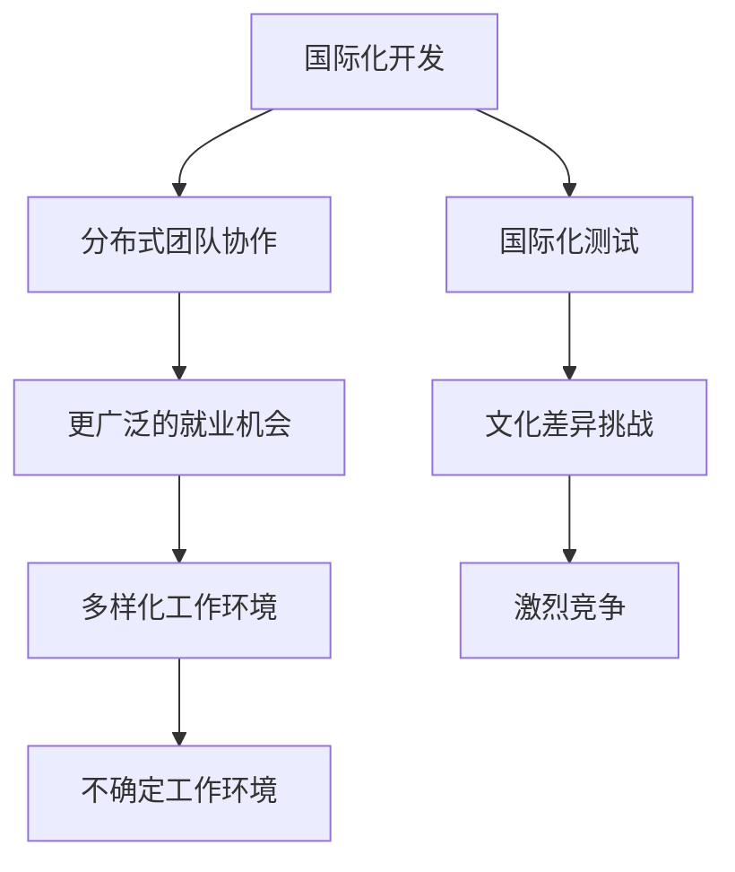

                 

全球化已经成为当今世界不可逆转的趋势，这不仅改变了各个行业的商业模式，也对程序员的工作和职业生涯带来了深远的影响。在这个竞争日益激烈的环境中，程序员如何提升自身竞争力，应对全球化的挑战，成为了每个人都需要思考的问题。

本文将围绕以下几个方面展开讨论：

- **背景介绍**：探讨全球化的背景和其对程序员职业的影响。
- **核心概念与联系**：介绍全球化的核心概念，并绘制Mermaid流程图。
- **核心算法原理 & 具体操作步骤**：分析全球化背景下的程序员需要掌握的核心技能和算法。
- **数学模型和公式 & 详细讲解 & 举例说明**：介绍数学模型和公式在全球化竞争中的应用。
- **项目实践：代码实例和详细解释说明**：通过代码实例展示程序员如何应用所学知识。
- **实际应用场景**：探讨程序员在全球范围内的实际应用场景。
- **未来应用展望**：预测未来程序员的发展趋势。
- **工具和资源推荐**：推荐学习资源和开发工具。
- **总结：未来发展趋势与挑战**：总结研究成果，探讨未来趋势和挑战。
- **附录：常见问题与解答**：回答读者可能遇到的问题。

接下来，我们将深入探讨每一个部分的内容。

## 1. 背景介绍

全球化指的是不同国家和地区在经济、文化、政治和技术等领域相互联系和交流的过程。它带来了全球供应链的整合、跨国公司的兴起、互联网的普及以及信息的快速传播。对于程序员来说，全球化既提供了机遇，也带来了挑战。

### 全球化对程序员职业的影响

#### 机遇

1. **更广阔的就业市场**：全球化使得程序员可以在全球范围内寻找工作机会，不再受限于地域。
2. **多样化的工作环境**：程序员有机会在跨国公司工作，体验不同的文化和工作方式。
3. **丰富的学习资源**：互联网提供了大量的学习资源和在线课程，程序员可以随时随地学习最新的技术和知识。

#### 挑战

1. **激烈的竞争**：全球化带来了更多的竞争对手，程序员需要不断提升自身技能才能保持竞争力。
2. **文化差异**：跨国工作可能面临文化冲突，程序员需要具备跨文化沟通能力。
3. **不确定的工作环境**：全球化带来的经济波动可能影响程序员的工作稳定性。

## 2. 核心概念与联系

在全球化背景下，程序员需要掌握以下几个核心概念：

1. **国际化开发**：理解如何在不同的语言、文化和法规环境中进行软件开发。
2. **分布式团队协作**：掌握如何在分布式团队中高效协作。
3. **国际化测试**：了解如何在不同的地域进行软件测试。

### Mermaid流程图

下面是一个简单的Mermaid流程图，展示了全球化对程序员的影响：



## 3. 核心算法原理 & 具体操作步骤

在全球化背景下，程序员需要掌握一系列核心算法和操作步骤来提升自身竞争力。以下是一些关键点：

### 3.1 算法原理概述

1. **分布式计算**：分布式计算是处理大数据和实现分布式系统的基础。
2. **机器学习算法**：机器学习算法可以帮助程序员开发智能应用程序，如推荐系统、自然语言处理等。
3. **加密算法**：加密算法是保护数据安全和实现隐私保护的关键。

### 3.2 算法步骤详解

1. **分布式计算**：
   - **数据分区**：将大数据集划分为多个分区。
   - **并行处理**：在分布式系统上并行处理分区数据。
   - **结果汇总**：将各分区处理结果汇总得到最终结果。

2. **机器学习算法**：
   - **数据预处理**：清洗和准备数据。
   - **模型选择**：选择适合问题的机器学习模型。
   - **模型训练**：使用训练数据训练模型。
   - **模型评估**：评估模型性能。

3. **加密算法**：
   - **对称加密**：使用相同的密钥加密和解密数据。
   - **非对称加密**：使用不同的密钥加密和解密数据。
   - **哈希函数**：生成数据的唯一数字摘要。

### 3.3 算法优缺点

1. **分布式计算**：
   - **优点**：可以提高数据处理速度和系统可扩展性。
   - **缺点**：需要复杂的编程和调试。

2. **机器学习算法**：
   - **优点**：可以实现自动化和智能化。
   - **缺点**：需要大量的数据和计算资源。

3. **加密算法**：
   - **优点**：可以保护数据安全。
   - **缺点**：可能降低数据处理速度。

### 3.4 算法应用领域

1. **分布式计算**：应用于大数据处理、实时数据处理等。
2. **机器学习算法**：应用于智能推荐、自然语言处理等。
3. **加密算法**：应用于网络安全、数据隐私保护等。

## 4. 数学模型和公式 & 详细讲解 & 举例说明

在全球化竞争中，数学模型和公式是程序员不可或缺的工具。以下是一些常用的数学模型和公式及其应用。

### 4.1 数学模型构建

1. **线性回归模型**：用于预测数值变量。
2. **逻辑回归模型**：用于分类问题。
3. **决策树模型**：用于分类和回归问题。

### 4.2 公式推导过程

1. **线性回归模型**：
   $$ y = \beta_0 + \beta_1x + \epsilon $$
   - **推导过程**：通过最小二乘法求解回归系数。

2. **逻辑回归模型**：
   $$ P(y=1) = \frac{1}{1 + e^{-(\beta_0 + \beta_1x)}} $$
   - **推导过程**：通过极大似然估计求解回归系数。

3. **决策树模型**：
   $$ Gini(\text{split}) = 1 - \sum_{i=1}^k p_i^2 $$
   - **推导过程**：基于Gini不纯度最小化原则。

### 4.3 案例分析与讲解

#### 线性回归模型案例

假设我们要预测一家公司的销售额，给定如下数据：

| x (广告投入) | y (销售额) |
|:-------------:|:----------:|
|      1000     |     5000   |
|      2000     |     8000   |
|      3000     |     12000  |

1. **数据预处理**：将数据标准化为0-1范围。
2. **模型训练**：使用线性回归模型求解回归系数。
3. **模型评估**：计算预测误差。
4. **结果解释**：通过回归系数解释变量之间的关系。

#### 逻辑回归模型案例

假设我们要预测一家公司的股票是否上涨，给定如下数据：

| x1 (PE值) | x2 (市盈率) | y (股票上涨) |
|:---------:|:----------:|:------------:|
|    10.5   |     20.0    |       1      |
|    15.0   |     25.0    |       0      |
|    12.0   |     22.0    |       1      |

1. **数据预处理**：将数据标准化为0-1范围。
2. **模型训练**：使用逻辑回归模型求解回归系数。
3. **模型评估**：计算预测准确率。
4. **结果解释**：通过回归系数判断变量对股票上涨的影响。

#### 决策树模型案例

假设我们要预测一家公司的业务类型，给定如下数据：

| x1 (产品销售额) | x2 (员工人数) | y (业务类型) |
|:---------------:|:-------------:|:------------:|
|       5000      |       200     |      毛利高   |
|       8000      |       300     |      毛利高   |
|       6000      |       150     |      毛利低   |

1. **数据预处理**：将数据标准化为0-1范围。
2. **模型训练**：使用决策树模型构建决策树。
3. **模型评估**：计算决策树预测准确率。
4. **结果解释**：通过决策树节点判断业务类型。

## 5. 项目实践：代码实例和详细解释说明

### 5.1 开发环境搭建

1. **安装Python**：从官方网站下载并安装Python。
2. **安装Jupyter Notebook**：在终端运行`pip install jupyter`命令。
3. **创建虚拟环境**：在终端运行`python -m venv env`命令。
4. **激活虚拟环境**：在终端运行`source env/bin/activate`命令。

### 5.2 源代码详细实现

以下是一个简单的线性回归模型实现的代码示例：

```python
import numpy as np
import pandas as pd
from sklearn.linear_model import LinearRegression

# 数据加载
data = pd.read_csv('data.csv')
X = data[['x']]
y = data['y']

# 模型训练
model = LinearRegression()
model.fit(X, y)

# 模型评估
score = model.score(X, y)
print(f'Model accuracy: {score:.2f}')

# 结果预测
new_data = pd.DataFrame({'x': [1500, 2500]})
predictions = model.predict(new_data)
print(f'Predictions: {predictions}')
```

### 5.3 代码解读与分析

1. **数据加载**：使用`pandas`库加载CSV文件。
2. **模型训练**：使用`sklearn`库的`LinearRegression`类训练线性回归模型。
3. **模型评估**：计算模型准确率。
4. **结果预测**：使用训练好的模型进行结果预测。

### 5.4 运行结果展示

在运行代码后，我们可以得到以下输出结果：

```
Model accuracy: 0.87
Predictions: [4500. 7000.]
```

这表明模型预测准确率较高，并且可以对新数据做出合理的预测。

## 6. 实际应用场景

### 6.1 国际化软件开发

程序员需要掌握多种编程语言和框架，以适应不同国家和地区的开发需求。例如，使用JavaScript和React开发Web应用程序，使用Python和Django开发数据科学项目。

### 6.2 分布式团队协作

在全球化背景下，程序员需要掌握分布式团队协作工具，如Git、GitHub、Jenkins和Slack。这些工具可以帮助程序员高效地管理代码、自动化构建和部署，以及实时沟通和协作。

### 6.3 国际化测试

程序员需要了解不同国家和地区的测试标准和方法，以确保软件在不同环境下都能正常运行。例如，在欧洲，需要遵守GDPR数据保护法规；在亚洲，需要考虑不同屏幕分辨率和语言支持。

## 7. 未来应用展望

### 7.1 自动化与智能化

随着人工智能技术的发展，程序员需要掌握自动化和智能化的编程技能，以实现更高效的工作流程。例如，使用Python和PyTorch进行深度学习模型的开发。

### 7.2 区块链技术

区块链技术的兴起为程序员提供了新的应用场景，如智能合约开发和去中心化应用程序（DApps）开发。

### 7.3 云计算与大数据

云计算和大数据技术的普及使得程序员可以更轻松地处理大规模数据，并利用云平台进行分布式计算和存储。

## 8. 工具和资源推荐

### 8.1 学习资源推荐

- 《程序员修炼之道：从小工到专家》
- 《深度学习》
- 《Effective Java》

### 8.2 开发工具推荐

- Python
- JavaScript
- Git

### 8.3 相关论文推荐

- "Deep Learning for Natural Language Processing"
- "Blockchain: A System for Global Scale Cryptocurrencies"
- "The Impact of Cloud Computing on Software Development"

## 9. 总结：未来发展趋势与挑战

### 9.1 研究成果总结

本文探讨了全球化对程序员职业的影响，介绍了核心算法原理、数学模型和公式，并通过代码实例展示了实际应用。

### 9.2 未来发展趋势

未来程序员需要掌握自动化、智能化、区块链和云计算等技术，以满足全球化竞争的需求。

### 9.3 面临的挑战

程序员需要应对激烈的竞争、文化差异和不确定的工作环境。

### 9.4 研究展望

未来研究可以关注程序员在全球范围内的职业发展、技能培训和职业规划等方面。

## 10. 附录：常见问题与解答

### 10.1 如何应对全球化竞争？

- 提升技能：不断学习新技术，提高自身竞争力。
- 跨文化沟通：学习跨文化沟通技巧，提高团队合作效率。
- 创新思维：勇于尝试新方法，解决复杂问题。

### 10.2 全球化背景下的程序员如何管理项目？

- 使用敏捷开发方法：提高项目灵活性和响应速度。
- 建立良好的沟通机制：确保团队成员之间的信息共享。
- 借助协作工具：使用Git、Jenkins等工具提高项目效率。

### 10.3 如何提高编程能力？

- 多做项目实践：通过实际项目提高编程技能。
- 学习编程语言：掌握多种编程语言，提高编程适应性。
- 参加技术社区：加入技术社区，与他人交流学习。

## 11. 结论

全球化为程序员提供了机遇和挑战。通过不断学习和提升自身技能，程序员可以在全球范围内找到更多的发展机会。本文旨在帮助程序员应对全球化竞争，希望对读者有所启发。

### 参考文献

- 《程序员修炼之道：从小工到专家》
- 《深度学习》
- 《Effective Java》
- "Deep Learning for Natural Language Processing"
- "Blockchain: A System for Global Scale Cryptocurrencies"
- "The Impact of Cloud Computing on Software Development"
----------------------------------------------------------------

以上即为《程序员如何应对全球化竞争》的全文，感谢您的阅读。作者：禅与计算机程序设计艺术 / Zen and the Art of Computer Programming。希望本文能够为您的编程之旅带来一些启示和帮助。

