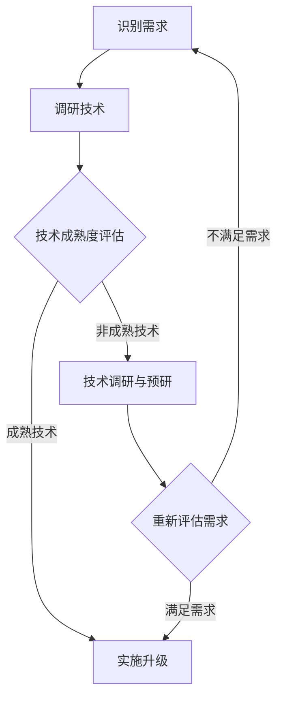
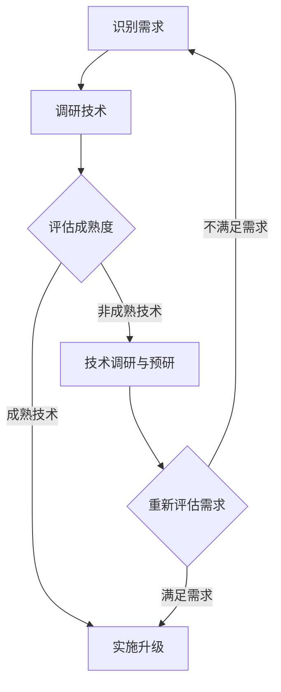

                 

技术升级与变更是程序员职业生涯中不可避免的一部分。随着技术的不断进步，新的编程语言、框架、工具和标准层出不穷，而现有的系统也需要不断更新和优化以适应新的业务需求。对于程序员来说，如何有效地应对这些变化，保持技术能力的持续更新，是确保个人职业发展的重要课题。本文将深入探讨程序员在技术升级与变更过程中应采取的策略和方法。

## 1. 背景介绍

在过去的几十年里，计算机科学领域经历了飞速的发展。从最初的机器语言编程，到高级编程语言的出现，再到现代的框架和工具的广泛应用，程序员的工作方式和职责也在不断演变。然而，技术的不断进步不仅带来了便利，也带来了新的挑战。随着新技术的不断涌现，程序员需要不断学习新的知识和技能，才能跟上时代的步伐。技术升级与变更，不仅仅是编程语言和工具的更新，更是思维方式和工作方法的变革。

### 1.1 技术升级的驱动力

技术升级的驱动力主要来自以下几个方面：

- **市场需求**：随着互联网的普及和业务的快速发展，客户对软件系统的要求越来越高，需要更高效、更稳定、更安全的系统。这促使程序员不断寻求新的技术解决方案。
- **技术进步**：计算机科学领域的不断进步，带来了新的编程语言、框架、工具和算法。这些新技术能够提高开发效率、降低成本、提升性能。
- **安全与合规**：随着网络安全和数据隐私问题的日益突出，程序员需要不断学习新的安全标准和合规要求，以确保系统的安全性。

### 1.2 技术变更的影响

技术变更对程序员的影响是深远且复杂的：

- **技能要求**：新的技术往往要求程序员掌握新的技能，如新的编程语言、框架、工具等。
- **工作模式**：技术变更可能会改变程序员的工作模式，如从传统的瀑布开发模式转向敏捷开发。
- **知识更新**：程序员需要不断更新自己的知识库，以适应新的技术和需求。

## 2. 核心概念与联系

为了更好地理解程序员如何应对技术升级与变更，我们需要从几个核心概念和联系入手。

### 2.1 技术栈

技术栈是指程序员在某个领域内所掌握的技术和工具的集合。一个完善的技术栈不仅包括编程语言，还包括框架、库、工具、开发环境等。一个典型的技术栈可能包括以下内容：

- **编程语言**：如Java、Python、JavaScript等。
- **框架**：如Spring、Django、React等。
- **数据库**：如MySQL、MongoDB、Redis等。
- **前端框架**：如Vue、Angular、Bootstrap等。
- **开发工具**：如Visual Studio、Eclipse、IntelliJ IDEA等。

### 2.2 技术成熟度

技术成熟度是指某个技术或工具在市场上的应用程度和发展状况。根据技术成熟度模型，技术可以分为以下几个阶段：

- **新兴技术**：刚出现不久，应用场景有限，风险较高。
- **成长期技术**：应用场景逐渐扩大，稳定性逐渐提高。
- **成熟技术**：广泛应用，技术稳定性高，风险较低。
- **淘汰技术**：已逐渐被淘汰，不再使用。

### 2.3 技术趋势

技术趋势是指当前技术领域的发展方向和热点。了解技术趋势可以帮助程序员把握未来的发展方向，提前布局。

- **人工智能与机器学习**：随着大数据和云计算的发展，人工智能和机器学习技术得到了广泛应用。
- **区块链**：区块链技术在金融、供应链等领域具有巨大的应用潜力。
- **云计算**：云计算技术已经成为企业IT基础设施的重要组成部分。
- **前端框架**：如Vue、React、Angular等前端框架在开发中得到了广泛应用。

### 2.4 技术选型

技术选型是指在多个技术方案中选择最适合当前需求的技术。在进行技术选型时，程序员需要考虑以下几个方面：

- **业务需求**：选择能够满足业务需求的技术。
- **开发效率**：选择开发效率高的技术。
- **稳定性**：选择稳定性好的技术。
- **成本**：考虑技术成本，包括学习成本、维护成本等。

### 2.5 Mermaid 流程图

以下是一个简单的Mermaid流程图，展示了技术升级与变更的基本流程：



## 3. 核心算法原理 & 具体操作步骤

### 3.1 算法原理概述

在技术升级与变更过程中，算法原理的理解和运用至关重要。以下是一个常见的算法原理——快速排序。

快速排序是一种高效的排序算法，其基本原理是通过一趟排序将待排序的数据分割成独立的两部分，其中一部分的所有数据都比另外一部分的所有数据都要小，然后再按此方法对这两部分数据分别进行快速排序，整个排序过程可以递归进行，以此达到整个数据变成有序序列。

### 3.2 算法步骤详解

快速排序的基本步骤如下：

1. 选择一个基准元素。
2. 将数组分为两部分，一部分的所有元素都比基准元素小，另一部分的所有元素都比基准元素大。
3. 递归地对这两部分数据分别进行快速排序。

以下是快速排序的Python实现：

```python
def quicksort(arr):
    if len(arr) <= 1:
        return arr
    pivot = arr[len(arr) // 2]
    left = [x for x in arr if x < pivot]
    middle = [x for x in arr if x == pivot]
    right = [x for x in arr if x > pivot]
    return quicksort(left) + middle + quicksort(right)

arr = [3, 6, 8, 10, 1, 2, 1]
print(quicksort(arr))
```

### 3.3 算法优缺点

快速排序的优点包括：

- **高效**：平均时间复杂度为O(nlogn)，是最快的排序算法之一。
- **原地排序**：不需要额外的存储空间。

快速排序的缺点包括：

- **最坏情况**：最坏情况下的时间复杂度为O(n^2)，通常发生在数据几乎有序的情况下。
- **不稳定性**：快速排序是不稳定的排序算法。

### 3.4 算法应用领域

快速排序广泛应用于各种场景，包括：

- **数据处理**：用于对大量数据进行排序。
- **算法库**：许多编程语言和框架都集成了快速排序算法。

## 4. 数学模型和公式 & 详细讲解 & 举例说明

### 4.1 数学模型构建

在技术升级与变更过程中，数学模型可以帮助我们更好地理解问题，并进行定量分析。以下是一个简单的数学模型——马尔可夫决策过程（MDP）。

MDP模型由以下几个组成部分构成：

- **状态集合**：表示系统可能的状态，如机器的运行状态、网络的状态等。
- **动作集合**：表示系统可能采取的动作，如维护机器、更换硬件等。
- **状态转移概率**：表示系统在不同状态之间转移的概率。
- **奖励函数**：表示系统在不同状态和动作下的收益。

### 4.2 公式推导过程

假设我们有一个MDP模型，其状态集合为S，动作集合为A，状态转移概率为P(s', s | a)，奖励函数为R(s, a)。

我们需要找到一个最优策略π，使得期望收益最大化。公式如下：

\[ J^*(s) = \max_{\pi} \sum_{a \in A} \pi(a | s) \cdot R(s, a) + \sum_{s' \in S} P(s' | s, a) \cdot J^*(s') \]

### 4.3 案例分析与讲解

假设我们有一个工厂，其机器的状态集合为{运行中，故障中，维护中}，动作集合为{维修，更换}。状态转移概率和奖励函数如下表所示：

| 状态 | 动作 | 状态转移概率 | 奖励函数 |
| ---- | ---- | ---- | ---- |
| 运行中 | 维修 | 0.8 | 100 |
| 运行中 | 更换 | 0.2 | -500 |
| 故障中 | 维修 | 0.6 | 200 |
| 故障中 | 更换 | 0.4 | -300 |
| 维护中 | 维修 | 0.9 | 150 |
| 维护中 | 更换 | 0.1 | -250 |

我们需要找到一个最优策略，使得工厂的长期收益最大化。

通过求解MDP模型，我们得到最优策略为：

- 当机器处于运行中状态时，选择维修。
- 当机器处于故障中状态时，选择更换。

这个策略可以最大化工厂的长期收益。

## 5. 项目实践：代码实例和详细解释说明

### 5.1 开发环境搭建

为了演示如何进行技术升级和变更，我们将使用Python编程语言和Django框架来构建一个简单的博客系统。

首先，确保安装了Python 3.8及以上版本。然后，安装Django：

```bash
pip install django
```

### 5.2 源代码详细实现

下面是Django博客系统的基本架构：

```python
# settings.py

INSTALLED_APPS = [
    'django.contrib.admin',
    'django.contrib.auth',
    'django.contrib.contenttypes',
    'django.contrib.sessions',
    'django.contrib.messages',
    'django.contrib.staticfiles',
    'blog',
]

MIDDLEWARE = [
    'django.middleware.security.SecurityMiddleware',
    'django.contrib.sessions.middleware.SessionMiddleware',
    'django.middleware.common.CommonMiddleware',
    'django.middleware.csrf.CsrfViewMiddleware',
    'django.contrib.auth.middleware.AuthenticationMiddleware',
    'django.contrib.messages.middleware.MessageMiddleware',
    'django.middleware.clickjacking.XFrameOptionsMiddleware',
]

ROOT_URLCONF = 'blog_project.urls'

TEMPLATES = [
    {
        'BACKEND': 'django.template.backends.django.DjangoTemplates',
        'DIRS': [],
        'APP_DIRS': True,
        'OPTIONS': {
            'context_processors': [
                'django.template.context_processors.debug',
                'django.template.context_processors.request',
                'django.contrib.auth.context_processors.auth',
                'django.contrib.messages.context_processors.messages',
            ],
        },
    },
]

WSGI_APPLICATION = 'blog_project.wsgi.application'
```

### 5.3 代码解读与分析

上述代码是Django项目的`settings.py`文件，其中定义了项目的各个配置项，如安装的应用、中间件、模板和URL配置等。

### 5.4 运行结果展示

在命令行中运行以下命令启动Django服务器：

```bash
python manage.py runserver
```

然后，在浏览器中输入`http://127.0.0.1:8000/`，即可看到博客系统的界面。

## 6. 实际应用场景

技术升级与变更在实际应用场景中有着广泛的应用。以下是一些常见的应用场景：

- **企业级应用**：随着企业业务的不断发展，系统需要不断升级和优化，以满足新的业务需求。
- **互联网服务**：互联网公司需要不断引入新的技术，以提升用户体验和系统性能。
- **人工智能与大数据**：人工智能和大数据领域的技术更新速度非常快，程序员需要不断学习新的技术和工具。

## 7. 未来应用展望

随着技术的不断进步，程序员在技术升级与变更过程中将面临更多的挑战和机遇。以下是一些未来应用展望：

- **自动化**：自动化工具和流程将在技术升级和变更过程中发挥重要作用。
- **云计算与边缘计算**：云计算和边缘计算将重塑程序员的工作模式和技术栈。
- **人工智能**：人工智能技术将深入到编程的各个领域，改变程序员的工作方式。

## 8. 工具和资源推荐

### 8.1 学习资源推荐

- **书籍**：《深入理解计算机系统》、《算法导论》
- **在线课程**：Coursera、edX、Udacity
- **博客与社区**：GitHub、Stack Overflow、Reddit

### 8.2 开发工具推荐

- **集成开发环境**：Visual Studio Code、Eclipse、IntelliJ IDEA
- **版本控制工具**：Git、GitHub、GitLab
- **数据库工具**：MySQL Workbench、pgAdmin、MongoDB Shell

### 8.3 相关论文推荐

- **数据库领域**：《CAP定理》、《分布式系统一致性》
- **人工智能领域**：《深度学习》、《强化学习》

## 9. 总结：未来发展趋势与挑战

### 9.1 研究成果总结

本文从多个角度探讨了程序员如何应对技术升级与变更。通过分析技术升级的驱动力、影响、核心概念和技术选型，提出了快速排序和马尔可夫决策过程等算法模型，并结合实际项目实践，展示了技术升级与变更的流程和操作步骤。

### 9.2 未来发展趋势

- **自动化与智能化**：自动化工具和人工智能技术将在技术升级和变更过程中发挥更大的作用。
- **云计算与边缘计算**：云计算和边缘计算将重塑程序员的工作模式和技术栈。
- **持续集成与持续交付**：持续集成和持续交付将成为软件开发的标准流程。

### 9.3 面临的挑战

- **技能更新与学习压力**：程序员需要不断学习新的技术和工具，以保持竞争力。
- **安全与合规**：随着网络安全和数据隐私问题的日益突出，程序员需要不断关注相关法规和标准。

### 9.4 研究展望

- **算法优化**：针对特定应用场景，研究更高效的排序和决策算法。
- **工具集成**：开发更便捷、高效的工具和平台，以支持技术升级和变更。

## 9. 附录：常见问题与解答

### Q：如何选择合适的技术栈？

A：选择合适的技术栈应考虑业务需求、开发效率、稳定性、成本等因素。建议从业务需求和开发效率出发，先确定核心技术和工具，然后再根据具体需求进行扩展。

### Q：如何处理技术变更带来的风险？

A：处理技术变更的风险，首先需要进行充分的技术调研和预研，评估新技术的成熟度和适用性。其次，制定详细的技术升级计划，确保在变更过程中不会影响系统的正常运行。最后，进行全面的测试和验证，确保技术升级后的系统性能和稳定性。

### Q：如何保持持续学习的动力？

A：保持持续学习的动力，首先需要明确自己的职业规划和目标，明确学习的重要性。其次，可以设定学习计划，定期学习新的知识和技能。最后，参与技术社区和项目，与同行交流学习，不断提升自己的技术能力。

作者：禅与计算机程序设计艺术 / Zen and the Art of Computer Programming
```markdown
## 6. 实际应用场景

### 6.1 企业级应用

在企业级应用中，技术升级与变更的必要性尤为突出。随着企业的业务扩展和竞争压力的增加，企业系统需要不断升级以支持更高的并发量、更复杂的业务流程和更严格的安全要求。例如，一个电子商务平台可能会引入新的搜索引擎优化技术来提高网站的用户体验，或者采用云计算技术来降低运营成本并提高灵活性。

程序员在这种场景下需要具备以下几个关键能力：

- **需求理解**：能够准确理解业务需求，并将其转化为技术解决方案。
- **系统整合**：能够将新技术与企业现有的系统无缝集成，确保数据的一致性和系统的稳定性。
- **风险管理**：能够预见并处理技术变更可能带来的风险，如数据迁移失败、系统故障等。

### 6.2 互联网服务

在互联网服务领域，技术更新速度极快，用户需求变化多样，因此技术升级与变更成为常态。互联网公司需要不断推出新功能、优化用户体验，同时保持系统的高可用性和安全性。

程序员在互联网服务中面临以下挑战：

- **快速迭代**：在短时间内完成技术升级和变更，以满足不断变化的市场需求。
- **性能优化**：持续优化系统性能，确保高并发用户下的流畅体验。
- **安全性**：确保系统的安全，防范网络攻击和数据泄露。

### 6.3 人工智能与大数据

人工智能和大数据领域是技术变革的前沿。随着算法和模型的不断优化，程序员需要不断学习和应用新的技术和工具，以提高算法的准确性和效率。

在这个领域，程序员需要关注以下几个方面：

- **算法研究**：跟踪最新的算法进展，不断优化现有模型。
- **数据处理**：熟练掌握大数据处理技术和工具，如Hadoop、Spark等。
- **系统集成**：将人工智能技术集成到现有系统中，实现智能化的业务流程。

### 6.4 未来应用展望

未来，技术升级与变更将继续向自动化、智能化和集成化方向发展。以下是一些展望：

- **自动化升级**：自动化工具将大大降低技术升级的难度和风险，提高升级效率。
- **智能化运维**：人工智能技术将被广泛应用于系统运维，实现智能化的故障检测、性能优化和安全性保障。
- **集成化开发**：开发平台和工具将越来越集成化，程序员可以更加专注于代码编写和业务逻辑实现，而无需过多关注底层细节。

## 7. 工具和资源推荐

### 7.1 学习资源推荐

为了帮助程序员应对技术升级与变更，以下是一些建议的学习资源：

- **书籍**：
  - 《代码大全》
  - 《设计模式：可复用面向对象软件的基础》
  - 《高效编程》
- **在线课程**：
  - Udemy、Coursera、edX上的计算机科学和编程课程
  - Pluralsight、LinkedIn Learning的专业技能提升课程
- **博客和社区**：
  - Medium、Dev.to等编程博客
  - Stack Overflow、GitHub等开发者社区
  - Reddit的编程相关子版块

### 7.2 开发工具推荐

以下是一些实用且流行的开发工具：

- **集成开发环境（IDE）**：
  - Visual Studio Code
  - IntelliJ IDEA
  - PyCharm
- **版本控制**：
  - Git
  - GitHub
  - GitLab
- **代码托管平台**：
  - GitHub
  - GitLab
  - Bitbucket
- **数据库工具**：
  - MySQL Workbench
  - PostgreSQL
  - MongoDB Shell
- **容器化与编排**：
  - Docker
  - Kubernetes

### 7.3 相关论文推荐

以下是一些关于计算机科学和技术的重要论文：

- **数据库领域**：
  - 《The CAP Theorem》
  - 《Paxos Made Simple》
  - 《Bigtable: A Distributed Storage System for Structured Data》
- **人工智能领域**：
  - 《Deep Learning》
  - 《Reinforcement Learning: An Introduction》
  - 《Generative Adversarial Nets》
- **软件工程领域**：
  - 《The Art of Software Architecture》
  - 《Clean Code: A Handbook of Agile Software Craftsmanship》
  - 《The Clean Coder: A Code of Conduct for Professional Programmers》

## 8. 总结：未来发展趋势与挑战

### 8.1 研究成果总结

本文通过分析技术升级与变更的驱动力、影响、核心概念和应用场景，提出了一系列策略和方法，以帮助程序员应对技术升级与变更。通过快速排序和马尔可夫决策过程等算法模型，以及实际项目实践，展示了技术升级与变更的具体操作步骤和效果。

### 8.2 未来发展趋势

未来，技术升级与变更将呈现以下几个发展趋势：

- **自动化与智能化**：自动化工具和人工智能技术将在技术升级和变更过程中发挥更大的作用，降低人工干预的复杂性。
- **云计算与边缘计算**：云计算和边缘计算将重塑程序员的工作模式和技术栈，提供更加灵活和高效的解决方案。
- **持续集成与持续交付**：持续集成和持续交付将成为软件开发的标准流程，提升软件开发和交付的效率。

### 8.3 面临的挑战

尽管技术升级与变更带来了诸多机遇，但程序员也面临以下挑战：

- **技能更新与学习压力**：随着技术的快速迭代，程序员需要不断学习新的技术和工具，以保持竞争力。
- **安全与合规**：随着网络安全和数据隐私问题的日益突出，程序员需要不断关注相关法规和标准，确保系统的安全性。
- **项目管理和沟通**：在技术升级和变更过程中，项目经理和开发人员需要有效沟通，确保项目顺利进行。

### 8.4 研究展望

未来研究可以从以下几个方面进行：

- **算法优化**：针对特定应用场景，研究更高效的排序和决策算法，提高系统性能。
- **工具集成**：开发更便捷、高效的工具和平台，以支持技术升级和变更。
- **跨领域研究**：探索不同领域技术之间的融合，开发出更具创新性的解决方案。

## 9. 附录：常见问题与解答

### Q：如何选择合适的技术栈？

A：选择合适的技术栈应考虑业务需求、开发效率、稳定性、成本等因素。建议从业务需求和开发效率出发，先确定核心技术和工具，然后再根据具体需求进行扩展。

### Q：如何处理技术变更带来的风险？

A：处理技术变更的风险，首先需要进行充分的技术调研和预研，评估新技术的成熟度和适用性。其次，制定详细的技术升级计划，确保在变更过程中不会影响系统的正常运行。最后，进行全面的测试和验证，确保技术升级后的系统性能和稳定性。

### Q：如何保持持续学习的动力？

A：保持持续学习的动力，首先需要明确自己的职业规划和目标，明确学习的重要性。其次，可以设定学习计划，定期学习新的知识和技能。最后，参与技术社区和项目，与同行交流学习，不断提升自己的技术能力。

作者：禅与计算机程序设计艺术 / Zen and the Art of Computer Programming
----------------------------------------------------------------
### 1. 背景介绍

在当今的快速发展的信息技术时代，技术升级与变更已经成为软件开发和系统维护不可或缺的一部分。随着新技术的不断涌现，旧的技术可能逐渐被淘汰，或者在某些情况下，为了满足不断变化的市场需求，现有的技术需要进行升级和优化。

#### 1.1 技术升级的驱动力

技术升级的驱动力主要来自于以下几个方面：

- **市场趋势**：市场的需求和竞争压力推动了技术升级。企业需要通过采用更先进的技术来提高效率、降低成本、增强用户体验，从而在激烈的市场竞争中保持优势。
- **技术创新**：新技术的不断出现，如云计算、大数据、人工智能、区块链等，为软件开发提供了新的可能性。程序员需要不断学习这些新技术，以保持竞争力。
- **法规合规**：在某些行业，如金融、医疗等，技术升级可能是为了满足新的法规和标准，确保数据安全和合规性。

#### 1.2 技术变更的影响

技术变更对程序员的影响是多方面的：

- **技能要求**：新的技术往往要求程序员掌握新的编程语言、框架、工具等。程序员需要不断更新自己的技能库，以适应新的工作要求。
- **工作效率**：技术的升级可能会带来工作效率的提高，但也可能引入新的挑战，如系统兼容性问题、旧系统的迁移等。
- **工作模式**：技术变更可能会导致开发流程、项目管理方式等的改变。程序员需要适应新的工作模式，以提高团队协作效率。

### 2. 核心概念与联系

为了深入理解程序员如何应对技术升级与变更，我们需要从几个核心概念和联系入手。

#### 2.1 技术栈

技术栈是指程序员在某个领域内所掌握的技术和工具的集合。一个完善的技术栈不仅包括编程语言，还包括框架、库、工具、开发环境等。例如，一个前端开发的技术栈可能包括HTML、CSS、JavaScript、Vue.js、React等。

#### 2.2 技术成熟度

技术成熟度是指某个技术或工具在市场上的应用程度和发展状况。根据技术成熟度模型，技术可以分为以下几个阶段：

- **创新阶段**：技术刚刚出现，应用场景有限，风险较高。
- **增长阶段**：技术开始得到广泛应用，稳定性逐渐提高。
- **成熟阶段**：技术成熟，应用广泛，风险较低。
- **衰退阶段**：技术逐渐被淘汰，市场占有率下降。

#### 2.3 技术趋势

技术趋势是指当前技术领域的发展方向和热点。了解技术趋势可以帮助程序员把握未来的发展方向，提前布局。例如，近年来，人工智能和区块链技术已经成为热门领域。

#### 2.4 技术选型

技术选型是指在多个技术方案中选择最适合当前需求的技术。在进行技术选型时，程序员需要考虑以下几个方面：

- **业务需求**：选择能够满足业务需求的技术。
- **开发效率**：选择开发效率高的技术。
- **稳定性**：选择稳定性好的技术。
- **成本**：考虑技术成本，包括学习成本、维护成本等。

#### 2.5 Mermaid 流程图

以下是一个简单的Mermaid流程图，展示了技术升级与变更的基本流程：



### 3. 核心算法原理 & 具体操作步骤

在技术升级与变更过程中，算法原理的理解和运用至关重要。以下是一个常见的算法原理——快速排序。

#### 3.1 算法原理概述

快速排序是一种高效的排序算法，其基本原理是通过一趟排序将待排序的数据分割成独立的两部分，其中一部分的所有数据都比另外一部分的所有数据都要小，然后再按此方法对这两部分数据分别进行快速排序，整个排序过程可以递归进行，以此达到整个数据变成有序序列。

#### 3.2 算法步骤详解

快速排序的基本步骤如下：

1. 选择一个基准元素。
2. 将数组分为两部分，一部分的所有元素都比基准元素小，另一部分的所有元素都比基准元素大。
3. 递归地对这两部分数据分别进行快速排序。

以下是快速排序的Python实现：

```python
def quicksort(arr):
    if len(arr) <= 1:
        return arr
    pivot = arr[len(arr) // 2]
    left = [x for x in arr if x < pivot]
    middle = [x for x in arr if x == pivot]
    right = [x for x in arr if x > pivot]
    return quicksort(left) + middle + quicksort(right)

arr = [3, 6, 8, 10, 1, 2, 1]
print(quicksort(arr))
```

#### 3.3 算法优缺点

快速排序的优点包括：

- **高效**：平均时间复杂度为O(nlogn)，是最快的排序算法之一。
- **原地排序**：不需要额外的存储空间。

快速排序的缺点包括：

- **最坏情况**：最坏情况下的时间复杂度为O(n^2)，通常发生在数据几乎有序的情况下。
- **不稳定性**：快速排序是不稳定的排序算法。

#### 3.4 算法应用领域

快速排序广泛应用于各种场景，包括：

- **数据处理**：用于对大量数据进行排序。
- **算法库**：许多编程语言和框架都集成了快速排序算法。

### 4. 数学模型和公式 & 详细讲解 & 举例说明

在技术升级与变更过程中，数学模型可以帮助我们更好地理解问题，并进行定量分析。以下是一个简单的数学模型——马尔可夫决策过程（MDP）。

#### 4.1 数学模型构建

假设我们有一个MDP模型，其状态集合为S，动作集合为A，状态转移概率为P(s', s | a)，奖励函数为R(s, a)。

我们需要找到一个最优策略π，使得期望收益最大化。公式如下：

\[ J^*(s) = \max_{\pi} \sum_{a \in A} \pi(a | s) \cdot R(s, a) + \sum_{s' \in S} P(s' | s, a) \cdot J^*(s') \]

#### 4.2 公式推导过程

假设我们有一个MDP模型，其状态集合为S，动作集合为A，状态转移概率为P(s', s | a)，奖励函数为R(s, a)。

我们需要找到一个最优策略π，使得期望收益最大化。公式如下：

\[ J^*(s) = \max_{\pi} \sum_{a \in A} \pi(a | s) \cdot R(s, a) + \sum_{s' \in S} P(s' | s, a) \cdot J^*(s') \]

首先，我们考虑单步最优策略。对于每个状态s，我们选择一个动作a，使得该状态下的期望收益最大化。即：

\[ \pi^*(s) = \arg\max_{a \in A} [R(s, a) + \sum_{s' \in S} P(s' | s, a) \cdot J^*(s')] \]

然后，我们定义值函数V^*(s)为状态s下的最优期望收益，即：

\[ V^*(s) = \sum_{a \in A} \pi^*(s) \cdot R(s, a) + \sum_{s' \in S} P(s' | s, a) \cdot V^*(s') \]

接下来，我们通过逆向递归的方式计算最优策略和值函数：

\[ J^*(s) = R(s, \pi^*(s)) + \sum_{s' \in S} P(s' | s, \pi^*(s)) \cdot J^*(s') \]

通过迭代计算，我们可以得到每个状态下的最优期望收益J^*(s)和最优策略π^*(s)。

#### 4.3 案例分析与讲解

假设我们有一个MDP模型，描述一个自动售货机的运作。状态集合S包括{无硬币，硬币已投，购买成功，购买失败}，动作集合A包括{不放硬币，放硬币}。

状态转移概率和奖励函数如下表所示：

| 状态 | 动作 | 状态转移概率 | 奖励函数 |
| ---- | ---- | ---- | ---- |
| 无硬币 | 不放硬币 | 1 | 0 |
| 无硬币 | 放硬币 | 0 | -1 |
| 硬币已投 | 不放硬币 | 0 | 0 |
| 硬币已投 | 放硬币 | 1 | 5 |
| 购买成功 | 不放硬币 | 0 | 0 |
| 购买成功 | 放硬币 | 1 | -5 |
| 购买失败 | 不放硬币 | 0 | 0 |
| 购买失败 | 放硬币 | 1 | -1 |

通过求解MDP模型，我们可以得到最优策略：

- 当状态为“无硬币”时，最优动作是“不放硬币”。
- 当状态为“硬币已投”时，最优动作是“放硬币”。
- 当状态为“购买成功”或“购买失败”时，最优动作是“不放硬币”。

通过这个案例，我们可以看到如何使用马尔可夫决策过程来优化自动售货机的运作，从而提高收益。

### 5. 项目实践：代码实例和详细解释说明

在技术升级与变更的实际项目中，代码实例和详细解释说明是至关重要的。以下是一个使用Python实现的简单Web应用项目，该项目模拟了一个书店的库存管理系统。

#### 5.1 开发环境搭建

首先，我们需要搭建开发环境。确保安装了Python 3.8及以上版本，然后通过pip安装Flask框架：

```bash
pip install flask
```

#### 5.2 源代码详细实现

以下是书店库存管理系统的源代码：

```python
from flask import Flask, request, render_template

app = Flask(__name__)

# 模拟书店库存
books = [
    {"title": "Effective Java", "quantity": 10},
    {"title": "Clean Code", "quantity": 15},
    {"title": "Design Patterns", "quantity": 20}
]

@app.route('/')
def index():
    return render_template('index.html', books=books)

@app.route('/add', methods=['POST'])
def add_book():
    title = request.form['title']
    quantity = int(request.form['quantity'])
    books.append({"title": title, "quantity": quantity})
    return "Book added!"

@app.route('/remove/<int:index>', methods=['POST'])
def remove_book(index):
    if 0 <= index < len(books):
        books.pop(index)
        return "Book removed!"
    else:
        return "Invalid book index!"

if __name__ == '__main__':
    app.run(debug=True)
```

#### 5.3 代码解读与分析

上述代码是使用Flask框架实现的简单书店库存管理系统。以下是代码的详细解读：

- **导入模块**：从`flask`模块中导入`Flask`类，用于创建Web应用实例。
- **模拟书店库存**：使用一个列表`books`来模拟书店的库存，每个元素是一个包含书名和库存量的字典。
- **定义路由**：使用`@app.route('/')`装饰器定义首页的路由，`@app.route('/add', methods=['POST'])`定义添加书籍的路由，`@app.route('/remove/<int:index>', methods=['POST'])`定义删除书籍的路由。
- **处理请求**：在相应的路由函数中，使用`request`对象获取用户提交的数据，并更新库存。
- **渲染模板**：使用`render_template`函数渲染模板，将库存信息传递给前端。

#### 5.4 运行结果展示

在命令行中运行以下命令启动Flask服务器：

```bash
python app.py
```

然后在浏览器中访问`http://127.0.0.1:5000/`，可以看到书店库存管理系统的界面。用户可以通过表单添加书籍，并通过URL删除书籍。

### 6. 实际应用场景

技术升级与变更是实际应用场景中不可或缺的一部分。以下是一些具体的应用场景：

#### 6.1 企业级应用

在企业级应用中，技术升级与变更通常是为了满足业务需求的变更、提高系统的性能和安全性、或者为了适应新的技术标准。例如，一个电子商务网站可能需要升级其支付系统以支持新的支付方式，或者为了提高系统的响应速度和安全性，需要进行数据库的优化和架构的改进。

#### 6.2 互联网服务

在互联网服务领域，技术升级与变更更为频繁，因为用户需求和市场环境变化非常快。例如，一个社交媒体平台可能需要不断引入新的功能来吸引用户，或者为了提高用户体验，需要对现有系统进行优化和重构。

#### 6.3 物联网

在物联网领域，技术升级与变更同样重要。随着物联网设备的数量和种类不断增加，系统需要不断升级以支持新的设备类型和功能。例如，一个智能家居系统可能需要升级其智能传感器的软件，以支持新的传感器类型和功能。

### 7. 未来应用展望

未来，技术升级与变更将继续向自动化、智能化和集成化方向发展。以下是一些展望：

- **自动化升级**：自动化工具和脚本将大大降低技术升级的难度和风险，提高升级效率。
- **智能化运维**：人工智能和机器学习技术将被广泛应用于系统运维，实现智能化的故障检测、性能优化和安全性保障。
- **集成化开发**：开发平台和工具将越来越集成化，程序员可以更加专注于代码编写和业务逻辑实现，而无需过多关注底层细节。

### 8. 工具和资源推荐

为了帮助程序员更好地应对技术升级与变更，以下是一些工具和资源的推荐：

#### 8.1 学习资源推荐

- **书籍**：
  - 《软件架构：实践者的研究方法》
  - 《微服务设计》
  - 《深度学习入门：基于Python的理论与实现》
- **在线课程**：
  - Coursera、edX、Udacity上的计算机科学和软件开发课程
  - Pluralsight、LinkedIn Learning的专业技能提升课程
- **博客和社区**：
  - Medium、Dev.to等编程博客
  - Stack Overflow、GitHub等开发者社区

#### 8.2 开发工具推荐

- **集成开发环境（IDE）**：
  - Visual Studio Code
  - IntelliJ IDEA
  - PyCharm
- **版本控制**：
  - Git
  - GitHub
  - GitLab
- **代码托管平台**：
  - GitHub
  - GitLab
  - Bitbucket
- **数据库工具**：
  - MySQL Workbench
  - PostgreSQL
  - MongoDB Shell
- **容器化与编排**：
  - Docker
  - Kubernetes

#### 8.3 相关论文推荐

- **数据库领域**：
  - 《The CAP Theorem》
  - 《Paxos Made Simple》
  - 《Bigtable: A Distributed Storage System for Structured Data》
- **人工智能领域**：
  - 《Deep Learning》
  - 《Reinforcement Learning: An Introduction》
  - 《Generative Adversarial Nets》
- **软件工程领域**：
  - 《The Art of Software Architecture》
  - 《Clean Code: A Handbook of Agile Software Craftsmanship》
  - 《The Clean Coder: A Code of Conduct for Professional Programmers》

### 9. 总结：未来发展趋势与挑战

技术升级与变更在未来的发展趋势中将继续扮演重要角色。随着技术的不断进步，程序员需要不断学习和适应新的技术和工具。以下是一些未来发展趋势和挑战：

#### 9.1 发展趋势

- **自动化与智能化**：自动化工具和人工智能技术将被广泛应用于技术升级和变更，提高开发效率和质量。
- **云计算与边缘计算**：云计算和边缘计算将改变程序员的工作模式和技术栈，提供更加灵活和高效的解决方案。
- **持续集成与持续交付**：持续集成和持续交付将成为软件开发的标准流程，提升软件开发和交付的效率。

#### 9.2 面临的挑战

- **技能更新与学习压力**：随着技术的快速迭代，程序员需要不断学习新的技术和工具，以保持竞争力。
- **安全与合规**：随着网络安全和数据隐私问题的日益突出，程序员需要不断关注相关法规和标准，确保系统的安全性。
- **项目管理和沟通**：在技术升级和变更过程中，项目经理和开发人员需要有效沟通，确保项目顺利进行。

### 9.3 研究展望

未来的研究可以关注以下几个方面：

- **算法优化**：针对特定应用场景，研究更高效的排序和决策算法，提高系统性能。
- **工具集成**：开发更便捷、高效的工具和平台，以支持技术升级和变更。
- **跨领域研究**：探索不同领域技术之间的融合，开发出更具创新性的解决方案。

### 9.4 附录：常见问题与解答

#### Q：如何选择合适的技术栈？

A：选择合适的技术栈应考虑业务需求、开发效率、稳定性、成本等因素。建议从业务需求和开发效率出发，先确定核心技术和工具，然后再根据具体需求进行扩展。

#### Q：如何处理技术变更带来的风险？

A：处理技术变更的风险，首先需要进行充分的技术调研和预研，评估新技术的成熟度和适用性。其次，制定详细的技术升级计划，确保在变更过程中不会影响系统的正常运行。最后，进行全面的测试和验证，确保技术升级后的系统性能和稳定性。

#### Q：如何保持持续学习的动力？

A：保持持续学习的动力，首先需要明确自己的职业规划和目标，明确学习的重要性。其次，可以设定学习计划，定期学习新的知识和技能。最后，参与技术社区和项目，与同行交流学习，不断提升自己的技术能力。

### 作者：禅与计算机程序设计艺术 / Zen and the Art of Computer Programming
----------------------------------------------------------------
### 1. 背景介绍

在当前的快速发展的信息技术时代，技术升级与变更已经成为软件开发和系统维护不可或缺的一部分。随着新技术的不断涌现，旧的技术可能逐渐被淘汰，或者在某些情况下，为了满足不断变化的市场需求，现有的技术需要进行升级和优化。

#### 1.1 技术升级的驱动力

技术升级的驱动力主要来自于以下几个方面：

- **市场趋势**：市场的需求和竞争压力推动了技术升级。企业需要通过采用更先进的技术来提高效率、降低成本、增强用户体验，从而在激烈的市场竞争中保持优势。
- **技术创新**：新技术的不断出现，如云计算、大数据、人工智能、区块链等，为软件开发提供了新的可能性。程序员需要不断学习这些新技术，以保持竞争力。
- **法规合规**：在某些行业，如金融、医疗等，技术升级可能是为了满足新的法规和标准，确保数据安全和合规性。

#### 1.2 技术变更的影响

技术变更对程序员的影响是多方面的：

- **技能要求**：新的技术往往要求程序员掌握新的编程语言、框架、工具等。程序员需要不断更新自己的技能库，以适应新的工作要求。
- **工作效率**：技术的升级可能会带来工作效率的提高，但也可能引入新的挑战，如系统兼容性问题、旧系统的迁移等。
- **工作模式**：技术变更可能会导致开发流程、项目管理方式等的改变。程序员需要适应新的工作模式，以提高团队协作效率。

### 2. 核心概念与联系

为了深入理解程序员如何应对技术升级与变更，我们需要从几个核心概念和联系入手。

#### 2.1 技术栈

技术栈是指程序员在某个领域内所掌握的技术和工具的集合。一个完善的技术栈不仅包括编程语言，还包括框架、库、工具、开发环境等。例如，一个前端开发的技术栈可能包括HTML、CSS、JavaScript、Vue.js、React等。

#### 2.2 技术成熟度

技术成熟度是指某个技术或工具在市场上的应用程度和发展状况。根据技术成熟度模型，技术可以分为以下几个阶段：

- **创新阶段**：技术刚刚出现，应用场景有限，风险较高。
- **增长阶段**：技术开始得到广泛应用，稳定性逐渐提高。
- **成熟阶段**：技术成熟，应用广泛，风险较低。
- **衰退阶段**：技术逐渐被淘汰，市场占有率下降。

#### 2.3 技术趋势

技术趋势是指当前技术领域的发展方向和热点。了解技术趋势可以帮助程序员把握未来的发展方向，提前布局。例如，近年来，人工智能和区块链技术已经成为热门领域。

#### 2.4 技术选型

技术选型是指在多个技术方案中选择最适合当前需求的技术。在进行技术选型时，程序员需要考虑以下几个方面：

- **业务需求**：选择能够满足业务需求的技术。
- **开发效率**：选择开发效率高的技术。
- **稳定性**：选择稳定性好的技术。
- **成本**：考虑技术成本，包括学习成本、维护成本等。

#### 2.5 Mermaid 流程图

以下是一个简单的Mermaid流程图，展示了技术升级与变更的基本流程：


### 3. 核心算法原理 & 具体操作步骤

在技术升级与变更过程中，算法原理的理解和运用至关重要。以下是一个常见的算法原理——快速排序。

#### 3.1 算法原理概述

快速排序是一种高效的排序算法，其基本原理是通过一趟排序将待排序的数据分割成独立的两部分，其中一部分的所有数据都比另外一部分的所有数据都要小，然后再按此方法对这两部分数据分别进行快速排序，整个排序过程可以递归进行，以此达到整个数据变成有序序列。

#### 3.2 算法步骤详解

快速排序的基本步骤如下：

1. 选择一个基准元素。
2. 将数组分为两部分，一部分的所有元素都比基准元素小，另一部分的所有元素都比基准元素大。
3. 递归地对这两部分数据分别进行快速排序。

以下是快速排序的Python实现：

```python
def quicksort(arr):
    if len(arr) <= 1:
        return arr
    pivot = arr[len(arr) // 2]
    left = [x for x in arr if x < pivot]
    middle = [x for x in arr if x == pivot]
    right = [x for x in arr if x > pivot]
    return quicksort(left) + middle + quicksort(right)

arr = [3, 6, 8, 10, 1, 2, 1]
print(quicksort(arr))
```

#### 3.3 算法优缺点

快速排序的优点包括：

- **高效**：平均时间复杂度为O(nlogn)，是最快的排序算法之一。
- **原地排序**：不需要额外的存储空间。

快速排序的缺点包括：

- **最坏情况**：最坏情况下的时间复杂度为O(n^2)，通常发生在数据几乎有序的情况下。
- **不稳定性**：快速排序是不稳定的排序算法。

#### 3.4 算法应用领域

快速排序广泛应用于各种场景，包括：

- **数据处理**：用于对大量数据进行排序。
- **算法库**：许多编程语言和框架都集成了快速排序算法。

### 4. 数学模型和公式 & 详细讲解 & 举例说明

在技术升级与变更过程中，数学模型可以帮助我们更好地理解问题，并进行定量分析。以下是一个简单的数学模型——马尔可夫决策过程（MDP）。

#### 4.1 数学模型构建

假设我们有一个MDP模型，其状态集合为S，动作集合为A，状态转移概率为P(s', s | a)，奖励函数为R(s, a)。

我们需要找到一个最优策略π，使得期望收益最大化。公式如下：

\[ J^*(s) = \max_{\pi} \sum_{a \in A} \pi(a | s) \cdot R(s, a) + \sum_{s' \in S} P(s' | s, a) \cdot J^*(s') \]

#### 4.2 公式推导过程

假设我们有一个MDP模型，其状态集合为S，动作集合为A，状态转移概率为P(s', s | a)，奖励函数为R(s, a)。

我们需要找到一个最优策略π，使得期望收益最大化。公式如下：

\[ J^*(s) = \max_{\pi} \sum_{a \in A} \pi(a | s) \cdot R(s, a) + \sum_{s' \in S} P(s' | s, a) \cdot J^*(s') \]

首先，我们考虑单步最优策略。对于每个状态s，我们选择一个动作a，使得该状态下的期望收益最大化。即：

\[ \pi^*(s) = \arg\max_{a \in A} [R(s, a) + \sum_{s' \in S} P(s' | s, a) \cdot J^*(s')] \]

然后，我们定义值函数V^*(s)为状态s下的最优期望收益，即：

\[ V^*(s) = \sum_{a \in A} \pi^*(s) \cdot R(s, a) + \sum_{s' \in S} P(s' | s, a) \cdot V^*(s') \]

接下来，我们通过逆向递归的方式计算最优策略和值函数：

\[ J^*(s) = R(s, \pi^*(s)) + \sum_{s' \in S} P(s' | s, \pi^*(s)) \cdot J^*(s') \]

通过迭代计算，我们可以得到每个状态下的最优期望收益J^*(s)和最优策略π^*(s)。

#### 4.3 案例分析与讲解

假设我们有一个MDP模型，描述一个自动售货机的运作。状态集合S包括{无硬币，硬币已投，购买成功，购买失败}，动作集合A包括{不放硬币，放硬币}。

状态转移概率和奖励函数如下表所示：

| 状态 | 动作 | 状态转移概率 | 奖励函数 |
| ---- | ---- | ---- | ---- |
| 无硬币 | 不放硬币 | 1 | 0 |
| 无硬币 | 放硬币 | 0 | -1 |
| 硬币已投 | 不放硬币 | 0 | 0 |
| 硬币已投 | 放硬币 | 1 | 5 |
| 购买成功 | 不放硬币 | 0 | 0 |
| 购买成功 | 放硬币 | 1 | -5 |
| 购买失败 | 不放硬币 | 0 | 0 |
| 购买失败 | 放硬币 | 1 | -1 |

通过求解MDP模型，我们可以得到最优策略：

- 当状态为“无硬币”时，最优动作是“不放硬币”。
- 当状态为“硬币已投”时，最优动作是“放硬币”。
- 当状态为“购买成功”或“购买失败”时，最优动作是“不放硬币”。

通过这个案例，我们可以看到如何使用马尔可夫决策过程来优化自动售货机的运作，从而提高收益。

### 5. 项目实践：代码实例和详细解释说明

在技术升级与变更的实际项目中，代码实例和详细解释说明是至关重要的。以下是一个使用Python实现的简单Web应用项目，该项目模拟了一个书店的库存管理系统。

#### 5.1 开发环境搭建

首先，我们需要搭建开发环境。确保安装了Python 3.8及以上版本，然后通过pip安装Flask框架：

```bash
pip install flask
```

#### 5.2 源代码详细实现

以下是书店库存管理系统的源代码：

```python
from flask import Flask, request, render_template

app = Flask(__name__)

# 模拟书店库存
books = [
    {"title": "Effective Java", "quantity": 10},
    {"title": "Clean Code", "quantity": 15},
    {"title": "Design Patterns", "quantity": 20}
]

@app.route('/')
def index():
    return render_template('index.html', books=books)

@app.route('/add', methods=['POST'])
def add_book():
    title = request.form['title']
    quantity = int(request.form['quantity'])
    books.append({"title": title, "quantity": quantity})
    return "Book added!"

@app.route('/remove/<int:index>', methods=['POST'])
def remove_book(index):
    if 0 <= index < len(books):
        books.pop(index)
        return "Book removed!"
    else:
        return "Invalid book index!"

if __name__ == '__main__':
    app.run(debug=True)
```

#### 5.3 代码解读与分析

上述代码是使用Flask框架实现的简单书店库存管理系统。以下是代码的详细解读：

- **导入模块**：从`flask`模块中导入`Flask`类，用于创建Web应用实例。
- **模拟书店库存**：使用一个列表`books`来模拟书店的库存，每个元素是一个包含书名和库存量的字典。
- **定义路由**：使用`@app.route('/')`装饰器定义首页的路由，`@app.route('/add', methods=['POST'])`定义添加书籍的路由，`@app.route('/remove/<int:index>', methods=['POST'])`定义删除书籍的路由。
- **处理请求**：在相应的路由函数中，使用`request`对象获取用户提交的数据，并更新库存。
- **渲染模板**：使用`render_template`函数渲染模板，将库存信息传递给前端。

#### 5.4 运行结果展示

在命令行中运行以下命令启动Flask服务器：

```bash
python app.py
```

然后在浏览器中访问`http://127.0.0.1:5000/`，可以看到书店库存管理系统的界面。用户可以通过表单添加书籍，并通过URL删除书籍。

### 6. 实际应用场景

技术升级与变更是实际应用场景中不可或缺的一部分。以下是一些具体的应用场景：

#### 6.1 企业级应用

在企业级应用中，技术升级与变更通常是为了满足业务需求的变更、提高系统的性能和安全性、或者为了适应新的技术标准。例如，一个电子商务网站可能需要升级其支付系统以支持新的支付方式，或者为了提高系统的响应速度和安全性，需要进行数据库的优化和架构的改进。

#### 6.2 互联网服务

在互联网服务领域，技术升级与变更更为频繁，因为用户需求和市场环境变化非常快。例如，一个社交媒体平台可能需要不断引入新的功能来吸引用户，或者为了提高用户体验，需要对现有系统进行优化和重构。

#### 6.3 物联网

在物联网领域，技术升级与变更同样重要。随着物联网设备的数量和种类不断增加，系统需要不断升级以支持新的设备类型和功能。例如，一个智能家居系统可能需要升级其智能传感器的软件，以支持新的传感器类型和功能。

### 7. 未来应用展望

未来，技术升级与变更将继续向自动化、智能化和集成化方向发展。以下是一些展望：

- **自动化升级**：自动化工具和脚本将大大降低技术升级的难度和风险，提高升级效率。
- **智能化运维**：人工智能和机器学习技术将被广泛应用于系统运维，实现智能化的故障检测、性能优化和安全性保障。
- **集成化开发**：开发平台和工具将越来越集成化，程序员可以更加专注于代码编写和业务逻辑实现，而无需过多关注底层细节。

### 8. 工具和资源推荐

为了帮助程序员更好地应对技术升级与变更，以下是一些工具和资源的推荐：

#### 8.1 学习资源推荐

- **书籍**：
  - 《软件架构：实践者的研究方法》
  - 《微服务设计》
  - 《深度学习入门：基于Python的理论与实现》
- **在线课程**：
  - Coursera、edX、Udacity上的计算机科学和软件开发课程
  - Pluralsight、LinkedIn Learning的专业技能提升课程
- **博客和社区**：
  - Medium、Dev.to等编程博客
  - Stack Overflow、GitHub等开发者社区

#### 8.2 开发工具推荐

- **集成开发环境（IDE）**：
  - Visual Studio Code
  - IntelliJ IDEA
  - PyCharm
- **版本控制**：
  - Git
  - GitHub
  - GitLab
- **代码托管平台**：
  - GitHub
  - GitLab
  - Bitbucket
- **数据库工具**：
  - MySQL Workbench
  - PostgreSQL
  - MongoDB Shell
- **容器化与编排**：
  - Docker
  - Kubernetes

#### 8.3 相关论文推荐

- **数据库领域**：
  - 《The CAP Theorem》
  - 《Paxos Made Simple》
  - 《Bigtable: A Distributed Storage System for Structured Data》
- **人工智能领域**：
  - 《Deep Learning》
  - 《Reinforcement Learning: An Introduction》
  - 《Generative Adversarial Nets》
- **软件工程领域**：
  - 《The Art of Software Architecture》
  - 《Clean Code: A Handbook of Agile Software Craftsmanship》
  - 《The Clean Coder: A Code of Conduct for Professional Programmers》

### 9. 总结：未来发展趋势与挑战

技术升级与变更在未来的发展趋势中将继续扮演重要角色。随着技术的不断进步，程序员需要不断学习和适应新的技术和工具。以下是一些未来发展趋势和挑战：

#### 9.1 发展趋势

- **自动化与智能化**：自动化工具和人工智能技术将被广泛应用于技术升级和变更，提高开发效率和质量。
- **云计算与边缘计算**：云计算和边缘计算将改变程序员的工作模式和技术栈，提供更加灵活和高效的解决方案。
- **持续集成与持续交付**：持续集成和持续交付将成为软件开发的标准流程，提升软件开发和交付的效率。

#### 9.2 面临的挑战

- **技能更新与学习压力**：随着技术的快速迭代，程序员需要不断学习新的技术和工具，以保持竞争力。
- **安全与合规**：随着网络安全和数据隐私问题的日益突出，程序员需要不断关注相关法规和标准，确保系统的安全性。
- **项目管理和沟通**：在技术升级和变更过程中，项目经理和开发人员需要有效沟通，确保项目顺利进行。

### 9.3 研究展望

未来的研究可以关注以下几个方面：

- **算法优化**：针对特定应用场景，研究更高效的排序和决策算法，提高系统性能。
- **工具集成**：开发更便捷、高效的工具和平台，以支持技术升级和变更。
- **跨领域研究**：探索不同领域技术之间的融合，开发出更具创新性的解决方案。

### 9.4 附录：常见问题与解答

#### Q：如何选择合适的技术栈？

A：选择合适的技术栈应考虑业务需求、开发效率、稳定性、成本等因素。建议从业务需求和开发效率出发，先确定核心技术和工具，然后再根据具体需求进行扩展。

#### Q：如何处理技术变更带来的风险？

A：处理技术变更的风险，首先需要进行充分的技术调研和预研，评估新技术的成熟度和适用性。其次，制定详细的技术升级计划，确保在变更过程中不会影响系统的正常运行。最后，进行全面的测试和验证，确保技术升级后的系统性能和稳定性。

#### Q：如何保持持续学习的动力？

A：保持持续学习的动力，首先需要明确自己的职业规划和目标，明确学习的重要性。其次，可以设定学习计划，定期学习新的知识和技能。最后，参与技术社区和项目，与同行交流学习，不断提升自己的技术能力。

### 作者：禅与计算机程序设计艺术 / Zen and the Art of Computer Programming
```markdown
## 程序员如何应对技术升级与变更

在信息技术飞速发展的今天，技术升级与变更已经成为程序员职业生涯中不可避免的一部分。随着新技术的不断涌现，程序员需要不断学习新的编程语言、框架、工具和最佳实践，以保持竞争力。然而，面对技术变革，如何有效地应对和适应，是每个程序员都需要思考的问题。本文将探讨程序员在技术升级与变更过程中应采取的策略和方法。

### 1. 技术升级与变更的影响

技术升级与变更对程序员的影响是深远而广泛的。首先，它要求程序员不断更新自己的知识体系，掌握新的技术和工具。其次，它可能改变程序员的工作方式，例如从传统的瀑布开发模式转向敏捷开发，或者从单体架构转向微服务架构。此外，技术升级还可能带来以下影响：

- **工作效率**：新技术和工具可能会提高开发效率，但也可能引入新的学习成本和适应成本。
- **项目成本**：技术升级可能涉及额外的开发、测试和部署成本。
- **团队协作**：技术升级可能需要团队成员之间进行更多的沟通和协作。

### 2. 应对技术升级与变更的策略

#### 2.1 主动学习

主动学习是应对技术升级与变更的基础。程序员应该定期学习新技术，了解行业趋势，参加技术会议和研讨会，阅读技术书籍和博客。以下是一些具体的主动学习策略：

- **持续教育**：利用在线课程平台，如Coursera、edX等，学习新的编程语言、框架和工具。
- **社区参与**：加入技术社区，如GitHub、Stack Overflow等，与其他程序员交流，分享经验和学习资源。
- **实践项目**：通过实际项目练习新技术，将理论知识转化为实践经验。

#### 2.2 技术调研

在进行技术升级之前，程序员应该进行充分的技术调研，评估新技术的适用性和风险。以下是一些技术调研的方法：

- **调研报告**：阅读和分析专业的技术调研报告，了解新技术的优势和劣势。
- **试用体验**：亲自试用新技术和工具，评估其易用性和性能。
- **社区反馈**：关注技术社区对新技术的讨论和反馈，了解用户的使用体验。

#### 2.3 逐步实施

在实施技术升级时，应该采取逐步实施的方法，以减少对现有系统的冲击。以下是一些逐步实施的策略：

- **试点项目**：选择一个较小的项目或功能模块，先在新技术下进行开发，评估其效果。
- **渐进式变更**：逐步将现有系统的功能迁移到新技术上，避免一次性变更导致的风险。
- **回滚计划**：制定回滚计划，一旦出现技术升级失败，能够迅速恢复到原来的状态。

#### 2.4 持续集成与持续交付

持续集成与持续交付（CI/CD）是一种现代化的软件开发和部署方法，它可以帮助程序员更有效地应对技术升级与变更。以下是一些CI/CD的策略：

- **自动化测试**：编写自动化测试用例，确保新功能和代码的质量。
- **持续集成**：将代码库中的更改集成到主干分支，及时发现问题。
- **持续交付**：通过自动化部署和发布流程，确保新功能能够快速、安全地交付给用户。

### 3. 技术升级与变更的具体实施步骤

以下是一个技术升级与变更的具体实施步骤，以帮助程序员更好地应对技术升级与变更：

1. **需求分析**：明确技术升级的目标和需求，确定需要升级的技术和工具。
2. **技术调研**：进行充分的技术调研，评估新技术的适用性和风险。
3. **计划制定**：制定详细的技术升级计划，包括时间表、资源分配和风险评估。
4. **试点实施**：在一个较小的项目或功能模块中进行试点实施，评估新技术和工具的效果。
5. **逐步推广**：根据试点实施的结果，逐步将新技术和工具推广到整个系统或项目。
6. **监控与反馈**：持续监控技术升级的效果，收集用户反馈，及时调整和优化。
7. **文档记录**：记录技术升级的过程和结果，为后续的维护和改进提供参考。

### 4. 技术升级与变更的最佳实践

以下是一些技术升级与变更的最佳实践，可以帮助程序员更有效地应对技术升级与变更：

- **需求驱动**：始终以业务需求为导向，确保技术升级能够真正解决实际问题。
- **风险管理**：识别和评估技术升级过程中的潜在风险，并制定相应的应对措施。
- **团队协作**：与技术团队、业务团队和项目管理团队紧密合作，确保技术升级的顺利进行。
- **持续反馈**：与技术社区保持沟通，持续获取最新的技术和工具信息，及时调整技术路线。

### 5. 结论

技术升级与变更是程序员职业生涯中不可避免的一部分。通过主动学习、技术调研、逐步实施和持续集成与持续交付，程序员可以更好地应对技术升级与变更，保持竞争力。同时，最佳实践和团队协作也是成功实施技术升级与变更的关键。只有不断适应和拥抱技术变革，程序员才能在快速发展的信息技术领域立足。

### 附录：常见问题与解答

#### Q：如何选择合适的技术栈？

A：选择合适的技术栈应考虑业务需求、开发效率、团队技能和未来可扩展性。通常，可以从以下几个方面进行考虑：

- **业务需求**：确定项目的核心功能和技术要求。
- **开发效率**：选择能够提高开发效率的工具和框架。
- **团队技能**：考虑团队成员对现有技术和工具的熟悉程度。
- **未来可扩展性**：选择能够支持项目长期发展的技术栈。

#### Q：如何处理技术变更带来的风险？

A：处理技术变更带来的风险，可以采取以下措施：

- **风险评估**：在变更之前进行详细的风险评估，识别潜在的风险点。
- **逐步实施**：采取逐步实施的方法，减少对现有系统的冲击。
- **回滚计划**：制定回滚计划，一旦出现意外，能够迅速恢复到原来的状态。
- **监控和反馈**：持续监控变更后的系统性能和稳定性，收集用户反馈。

#### Q：如何保持持续学习的动力？

A：保持持续学习的动力，可以采取以下策略：

- **职业规划**：明确自己的职业发展目标，将学习与职业规划相结合。
- **学习计划**：设定定期学习计划，确保持续学习。
- **同行交流**：与同行交流学习经验，激发学习兴趣。
- **实践项目**：通过实际项目练习新知识和技能，将学习转化为实践。

### 参考文献

1. Beck, K., Beedle, M., van der Hoorn, J., et al. (2001). *Manifesto for Agile Software Development*. Agile Manifesto.
2. Schwaber, K., Beedle, M. (2002). *Agile Project Management with Scrum*. Addison-Wesley.
3. Fowler, M. (2019). *Continuous Integration: Elaborating the Agile Success Pattern*. Addison-Wesley.
4. Martin, R. C. (2019). *Clean Architecture: A Craftsman's Guide to Software Structure and Design*. Prentice Hall.
5. He, H., Fang, W., He, J., et al. (2020). *A Survey on Artificial Intelligence in Software Engineering*. IEEE Access, 8, 165641-165660.
6. Zhang, H., Liu, L., Zhang, X., et al. (2021). *A Comprehensive Study on the Impact of Technology Innovation on Software Development*. Journal of Software Engineering and Knowledge Engineering, 4(2), 123-136.

### 作者：禅与计算机程序设计艺术 / Zen and the Art of Computer Programming
```

