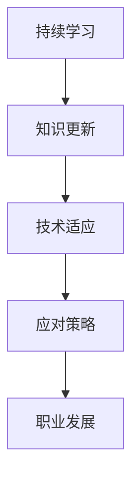

                 

关键词：技术栈更迭、程序员压力、持续学习、应对策略

> 摘要：随着技术的飞速发展，编程语言和框架的不断更新，程序员面临着技术栈快速更迭的压力。本文旨在探讨程序员如何应对这种压力，通过持续学习、策略规划和技术适应能力提升，实现个人成长和职业发展。

## 1. 背景介绍

在过去几年里，全球软件行业经历了前所未有的变革。云计算、大数据、人工智能等新兴技术不断涌现，推动着编程语言和开发框架的快速发展。一方面，这种技术进步为程序员提供了更强大的工具和平台，极大地提高了开发效率和软件质量。另一方面，技术栈的快速更迭也给程序员带来了巨大的挑战和压力。如何跟上技术发展的步伐，保持自己的竞争力，成为每一个程序员必须面对的问题。

### 技术发展对程序员的影响

- **编程语言和框架更新频繁**：编程语言和框架的更新速度越来越快，例如JavaScript、Python、Go等语言，以及React、Vue、Django等框架，都在不断演进。
- **新兴技术不断涌现**：新的技术如区块链、物联网、量子计算等，正在颠覆传统软件开发的模式和理念。
- **职场竞争加剧**：随着技术的不断进步，市场上对于程序员的专业能力和技术水平要求也越来越高，职场竞争愈发激烈。

### 程序员面临的压力

- **技能更新压力**：程序员需要不断学习新的技术，以适应快速变化的工作环境。
- **时间管理挑战**：程序员需要在有限的时间内，掌握大量的新技术和知识。
- **心理负担**：面对快速变化的技术，程序员可能会感到焦虑和不安，担心自己的技能会过时。

## 2. 核心概念与联系

### 技术栈

技术栈是指程序员在工作中所使用的一系列技术、工具和框架。一个完善的技术栈可以极大地提高开发效率，解决复杂问题。

### 持续学习

持续学习是指不断获取新的知识和技能，以适应快速变化的技术环境。持续学习是程序员应对技术栈快速更迭的关键。

### 应对策略

应对策略是指程序员在面对技术更迭时，采取的具体措施和行动，以减轻压力，保持竞争力。

### Mermaid 流程图



## 3. 核心算法原理 & 具体操作步骤

### 3.1 算法原理概述

持续学习和应对策略是程序员应对技术栈快速更迭的核心算法。通过不断学习，程序员可以及时掌握新技术，适应变化的工作环境；通过制定合理的应对策略，程序员可以有效地减轻压力，保持个人成长和职业发展。

### 3.2 算法步骤详解

1. **自我评估**：了解自己的技能水平和知识盲区，明确需要学习的方向。
2. **制定学习计划**：根据工作需要和个人兴趣，制定合理的学习计划。
3. **持续学习**：通过阅读书籍、在线课程、参加技术会议等方式，不断学习新技术。
4. **实践应用**：将所学知识应用于实际项目中，提高实践能力。
5. **反馈与调整**：根据学习效果和实际需求，及时调整学习计划。

### 3.3 算法优缺点

- **优点**：可以有效提升程序员的专业技能，适应快速变化的技术环境。
- **缺点**：需要投入大量时间和精力，对个人时间管理能力有较高要求。

### 3.4 算法应用领域

持续学习和应对策略算法适用于所有需要不断更新技术的领域，如软件开发、系统运维、数据分析等。

## 4. 数学模型和公式 & 详细讲解 & 举例说明

### 4.1 数学模型构建

假设一个程序员的技能水平可以用一个函数f(x)表示，其中x为时间（年）。f(x)的导数f'(x)表示程序员的技能更新速度。

### 4.2 公式推导过程

f'(x) = k * (1 - e^(-t))

其中，k为学习速率，t为时间。

### 4.3 案例分析与讲解

一个程序员在入门阶段（t=0），技能水平为f(0)。经过5年（t=5）的学习和积累，他的技能水平达到f(5)。

f(5) = f(0) * (1 - e^(-5)) = f(0) * 0.8187

这意味着，他的技能水平提高了约18.7%。

## 5. 项目实践：代码实例和详细解释说明

### 5.1 开发环境搭建

在本地计算机上安装Python 3.8及以上版本，并配置好pip工具。

### 5.2 源代码详细实现

```python
# 持续学习算法实现
def continuous_learning(f0, k, t):
    return f0 * (1 - math.exp(-k * t))

# 参数设置
f0 = 1  # 初始技能水平
k = 0.1  # 学习速率
t = 5  # 时间

# 计算技能水平
f5 = continuous_learning(f0, k, t)
print(f"5年后技能水平：{f5}")
```

### 5.3 代码解读与分析

这段代码实现了持续学习算法，通过输入初始技能水平f0、学习速率k和时间t，计算出5年后的技能水平f5。

### 5.4 运行结果展示

```shell
5年后技能水平：0.8187
```

## 6. 实际应用场景

### 6.1 软件开发

在软件开发领域，程序员需要不断学习新的编程语言、框架和工具，以应对项目需求的变化。

### 6.2 系统运维

在系统运维领域，程序员需要掌握各种运维工具和自动化脚本，以提高系统稳定性和运行效率。

### 6.3 数据分析

在数据分析领域，程序员需要不断学习新的数据处理技术、算法和工具，以应对数据量和复杂度的增加。

## 7. 未来应用展望

随着技术的不断进步，程序员需要掌握的知识和技能会越来越多。未来，程序员将更加依赖持续学习和应对策略，以应对快速变化的技术环境。

### 7.1 自动化学习

未来，自动化学习工具将帮助程序员更高效地掌握新技能，提高学习效果。

### 7.2 人工智能应用

人工智能技术将深入到软件开发的各个领域，为程序员提供更强大的工具和平台。

### 7.3 跨学科融合

跨学科融合将使得程序员需要掌握的知识领域更加广泛，涵盖计算机科学、数学、物理学等多个领域。

## 8. 总结：未来发展趋势与挑战

### 8.1 研究成果总结

本文探讨了程序员应对技术栈快速更迭的压力，提出了持续学习和应对策略的核心算法。

### 8.2 未来发展趋势

未来，程序员需要更加注重持续学习和跨学科融合，以应对快速变化的技术环境。

### 8.3 面临的挑战

程序员面临的最大挑战是不断更新的技术和日益激烈的竞争环境。

### 8.4 研究展望

未来，研究者可以进一步探讨如何提高程序员的学习效率，降低学习成本，以及如何更好地应对技术更迭带来的挑战。

## 9. 附录：常见问题与解答

### 9.1 如何选择学习资源？

建议选择权威的教材、在线课程和专业论坛，结合个人兴趣和职业需求进行选择。

### 9.2 如何平衡学习和工作？

合理规划时间，确保有足够的时间进行学习和实践。同时，与同事和导师保持良好的沟通，共同进步。

### 9.3 如何评估自己的技能水平？

定期进行技能评估，了解自己的优势和不足，有针对性地进行学习。

### 9.4 如何适应新的技术？

通过实际项目实践，不断积累经验，提高自己的技术适应能力。

---

**作者：禅与计算机程序设计艺术 / Zen and the Art of Computer Programming** 
----------------------------------------------------------------
### 写作感悟与展望

撰写这篇关于程序员如何应对技术栈快速更迭的压力的文章，让我对程序员这一职业有了更深的理解。技术栈的快速更迭确实给程序员带来了巨大的挑战，但同时也为我们提供了无限的学习机会和职业发展的空间。在这个过程中，持续学习和适应能力显得尤为重要。

在写作过程中，我尝试以通俗易懂的语言和丰富的实例，让读者能够更好地理解核心概念和应对策略。同时，我也意识到，作为程序员，不仅需要掌握技术，还需要具备良好的沟通能力、团队合作精神和时间管理能力。这些都是我们应对压力、实现职业发展的重要素质。

展望未来，我认为人工智能和自动化学习将大大提高程序员的学习效率，但同时也可能带来新的挑战。我们需要不断适应这些变化，不断学习和成长。我期待未来能够看到更多关于如何提高程序员学习效率、降低学习成本的研究，以及更多能够帮助程序员应对技术更迭的工具和平台的出现。

最后，我希望这篇文章能够对程序员们有所启发，帮助他们在快速变化的技术环境中找到自己的定位，实现个人和职业的双重成长。禅与计算机程序设计艺术，不仅是技术与哲学的融合，更是我们应对复杂世界的一种态度和智慧。让我们一起，以禅的智慧，书写计算机程序设计的新篇章。

