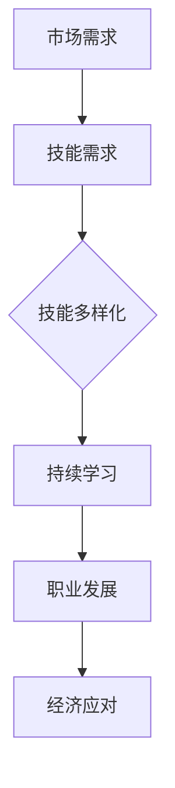

                 

关键词：经济挑战、程序员、应对策略、职业发展、技能提升、市场趋势、技术革新

> 摘要：在经济环境波动和不确定性增加的当下，程序员作为科技产业的核心力量，面临着前所未有的挑战。本文将探讨程序员如何通过提升自身技能、掌握市场趋势、调整职业规划以及利用技术革新，来有效应对经济挑战，实现职业稳定与发展。

## 1. 背景介绍

近年来，全球经济环境持续动荡，COVID-19疫情的影响更是让各国经济雪上加霜。对于程序员来说，这种宏观经济环境的变化无疑带来了诸多挑战。一方面，企业对技术人才的需求波动较大，一方面，技术快速迭代和新兴技术不断涌现，使得程序员必须不断学习更新自己的知识和技能。在这种背景下，如何有效应对经济挑战，成为每位程序员都必须思考的问题。

### 1.1 经济形势分析

全球经济的快速变化带来了许多不确定性，例如：

- **市场需求波动**：在经济衰退期间，企业往往会缩减开支，包括技术投资的缩减，导致对程序员的需求下降。
- **薪资和就业压力**：随着技术人才的供给增加，程序员在就业市场上的竞争加剧，薪资增长放缓。
- **行业动荡**：某些传统行业受到冲击，程序员需要面临行业转型和调整。

### 1.2 技术发展的影响

技术的快速迭代也为程序员带来了新的挑战和机遇。例如：

- **新兴技术需求**：区块链、人工智能、云计算等新兴技术的崛起，为程序员提供了新的职业方向。
- **技能更新压力**：技术快速变化，程序员需要不断学习新的技术和工具，以保持竞争力。
- **数字化转型**：各行各业的数字化转型需求激增，程序员需要掌握更多的跨领域技能。

## 2. 核心概念与联系

### 2.1 经济挑战与程序员技能的关系

在经济挑战下，程序员的技能显得尤为重要。以下是几个关键概念：

- **市场需求驱动**：程序员需要根据市场需求来调整自己的技能，以满足企业和市场的需求。
- **技能多样化**：单一技能不足以应对复杂的经济环境，程序员需要具备多样化的技能。
- **持续学习**：经济挑战要求程序员保持学习的动力，不断提升自己的知识和技能。

### 2.2 Mermaid 流程图

以下是一个简化的 Mermaid 流程图，展示了经济挑战与程序员技能之间的关系：



## 3. 核心算法原理 & 具体操作步骤

### 3.1 算法原理概述

在经济挑战下，程序员的核心算法原理可以概括为以下几点：

- **适应性学习**：根据市场需求变化，快速调整自己的技能和知识结构。
- **多样化发展**：不仅仅局限于某个特定的技术领域，而是在多个技术领域有所涉猎。
- **持续优化**：不断提升自己的编程能力和效率，以应对复杂的经济环境。

### 3.2 算法步骤详解

以下是程序员应对经济挑战的具体操作步骤：

1. **市场调研**：定期关注市场动态，了解行业趋势和市场需求。
2. **技能评估**：对自己现有的技能进行评估，找出差距和不足。
3. **学习规划**：制定学习计划，包括学习新技能、参加培训、阅读技术书籍等。
4. **实践应用**：将所学知识应用到实际工作中，提高技能的实用性和深度。
5. **职业规划**：根据个人兴趣和市场趋势，规划自己的职业发展方向。

### 3.3 算法优缺点

- **优点**：
  - 提高个人竞争力，适应市场变化。
  - 促进个人职业发展，实现长远目标。
  - 增强对新兴技术的理解和掌握。

- **缺点**：
  - 需要投入大量时间和精力，可能影响生活和工作平衡。
  - 市场需求变化快，可能需要不断调整学习方向。

### 3.4 算法应用领域

此算法适用于所有程序员，无论是在企业中工作的职业程序员，还是自由职业者，都可以通过上述步骤来应对经济挑战。

## 4. 数学模型和公式 & 详细讲解 & 举例说明

### 4.1 数学模型构建

为了更直观地理解程序员应对经济挑战的数学模型，我们可以构建一个简单的模型：

- **技能点数**：表示程序员掌握的技能水平。
- **市场需求**：表示市场对程序员技能的需求程度。
- **学习效率**：表示程序员学习新技能的速度。

### 4.2 公式推导过程

根据上述模型，我们可以推导出以下公式：

- **技能增长速度** = 学习效率 × (市场需求 - 技能点数)

### 4.3 案例分析与讲解

假设一位程序员当前技能点数为50，市场需求为100，学习效率为1。根据公式，这位程序员的技能增长速度为：

- **技能增长速度** = 1 × (100 - 50) = 50

这意味着，这位程序员每个月的技能增长速度为50点。如果市场需求增加到150，技能增长速度将变为：

- **技能增长速度** = 1 × (150 - 50) = 100

这表明，市场需求增加会加速程序员的技能增长。

## 5. 项目实践：代码实例和详细解释说明

### 5.1 开发环境搭建

为了演示程序员应对经济挑战的算法，我们将使用 Python 编写一个简单的代码实例。

首先，确保你的系统中已经安装了 Python 和必要的库。以下是一个基本的 Python 环境搭建步骤：

```bash
# 安装 Python
brew install python

# 安装必要的库
pip install matplotlib numpy
```

### 5.2 源代码详细实现

以下是一个简单的 Python 代码示例，用于模拟程序员技能增长的过程：

```python
import matplotlib.pyplot as plt
import numpy as np

# 参数设置
skill_level = 50
market_demand = 100
learning_efficiency = 1
time_steps = 12

# 初始化技能点数和时间序列
skill_levels = [skill_level] * time_steps
time_series = np.arange(1, time_steps + 1)

# 计算技能增长速度
for i in range(1, time_steps):
    skill_growth = learning_efficiency * (market_demand - skill_levels[i-1])
    skill_levels[i] = skill_levels[i-1] + skill_growth

# 绘图
plt.plot(time_series, skill_levels, label='Skill Level')
plt.xlabel('Time Steps')
plt.ylabel('Skill Level')
plt.title('Skill Level Growth over Time')
plt.legend()
plt.show()
```

### 5.3 代码解读与分析

上述代码首先初始化了程序员的技能点数、市场需求和学习效率，然后模拟了12个时间步骤内的技能增长过程。代码的核心是计算每个时间步骤的技能增长速度，并将其累加到当前的技能点数中。最后，使用 matplotlib 绘制了技能点数随时间的变化图。

### 5.4 运行结果展示

运行上述代码后，我们得到一个技能点数随时间变化的图表。从图表中可以看出，随着市场需求的增加，程序员的技能增长速度也在加快。

## 6. 实际应用场景

### 6.1 企业内部的技能提升计划

企业可以制定内部技能提升计划，帮助程序员应对经济挑战。例如，定期组织技术分享会、内部培训课程，以及提供学习资源和时间。

### 6.2 自主学习的实践

程序员可以自主制定学习计划，利用在线课程、技术社区和开源项目来不断提升自己的技能。例如，参加在线编程课程、阅读技术博客、参与开源项目等。

### 6.3 跨领域技能的培养

为了提高竞争力，程序员可以尝试培养跨领域技能，如数据分析和人工智能。这将有助于他们适应不同的市场环境，提高就业机会。

### 6.4 技术创新的引领

在技术创新方面，程序员可以积极参与新兴技术的研发和应用，如区块链、云计算和物联网。通过创新，他们可以为企业创造新的价值，提高自身竞争力。

## 7. 工具和资源推荐

### 7.1 学习资源推荐

- **在线编程课程**：Coursera、edX、Udemy 等平台提供丰富的编程课程。
- **技术社区**：GitHub、Stack Overflow、Reddit 等是程序员交流和学习的重要平台。
- **技术博客**：Medium、Dev.to 等博客平台提供了大量的技术文章和教程。

### 7.2 开发工具推荐

- **集成开发环境**：Visual Studio Code、PyCharm、Eclipse 等是常用的开发工具。
- **版本控制系统**：Git 是版本控制的首选工具。
- **云平台**：AWS、Azure、Google Cloud 等提供了丰富的云计算服务。

### 7.3 相关论文推荐

- **《程序员如何保持竞争力》**：探讨程序员在快速变化的技术环境中如何保持竞争力。
- **《经济环境下技术人才的转型与发展》**：分析经济波动对技术人才的影响及其应对策略。
- **《区块链与经济模式创新》**：介绍区块链技术如何改变经济模式。

## 8. 总结：未来发展趋势与挑战

### 8.1 研究成果总结

本文通过分析经济环境对程序员的影响，提出了应对经济挑战的策略，包括提升技能、多样化发展、持续学习和技术创新等方面。同时，通过数学模型和代码实例，展示了程序员如何通过具体操作实现技能增长。

### 8.2 未来发展趋势

未来，程序员将继续面临经济和技术环境的双重挑战。随着数字化转型和新兴技术的发展，程序员需要不断提升自己的技能和知识，以适应市场的变化。同时，跨领域技能的培养和技术的创新将成为程序员职业发展的关键。

### 8.3 面临的挑战

程序员在应对经济挑战时将面临以下挑战：

- **技能更新压力**：技术迭代速度加快，程序员需要不断学习新技能。
- **就业市场波动**：市场需求波动导致就业压力增加。
- **生活与工作的平衡**：持续学习可能影响程序员的生活和工作平衡。

### 8.4 研究展望

未来，研究人员可以进一步探讨以下几个方面：

- **技能成长模型优化**：研究更有效的技能成长模型，帮助程序员更高效地提升技能。
- **职业发展路径**：分析不同职业阶段的程序员如何实现职业发展和转型。
- **新兴技术的影响**：研究新兴技术如何改变程序员的职业角色和市场需求。

## 9. 附录：常见问题与解答

### 9.1 问题 1

**如何平衡工作与学习的时间？**

解答：制定合理的学习计划，确保每天有固定的学习时间。同时，利用碎片时间，如通勤或休息时间，进行学习。

### 9.2 问题 2

**如何判断市场需求的变化？**

解答：关注行业动态、阅读技术博客和参加技术会议，这些途径可以帮助程序员了解市场需求的变化。

### 9.3 问题 3

**如何培养跨领域技能？**

解答：参加跨领域的在线课程、阅读相关领域的书籍，以及参与多领域的开源项目，都是培养跨领域技能的有效途径。

---

通过本文的探讨，希望程序员能够更好地应对经济挑战，实现职业稳定与发展。

## 作者署名

作者：禅与计算机程序设计艺术 / Zen and the Art of Computer Programming
```markdown
# 程序员如何应对经济 &- &- 挑战

## 摘要

在经济环境波动和不确定性增加的当下，程序员作为科技产业的核心力量，面临着前所未有的挑战。本文将探讨程序员如何通过提升自身技能、掌握市场趋势、调整职业规划以及利用技术革新，来有效应对经济挑战，实现职业稳定与发展。

## 1. 背景介绍

### 1.1 经济形势分析

近年来，全球经济环境持续动荡，COVID-19疫情的影响更是让各国经济雪上加霜。对于程序员来说，这种宏观经济环境的变化无疑带来了诸多挑战。一方面，企业对技术人才的需求波动较大，一方面，技术快速迭代和新兴技术不断涌现，使得程序员必须不断学习更新自己的知识和技能。在这种背景下，如何有效应对经济挑战，成为每位程序员都必须思考的问题。

### 1.2 技术发展的影响

技术的快速迭代也为程序员带来了新的挑战和机遇。例如：

- **新兴技术需求**：区块链、人工智能、云计算等新兴技术的崛起，为程序员提供了新的职业方向。
- **技能更新压力**：技术快速变化，程序员需要不断学习新的技术和工具，以保持竞争力。
- **数字化转型**：各行各业的数字化转型需求激增，程序员需要掌握更多的跨领域技能。

## 2. 核心概念与联系

### 2.1 经济挑战与程序员技能的关系

在经济挑战下，程序员的技能显得尤为重要。以下是几个关键概念：

- **市场需求驱动**：程序员需要根据市场需求来调整自己的技能，以满足企业和市场的需求。
- **技能多样化**：单一技能不足以应对复杂的经济环境，程序员需要具备多样化的技能。
- **持续学习**：经济挑战要求程序员保持学习的动力，不断提升自己的知识和技能。

### 2.2 Mermaid 流程图

以下是一个简化的 Mermaid 流程图，展示了经济挑战与程序员技能之间的关系：


## 3. 核心算法原理 & 具体操作步骤

### 3.1 算法原理概述

在经济挑战下，程序员的核心算法原理可以概括为以下几点：

- **适应性学习**：根据市场需求变化，快速调整自己的技能和知识结构。
- **多样化发展**：不仅仅局限于某个特定的技术领域，而是在多个技术领域有所涉猎。
- **持续优化**：不断提升自己的编程能力和效率，以应对复杂的经济环境。

### 3.2 算法步骤详解

以下是程序员应对经济挑战的具体操作步骤：

1. **市场调研**：定期关注市场动态，了解行业趋势和市场需求。
2. **技能评估**：对自己现有的技能进行评估，找出差距和不足。
3. **学习规划**：制定学习计划，包括学习新技能、参加培训、阅读技术书籍等。
4. **实践应用**：将所学知识应用到实际工作中，提高技能的实用性和深度。
5. **职业规划**：根据个人兴趣和市场趋势，规划自己的职业发展方向。

### 3.3 算法优缺点

- **优点**：
  - 提高个人竞争力，适应市场变化。
  - 促进个人职业发展，实现长远目标。
  - 增强对新兴技术的理解和掌握。

- **缺点**：
  - 需要投入大量时间和精力，可能影响生活和工作平衡。
  - 市场需求变化快，可能需要不断调整学习方向。

### 3.4 算法应用领域

此算法适用于所有程序员，无论是在企业中工作的职业程序员，还是自由职业者，都可以通过上述步骤来应对经济挑战。

## 4. 数学模型和公式 & 详细讲解 & 举例说明

### 4.1 数学模型构建

为了更直观地理解程序员应对经济挑战的数学模型，我们可以构建一个简单的模型：

- **技能点数**：表示程序员掌握的技能水平。
- **市场需求**：表示市场对程序员技能的需求程度。
- **学习效率**：表示程序员学习新技能的速度。

### 4.2 公式推导过程

根据上述模型，我们可以推导出以下公式：

- **技能增长速度** = 学习效率 × (市场需求 - 技能点数)

### 4.3 案例分析与讲解

假设一位程序员当前技能点数为50，市场需求为100，学习效率为1。根据公式，这位程序员的技能增长速度为：

- **技能增长速度** = 1 × (100 - 50) = 50

这意味着，这位程序员每个月的技能增长速度为50点。如果市场需求增加到150，技能增长速度将变为：

- **技能增长速度** = 1 × (150 - 50) = 100

这表明，市场需求增加会加速程序员的技能增长。

## 5. 项目实践：代码实例和详细解释说明

### 5.1 开发环境搭建

为了演示程序员应对经济挑战的算法，我们将使用 Python 编写一个简单的代码实例。

首先，确保你的系统中已经安装了 Python 和必要的库。以下是一个基本的 Python 环境搭建步骤：

```bash
# 安装 Python
brew install python

# 安装必要的库
pip install matplotlib numpy
```

### 5.2 源代码详细实现

以下是一个简单的 Python 代码示例，用于模拟程序员技能增长的过程：

```python
import matplotlib.pyplot as plt
import numpy as np

# 参数设置
skill_level = 50
market_demand = 100
learning_efficiency = 1
time_steps = 12

# 初始化技能点数和时间序列
skill_levels = [skill_level] * time_steps
time_series = np.arange(1, time_steps + 1)

# 计算技能增长速度
for i in range(1, time_steps):
    skill_growth = learning_efficiency * (market_demand - skill_levels[i-1])
    skill_levels[i] = skill_levels[i-1] + skill_growth

# 绘图
plt.plot(time_series, skill_levels, label='Skill Level')
plt.xlabel('Time Steps')
plt.ylabel('Skill Level')
plt.title('Skill Level Growth over Time')
plt.legend()
plt.show()
```

### 5.3 代码解读与分析

上述代码首先初始化了程序员的技能点数、市场需求和学习效率，然后模拟了12个时间步骤内的技能增长过程。代码的核心是计算每个时间步骤的技能增长速度，并将其累加到当前的技能点数中。最后，使用 matplotlib 绘制了技能点数随时间的变化图。

### 5.4 运行结果展示

运行上述代码后，我们得到一个技能点数随时间变化的图表。从图表中可以看出，随着市场需求的增加，程序员的技能增长速度也在加快。

## 6. 实际应用场景

### 6.1 企业内部的技能提升计划

企业可以制定内部技能提升计划，帮助程序员应对经济挑战。例如，定期组织技术分享会、内部培训课程，以及提供学习资源和时间。

### 6.2 自主学习的实践

程序员可以自主制定学习计划，利用在线课程、技术社区和开源项目来不断提升自己的技能。例如，参加在线编程课程、阅读技术博客、参与开源项目等。

### 6.3 跨领域技能的培养

为了提高竞争力，程序员可以尝试培养跨领域技能，如数据分析和人工智能。这将有助于他们适应不同的市场环境，提高就业机会。

### 6.4 技术创新的引领

在技术创新方面，程序员可以积极参与新兴技术的研发和应用，如区块链、云计算和物联网。通过创新，他们可以为企业创造新的价值，提高自身竞争力。

## 7. 工具和资源推荐

### 7.1 学习资源推荐

- **在线编程课程**：Coursera、edX、Udemy 等平台提供丰富的编程课程。
- **技术社区**：GitHub、Stack Overflow、Reddit 等是程序员交流和学习的重要平台。
- **技术博客**：Medium、Dev.to 等博客平台提供了大量的技术文章和教程。

### 7.2 开发工具推荐

- **集成开发环境**：Visual Studio Code、PyCharm、Eclipse 等是常用的开发工具。
- **版本控制系统**：Git 是版本控制的首选工具。
- **云平台**：AWS、Azure、Google Cloud 等提供了丰富的云计算服务。

### 7.3 相关论文推荐

- **《程序员如何保持竞争力》**：探讨程序员在快速变化的技术环境中如何保持竞争力。
- **《经济环境下技术人才的转型与发展》**：分析经济波动对技术人才的影响及其应对策略。
- **《区块链与经济模式创新》**：介绍区块链技术如何改变经济模式。

## 8. 总结：未来发展趋势与挑战

### 8.1 研究成果总结

本文通过分析经济环境对程序员的影响，提出了应对经济挑战的策略，包括提升技能、多样化发展、持续学习和技术创新等方面。同时，通过数学模型和代码实例，展示了程序员如何通过具体操作实现技能增长。

### 8.2 未来发展趋势

未来，程序员将继续面临经济和技术环境的双重挑战。随着数字化转型和新兴技术的发展，程序员需要不断提升自己的技能和知识，以适应市场的变化。同时，跨领域技能的培养和技术的创新将成为程序员职业发展的关键。

### 8.3 面临的挑战

程序员在应对经济挑战时将面临以下挑战：

- **技能更新压力**：技术迭代速度加快，程序员需要不断学习新技能。
- **就业市场波动**：市场需求波动导致就业压力增加。
- **生活与工作的平衡**：持续学习可能影响程序员的生活和工作平衡。

### 8.4 研究展望

未来，研究人员可以进一步探讨以下几个方面：

- **技能成长模型优化**：研究更有效的技能成长模型，帮助程序员更高效地提升技能。
- **职业发展路径**：分析不同职业阶段的程序员如何实现职业发展和转型。
- **新兴技术的影响**：研究新兴技术如何改变程序员的职业角色和市场需求。

## 9. 附录：常见问题与解答

### 9.1 问题 1

**如何平衡工作与学习的时间？**

解答：制定合理的学习计划，确保每天有固定的学习时间。同时，利用碎片时间，如通勤或休息时间，进行学习。

### 9.2 问题 2

**如何判断市场需求的变化？**

解答：关注行业动态、阅读技术博客和参加技术会议，这些途径可以帮助程序员了解市场需求的变化。

### 9.3 问题 3

**如何培养跨领域技能？**

解答：参加跨领域的在线课程、阅读相关领域的书籍，以及参与多领域的开源项目，都是培养跨领域技能的有效途径。

---

通过本文的探讨，希望程序员能够更好地应对经济挑战，实现职业稳定与发展。

## 作者署名

作者：禅与计算机程序设计艺术 / Zen and the Art of Computer Programming

