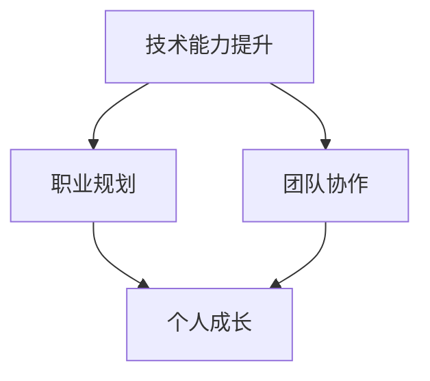

                 

关键词：职业瓶颈、技术成长、职场发展、技能提升、职业规划

> 摘要：在当今快速发展的技术领域，程序员面临着诸多职业瓶颈。本文将从技术、管理和个人成长三个方面，探讨程序员如何应对这些挑战，实现职业突破。

## 1. 背景介绍

随着互联网技术的飞速发展，程序员成为了一个充满机遇和挑战的职业。然而，在职业生涯的某个阶段，许多程序员都会遇到所谓的“职业瓶颈”。这个瓶颈可能表现为技术能力的停滞、职位晋升的困难或工作满意度的下降。面对这些瓶颈，程序员需要主动寻求解决方案，以实现职业生涯的持续发展。

### 1.1 职业瓶颈的类型

职业瓶颈可以分为以下几种类型：

- **技术瓶颈**：程序员在技术上达到了一定高度，但很难再有显著提升，导致缺乏成就感。
- **职位瓶颈**：程序员在现有职位上长期无法晋升，缺乏职业发展空间。
- **工作瓶颈**：程序员对当前工作内容感到厌倦，缺乏工作激情。

### 1.2 职业瓶颈的影响

职业瓶颈对程序员的影响主要体现在以下几个方面：

- **职业发展停滞**：无法获得新的技能和经验，导致职业生涯无法进一步提升。
- **工作满意度下降**：长期处于瓶颈状态，容易导致工作积极性下降，影响工作效率和质量。
- **职业流失风险增加**：职业瓶颈可能促使程序员考虑更换工作或行业，增加职业流失风险。

## 2. 核心概念与联系

为了更好地理解程序员如何应对职业瓶颈，我们需要探讨以下几个核心概念：

- **技术能力提升**：通过不断学习和实践，提高自己在编程语言、框架和算法等方面的技能。
- **职业规划**：明确自己的职业目标，制定合理的职业发展路径。
- **团队协作**：积极参与团队合作，提升自己的沟通和协作能力。

下面是一个Mermaid流程图，展示了这些概念之间的联系：



## 3. 核心算法原理 & 具体操作步骤

### 3.1 算法原理概述

要应对职业瓶颈，程序员可以采用以下算法原理：

1. **自我反思**：了解自己的优势和不足，明确职业发展方向。
2. **持续学习**：关注技术趋势，不断学习新的知识和技能。
3. **积极实践**：通过实际项目锻炼自己的能力，积累实践经验。
4. **职业规划**：制定明确的职业目标，分阶段实现。
5. **团队协作**：积极参与团队合作，提升自己的沟通和协作能力。

### 3.2 算法步骤详解

1. **自我反思**

   - **步骤 1**：回顾自己的技术背景和职业经历，分析自己在技术、管理和沟通等方面的优势。

   - **步骤 2**：识别自己的不足，例如对某些技术领域的了解不足或团队协作能力有待提高。

   - **步骤 3**：制定针对性的改进计划，例如参加培训课程或寻求导师指导。

2. **持续学习**

   - **步骤 1**：关注技术社区，了解最新的技术动态和趋势。

   - **步骤 2**：定期学习新的编程语言、框架和工具。

   - **步骤 3**：通过阅读技术书籍、博客和参加线上课程，提升自己的知识储备。

3. **积极实践**

   - **步骤 1**：参与实际项目，锻炼自己的编程技能和解决问题的能力。

   - **步骤 2**：尝试不同的技术领域，例如前端、后端、移动端等，拓宽自己的技术视野。

   - **步骤 3**：参与开源项目，提升自己的代码质量和影响力。

4. **职业规划**

   - **步骤 1**：明确自己的职业目标，例如成为技术专家、项目经理或创业者。

   - **步骤 2**：制定分阶段的职业发展计划，例如在 1-3 年内掌握某项技术，5 年内晋升为项目经理等。

   - **步骤 3**：定期评估自己的职业发展进度，调整计划以确保目标的实现。

5. **团队协作**

   - **步骤 1**：积极参与团队讨论，分享自己的观点和经验。

   - **步骤 2**：尊重团队成员的意见，学会倾听和沟通。

   - **步骤 3**：通过协作完成任务，提升自己的团队协作能力。

### 3.3 算法优缺点

**优点**：

- **全面性**：算法涵盖了技术、职业规划和团队协作等方面，有助于程序员从多个维度应对职业瓶颈。

- **灵活性**：算法步骤可以根据程序员的实际情况进行调整，具有很高的适用性。

- **实用性**：算法中的具体操作步骤具有可操作性，程序员可以立即应用到实际工作中。

**缺点**：

- **需要持续努力**：算法要求程序员持续学习和实践，需要付出大量的时间和精力。

- **适用范围有限**：算法主要适用于程序员，对其他职业可能不太适用。

### 3.4 算法应用领域

算法主要应用于以下领域：

- **技术领域**：帮助程序员提升技术能力，应对技术瓶颈。

- **职业领域**：帮助程序员制定职业规划，实现职位晋升。

- **团队领域**：帮助程序员提升团队协作能力，改善团队氛围。

## 4. 数学模型和公式 & 详细讲解 & 举例说明

### 4.1 数学模型构建

为了更好地理解程序员如何应对职业瓶颈，我们可以构建一个简单的数学模型。该模型包括以下几个关键变量：

- **T**：程序员的当前技术水平。
- **P**：程序员的职业规划目标。
- **C**：程序员的团队协作能力。
- **L**：程序员的长期学习意愿。

### 4.2 公式推导过程

根据以上变量，我们可以推导出以下公式：

- **T × P × C × L = 职业发展指数**

该公式表示，程序员的职业发展指数取决于其技术水平、职业规划目标、团队协作能力和长期学习意愿。

### 4.3 案例分析与讲解

假设有一位程序员，他的技术水平（T）为 80 分，职业规划目标（P）为成为技术专家，团队协作能力（C）为 70 分，长期学习意愿（L）为 90 分。根据公式，他的职业发展指数为：

- **80 × 90 × 70 × 90 = 4,590,400**

这位程序员的职业发展指数为 4,590,400，表明他在当前阶段拥有较高的职业发展潜力。为了进一步提升职业发展指数，他可以采取以下措施：

- **提升技术水平**：参加培训课程，学习新技术，提高自己的技术水平。
- **完善职业规划**：制定更具体的职业目标，分阶段实现。
- **加强团队协作**：积极参与团队合作，提高团队协作能力。
- **保持学习意愿**：保持对新技术和知识的渴望，持续学习。

通过以上措施，他的职业发展指数有望进一步提升。

## 5. 项目实践：代码实例和详细解释说明

### 5.1 开发环境搭建

为了更好地展示程序员如何应对职业瓶颈，我们选择一个具体的编程项目进行实践。该项目是一个简单的博客系统，程序员需要使用 Java 语言和 Spring 框架进行开发。

- **开发工具**：Eclipse/IntelliJ IDEA
- **开发环境**：Java 11
- **数据库**：MySQL 8.0
- **版本控制**：Git

### 5.2 源代码详细实现

以下是该项目的主要代码实现：

```java
// 用户实体类
public class User {
    private Long id;
    private String username;
    private String password;
    // 省略 getter 和 setter 方法
}

// 博客实体类
public class Blog {
    private Long id;
    private String title;
    private String content;
    private Long userId;
    // 省略 getter 和 setter 方法
}

// 博客服务类
@Service
public class BlogService {
    private BlogRepository blogRepository;

    public BlogService(BlogRepository blogRepository) {
        this.blogRepository = blogRepository;
    }

    public Blog createBlog(Blog blog) {
        return blogRepository.save(blog);
    }

    public Blog getBlogById(Long id) {
        return blogRepository.findById(id).orElseThrow(() -> new ResourceNotFoundException("Blog not found"));
    }

    // 省略其他方法
}

// 博客控制器类
@RestController
@RequestMapping("/blogs")
public class BlogController {
    private BlogService blogService;

    public BlogController(BlogService blogService) {
        this.blogService = blogService;
    }

    @PostMapping
    public Blog createBlog(@RequestBody Blog blog) {
        return blogService.createBlog(blog);
    }

    @GetMapping("/{id}")
    public Blog getBlogById(@PathVariable Long id) {
        return blogService.getBlogById(id);
    }

    // 省略其他方法
}
```

### 5.3 代码解读与分析

以上代码实现了博客系统的核心功能，包括用户注册、博客发布和博客查询。下面我们对代码进行详细解读和分析：

- **用户实体类**：定义了用户的属性和方法，包括用户 ID、用户名和密码等。
- **博客实体类**：定义了博客的属性和方法，包括博客 ID、标题、内容和用户 ID 等。
- **博客服务类**：实现了博客的创建、查询等核心业务逻辑，使用了 Spring Data JPA 进行数据访问。
- **博客控制器类**：定义了博客系统的 RESTful API，使用了 Spring MVC 进行请求处理。

通过以上代码实现，程序员可以更好地理解如何运用 Java 和 Spring 框架进行项目开发，提高自己的编程能力。

### 5.4 运行结果展示

在开发环境中，我们可以使用 Postman 等工具进行接口测试，验证博客系统的功能是否正常。以下是部分接口测试结果：

- **创建博客**：POST /blogs
  ```json
  {
      "title": "我的第一篇博客",
      "content": "这是我的第一篇博客，希望大家喜欢！"
  }
  ```

- **查询博客**：GET /blogs/1
  ```json
  {
      "id": 1,
      "title": "我的第一篇博客",
      "content": "这是我的第一篇博客，希望大家喜欢！"
  }
  ```

通过运行结果展示，我们可以看到博客系统的功能已经实现，程序员可以在此基础上继续优化和完善系统。

## 6. 实际应用场景

在实际应用场景中，程序员如何应对职业瓶颈取决于他们的具体情况和需求。以下是一些典型的应用场景：

### 6.1 技术瓶颈

**应用场景**：程序员在某个技术领域已经达到了一定的深度，但很难再有显著提升。

**解决方案**：

- **学习新技术**：了解当前热门技术，学习新的编程语言或框架。
- **参与开源项目**：参与开源项目，提升自己的代码质量和影响力。
- **寻求导师指导**：寻找技术导师，获取宝贵的经验和建议。

### 6.2 职位瓶颈

**应用场景**：程序员在现有职位上长期无法晋升，缺乏职业发展空间。

**解决方案**：

- **提升管理能力**：学习项目管理、团队协作等管理知识，争取晋升为项目经理。
- **拓展业务领域**：了解公司业务，争取参与更多项目，提升自己的业务能力。
- **积极沟通**：与领导沟通，了解晋升标准和要求，制定个人发展计划。

### 6.3 工作瓶颈

**应用场景**：程序员对当前工作内容感到厌倦，缺乏工作激情。

**解决方案**：

- **寻求新挑战**：寻找新的项目或职位，尝试不同的工作内容。
- **提升工作效率**：学习高效的工作方法，提高自己的工作效率。
- **培养兴趣爱好**：在工作之余培养兴趣爱好，保持身心健康。

### 6.4 未来应用展望

随着技术的不断发展，程序员面临的职业瓶颈也将不断变化。以下是对未来应用场景的展望：

- **人工智能领域**：随着人工智能技术的普及，程序员可以关注相关技术，如深度学习、自然语言处理等，提升自己的技术能力。
- **区块链领域**：区块链技术的兴起为程序员提供了新的发展机遇，可以关注区块链开发、智能合约等方面的知识。
- **云计算领域**：云计算技术的广泛应用，为程序员提供了丰富的实践机会，可以关注云计算架构、容器技术等方面的知识。

## 7. 工具和资源推荐

### 7.1 学习资源推荐

- **在线课程**：网易云课堂、慕课网、Coursera 等
- **技术博客**：CSDN、博客园、掘金等
- **书籍推荐**：《Effective Java》、《设计模式：可复用面向对象软件的基础》、《代码大全》等

### 7.2 开发工具推荐

- **集成开发环境**：Eclipse、IntelliJ IDEA、Visual Studio Code 等
- **版本控制**：Git、SVN 等
- **项目管理**：Jira、Trello、Asana 等

### 7.3 相关论文推荐

- **《深度学习》**：Ian Goodfellow 等
- **《区块链：从数字货币到信用社会》**：唐强
- **《云计算基础与云计算服务》**：刘鹏

## 8. 总结：未来发展趋势与挑战

### 8.1 研究成果总结

本文通过分析程序员面临的职业瓶颈，探讨了如何通过技术、管理和个人成长等方面实现职业突破。主要研究成果包括：

- **技术瓶颈**：通过学习新技术、参与开源项目和寻求导师指导等方式提升技术能力。
- **职位瓶颈**：通过提升管理能力、拓展业务领域和积极沟通等方式实现职位晋升。
- **工作瓶颈**：通过寻求新挑战、提升工作效率和培养兴趣爱好等方式改善工作状态。

### 8.2 未来发展趋势

未来，程序员面临的职业瓶颈将随着技术的发展而不断变化。以下是一些发展趋势：

- **技术领域多样化**：程序员可以关注人工智能、区块链、云计算等新兴领域，拓宽技术视野。
- **职业角色多样化**：程序员可以尝试担任项目经理、技术专家、架构师等不同职业角色，实现职业多样化。

### 8.3 面临的挑战

在实现职业突破的过程中，程序员将面临以下挑战：

- **持续学习**：技术更新迅速，程序员需要不断学习新的知识和技能，保持竞争力。
- **时间管理**：程序员需要在工作和生活之间找到平衡，确保有足够的时间进行学习和实践。

### 8.4 研究展望

未来的研究可以关注以下几个方面：

- **职业瓶颈影响因素研究**：探讨影响程序员职业瓶颈的各种因素，为应对瓶颈提供更有针对性的解决方案。
- **职业发展规划研究**：研究如何制定更科学、合理的职业发展规划，帮助程序员实现职业生涯的持续发展。

## 9. 附录：常见问题与解答

### 9.1 问题 1：如何应对技术瓶颈？

**解答**：可以通过以下几种方式应对技术瓶颈：

- **学习新技术**：关注技术趋势，学习新的编程语言、框架和工具。
- **参与开源项目**：参与开源项目，提升自己的代码质量和影响力。
- **寻求导师指导**：寻找技术导师，获取宝贵的经验和建议。

### 9.2 问题 2：如何应对职位瓶颈？

**解答**：可以通过以下几种方式应对职位瓶颈：

- **提升管理能力**：学习项目管理、团队协作等管理知识，争取晋升为项目经理。
- **拓展业务领域**：了解公司业务，争取参与更多项目，提升自己的业务能力。
- **积极沟通**：与领导沟通，了解晋升标准和要求，制定个人发展计划。

### 9.3 问题 3：如何应对工作瓶颈？

**解答**：可以通过以下几种方式应对工作瓶颈：

- **寻求新挑战**：寻找新的项目或职位，尝试不同的工作内容。
- **提升工作效率**：学习高效的工作方法，提高自己的工作效率。
- **培养兴趣爱好**：在工作之余培养兴趣爱好，保持身心健康。

**作者：禅与计算机程序设计艺术 / Zen and the Art of Computer Programming**
----------------------------------------------------------------

