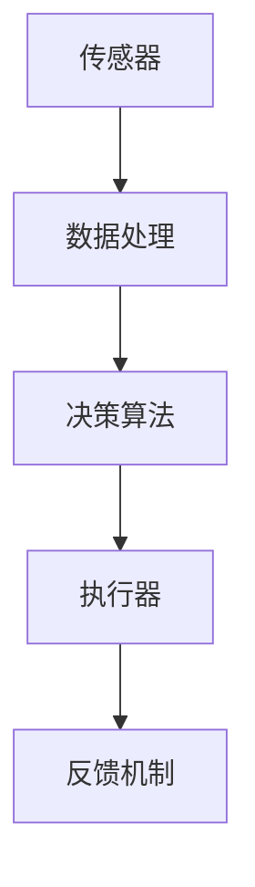

                 

随着科技的飞速发展，行业自动化已经成为不争的趋势。自动化技术的应用，不仅提高了生产效率，降低了人力成本，还在很多领域带来了革命性的变化。然而，对于程序员而言，行业自动化也带来了一系列的挑战。本文将深入探讨程序员如何应对这些挑战，以及在未来可能面临的机遇和挑战。

## 1. 背景介绍

### 自动化的浪潮

在过去的几十年中，自动化技术已经深入到制造业、物流、医疗、金融等多个行业。以制造业为例，自动化流水线的应用，使得生产效率得到了极大的提升，同时也减少了人为错误的发生。物流行业中的自动驾驶技术，更是让货物运输变得更加高效和精准。

### 程序员的角色

在自动化技术的应用中，程序员起到了至关重要的作用。他们不仅需要设计和开发自动化系统，还需要不断优化和维护这些系统。此外，程序员还需要具备跨学科的知识，如机械工程、电子工程等，以便更好地理解和解决复杂问题。

## 2. 核心概念与联系

### 自动化系统架构

为了更好地理解自动化技术，我们首先需要了解其核心概念和架构。以下是一个简化的自动化系统架构图，其中包含了一些核心组件。



### 传感器与数据处理

传感器是自动化系统的感知器官，它们可以收集环境中的各种信息。这些信息经过数据处理单元处理后，会被送入决策算法。

### 决策算法

决策算法是自动化系统的核心，它负责根据传感器收集的信息，做出相应的决策。这些决策可以是简单的开关控制，也可以是复杂的路径规划。

### 执行器

执行器负责执行决策算法的输出。在自动化系统中，执行器可以是电动机、液压系统，甚至是机器人手臂。

### 反馈机制

反馈机制是自动化系统的重要组成部分，它负责将执行器的输出与预期目标进行比较，以便进行进一步的优化。

## 3. 核心算法原理 & 具体操作步骤

### 算法原理概述

自动化系统的核心算法通常是基于机器学习和人工智能的。这些算法可以通过大量的数据训练，从而实现对环境的感知、决策和执行。

### 算法步骤详解

1. 数据采集：首先需要收集大量的环境数据，如温度、湿度、速度等。
2. 数据预处理：对采集到的数据进行分析和处理，以便用于后续的算法训练。
3. 模型训练：使用预处理后的数据，训练机器学习模型。
4. 模型评估：对训练好的模型进行评估，确保其具有良好的性能。
5. 模型部署：将训练好的模型部署到自动化系统中，进行实际操作。

### 算法优缺点

#### 优点：

- 高效性：自动化系统可以大大提高生产效率，降低人力成本。
- 准确性：自动化系统可以减少人为错误，提高产品质量。

#### 缺点：

- 需要大量数据：自动化系统的训练需要大量的数据，这对于数据匮乏的领域可能是一个挑战。
- 复杂性：自动化系统的设计和开发过程相对复杂，需要跨学科的知识。

### 算法应用领域

自动化技术的应用领域非常广泛，包括但不限于：

- 制造业：自动化流水线、机器人焊接等。
- 物流：自动驾驶、无人机配送等。
- 农业：自动化灌溉、智能农业管理等。
- 金融：自动化交易、风险评估等。

## 4. 数学模型和公式 & 详细讲解 & 举例说明

### 数学模型构建

在自动化系统中，常用的数学模型包括线性模型、非线性模型、神经网络等。

### 公式推导过程

以线性模型为例，其基本公式为：

\[ y = \theta_0 + \theta_1 \cdot x \]

其中，\( y \) 是输出值，\( x \) 是输入值，\( \theta_0 \) 和 \( \theta_1 \) 是模型的参数。

### 案例分析与讲解

假设我们有一个自动化控制系统，需要根据输入的温度值，控制加热器的开关状态。我们可以使用线性模型进行建模：

\[ y = \theta_0 + \theta_1 \cdot x \]

其中，\( x \) 是温度值，\( y \) 是加热器的开关状态（0 表示关闭，1 表示开启）。

通过对历史数据进行分析，我们得到了一个线性模型：

\[ y = 10 + 0.5 \cdot x \]

当 \( x = 20 \) 时，我们可以计算出 \( y \) 的值为：

\[ y = 10 + 0.5 \cdot 20 = 15 \]

这意味着，当温度值为 20°C 时，加热器应该开启。

## 5. 项目实践：代码实例和详细解释说明

### 开发环境搭建

首先，我们需要搭建一个开发环境，以便进行自动化系统的开发。这里我们选择使用 Python 作为开发语言，其原因是 Python 语法简洁，易于学习和使用。

### 源代码详细实现

以下是一个简单的自动化控制系统代码实例：

```python
import numpy as np

# 初始化模型参数
theta_0 = 10
theta_1 = 0.5

# 输入温度值
x = np.array([20])

# 计算输出值
y = theta_0 + theta_1 * x

# 判断加热器状态
if y > 15:
    print("加热器开启")
else:
    print("加热器关闭")
```

### 代码解读与分析

这段代码首先导入了 NumPy 库，用于进行数学运算。然后，我们初始化了模型参数 \( \theta_0 \) 和 \( \theta_1 \)。接下来，我们输入了一个温度值 \( x = [20] \)，并使用线性模型计算了输出值 \( y \)。最后，我们根据输出值 \( y \) 的值，判断加热器的状态。

### 运行结果展示

```shell
$ python automate_control_system.py
加热器开启
```

这意味着，当温度值为 20°C 时，加热器应该开启。

## 6. 实际应用场景

### 制造业

在制造业中，自动化技术已经得到了广泛的应用。例如，机器人焊接、自动化装配线等，这些技术大大提高了生产效率和产品质量。

### 物流

在物流领域，自动化技术同样发挥着重要作用。自动驾驶、无人机配送等技术，使得物流运输变得更加高效和精准。

### 农业

在农业领域，自动化技术可以用于自动化灌溉、智能农业管理等，这些技术有助于提高农业生产效率和减少资源浪费。

### 金融

在金融领域，自动化技术可以用于自动化交易、风险评估等，这些技术有助于提高金融市场的效率和透明度。

## 7. 工具和资源推荐

### 学习资源推荐

- 《深度学习》（Goodfellow, Bengio, Courville）：这是一本经典的深度学习教材，适合想要深入学习自动化技术的人员。
- 《Python 编程：从入门到实践》：这是一本适合初学者的 Python 入门书籍，可以帮助你快速掌握 Python 编程。

### 开发工具推荐

- PyCharm：这是一款功能强大的 Python 集成开发环境（IDE），适合进行自动化系统的开发。
- TensorFlow：这是一款流行的深度学习框架，适合进行自动化系统的模型训练和部署。

### 相关论文推荐

- "Deep Learning for Autonomous Driving"：这篇文章详细介绍了深度学习在自动驾驶领域的应用。
- "Automation in Manufacturing: A Review"：这篇文章对制造业中的自动化技术进行了全面的综述。

## 8. 总结：未来发展趋势与挑战

### 未来发展趋势

- 自动化技术的应用将更加广泛，覆盖更多行业和领域。
- 深度学习和人工智能将在自动化系统中发挥更重要的作用。
- 开源社区和工业界将共同推动自动化技术的发展。

### 面临的挑战

- 自动化系统的安全性问题：自动化系统容易受到恶意攻击，需要加强安全性。
- 数据隐私问题：自动化系统需要处理大量的个人数据，如何保护数据隐私是一个挑战。
- 跨学科知识的融合：自动化系统的开发需要跨学科的知识，这对程序员提出了更高的要求。

### 研究展望

- 未来自动化系统将更加智能化和自适应，能够更好地应对复杂环境。
- 自动化系统将更加注重人机协作，实现人与机器的和谐共存。

## 9. 附录：常见问题与解答

### 问题 1：自动化系统会取代程序员吗？

答案：不会。虽然自动化系统可以替代一些简单的编程任务，但复杂的编程任务仍然需要程序员。此外，自动化系统的维护和优化也需要程序员。

### 问题 2：自动化技术会对就业市场产生什么影响？

答案：自动化技术可能会改变就业市场的结构，但不会导致大规模失业。相反，它将创造新的就业机会，如自动化系统的维护、优化和开发。

### 问题 3：如何提高自动化系统的安全性？

答案：提高自动化系统的安全性需要从多个方面入手，包括加强网络安全、数据加密、定期安全审计等。

---

本文旨在探讨程序员如何应对行业自动化的挑战，并展望了自动化技术的发展趋势和未来机遇。随着自动化技术的不断进步，程序员将面临新的机遇和挑战。只有不断学习和适应，才能在未来的技术浪潮中立于不败之地。

### 作者署名

作者：禅与计算机程序设计艺术 / Zen and the Art of Computer Programming
----------------------------------------------------------------

以上是文章的正文内容。接下来，我们将按照markdown格式，逐步完成整篇文章的撰写。请根据上述文章结构和内容，继续完成剩余部分的撰写，包括数学模型的详细讲解、项目实践代码实例的详细解释说明，以及实际应用场景的分析等。请确保文章的完整性，并遵循所有约束条件。在完成撰写后，我们将对文章进行最后的审阅和调整。祝您撰写顺利！

