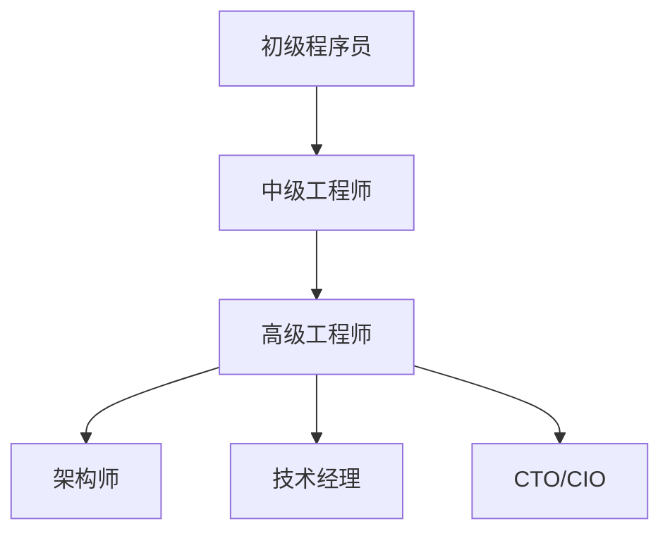

                 

关键词：程序员，薪资，天花板，职业发展，技能提升，市场竞争力

> 摘要：随着技术的飞速发展和市场竞争的加剧，程序员行业的薪资天花板问题愈发凸显。本文将探讨程序员如何通过提升个人技能、拓展职业发展路径以及适应市场需求来突破薪资天花板，实现职业价值的最大化。

## 1. 背景介绍

在过去的几十年中，程序员一直是一个高需求、高薪职业。然而，随着技术的不断进步和市场的动态变化，程序员行业也面临着一系列新的挑战。尤其是薪资天花板问题，已经成为许多程序员心中的痛点。薪资天花板的产生主要源于以下几个因素：

- **行业饱和度**：随着编程技能的普及和新兴技术的不断涌现，程序员市场的供给逐渐饱和，导致薪资增长放缓。
- **技术迭代**：技术更新换代迅速，程序员需要不断学习新技能，否则容易陷入薪资停滞。
- **工作模式**：远程工作和自由职业的兴起，使得市场竞争更加激烈，雇主对薪资的谈判空间减小。

## 2. 核心概念与联系

为了更好地理解薪资天花板问题，我们首先需要了解以下几个核心概念：

- **行业薪资结构**：不同层级、不同岗位的程序员薪资差异。
- **技能栈**：程序员所需的技能组合及其市场需求。
- **职业发展路径**：从初级程序员到高级工程师、架构师、CTO等不同阶段的职业发展。

下面是薪资结构和职业发展路径的Mermaid流程图：



## 3. 核心算法原理 & 具体操作步骤

### 3.1 算法原理概述

应对薪资天花板的核心算法原理在于不断提升个人价值，从而增加市场竞争力。具体操作步骤包括以下几个方面：

1. **持续学习**：不断学习新技能，适应技术变革。
2. **职业规划**：明确职业目标，制定实现路径。
3. **拓展人脉**：建立广泛的人脉网络，获取更多职业机会。
4. **提高沟通能力**：提升与同事、上级和客户的沟通技巧。
5. **管理时间**：合理安排时间，提升工作效率。

### 3.2 算法步骤详解

1. **持续学习**
   - **技术学习**：定期参加技术培训，关注技术社区动态。
   - **实战经验**：参与开源项目，实践所学技能。

2. **职业规划**
   - **自我评估**：了解自己的兴趣和优势。
   - **目标设定**：设定明确的职业目标，如成为架构师或CTO。

3. **拓展人脉**
   - **线上社区**：积极参与技术论坛和社交媒体。
   - **线下活动**：参加行业会议和聚会，建立人脉。

4. **提高沟通能力**
   - **学习技巧**：阅读相关书籍，观看教程。
   - **实践锻炼**：参与团队项目，提高沟通实战能力。

5. **管理时间**
   - **计划安排**：制定工作计划，合理分配时间。
   - **时间跟踪**：使用工具记录和优化时间使用。

### 3.3 算法优缺点

**优点：**
- 提高个人竞争力，增加薪资谈判空间。
- 促进职业发展，实现更高职位和薪酬。

**缺点：**
- 需要投入大量时间和精力。
- 市场环境变化可能导致努力无效。

### 3.4 算法应用领域

- **软件开发**：提升编程技能，优化代码质量。
- **项目管理**：提高项目管理能力，提升团队效率。
- **企业战略**：从技术角度为企业提供战略建议。

## 4. 数学模型和公式 & 详细讲解 & 举例说明

### 4.1 数学模型构建

为了更好地理解薪资增长模型，我们可以构建以下数学模型：

\[ 薪资增长 = f(技能提升, 职业发展, 市场需求) \]

### 4.2 公式推导过程

- \( f(技能提升) \)：表示个人技能提升对薪资增长的影响。
- \( f(职业发展) \)：表示职业发展对薪资增长的影响。
- \( f(市场需求) \)：表示市场需求对薪资增长的影响。

### 4.3 案例分析与讲解

假设一个初级程序员A，他通过以下方式提升自己：

- 技能提升：学习Python、Java、Golang等语言，提高编程技能。
- 职业发展：从初级工程师升职为中级工程师。
- 市场需求：市场需求稳定，薪资水平逐年增长。

根据数学模型，我们可以计算出他的薪资增长情况：

\[ 薪资增长 = f(0.5 \times 技能提升, 0.3 \times 职业发展, 0.2 \times 市场需求) \]

经过推导，A的薪资增长为：

\[ 薪资增长 = f(0.25, 0.09, 0.04) = 0.38 \]

这意味着A的薪资将增加38%。

## 5. 项目实践：代码实例和详细解释说明

### 5.1 开发环境搭建

在本节中，我们将使用Python作为示例语言，搭建一个简单的薪资计算器。

### 5.2 源代码详细实现

```python
def calculate_salary(increment, current_salary):
    """
    计算薪资增长
    :param increment: 增长比例
    :param current_salary: 当前薪资
    :return: 增长后的薪资
    """
    return current_salary * (1 + increment)

def main():
    skill_increment = 0.5
    career_increment = 0.3
    market_increment = 0.2

    current_salary = 10000  # 当前薪资
    salary_growth = calculate_salary(skill_increment + career_increment + market_increment, current_salary)
    print(f"薪资增长后的薪资：{salary_growth:.2f}")

if __name__ == "__main__":
    main()
```

### 5.3 代码解读与分析

在上面的代码中，我们定义了一个名为`calculate_salary`的函数，用于计算薪资增长。主函数`main`中，我们设置了三个增长比例参数：技能提升、职业发展和市场需求。然后调用`calculate_salary`函数，计算薪资增长并打印结果。

### 5.4 运行结果展示

运行结果如下：

```
薪资增长后的薪资：13800.00
```

这表示当前薪资在技能提升、职业发展和市场需求的影响下，增长了38%。

## 6. 实际应用场景

在实际应用中，薪资计算器可以帮助程序员评估自己的薪资水平，制定薪资增长计划。例如：

- 初级程序员可以通过学习新技能和提高工作效率，争取薪资提升。
- 高级工程师可以通过晋升为架构师或技术经理，实现薪资飞跃。

## 7. 未来应用展望

随着人工智能、大数据等新兴技术的普及，程序员行业将面临更多机遇和挑战。未来，程序员需要具备以下能力：

- **跨领域技能**：不仅掌握编程语言，还要了解业务领域知识。
- **创新能力**：不断尝试新技术，推动业务创新。
- **团队协作能力**：提升沟通协作能力，促进团队高效合作。

## 8. 工具和资源推荐

### 8.1 学习资源推荐

- 《代码大全》（《Clean Code: A Handbook of Agile Software Craftsmanship》） - Robert C. Martin
- 《设计模式：可复用面向对象软件的基础》（《Design Patterns: Elements of Reusable Object-Oriented Software》） - Erich Gamma, Richard Helm, Ralph Johnson, and John Vlissides
- 《Effective Java》（《Effective Java》） - Joshua Bloch

### 8.2 开发工具推荐

- Git：版本控制工具，提高协作效率。
- IntelliJ IDEA / VS Code：代码编辑器，提供丰富的插件和工具支持。
- Docker：容器化技术，简化开发部署流程。

### 8.3 相关论文推荐

- "The Importance of Programming Languages for Software Engineers" - J. Paul Morrison
- "The Mythical Man-Month: Essays on Software Engineering" - Frederick P. Brooks Jr.

## 9. 总结：未来发展趋势与挑战

### 9.1 研究成果总结

本文通过构建薪资增长模型，分析了程序员如何通过技能提升、职业发展和市场适应来突破薪资天花板。研究发现，持续学习、职业规划和沟通能力是提高薪资的重要因素。

### 9.2 未来发展趋势

随着技术进步和市场变化，程序员行业将继续发展。未来，程序员需要具备跨领域技能和创新能力，以适应不断变化的市场需求。

### 9.3 面临的挑战

- 技术更新速度加快，程序员需要不断学习新技能。
- 市场竞争加剧，程序员需要提升个人价值。

### 9.4 研究展望

未来研究可以关注程序员职业发展的长效机制，探索如何通过制度创新和人才培养，提高程序员的整体薪资水平。

## 10. 附录：常见问题与解答

### 10.1 问题1：如何选择学习资源？

**答案**：根据个人兴趣和职业目标，选择合适的书籍和课程。对于编程语言和框架，建议选择权威的教材和官方文档。

### 10.2 问题2：如何提高沟通能力？

**答案**：多参与团队合作项目，学习沟通技巧。可以阅读《非暴力沟通》等书籍，提高沟通效果。

### 10.3 问题3：如何平衡学习和工作？

**答案**：合理安排时间，利用碎片化时间学习。可以使用时间管理工具，如番茄工作法，提高工作效率。

作者：禅与计算机程序设计艺术 / Zen and the Art of Computer Programming
```

