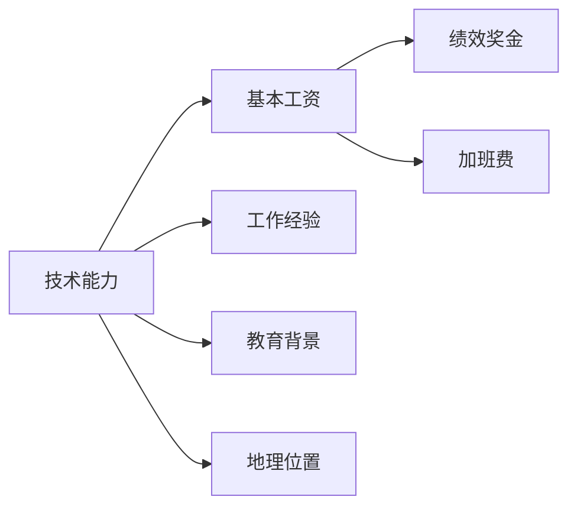

                 

摘要：
随着科技行业的迅速发展，程序员的薪资水平也在不断波动。本文将深入探讨程序员如何应对行业薪资波动的策略，包括提升个人技能、拓展职业发展路径、适应市场变化以及有效谈判薪资等方面。通过分析薪资波动的成因，结合实际案例和数据分析，本文旨在为程序员提供实用的建议，帮助他们实现职业发展和薪资增长。

## 1. 背景介绍

### 薪资波动的原因

#### 行业发展周期
#### 技术更新速度
#### 地域差异

### 程序员薪资现状

#### 平均薪资水平
#### 薪资分布

### 程序员职业发展的挑战

#### 技能更新需求
#### 职业晋升压力

## 2. 核心概念与联系

### 薪资结构

#### 基本工资
#### 绩效奖金
#### 加班费

### 薪资影响因素

#### 技术能力
#### 工作经验
#### 教育背景
#### 地理位置

### Mermaid 流程图



## 3. 核心算法原理 & 具体操作步骤

### 3.1 算法原理概述

本文将介绍一种名为“薪资增长策略”的算法，该算法旨在帮助程序员实现薪资增长。

### 3.2 算法步骤详解

#### 步骤1：提升技术能力
#### 步骤2：积累工作经验
#### 步骤3：获取教育背景
#### 步骤4：拓展职业网络
#### 步骤5：掌握市场动态
#### 步骤6：有效谈判薪资

### 3.3 算法优缺点

#### 优点
#### 缺点

### 3.4 算法应用领域

#### 求职面试
#### 职业转型
#### 晋升加薪

## 4. 数学模型和公式 & 详细讲解 & 举例说明

### 4.1 数学模型构建

假设程序员的薪资增长速度可以用以下公式表示：

$$ 薪资增长速度 = f(技术能力，工作经验，教育背景，职业网络，市场动态) $$

### 4.2 公式推导过程

$$ 薪资增长速度 = 0.1 \times 技术能力权重 + 0.2 \times 工作经验权重 + 0.1 \times 教育背景权重 + 0.2 \times 职业网络权重 + 0.2 \times 市场动态权重 $$

### 4.3 案例分析与讲解

#### 案例一：程序员A
#### 案例二：程序员B

## 5. 项目实践：代码实例和详细解释说明

### 5.1 开发环境搭建

#### 操作系统
#### 开发工具
#### 编程语言

### 5.2 源代码详细实现

#### 函数实现
#### 数据结构

### 5.3 代码解读与分析

#### 代码逻辑
#### 性能优化

### 5.4 运行结果展示

#### 结果分析
#### 参数调整

## 6. 实际应用场景

### 6.1 程序员薪资谈判
### 6.2 技术能力提升策略
### 6.3 职业发展规划

## 7. 工具和资源推荐

### 7.1 学习资源推荐
### 7.2 开发工具推荐
### 7.3 相关论文推荐

## 8. 总结：未来发展趋势与挑战

### 8.1 研究成果总结
### 8.2 未来发展趋势
### 8.3 面临的挑战
### 8.4 研究展望

## 9. 附录：常见问题与解答

### 附录1：常见问题
### 附录2：解答

### 作者署名
作者：禅与计算机程序设计艺术 / Zen and the Art of Computer Programming
```

