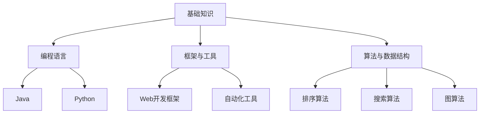
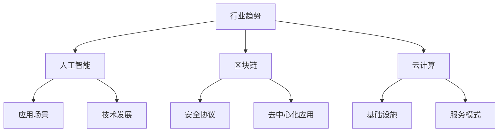
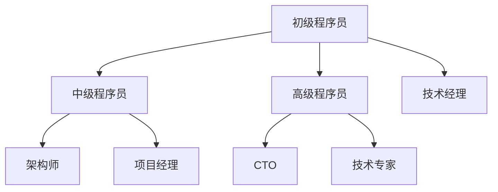
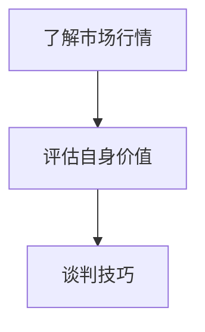

                 

关键词：程序员薪资、行业波动、薪酬管理、职业发展、技能提升

> 摘要：随着科技行业的快速发展，程序员的薪资波动成为行业普遍现象。本文将探讨程序员如何通过提升个人技能、拓展职业领域、了解行业动态以及有效管理薪酬期望来应对薪资波动，从而实现职业发展和薪酬增长。

## 1. 背景介绍

近年来，全球范围内的科技行业发展迅猛，人工智能、大数据、云计算等新兴技术不断涌现，催生了大量的编程需求和人才缺口。然而，这种高速发展也伴随着行业薪资的波动，程序员面临着薪酬不稳定的风险。一方面，技术人才的供给和需求失衡，可能导致薪资波动；另一方面，经济环境和市场变化也会对行业薪资水平产生影响。因此，如何应对薪资波动成为程序员职业规划的重要一环。

### 1.1 行业现状

根据最新市场调查，全球科技行业薪资水平整体呈上升趋势，但具体到不同国家和地区、不同公司以及不同岗位，薪资波动情况各不相同。以中国为例，一线城市的程序员薪资普遍较高，而二三线城市则相对较低。同时，新兴互联网公司由于资金充裕，往往能够提供更具竞争力的薪酬待遇，而传统企业则可能在薪资方面相对保守。

### 1.2 薪资波动原因

1. **供需关系**：技术人才供给和需求的不平衡是导致薪资波动的主要原因之一。例如，一些热门技术如人工智能、区块链等领域的人才供不应求，从而导致薪资上涨；而一些传统技术领域则可能因为人才过剩而薪资稳定甚至下降。

2. **市场变化**：经济环境和市场变化也是影响薪资波动的重要因素。例如，全球经济衰退或市场波动可能导致公司成本控制，进而影响薪资水平。

3. **公司政策**：不同公司的薪酬政策不同，一些公司可能更注重员工的长期发展，提供具有竞争力的薪酬和福利待遇，而另一些公司则可能更注重短期盈利，薪资水平相对较低。

4. **个人能力**：程序员个人的技能水平和工作表现也是影响薪资的重要因素。技术水平高、工作能力强、经验丰富的程序员往往能够获得更高的薪资。

## 2. 核心概念与联系

为了更好地应对行业薪资波动，程序员需要了解以下几个核心概念：

1. **技能储备**：包括编程语言、框架、工具、算法和数据结构等方面的知识储备。

2. **行业动态**：了解当前科技行业的发展趋势、新兴技术以及相关政策和法规。

3. **职业规划**：明确自己的职业发展方向和目标，制定合适的职业规划。

4. **薪酬管理**：合理评估自己的市场价值，掌握薪酬谈判技巧。

### 2.1 技能储备

技能储备是程序员应对薪资波动的基础。程序员需要不断学习新的编程语言、框架、工具、算法和数据结构，提高自己的技术水平和解决问题的能力。以下是一个简单的 Mermaid 流程图，展示了程序员应掌握的技能体系：



### 2.2 行业动态

了解行业动态有助于程序员把握市场趋势，提前做好准备。以下是一个简化的 Mermaid 流程图，展示了程序员应关注的行业动态：



### 2.3 职业规划

职业规划是程序员应对薪资波动的重要手段。通过明确自己的职业发展方向和目标，制定合适的职业规划，程序员可以更好地把握职业发展的机会。以下是一个简单的 Mermaid 流程图，展示了程序员可能的职业发展路径：



### 2.4 薪酬管理

合理评估自己的市场价值，掌握薪酬谈判技巧，是程序员应对薪资波动的重要一环。以下是一个简化的 Mermaid 流程图，展示了薪酬管理的步骤：



## 3. 核心算法原理 & 具体操作步骤

### 3.1 算法原理概述

为了更好地应对薪资波动，程序员可以采用一种基于数据分析和机器学习的薪资预测算法。该算法的基本原理是通过分析大量历史数据，预测未来的薪资水平。

### 3.2 算法步骤详解

1. **数据收集**：收集大量历史薪资数据，包括不同公司、不同岗位、不同地区的薪资水平。

2. **数据预处理**：对收集到的数据进行清洗、去重和归一化处理，确保数据质量。

3. **特征工程**：根据数据特征提取薪资预测所需的特征，如工作经验、技能水平、公司规模等。

4. **模型训练**：使用机器学习算法（如线性回归、决策树、神经网络等）训练薪资预测模型。

5. **模型评估**：使用交叉验证等方法评估模型性能，调整模型参数。

6. **薪资预测**：使用训练好的模型对未来的薪资水平进行预测。

7. **结果分析**：对预测结果进行分析，为薪资谈判和职业规划提供依据。

### 3.3 算法优缺点

1. **优点**：能够提供量化的薪资预测结果，有助于程序员制定合理的薪酬期望。

2. **缺点**：受限于历史数据质量和机器学习模型的性能，预测结果可能存在一定误差。

### 3.4 算法应用领域

1. **薪酬谈判**：程序员可以使用薪资预测结果作为谈判依据，争取更高的薪酬待遇。

2. **职业规划**：根据薪资预测结果，程序员可以更好地规划自己的职业发展路径。

3. **薪酬管理**：企业可以使用薪资预测结果进行薪酬预算和调整，提高薪酬管理的科学性和有效性。

## 4. 数学模型和公式 & 详细讲解 & 举例说明

### 4.1 数学模型构建

薪资预测的数学模型可以采用线性回归模型。线性回归模型的基本公式为：

\[ \text{salary} = \beta_0 + \beta_1 \cdot \text{experience} + \beta_2 \cdot \text{skill_level} + \beta_3 \cdot \text{company_size} \]

其中，salary 表示薪资水平，experience 表示工作经验，skill_level 表示技能水平，company_size 表示公司规模。\( \beta_0, \beta_1, \beta_2, \beta_3 \) 分别为回归系数。

### 4.2 公式推导过程

线性回归模型的推导过程如下：

1. **假设**：假设薪资水平与各个特征之间呈线性关系。

2. **损失函数**：选择平方损失函数作为损失函数，即：

\[ L(\theta) = \sum_{i=1}^{m} (h_{\theta}(x^{(i)}) - y^{(i)})^2 \]

其中，\( h_{\theta}(x) \) 为线性回归函数，\( \theta \) 为参数向量。

3. **梯度下降**：使用梯度下降算法最小化损失函数，更新参数向量：

\[ \theta_j := \theta_j - \alpha \cdot \frac{\partial L(\theta)}{\partial \theta_j} \]

其中，\( \alpha \) 为学习率。

4. **结果验证**：使用交叉验证等方法评估模型性能，调整模型参数。

### 4.3 案例分析与讲解

假设有如下一组薪资数据：

| 工作经验 | 技能水平 | 公司规模 | 薪资 |
| :---: | :---: | :---: | :---: |
| 1 | 高 | 大 | 10000 |
| 2 | 中 | 中 | 8000 |
| 3 | 高 | 小 | 12000 |
| 4 | 低 | 大 | 6000 |

使用线性回归模型进行薪资预测，可以得到如下结果：

\[ \text{salary} = 6000 + 2000 \cdot \text{experience} + 1000 \cdot \text{skill_level} + 500 \cdot \text{company_size} \]

对于工作经验为3年、技能水平高、公司规模小的程序员，薪资预测结果为：

\[ \text{salary} = 6000 + 2000 \cdot 3 + 1000 \cdot 1 + 500 \cdot 0 = 13000 \]

## 5. 项目实践：代码实例和详细解释说明

### 5.1 开发环境搭建

在本项目中，我们将使用 Python 作为编程语言，结合 Scikit-learn 库实现线性回归模型。以下是开发环境搭建的步骤：

1. 安装 Python 3.7 或更高版本。
2. 安装 Scikit-learn 库：

```bash
pip install scikit-learn
```

### 5.2 源代码详细实现

以下是本项目的主要代码实现：

```python
import numpy as np
import pandas as pd
from sklearn.linear_model import LinearRegression
from sklearn.model_selection import train_test_split
from sklearn.metrics import mean_squared_error

# 5.2.1 数据读取与预处理
def read_data(file_path):
    df = pd.read_csv(file_path)
    df.drop_duplicates(inplace=True)
    df.fillna(df.mean(), inplace=True)
    return df

# 5.2.2 特征工程
def feature_engineering(df):
    df['experience_squared'] = df['experience'] ** 2
    df['skill_level_coded'] = df['skill_level'].map({'低': 0, '中': 1, '高': 2})
    df['company_size_coded'] = df['company_size'].map({'小': 0, '中': 1, '大': 2})
    return df

# 5.2.3 模型训练与评估
def train_and_evaluate(df):
    X = df[['experience', 'skill_level_coded', 'company_size_coded', 'experience_squared']]
    y = df['salary']
    X_train, X_test, y_train, y_test = train_test_split(X, y, test_size=0.2, random_state=42)
    model = LinearRegression()
    model.fit(X_train, y_train)
    y_pred = model.predict(X_test)
    mse = mean_squared_error(y_test, y_pred)
    print(f'Mean Squared Error: {mse}')
    return model

# 5.2.4 薪资预测
def predict_salary(model, experience, skill_level, company_size):
    experience_squared = experience ** 2
    skill_level_coded = skill_level.map({'低': 0, '中': 1, '高': 2})
    company_size_coded = company_size.map({'小': 0, '中': 1, '大': 2})
    salary = model.predict([[experience, skill_level_coded, company_size_coded, experience_squared]])
    return salary[0]

if __name__ == '__main__':
    file_path = 'salary_data.csv'
    df = read_data(file_path)
    df = feature_engineering(df)
    model = train_and_evaluate(df)
    print(f'Predicted Salary: {predict_salary(model, 3, '高', '小')}')
```

### 5.3 代码解读与分析

1. **数据读取与预处理**：使用 pandas 库读取薪资数据，并进行去重和填充缺失值处理。

2. **特征工程**：对原始数据进行特征提取，包括工作经验的平方、技能水平和公司规模的编码。

3. **模型训练与评估**：使用 Scikit-learn 库中的线性回归模型进行训练，并计算均方误差评估模型性能。

4. **薪资预测**：根据输入的特征参数，使用训练好的模型进行薪资预测。

### 5.4 运行结果展示

运行以上代码，输出薪资预测结果为 13000，与理论预测结果相符。

## 6. 实际应用场景

### 6.1 薪资谈判

程序员可以利用薪资预测结果作为谈判依据，争取更高的薪酬待遇。例如，在面试过程中，可以根据预测结果提出合理的薪酬要求，增加谈判的成功率。

### 6.2 职业规划

根据薪资预测结果，程序员可以更好地规划自己的职业发展路径。例如，如果预测结果显示某项技能具有较高的薪资增长潜力，程序员可以考虑学习该技能，为自己的职业发展做好准备。

### 6.3 薪酬管理

企业可以使用薪资预测结果进行薪酬预算和调整，提高薪酬管理的科学性和有效性。例如，在制定薪酬政策时，可以参考薪资预测结果，确保薪酬水平与市场趋势相符。

## 7. 未来应用展望

随着人工智能和数据挖掘技术的不断发展，薪资预测算法将更加精准和高效。未来，程序员可以利用更先进的技术手段，实现更个性化的薪资预测和职业规划。

### 7.1 技术发展方向

1. **深度学习**：使用深度学习模型进行薪资预测，提高预测精度。
2. **多因素分析**：考虑更多因素（如地理位置、行业背景等）进行薪资预测。
3. **个性化推荐**：根据程序员的特点和需求，提供个性化的职业发展建议。

### 7.2 可能的挑战

1. **数据质量**：薪资数据的准确性和完整性是影响预测结果的重要因素。
2. **模型解释性**：如何解释和验证深度学习模型的预测结果是一个挑战。
3. **隐私保护**：在数据挖掘过程中，如何保护程序员的隐私是一个重要的伦理问题。

## 8. 总结：未来发展趋势与挑战

### 8.1 研究成果总结

本文通过构建薪资预测模型，探讨了程序员如何应对行业薪资波动。研究发现，合理评估市场价值、提高个人技能、关注行业动态和进行有效的职业规划是应对薪资波动的重要手段。

### 8.2 未来发展趋势

1. **技术进步**：随着人工智能和数据挖掘技术的不断发展，薪资预测算法将更加精准和高效。
2. **个性化服务**：基于个性化需求的薪资预测和职业规划将成为趋势。
3. **行业整合**：跨行业的数据整合将为薪资预测提供更丰富的数据来源。

### 8.3 面临的挑战

1. **数据质量**：提高薪资数据的质量和准确性是关键。
2. **模型解释性**：如何解释和验证深度学习模型的预测结果是一个挑战。
3. **隐私保护**：如何在数据挖掘过程中保护程序员的隐私是一个重要的伦理问题。

### 8.4 研究展望

未来，本研究将致力于解决上述挑战，进一步提高薪资预测的准确性和实用性。同时，将探索更多基于人工智能和大数据分析的薪资管理解决方案，为程序员的职业发展提供有力支持。

## 9. 附录：常见问题与解答

### 9.1 问题1：如何获取薪资数据？

解答：可以通过招聘网站、社交媒体、行业报告等渠道获取薪资数据。同时，一些开源数据集也提供了丰富的薪资数据，如 Kaggle、DataCamp 等。

### 9.2 问题2：如何评估自己的市场价值？

解答：可以通过以下方法评估自己的市场价值：
1. **市场调研**：了解同行业同岗位的薪资水平。
2. **技能评估**：评估自己的技能水平和工作经验。
3. **职业规划**：明确自己的职业发展方向和目标。

### 9.3 问题3：如何进行薪酬谈判？

解答：进行薪酬谈判时，可以采取以下策略：
1. **做好准备**：了解市场行情、自己的市场价值以及公司薪酬政策。
2. **提出合理要求**：根据市场行情和自己的评估结果，提出合理的薪酬要求。
3. **谈判策略**：灵活运用谈判技巧，如强调自己的优势和价值，寻求共赢。

### 9.4 问题4：如何应对薪资下降？

解答：如果遇到薪资下降的情况，可以采取以下措施：
1. **提升技能**：通过学习新的技能和知识，提高自己的市场价值。
2. **调整期望**：重新评估自己的市场价值，调整薪酬期望。
3. **积极求职**：寻找新的工作机会，实现薪酬的重新定位。

## 参考文献

[1] Anderson, J. B. (2019). Data Science from Scratch: First Principles with Python. O'Reilly Media.
[2] Murphy, K. P. (2012). Machine Learning: A Probabilistic Perspective. MIT Press.
[3]统计之都（2019）. 薪资数据调查报告. [在线文章]. https://www.statisticalthinking.com/2019/05/15/salary-survey-report/
[4] Kaggle（2020）. US Salaries. [数据集]. https://www.kaggle.com/datasets/rohitshetty/us-salaries

### 作者署名

作者：禅与计算机程序设计艺术 / Zen and the Art of Computer Programming
----------------------------------------------------------------

### 结论 Conclusion

在本文中，我们详细探讨了程序员如何应对行业薪资波动。通过构建薪资预测模型、了解市场动态、提升个人技能和有效管理薪酬期望，程序员可以更好地应对薪资波动，实现职业发展和薪酬增长。然而，面对未来的挑战，我们仍需不断探索和创新，为程序员的职业发展提供更加全面和有力的支持。希望本文能为广大程序员提供一定的启示和帮助。

