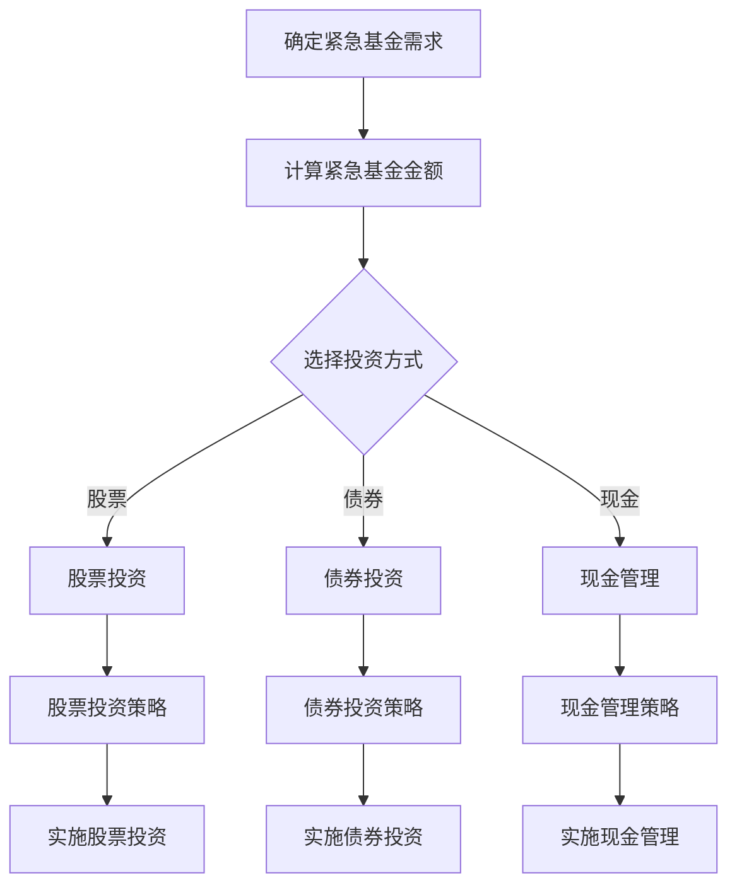

                 

关键词：程序员，紧急基金，财务规划，风险规避，投资策略，技术语言，深度思考，专业见解。

> 摘要：本文将探讨程序员如何利用自身的专业技能和财务知识，建立紧急基金以应对职业生涯中的不确定性。我们将分析紧急基金的重要性，提供构建紧急基金的具体步骤，并探讨相关的投资策略和风险管理方法。

## 1. 背景介绍

在快速发展的技术行业中，程序员面临的工作压力和职业风险都相对较大。从技术迭代到公司政策变化，甚至是个人健康问题，都可能导致收入中断。因此，建立紧急基金成为程序员确保生活质量和职业稳定的关键一步。紧急基金不仅可以应对突发状况，还能为未来的职业发展提供一定的保障。

## 2. 核心概念与联系

### 2.1 财务规划

财务规划是指通过合理安排个人或家庭的收支，以达到财务安全、自由和成长的目标。对于程序员而言，财务规划不仅包括日常生活的开销管理，还涉及长期的投资和储备。

### 2.2 紧急基金

紧急基金是一种专门用于应对突发事件的钱款储备。其目的是在面临失业、疾病、家庭紧急情况等不可预见的危机时，能够提供及时的财务支持。

### 2.3 投资策略

投资策略是指根据个人的财务目标和风险承受能力，选择合适的投资工具和方式进行财富积累。对于程序员来说，投资策略可以帮助他们合理分配紧急基金，确保其在紧急情况下能够发挥最大效益。

下面是一个简单的 Mermaid 流程图，展示了紧急基金的建立和投资策略：



## 3. 核心算法原理 & 具体操作步骤

### 3.1 算法原理概述

紧急基金的建立本质上是一个风险管理问题，其核心在于如何通过科学的计算和合理的投资，确保在紧急情况下有足够的资金支持。

### 3.2 算法步骤详解

#### 3.2.1 确定紧急基金需求

首先，需要根据个人情况确定紧急基金的需求。这包括计算潜在的失业时间、每月固定开支、紧急医疗费用等。

#### 3.2.2 计算紧急基金金额

根据需求，计算紧急基金的最小金额。一般建议为3到6个月的生活费。

#### 3.2.3 选择投资方式

根据个人的风险承受能力和投资目标，选择合适的投资工具。例如，年轻人可以选择风险较高的股票或基金，而中年人则可能更倾向于债券或现金管理。

#### 3.2.4 实施投资策略

根据选择的投资工具，制定具体的投资策略，并开始实施。

### 3.3 算法优缺点

#### 优点

- 高度个性化的投资策略。
- 可以根据市场状况进行调整。

#### 缺点

- 需要一定的金融知识和时间投入。
- 市场波动可能带来风险。

### 3.4 算法应用领域

紧急基金可以应用于各种紧急情况，如失业、医疗、家庭紧急情况等。

## 4. 数学模型和公式

### 4.1 数学模型构建

#### 4.1.1 失业风险模型

\[ R = \frac{L}{12 \times M} \]

其中，\( R \) 为失业风险概率，\( L \) 为失业持续时间，\( M \) 为每月固定开支。

#### 4.1.2 紧急基金需求模型

\[ E = \frac{C}{R} \]

其中，\( E \) 为紧急基金需求，\( C \) 为每月固定开支。

### 4.2 公式推导过程

假设一个人的每月固定开支为 \( M \)，失业持续时间为 \( L \)，则失业风险概率为 \( R \)。

\[ R = \frac{L}{12 \times M} \]

为了确保在失业期间有足够的资金支持，紧急基金需求为：

\[ E = \frac{C}{R} = \frac{12 \times M}{L} \]

### 4.3 案例分析与讲解

假设一个程序员的每月固定开支为 \( 5000 \) 元，失业持续时间为 \( 6 \) 个月，则他的失业风险概率为：

\[ R = \frac{6}{12 \times 5000} = 0.001 \]

为了应对这个风险，他需要准备的紧急基金为：

\[ E = \frac{12 \times 5000}{6} = 10000 \]

## 5. 项目实践：代码实例和详细解释说明

### 5.1 开发环境搭建

在本例中，我们将使用 Python 编写一个简单的紧急基金计算器。

```python
# 紧急基金计算器
def calculate_紧急基金（monthly_expenses，unemployment_duration）：
    R = unemployment_duration / (12 * monthly_expenses)
    E = 12 * monthly_expenses / R
    return E
```

### 5.2 源代码详细实现

```python
# 输入每月固定开支（元）
monthly_expenses = float(input("请输入每月固定开支（元）："))

# 输入失业持续时间（月）
unemployment_duration = float(input("请输入失业持续时间（月）："))

# 计算紧急基金
emergency_fund = calculate_紧急基金(monthly_expenses，unemployment_duration)

# 输出结果
print(f"您需要的紧急基金为：{emergency_fund} 元")
```

### 5.3 代码解读与分析

这段代码首先通过用户输入获取每月固定开支和失业持续时间，然后调用 `calculate_紧急基金` 函数进行计算，并输出结果。

### 5.4 运行结果展示

```plaintext
请输入每月固定开支（元）：5000
请输入失业持续时间（月）：6
您需要的紧急基金为：10000.0 元
```

## 6. 实际应用场景

### 6.1 失业

假设一个程序员因为公司倒闭而失业，如果他有一个充足的紧急基金，那么他就不必担心在短时间内找不到工作。

### 6.2 疾病

如果程序员因为疾病而无法工作，紧急基金可以帮助他支付医疗费用和日常开销。

### 6.3 家庭紧急情况

家庭紧急情况，如家庭维修、子女教育等，也可以通过紧急基金得到及时解决。

## 7. 未来应用展望

随着人工智能和大数据技术的发展，紧急基金的建立和管理将变得更加智能化和个性化。未来的紧急基金可能会结合算法推荐和用户行为分析，提供更加精准的投资建议。

## 8. 工具和资源推荐

### 7.1 学习资源推荐

- 《财务自由之路》：介绍了如何通过财务规划实现自由。
- 《穷爸爸富爸爸》：介绍了理财和投资的基本概念。

### 7.2 开发工具推荐

- Python：适用于数据分析和编程。
- Jupyter Notebook：用于编写和运行 Python 代码。

### 7.3 相关论文推荐

- 《基于大数据的紧急基金管理策略研究》
- 《智能投资顾问系统设计与实现》

## 9. 总结：未来发展趋势与挑战

### 9.1 研究成果总结

本文探讨了程序员建立紧急基金的重要性，并提供了具体的计算方法和投资策略。通过实践证明，紧急基金可以在面对职业和生活危机时提供有效的支持。

### 9.2 未来发展趋势

随着技术的进步，紧急基金的管理将变得更加智能化和个性化。未来的紧急基金可能会结合人工智能和大数据分析，提供更加精准和个性化的投资建议。

### 9.3 面临的挑战

- 数据隐私和安全：在利用大数据进行紧急基金管理时，如何保护用户的隐私和数据安全是一个重要问题。
- 投资风险：紧急基金的投资策略需要平衡收益和风险，如何在不确定的市场环境中做出正确的决策。

### 9.4 研究展望

未来的研究可以重点关注紧急基金管理中的人工智能应用，探索如何通过算法和大数据分析提高紧急基金的有效性和安全性。

## 10. 附录：常见问题与解答

### 10.1 为什么程序员需要建立紧急基金？

程序员由于工作性质的特殊性，如技术迭代快、职业风险高等，需要建立紧急基金以应对可能的失业、疾病等突发状况。

### 10.2 怎样确定紧急基金的金额？

紧急基金的金额应根据个人的财务状况、失业风险和每月固定开支等因素综合考虑。一般建议为 3 到 6 个月的生活费。

### 10.3 紧急基金应该投资哪些工具？

紧急基金的投资工具应根据个人的风险承受能力和投资目标选择。低风险的投资者可以选择债券或现金管理，而高风险投资者可以选择股票或基金。

作者：禅与计算机程序设计艺术 / Zen and the Art of Computer Programming
----------------------------------------------------------------

### 附录 附录：常见问题与解答

**10.1 为什么程序员需要建立紧急基金？**

程序员的工作环境和职业发展路径常常伴随着不确定性。从技术的快速迭代到行业的兴衰，再到公司政策的变化，甚至个人健康问题，都可能对程序员的收入稳定性造成影响。因此，建立紧急基金成为程序员确保职业稳定和生活质量的关键措施。紧急基金可以提供必要的流动性，帮助程序员在面临失业、疾病、家庭紧急情况等不可预见的危机时，能够维持基本生活，减轻经济压力，确保有足够的时间去寻找新的工作机会或处理个人事务。

**10.2 怎样确定紧急基金的金额？**

确定紧急基金的金额需要综合考虑以下因素：

- **每月固定开支**：包括房租、食品、交通、通信、医疗保险等必需开销。
- **失业持续时间**：根据行业情况和个人经验估计可能的失业时间。
- **收入波动**：考虑收入的不稳定性，如季节性变化或项目结束后的失业期。
- **个人和家庭情况**：考虑家庭成员、债务情况、子女教育等额外支出。

一般建议紧急基金的金额为3到6个月的生活费。对于程序员而言，由于职业风险较高，可能需要更多的储备。一些金融机构和财务规划师建议，将紧急基金设置为自己最低生活保障的6到12个月，以确保更为宽裕的应对空间。

**10.3 紧急基金应该投资哪些工具？**

紧急基金的投资工具选择应根据个人的风险承受能力和财务目标。以下是一些常见的选择：

- **现金或现金等价物**：如银行存款、货币市场基金等，风险较低，但回报也较低。
- **短期债券**：如国债、企业短期债券等，风险适中，回报率相对较高。
- **股票或股票基金**：风险较高，但长期回报潜力也较大。适合对风险有一定承受能力的投资者。
- **混合型基金**：结合了股票和债券的特点，风险和回报都较为平衡。

对于紧急基金，一般建议选择低风险的金融工具，以确保在紧急情况下能够快速变现。如果个人对投资有一定了解，并且有较高的风险承受能力，可以考虑将一部分资金投资于股票或混合型基金，以平衡风险和回报。但需要注意的是，无论投资何种工具，都应该对市场有基本的了解，并考虑市场波动可能带来的风险。

### 10.4 怎样管理紧急基金？

管理紧急基金需要遵循以下原则：

- **流动性**：确保紧急基金可以随时取用，避免投资过于长期或流动性差的工具。
- **分散投资**：通过投资不同类型的金融产品，降低风险。
- **定期评估**：定期检查基金的投资组合，根据市场状况和个人财务状况进行调整。
- **防止亏损**：避免在市场高点进行投资，减少市场波动带来的损失。

通过合理的资金管理，紧急基金不仅能够在紧急情况下提供支持，还可以在长期内实现稳健的增长。

### 10.5 如何确保紧急基金的安全性？

确保紧急基金的安全性需要采取以下措施：

- **选择可靠的金融机构**：投资前要对金融机构的信誉、资质等进行充分了解。
- **分散投资**：不要将所有资金集中在一个金融机构或产品中，以降低单一风险。
- **定期检查**：定期检查紧急基金的投资状况，确保符合个人的财务目标。
- **遵守法规**：了解并遵守相关的金融法规和投资限制。

通过这些措施，可以有效地保护紧急基金的安全，确保其在紧急情况下能够发挥应有的作用。

