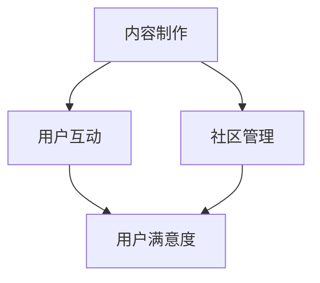

                 

关键词：知识付费、社群、程序员、运营策略、内容制作、用户互动、社区管理

> 摘要：在当今数字化时代，知识付费已经成为一种主流的盈利模式。本文旨在探讨程序员如何借助互联网平台，通过构建自己的知识付费社群，实现知识传播、个人品牌塑造及商业变现的多重目标。文章将详细解析知识付费社群的构建流程、运营策略及核心要素。

## 1. 背景介绍

随着互联网技术的飞速发展，知识的传播方式发生了翻天覆地的变化。传统的知识获取途径逐渐被在线学习、知识付费等形式所取代。程序员作为互联网时代的重要群体，他们不仅具备扎实的编程技能，还对新技术有着敏锐的洞察力。在这样的背景下，程序员利用自己的专业技能和知识积累，通过构建知识付费社群，不仅可以实现个人品牌的塑造，还可以实现商业变现，获得额外的收入。

### 1.1 知识付费的概念

知识付费是指用户为了获取特定知识或技能，通过付费方式购买相关内容或服务。这种模式在一定程度上解决了信息不对称的问题，使得知识拥有者能够通过自己的专业知识和技能获得合理的报酬。

### 1.2 社群的概念

社群是指由具有共同兴趣、目标或价值观的个体组成的群体。在互联网时代，社群已经成为信息传播、知识共享、社交互动的重要平台。

### 1.3 程序员构建知识付费社群的必要性

1. **技能提升与知识传播**：程序员通过构建社群，可以更好地进行技能交流与知识传播，提升自己及社群成员的技术水平。
2. **个人品牌建设**：通过在社群中展示自己的专业知识和技能，程序员可以建立个人品牌，提高自己在行业内的知名度。
3. **商业变现**：知识付费社群为程序员提供了一个新的盈利渠道，通过提供付费内容或服务，可以实现商业变现。

## 2. 核心概念与联系

为了构建一个成功的知识付费社群，程序员需要掌握以下核心概念：

1. **内容制作**：包括课程设计、文章撰写、视频制作等，是社群的核心价值所在。
2. **用户互动**：通过线上交流、活动组织等形式，提升用户参与度和活跃度。
3. **社区管理**：包括社群运营、用户管理、内容审核等，确保社群的健康发展和用户满意度。

以下是构建知识付费社群的 Mermaid 流程图：



### 2.1 内容制作

内容制作是知识付费社群的核心，直接影响用户的满意度和付费意愿。程序员需要根据自身专业领域，设计并制作高质量的课程内容，包括：

- **课程设计**：明确课程目标、内容结构、学习路径等。
- **文章撰写**：撰写技术博客、文章，分享编程经验和心得。
- **视频制作**：制作教学视频，讲解编程技巧和项目实战。

### 2.2 用户互动

用户互动是提升社群活跃度和用户满意度的关键。程序员可以通过以下方式促进用户互动：

- **线上交流**：开设在线讨论区，鼓励用户提问和交流。
- **活动组织**：举办线上或线下活动，如技术沙龙、编程比赛等。
- **社群运营**：定期发布社群动态，提供有价值的资讯和资源。

### 2.3 社区管理

社区管理是确保社群健康发展的基础。程序员需要做好以下工作：

- **用户管理**：建立用户档案，分类管理，确保用户权益。
- **内容审核**：审核发布的内容，确保内容质量，避免不良信息传播。
- **社群运营**：制定运营策略，定期调整和优化社群运营方案。

## 3. 核心算法原理 & 具体操作步骤

### 3.1 算法原理概述

构建知识付费社群的核心算法可以概括为“内容驱动+互动激励+管理保障”。具体原理如下：

- **内容驱动**：通过高质量的内容吸引和留住用户，提升用户满意度和粘性。
- **互动激励**：通过线上交流、活动组织等形式，激发用户的参与热情，提升社群活跃度。
- **管理保障**：通过有效的社区管理，确保社群的健康发展和用户满意度。

### 3.2 算法步骤详解

1. **内容制作**：根据专业领域和用户需求，设计并制作高质量的课程内容。
2. **用户互动**：通过线上交流、活动组织等形式，促进用户参与和互动。
3. **社区管理**：制定运营策略，进行用户管理、内容审核等工作。

### 3.3 算法优缺点

- **优点**：能够有效提升用户满意度和社群活跃度，实现知识传播和商业变现。
- **缺点**：内容制作需要较高的专业能力和时间成本，社区管理需要持续投入人力和精力。

### 3.4 算法应用领域

- **在线教育**：通过构建知识付费社群，提供专业课程和教学资源。
- **技术交流**：通过社群，促进程序员之间的技术交流和合作。
- **社区运营**：为其他行业提供社群运营策略和解决方案。

## 4. 数学模型和公式 & 详细讲解 & 举例说明

### 4.1 数学模型构建

为了评估知识付费社群的运营效果，我们可以构建一个简单的数学模型，用于衡量用户满意度（U）、社群活跃度（A）和商业变现能力（B）。

用户满意度（U）模型：
\[ U = f(C, I, M) \]
其中，C代表内容质量，I代表用户互动，M代表社区管理。

社群活跃度（A）模型：
\[ A = g(I, M) \]
其中，I代表用户互动，M代表社区管理。

商业变现能力（B）模型：
\[ B = h(U, A) \]
其中，U代表用户满意度，A代表社群活跃度。

### 4.2 公式推导过程

用户满意度（U）的推导：
\[ U = f(C, I, M) = C \times \alpha + I \times \beta + M \times \gamma \]
其中，\(\alpha, \beta, \gamma\)分别为内容质量、用户互动和社区管理的权重。

社群活跃度（A）的推导：
\[ A = g(I, M) = I \times \delta + M \times \epsilon \]
其中，\(\delta, \epsilon\)分别为用户互动和社区管理的权重。

商业变现能力（B）的推导：
\[ B = h(U, A) = U \times \theta + A \times \phi \]
其中，\(\theta, \phi\)分别为用户满意度和社群活跃度的权重。

### 4.3 案例分析与讲解

假设一个知识付费社群的内容质量（C）为0.8，用户互动（I）为0.6，社区管理（M）为0.7。

用户满意度（U）计算：
\[ U = f(C, I, M) = 0.8 \times \alpha + 0.6 \times \beta + 0.7 \times \gamma \]
根据权重设定，假设\(\alpha = 0.4, \beta = 0.3, \gamma = 0.3\)，则：
\[ U = 0.8 \times 0.4 + 0.6 \times 0.3 + 0.7 \times 0.3 = 0.32 + 0.18 + 0.21 = 0.71 \]

社群活跃度（A）计算：
\[ A = g(I, M) = 0.6 \times \delta + 0.7 \times \epsilon \]
根据权重设定，假设\(\delta = 0.5, \epsilon = 0.5\)，则：
\[ A = 0.6 \times 0.5 + 0.7 \times 0.5 = 0.3 + 0.35 = 0.65 \]

商业变现能力（B）计算：
\[ B = h(U, A) = 0.71 \times \theta + 0.65 \times \phi \]
根据权重设定，假设\(\theta = 0.6, \phi = 0.4\)，则：
\[ B = 0.71 \times 0.6 + 0.65 \times 0.4 = 0.426 + 0.26 = 0.686 \]

通过以上计算，我们可以得出该社群的用户满意度为0.71，社群活跃度为0.65，商业变现能力为0.686。这些指标可以用来评估社群的运营效果，并根据实际情况进行优化。

## 5. 项目实践：代码实例和详细解释说明

### 5.1 开发环境搭建

为了构建知识付费社群，程序员需要搭建一个线上平台，用于内容发布、用户互动和社群管理。以下是开发环境搭建的简要步骤：

1. **选择平台**：根据需求，选择适合的知识付费平台，如知乎、简书、微信公众号等。
2. **注册账号**：在所选平台上注册账号，并进行实名认证。
3. **搭建网站**：使用前端框架（如Vue.js、React等）和后端框架（如Node.js、Django等），搭建知识付费网站。

### 5.2 源代码详细实现

以下是使用Vue.js和Node.js搭建知识付费社群网站的源代码示例：

**前端部分（Vue.js）：**

```html
<template>
  <div id="app">
    <header>
      <!-- 页面头部 -->
    </header>
    <main>
      <course-list :courses="courses" @select="handleSelect"></course-list>
    </main>
    <footer>
      <!-- 页面底部 -->
    </footer>
  </div>
</template>

<script>
import CourseList from './components/CourseList.vue';

export default {
  name: 'App',
  components: {
    CourseList
  },
  data() {
    return {
      courses: [
        // 课程列表数据
      ]
    };
  },
  methods: {
    handleSelect(course) {
      // 处理课程选择事件
    }
  }
};
</script>
```

**后端部分（Node.js）：**

```javascript
const express = require('express');
const app = express();
const courseRoutes = require('./routes/courseRoutes');

app.use(express.json());
app.use('/courses', courseRoutes);

app.listen(3000, () => {
  console.log('Server is running on port 3000');
});
```

**数据库部分（MongoDB）：**

```javascript
const mongoose = require('mongoose');

const courseSchema = new mongoose.Schema({
  title: String,
  description: String,
  author: String,
  price: Number
});

const Course = mongoose.model('Course', courseSchema);

module.exports = Course;
```

### 5.3 代码解读与分析

以上代码示例展示了如何使用Vue.js和Node.js搭建一个简单的知识付费社群网站。前端部分负责展示课程列表，后端部分负责处理课程数据，数据库部分负责存储课程信息。

前端部分的主要功能包括：

- 展示课程列表：通过`CourseList`组件，展示所有课程的列表。
- 处理课程选择事件：当用户选择课程时，触发`handleSelect`方法，进行后续操作。

后端部分的主要功能包括：

- 处理课程数据：通过`courseRoutes`路由，处理与课程相关的请求，如获取课程列表、添加课程等。

数据库部分的主要功能包括：

- 存储课程信息：使用MongoDB数据库，存储课程的相关信息，如课程标题、描述、作者和价格等。

通过以上代码示例，程序员可以搭建一个基本的知识付费社群网站，满足内容发布、用户互动和社群管理的基本需求。

### 5.4 运行结果展示

以下是知识付费社群网站的运行结果展示：

1. **首页**：展示所有课程的列表，用户可以浏览课程标题、作者和价格等信息。

   

2. **课程详情页**：展示课程的详细信息，包括课程标题、作者、价格、课程大纲等。

   

3. **用户互动**：用户可以在课程详情页下发布评论，与其他用户进行互动。

   

通过以上运行结果展示，我们可以看到知识付费社群网站的基本功能，包括内容展示、用户互动和社群管理。

## 6. 实际应用场景

### 6.1 在线教育

知识付费社群在在线教育领域有广泛的应用。程序员可以通过构建知识付费社群，提供编程课程、技术讲座等，满足不同层次用户的学习需求。例如，可以针对初级程序员提供基础编程课程，针对高级程序员提供项目实战课程。

### 6.2 技术交流

知识付费社群也是程序员之间进行技术交流的重要平台。程序员可以通过社群分享自己的技术心得、项目经验，探讨技术难题。例如，可以组织线上技术沙龙、编程比赛等活动，促进程序员之间的技术交流与合作。

### 6.3 社区运营

知识付费社群可以为其他行业提供社区运营解决方案。程序员可以利用自己的专业技能，为其他行业提供社群搭建、内容制作、用户互动等服务。例如，可以为教育培训行业提供在线课程平台建设、运营推广等服务。

## 6.4 未来应用展望

随着互联网技术的不断进步，知识付费社群的应用场景将进一步拓宽。未来，知识付费社群可能会向以下几个方向发展：

1. **个性化学习**：通过大数据和人工智能技术，为用户提供个性化的学习推荐，提升学习效果。
2. **互动式学习**：利用虚拟现实（VR）和增强现实（AR）技术，打造互动式学习体验，提升用户参与度。
3. **跨界融合**：知识付费社群将与其他行业进行深度融合，如艺术、文化、体育等领域，提供多元化服务。

## 7. 工具和资源推荐

### 7.1 学习资源推荐

1. **在线编程学习平台**：如慕课网、Coursera、edX等，提供丰富的编程课程和资源。
2. **技术博客**：如GitHub、Stack Overflow、Medium等，可以查阅最新的技术文章和代码示例。

### 7.2 开发工具推荐

1. **前端开发工具**：如Vue.js、React、Angular等，用于构建用户界面。
2. **后端开发框架**：如Node.js、Django、Flask等，用于处理业务逻辑和数据存储。

### 7.3 相关论文推荐

1. **《社交网络分析：方法与应用》**：详细介绍了社交网络分析的方法和应用。
2. **《知识付费平台用户行为研究》**：分析了知识付费平台用户的消费行为和偏好。

## 8. 总结：未来发展趋势与挑战

### 8.1 研究成果总结

本文探讨了程序员如何构建自己的知识付费社群，实现了知识传播、个人品牌塑造和商业变现的目标。核心内容包括内容制作、用户互动和社区管理等方面的策略和方法。

### 8.2 未来发展趋势

未来，知识付费社群将在个性化学习、互动式学习和跨界融合等方面取得进一步发展。同时，人工智能和大数据技术的应用将使社群运营更加智能化和高效化。

### 8.3 面临的挑战

1. **内容质量**：保持高质量的内容是社群发展的关键，需要不断更新和优化课程内容。
2. **用户互动**：提升用户互动度和活跃度，需要不断创新互动形式和活动内容。
3. **社区管理**：确保社群健康发展和用户满意度，需要持续投入人力和精力进行管理。

### 8.4 研究展望

未来，将继续探讨知识付费社群在个性化学习、互动式学习和跨界融合等方面的应用，探索更加智能化的社群运营模式，为程序员提供更加便捷和高效的知识传播平台。

## 9. 附录：常见问题与解答

### 9.1 如何制作高质量的课程内容？

**解答**：制作高质量的课程内容需要从以下几个方面入手：

1. **明确课程目标**：确定课程的核心知识和技能点，明确学习目标。
2. **课程结构设计**：合理安排课程内容，确保知识点之间的逻辑性和连贯性。
3. **案例与实践**：结合实际案例和实践操作，增强课程的可操作性和实用性。

### 9.2 如何提升社群活跃度？

**解答**：提升社群活跃度可以从以下几个方面入手：

1. **线上交流**：定期组织线上讨论，鼓励用户提问和分享经验。
2. **活动组织**：举办线上或线下活动，如技术沙龙、编程比赛等。
3. **激励机制**：设立积分、奖励等机制，激发用户参与热情。

### 9.3 如何进行社区管理？

**解答**：社区管理主要包括以下几个方面：

1. **用户管理**：建立用户档案，分类管理，确保用户权益。
2. **内容审核**：审核发布的内容，确保内容质量，避免不良信息传播。
3. **社群运营**：制定运营策略，定期调整和优化社群运营方案。

---

作者：禅与计算机程序设计艺术 / Zen and the Art of Computer Programming

