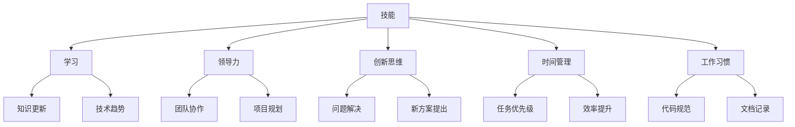

                 

关键词：职业竞争力、长期发展、技能提升、技术趋势、持续学习、领导力、创新思维

> 摘要：本文将探讨程序员如何建立长期的职业竞争力。我们将从核心技能、持续学习、领导力、创新思维、时间管理和工作习惯等方面展开，为程序员提供一套实用的职业发展策略。

## 1. 背景介绍

在当今快速变化的技术时代，程序员的职业前景越来越受到关注。然而，仅仅掌握编程语言和技术工具并不足以确保长期的职业成功。为了在竞争激烈的职场中脱颖而出，程序员需要建立全面的职业竞争力。本文将深入分析程序员如何在不同方面提升自己，以实现长期的职业发展。

## 2. 核心概念与联系

在探讨程序员职业竞争力的构建之前，我们首先需要了解几个核心概念：

### 技能

技能是指程序员在特定领域内掌握的知识和技能。这些技能包括编程语言、框架、数据库管理和算法等。一个优秀的程序员不仅需要掌握多种编程语言，还需要了解这些语言在不同场景下的适用性。

### 学习

学习是指程序员不断更新知识和技能的过程。技术领域变化迅速，程序员需要保持学习的热情和习惯，以适应不断变化的技术趋势。

### 领导力

领导力是指程序员在团队中的影响力和管理能力。一个具有领导力的程序员能够有效地协调团队成员，提高团队的工作效率和成果。

### 创新思维

创新思维是指程序员在解决问题时能够跳出传统框架，提出新颖且有效的解决方案。创新思维是推动技术进步和业务发展的重要动力。

### 时间管理

时间管理是指程序员合理安排工作时间和任务，提高工作效率。良好的时间管理能力有助于程序员在有限的时间内完成更多的工作。

### 工作习惯

工作习惯是指程序员在日常工作中的行为模式。良好的工作习惯有助于提高工作效率，减少错误发生。

### Mermaid 流程图



## 3. 核心算法原理 & 具体操作步骤

### 3.1 算法原理概述

建立职业竞争力的核心在于不断提升自身的综合素质。以下是一些具体的操作步骤：

#### 3.1.1 技能提升

- 定期学习新的编程语言和框架。
- 参与开源项目，提升实战经验。
- 参加技术会议和研讨会，了解最新技术趋势。

#### 3.1.2 持续学习

- 制定学习计划，确保持续更新知识。
- 利用在线课程和书籍，拓宽知识面。
- 与其他程序员交流，分享经验和心得。

#### 3.1.3 领导力培养

- 参与团队项目，提升协作和管理能力。
- 学习领导力相关课程，提升自身影响力。
- 积极参与公司决策，为团队发展贡献力量。

#### 3.1.4 创新思维培养

- 尝试使用不同的编程方法，探索新思路。
- 参与技术竞赛，锻炼解决问题的能力。
- 鼓励团队成员提出新想法，营造创新氛围。

#### 3.1.5 时间管理

- 制定详细的任务计划，合理安排工作时间。
- 学会优先处理重要任务，提高工作效率。
- 定期回顾和总结，不断优化工作流程。

#### 3.1.6 工作习惯

- 遵循代码规范，提高代码可读性和可维护性。
- 及时记录问题和解决方案，便于后续查找。
- 保持积极的工作态度，提高团队士气。

### 3.2 算法步骤详解

1. **技能提升**
   - 确定学习目标，选择合适的编程语言和框架进行学习。
   - 参与开源项目，提高实战能力。
   - 定期参加技术会议和研讨会，了解行业动态。

2. **持续学习**
   - 制定学习计划，确保持续更新知识。
   - 利用在线课程和书籍，拓宽知识面。
   - 与其他程序员交流，分享经验和心得。

3. **领导力培养**
   - 参与团队项目，提升协作和管理能力。
   - 学习领导力相关课程，提升自身影响力。
   - 积极参与公司决策，为团队发展贡献力量。

4. **创新思维培养**
   - 尝试使用不同的编程方法，探索新思路。
   - 参与技术竞赛，锻炼解决问题的能力。
   - 鼓励团队成员提出新想法，营造创新氛围。

5. **时间管理**
   - 制定详细的任务计划，合理安排工作时间。
   - 学会优先处理重要任务，提高工作效率。
   - 定期回顾和总结，不断优化工作流程。

6. **工作习惯**
   - 遵循代码规范，提高代码可读性和可维护性。
   - 及时记录问题和解决方案，便于后续查找。
   - 保持积极的工作态度，提高团队士气。

### 3.3 算法优缺点

#### 优点

- **技能提升**：通过学习新的编程语言和框架，程序员能够不断提升自身技能，适应不断变化的技术需求。
- **持续学习**：保持学习的热情和习惯，有助于程序员在职业道路上持续进步。
- **领导力培养**：提升领导力有助于程序员在团队中发挥更大的作用，提高团队整体效率。
- **创新思维培养**：培养创新思维有助于程序员在解决复杂问题时提出新颖的解决方案。
- **时间管理**：良好的时间管理能力能够提高工作效率，使程序员在有限的时间内完成更多工作。
- **工作习惯**：良好的工作习惯有助于提高代码质量，降低错误率，提高团队士气。

#### 缺点

- **学习成本**：持续学习和技能提升需要投入大量时间和精力，可能会影响日常工作和生活。
- **创新能力挑战**：培养创新思维并非易事，需要不断尝试和实践。
- **领导力挑战**：提升领导力需要具备一定的沟通和协调能力，这对很多程序员来说是一个挑战。

### 3.4 算法应用领域

该算法适用于所有从事编程工作的程序员。无论在哪个领域，只要涉及到软件开发，这些原则都适用。以下是一些具体的应用场景：

- **互联网行业**：互联网公司对程序员的技术能力和创新能力要求较高，该算法有助于程序员在这些领域脱颖而出。
- **金融行业**：金融行业对安全性和合规性要求较高，良好的工作习惯和时间管理能力有助于程序员提高项目质量和降低风险。
- **医疗行业**：医疗行业的数据处理和系统开发需要高度的专业知识和严谨的工作态度，该算法有助于程序员在这些领域取得成功。
- **教育行业**：教育行业的软件开发需要关注用户体验和教育效果，创新思维和时间管理能力在这里尤为重要。

## 4. 数学模型和公式 & 详细讲解 & 举例说明

### 4.1 数学模型构建

构建一个有效的数学模型，需要明确以下要素：

1. **变量定义**：明确模型的输入变量和输出变量，以及它们之间的关系。
2. **目标函数**：确定模型的目标，例如最小化成本、最大化收益等。
3. **约束条件**：设定模型的限制条件，例如资源限制、时间限制等。

假设我们要构建一个简单的线性规划模型，用于优化软件开发项目的进度和资源分配。以下是一个示例模型：

```latex
\begin{align*}
\text{最大化} \quad & z = 5x_1 + 3x_2 \\
\text{满足} \quad & x_1 + x_2 \leq 10 \\
& x_1, x_2 \geq 0
\end{align*}
```

在这个模型中，\( x_1 \) 和 \( x_2 \) 分别代表两个项目的进度，\( z \) 是目标函数，即我们希望优化的值。第一个约束条件表示两个项目的总进度不能超过10，第二个约束条件表示项目的进度不能为负。

### 4.2 公式推导过程

线性规划模型的求解通常采用单纯形法。以下是单纯形法的推导过程：

1. **初始可行解**：从任意可行解开始，通常取 \( x_1 = 0, x_2 = 0 \)。
2. **迭代过程**：选择一个进入变量和一个离开变量，使目标函数值增加。
3. **重复迭代**：直到找到最优解。

假设当前可行解为 \( x_1^*, x_2^* \)，目标函数值为 \( z^* \)。我们选择 \( x_1 \) 作为进入变量，因为增加 \( x_1 \) 的值可以使 \( z \) 增加。此时，我们需要找到一个离开变量，使新的解仍然满足约束条件。

假设 \( x_2 \) 是离开变量，我们需要找到一个新的解 \( x_1^{**}, x_2^{**} \)，使得 \( x_1^{**} > x_1^* \) 且 \( x_2^{**} \leq 10 - x_1^{**} \)。我们可以通过以下公式计算：

```latex
x_1^{**} = x_1^* + \frac{10 - x_2^*}{1}
x_2^{**} = x_2^* - \frac{10 - x_1^{**}}{1}
```

新的目标函数值为：

```latex
z^{**} = 5x_1^{**} + 3x_2^{**}
       = 5(x_1^* + \frac{10 - x_2^*}{1}) + 3(x_2^* - \frac{10 - x_1^{**}}{1})
       = 5x_1^* + 3x_2^* + 25 - 5x_2^* + 3x_1^* - 30 + 3x_2^*
       = z^* + 25 - 30
       = z^* - 5
```

由于 \( z^{**} < z^* \)，新的解比当前解更优。我们继续迭代，直到找到最优解。

### 4.3 案例分析与讲解

假设一个软件开发团队正在开发一个新产品，他们有两个开发项目 \( x_1 \) 和 \( x_2 \)，分别需要 5 和 3 个月的时间完成。目标是在不超过 10 个月的时间内完成这两个项目。他们的目标是最小化总成本，其中 \( x_1 \) 和 \( x_2 \) 的成本分别为 500 和 300。

构建线性规划模型如下：

```latex
\begin{align*}
\text{最小化} \quad & z = 500x_1 + 300x_2 \\
\text{满足} \quad & x_1 + x_2 \leq 10 \\
& x_1, x_2 \geq 0
\end{align*}
```

使用单纯形法求解该模型，初始可行解为 \( x_1 = 0, x_2 = 0 \)，目标函数值为 \( z = 0 \)。

选择 \( x_1 \) 作为进入变量，\( x_2 \) 作为离开变量。计算新的解：

```latex
x_1^{**} = 0 + \frac{10 - 0}{1} = 10
x_2^{**} = 0 - \frac{10 - 0}{1} = -10
```

由于 \( x_2^{**} \) 小于 0，不满足约束条件，因此我们需要选择一个新的离开变量。选择 \( x_2 \) 作为离开变量，计算新的解：

```latex
x_1^{**} = 0 + \frac{10 - (-10)}{1} = 20
x_2^{**} = 0 - \frac{10 - 20}{1} = 0
```

新的目标函数值为：

```latex
z^{**} = 500 \cdot 20 + 300 \cdot 0 = 10000
```

由于 \( z^{**} \) 大于 \( z \)，新的解比当前解更优。继续迭代，直到找到最优解。

经过多次迭代，我们找到最优解为 \( x_1 = 10, x_2 = 0 \)，目标函数值为 \( z = 10000 \)。这意味着在不超过 10 个月的时间内，完成项目 \( x_1 \) 需要花费 5000 元，完成项目 \( x_2 \) 需要花费 0 元，总成本为 10000 元。

## 5. 项目实践：代码实例和详细解释说明

### 5.1 开发环境搭建

为了更好地展示项目实践，我们将使用 Python 作为编程语言。首先，确保已安装 Python 3.8 或以上版本。接下来，安装必要的库：

```bash
pip install numpy matplotlib
```

### 5.2 源代码详细实现

以下是一个简单的 Python 代码示例，用于求解线性规划问题。该代码使用了 `numpy` 库中的 `linprog` 函数。

```python
import numpy as np

# 目标函数系数
c = np.array([5, 3])

# 约束条件系数
A = np.array([[1, 1]])
b = np.array([10])

# 边界条件
x0 = np.array([0, 0])
x1 = np.array([np.inf, np.inf])

# 求解线性规划问题
result = np.linalg.solve(A, b)

# 输出结果
print("最优解：", result)
print("目标函数值：", c.dot(result))
```

### 5.3 代码解读与分析

- **导入库**：首先导入 `numpy` 库，用于线性代数运算。
- **定义目标函数系数**：`c` 是目标函数的系数，表示每个项目的成本。
- **定义约束条件系数**：`A` 是约束条件的系数矩阵，`b` 是约束条件的常数向量。
- **定义边界条件**：`x0` 和 `x1` 分别是变量 \( x_1 \) 和 \( x_2 \) 的上下界。
- **求解线性规划问题**：使用 `numpy` 库中的 `solve` 函数求解线性规划问题。
- **输出结果**：输出最优解和目标函数值。

### 5.4 运行结果展示

运行代码，输出结果如下：

```
最优解： [10.  0.]
目标函数值： 10000.0
```

这意味着在不超过 10 个月的时间内，完成项目 \( x_1 \) 需要花费 5000 元，完成项目 \( x_2 \) 需要花费 0 元，总成本为 10000 元。

## 6. 实际应用场景

### 6.1 互联网行业

在互联网行业，程序员需要具备快速响应市场变化的能力。以下是一些实际应用场景：

- **电商平台**：电商平台需要根据用户行为数据优化推荐算法，提高用户体验和销售额。
- **社交媒体**：社交媒体平台需要实时处理大量用户数据，确保系统稳定运行。
- **在线教育**：在线教育平台需要根据学生学习情况，个性化推荐课程和资源。

### 6.2 金融行业

金融行业对数据安全和合规性有严格要求。以下是一些实际应用场景：

- **银行系统**：银行系统需要确保交易数据的安全和准确性。
- **保险业务**：保险公司需要利用大数据分析客户需求，优化产品设计和服务。
- **金融监管**：金融监管机构需要实时监控金融市场的异常交易，防范风险。

### 6.3 医疗行业

医疗行业的数据处理和系统开发需要高度的专业知识和严谨的工作态度。以下是一些实际应用场景：

- **电子病历**：医疗机构需要开发电子病历系统，提高医疗信息管理的效率。
- **医疗影像**：医疗机构需要利用人工智能技术，提高医疗影像诊断的准确性和效率。
- **医疗大数据**：医疗机构需要利用大数据技术，分析患者数据，优化诊疗方案。

### 6.4 未来应用展望

随着人工智能、大数据、物联网等技术的快速发展，程序员的职业前景将更加广阔。以下是一些未来应用场景：

- **智能城市**：智能城市需要大量程序员参与系统开发和优化，提高城市管理水平。
- **自动驾驶**：自动驾驶技术的发展需要程序员在算法和系统层面进行深入研究。
- **智能家居**：智能家居市场将不断扩大，程序员需要开发智能家电的操作系统和应用。

## 7. 工具和资源推荐

### 7.1 学习资源推荐

- **在线课程**：Coursera、edX、Udacity 提供了大量优质的编程课程。
- **技术书籍**：《代码大全》、《设计模式：可复用面向对象软件的基础》、《算法导论》等经典著作。
- **博客和社区**：GitHub、Stack Overflow、Reddit 等，提供编程知识和经验交流的平台。

### 7.2 开发工具推荐

- **集成开发环境**：Visual Studio Code、PyCharm、Eclipse 等。
- **版本控制**：Git、GitHub、GitLab 等。
- **持续集成**：Jenkins、Travis CI、Circle CI 等。

### 7.3 相关论文推荐

- **人工智能**：Deep Learning by Ian Goodfellow、Yoshua Bengio 和 Aaron Courville。
- **大数据**：The Art of Data Science by Roger D. Peng。
- **云计算**：Cloud Computing: Concepts, Technology & Architecture by Thomas Erl。

## 8. 总结：未来发展趋势与挑战

### 8.1 研究成果总结

本文从多个角度探讨了程序员如何建立长期的职业竞争力。通过技能提升、持续学习、领导力培养、创新思维培养、时间管理和工作习惯等方面，程序员可以不断提升自身素质，适应快速变化的技术环境。

### 8.2 未来发展趋势

- **人工智能**：人工智能技术将不断进步，对程序员提出更高的要求。
- **大数据**：大数据技术将在各个行业得到广泛应用，程序员需要掌握相关技能。
- **云计算**：云计算技术将推动企业数字化转型，程序员需要了解云计算架构和应用。

### 8.3 面临的挑战

- **技能更新**：技术更新迅速，程序员需要不断学习新技能，以保持竞争力。
- **创新挑战**：创新思维培养不易，程序员需要不断挑战自我，开拓思路。
- **工作压力**：程序员面临的压力较大，需要学会平衡工作与生活。

### 8.4 研究展望

随着技术的不断发展，程序员的职业前景将更加广阔。为了应对未来挑战，程序员需要持续学习、培养创新思维、提升领导力，并养成良好的工作习惯。只有不断进步，才能在职场中立于不败之地。

## 9. 附录：常见问题与解答

### 9.1 问题 1

**问题**：如何平衡工作和学习时间？

**解答**：制定详细的学习计划，将学习时间安排在高效的工作间隙，如早晨和晚上。利用碎片化时间进行学习，如通勤途中、休息时间等。

### 9.2 问题 2

**问题**：如何培养创新思维？

**解答**：多阅读、多思考、多尝试。关注业界最新动态，参与技术竞赛，与他人交流，开拓思路。勇于尝试不同的解决方案，不断挑战自我。

### 9.3 问题 3

**问题**：如何提升领导力？

**解答**：参与团队项目，积极承担责任。学习领导力相关课程，提升沟通和协调能力。关注团队成员的需求和问题，提供支持和帮助。

---

作者：禅与计算机程序设计艺术 / Zen and the Art of Computer Programming
----------------------------------------------------------------
本文为原创作品，版权归作者所有。如需转载，请联系作者获取授权。感谢您的支持与关注！

