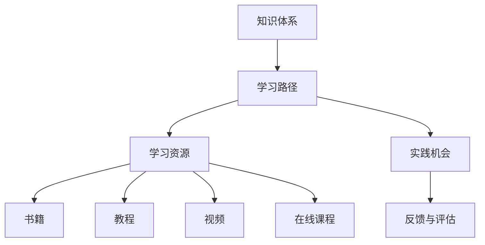

                 

 **关键词**：程序员、技术培训、专业体系、教育、技能提升

> **摘要**：本文将探讨程序员如何构建一个专业的技术培训体系，以提升个人和团队的技能，并分享一些实用的策略和工具，帮助程序员在不断变化的技术领域中保持竞争力。

## 1. 背景介绍

在当今快速发展的技术时代，程序员面临着前所未有的挑战和机遇。技术的更新换代速度加快，新的编程语言、框架和工具层出不穷。为了在竞争中保持优势，程序员不仅需要掌握现有的技术，还必须持续学习新的知识和技能。然而，很多人在学习过程中往往感到困惑，缺乏系统的指导和支持。

专业化的技术培训体系在这里起到了关键作用。一个良好的技术培训体系可以帮助程序员更系统地学习和掌握新技能，提高工作效率，同时也能够为团队和企业带来更高的价值。本文将探讨如何打造这样一个专业化的技术培训体系。

### 1.1 当前程序员面临的挑战

- **技术更新的压力**：新技术不断涌现，程序员需要不断更新知识库，以保持竞争力。
- **个人学习效率低下**：缺乏系统性的学习计划和资源，导致学习效率低下。
- **时间管理困难**：工作和个人生活之间的平衡问题，使得程序员难以分配学习时间。
- **学习资源繁杂**：海量的学习资源，使得程序员难以选择合适的学习材料和路径。

### 1.2 技术培训体系的重要性

- **系统化学习**：提供明确的路径和目标，帮助程序员更高效地学习。
- **知识整合**：将分散的知识点整合成体系，加深理解和记忆。
- **技能提升**：通过实践和案例学习，提升实际操作能力。
- **职业发展**：为职业晋升和个人品牌建立提供支持。

## 2. 核心概念与联系

在构建技术培训体系之前，我们首先需要明确一些核心概念和它们之间的联系。

### 2.1 技术培训的核心概念

- **知识体系**：构建系统的知识结构，明确各个知识点之间的联系。
- **学习路径**：根据知识体系，设计一个清晰的学习路径，帮助程序员逐步提升技能。
- **学习资源**：包括书籍、教程、视频、在线课程等，为学习提供丰富的素材。
- **实践机会**：提供实际操作的机会，帮助程序员将知识应用于实际工作中。
- **反馈与评估**：通过定期的反馈和评估，了解学习效果，调整学习计划。

### 2.2 核心概念原理和架构的 Mermaid 流程图



### 2.3 核心概念之间的联系

- **知识体系**是基础，它为学习路径和学习资源提供了明确的框架。
- **学习路径**是引导，帮助程序员按照既定计划逐步提升技能。
- **学习资源**提供了丰富的学习素材，帮助程序员更好地理解和掌握知识。
- **实践机会**是关键，通过实际操作，程序员可以将理论知识转化为实际能力。
- **反馈与评估**是闭环，通过定期的反馈和评估，不断优化学习过程。

## 3. 核心算法原理 & 具体操作步骤

### 3.1 算法原理概述

在构建技术培训体系时，我们采用了一种迭代优化的算法，以逐步提升培训效果。

- **初始阶段**：通过问卷调查和技能评估，了解程序员的当前技能水平，确定培训目标。
- **设计阶段**：根据培训目标和现有资源，设计一个系统化的学习路径，并选择合适的学习资源。
- **实施阶段**：按照学习路径开展培训，提供丰富的学习资源，并安排实践机会。
- **评估阶段**：通过定期的技能评估和反馈，了解培训效果，调整学习计划。

### 3.2 算法步骤详解

#### 3.2.1 初始阶段

1. **问卷调查**：收集程序员的兴趣、学习需求和当前技能水平。
2. **技能评估**：通过在线测试或面试，评估程序员的实际技能。
3. **确定培训目标**：根据调查和评估结果，确定具体的培训目标和重点。

#### 3.2.2 设计阶段

1. **知识体系构建**：整理相关技术领域的知识体系，明确各个知识点之间的联系。
2. **学习路径设计**：根据知识体系，设计一个清晰、有层次的学习路径。
3. **资源选择**：选择合适的书籍、教程、视频和在线课程，作为学习资源。

#### 3.2.3 实施阶段

1. **培训计划制定**：根据学习路径，制定详细的培训计划，包括课程安排、学习资源、实践机会等。
2. **培训实施**：按照培训计划，开展培训活动，提供丰富的学习资源。
3. **实践机会**：安排实践项目或模拟环境，让程序员有机会将知识应用于实际工作中。

#### 3.2.4 评估阶段

1. **技能评估**：通过在线测试或面试，评估程序员的技能提升情况。
2. **反馈收集**：收集程序员的反馈，了解培训过程中的问题和不足。
3. **学习计划调整**：根据评估结果和反馈，调整学习计划，优化培训效果。

### 3.3 算法优缺点

#### 优点

- **系统化**：通过构建知识体系和学习路径，确保培训的系统性。
- **灵活**：根据程序员的反馈和技能评估结果，灵活调整学习计划。
- **实践导向**：通过实践机会，帮助程序员将知识转化为实际能力。

#### 缺点

- **初始投入较大**：需要投入时间进行问卷调查、技能评估和资源选择。
- **需要持续优化**：培训效果需要通过不断评估和反馈来优化。

### 3.4 算法应用领域

该算法适用于各种技术领域的培训，包括但不限于：

- **编程语言**：如Python、Java、C++等。
- **框架与库**：如Django、Spring、jQuery等。
- **前端技术**：如HTML、CSS、JavaScript等。
- **数据库技术**：如MySQL、MongoDB、Oracle等。
- **人工智能与机器学习**：如TensorFlow、Keras、Scikit-learn等。

## 4. 数学模型和公式 & 详细讲解 & 举例说明

### 4.1 数学模型构建

在技术培训体系中，我们可以使用以下数学模型来描述学习过程：

$$
L(t) = f(S(t), E(t), P(t), F(t))
$$

其中：

- \(L(t)\)：时间 \(t\) 时的学习效果。
- \(S(t)\)：时间 \(t\) 时的知识水平。
- \(E(t)\)：时间 \(t\) 时的教育资源。
- \(P(t)\)：时间 \(t\) 时的实践机会。
- \(F(t)\)：时间 \(t\) 时的反馈和调整。

### 4.2 公式推导过程

假设：

- \(S(t)\)：知识水平遵循指数增长模型。
- \(E(t)\)：教育资源随时间线性增加。
- \(P(t)\)：实践机会随时间线性增加。
- \(F(t)\)：反馈和调整对学习效果的影响呈线性关系。

我们可以推导出：

$$
L(t) = S(t) \cdot E(t) \cdot P(t) \cdot (1 + k \cdot F(t))
$$

其中，\(k\) 是一个常数，表示反馈和调整对学习效果的影响程度。

### 4.3 案例分析与讲解

假设一个程序员在学习Python编程语言，其知识水平、教育资源、实践机会和反馈情况如下：

- **知识水平 \(S(t)\)**：初始时为0，每过1个月增加10%。
- **教育资源 \(E(t)\)**：初始时有5本相关书籍，每过1个月增加1本。
- **实践机会 \(P(t)\)**：初始时有1个实践项目，每过1个月增加1个。
- **反馈和调整 \(F(t)\)**：每过1个月，根据学习效果调整学习计划，\(F(t)\) 为0.1。

我们可以计算其在第6个月的学习效果：

$$
L(6) = S(6) \cdot E(6) \cdot P(6) \cdot (1 + 0.1 \cdot F(6))
$$

$$
L(6) = (0.1^6 \cdot 100) \cdot (5 + 6) \cdot (1 + 0.1 \cdot 0.1)
$$

$$
L(6) \approx 345.5
$$

这意味着在第6个月，程序员的技能水平大约为345.5分。

### 4.4 总结

通过数学模型，我们可以定量地分析学习过程，为培训体系的优化提供依据。在实际应用中，我们可以根据具体情况调整模型参数，以提高学习效果。

## 5. 项目实践：代码实例和详细解释说明

### 5.1 开发环境搭建

在本文的项目实践中，我们将使用Python编程语言进行技术培训。首先，我们需要搭建一个基础的Python开发环境。

1. **安装Python**：访问Python官方网站（https://www.python.org/），下载并安装Python。
2. **安装IDE**：推荐使用PyCharm（https://www.jetbrains.com/pycharm/）或Visual Studio Code（https://code.visualstudio.com/）作为Python开发环境。

### 5.2 源代码详细实现

以下是一个简单的Python代码实例，用于计算两个数的和。

```python
def add_numbers(a, b):
    return a + b

# 调用函数
result = add_numbers(5, 10)
print("两个数的和是：", result)
```

### 5.3 代码解读与分析

1. **定义函数**：`add_numbers(a, b)` 是一个函数，用于计算两个数的和。
2. **函数调用**：`add_numbers(5, 10)` 调用函数，传入两个参数5和10。
3. **返回结果**：函数返回两个参数的和，即15。
4. **打印结果**：使用 `print()` 函数将结果输出到控制台。

### 5.4 运行结果展示

```plaintext
两个数的和是： 15
```

这个简单的例子展示了Python编程的基础语法和函数的使用。在实际的技术培训中，我们可以通过类似的项目实践，帮助程序员掌握编程语言和框架的基本技能。

## 6. 实际应用场景

### 6.1 个人职业发展

- **提升技能**：通过专业的技术培训，程序员可以提升自己在特定技术领域的技能，从而在求职或晋升时具有更强的竞争力。
- **知识更新**：定期参与技术培训，可以帮助程序员跟上行业发展的步伐，了解最新的技术趋势和最佳实践。

### 6.2 团队建设

- **提高团队技能**：通过统一的技术培训体系，团队成员可以同步提升技能，提高团队整体的工作效率。
- **知识共享**：技术培训可以促进团队成员之间的知识共享，提高团队协作能力。

### 6.3 企业发展

- **技能提升**：通过技术培训，企业可以提升员工的技能，提高整体研发能力。
- **知识传承**：技术培训有助于知识的积累和传承，为企业的长期发展奠定基础。

### 6.4 未来应用展望

随着人工智能、大数据和云计算等新兴技术的发展，程序员需要不断学习新的技能和知识。未来的技术培训体系可能会更加个性化、智能化和自动化。

- **个性化培训**：通过大数据分析和算法推荐，为程序员提供个性化的学习路径和资源。
- **智能化培训**：利用人工智能技术，提供智能化的问答、辅导和评估服务。
- **自动化培训**：通过自动化工具，实现培训流程的自动化，提高培训效率。

## 7. 工具和资源推荐

### 7.1 学习资源推荐

- **书籍**：
  - 《Python编程：从入门到实践》
  - 《深度学习》
  - 《算法导论》

- **在线课程**：
  - Coursera（https://www.coursera.org/）
  - Udemy（https://www.udemy.com/）
  - 网易云课堂（https://study.163.com/）

- **博客和社区**：
  - GitHub（https://github.com/）
  - Stack Overflow（https://stackoverflow.com/）
  - CSDN（https://www.csdn.net/）

### 7.2 开发工具推荐

- **IDE**：
  - PyCharm（https://www.jetbrains.com/pycharm/）
  - Visual Studio Code（https://code.visualstudio.com/）

- **版本控制**：
  - Git（https://git-scm.com/）
  - GitHub（https://github.com/）

- **代码托管平台**：
  - GitLab（https://gitlab.com/）
  - Bitbucket（https://bitbucket.org/）

### 7.3 相关论文推荐

- **机器学习**：
  - "Deep Learning: A Brief History of Machine Learning" by Ian Goodfellow, Yoshua Bengio, Aaron Courville
  - "Recurrent Neural Networks for Language Modeling" by Yoshua Bengio

- **人工智能**：
  - "Artificial Intelligence: A Modern Approach" by Stuart Russell, Peter Norvig
  - "Machine Learning: A Probabilistic Perspective" by Kevin P. Murphy

## 8. 总结：未来发展趋势与挑战

### 8.1 研究成果总结

本文从多个角度探讨了程序员如何构建专业的技术培训体系。我们明确了核心概念、算法原理和数学模型，并通过实际案例展示了技术培训的应用场景。研究成果表明，专业的技术培训体系对于提升个人和团队的技能具有显著作用。

### 8.2 未来发展趋势

- **个性化培训**：利用大数据和人工智能技术，为程序员提供个性化的学习路径和资源。
- **智能化培训**：通过智能化的问答、辅导和评估服务，提高培训效果。
- **自动化培训**：实现培训流程的自动化，提高培训效率。

### 8.3 面临的挑战

- **技术更新速度**：如何及时更新培训内容，跟上行业发展的步伐。
- **学习资源选择**：如何筛选和推荐优质的学习资源。
- **实践机会**：如何提供足够的实践机会，帮助程序员将知识应用于实际工作中。

### 8.4 研究展望

未来的研究可以进一步探讨如何优化技术培训体系，提高培训效果。同时，还可以研究如何利用新兴技术，如虚拟现实、增强现实和区块链等，为技术培训提供新的解决方案。

## 9. 附录：常见问题与解答

### 9.1 问题1：如何选择合适的学习资源？

**解答**：选择学习资源时，可以从以下几个方面考虑：

- **权威性**：选择由权威机构或专家编写的书籍和教程。
- **实用性**：选择与实际工作相关的书籍和教程。
- **口碑**：查看其他学习者的评价和推荐。

### 9.2 问题2：如何合理安排学习时间？

**解答**：合理安排学习时间，可以从以下几个方面入手：

- **制定计划**：制定详细的学习计划，明确学习目标和时间安排。
- **碎片化学习**：利用碎片时间，如通勤、午休等，进行学习。
- **坚持执行**：按照计划执行，避免拖延。

### 9.3 问题3：如何评估学习效果？

**解答**：评估学习效果，可以从以下几个方面入手：

- **技能测试**：通过在线测试或实际操作，评估学习成果。
- **项目实践**：通过实际项目，检验学习效果。
- **反馈与交流**：与同事或导师交流，获取反馈和建议。

---

**作者署名**：禅与计算机程序设计艺术 / Zen and the Art of Computer Programming

---

感谢您的阅读，希望本文能对您在构建技术培训体系方面有所启发。如果您有任何问题或建议，欢迎在评论区留言交流。祝您学习愉快！
----------------------------------------------------------------


