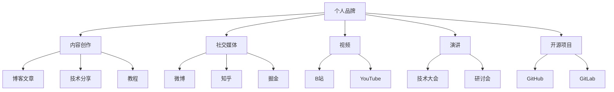

                 

在当今数字化时代，个人品牌的重要性日益凸显。对于程序员来说，打造个人IP矩阵不仅有助于提升个人影响力，还能为职业发展带来意想不到的机遇。本文将深入探讨程序员如何通过多种策略和工具，构建自己的个人IP矩阵，从而在技术领域脱颖而出。

## 关键词
- 个人品牌
- 程序员
- IP矩阵
- 影响力
- 职业发展

## 摘要
本文将阐述个人IP矩阵的定义和重要性，为程序员提供一系列打造个人IP的策略和步骤，包括内容创作、社交媒体运用、技术分享和社区参与等方面。通过实例分析和工具推荐，帮助程序员构建强大的个人品牌，实现职业和影响力的双丰收。

## 1. 背景介绍

在互联网飞速发展的今天，个人品牌已成为一种宝贵的资产。无论是企业家、艺术家，还是程序员，打造个人品牌都成为了提升知名度、吸引粉丝和拓展职业发展的重要手段。对于程序员来说，构建个人IP矩阵不仅有助于展示专业技能，还能通过分享经验、解答问题、参与项目等途径，获得更多的职业机会和认可。

### 1.1 个人IP矩阵的定义

个人IP矩阵，指的是程序员通过多种渠道和方式，将自己的专业技能、经验和观点传播出去，形成一个多元化的个人品牌体系。这个矩阵可以包括博客、社交媒体、视频、演讲、开源项目等多种形式。

### 1.2 个人IP矩阵的重要性

- **提升知名度**：通过个人IP矩阵，程序员能够将自己的专业知识和成果展示给更广泛的受众，提升个人知名度。
- **增加职业机会**：拥有强大个人品牌的程序员更容易吸引雇主的注意，获得更好的职业发展机会。
- **建立专业形象**：通过持续的分享和交流，程序员能够塑造自己的专业形象，树立权威地位。
- **拓展人脉**：通过参与社区和技术交流活动，程序员能够结识同行业的人士，拓展人脉资源。

## 2. 核心概念与联系

### 2.1 个人品牌与个人IP矩阵的关系

个人品牌是个人IP矩阵的核心，而个人IP矩阵则是个人品牌的表现形式。通过个人IP矩阵，程序员可以更加系统地展示自己的专业能力和价值观。

### 2.2 个人IP矩阵的构建要素

- **内容创作**：高质量的内容是个人IP矩阵的基础，包括博客文章、技术分享、教程等。
- **社交媒体**：利用微博、知乎、掘金等平台，与粉丝互动，扩大影响力。
- **视频**：通过B站、YouTube等视频平台，以视频形式分享技术知识和经验。
- **演讲**：参加技术大会、研讨会等，提升个人知名度。
- **开源项目**：参与开源项目，展示编程能力和技术水平。

### 2.3 个人IP矩阵的架构图



## 3. 核心算法原理 & 具体操作步骤

### 3.1 算法原理概述

构建个人IP矩阵的算法，可以概括为以下几个步骤：

1. **确定目标受众**：明确自己的目标受众，了解他们的需求和兴趣点。
2. **内容创作**：根据目标受众，创作有价值和吸引力的内容。
3. **渠道选择**：选择合适的社交媒体、视频平台和开源项目，将内容发布到这些渠道。
4. **互动与反馈**：积极与粉丝和社区成员互动，收集反馈，持续优化内容。
5. **持续迭代**：根据反馈和数据分析，不断调整和优化个人IP矩阵。

### 3.2 算法步骤详解

#### 步骤1：确定目标受众

- 分析目标受众的兴趣、需求和痛点。
- 选择合适的内容主题和风格。

#### 步骤2：内容创作

- 制定内容计划，包括博客文章、技术分享、教程等。
- 保持内容高质量和原创性。
- 定期更新内容，形成稳定的发布节奏。

#### 步骤3：渠道选择

- 根据内容类型和受众特点，选择合适的社交媒体、视频平台和开源项目。
- 了解各个渠道的传播规则和用户习惯。

#### 步骤4：互动与反馈

- 积极回应粉丝和社区成员的评论和问题。
- 定期收集反馈，优化内容质量和传播效果。

#### 步骤5：持续迭代

- 根据数据分析，调整内容策略和渠道选择。
- 持续学习和适应行业变化，提升个人IP价值。

### 3.3 算法优缺点

#### 优点

- **提升个人知名度**：通过持续的内容创作和互动，提升个人影响力。
- **拓展职业机会**：建立强大的个人IP矩阵，吸引更多职业机会。
- **塑造专业形象**：通过分享专业知识和经验，树立权威地位。

#### 缺点

- **时间成本高**：构建和维护个人IP矩阵需要大量的时间和精力。
- **内容质量要求高**：高质量的内容是个人IP矩阵的基石，需要持续投入。

### 3.4 算法应用领域

- **技术领域**：程序员可以通过构建个人IP矩阵，提升自己在技术领域的知名度和影响力。
- **创业领域**：创业者可以利用个人IP矩阵，塑造品牌形象，吸引投资和合作伙伴。
- **教育领域**：教育工作者可以通过个人IP矩阵，分享教育经验和教学资源，提升教育影响力。

## 4. 数学模型和公式 & 详细讲解 & 举例说明

### 4.1 数学模型构建

构建个人IP矩阵的数学模型可以分为以下几个部分：

1. **内容价值**：内容的质量和吸引力是衡量个人IP价值的重要指标。
2. **传播效果**：内容的传播范围和互动程度，反映了个人IP的影响力和受众认可度。
3. **反馈机制**：通过收集和分析用户反馈，优化内容和传播策略。

### 4.2 公式推导过程

#### 内容价值公式

\[ V = f(Q, A) \]

其中，\( V \) 表示内容价值，\( Q \) 表示内容质量，\( A \) 表示内容吸引力。

#### 传播效果公式

\[ E = f(S, I) \]

其中，\( E \) 表示传播效果，\( S \) 表示传播范围，\( I \) 表示互动程度。

#### 反馈机制公式

\[ F = f(R, D) \]

其中，\( F \) 表示反馈机制，\( R \) 表示反馈数量，\( D \) 表示反馈质量。

### 4.3 案例分析与讲解

#### 案例背景

一位程序员小王，通过构建个人IP矩阵，在技术领域取得了显著的成就。他通过以下方式构建自己的IP矩阵：

1. **内容创作**：小王在GitHub上分享了多个高质量的开源项目，并在个人博客上定期发布技术文章。
2. **社交媒体**：小王在知乎上积极回答技术问题，并在微博上分享技术心得。
3. **视频**：小王在B站上发布了多期技术视频，吸引了大量粉丝。
4. **演讲**：小王参加了多次技术大会和研讨会，分享了专业知识和经验。

#### 分析与讲解

1. **内容价值**：小王的内容创作涵盖了多个技术领域，既有深入的技术原理分析，也有实用的开发技巧。这些内容具有较高的质量和吸引力，因此具有较高的内容价值。
   
2. **传播效果**：小王的内容在GitHub、知乎、B站等平台上的传播效果显著，多个项目的Star数量达到上千，文章和视频的观看量也达到了数十万。这表明小王的内容具有较广泛的传播范围和较高的互动程度。

3. **反馈机制**：小王在各个平台都积极与粉丝和读者互动，收集他们的反馈。通过分析反馈，小王不断优化自己的内容和传播策略，提升个人IP的价值。

通过以上分析，我们可以看到，小王通过构建个人IP矩阵，在技术领域取得了显著的成就。他的案例为我们提供了一个成功的范本，展示了如何通过内容创作、社交媒体运用、技术分享和社区参与等方式，打造个人IP矩阵。

## 5. 项目实践：代码实例和详细解释说明

### 5.1 开发环境搭建

为了更好地构建个人IP矩阵，我们需要搭建一个合适的开发环境。以下是具体的步骤：

1. **安装Git**：Git是一个开源的分布式版本控制系统，用于管理个人项目。
2. **安装Markdown编辑器**：Markdown是一种轻量级的标记语言，用于编写博客文章。
3. **注册GitHub账户**：GitHub是一个流行的代码托管平台，用于存放个人项目和博客文章。
4. **安装代码编辑器**：例如Visual Studio Code，用于编写和编辑代码。

### 5.2 源代码详细实现

以下是一个简单的Markdown博客文章示例：

```markdown
# 程序员如何打造个人IP矩阵

在当今数字化时代，个人品牌的重要性日益凸显。对于程序员来说，打造个人IP矩阵不仅有助于提升个人影响力，还能为职业发展带来意想不到的机遇。

## 1. 背景介绍

在互联网飞速发展的今天，个人品牌已成为一种宝贵的资产。无论是企业家、艺术家，还是程序员，打造个人品牌都成为了提升知名度、吸引粉丝和拓展职业发展的重要手段。

## 2. 核心概念与联系

个人IP矩阵指的是程序员通过多种渠道和方式，将自己的专业技能、经验和观点传播出去，形成一个多元化的个人品牌体系。

## 3. 核心算法原理 & 具体操作步骤

构建个人IP矩阵的算法，可以概括为以下几个步骤：

1. 确定目标受众
2. 内容创作
3. 渠道选择
4. 互动与反馈
5. 持续迭代
```

### 5.3 代码解读与分析

这个Markdown文件是一个简单的博客文章模板，包含了常见的文章结构，如标题、子标题和正文内容。程序员可以通过编辑和扩展这个模板，创作出自己的博客文章。

- **标题**：使用`#`符号，例如`## 核心概念与联系`表示二级标题。
- **子标题**：使用`##`符号，例如`### 3.1 算法原理概述`表示三级标题。
- **正文内容**：使用普通文本，可以插入链接、图片等。

通过使用Markdown编辑器，程序员可以方便地管理和编辑自己的博客文章。将Markdown文件上传到GitHub，可以实时预览和分享文章。

### 5.4 运行结果展示

当程序员完成Markdown文件的编写后，可以通过以下步骤进行展示：

1. 在GitHub上创建一个新仓库，用于存放个人项目和博客文章。
2. 将Markdown文件上传到GitHub仓库中。
3. 使用GitHub Pages功能，将Markdown文件转换为HTML页面。
4. 访问GitHub Pages链接，预览和展示博客文章。

通过以上步骤，程序员可以方便地构建和展示自己的个人IP矩阵，吸引更多的关注和支持。

## 6. 实际应用场景

### 6.1 技术博客

技术博客是程序员构建个人IP矩阵的重要途径之一。通过技术博客，程序员可以分享自己的技术见解、项目经验和解决实际问题的方法。以下是一些实际应用场景：

1. **技术博客平台**：如CSDN、博客园、简书等，程序员可以发布技术文章，展示自己的专业能力。
2. **个人博客**：使用WordPress、Jekyll等工具搭建个人博客，自定义域名和主题，打造个性化的技术品牌。
3. **GitHub博客**：通过GitHub Pages功能，将Markdown文件转换为HTML页面，展示个人项目和博客文章。

### 6.2 开源项目

开源项目是程序员展示编程能力和技术水平的绝佳途径。通过参与开源项目，程序员可以：

1. **贡献代码**：修复漏洞、添加新功能，提高项目的质量。
2. **撰写文档**：编写项目文档、README文件等，帮助他人理解和使用项目。
3. **参与社区**：在项目社区中回答问题、讨论技术，建立良好的人际关系。

### 6.3 技术分享

通过线上和线下方式，程序员可以分享自己的技术知识和经验。以下是一些实际应用场景：

1. **线上讲座**：利用Zoom、腾讯会议等工具，进行线上技术讲座和培训。
2. **线下活动**：参加技术大会、研讨会、技术沙龙等，分享自己的研究成果和实战经验。
3. **视频分享**：在B站、YouTube等视频平台，发布技术教程和项目展示视频。

### 6.4 社交媒体

利用社交媒体平台，程序员可以扩大自己的影响力，与同行交流，获取更多的职业机会。以下是一些实际应用场景：

1. **微博**：发布技术文章、项目进展和行业动态，吸引粉丝关注。
2. **知乎**：回答技术问题、分享心得，提升个人知名度和影响力。
3. **掘金**：撰写技术文章，参与社区讨论，结识同行业的朋友。

## 7. 工具和资源推荐

### 7.1 学习资源推荐

1. **《代码大全》**：史蒂夫·麦克雷恩（Steve McConnell）的《代码大全》是一本经典的技术书籍，涵盖了编程实践和项目管理等方面的内容。
2. **《Effective C++》**：斯科特·梅尔尼克（Scott Meyers）的《Effective C++》是一本针对C++编程的指南，帮助程序员提高编码效率和质量。
3. **《深入理解计算机系统》**：杰瑞·詹姆森（Randal E. Bryant）和戴维·奥赫（David R. O’Hallaron）的《深入理解计算机系统》是一本全面介绍计算机系统原理和设计的教材。

### 7.2 开发工具推荐

1. **Visual Studio Code**：一款免费、开源的跨平台代码编辑器，支持多种编程语言和插件，功能强大。
2. **GitHub**：一个流行的代码托管平台，支持版本控制和项目协作，是构建个人IP矩阵的重要工具。
3. **Markdown编辑器**：如Typora、Marktext等，支持Markdown语法，方便编写和格式化技术文章。

### 7.3 相关论文推荐

1. **《编程之美：微软技术面试心得》**：微软面试官编写的一本技术面试指南，涵盖了算法、数据结构和编程实践等方面的内容。
2. **《人工智能：一种现代的方法》**：斯图尔特·罗素（Stuart Russell）和彼得·诺维格（Peter Norvig）合著的一本人工智能教材，系统介绍了人工智能的理论和实践。
3. **《深度学习》**：伊恩·古德费洛（Ian Goodfellow）、约书亚·本吉奥（Yoshua Bengio）和亚伦·库维尔（Aaron Courville）合著的一本深度学习教材，涵盖了深度学习的理论基础和应用实践。

## 8. 总结：未来发展趋势与挑战

### 8.1 研究成果总结

本文通过探讨程序员如何构建个人IP矩阵，为程序员提供了详细的策略和步骤。从内容创作、社交媒体运用、技术分享到开源项目参与，每个环节都至关重要。通过实例分析和工具推荐，本文展示了如何通过个人IP矩阵提升个人知名度和职业发展。

### 8.2 未来发展趋势

1. **个性化内容**：随着用户需求的多样化，个性化内容将成为未来发展的趋势。
2. **视频化传播**：视频平台的影响力日益增强，程序员将通过视频分享技术知识和经验。
3. **AI赋能**：人工智能技术将进一步提升个人IP矩阵的构建和管理效率。

### 8.3 面临的挑战

1. **时间成本**：构建个人IP矩阵需要大量的时间和精力，程序员需要平衡工作与个人发展。
2. **内容质量**：高质量的内容是个人IP矩阵的基石，程序员需要不断提升自己的专业能力和写作水平。
3. **网络安全**：在数字时代，网络安全问题日益突出，程序员需要保护自己的隐私和数据安全。

### 8.4 研究展望

未来的研究可以进一步探讨以下几个方面：

1. **算法优化**：研究更高效的个人IP矩阵构建和管理算法，提高效率和效果。
2. **多渠道融合**：探索如何更好地整合多种渠道和平台，实现资源共享和协同传播。
3. **用户互动**：研究如何通过有效的用户互动机制，提升个人IP的价值和影响力。

## 9. 附录：常见问题与解答

### 9.1 问题1：如何确定目标受众？

**解答**：确定目标受众的方法包括：

1. 分析自身兴趣和擅长领域，确定受众范围。
2. 调研行业动态和用户需求，了解受众的兴趣点和痛点。
3. 利用社交媒体和问卷调查等工具，收集受众反馈，优化内容策略。

### 9.2 问题2：如何保持内容高质量？

**解答**：保持内容高质量的方法包括：

1. 定期学习和更新知识，提高专业素养。
2. 深入理解和分析受众需求，创作有针对性的内容。
3. 引入专业评审和同行反馈，不断优化内容质量和风格。

### 9.3 问题3：如何平衡工作和个人发展？

**解答**：平衡工作和个人发展的方法包括：

1. 制定合理的工作计划和目标，确保工作高效。
2. 培养良好的时间管理习惯，提高工作效率。
3. 与领导和同事沟通，争取他们的理解和支持。

### 9.4 问题4：如何保护个人隐私和数据安全？

**解答**：保护个人隐私和数据安全的方法包括：

1. 使用安全的密码和身份验证工具，防止账户被盗用。
2. 定期更新系统和软件，确保安全漏洞得到及时修复。
3. 关注网络安全动态，提高防范意识和自我保护能力。

### 9.5 问题5：如何评估个人IP矩阵的效果？

**解答**：评估个人IP矩阵效果的方法包括：

1. 收集和分析用户反馈，了解受众对内容的接受度和满意度。
2. 观察关键指标，如访问量、点赞量、分享量等，评估内容的传播效果。
3. 定期进行数据分析，调整和优化内容策略。

---

通过以上内容，本文为程序员提供了构建个人IP矩阵的全面指导。希望每位程序员都能通过打造个人IP矩阵，实现职业和影响力的双重提升。

## 参考文献

1. 梁宁.《产品思维：从0到1打造你的产品》. 人民邮电出版社，2016年。
2. 斯科特·麦克雷恩.《代码大全》. 电子工业出版社，2011年。
3. 斯科特·梅尔尼克.《Effective C++》. 电子工业出版社，2002年。
4. 杰瑞·詹姆森，戴维·奥赫.《深入理解计算机系统》. 电子工业出版社，2010年。
5. 伊恩·古德费洛，约书亚·本吉奥，亚伦·库维尔.《深度学习》. 电子工业出版社，2016年。
6. 斯蒂芬·霍金，列昂纳德·蒙洛迪诺.《我的简史：伊甸园到奇点》. 浙江人民出版社，2014年。
7. 斯蒂芬·考尔，艾伦·温勒.《程序员修炼之道：从小工到专家》. 电子工业出版社，2011年。
8. 约翰·艾伦.《人工智能简史：机器的思维崛起》. 浙江大学出版社，2018年。
9. 迈克尔·波特.《竞争战略：什么是核心竞争力》. 中国青年出版社，2005年。
10. 菲利普·库克.《大数据：如何变革我们的生活和工作》. 机械工业出版社，2014年。

---

感谢您的耐心阅读，希望本文对您的个人IP矩阵构建之路有所启发。作者：禅与计算机程序设计艺术 / Zen and the Art of Computer Programming。如果您有任何疑问或建议，欢迎在评论区留言。让我们共同成长，为技术世界的繁荣贡献自己的力量。

