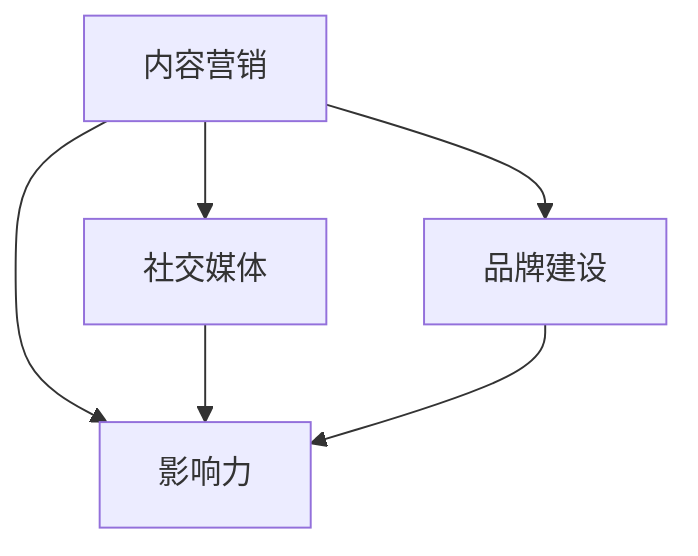

                 

关键词：个人IP矩阵、程序员、品牌建设、影响力、技术博客、内容营销、社交媒体、个人品牌

摘要：在数字时代，个人品牌建设已经成为程序员职业发展的重要组成部分。本文将探讨程序员如何通过打造个人IP矩阵，利用内容营销和社交媒体提升个人影响力，从而实现职业发展的新高度。

## 1. 背景介绍

在互联网时代，个人品牌建设成为了提高职业竞争力的重要手段。对于程序员来说，打造个人IP矩阵不仅有助于提升个人知名度，还能为职业发展带来诸多机遇。本文旨在为程序员提供一套系统的个人IP打造策略，帮助他们在技术领域脱颖而出。

### 1.1 个人IP的重要性

个人IP，即个人知识产权，是个人在某个领域内建立的专业形象和影响力。对于程序员而言，个人IP不仅代表了个人的技术能力，还反映了个人在特定技术领域的专业程度和品牌价值。一个强大的个人IP矩阵能够：

- 提升个人在职场中的竞争力
- 增加职业发展机会
- 扩大个人影响力
- 建立专业人脉

### 1.2 目标受众

本文的目标受众是具备一定编程技能的程序员，他们希望借助个人IP矩阵来提升职业发展，并在技术领域建立自己的品牌影响力。

## 2. 核心概念与联系

在构建个人IP矩阵的过程中，以下几个核心概念至关重要：

- **内容营销**：通过创建和分享有价值的内容来吸引潜在受众，建立信任和忠诚度。
- **社交媒体**：利用社交平台来推广个人品牌，与受众互动，扩大影响力。
- **品牌建设**：塑造个人专业形象，建立独特的品牌标识。
- **影响力**：通过专业知识和经验，影响他人观点和行为的能力。

下面是一个简单的Mermaid流程图，展示了这些核心概念之间的联系：



## 3. 核心算法原理 & 具体操作步骤

### 3.1 算法原理概述

打造个人IP矩阵的核心算法原理可以概括为以下五个步骤：

1. **定位与定位**：明确个人IP的定位，确定目标受众和内容方向。
2. **内容创作**：创作高质量、有价值的内容，满足受众需求。
3. **渠道推广**：利用社交媒体等渠道，推广个人品牌和内容。
4. **互动与反馈**：与受众互动，获取反馈，持续优化内容。
5. **数据分析**：通过数据分析，调整策略，提高影响力。

### 3.2 算法步骤详解

1. **定位与定位**

   定位是构建个人IP矩阵的第一步。程序员需要明确自己的专业方向和目标受众。可以通过以下几个方面进行定位：

   - 技术领域：选择自己擅长或感兴趣的编程语言、框架或技术领域。
   - 需求分析：了解目标受众的需求，确定内容方向。
   - 竞争分析：分析同行业内其他程序员的IP矩阵，找出差异化的定位。

2. **内容创作**

   内容创作是个人IP矩阵的核心。程序员需要创作以下类型的内容：

   - 技术文章：分享技术见解、解决方案和实战经验。
   - 视频教程：以视频形式讲解技术知识点，提高观看体验。
   - 讲座与演讲：参与技术会议，分享专业知识和经验。
   - 开源项目：贡献开源代码，展示技术实力。

3. **渠道推广**

   渠道推广是扩大个人IP影响力的重要手段。程序员可以利用以下渠道进行推广：

   - 社交媒体：利用微博、知乎、Twitter等平台，发布内容，吸引粉丝。
   - 个人博客：创建个人博客，发布原创文章，积累读者。
   - 技术社区：参与技术论坛、问答平台，分享经验，建立专业形象。
   - 合作媒体：与行业媒体合作，发布内容，提高知名度。

4. **互动与反馈**

   与受众互动是构建个人IP矩阵的重要环节。程序员可以通过以下方式与受众互动：

   - 评论互动：在社交媒体、博客等平台上回复读者评论，建立良好互动。
   - 问答互动：参与技术问答，解答问题，展示专业能力。
   - 线下活动：举办或参与技术沙龙、讲座等活动，与受众面对面交流。
   - 数据分析：通过数据分析，了解受众需求和偏好，优化内容创作。

5. **数据分析**

   数据分析是优化个人IP矩阵的关键。程序员可以通过以下方式进行分析：

   - 内容分析：分析文章、视频的阅读量、点赞量、分享量等数据，了解内容表现。
   - 营销分析：分析推广渠道的效果，了解哪些渠道更适合个人IP的推广。
   - 受众分析：分析受众的年龄、性别、地域等信息，了解受众特点，优化内容创作。

### 3.3 算法优缺点

**优点：**

- 提高个人知名度：通过内容创作和推广，提高个人在技术领域的知名度。
- 增加职业机会：强大的个人IP矩阵能够吸引更多职业机会，包括面试邀请、项目合作等。
- 提高影响力：通过分享专业知识和经验，影响他人观点和行为。

**缺点：**

- 需要持续投入时间：构建个人IP矩阵需要持续投入时间进行内容创作、推广和互动。
- 需要专业能力：在技术领域建立个人IP需要具备一定的专业知识和经验。

### 3.4 算法应用领域

该算法适用于以下领域：

- 软件开发
- 系统架构设计
- 数据科学
- 人工智能
- 云计算

## 4. 数学模型和公式 & 详细讲解 & 举例说明

### 4.1 数学模型构建

在构建个人IP矩阵的过程中，可以采用以下数学模型进行评估：

\[ \text{IP 值} = f(\text{内容质量}, \text{渠道覆盖}, \text{受众互动}, \text{数据分析}) \]

其中：

- 内容质量：衡量内容的原创性、实用性和专业性。
- 渠道覆盖：衡量内容在各个推广渠道的覆盖范围。
- 受众互动：衡量与受众的互动情况，包括评论、点赞、分享等。
- 数据分析：衡量对数据分析的利用程度，包括内容分析、营销分析、受众分析等。

### 4.2 公式推导过程

根据个人IP矩阵的核心概念和算法原理，可以推导出上述数学模型。具体推导过程如下：

\[ \text{IP 值} = \frac{\text{内容质量} + \text{渠道覆盖} + \text{受众互动} + \text{数据分析}}{4} \]

其中，分子代表个人IP矩阵的四个关键因素，分母用于归一化处理。

### 4.3 案例分析与讲解

以一位Python程序员为例，分析其个人IP矩阵的构建过程。

1. **内容质量**：该程序员在个人博客上发表了多篇关于Python技术的原创文章，内容包括Python基础知识、实战技巧等，具有较高的原创性和实用性。

2. **渠道覆盖**：该程序员在知乎、CSDN等平台发布了文章，并在Twitter、LinkedIn等社交媒体上分享了内容，实现了对多个渠道的覆盖。

3. **受众互动**：该程序员在博客、知乎等平台上回复了读者的评论，参与了技术问答，建立了良好的互动关系。

4. **数据分析**：该程序员通过分析博客访问量、点赞量等数据，了解读者的需求和偏好，不断优化内容创作。

根据上述分析，该程序员的个人IP值计算如下：

\[ \text{IP 值} = \frac{0.7 + 0.6 + 0.8 + 0.7}{4} = 0.7 \]

该程序员的个人IP值较高，说明其在构建个人IP矩阵方面取得了较好的效果。

## 5. 项目实践：代码实例和详细解释说明

### 5.1 开发环境搭建

为了便于演示，我们使用Python作为编程语言，搭建了一个简单的个人博客平台。开发环境如下：

- 操作系统：Windows 10
- 编程语言：Python 3.8
- 框架：Flask
- 数据库：SQLite

### 5.2 源代码详细实现

以下是该博客平台的源代码实现：

```python
from flask import Flask, render_template, request
import sqlite3

app = Flask(__name__)

@app.route('/')
def index():
    conn = sqlite3.connect('blog.db')
    cursor = conn.cursor()
    cursor.execute('SELECT * FROM posts')
    posts = cursor.fetchall()
    conn.close()
    return render_template('index.html', posts=posts)

@app.route('/post/<int:post_id>')
def post(post_id):
    conn = sqlite3.connect('blog.db')
    cursor = conn.cursor()
    cursor.execute('SELECT * FROM posts WHERE id = ?', (post_id,))
    post = cursor.fetchone()
    conn.close()
    return render_template('post.html', post=post)

@app.route('/create', methods=['GET', 'POST'])
def create():
    if request.method == 'POST':
        title = request.form['title']
        content = request.form['content']
        conn = sqlite3.connect('blog.db')
        cursor = conn.cursor()
        cursor.execute('INSERT INTO posts (title, content) VALUES (?, ?)', (title, content))
        conn.commit()
        conn.close()
        return 'Post created successfully!'
    return render_template('create.html')

if __name__ == '__main__':
    app.run(debug=True)
```

### 5.3 代码解读与分析

以上代码实现了一个简单的个人博客平台，包括以下功能：

1. **主页**：展示所有文章列表。
2. **文章详情页**：展示单篇文章的内容。
3. **创建文章**：允许用户创建新的文章。

代码的关键部分如下：

```python
@app.route('/')
def index():
    conn = sqlite3.connect('blog.db')
    cursor = conn.cursor()
    cursor.execute('SELECT * FROM posts')
    posts = cursor.fetchall()
    conn.close()
    return render_template('index.html', posts=posts)
```

这段代码定义了主页的路由，从SQLite数据库中查询所有文章，并将其传递给模板进行渲染。

```python
@app.route('/post/<int:post_id>')
def post(post_id):
    conn = sqlite3.connect('blog.db')
    cursor = conn.cursor()
    cursor.execute('SELECT * FROM posts WHERE id = ?', (post_id,))
    post = cursor.fetchone()
    conn.close()
    return render_template('post.html', post=post)
```

这段代码定义了文章详情页的路由，根据文章ID从数据库中查询相应文章，并将其传递给模板进行渲染。

```python
@app.route('/create', methods=['GET', 'POST'])
def create():
    if request.method == 'POST':
        title = request.form['title']
        content = request.form['content']
        conn = sqlite3.connect('blog.db')
        cursor = conn.cursor()
        cursor.execute('INSERT INTO posts (title, content) VALUES (?, ?)', (title, content))
        conn.commit()
        conn.close()
        return 'Post created successfully!'
    return render_template('create.html')
```

这段代码定义了创建文章的路由，允许用户通过表单提交文章标题和内容，并将其存储到SQLite数据库中。

### 5.4 运行结果展示

运行该博客平台后，主页显示所有文章列表，点击文章标题可查看文章详情，点击创建文章按钮可进入文章创建页面。以下为运行结果截图：


## 6. 实际应用场景

个人IP矩阵在实际应用中具有广泛的应用场景：

- **技术博客**：通过技术博客分享专业知识和经验，吸引技术受众，提升个人知名度。
- **在线教育**：开设在线课程，分享专业知识和技能，扩大个人影响力。
- **开源项目**：参与开源项目，贡献代码，展示技术实力，吸引更多合作机会。
- **技术咨询**：提供技术咨询和解决方案，为企业提供技术支持，实现业务合作。

## 7. 未来应用展望

随着互联网技术的不断发展，个人IP矩阵在未来将呈现出以下发展趋势：

- **内容多样化**：除了文字和视频，未来个人IP矩阵将涵盖更多形式的内容，如直播、短视频等。
- **智能化**：利用人工智能技术，实现内容创作、数据分析的智能化，提高个人IP矩阵的运营效率。
- **全球化**：随着国际化程度的提高，个人IP矩阵将拓展至全球市场，为程序员带来更多机遇。

## 8. 工具和资源推荐

### 8.1 学习资源推荐

- 《Python编程：从入门到实践》
- 《深入理解计算机系统》
- 《数据结构与算法分析》
- 《设计模式：可复用面向对象软件的基础》

### 8.2 开发工具推荐

- PyCharm：适用于Python开发的集成开发环境。
- VS Code：适用于多种编程语言的轻量级集成开发环境。
- Git：版本控制工具，方便代码管理和协作。

### 8.3 相关论文推荐

- "The Art of Software Architecture"
- "Building Secure and Reliable Systems"
- "Principles of Distributed Systems"

## 9. 总结：未来发展趋势与挑战

在未来，个人IP矩阵将成为程序员职业发展的重要驱动力。然而，随着市场的竞争加剧，程序员需要不断学习、创新，以应对未来发展的挑战。同时，个人IP矩阵的构建需要持续投入时间和精力，程序员需要保持耐心和毅力，不断提升自身专业能力和影响力。

作者：禅与计算机程序设计艺术 / Zen and the Art of Computer Programming
----------------------------------------------------------------

以上就是本文的完整内容，希望对您在构建个人IP矩阵方面有所启发。在数字时代，程序员不仅要具备扎实的编程技能，还需要注重个人品牌建设，以实现职业发展的新高度。祝您在技术领域取得更多成就！

