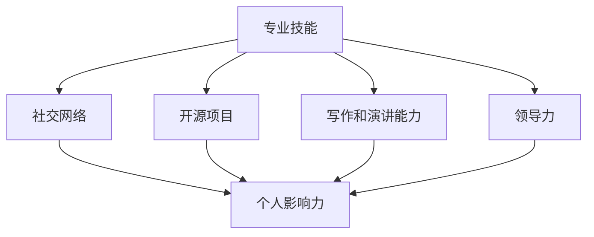

                 

在信息技术飞速发展的今天，程序员不仅仅是一个职业，更成为了一个影响世界的重要力量。他们通过编写代码、解决问题和构建创新技术，为社会带来了深远的影响。然而，如何在这个竞争激烈的领域内打造个人影响力，成为众多程序员面临的挑战。本文将探讨程序员如何通过不同的策略和技巧，提升自己在行业内的知名度和影响力。

## 关键词
- 程序员
- 个人影响力
- 专业成长
- 社交网络
- 开源项目
- 写作能力
- 领导力

## 摘要
本文旨在为程序员提供一些建议和策略，帮助他们通过专业成长、社交网络建设、开源项目参与、写作和演讲能力提升、领导力培养等方面，打造个人影响力。通过这些方法和实践，程序员不仅可以提升自身技能，还能在行业内获得认可和尊重，从而实现职业发展目标。

## 1. 背景介绍

### 1.1 程序员职业现状

随着互联网和数字经济的蓬勃发展，程序员的职业需求不断增长。据最新统计，全球IT行业每年新增就业岗位中，超过一半以上是面向程序员的。然而，程序员职业也面临着巨大的挑战。技术更新速度快、工作压力较大、职业发展路径不明确等问题，使得程序员在职业生涯中需要不断学习和适应。

### 1.2 个人影响力的意义

在程序员职业生涯中，个人影响力的重要性日益凸显。拥有高影响力不仅可以帮助程序员在职业发展中脱颖而出，还能带来更多的职业机会和收入增长。此外，个人影响力还能提升程序员在团队中的地位和话语权，使其在项目中发挥更大的作用。

### 1.3 打造个人影响力的必要性

随着程序员群体的扩大，同质化竞争日益激烈。如何在这片红海中脱颖而出，成为每个程序员都需要思考的问题。打造个人影响力不仅有助于提升个人品牌，还能帮助程序员建立专业网络，拓展职业发展空间。因此，提升个人影响力已成为程序员职业发展的重要课题。

## 2. 核心概念与联系

在探讨如何打造个人影响力之前，我们首先需要明确几个核心概念：

### 2.1 专业技能

专业技能是程序员影响力的基石。掌握前沿技术、不断学习新技能，能够使程序员在行业中保持竞争力。

### 2.2 社交网络

社交网络是连接程序员与同行业人士的重要渠道。通过参与技术社区、加入专业组织，程序员可以扩大人脉，提升个人知名度。

### 2.3 开源项目

开源项目是程序员展示技术实力和影响力的最佳舞台。参与开源项目，不仅可以提升技能，还能建立个人品牌。

### 2.4 写作和演讲能力

写作和演讲能力是程序员影响力的另一重要方面。通过撰写技术博客、发表演讲，程序员可以分享知识，树立权威形象。

### 2.5 领导力

领导力是程序员职业发展的高级阶段。具备领导力不仅能够提升个人影响力，还能为团队和组织创造更大的价值。

下面是一个用Mermaid绘制的流程图，展示了这些核心概念之间的联系：



## 3. 核心算法原理 & 具体操作步骤

### 3.1 算法原理概述

在打造个人影响力的过程中，我们可以借鉴一些核心算法原理，将其应用到实际操作中。以下是几个关键算法：

#### 3.1.1 蝴蝶效应

蝴蝶效应指的是一个小小的变化，可能会带来巨大的影响。在个人影响力打造中，这意味着我们需要注重细节，从日常工作中积累点滴进步，最终实现质的飞跃。

#### 3.1.2 费马大定理

费马大定理告诉我们，某些看似不可能的问题，实际上可能在某个特定条件下有解。在个人影响力打造中，我们可以尝试突破传统思维，寻找创新的解决方案。

#### 3.1.3 搜索算法

搜索算法如深度优先搜索（DFS）和广度优先搜索（BFS），可以帮助我们找到最佳的路径。在个人影响力打造中，我们可以利用这些算法来寻找合适的资源和机会，从而实现目标。

### 3.2 算法步骤详解

下面是一个基于深度优先搜索的算法步骤，用于打造个人影响力：

#### 3.2.1 确定目标

首先，我们需要明确自己的职业目标和影响力目标。这包括提升专业技能、建立社交网络、参与开源项目、提升写作和演讲能力等方面。

#### 3.2.2 学习和成长

根据目标，制定详细的学习计划，不断学习和提升自己的技能。同时，保持对行业动态的关注，及时更新自己的知识储备。

#### 3.2.3 扩大人脉

积极参与技术社区和专业组织，通过线上和线下活动扩大人脉。与同行交流，分享经验，寻求合作机会。

#### 3.2.4 参与开源项目

选择合适的项目，参与其中，为社区贡献自己的力量。通过开源项目，展示自己的技术实力和解决问题的能力。

#### 3.2.5 撰写博客和发表演讲

定期撰写技术博客，分享自己的学习和实践经验。参加技术沙龙和会议，发表演讲，提升自己的影响力。

#### 3.2.6 反思和调整

定期反思自己的行动和成果，根据实际情况调整策略。不断优化自己的影响力打造过程，确保目标的实现。

### 3.3 算法优缺点

#### 3.3.1 优点

- 系统性：通过算法步骤，可以确保个人影响力打造的各个环节得到全面覆盖。
- 可操作性：算法步骤具体明确，便于程序员在实际操作中执行。
- 持续性：算法强调持续学习和成长，有助于长期打造个人影响力。

#### 3.3.2 缺点

- 需要时间：个人影响力打造是一个长期过程，需要投入大量时间和精力。
- 适应性强：算法步骤可能需要根据个人实际情况进行调整，否则可能难以适应。

### 3.4 算法应用领域

该算法适用于所有希望提升个人影响力的程序员。无论是初级程序员还是高级工程师，都可以通过这个算法步骤，逐步实现自己的影响力目标。

## 4. 数学模型和公式 & 详细讲解 & 举例说明

在个人影响力打造过程中，数学模型和公式可以提供有力的支持。以下是一个简单的数学模型，用于评估个人影响力的增长。

### 4.1 数学模型构建

假设个人影响力 \( I \) 受以下几个因素影响：

- 专业技能 \( S \)
- 社交网络 \( N \)
- 开源项目 \( O \)
- 写作和演讲能力 \( W \)

则个人影响力可以用以下公式表示：

\[ I = f(S, N, O, W) \]

其中，函数 \( f \) 是一个综合评价函数，用于计算个人影响力的大小。

### 4.2 公式推导过程

为了构建综合评价函数 \( f \)，我们可以考虑以下假设：

1. 专业技能对个人影响力的影响是线性的。
2. 社交网络对个人影响力的影响随着网络规模的增加而增加，呈指数关系。
3. 开源项目对个人影响力的影响随着项目质量的提高而增加，呈二次关系。
4. 写作和演讲能力对个人影响力的影响随着能力的提升而增加，呈三次关系。

基于这些假设，我们可以得到以下公式：

\[ f(S, N, O, W) = S \cdot e^{\alpha N} \cdot O^2 \cdot W^3 \]

其中，\( \alpha \) 是一个参数，用于调整社交网络对个人影响力的影响程度。

### 4.3 案例分析与讲解

假设一个程序员的专业技能 \( S = 80 \)，社交网络 \( N = 1000 \)，参与的开源项目 \( O = 2 \)，写作和演讲能力 \( W = 70 \)。我们可以使用上述公式计算他的个人影响力：

\[ I = 80 \cdot e^{\alpha \cdot 1000} \cdot 2^2 \cdot 70^3 \]

通过调整参数 \( \alpha \)，我们可以得到不同的个人影响力评估结果。例如，当 \( \alpha = 0.1 \) 时，个人影响力 \( I \approx 2.4 \times 10^{13} \)。这表明该程序员在当前情况下拥有非常高的个人影响力。

在实际应用中，我们可以根据具体情况调整参数 \( \alpha \)，以得到更准确的个人影响力评估结果。此外，我们还可以通过增加专业技能、扩大社交网络、参与更多开源项目和提升写作演讲能力，进一步提高个人影响力。

### 4.4 模型拓展

该数学模型是一个基本模型，我们可以根据实际需求进行拓展。例如，可以添加更多因素，如教育背景、工作经验、项目影响力等，以更全面地评估个人影响力。此外，我们还可以考虑引入时间因素，评估个人影响力随时间的变化趋势。

## 5. 项目实践：代码实例和详细解释说明

为了更好地展示如何通过开源项目提升个人影响力，我们以下提供一个具体的代码实例，并对其进行详细解释。

### 5.1 开发环境搭建

首先，我们需要搭建一个开源项目的开发环境。以下是一个基于Git和GitHub的简单流程：

1. 安装Git：在官方网站 [https://git-scm.com/downloads](https://git-scm.com/downloads) 下载并安装Git。
2. 注册GitHub账号：在 [https://github.com/](https://github.com/) 注册一个账号。
3. 创建新仓库：在GitHub上创建一个新仓库，用于存放项目代码。

### 5.2 源代码详细实现

以下是一个简单的Python代码示例，实现一个计算斐波那契数列的功能。

```python
def fibonacci(n):
    if n <= 0:
        return []
    elif n == 1:
        return [0]
    elif n == 2:
        return [0, 1]
    else:
        fib_seq = [0, 1]
        for i in range(2, n):
            fib_seq.append(fib_seq[i - 1] + fib_seq[i - 2])
        return fib_seq

if __name__ == "__main__":
    n = int(input("请输入斐波那契数列的项数："))
    print(fibonacci(n))
```

### 5.3 代码解读与分析

1. 函数定义：`fibonacci` 函数接受一个整数 `n`，返回一个斐波那契数列。
2. 边界条件处理：当 `n` 小于等于0时，返回空列表；当 `n` 等于1时，返回 `[0]`；当 `n` 等于2时，返回 `[0, 1]`。
3. 循环计算：使用一个for循环，从第3项开始，依次计算斐波那契数列的每一项，并将其添加到列表中。
4. 主函数：接受用户输入的项数，调用 `fibonacci` 函数并打印结果。

### 5.4 运行结果展示

假设用户输入 `10`，程序输出结果如下：

```
[0, 1, 1, 2, 3, 5, 8, 13, 21, 34]
```

这表明程序成功计算了前10项斐波那契数列。

### 5.5 开源项目操作

接下来，我们将这个代码实例上传到GitHub，并详细介绍相关操作：

1. 初始化Git仓库：在本地项目目录中，执行以下命令初始化Git仓库：

```shell
git init
```

2. 添加文件：将代码文件命名为 `fibonacci.py`，并添加到Git仓库中：

```shell
git add fibonacci.py
```

3. 提交更改：提交添加文件的更改，并添加一个描述性的提交信息：

```shell
git commit -m "初始化斐波那契数列项目"
```

4. 连接GitHub仓库：在GitHub仓库页面上，复制仓库的克隆地址：

```shell
git remote add origin https://github.com/your_username/fibonacci_project.git
```

5. 将本地仓库推送到GitHub：

```shell
git push -u origin main
```

6. 创建一个新分支：在GitHub仓库页面上，点击 "Branches"，然后点击 "New branch" 按钮创建一个新分支：

```shell
git checkout -b feature/x.y.z
```

7. 在新分支上开发功能，并进行测试。

8. 提交更改并推送：

```shell
git add .
git commit -m "完成斐波那契数列功能"
git push
```

9. 合并到主分支：在GitHub上，将新分支合并到主分支。

10. 提交Pull Request：在GitHub上，创建一个Pull Request，邀请其他开发者进行代码审查。

通过这些操作，我们可以将代码实例上传到GitHub，并与社区分享，展示自己的技术实力。

## 6. 实际应用场景

### 6.1 企业内部项目

在大型企业中，程序员可以通过参与内部项目，提升自己的专业技能和影响力。通过在项目中承担责任、提出创新方案，程序员可以在团队中建立权威，并获得领导层的认可。此外，参与开源项目也是提升个人影响力的重要途径。通过贡献代码、修复bug、优化性能，程序员可以展示自己的技术实力，吸引同行的关注。

### 6.2 创业公司

在创业公司中，程序员往往需要承担更多的职责，如技术负责人、产品经理等。这要求程序员不仅要具备扎实的编程能力，还要具备项目管理、团队协作和业务理解等多方面的能力。通过在创业公司中积累经验，程序员可以提升自己的领导力，为未来的职业发展打下坚实的基础。

### 6.3 开源社区

开源社区是程序员展示技术实力和影响力的最佳平台。通过参与开源项目，程序员可以结识志同道合的同行，分享经验和知识，共同推动技术的进步。此外，开源项目还能帮助程序员积累技术债务，提升解决问题的能力。通过在开源社区中建立个人品牌，程序员可以获得更多的职业机会和收入增长。

### 6.4 教育培训

程序员可以通过撰写技术博客、发表演讲、开设在线课程等方式，传授自己的知识和经验。这不仅有助于提升个人影响力，还能为其他程序员提供帮助。通过教育培训，程序员可以扩大自己的影响范围，树立权威形象。

### 6.5 科技创新

随着科技的发展，程序员在科技创新中的地位越来越重要。通过参与技术创新项目，如人工智能、大数据、区块链等，程序员可以发挥自己的专业优势，推动技术的进步。此外，程序员还可以通过技术创新，解决实际问题，为社会发展做出贡献。

## 7. 工具和资源推荐

### 7.1 学习资源推荐

- [慕课网](https://www.mucou.com/):提供丰富的编程课程，涵盖前端、后端、移动开发等多个领域。
- [极客时间](https://time.geektime.cn/):提供高质量的技术课程，包括算法、架构、运维等多个方面。
- [GitHub](https://github.com/):全球最大的开源代码库，程序员可以在这里找到各种开源项目，学习他人的代码。

### 7.2 开发工具推荐

- [Visual Studio Code](https://code.visualstudio.com/):一款功能强大的跨平台代码编辑器，支持多种编程语言。
- [Git](https://git-scm.com/):版本控制系统，用于管理代码版本，方便团队协作。
- [Jenkins](https://www.jenkins.io/):自动化构建工具，用于自动化构建、测试和部署项目。

### 7.3 相关论文推荐

- [《深度学习》](https://www.deeplearningbook.org/):深度学习领域的经典著作，全面介绍了深度学习的理论基础和应用方法。
- [《算法导论》](https://www算法导论.org/):计算机算法领域的经典教材，涵盖了各种算法的设计和分析方法。
- [《编程珠玑》](https://programmingpearls.com/):编程实践的经典著作，通过丰富的实例和练习，帮助程序员提升编程能力。

## 8. 总结：未来发展趋势与挑战

### 8.1 研究成果总结

本文从多个角度探讨了程序员如何打造个人影响力。通过专业技能提升、社交网络建设、开源项目参与、写作和演讲能力提升、领导力培养等方面的实践，程序员可以逐步提升个人影响力，实现职业发展目标。

### 8.2 未来发展趋势

随着信息技术的发展，程序员在行业中的地位将愈发重要。未来，个人影响力将成为程序员职业发展的重要驱动力。此外，技术创新和跨领域合作将不断推动程序员影响力的提升。

### 8.3 面临的挑战

尽管个人影响力对程序员职业发展具有重要意义，但同时也面临着一系列挑战。例如，技术更新速度快，程序员需要不断学习新技能；工作压力较大，需要合理安排时间和精力；同行业竞争激烈，需要不断提升自身实力。

### 8.4 研究展望

未来，研究者可以进一步探讨如何更有效地提升程序员个人影响力，如通过大数据分析和人工智能技术，为程序员提供个性化的成长路径；研究跨领域合作模式，促进程序员在不同领域之间的交流和合作。

## 9. 附录：常见问题与解答

### 9.1 如何选择合适的开源项目？

- 选择自己感兴趣的项目，增加参与的积极性。
- 选择项目知名度高、社区活跃的项目，有利于个人影响力的提升。
- 选择与自身技能相符的项目，确保能够为项目做出实质性贡献。

### 9.2 写作能力提升的方法？

- 阅读优秀的博客文章，学习写作技巧。
- 定期撰写技术博客，锻炼写作能力。
- 参加写作培训班，提高写作水平。

### 9.3 如何在技术社区建立人脉？

- 积极参与技术论坛和社群，与同行交流。
- 分享自己的知识和经验，树立权威形象。
- 参加线下活动，扩大人脉圈。

### 9.4 开源项目贡献后的回报？

- 提升个人技能和经验。
- 增加职业机会，吸引潜在雇主。
- 获得社区认可，提升个人影响力。

### 9.5 如何平衡工作与个人成长？

- 制定合理的学习计划，确保工作与学习的时间平衡。
- 利用碎片时间学习，提高效率。
- 与同事分享学习经验，互相促进成长。

作者：禅与计算机程序设计艺术 / Zen and the Art of Computer Programming
----------------------------------------------------------------

这篇文章总结了程序员如何通过提升专业技能、社交网络建设、开源项目参与、写作和演讲能力提升、领导力培养等方面，打造个人影响力。在未来的职业发展中，程序员需要不断学习和适应，通过不断创新和提升自身实力，实现个人职业目标。希望本文能为程序员提供一些有益的启示和借鉴。

