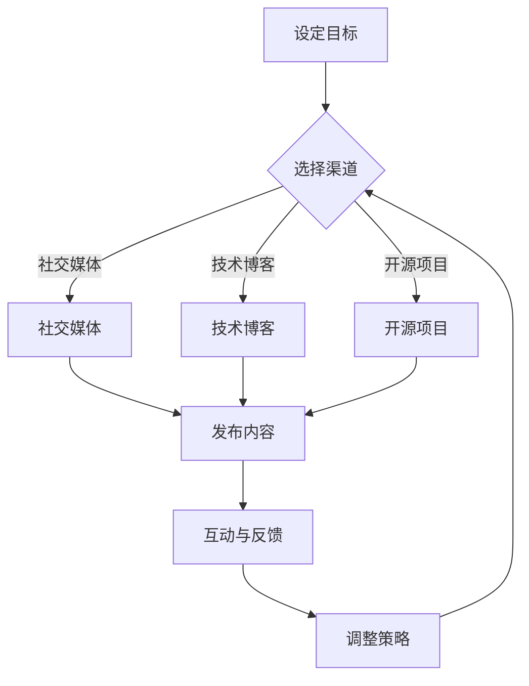

                 

关键词：个人影响力、程序员、影响力生态、技术博客、职业发展

摘要：在当今这个技术驱动的时代，程序员如何打造自己的个人影响力已成为一个不容忽视的问题。本文将深入探讨程序员如何通过技术博客、社交媒体、开源项目等多种途径，构建自己的影响力生态，实现职业发展和个人价值的提升。

## 1. 背景介绍

随着互联网的快速发展，信息技术已成为推动社会进步的重要力量。作为信息技术领域的中坚力量，程序员的角色越来越受到重视。然而，随着市场竞争的加剧，程序员们不仅需要具备扎实的技术能力，还需要具备强大的个人影响力，才能在职场中脱颖而出。打造个人影响力生态，不仅有助于程序员在职业生涯中取得成功，还能为他们带来更多的发展机遇。

### 1.1 个人影响力的重要性

个人影响力是指在某一领域内，个人所拥有的知识和经验，以及通过这些知识和经验对他人产生的影响能力。在程序员领域，个人影响力的重要性主要体现在以下几个方面：

- **提升职业竞争力**：具有影响力的程序员更容易获得更好的工作机会和更高的薪酬待遇。
- **建立人脉网络**：通过个人影响力，程序员可以结识更多的同行和业内人士，拓宽人脉网络。
- **引领行业趋势**：拥有一定影响力的程序员能够引导行业的发展方向，推动技术进步。

### 1.2 程序员的影响力生态

程序员的影响力生态是指通过一系列的渠道和手段，将个人的技术能力、知识和经验传播出去，从而建立起自己的影响力。这些渠道和手段包括技术博客、社交媒体、开源项目等。一个成功的程序员影响力生态需要具备以下几个特点：

- **多样化**：影响力生态应该涵盖多个方面，如技术分享、项目管理、团队协作等。
- **互动性**：影响力生态应该具备良好的互动机制，让读者和程序员之间能够进行有效的交流和沟通。
- **专业性**：影响力生态应该具备高度的专业性，确保内容的准确性和权威性。

## 2. 核心概念与联系

为了更好地理解程序员如何打造个人影响力生态，我们首先需要了解几个核心概念，包括影响力、个人品牌、社交媒体等。

### 2.1 影响力

影响力是指一个人或组织在某一领域内所拥有的影响力和号召力。在程序员领域，影响力主要体现在以下几个方面：

- **技术实力**：拥有深厚技术实力的程序员更容易获得他人的认可和信任。
- **专业知识**：具备专业知识的程序员能够为他人提供有价值的信息和见解。
- **实践经验**：丰富的实践经验能够帮助程序员更好地解决实际问题。

### 2.2 个人品牌

个人品牌是指个人在某一领域内所建立的形象和声誉。在程序员领域，个人品牌的重要性不言而喻。一个成功的个人品牌应该具备以下几个特点：

- **独特性**：个人品牌应该具备独特的风格和特点，以便在众多竞争者中脱颖而出。
- **专业性**：个人品牌应该具备高度的专业性，确保内容的准确性和权威性。
- **一致性**：个人品牌在各个渠道和场合应该保持一致性，以增强品牌影响力。

### 2.3 社交媒体

社交媒体是程序员打造个人影响力的重要渠道。通过社交媒体，程序员可以与读者、同行和业内人士进行有效的交流和互动。以下是几个常用的社交媒体平台：

- **微博**：微博是一个非常适合程序员分享技术心得和知识的平台。
- **知乎**：知乎是一个专注于知识分享的社交平台，程序员可以在知乎上解答问题、分享经验。
- **GitHub**：GitHub是一个面向开源项目的平台，程序员可以通过GitHub展示自己的项目成果。

### 2.4 Mermaid 流程图

以下是程序员打造个人影响力生态的 Mermaid 流程图：



## 3. 核心算法原理 & 具体操作步骤

### 3.1 算法原理概述

程序员打造个人影响力生态的核心算法原理可以概括为以下几点：

- **内容创作**：通过高质量的内容创作，展示自己的专业知识和技术实力。
- **渠道选择**：根据个人特点和目标，选择合适的渠道进行内容传播。
- **互动与反馈**：与读者和同行进行有效的交流和互动，获取反馈并不断调整策略。

### 3.2 算法步骤详解

以下是程序员打造个人影响力生态的具体操作步骤：

#### 3.2.1 设定目标

在开始打造个人影响力之前，程序员需要明确自己的目标。这些目标可能包括：

- **提升技术能力**：通过学习新技术和解决问题，提升自己的技术能力。
- **扩大人脉网络**：通过社交媒体和开源项目，结识更多的同行和业内人士。
- **提升职业竞争力**：通过技术分享和项目管理，提升自己在职场中的竞争力。

#### 3.2.2 选择渠道

根据个人目标和特点，程序员可以选择以下几种渠道：

- **社交媒体**：如微博、知乎等，用于分享技术心得和知识。
- **技术博客**：如博客园、CSDN 等，用于撰写技术文章和博客。
- **开源项目**：如 GitHub 等，用于展示自己的项目成果和技术实力。

#### 3.2.3 发布内容

在选择了合适的渠道后，程序员需要定期发布高质量的内容。这些内容可以包括：

- **技术文章**：分享自己在技术领域的研究和心得。
- **博客**：记录自己在编程过程中的经验和技巧。
- **项目成果**：展示自己的开源项目，并分享项目开发过程。

#### 3.2.4 互动与反馈

在发布内容后，程序员需要与读者和同行进行互动，获取反馈并不断调整策略。以下是一些建议：

- **回答问题**：在社交媒体和问答平台上回答读者的问题。
- **参与讨论**：在技术论坛和社群中参与讨论，分享自己的见解。
- **反馈收集**：定期收集读者和同行的反馈，了解自己的优势和不足。

#### 3.2.5 调整策略

根据互动与反馈的结果，程序员需要不断调整自己的策略。以下是一些建议：

- **优化内容**：根据读者的反馈，优化自己的内容创作。
- **拓展渠道**：根据目标，选择合适的渠道进行内容传播。
- **提高互动**：增加与读者和同行的互动，提升影响力。

### 3.3 算法优缺点

#### 优点

- **提高技术能力**：通过创作高质量的内容，程序员可以不断提升自己的技术能力。
- **扩大人脉网络**：通过互动和参与讨论，程序员可以结识更多的同行和业内人士。
- **提升职业竞争力**：通过技术分享和项目管理，程序员可以提升自己的职业竞争力。

#### 缺点

- **时间成本**：打造个人影响力生态需要投入大量的时间和精力。
- **内容创作难度**：高质量的内容创作需要较高的写作技巧和专业知识。
- **效果评估难度**：个人影响力生态的打造效果难以短期内评估。

### 3.4 算法应用领域

程序员打造个人影响力生态的算法可以应用于以下领域：

- **技术领域**：程序员可以通过技术博客和社交媒体分享技术心得，提升自己的技术影响力。
- **教育领域**：程序员可以通过技术博客和教育项目，为学习者提供有价值的技术知识。
- **职业发展**：程序员可以通过个人影响力生态，提升自己的职业竞争力和薪酬待遇。

## 4. 数学模型和公式 & 详细讲解 & 举例说明

### 4.1 数学模型构建

在程序员打造个人影响力生态的过程中，我们可以构建以下数学模型来分析其影响力增长情况：

\[ I(t) = f(C(t), H(t), R(t)) \]

其中：

- \( I(t) \)：时间 \( t \) 时程序员的个人影响力。
- \( C(t) \)：时间 \( t \) 时程序员发布的内容数量和质量。
- \( H(t) \)：时间 \( t \) 时程序员在渠道上的活跃度。
- \( R(t) \)：时间 \( t \) 时程序员的互动与反馈情况。

### 4.2 公式推导过程

#### 4.2.1 内容质量 \( C(t) \)

内容质量 \( C(t) \) 可以通过以下公式计算：

\[ C(t) = \sum_{i=1}^{n} w_i \cdot q_i \]

其中：

- \( n \)：程序员发布的内容数量。
- \( w_i \)：第 \( i \) 个内容的权重，根据内容的受欢迎程度和影响力进行打分。
- \( q_i \)：第 \( i \) 个内容的质量，根据内容的原创性、实用性和专业性进行打分。

#### 4.2.2 渠道活跃度 \( H(t) \)

渠道活跃度 \( H(t) \) 可以通过以下公式计算：

\[ H(t) = \sum_{j=1}^{m} h_j \cdot v_j \]

其中：

- \( m \)：程序员选择的渠道数量。
- \( h_j \)：第 \( j \) 个渠道的活跃度，根据渠道的访问量、评论数和转发数进行打分。
- \( v_j \)：第 \( j \) 个渠道的权重，根据渠道的目标群体和受众影响力进行打分。

#### 4.2.3 互动与反馈 \( R(t) \)

互动与反馈 \( R(t) \) 可以通过以下公式计算：

\[ R(t) = \sum_{k=1}^{p} r_k \cdot s_k \]

其中：

- \( p \)：程序员接收到的互动与反馈数量。
- \( r_k \)：第 \( k \) 个互动与反馈的权重，根据互动的质量和影响力进行打分。
- \( s_k \)：第 \( k \) 个互动与反馈的评分，根据互动的内容和反馈进行打分。

### 4.3 案例分析与讲解

#### 案例背景

假设程序员小明在技术博客上发布了一篇关于深度学习技术的文章，并在知乎上参与了多个技术讨论。他在两个平台上都得到了积极的反馈和互动。以下是具体数据：

- **内容质量**：小明发布的文章质量评分 \( q = 8.5 \)，文章数量 \( n = 1 \)。
- **渠道活跃度**：小明在技术博客上的活跃度评分 \( h_1 = 7.0 \)，在知乎上的活跃度评分 \( h_2 = 6.5 \)，平台权重 \( v_1 = 0.5 \)，\( v_2 = 0.5 \)。
- **互动与反馈**：小明收到了 10 条互动与反馈，其中 5 条来自技术博客，5 条来自知乎。互动质量评分 \( r = 7.5 \)，互动评分 \( s = 7.0 \)。

#### 数据计算

根据以上数据，我们可以计算小明的个人影响力：

\[ C(t) = 1 \cdot 8.5 = 8.5 \]
\[ H(t) = 0.5 \cdot 7.0 + 0.5 \cdot 6.5 = 6.5 \]
\[ R(t) = 10 \cdot 7.5 = 75.0 \]
\[ I(t) = f(8.5, 6.5, 75.0) \]

假设 \( f \) 函数为线性函数，即 \( I(t) = C(t) \cdot H(t) \cdot R(t) \)，则：

\[ I(t) = 8.5 \cdot 6.5 \cdot 75.0 = 4287.5 \]

因此，小明在时间 \( t \) 时的个人影响力为 4287.5。

## 5. 项目实践：代码实例和详细解释说明

### 5.1 开发环境搭建

为了演示程序员如何通过技术博客和开源项目打造个人影响力生态，我们将使用 Python 编写一个简单的博客系统。以下是开发环境搭建的步骤：

1. 安装 Python 3.8 或更高版本。
2. 安装 Flask 框架：`pip install flask`。
3. 安装 SQLite3：`pip install pysqlite3`。

### 5.2 源代码详细实现

以下是博客系统的源代码实现：

```python
# app.py

from flask import Flask, render_template, request, redirect, url_for
import sqlite3

app = Flask(__name__)

def init_db():
    conn = sqlite3.connect('blog.db')
    c = conn.cursor()
    c.execute('''CREATE TABLE IF NOT EXISTS posts (id INTEGER PRIMARY KEY, title TEXT, content TEXT)''')
    conn.commit()
    conn.close()

@app.route('/')
def index():
    conn = sqlite3.connect('blog.db')
    c = conn.cursor()
    c.execute("SELECT * FROM posts")
    posts = c.fetchall()
    conn.close()
    return render_template('index.html', posts=posts)

@app.route('/post/new', methods=['GET', 'POST'])
def new_post():
    if request.method == 'POST':
        title = request.form['title']
        content = request.form['content']
        conn = sqlite3.connect('blog.db')
        c = conn.cursor()
        c.execute("INSERT INTO posts (title, content) VALUES (?, ?)", (title, content))
        conn.commit()
        conn.close()
        return redirect(url_for('index'))
    return render_template('new_post.html')

if __name__ == '__main__':
    init_db()
    app.run(debug=True)
```

### 5.3 代码解读与分析

以上代码实现了一个简单的博客系统，包括以下功能：

- **数据库初始化**：使用 SQLite3 初始化数据库，创建 posts 表。
- **首页展示**：展示所有博客文章。
- **创建新文章**：用户可以提交新文章，包括标题和内容。

### 5.4 运行结果展示

运行以上代码后，我们可以通过浏览器访问博客系统，展示效果如下：

- **首页**：展示所有博客文章。


- **创建新文章**：用户可以输入标题和内容，提交新文章。


## 6. 实际应用场景

### 6.1 技术博客

程序员可以通过技术博客分享自己的技术心得和知识，帮助他人解决问题，同时提升自己的技术影响力。例如，Python 技术博客 “Python China” 就是一个成功的案例，它吸引了大量程序员关注和参与。

### 6.2 社交媒体

程序员可以在社交媒体上分享自己的技术见解和项目进展，与同行和业内人士进行互动。例如，GitHub 就是程序员展示项目成果、参与开源项目的重要平台。

### 6.3 开源项目

程序员可以通过开源项目展示自己的技术实力，吸引更多关注和支持。例如，TensorFlow 和 PyTorch 都是知名的深度学习开源项目，它们吸引了大量程序员参与贡献。

## 7. 工具和资源推荐

### 7.1 学习资源推荐

- **《代码大全》**：作者史蒂夫·麦库姆，全面介绍了编写高质量代码的最佳实践。
- **《Effective Python》**：作者布莱恩·奥克，详细介绍了 Python 编程的最佳实践。

### 7.2 开发工具推荐

- **PyCharm**：一款功能强大的 Python 集成开发环境。
- **GitHub**：一个面向开源项目的平台，方便程序员展示项目成果。

### 7.3 相关论文推荐

- **《深度学习》**：作者伊恩·古德费洛等，介绍了深度学习的基础知识和技术应用。
- **《强化学习》**：作者理查德·萨顿等，介绍了强化学习的基础知识和技术应用。

## 8. 总结：未来发展趋势与挑战

### 8.1 研究成果总结

本文通过深入分析程序员如何打造个人影响力生态，总结了以下几点研究成果：

- **个人影响力的重要性**：个人影响力在程序员职业发展中具有重要地位。
- **影响力生态的构建**：程序员可以通过多种渠道和手段构建自己的影响力生态。
- **算法原理与应用**：本文提出了一套基于数学模型的算法原理，为程序员打造个人影响力提供了理论指导。

### 8.2 未来发展趋势

- **技术化**：随着人工智能和大数据技术的发展，程序员的影响力生态将更加技术化。
- **专业化**：程序员的影响力生态将更加专业化，不同领域的程序员将形成各自的专业圈子。
- **社区化**：程序员的影响力生态将更加社区化，通过线上线下活动，增强程序员之间的互动和交流。

### 8.3 面临的挑战

- **内容创作难度**：高质量的内容创作对程序员的写作能力和专业知识提出了更高要求。
- **时间成本**：构建个人影响力生态需要投入大量的时间和精力。
- **市场饱和**：随着越来越多程序员加入影响力生态，市场竞争将更加激烈。

### 8.4 研究展望

未来的研究可以从以下几个方面展开：

- **算法优化**：进一步优化个人影响力生态的构建算法，提高其效率和效果。
- **案例分析**：通过分析成功案例，总结出更具操作性的经验和方法。
- **教育培训**：针对程序员的影响力生态构建，开展相应的教育培训，提高程序员的综合素质。

## 9. 附录：常见问题与解答

### 9.1 什么是个人影响力？

个人影响力是指一个人在某一领域内所拥有的影响力和号召力，通常体现在专业知识、实践经验、人际关系等方面。

### 9.2 程序员如何提升个人影响力？

程序员可以通过以下途径提升个人影响力：

- **高质量的内容创作**：通过技术博客、社交媒体等渠道分享专业知识和经验。
- **参与开源项目**：展示技术实力，吸引更多关注和支持。
- **积极参与社区活动**：增强与同行的互动和交流，扩大人脉网络。

### 9.3 如何评估个人影响力的大小？

个人影响力的大小可以从以下几个方面进行评估：

- **内容传播效果**：如阅读量、点赞数、评论数等。
- **同行认可度**：如受邀参加技术会议、担任技术顾问等。
- **职业发展**：如获得更好的工作机会、晋升等。

### 9.4 个人影响力生态的构建需要多长时间？

个人影响力生态的构建时间因人而异，一般需要几个月到几年的积累。关键在于持续的创作、互动和优化。通过不断努力，程序员可以逐步建立起自己的影响力生态。

## 作者署名

作者：禅与计算机程序设计艺术 / Zen and the Art of Computer Programming
----------------------------------------------------------------


