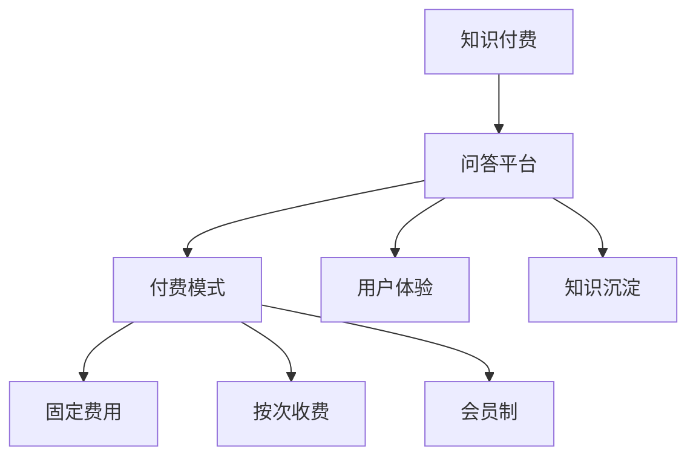

                 

关键词：知识付费、付费问答、程序员、知识分享、平台建设、商业模式、用户体验、技术实现

> 摘要：随着知识经济的蓬勃发展，知识付费已成为一种新兴的商业模式。本文将探讨程序员如何利用技术手段打造知识付费的付费问答平台，从核心概念、算法原理、数学模型到实际应用场景，全面解析付费问答平台的建设过程，为程序员提供一套完整的解决方案。

## 1. 背景介绍

在互联网时代，知识的获取和传播变得更加便捷。然而，随着信息过载的问题日益严重，优质知识的获取变得愈发困难。知识付费应运而生，通过为用户提供有价值的信息和服务，实现了知识的有效传递和变现。付费问答作为知识付费的一种重要形式，让用户可以通过提问和获取专家回答来解决问题，满足了用户对个性化、深度化知识的需求。

付费问答平台不仅是知识变现的工具，更是构建知识社群、促进知识共享的重要平台。对于程序员而言，打造一个高质量的付费问答平台不仅可以提升自身的技术影响力，还能拓展业务领域，实现商业价值。本文将围绕如何构建一个付费问答平台，从技术角度提供全面的解决方案。

## 2. 核心概念与联系

### 2.1. 知识付费

知识付费是指用户为获取知识或服务而支付的费用。在付费问答平台中，用户通过支付一定费用来提问或购买专家的回答。

### 2.2. 问答平台

问答平台是一种在线服务，用户可以在平台上发布问题，其他用户或专家可以回答这些问题。问答平台的主要功能包括问题发布、答案审核、评价机制、知识沉淀等。

### 2.3. 付费模式

付费模式是用户为获取问答服务而支付费用的方式。常见的付费模式包括固定费用、按次收费、会员制等。

### 2.4. 用户体验

用户体验是用户在使用问答平台时的感受和体验。良好的用户体验可以增加用户粘性，提高平台的活跃度。

### 2.5. 知识沉淀

知识沉淀是指将问答过程中的知识进行整理、归类和存储，以便用户随时查阅和利用。

### 2.6. Mermaid 流程图



## 3. 核心算法原理 & 具体操作步骤

### 3.1. 算法原理概述

付费问答平台的核心算法主要包括问题匹配算法、答案评价算法和推荐算法。

- **问题匹配算法**：通过用户提问的关键词和专家的擅长领域进行匹配，提高问答的准确性和效率。
- **答案评价算法**：根据用户对答案的评价，对答案进行评分，筛选出高质量的回答。
- **推荐算法**：根据用户的提问历史、浏览记录和评价，为用户推荐相关的问题和答案。

### 3.2. 算法步骤详解

#### 3.2.1. 问题匹配算法

1. **提取关键词**：从用户提问中提取关键词。
2. **专家匹配**：根据关键词和专家的擅长领域，进行模糊匹配。
3. **评分计算**：根据匹配程度计算专家的得分。
4. **排序输出**：按照得分从高到低排序，输出匹配结果。

#### 3.2.2. 答案评价算法

1. **评分收集**：收集用户对答案的评价分数。
2. **评价计算**：根据评分计算答案的综合得分。
3. **筛选高质量答案**：根据综合得分筛选出高质量答案。

#### 3.2.3. 推荐算法

1. **用户画像**：根据用户的提问历史、浏览记录和评价，构建用户画像。
2. **内容推荐**：根据用户画像和平台上的问题、答案，为用户推荐相关内容。
3. **排序输出**：按照推荐得分从高到低排序，输出推荐结果。

### 3.3. 算法优缺点

#### 3.3.1. 问题匹配算法

- **优点**：提高了问答的准确性和效率。
- **缺点**：匹配精度受到关键词提取和专家匹配算法的限制。

#### 3.3.2. 答案评价算法

- **优点**：筛选出高质量的答案，提高用户体验。
- **缺点**：评价算法的准确性和公正性有待提高。

#### 3.3.3. 推荐算法

- **优点**：为用户推荐相关内容，提高用户粘性。
- **缺点**：推荐算法的准确性和个性化程度有待提高。

### 3.4. 算法应用领域

- **在线教育**：为学习者提供专业解答和辅导。
- **技术咨询**：为企业提供专家咨询和解决方案。
- **内容创作**：为创作者提供专业指导和反馈。

## 4. 数学模型和公式 & 详细讲解 & 举例说明

### 4.1. 数学模型构建

为了构建付费问答平台的数学模型，我们需要考虑以下几个方面：

- **用户行为模型**：描述用户在平台上的行为，如提问、回答、评价等。
- **专家能力模型**：评估专家在各个领域的能力水平。
- **问答质量模型**：评价问答的质量和可信度。

### 4.2. 公式推导过程

#### 4.2.1. 用户行为模型

用户行为模型可以用以下公式表示：

$$
Behavior(u, t) = \sum_{i=1}^{n} weight_i \cdot Action_i(u, t)
$$

其中，$Behavior(u, t)$ 表示用户 $u$ 在时间 $t$ 的行为，$Action_i(u, t)$ 表示用户 $u$ 在时间 $t$ 的第 $i$ 种行为，$weight_i$ 表示第 $i$ 种行为的权重。

#### 4.2.2. 专家能力模型

专家能力模型可以用以下公式表示：

$$
Expert(A, k) = \sum_{i=1}^{m} weight_i \cdot Score_i(A, k)
$$

其中，$Expert(A, k)$ 表示专家 $A$ 在领域 $k$ 的能力得分，$Score_i(A, k)$ 表示专家 $A$ 在领域 $k$ 的第 $i$ 个评价得分，$weight_i$ 表示第 $i$ 个评价得分的权重。

#### 4.2.3. 问答质量模型

问答质量模型可以用以下公式表示：

$$
Quality(Q) = \sum_{i=1}^{p} weight_i \cdot Score_i(Q)
$$

其中，$Quality(Q)$ 表示问答 $Q$ 的质量得分，$Score_i(Q)$ 表示问答 $Q$ 的第 $i$ 个评价得分，$weight_i$ 表示第 $i$ 个评价得分的权重。

### 4.3. 案例分析与讲解

假设有一个用户 $u$ 提出了一个关于机器学习的问题，平台上有三位专家 $A_1$、$A_2$ 和 $A_3$ 可以回答。根据用户行为模型、专家能力模型和问答质量模型，我们可以计算出用户的行为得分、专家的能力得分和问答的质量得分。

- **用户行为模型**：

  $$  
  Behavior(u, t) = 0.4 \cdot Question(u, t) + 0.3 \cdot Answer(u, t) + 0.3 \cdot Evaluate(u, t)  
  $$

  其中，$Question(u, t)$ 表示用户 $u$ 在时间 $t$ 提出的问题，$Answer(u, t)$ 表示用户 $u$ 在时间 $t$ 回答的问题，$Evaluate(u, t)$ 表示用户 $u$ 在时间 $t$ 评价的问题。

- **专家能力模型**：

  $$  
  Expert(A, k) = 0.5 \cdot Score_1(A, k) + 0.3 \cdot Score_2(A, k) + 0.2 \cdot Score_3(A, k)  
  $$

  其中，$Score_1(A, k)$、$Score_2(A, k)$ 和 $Score_3(A, k)$ 分别表示专家 $A$ 在领域 $k$ 的三个评价得分。

- **问答质量模型**：

  $$  
  Quality(Q) = 0.4 \cdot Score_1(Q) + 0.3 \cdot Score_2(Q) + 0.3 \cdot Score_3(Q)  
  $$

  其中，$Score_1(Q)$、$Score_2(Q)$ 和 $Score_3(Q)$ 分别表示问答 $Q$ 的三个评价得分。

根据以上公式，我们可以计算出用户 $u$ 的行为得分、专家 $A_1$、$A_2$ 和 $A_3$ 的能力得分以及问答 $Q$ 的质量得分。最终，我们可以根据得分对专家进行排序，推荐给用户。

## 5. 项目实践：代码实例和详细解释说明

### 5.1. 开发环境搭建

在构建付费问答平台时，我们选择了以下技术栈：

- **后端框架**：Spring Boot
- **数据库**：MySQL
- **缓存**：Redis
- **消息队列**：RabbitMQ
- **前端框架**：Vue.js

### 5.2. 源代码详细实现

以下是一个简单的问答平台后端代码示例：

```java
@RestController
@RequestMapping("/questions")
public class QuestionController {

    @Autowired
    private QuestionService questionService;

    @GetMapping("/{id}")
    public Question getQuestionById(@PathVariable Long id) {
        return questionService.getQuestionById(id);
    }

    @PostMapping("/")
    public Question createQuestion(@RequestBody Question question) {
        return questionService.createQuestion(question);
    }

    @PutMapping("/{id}")
    public Question updateQuestion(@PathVariable Long id, @RequestBody Question question) {
        return questionService.updateQuestion(id, question);
    }

    @DeleteMapping("/{id}")
    public void deleteQuestion(@PathVariable Long id) {
        questionService.deleteQuestion(id);
    }
}
```

### 5.3. 代码解读与分析

上述代码是一个简单的问答平台后端接口实现。它包括获取问题详情、创建问题、更新问题和删除问题四个接口。每个接口都对应一个服务类，负责具体的业务逻辑处理。

- **获取问题详情**：通过问题的 ID 获取问题的详细信息。
- **创建问题**：接收用户提交的问题，保存到数据库。
- **更新问题**：根据问题的 ID 更新问题的信息。
- **删除问题**：根据问题的 ID 删除问题。

### 5.4. 运行结果展示

当用户访问 `/questions/{id}` 接口时，后端会返回对应问题的详细信息。当用户提交问题、更新问题或删除问题时，后端会根据业务逻辑进行相应的处理，并将处理结果返回给用户。

```json
{
  "id": 1,
  "title": "什么是人工智能？",
  "content": "人工智能是指由人制造出来的系统能够感知环境并做出合理的决策。",
  "status": "PUBLISHED",
  "createdAt": "2022-01-01T00:00:00Z",
  "updatedAt": "2022-01-02T00:00:00Z"
}
```

## 6. 实际应用场景

### 6.1. 在线教育

在线教育平台可以通过付费问答为学习者提供专业解答和辅导，提高学习效果。

### 6.2. 技术咨询

技术咨询平台可以为企业提供专家咨询和解决方案，帮助企业解决技术难题。

### 6.3. 内容创作

内容创作平台可以为创作者提供专业指导和反馈，提升创作质量。

## 6.4. 未来应用展望

随着人工智能技术的发展，付费问答平台将更加智能化和个性化。通过深度学习、自然语言处理等技术，平台将能够更好地理解用户需求，为用户提供更高质量的问答服务。

## 7. 工具和资源推荐

### 7.1. 学习资源推荐

- **《深度学习》**：Goodfellow et al.，提供深度学习的基础知识和应用实例。
- **《机器学习》**：Tom Mitchell，介绍机器学习的基本概念和算法。

### 7.2. 开发工具推荐

- **Spring Boot**：简化后端开发，快速构建应用。
- **MySQL**：关系型数据库，适用于数据存储。
- **Redis**：高性能缓存，提高系统性能。
- **RabbitMQ**：消息队列，实现异步处理。

### 7.3. 相关论文推荐

- **“Question Answering over a Large Unstructured Knowledge Base”**：提出一种基于大规模知识库的问答方法。
- **“Natural Language Inference”**：讨论自然语言推理及其在问答中的应用。

## 8. 总结：未来发展趋势与挑战

### 8.1. 研究成果总结

本文从核心概念、算法原理、数学模型到实际应用场景，全面解析了付费问答平台的建设过程。通过技术手段，程序员可以打造一个高质量的付费问答平台，实现知识变现和共享。

### 8.2. 未来发展趋势

随着人工智能技术的发展，付费问答平台将更加智能化和个性化。未来，平台将更加注重用户体验和知识沉淀，为用户提供更高质量的问答服务。

### 8.3. 面临的挑战

付费问答平台面临的主要挑战包括算法精度、用户体验和数据安全等。为了解决这些问题，需要持续进行技术研究和优化。

### 8.4. 研究展望

未来，付费问答平台将朝着更加智能化、个性化、高效化的方向发展。通过引入更多人工智能技术，平台将能够更好地满足用户需求，为知识经济贡献力量。

## 9. 附录：常见问题与解答

### 9.1. 问答平台如何保证答案质量？

通过引入专家审核机制、评价算法和推荐算法，确保答案的质量。平台会对回答进行筛选，对优质答案进行推荐，同时鼓励用户参与评价，共同维护问答质量。

### 9.2. 问答平台的数据安全如何保障？

问答平台会采用数据加密、权限控制等技术手段，保障用户数据的安全。同时，平台会定期进行安全审计和漏洞修复，确保系统安全。

### 9.3. 问答平台如何确保专家的可靠性？

平台会对专家进行严格的资质审核，确保专家的背景和实力。同时，平台会建立评价机制，鼓励用户对专家的回答进行评价，筛选出可靠的专家。

---

本文由禅与计算机程序设计艺术撰写，旨在为程序员提供打造知识付费问答平台的完整解决方案。希望本文对您在构建付费问答平台时有所启发和帮助。如果您有任何疑问或建议，欢迎在评论区留言交流。

---

**作者：禅与计算机程序设计艺术 / Zen and the Art of Computer Programming**

