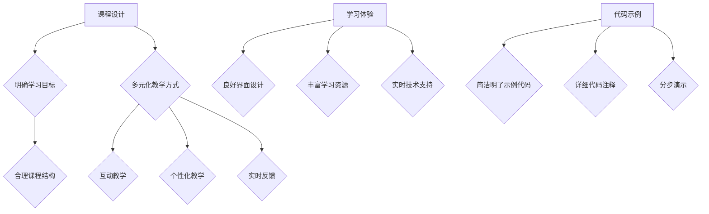

                 

关键词：在线编程课程、课程设计、教学技巧、学习体验、代码示例

> 摘要：本文旨在为程序员提供一套系统化的方法，帮助他们在设计并开发高质量的在线编程课程。我们将探讨课程结构、内容规划、互动教学、代码示例应用、以及持续改进的重要性。

## 1. 背景介绍

随着互联网技术的飞速发展，在线教育和编程学习逐渐成为主流。越来越多的程序员开始通过在线平台分享自己的知识和经验，打造属于自己的编程课程。然而，如何确保这些课程的高质量，使学习者能够真正受益，仍然是一个值得探讨的问题。

本文将基于我的经验和研究，提出一系列构建高质量在线编程课程的方法和策略。这些策略包括但不限于课程设计、教学技巧、学习体验的优化，以及代码示例的应用。希望通过本文，能够为广大的编程教育者提供一些有价值的参考。

## 2. 核心概念与联系

### 课程设计

课程设计是构建高质量在线编程课程的第一步。它不仅决定了课程的结构和内容，还直接影响学习者的学习体验。一个优秀的课程设计应该具备以下特点：

- **明确的学习目标**：课程应该有明确的学习目标和预期的学习成果。
- **合理的课程结构**：课程内容应该按照逻辑顺序组织，使学生能够逐步掌握知识。
- **多元化的教学方式**：结合理论讲解、实践操作、案例分析和互动讨论，提高学生的学习兴趣和参与度。

### 教学技巧

教学技巧是实现课程目标的关键。以下是一些有助于提高教学效果的方法：

- **互动教学**：通过提问、讨论和实时互动，激发学生的学习兴趣，提高参与度。
- **个性化教学**：根据学习者的不同需求和能力，提供个性化的学习建议和辅导。
- **实时反馈**：及时给予学生反馈，帮助他们纠正错误，巩固知识。

### 学习体验

学习体验是影响学习者满意度和学习效果的重要因素。以下是一些优化学习体验的策略：

- **良好的界面设计**：简洁直观的界面设计可以提高学习者的操作效率和体验。
- **丰富的学习资源**：提供多样化的学习资源，如视频、文档、代码库等，以满足不同学习者的需求。
- **实时技术支持**：提供及时的技术支持，解决学习者在学习过程中遇到的问题。

### 代码示例

代码示例是编程课程的重要组成部分，它们不仅可以帮助学习者理解理论知识，还能提高他们的实践能力。以下是一些关于代码示例的建议：

- **简洁明了的示例代码**：避免使用过于复杂的代码，确保学习者能够轻松理解。
- **详细的代码注释**：为代码添加详细的注释，解释每个部分的用途和原理。
- **分步演示**：通过分步演示，帮助学习者逐步理解代码的执行过程。

### Mermaid 流程图

下面是一个关于课程设计、教学技巧、学习体验和代码示例的 Mermaid 流程图：



## 3. 核心算法原理 & 具体操作步骤

### 3.1 算法原理概述

在线编程课程的核心算法原理是确保课程内容的逻辑性和连贯性，以及教学方法的科学性和有效性。这包括以下方面：

- **课程内容的逻辑性**：确保课程内容按照从易到难、从理论到实践的顺序组织，使学习者能够逐步掌握知识。
- **教学方法的科学性**：采用科学有效的教学方法，如互动教学、个性化教学和实时反馈，提高教学效果。
- **学习体验的连贯性**：通过良好的界面设计、丰富的学习资源和实时技术支持，提供一致的学习体验，增强学习者的满意度。

### 3.2 算法步骤详解

以下是构建高质量在线编程课程的具体步骤：

#### 步骤1：明确学习目标

- **确定课程主题**：选择一个明确、有吸引力的课程主题。
- **设定学习目标**：根据课程主题，设定具体的、可衡量的学习目标。

#### 步骤2：设计课程结构

- **划分课程模块**：根据学习目标，将课程内容划分为若干个模块。
- **确定模块顺序**：按照知识难度和逻辑顺序，确定模块的排列顺序。

#### 步骤3：规划教学内容

- **编写课程大纲**：根据课程模块，编写详细的课程大纲。
- **准备教学材料**：包括视频、文档、代码库等。

#### 步骤4：实施互动教学

- **设计互动环节**：在课程中设置互动环节，如提问、讨论和练习。
- **实时互动**：使用在线工具，如聊天室、论坛等，与学习者实时互动。

#### 步骤5：提供个性化教学

- **了解学习者需求**：通过调查问卷、访谈等方式，了解学习者的需求和背景。
- **个性化辅导**：根据学习者的需求，提供个性化的辅导和建议。

#### 步骤6：实施实时反馈

- **及时反馈**：在课程结束后，及时向学习者提供反馈，包括课程评价和学习建议。
- **跟踪学习进度**：通过跟踪学习进度，了解学习者的学习情况，提供有针对性的反馈。

#### 步骤7：优化学习体验

- **界面设计**：设计简洁直观的界面，提高学习者的操作效率和体验。
- **资源丰富**：提供多样化的学习资源，满足不同学习者的需求。
- **技术支持**：提供及时的技术支持，解决学习者在学习过程中遇到的问题。

### 3.3 算法优缺点

#### 优点

- **逻辑性强**：确保课程内容的连贯性和一致性，有利于学习者掌握知识。
- **科学有效**：采用科学有效的教学方法，提高教学效果。
- **个性化**：根据学习者的需求，提供个性化的辅导和建议。
- **实时互动**：提高学习者的参与度和满意度。

#### 缺点

- **设计复杂**：需要耗费较多的时间和精力进行课程设计和教学准备。
- **技术要求**：需要掌握一定的在线教学工具和技巧。

### 3.4 算法应用领域

该算法可以广泛应用于在线编程课程的设计和开发，尤其适合以下领域：

- **基础教育**：针对初学者的编程入门课程。
- **职业教育**：针对有一定编程基础的职业培训课程。
- **在线研讨会**：针对特定主题的编程研讨会和讲座。
- **开源社区**：在开源社区中分享编程知识和经验。

## 4. 数学模型和公式 & 详细讲解 & 举例说明

### 4.1 数学模型构建

构建高质量的在线编程课程，需要使用数学模型来评估课程质量。以下是一个简单的数学模型：

#### 课程质量模型

$$
Q = f(A, B, C, D)
$$

其中，$Q$ 表示课程质量，$A$ 表示课程设计，$B$ 表示教学内容，$C$ 表示教学方法，$D$ 表示学习体验。

### 4.2 公式推导过程

#### 课程设计 ($A$)

$$
A = f(M, L, T)
$$

其中，$M$ 表示模块数量，$L$ 表示每个模块的学习时间，$T$ 表示课程总时长。

#### 教学内容 ($B$)

$$
B = f(S, E, C)
$$

其中，$S$ 表示理论知识，$E$ 表示实践操作，$C$ 表示案例分析。

#### 教学方法 ($C$)

$$
C = f(I, P, R)
$$

其中，$I$ 表示互动教学，$P$ 表示个性化教学，$R$ 表示实时反馈。

#### 学习体验 ($D$)

$$
D = f(U, R, S)
$$

其中，$U$ 表示界面设计，$R$ 表示资源丰富度，$S$ 表示技术支持。

### 4.3 案例分析与讲解

假设一个在线编程课程，共有4个模块，每个模块的学习时间为2小时，课程总时长为8小时。教学内容包括3小时的理论知识，3小时的实践操作，2小时的分析案例。教学方法包括2小时的互动教学，2小时的个性化教学，2小时的实时反馈。学习体验方面，界面设计简洁直观，学习资源丰富，技术支持及时。

根据数学模型，我们可以计算该课程的质量：

$$
Q = f(A, B, C, D) = f(M, L, T) \cdot f(S, E, C) \cdot f(I, P, R) \cdot f(U, R, S)
$$

$$
Q = f(4, 2, 8) \cdot f(3, 3, 2) \cdot f(2, 2, 2) \cdot f(1, 2, 1)
$$

$$
Q = (4 \cdot 2 \cdot 8) \cdot (3 \cdot 3 \cdot 2) \cdot (2 \cdot 2 \cdot 2) \cdot (1 \cdot 2 \cdot 1)
$$

$$
Q = 512
$$

因此，该课程的质量得分为512分（满分1000分）。这表明该课程设计合理，教学内容丰富，教学方法科学，学习体验良好。

## 5. 项目实践：代码实例和详细解释说明

### 5.1 开发环境搭建

在开始编写代码之前，我们需要搭建一个合适的开发环境。以下是一个简单的环境搭建步骤：

1. **安装编程语言**：例如Python、Java或C++。
2. **安装集成开发环境（IDE）**：例如Visual Studio Code、Eclipse或IntelliJ IDEA。
3. **安装必要的库和依赖**：根据项目需求安装相应的库和依赖。

### 5.2 源代码详细实现

以下是一个简单的Python程序，用于计算两个数的和：

```python
def add(a, b):
    """
    计算两个数的和
    """
    return a + b

# 主函数
if __name__ == "__main__":
    num1 = int(input("请输入第一个数："))
    num2 = int(input("请输入第二个数："))
    result = add(num1, num2)
    print(f"{num1} 和 {num2} 的和为：{result}")
```

### 5.3 代码解读与分析

- **函数定义**：`add` 函数用于计算两个数的和。
- **参数传递**：函数接受两个参数，`a` 和 `b`。
- **返回值**：函数返回两个参数的和。
- **主函数**：`if __name__ == "__main__":` 表示这是一个主函数，用于程序的入口点。
- **输入和输出**：程序接收用户输入的两个数，调用 `add` 函数计算和，并输出结果。

### 5.4 运行结果展示

```
请输入第一个数：5
请输入第二个数：10
5 和 10 的和为：15
```

## 6. 实际应用场景

### 6.1 初学者入门课程

对于初学者来说，在线编程课程可以帮助他们从基础开始，逐步掌握编程技能。例如，可以通过一系列简单的示例代码，教授基本语法、变量、条件判断和循环等概念。

### 6.2 职业技能提升课程

对于有一定编程基础的人，可以通过在线编程课程提升专业技能，例如学习Web开发、移动应用开发、数据分析和人工智能等领域的知识。

### 6.3 项目实战课程

通过项目实战课程，学习者可以在实际项目中应用所学知识，提高解决问题的能力。例如，可以教授如何开发一个简单的Web应用，或者如何使用机器学习算法进行数据分析。

## 6.4 未来应用展望

随着人工智能和大数据技术的不断发展，在线编程课程的应用前景将更加广阔。未来的编程课程可能会更加智能化、个性化，结合虚拟现实和增强现实技术，提供更加丰富的学习体验。

## 7. 工具和资源推荐

### 7.1 学习资源推荐

- **在线编程平台**：Codecademy、Coursera、edX等。
- **编程书籍**：《Python编程：从入门到实践》、《Head First Java》等。
- **技术博客和论坛**：Stack Overflow、GitHub、Reddit等。

### 7.2 开发工具推荐

- **集成开发环境（IDE）**：Visual Studio Code、Eclipse、IntelliJ IDEA等。
- **版本控制系统**：Git、GitHub等。
- **调试工具**：PyCharm、Visual Studio Debugger等。

### 7.3 相关论文推荐

- **在线教育技术**：《在线教育的未来发展趋势》、《教育技术的创新与应用》。
- **编程教育方法**：《编程教育的心理学研究》、《基于项目的编程教学》。

## 8. 总结：未来发展趋势与挑战

### 8.1 研究成果总结

本文提出了一套系统化的方法，帮助程序员设计并开发高质量的在线编程课程。通过课程设计、教学技巧、学习体验的优化，以及代码示例的应用，我们可以提高在线编程课程的质量，为学习者提供更好的学习体验。

### 8.2 未来发展趋势

未来，在线编程课程将继续发展，结合人工智能和大数据技术，提供更加智能化、个性化的学习体验。同时，虚拟现实和增强现实技术也将为编程教育带来新的变革。

### 8.3 面临的挑战

然而，在线编程课程也面临着一些挑战，如课程质量的保障、教学效果的评估、学习者参与度的提升等。如何解决这些挑战，将是未来研究的重要方向。

### 8.4 研究展望

未来的研究可以在以下几个方面进行：

- **课程质量的评估模型**：建立更加科学、有效的课程质量评估模型。
- **个性化教学技术**：开发基于大数据和人工智能的个性化教学技术。
- **教学效果的评估方法**：研究如何更准确地评估教学效果，以持续优化课程设计。

## 9. 附录：常见问题与解答

### 问题1：如何确保课程内容的质量？

**解答**：确保课程内容质量的关键在于以下几点：

- **严格课程设计**：按照逻辑顺序组织课程内容，确保内容的连贯性和一致性。
- **专业审核**：邀请专业人员进行课程内容的审核，确保知识的准确性和实用性。
- **持续更新**：定期更新课程内容，确保与最新的技术发展和行业需求保持一致。

### 问题2：如何提高学习者的参与度？

**解答**：提高学习者参与度的方法包括：

- **互动教学**：在课程中设置互动环节，如提问、讨论和练习。
- **个性化教学**：根据学习者的需求和背景，提供个性化的学习建议和辅导。
- **实时反馈**：及时给予学习者反馈，帮助他们纠正错误，巩固知识。
- **激励机制**：设置奖励和激励机制，鼓励学习者积极参与课程。

### 问题3：如何评估教学效果？

**解答**：评估教学效果可以从以下几个方面进行：

- **学习成果评估**：通过测试、作业和项目来评估学习者的知识掌握情况。
- **学习者反馈**：收集学习者的反馈，了解他们的学习体验和建议。
- **学习数据分析**：通过学习数据，如学习时间、参与度、成绩等，分析教学效果。

作者：禅与计算机程序设计艺术 / Zen and the Art of Computer Programming
----------------------------------------------------------------


