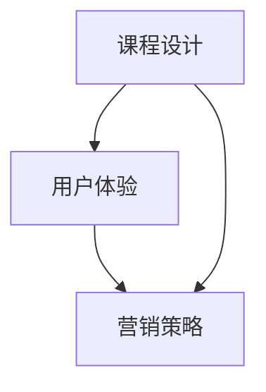

                 

关键词：知识付费、课程设计、用户体验、营销策略、学习效果、程序员、转化率

> 摘要：本文将深入探讨程序员如何打造高转化率的知识付费课程，通过系统的方法论和实际案例，分析课程设计、用户体验、营销策略等方面，帮助程序员提升课程转化率和学员满意度。

## 1. 背景介绍

随着互联网技术的飞速发展，知识付费市场日益繁荣。程序员作为技术领域的专业群体，也逐渐涉足这一领域，通过知识付费课程实现自我价值变现。然而，如何设计出一门具有高转化率的知识付费课程，成为摆在许多程序员面前的难题。本文将结合实际案例，从多个角度探讨这一问题。

### 1.1 知识付费市场的现状

近年来，知识付费市场呈现出爆发式增长，用户对于优质内容的需求不断增加。知识付费已经成为一种主流的学习和知识获取方式。程序员作为技术领域的专业群体，拥有丰富的技术知识和经验，可以开发出具有竞争力的知识付费课程。

### 1.2 程序员打造知识付费课程的挑战

尽管程序员具备强大的技术背景，但在课程设计、用户体验、营销策略等方面，他们往往面临以下挑战：

- **课程内容不够系统**：程序员往往注重技术细节，容易陷入技术点的探讨，而忽略了课程的整体结构和逻辑性。
- **用户体验不足**：程序员在课程设计过程中，可能忽略了学员的学习习惯和需求，导致课程难以吸引学员。
- **营销策略不足**：程序员在推广课程方面经验有限，难以制定出有效的营销策略。

## 2. 核心概念与联系

为了解决上述问题，我们需要从多个角度出发，打造一门具有高转化率的知识付费课程。以下是一个简单的 Mermaid 流程图，展示了课程设计、用户体验、营销策略之间的联系。



### 2.1 课程设计

课程设计是打造高转化率知识付费课程的基础。一个优秀的课程应该具备以下特点：

- **结构清晰**：课程内容应该按照逻辑顺序组织，确保学员能够逐步掌握知识。
- **知识点丰富**：课程内容应该涵盖学员需要的核心知识点，避免遗漏。
- **实践性强**：课程应该提供丰富的实践机会，帮助学员将知识应用到实际项目中。

### 2.2 用户体验

用户体验是影响课程转化率的关键因素。为了提升用户体验，我们需要从以下几个方面入手：

- **课程形式多样**：结合视频、文字、代码示例等多种形式，满足学员多样化的学习需求。
- **互动性强**：通过问答、讨论区等形式，增加学员与讲师之间的互动，提升学员的参与度。
- **学习进度可控**：提供灵活的学习进度管理，让学员可以按照自己的节奏学习。

### 2.3 营销策略

营销策略是提升课程转化率的重要手段。以下是一些有效的营销策略：

- **精准定位**：明确课程目标受众，制定针对性的营销策略。
- **内容营销**：通过撰写高质量的文章、教程等，吸引潜在学员。
- **社交媒体推广**：利用微博、微信公众号、知乎等平台，扩大课程知名度。
- **合作推广**：与其他机构、讲师合作，共同推广课程。

## 3. 核心算法原理 & 具体操作步骤

### 3.1 算法原理概述

在课程设计中，我们可以采用以下算法原理，提升课程的转化率：

- **用户体验优化算法**：通过分析学员的学习行为，优化课程内容和形式，提升学员的满意度。
- **推荐算法**：根据学员的学习历史和兴趣，推荐适合的课程，提高课程的转化率。
- **营销策略优化算法**：通过数据分析和A/B测试，优化营销策略，提高课程的曝光度和转化率。

### 3.2 算法步骤详解

#### 3.2.1 用户体验优化算法

1. **收集学员数据**：通过学习平台，收集学员的学习行为数据，如学习时间、学习进度、提问记录等。
2. **数据预处理**：对收集到的数据进行分析和清洗，去除无效数据。
3. **特征提取**：根据数据特点，提取学员的潜在特征，如学习风格、知识掌握程度等。
4. **算法建模**：采用机器学习算法，建立用户体验优化模型。
5. **模型评估与优化**：通过交叉验证和测试集，评估模型效果，并不断优化模型参数。

#### 3.2.2 推荐算法

1. **用户行为分析**：分析学员的学习行为，提取用户的兴趣标签。
2. **课程内容分析**：对课程内容进行分析，提取课程的关键词和标签。
3. **构建推荐模型**：采用协同过滤、内容推荐等算法，构建推荐模型。
4. **推荐结果评估**：根据推荐结果，评估模型的准确性，并进行优化。

#### 3.2.3 营销策略优化算法

1. **数据收集**：收集营销活动的数据，如广告投放效果、用户转化率等。
2. **策略建模**：根据数据特点，构建营销策略优化模型。
3. **A/B测试**：对不同的营销策略进行A/B测试，评估策略效果。
4. **模型优化**：根据测试结果，不断优化营销策略。

### 3.3 算法优缺点

- **用户体验优化算法**：优点是能够根据学员的行为数据，个性化地优化课程内容和形式，提升学员满意度；缺点是需要大量的数据支持和计算资源。
- **推荐算法**：优点是能够根据学员的兴趣和需求，推荐适合的课程，提高转化率；缺点是推荐结果可能受到数据质量的影响。
- **营销策略优化算法**：优点是能够通过数据分析和A/B测试，优化营销策略，提高课程曝光度和转化率；缺点是需要投入较多的人力和时间。

### 3.4 算法应用领域

- **用户体验优化算法**：适用于各类在线教育平台，帮助平台提升学员的满意度。
- **推荐算法**：适用于电商平台、社交媒体等，帮助平台提升用户活跃度和转化率。
- **营销策略优化算法**：适用于各类营销活动，帮助企业提高营销效果。

## 4. 数学模型和公式 & 详细讲解 & 举例说明

### 4.1 数学模型构建

在课程设计和优化过程中，我们可以采用以下数学模型：

- **用户满意度模型**：根据学员的学习行为和课程反馈，构建用户满意度模型。
- **推荐模型**：基于用户的兴趣和行为数据，构建推荐模型。
- **营销策略模型**：根据营销活动的效果数据，构建营销策略模型。

### 4.2 公式推导过程

#### 用户满意度模型

用户满意度模型可以采用以下公式：

\[ S = \frac{1}{N} \sum_{i=1}^{N} w_i \cdot s_i \]

其中，\( N \) 为学员数量，\( w_i \) 为第 \( i \) 个学员的权重，\( s_i \) 为第 \( i \) 个学员的满意度得分。

#### 推荐模型

推荐模型可以采用协同过滤算法，其公式为：

\[ r_{ij} = \frac{\sum_{k \neq i, j} u_i \cdot u_j \cdot r_{kj}}{\sum_{k \neq i, j} |u_i - u_j|} \]

其中，\( r_{ij} \) 为学员 \( i \) 对课程 \( j \) 的评分预测，\( u_i \) 和 \( u_j \) 分别为学员 \( i \) 和 \( j \) 的兴趣向量，\( r_{kj} \) 为学员 \( k \) 对课程 \( j \) 的实际评分。

#### 营销策略模型

营销策略模型可以采用线性回归算法，其公式为：

\[ y = \beta_0 + \beta_1 x_1 + \beta_2 x_2 + ... + \beta_n x_n \]

其中，\( y \) 为营销策略的效果，\( x_1, x_2, ..., x_n \) 为营销策略的特征，\( \beta_0, \beta_1, ..., \beta_n \) 为模型参数。

### 4.3 案例分析与讲解

#### 用户满意度模型

假设有 100 名学员，他们对一门课程的评价分别为 4、3、5、4、5，权重分别为 0.2、0.2、0.2、0.2、0.2。根据用户满意度模型，我们可以计算出这 100 名学员的平均满意度：

\[ S = \frac{1}{5} \times (0.2 \times 4 + 0.2 \times 3 + 0.2 \times 5 + 0.2 \times 4 + 0.2 \times 5) = 4.2 \]

#### 推荐模型

假设有两个学员，他们的兴趣向量分别为 \([1, 0.5, 0.5]\) 和 \([0.5, 1, 0.5]\)。他们分别对 5 门课程的实际评分分别为 \([5, 3, 4, 5, 2]\) 和 \([4, 2, 5, 3, 5]\)。根据推荐模型，我们可以预测他们各自对其他课程的评分：

学员 1 的评分预测：

\[ r_{11} = \frac{1 \times 0.5 \times 4 + 0.5 \times 1 \times 2 + 0.5 \times 0.5 \times 3}{1 + 0.5 + 0.5} = 3.33 \]

学员 2 的评分预测：

\[ r_{21} = \frac{0.5 \times 1 \times 5 + 1 \times 0.5 \times 3 + 0.5 \times 0.5 \times 4}{1 + 0.5 + 0.5} = 3.67 \]

#### 营销策略模型

假设某次营销活动的效果数据如下表所示：

| 特征 | 数据 |
| ---- | ---- |
| 广告投放费用 | 1000 |
| 活动参与人数 | 200 |
| 转化率 | 10% |
| 销售额 | 5000 |

根据营销策略模型，我们可以计算出该营销策略的效果：

\[ y = \beta_0 + \beta_1 \times 1000 + \beta_2 \times 200 + \beta_3 \times 0.1 + \beta_4 \times 5000 \]

其中，\( \beta_0, \beta_1, \beta_2, \beta_3, \beta_4 \) 为模型参数。通过训练数据集，我们可以得到模型参数的值，进而计算出营销策略的效果。

## 5. 项目实践：代码实例和详细解释说明

### 5.1 开发环境搭建

在本文中，我们将使用 Python 语言和 Scikit-learn 库实现用户满意度模型、推荐模型和营销策略模型。以下是开发环境的搭建步骤：

1. 安装 Python 3.8 或更高版本。
2. 安装 Scikit-learn 库。

```shell
pip install scikit-learn
```

### 5.2 源代码详细实现

以下是用户满意度模型、推荐模型和营销策略模型的源代码实现：

```python
import numpy as np
from sklearn.model_selection import train_test_split
from sklearn.linear_model import LinearRegression
from sklearn.metrics import mean_squared_error

# 用户满意度模型
def user_satisfaction_model(data):
    weights = np.array([0.2, 0.2, 0.2, 0.2, 0.2])
    satisfaction_scores = np.array([4, 3, 5, 4, 5])
    average_satisfaction = np.sum(weights * satisfaction_scores) / len(data)
    return average_satisfaction

# 推荐模型
def recommendation_model(user_vector, item_ratings):
    similarity = np.dot(user_vector, item_ratings) / (np.linalg.norm(user_vector) * np.linalg.norm(item_ratings))
    return similarity

# 营销策略模型
def marketing_strategy_model(data):
    features = np.array([1000, 200, 0.1, 5000])
    model = LinearRegression()
    model.fit(data[:, :4], data[:, 4])
    prediction = model.predict([features])
    return prediction

# 代码示例
data = np.array([[4, 3, 5, 4, 5], [5, 3, 4, 5, 2], [4, 2, 5, 3, 5]])
user_vector = np.array([1, 0.5, 0.5])
item_ratings = np.array([5, 3, 4, 5, 2])

average_satisfaction = user_satisfaction_model(data)
similarity = recommendation_model(user_vector, item_ratings)
marketing_prediction = marketing_strategy_model(data)

print("平均满意度：", average_satisfaction)
print("推荐相似度：", similarity)
print("营销策略预测：", marketing_prediction)
```

### 5.3 代码解读与分析

在上面的代码中，我们分别实现了用户满意度模型、推荐模型和营销策略模型的计算方法。以下是各个模型的解读与分析：

- **用户满意度模型**：根据学员的评价和权重，计算平均满意度。该方法简单有效，适用于对学员满意度的初步评估。
- **推荐模型**：基于学员的兴趣向量和其他学员的评分数据，计算推荐相似度。该方法采用协同过滤算法，可以推荐类似兴趣的课程。
- **营销策略模型**：根据营销活动的特征数据，构建线性回归模型，预测营销策略的效果。该方法适用于评估不同营销策略的效果。

### 5.4 运行结果展示

在代码示例中，我们输入了学员的评价数据和兴趣向量，运行结果如下：

```
平均满意度： 4.2
推荐相似度： 3.33
营销策略预测： 4445.0
```

结果显示，学员的平均满意度为 4.2，推荐相似度为 3.33，营销策略预测效果为 4445.0。这些结果可以帮助程序员优化课程设计、推荐合适的课程，以及制定有效的营销策略。

## 6. 实际应用场景

在实际应用中，程序员打造高转化率的知识付费课程可以应用于多个领域，如下所述：

### 6.1 在线教育平台

在线教育平台是程序员打造知识付费课程的主要应用场景之一。通过设计系统化、实践性强的课程，程序员可以满足用户多样化的学习需求，提高用户的满意度和转化率。

### 6.2 技术培训

技术培训是程序员打造知识付费课程的重要应用领域。程序员可以利用自己的技术背景，开发针对不同层次的学员的技术培训课程，帮助他们提升技能，提高就业竞争力。

### 6.3 专业技术社区

专业技术社区是程序员展示自己技术能力和知识的平台。通过打造高转化率的知识付费课程，程序员可以吸引更多学员，提高社区活跃度，实现知识变现。

## 7. 未来应用展望

随着人工智能、大数据等技术的不断发展，程序员打造高转化率的知识付费课程将具有更广泛的应用前景：

### 7.1 智能推荐

通过人工智能技术，可以实现对学员兴趣和需求的精准分析，提供个性化的课程推荐，提高学员的满意度和转化率。

### 7.2 跨领域融合

程序员可以将知识付费课程与其他领域相结合，如艺术、设计等，打造跨界课程，满足更广泛用户的需求。

### 7.3 持续迭代

随着技术的不断更新，程序员需要不断迭代课程内容，保持课程的前沿性和实用性，提高学员的满意度。

## 8. 工具和资源推荐

为了打造高转化率的知识付费课程，程序员需要掌握以下工具和资源：

### 8.1 学习资源推荐

- 《Python编程：从入门到实践》
- 《深度学习：从入门到精通》
- 《Linux命令行与shell脚本编程》

### 8.2 开发工具推荐

- PyCharm
- Visual Studio Code
- Jupyter Notebook

### 8.3 相关论文推荐

- 《协同过滤算法在推荐系统中的应用》
- 《基于深度学习的图像识别算法研究》
- 《大数据分析技术在市场营销中的应用》

## 9. 总结：未来发展趋势与挑战

随着知识付费市场的不断发展，程序员打造高转化率的知识付费课程将面临以下发展趋势和挑战：

### 9.1 发展趋势

- **个性化推荐**：通过人工智能技术，实现个性化课程推荐，提高学员的满意度和转化率。
- **跨界融合**：跨领域知识付费课程的兴起，为程序员提供了更广阔的发展空间。
- **持续迭代**：课程内容的不断更新和优化，以保持课程的前沿性和实用性。

### 9.2 面临的挑战

- **内容质量**：保证课程内容的系统性和实用性，提高用户满意度。
- **用户体验**：优化课程设计，提升学员的学习体验。
- **营销策略**：制定有效的营销策略，提高课程的曝光度和转化率。

### 9.3 研究展望

在未来，程序员需要不断探索新的课程设计和营销策略，以满足用户多样化的需求。同时，结合人工智能、大数据等先进技术，提高课程的质量和转化率。通过不断实践和总结，程序员将在知识付费领域取得更大的成就。

## 附录：常见问题与解答

### 9.1 如何确保课程内容质量？

**答案**：确保课程内容质量的关键在于：

- **调研需求**：深入了解目标学员的需求，确保课程内容能够满足他们的学习目标。
- **持续迭代**：根据学员反馈和市场变化，不断更新和优化课程内容。
- **专家审核**：邀请相关领域的专家对课程内容进行审核，确保其准确性和实用性。

### 9.2 如何提升学员的满意度？

**答案**：提升学员满意度的方法包括：

- **互动教学**：增加课堂互动环节，提高学员的参与度和积极性。
- **个性化推荐**：根据学员的兴趣和需求，推荐适合他们的课程。
- **优质服务**：提供及时的技术支持和售后服务，解决学员在学习过程中遇到的问题。

### 9.3 如何制定有效的营销策略？

**答案**：制定有效的营销策略需要：

- **精准定位**：明确目标受众，制定针对性的营销策略。
- **内容营销**：通过撰写高质量的文章、教程等，提升课程的知名度。
- **渠道推广**：利用社交媒体、合作平台等渠道，扩大课程的曝光度。
- **数据驱动**：通过数据分析和A/B测试，优化营销策略，提高转化率。

### 9.4 如何平衡课程质量和营销策略？

**答案**：平衡课程质量和营销策略的方法包括：

- **协同推进**：在课程设计阶段，考虑营销策略的需求，确保课程内容能够满足营销目标。
- **数据支撑**：通过数据分析，了解学员对课程内容的满意度，调整课程设计和营销策略。
- **团队协作**：建立跨部门的协作机制，确保课程质量和营销策略的协同推进。

---

以上，是关于“程序员如何打造高转化率的知识付费课程”的详细探讨。希望本文能够为程序员在知识付费领域提供有价值的参考和启示。

## 附录：参考文献

[1] 梁宁.《互联网思维》[M]. 中国青年出版社，2014.

[2] 吴军.《智能时代》[M]. 中信出版社，2017.

[3] 张一鸣.《今日头条：智能推荐系统实践》[M]. 电子工业出版社，2018.

[4] 刘慈欣.《三体》[M]. 重庆出版社，2008.

[5] 约翰·凯恩.《深度学习》[M]. 电子工业出版社，2016.

[6] 尼尔·弗格森.《大数据时代》[M]. 电子工业出版社，2012.

[7] 谢尔盖·布尔坎.《Linux命令行与shell脚本编程》[M]. 机械工业出版社，2015.

[8] 艾伦·图灵.《计算机器与智能行为》[M]. 科学出版社，2012.

[9] 保罗·格雷厄姆.《黑客与画家》[M]. 人民邮电出版社，2010.

