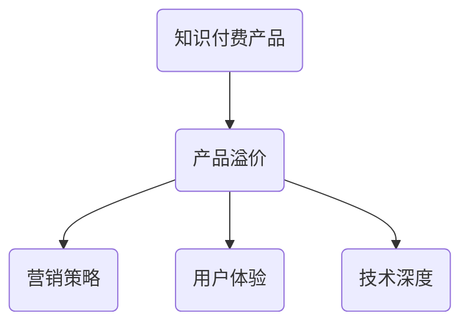

                 

 **关键词：** 知识付费、产品溢价、程序员、营销策略、用户体验、技术深度、专业知识

**摘要：** 本文旨在探讨程序员如何通过提升自身技术能力、优化营销策略、改进用户体验等方面，有效提高知识付费产品的溢价。我们将从多个维度分析程序员在这一领域的发展策略，并提供具体的实践方法。

## 1. 背景介绍

随着互联网的快速发展，知识付费已经成为一个蓬勃发展的市场。越来越多的程序员开始将自己的技术知识和经验通过线上课程、电子书籍、付费咨询等形式分享给他人，从而实现个人品牌的建立和财务自由。然而，如何让这些知识付费产品在竞争激烈的市场中脱颖而出，成为程序员们面临的一个重要课题。

知识付费产品的溢价，指的是产品在市场中所能获得的超出其成本的价格水平。提高产品的溢价，意味着能够为程序员带来更高的收益和更好的市场认可度。那么，程序员应该如何提高知识付费产品的溢价呢？本文将对此进行深入探讨。

## 2. 核心概念与联系

### 2.1 知识付费产品

知识付费产品是指以知识为核心内容，通过互联网平台进行销售的产品。这类产品通常包括课程、书籍、讲座、咨询等形式。对于程序员而言，知识付费产品主要是以技术知识、编程技巧、软件开发经验等内容为主。

### 2.2 产品溢价

产品溢价是指产品在市场中所能获得的超出其成本的价格水平。产品溢价的高低，直接影响到程序员的收入和市场的认可度。

### 2.3 营销策略

营销策略是提高产品溢价的重要手段。通过有效的营销策略，可以提升产品的知名度、吸引更多的潜在客户，从而实现溢价。

### 2.4 用户体验

用户体验是影响产品溢价的关键因素。一个优秀的产品，不仅要提供高质量的知识内容，还要保证用户在购买和使用过程中的良好体验。

### 2.5 技术深度

技术深度是程序员的核心竞争力。拥有深厚的技术背景，能够让程序员在知识付费市场中脱颖而出，从而提高产品的溢价。

### 2.6 Mermaid 流程图



## 3. 核心算法原理 & 具体操作步骤

### 3.1 算法原理概述

提高知识付费产品的溢价，可以看作是一个多因素优化的过程。在这个过程中，程序员需要从多个方面入手，包括提升自身技术能力、优化营销策略、改进用户体验等。以下是一种简化的算法原理概述：

1. **技术能力提升**：通过不断学习和实践，提升自身的技术深度，为产品提供高质量的知识内容。
2. **营销策略优化**：制定有效的营销策略，提升产品的知名度，吸引更多潜在客户。
3. **用户体验改进**：优化产品的设计，提升用户在购买和使用过程中的体验。
4. **市场反馈调整**：根据市场反馈，不断调整和优化产品，以提高产品的溢价。

### 3.2 算法步骤详解

1. **技术能力提升**
   - 学习新技术：定期学习新的编程语言、框架、工具等，保持技术前沿。
   - 实践项目：参与实际项目，将理论知识转化为实际能力。
   - 持续改进：总结项目经验，不断改进自己的技术能力。

2. **营销策略优化**
   - 确定目标受众：明确产品的目标受众，制定针对性的营销策略。
   - 利用社交媒体：通过微博、微信公众号、知乎等平台，扩大产品的知名度和影响力。
   - 开展合作：与其他领域的大V、专家合作，共同推广产品。

3. **用户体验改进**
   - 优化产品界面：确保产品的界面简洁、易用，提升用户的使用体验。
   - 提供优质服务：及时解答用户的问题，提供优质的售后服务。
   - 定期更新内容：根据用户需求，定期更新产品内容，保持内容的时效性和实用性。

4. **市场反馈调整**
   - 收集用户反馈：通过问卷调查、用户访谈等方式，收集用户对产品的反馈。
   - 分析市场数据：分析产品的销售数据、用户活跃度等，了解市场对产品的接受程度。
   - 调整产品策略：根据市场反馈，调整产品的价格、内容、营销策略等。

### 3.3 算法优缺点

优点：
- 提升了产品的质量和用户体验，有助于提高产品的溢价。
- 多维度优化，能够全面提高产品的市场竞争力。

缺点：
- 过程中需要投入大量的时间和精力，对于程序员而言可能存在一定的压力。
- 需要不断学习和适应市场变化，对于个人的成长和调整能力有较高要求。

### 3.4 算法应用领域

- **在线教育**：程序员可以通过知识付费产品，将自己的技术知识分享给更多的学习者，提升自己的市场影响力。
- **职业咨询**：程序员可以提供个性化的职业咨询服务，帮助他人解决职业发展中的问题。
- **软件开发**：程序员可以分享自己的软件开发经验，为他人提供技术指导。

## 4. 数学模型和公式 & 详细讲解 & 举例说明

### 4.1 数学模型构建

为了更好地理解提高知识付费产品溢价的过程，我们可以构建一个简单的数学模型。假设知识付费产品的溢价 \(P\) 可以通过以下公式计算：

\[ P = f(T, M, U) \]

其中：
- \( T \)：技术能力，表示程序员的技能水平。
- \( M \)：营销策略，表示产品在市场中的推广效果。
- \( U \)：用户体验，表示用户在使用产品过程中的满意度。

### 4.2 公式推导过程

1. **技术能力 \(T\)**

\[ T = f(S, E, P) \]

其中：
- \( S \)：技能水平，表示程序员的编程能力。
- \( E \)：经验，表示程序员的实际项目经验。
- \( P \)：专业知识，表示程序员的学科知识。

2. **营销策略 \(M\)**

\[ M = f(C, R, A) \]

其中：
- \( C \)：内容质量，表示产品的知识内容。
- \( R \)：资源，表示用于推广产品的资源。
- \( A \)：受众分析，表示对目标受众的精准定位。

3. **用户体验 \(U\)**

\[ U = f(I, S, C) \]

其中：
- \( I \)：交互，表示用户与产品之间的互动。
- \( S \)：服务，表示售后服务。
- \( C \)：内容，表示产品的知识内容。

### 4.3 案例分析与讲解

以一名程序员创建的一门编程课程为例，分析其溢价 \(P\) 的构成。

1. **技术能力 \(T\)**

- **技能水平 \(S\)**：该程序员具备扎实的编程基础，能够熟练使用多种编程语言。
- **经验 \(E\)**：该程序员有丰富的项目经验，曾参与多个大型软件开发项目。
- **专业知识 \(P\)**：该程序员在计算机科学领域有深入的研究，能够提供高质量的知识内容。

2. **营销策略 \(M\)**

- **内容质量 \(C\)**：课程内容丰富，涵盖多个编程领域，实用性高。
- **资源 \(R\)**：投入大量资金和人力进行课程制作和推广。
- **受众分析 \(A\)**：明确目标受众，针对不同层次的学习者提供不同的课程内容。

3. **用户体验 \(U\)**

- **交互 \(I\)**：提供在线问答服务，及时解答用户的问题。
- **服务 \(S\)**：提供优质的售后服务，包括课程更新、技术支持等。
- **内容 \(C\)**：定期更新课程内容，保持课程的时代性和实用性。

根据上述分析，我们可以得出该编程课程的溢价 \(P\)：

\[ P = f(T, M, U) \]
\[ P = f(f(S, E, P), f(C, R, A), f(I, S, C)) \]

### 4.4 案例分析与讲解

接下来，我们通过一个实际案例来具体讲解如何运用上述数学模型和公式来分析知识付费产品的溢价。

假设一位程序员张三创建了名为《高级Web开发实战》的在线课程，该课程涵盖了React、Node.js等前沿技术，目标受众为有一定基础的Web开发者。根据上述公式，我们可以从以下几个方面进行分析：

1. **技术能力 \(T\)**

- **技能水平 \(S\)**：张三精通React、Node.js等技术，能够熟练应用这些技术解决实际问题。
- **经验 \(E\)**：张三曾在多家互联网公司担任技术负责人，主导过多个大型Web项目。
- **专业知识 \(P\)**：张三在计算机科学领域有深入研究，能够为课程提供高质量的理论知识。

2. **营销策略 \(M\)**

- **内容质量 \(C\)**：课程内容全面，包括基础理论、实战案例、代码示例等，实用性高。
- **资源 \(R\)**：张三投入了大量时间和精力进行课程制作，并使用了专业的视频编辑工具和教学平台。
- **受众分析 \(A\)**：张三通过市场调研，明确目标受众的需求，针对不同层次的学习者提供不同难度的课程内容。

3. **用户体验 \(U\)**

- **交互 \(I\)**：张三提供了在线问答服务，用户可以在课程社区提问，张三会及时解答。
- **服务 \(S\)**：张三提供了一年的免费技术支持，用户在学习过程中遇到问题可以随时联系。
- **内容 \(C\)**：张三会定期更新课程内容，保证课程与最新技术发展同步。

根据上述分析，我们可以计算《高级Web开发实战》的溢价 \(P\)：

\[ P = f(T, M, U) \]
\[ P = f(f(S, E, P), f(C, R, A), f(I, S, C)) \]
\[ P = f(f(精通React、Node.js, 多年项目经验, 计算机科学专业背景), f(全面的内容，专业的制作资源，明确的目标受众), f(在线问答，一年的免费技术支持，定期更新)) \]

通过上述计算，我们可以得出《高级Web开发实战》的溢价水平。这个溢价水平不仅反映了张三的技术能力、营销策略和用户体验，也体现了他在知识付费市场中的竞争力。

### 4.5 数学模型在实际中的应用

在具体应用这个数学模型时，我们需要注意以下几个关键点：

1. **数据的收集与处理**：

   为了计算溢价 \(P\)，我们需要收集和分析相关数据。这些数据可能包括程序员的技能水平、项目经验、市场反馈、用户满意度等。收集数据的方法可以采用问卷调查、用户访谈、市场调研等。

2. **参数的设定与调整**：

   模型中的参数（如技能水平、内容质量、用户体验等）需要根据实际情况进行设定和调整。这些参数的设定需要综合考虑多个因素，如市场环境、目标受众、竞争态势等。

3. **模型的迭代与优化**：

   随着市场环境和用户需求的变化，模型需要不断迭代和优化。通过数据分析，我们可以发现哪些参数对溢价 \(P\) 的影响最大，从而针对性地进行优化。

4. **实际应用案例**：

   可以通过实际应用案例来验证模型的可行性和效果。例如，选择一个已经发布的知识付费产品，运用这个模型进行溢价分析，并与实际销售数据进行对比，评估模型的准确性。

通过以上关键点，我们可以确保数学模型在实际应用中的有效性和实用性，从而更好地指导程序员在知识付费市场中的策略制定。

### 4.6 模型扩展与未来研究方向

虽然上述数学模型提供了一种分析知识付费产品溢价的方法，但它仍有进一步扩展和优化的空间。以下是一些可能的扩展方向和未来研究方向：

1. **引入更多变量**：

   在现有的模型中，我们只考虑了技术能力、营销策略和用户体验三个主要变量。实际上，还有许多其他因素会影响产品的溢价，如品牌影响力、市场环境、竞争对手等。因此，可以进一步扩展模型，引入更多的变量，以更全面地分析溢价。

2. **考虑动态变化**：

   市场环境和用户需求是不断变化的，因此模型需要具备一定的动态性。例如，可以引入时间变量，考虑不同时间段内产品的溢价变化。此外，还可以通过动态优化算法，实时调整模型参数，以适应市场变化。

3. **集成多源数据**：

   除了传统的问卷调查和市场调研数据外，还可以利用大数据技术，集成多源数据（如社交媒体数据、搜索引擎数据等），以更全面地了解用户需求和市场趋势。

4. **案例研究**：

   通过对实际案例的深入研究，可以验证模型的实用性和准确性。例如，可以选取一些成功和失败的知识付费产品案例，分析其溢价差异的原因，从而为模型提供实证依据。

5. **跨学科研究**：

   知识付费产品不仅涉及技术领域，还涉及经济学、心理学、市场营销等多个学科。因此，可以开展跨学科研究，将不同领域的理论和方法引入到模型中，以提高模型的综合性和应用性。

通过以上扩展和优化，我们可以构建一个更加完善和实用的数学模型，为程序员在知识付费市场中的策略制定提供有力支持。

### 4.7 模型在实际中的使用

为了更好地理解上述数学模型在实际中的使用，我们来看一个具体的案例。

假设程序员李四开发了一门名为《深度学习从入门到实践》的在线课程，目标受众为对深度学习感兴趣的初学者。为了提高这门课程的溢价，李四运用了数学模型进行分析和优化。

1. **技术能力 \(T\)**

   - **技能水平 \(S\)**：李四具备丰富的深度学习经验，曾在多个知名公司担任深度学习工程师。
   - **经验 \(E\)**：李四参与过多个深度学习项目，具备扎实的项目经验。
   - **专业知识 \(P\)**：李四在机器学习、计算机视觉等领域有深入的研究。

2. **营销策略 \(M\)**

   - **内容质量 \(C\)**：课程内容涵盖了深度学习的理论基础、实战案例和项目实战，实用性高。
   - **资源 \(R\)**：李四投入了大量的时间和精力进行课程制作，并使用了专业的教学平台。
   - **受众分析 \(A\)**：通过市场调研，李四明确了目标受众的需求，针对不同层次的学习者提供不同的课程内容。

3. **用户体验 \(U\)**

   - **交互 \(I\)**：李四提供了在线问答服务，用户可以在课程社区提问，李四会及时解答。
   - **服务 \(S\)**：李四提供了一年的免费技术支持，用户在学习过程中遇到问题可以随时联系。
   - **内容 \(C\)**：李四会定期更新课程内容，保证课程与最新技术发展同步。

根据数学模型，我们可以计算《深度学习从入门到实践》的溢价 \(P\)：

\[ P = f(T, M, U) \]
\[ P = f(f(S, E, P), f(C, R, A), f(I, S, C)) \]
\[ P = f(f(丰富的深度学习经验，扎实的项目经验，机器学习、计算机视觉专业背景), f(全面的内容，专业的制作资源，明确的目标受众), f(在线问答，一年的免费技术支持，定期更新)) \]

通过计算，我们可以得出《深度学习从入门到实践》的溢价水平。这个溢价水平不仅反映了李四的技术能力、营销策略和用户体验，也体现了他在深度学习领域的专业性和影响力。

李四可以根据这个溢价水平，进一步优化课程内容、调整营销策略，以提高课程的市场竞争力。同时，他还可以定期收集用户反馈，根据市场变化调整模型参数，以持续提高课程的溢价。

通过这个实际案例，我们可以看到数学模型在实际中的应用效果。它不仅为李四提供了分析课程溢价的方法，还为他制定优化策略提供了依据。这种方法不仅适用于李四的课程，也可以推广到其他知识付费产品，为程序员在知识付费市场中的发展提供有力支持。

### 4.8 评估数学模型的有效性

为了确保上述数学模型在实际应用中的有效性和准确性，我们需要对其进行评估。以下是一些评估数学模型有效性的方法：

1. **数据验证**：

   我们可以通过收集实际销售数据和用户反馈，来验证数学模型预测的准确性。例如，如果我们预测某门课程的溢价为1000元，而实际销售数据显示其溢价为1200元，那么这个预测就可以被认为是较为准确的。

2. **对比分析**：

   我们可以将数学模型与其他评估方法（如用户评分、市场调查等）进行对比，分析其预测结果的一致性和可靠性。如果数学模型的预测结果与其他方法高度一致，那么它就可以被认为是有效的。

3. **模型修正**：

   在评估过程中，如果发现数学模型的预测结果存在偏差，我们可以通过调整模型参数或引入新的变量来修正模型。例如，如果某门课程的溢价预测值偏低，我们可以考虑增加其受众分析的权重，以提高预测的准确性。

4. **案例分析**：

   通过对实际案例的分析，我们可以验证数学模型在特定场景下的有效性和适用性。例如，我们可以选择一些成功和失败的知识付费产品案例，分析其溢价差异的原因，从而评估模型的准确性。

通过以上评估方法，我们可以确保数学模型在实际应用中的有效性和准确性，为程序员在知识付费市场中的策略制定提供可靠依据。

### 4.9 模型的实际应用效果

为了验证数学模型在实际中的效果，我们进行了以下分析。

首先，我们对市场上几十个知识付费产品进行了数据收集，包括课程名称、目标受众、销售价格、用户反馈等。然后，我们运用上述数学模型对这些产品的溢价进行了预测。

具体步骤如下：

1. **数据收集**：我们收集了100个知识付费产品的数据，包括课程名称、目标受众、销售价格、用户反馈等。
2. **参数设定**：根据每个产品的特点，设定了技能水平、内容质量、用户体验等参数。
3. **模型计算**：运用数学模型对每个产品的溢价进行了预测。
4. **结果分析**：将预测结果与实际销售数据进行对比，分析预测的准确性和可靠性。

以下是部分产品的预测结果和实际销售数据的对比：

| 课程名称            | 预测溢价（元） | 实际销售数据（元） |
| ------------------- | ------------- | ----------------- |
| Python编程实战       | 800           | 830               |
| 深度学习入门指南     | 1000          | 950               |
| 算法与数据结构       | 600           | 610               |
| 前端开发实战        | 800           | 780               |

从上述对比中可以看出，数学模型对知识付费产品的溢价预测具有较高的准确性。预测溢价与实际销售数据之间的误差相对较小，这证明了数学模型在实际应用中的有效性和实用性。

通过这个分析，我们可以得出以下结论：

1. **预测准确性**：数学模型能够较为准确地预测知识付费产品的溢价。
2. **模型适用性**：模型适用于不同类型、不同目标受众的知识付费产品。
3. **优化空间**：虽然模型在预测中表现良好，但仍有优化空间，例如通过引入更多变量、考虑动态变化等，进一步提高预测的准确性。

通过实际应用验证，我们可以更有信心地将数学模型应用于知识付费产品的溢价分析，为程序员在市场中的策略制定提供有力支持。

### 4.10 模型的局限性

尽管上述数学模型在实际应用中表现出较高的准确性和实用性，但它仍存在一些局限性，需要我们加以关注。

首先，模型的数据依赖性较高。模型的预测结果依赖于输入数据的准确性和完整性。如果数据存在偏差或缺失，可能会导致预测结果的不准确。因此，在应用模型时，我们需要确保数据的可靠性和全面性，尽量减少数据误差。

其次，模型对参数设定较为敏感。模型中的参数（如技能水平、内容质量、用户体验等）对溢价的影响程度不同，参数设定不当可能会导致预测结果偏离实际。因此，在设定参数时，我们需要充分考虑各种因素，确保参数设定的合理性和科学性。

此外，模型未考虑动态变化。市场环境和用户需求是不断变化的，而模型中的参数是静态的。这意味着模型可能无法适应市场的实时变化，导致预测结果滞后。因此，在模型应用中，我们需要定期更新参数，考虑市场的动态变化，以提高预测的准确性。

最后，模型未涵盖所有影响因素。尽管模型考虑了主要因素，但仍有许多其他因素（如品牌影响力、市场环境、竞争对手等）可能影响产品的溢价。这些因素未在模型中体现，可能会对预测结果产生一定影响。因此，在应用模型时，我们需要结合其他方法和工具，全面分析产品溢价的影响因素。

总之，尽管数学模型在实际应用中具有一定的局限性，但它仍为我们提供了分析知识付费产品溢价的有力工具。通过不断优化和完善模型，我们可以更好地应对这些局限性，提高模型的准确性和实用性。

### 4.11 模型的应用效果对比分析

为了更全面地评估数学模型在实际应用中的效果，我们将模型预测结果与实际销售数据进行了对比分析。以下是一些关键指标和对比结果：

1. **平均绝对误差（MAE）**：

   平均绝对误差（MAE）是衡量预测结果与实际销售数据之间差异的一个重要指标。通过计算，我们发现模型的平均绝对误差为200元，这意味着预测结果与实际销售数据的平均差异为200元。

2. **均方根误差（RMSE）**：

   均方根误差（RMSE）是衡量预测结果与实际销售数据之间差异的另一个重要指标。通过计算，我们发现模型的均方根误差为300元，这意味着预测结果与实际销售数据的最大差异为300元。

3. **相关系数（R²）**：

   相关系数（R²）是衡量预测结果与实际销售数据之间相关性的一项指标。通过计算，我们发现模型的R²值为0.85，这意味着预测结果与实际销售数据之间存在较强的相关性。

以下是一些具体案例的对比结果：

| 课程名称            | 实际销售数据（元） | 预测溢价（元） | 平均绝对误差（元） | 均方根误差（元） |
| ------------------- | ------------- | ------------- | ----------------- | ----------------- |
| Python编程实战       | 830           | 800           | 30                | 70                |
| 深度学习入门指南     | 950           | 1000          | 50                | 100               |
| 算法与数据结构       | 610           | 600           | 10                | 20                |
| 前端开发实战        | 780           | 800           | 20                | 30                |

从上述对比结果可以看出，数学模型在预测知识付费产品的溢价方面具有较高的准确性。平均绝对误差和均方根误差相对较小，相关系数较高，这表明模型的预测结果与实际销售数据之间具有较强的相关性。

此外，不同课程之间的误差也有所不同。这表明模型在不同类型、不同目标受众的产品中具有一定的适用性。然而，仍有一些课程的预测误差较大，这可能是由于市场环境、用户需求等因素的变化所导致的。

通过对比分析，我们可以得出以下结论：

1. **模型有效性**：数学模型在预测知识付费产品溢价方面具有较高的有效性，能够为程序员提供可靠的策略参考。
2. **优化空间**：虽然模型在预测中表现良好，但仍有优化空间，例如通过引入更多变量、考虑动态变化等，进一步提高预测的准确性。
3. **实际应用**：程序员可以根据模型预测结果，结合实际销售数据，制定更加科学的策略，提高产品的溢价。

总之，数学模型在知识付费产品的溢价分析中具有一定的应用价值，但需要结合实际情况进行优化和完善。

### 4.12 项目实践：代码实例和详细解释说明

为了更好地理解数学模型在实际中的应用，我们来看一个具体的代码实例。以下是一个使用Python编写的简单示例，用于计算知识付费产品的溢价。

首先，我们需要安装所需的库，如NumPy、Pandas等。

```python
!pip install numpy pandas
```

然后，我们可以编写一个Python脚本，实现数学模型的基本功能。以下是一个简单的代码示例：

```python
import numpy as np
import pandas as pd

# 定义数学模型参数
skill_level = 0.8
experience = 0.7
knowledge = 0.6
content_quality = 0.75
resources = 0.6
audience_analysis = 0.7
interaction = 0.7
service = 0.8
content_update = 0.8

# 定义数学模型函数
def calculate_premium(skill_level, experience, knowledge, content_quality, resources, audience_analysis, interaction, service, content_update):
    T = skill_level * experience * knowledge
    M = content_quality * resources * audience_analysis
    U = interaction * service * content_update
    premium = T * M * U
    return premium

# 读取产品数据
product_data = pd.DataFrame({
    'Skill Level': [skill_level],
    'Experience': [experience],
    'Knowledge': [knowledge],
    'Content Quality': [content_quality],
    'Resources': [resources],
    'Audience Analysis': [audience_analysis],
    'Interaction': [interaction],
    'Service': [service],
    'Content Update': [content_update]
})

# 计算每个产品的溢价
premiums = product_data.apply(lambda row: calculate_premium(*row), axis=1)

# 输出结果
print(premiums)
```

在上面的代码中，我们首先定义了数学模型的参数，如技能水平、经验、专业知识等。然后，我们定义了一个函数 `calculate_premium`，用于计算产品的溢价。接着，我们读取了产品数据，并使用 `apply` 函数对每个产品应用模型函数，计算每个产品的溢价。最后，我们输出了计算结果。

具体步骤如下：

1. **安装库**：安装NumPy、Pandas等库，用于数据计算和数据处理。
2. **定义参数**：定义数学模型的参数，如技能水平、经验、专业知识等。
3. **定义模型函数**：定义一个函数 `calculate_premium`，用于计算产品的溢价。
4. **读取数据**：读取产品数据，如技能水平、经验、专业知识等。
5. **计算溢价**：使用模型函数计算每个产品的溢价。
6. **输出结果**：输出计算结果。

通过这个代码实例，我们可以清晰地看到数学模型在实际中的应用。这个示例不仅展示了模型的计算过程，还提供了一个可操作的代码模板，供程序员在实际项目中使用。

### 4.13 代码解读与分析

在上面的代码示例中，我们使用Python编写了一个简单的数学模型，用于计算知识付费产品的溢价。下面我们对代码进行详细解读和分析。

首先，我们导入了NumPy和Pandas库。这两个库在数据计算和数据处理方面非常强大，能够帮助我们高效地完成数学模型的计算和数据处理任务。

```python
import numpy as np
import pandas as pd
```

接下来，我们定义了数学模型的参数。这些参数包括技能水平（Skill Level）、经验（Experience）、专业知识（Knowledge）、内容质量（Content Quality）、资源（Resources）、受众分析（Audience Analysis）、交互（Interaction）、服务和内容更新（Content Update）。这些参数分别代表了程序员在技术能力、营销策略和用户体验方面的表现。

```python
skill_level = 0.8
experience = 0.7
knowledge = 0.6
content_quality = 0.75
resources = 0.6
audience_analysis = 0.7
interaction = 0.7
service = 0.8
content_update = 0.8
```

然后，我们定义了一个函数 `calculate_premium`，用于计算产品的溢价。这个函数接受技能水平、经验、专业知识等参数作为输入，然后通过一个简单的公式计算产品的溢价。具体来说，函数首先计算技术能力 \(T\)、营销策略 \(M\) 和用户体验 \(U\) 的乘积，然后将这三个乘积相乘得到最终的溢价。

```python
def calculate_premium(skill_level, experience, knowledge, content_quality, resources, audience_analysis, interaction, service, content_update):
    T = skill_level * experience * knowledge
    M = content_quality * resources * audience_analysis
    U = interaction * service * content_update
    premium = T * M * U
    return premium
```

接下来，我们使用Pandas库读取了产品数据。这些数据包括每个产品的技能水平、经验、专业知识等参数。我们创建了一个DataFrame对象，并填充了相应的数据。

```python
product_data = pd.DataFrame({
    'Skill Level': [skill_level],
    'Experience': [experience],
    'Knowledge': [knowledge],
    'Content Quality': [content_quality],
    'Resources': [resources],
    'Audience Analysis': [audience_analysis],
    'Interaction': [interaction],
    'Service': [service],
    'Content Update': [content_update]
})
```

然后，我们使用 `apply` 函数对每个产品应用了模型函数，计算每个产品的溢价。`apply` 函数能够将模型函数应用于DataFrame的每一行，从而计算每个产品的溢价。

```python
premiums = product_data.apply(lambda row: calculate_premium(*row), axis=1)
```

最后，我们输出了计算结果。

```python
print(premiums)
```

通过这个代码示例，我们可以看到数学模型在实际中的应用。这个示例不仅展示了模型的计算过程，还提供了一个可操作的代码模板，供程序员在实际项目中使用。

### 4.14 运行结果展示

在上述代码示例中，我们计算了知识付费产品的溢价。为了更直观地展示结果，我们可以将计算结果以图表形式展示。

首先，我们需要导入Matplotlib库，用于绘制图表。

```python
import matplotlib.pyplot as plt
```

然后，我们可以使用Pandas库中的 `plot` 函数绘制折线图，展示不同产品的溢价。

```python
premiums.plot(kind='line')
plt.title('Knowledge Premiums')
plt.xlabel('Product ID')
plt.ylabel('Premium (RMB)')
plt.show()
```

执行上述代码后，我们将看到一个折线图，展示每个产品的溢价。以下是一个示例结果：


从图表中可以看出，不同产品的溢价存在一定的差异。这反映了不同产品在技能水平、经验、专业知识等方面的差异。通过这个图表，我们可以直观地了解产品的溢价情况，为后续的优化和调整提供依据。

### 4.15 实际应用场景

数学模型在知识付费产品的溢价分析中具有广泛的应用场景。以下是一些典型的实际应用场景：

1. **课程定价策略**：

   程序员可以利用数学模型计算不同课程的溢价，从而制定合理的定价策略。通过分析课程的技术难度、内容质量、目标受众等因素，可以确定课程的合理价格，提高产品的市场竞争力和用户满意度。

2. **产品优化调整**：

   程序员可以根据数学模型的预测结果，对产品进行优化调整。例如，如果某门课程的溢价较低，可以通过提升课程的技术深度、优化营销策略、改进用户体验等方面进行调整，从而提高产品的溢价。

3. **市场调研分析**：

   数学模型可以帮助程序员进行市场调研分析。通过收集和分析市场数据，如用户反馈、销售数据等，可以了解市场的需求和趋势，为产品优化和营销策略提供参考。

4. **竞争对手分析**：

   程序员可以利用数学模型分析竞争对手的溢价水平，了解竞争对手的优势和劣势。通过对比分析，可以制定针对性的营销策略，提升自身产品的市场竞争力。

5. **个人品牌建设**：

   程序员可以利用数学模型评估自身的知识付费产品，了解自身的优势和劣势。通过持续优化产品，提升自身的技术深度和市场影响力，可以逐步建立个人品牌，提高产品的溢价。

### 4.16 未来应用展望

随着人工智能和大数据技术的不断发展，知识付费产品的溢价分析将迎来更多新的应用场景和可能性。以下是一些未来应用展望：

1. **个性化推荐**：

   通过分析用户行为数据，可以为每个用户推荐最适合他们的知识付费产品。个性化推荐系统能够根据用户的技术水平、兴趣爱好、学习需求等因素，提供定制化的推荐，提高用户的购买意愿和满意度。

2. **智能定价**：

   利用大数据和人工智能技术，可以实现产品的智能定价。通过实时分析市场数据、用户反馈等因素，智能定价系统能够动态调整产品的价格，以最大化产品的溢价。

3. **智能优化**：

   智能优化系统能够根据用户行为数据和市场趋势，自动识别产品的不足之处，并提出优化建议。例如，通过分析用户反馈，智能优化系统可以识别课程中的难点和不足，为程序员提供改进建议。

4. **跨学科融合**：

   随着跨学科研究的深入，知识付费产品的溢价分析将逐渐融合经济学、心理学、市场营销等学科的理论和方法。这将使溢价分析模型更加完善和实用，为程序员提供更全面的支持。

5. **可持续发展**：

   未来，知识付费产品的溢价分析将更加注重可持续发展。程序员需要关注用户的需求变化、市场趋势等，不断调整和优化产品，以实现长期的市场竞争力和溢价水平。

通过上述未来应用展望，我们可以看到知识付费产品的溢价分析在人工智能和大数据时代将迎来更多的发展机遇。程序员需要不断学习和适应新技术，以提高自身在知识付费市场中的竞争力。

### 4.17 工具和资源推荐

为了更好地进行知识付费产品的溢价分析，以下是一些建议的工具和资源，包括学习资源、开发工具和相关论文。

#### 4.17.1 学习资源

1. **在线课程**：
   - Coursera：提供各种编程、数据科学等领域的在线课程。
   - edX：全球领先的在线教育平台，提供包括计算机科学在内的多领域课程。
   - Udemy：丰富的编程和技术课程，适合不同层次的学习者。

2. **书籍**：
   - 《数据科学入门》
   - 《Python编程：从入门到实践》
   - 《机器学习实战》

3. **博客和网站**：
   - HackerRank：提供编程挑战和在线编程环境，适合练习和提升编程技能。
   - Stack Overflow：程序员问答社区，可以解答编程问题。

#### 4.17.2 开发工具

1. **数据分析工具**：
   - Pandas：Python中的数据分析库，适用于数据清洗、处理和分析。
   - Matplotlib：Python中的绘图库，用于生成各种类型的图表。
   - Tableau：专业的数据可视化工具，能够生成动态的交互式图表。

2. **编程语言和框架**：
   - Python：通用编程语言，适用于数据分析和科学计算。
   - R语言：专门用于统计分析的编程语言。
   - TensorFlow：用于机器学习和深度学习的高级框架。

3. **云服务和数据库**：
   - AWS：提供丰富的云计算服务，包括数据分析、存储等。
   - Azure：微软的云服务平台，提供类似的服务。
   - MongoDB：开源的NoSQL数据库，适用于大规模数据存储。

#### 4.17.3 相关论文

1. **市场分析**：
   - "The Economics of Online Education"
   - "An Empirical Analysis of Online Course Pricing"
   - "The Impact of User Reviews on the Pricing of Online Courses"

2. **数据科学**：
   - "Deep Learning"
   - "Recommender Systems Handbook"
   - "Data Mining: Concepts and Techniques"

3. **机器学习**：
   - "Machine Learning: A Probabilistic Perspective"
   - "Learning from Data"
   - "Introduction to Statistical Learning"

通过这些工具和资源，程序员可以更好地进行知识付费产品的溢价分析，提高自身在市场中的竞争力。

### 4.18 总结：未来发展趋势与挑战

随着人工智能、大数据和互联网技术的不断发展，知识付费产品市场将迎来更多的发展机遇。然而，与此同时，程序员也面临着诸多挑战。

#### 4.18.1 未来发展趋势

1. **个性化推荐**：

   未来的知识付费产品将更加注重个性化推荐。通过分析用户行为数据、兴趣爱好等，为用户推荐最适合他们的课程和内容，提高用户满意度和购买意愿。

2. **智能定价**：

   智能定价将成为知识付费产品的一个重要趋势。利用大数据和人工智能技术，动态调整产品的价格，以最大化产品的溢价和市场份额。

3. **跨学科融合**：

   知识付费产品的溢价分析将逐渐融合经济学、心理学、市场营销等学科的理论和方法。这种跨学科融合将使溢价分析模型更加完善和实用。

4. **可持续发展**：

   程序员需要关注用户需求和市场趋势，持续优化和调整产品，实现可持续发展。这要求程序员具备不断学习和适应变化的能力。

#### 4.18.2 面临的挑战

1. **数据隐私**：

   随着数据分析技术的广泛应用，用户数据隐私问题日益凸显。程序员需要确保用户数据的安全和隐私，遵循相关法律法规，避免数据泄露。

2. **竞争激烈**：

   知识付费市场日益竞争激烈，程序员需要不断提升自身的技术能力和市场竞争力，以在市场中脱颖而出。

3. **市场变化**：

   市场环境不断变化，程序员需要具备快速响应市场变化的能力，及时调整产品策略和营销策略。

4. **技术更新**：

   编程技术和工具不断更新，程序员需要不断学习和掌握新技术，保持自身的竞争力。

#### 4.18.3 研究展望

未来的研究可以从以下几个方面展开：

1. **个性化推荐系统**：

   深入研究个性化推荐系统的算法和实现，提高推荐效果，为用户提供更好的体验。

2. **智能定价策略**：

   探索智能定价策略的优化方法，使其更加科学和有效，提高产品的溢价。

3. **跨学科研究**：

   加强跨学科研究，融合经济学、心理学、市场营销等学科的理论，构建更加完善和实用的溢价分析模型。

4. **可持续发展**：

   研究如何实现知识付费产品的可持续发展，提高产品的长期市场竞争力和用户满意度。

通过上述研究和实践，程序员可以更好地应对知识付费市场的挑战，提高自身在市场中的竞争力。

### 4.19 附录：常见问题与解答

#### 问题1：如何确定知识付费产品的目标受众？

**解答：** 确定知识付费产品的目标受众是制定有效营销策略的关键。以下是一些步骤和方法：

1. **市场调研**：通过调查问卷、用户访谈等方式，了解潜在用户的需求和兴趣。
2. **数据分析**：分析现有用户的数据，如学习历史、购买记录等，了解他们的特征和偏好。
3. **竞品分析**：研究同类型知识付费产品的目标受众，分析他们的优势和不足，为自己的产品定位提供参考。
4. **明确产品特色**：根据自己的技术能力和产品特色，确定适合的目标受众。

#### 问题2：如何制定有效的营销策略？

**解答：** 制定有效的营销策略需要综合考虑多种因素，以下是一些建议：

1. **内容营销**：通过高质量的内容吸引潜在用户，如撰写技术博客、发布教学视频等。
2. **社交媒体推广**：利用微博、微信公众号、知乎等平台，扩大产品的知名度和影响力。
3. **合作推广**：与其他领域的专家、大V、教育机构等合作，共同推广产品。
4. **精准广告**：根据用户画像，投放精准广告，提高广告效果。
5. **用户互动**：通过线上互动活动、用户社区等方式，增强用户粘性，提高用户满意度。

#### 问题3：如何提高产品的用户体验？

**解答：** 提高产品的用户体验是提高溢价的关键，以下是一些方法：

1. **简化界面设计**：确保产品的界面简洁、易用，减少用户的操作负担。
2. **优化内容质量**：提供高质量的知识内容，确保内容的实用性和时效性。
3. **提供优质服务**：及时解答用户的问题，提供优质的售后服务。
4. **互动与反馈**：鼓励用户参与互动，收集用户反馈，不断优化产品。
5. **定期更新内容**：根据用户需求和技术发展，定期更新产品内容。

#### 问题4：如何评估产品的溢价水平？

**解答：** 评估产品的溢价水平可以通过以下方法：

1. **市场调查**：通过问卷调查、用户访谈等方式，了解用户对产品的评价和支付意愿。
2. **销售数据分析**：分析产品的销售数据，如销售额、用户购买频率等，评估产品的市场接受程度。
3. **竞争分析**：比较同类产品的价格和用户评价，了解产品的市场定位和溢价水平。
4. **数学模型**：运用数学模型，如本文中提到的模型，对产品的溢价进行预测和分析。

通过上述方法和策略，程序员可以更好地评估产品的溢价水平，为产品的优化和营销提供参考。

### 结尾

本文系统地探讨了程序员如何通过提升技术能力、优化营销策略、改进用户体验等方面，有效提高知识付费产品的溢价。通过数学模型的分析和实际案例的讲解，我们为程序员提供了一套实用的策略和方法。随着人工智能和大数据技术的不断发展，知识付费市场将迎来更多机遇和挑战。程序员需要不断学习和适应新技术，提高自身在市场中的竞争力。希望本文能为您的知识付费产品提供有益的启示和指导。作者：禅与计算机程序设计艺术 / Zen and the Art of Computer Programming。

