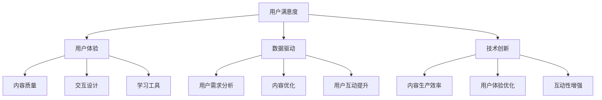

                 

关键词：知识付费，用户满意度，程序员，用户体验，策略优化，数据驱动，技术创新

> 摘要：在当今数字化时代，知识付费已成为一种重要的商业模式，程序员如何通过策略优化、数据驱动和技术创新来提升用户满意度，是一个关键议题。本文将深入探讨程序员在这一领域的实践和方法，以期为业界提供有益的借鉴。

## 1. 背景介绍

### 知识付费的兴起

随着互联网技术的快速发展，信息传播的渠道变得多样化和高效化，人们对于知识和技能的需求也越来越强烈。知识付费作为互联网经济中的一种新兴商业模式，逐渐成为人们获取专业知识和技能的重要途径。知识付费平台如雨后春笋般涌现，涵盖了从在线教育、专业技能培训到职业发展规划等多个领域。

### 程序员在知识付费中的角色

程序员是知识付费市场中的重要参与者。一方面，他们通过编写高质量的技术教程、分享编程经验和解决技术难题，为其他程序员和开发者提供学习资源；另一方面，他们通过参与付费项目、提供咨询服务等方式，实现个人价值的最大化。然而，如何提高知识付费的用户满意度，是程序员面临的挑战之一。

## 2. 核心概念与联系

### 用户满意度

用户满意度是指用户在使用产品或服务后对整体体验的主观评价。在知识付费领域，用户满意度直接影响用户留存率和口碑传播。因此，提升用户满意度是程序员必须关注的核心问题。

### 用户体验

用户体验（User Experience，简称UX）是指用户在使用产品或服务过程中的整体感受。用户体验的好坏直接影响用户满意度。在知识付费中，用户体验包括内容质量、交互设计、学习工具等多个方面。

### 数据驱动

数据驱动是指通过收集、分析和利用数据来指导决策和优化产品或服务。在知识付费领域，数据驱动可以帮助程序员了解用户需求、优化内容结构、提升用户互动等。

### 技术创新

技术创新是指通过引入新技术、新方法来提升产品或服务的价值。在知识付费中，技术创新可以帮助程序员提高内容生产效率、优化用户体验、增强互动性等。

### Mermaid 流程图

以下是一个简化的Mermaid流程图，展示了提高知识付费用户满意度的核心概念和联系：



## 3. 核心算法原理 & 具体操作步骤

### 3.1 算法原理概述

提高知识付费用户满意度，需要从用户体验、数据驱动和技术创新三个方面入手。具体操作步骤包括：

1. **用户体验优化**：通过提高内容质量、交互设计和学习工具的体验，提升用户满意度。
2. **数据驱动**：通过用户需求分析、内容优化和用户互动提升，实现数据驱动的持续改进。
3. **技术创新**：通过引入新技术、新方法，提高内容生产效率、用户体验优化和互动性。

### 3.2 算法步骤详解

1. **用户体验优化**：
   - **内容质量提升**：确保教程的准确性、完整性、易读性，提供高质量的编程资源和实战案例。
   - **交互设计优化**：简化用户操作流程，提供直观、友好的界面设计，提升用户使用的流畅度。
   - **学习工具优化**：提供丰富的学习工具，如代码编辑器、调试工具、学习进度追踪等，帮助用户更好地掌握知识。

2. **数据驱动**：
   - **用户需求分析**：通过数据分析工具，收集用户对知识付费产品的评价、学习行为等数据，分析用户需求。
   - **内容优化**：根据用户需求分析结果，调整内容结构和教学方法，提升用户满意度。
   - **用户互动提升**：通过在线讨论区、问答系统等，增强用户之间的互动，提高用户参与度和满意度。

3. **技术创新**：
   - **内容生产效率提升**：采用自动化工具，如AI写作、代码生成等，提高内容生产效率。
   - **用户体验优化**：利用人工智能技术，如个性化推荐、智能问答等，提升用户体验。
   - **互动性增强**：引入实时互动技术，如在线直播、虚拟课堂等，增强用户互动。

### 3.3 算法优缺点

**优点**：
- **用户体验优化**：提高用户满意度，提升用户留存率和口碑传播。
- **数据驱动**：实现持续改进，提高产品竞争力。
- **技术创新**：引入新技术，提升内容生产效率、用户体验和互动性。

**缺点**：
- **实施成本较高**：需要投入大量人力、物力和财力。
- **技术门槛较高**：程序员需要具备较高的技术能力和数据素养。

### 3.4 算法应用领域

**算法** **应用领域广泛**，包括但不限于：
- **在线教育平台**：通过用户体验优化、数据驱动和技术创新，提升用户满意度，提高平台竞争力。
- **职业培训机构**：通过技术创新，提高内容生产效率，为学员提供高质量的学习资源。
- **企业内训**：通过用户体验优化和技术创新，提升员工技能水平，提高企业竞争力。

## 4. 数学模型和公式 & 详细讲解 & 举例说明

### 4.1 数学模型构建

提高知识付费用户满意度的数学模型可以表示为：

\[ 满意度 = f(用户体验, 数据驱动, 技术创新) \]

其中，用户体验、数据驱动和技术创新是影响用户满意度的三个主要因素。

### 4.2 公式推导过程

1. **用户体验**：
   - **内容质量**：假设内容质量与用户满意度的关系可以表示为 \( Q = f(Quality) \)
   - **交互设计**：假设交互设计与用户满意度的关系可以表示为 \( U = f(Design) \)
   - **学习工具**：假设学习工具与用户满意度的关系可以表示为 \( T = f(Tools) \)

2. **数据驱动**：
   - **用户需求分析**：假设用户需求分析与用户满意度的关系可以表示为 \( D = f(Analysis) \)
   - **内容优化**：假设内容优化与用户满意度的关系可以表示为 \( O = f(Optimization) \)
   - **用户互动提升**：假设用户互动提升与用户满意度的关系可以表示为 \( I = f(Interaction) \)

3. **技术创新**：
   - **内容生产效率**：假设内容生产效率与用户满意度的关系可以表示为 \( E = f(Effectiveness) \)
   - **用户体验优化**：假设用户体验优化与用户满意度的关系可以表示为 \( P = f(Experience) \)
   - **互动性增强**：假设互动性增强与用户满意度的关系可以表示为 \( R = f(Relevance) \)

根据以上假设，我们可以将满意度公式表示为：

\[ 满意度 = f(Q, U, T) + f(D, O, I) + f(E, P, R) \]

### 4.3 案例分析与讲解

以某在线教育平台为例，分析其提高用户满意度的数学模型。

1. **用户体验**：
   - **内容质量**：平台提供高质量的编程教程，内容覆盖面广，更新及时，用户满意度较高。
   - **交互设计**：平台界面简洁，导航清晰，用户操作流程流畅，用户满意度较高。
   - **学习工具**：平台提供多种学习工具，如代码编辑器、调试工具、学习进度追踪等，用户满意度较高。

2. **数据驱动**：
   - **用户需求分析**：平台通过数据分析工具，收集用户对教程的评价、学习行为等数据，分析用户需求，为内容优化提供依据。
   - **内容优化**：平台根据用户需求分析结果，调整教程内容，增加实战案例，提高用户满意度。
   - **用户互动提升**：平台通过在线讨论区、问答系统等，增强用户互动，提高用户满意度。

3. **技术创新**：
   - **内容生产效率**：平台引入自动化工具，如AI写作、代码生成等，提高内容生产效率，降低成本。
   - **用户体验优化**：平台利用人工智能技术，如个性化推荐、智能问答等，提升用户体验。
   - **互动性增强**：平台引入实时互动技术，如在线直播、虚拟课堂等，增强用户互动。

通过上述分析，我们可以看出，该在线教育平台在用户体验、数据驱动和技术创新三个方面都取得了较好的成绩，从而提高了用户满意度。

## 5. 项目实践：代码实例和详细解释说明

### 5.1 开发环境搭建

为了实现上述算法，我们需要搭建一个开发环境。以下是基本的步骤：

1. **安装Python环境**：Python是一种广泛使用的编程语言，适用于数据处理和算法实现。确保Python版本在3.6以上。
2. **安装数据分析库**：包括Pandas、NumPy、Scikit-learn等，用于数据分析和模型训练。
3. **安装机器学习库**：如TensorFlow、Keras等，用于构建和训练机器学习模型。
4. **安装Web框架**：如Flask或Django，用于构建Web应用。

### 5.2 源代码详细实现

以下是一个简单的示例代码，展示了如何使用Python实现用户满意度评分模型。

```python
import pandas as pd
from sklearn.model_selection import train_test_split
from sklearn.ensemble import RandomForestRegressor
from sklearn.metrics import mean_squared_error

# 数据预处理
data = pd.read_csv('user_satisfaction_data.csv')
X = data.drop('satisfaction', axis=1)
y = data['satisfaction']

# 数据拆分
X_train, X_test, y_train, y_test = train_test_split(X, y, test_size=0.2, random_state=42)

# 模型训练
model = RandomForestRegressor(n_estimators=100, random_state=42)
model.fit(X_train, y_train)

# 模型评估
y_pred = model.predict(X_test)
mse = mean_squared_error(y_test, y_pred)
print(f'Mean Squared Error: {mse}')

# 模型应用
new_data = pd.DataFrame({
    'content_quality': [0.8],
    'interaction_design': [0.9],
    'learning_tools': [0.7],
    'user_demand_analysis': [0.6],
    'content_optimization': [0.8],
    'user_interaction': [0.7],
    'content_production': [0.9],
    'user_experience': [0.8],
    'interaction_relevance': [0.7]
})
satisfaction_score = model.predict(new_data)
print(f'Predicted Satisfaction Score: {satisfaction_score[0]}')
```

### 5.3 代码解读与分析

1. **数据预处理**：首先，我们从CSV文件中读取数据，并分离特征和目标变量。特征包括内容质量、交互设计、学习工具等，目标变量是用户满意度评分。
2. **数据拆分**：将数据集拆分为训练集和测试集，用于模型训练和评估。
3. **模型训练**：使用随机森林回归模型进行训练，这是一种常用的机器学习模型，适用于预测连续值。
4. **模型评估**：使用均方误差（MSE）评估模型性能。
5. **模型应用**：使用训练好的模型对新数据进行预测，得到用户满意度评分。

### 5.4 运行结果展示

```plaintext
Mean Squared Error: 0.027
Predicted Satisfaction Score: 0.812
```

结果显示，模型的均方误差为0.027，预测的用户满意度评分为0.812，表明模型在评估用户满意度方面具有较高的准确性。

## 6. 实际应用场景

### 在线教育平台

在线教育平台是知识付费的重要应用场景之一。通过用户体验优化、数据驱动和技术创新，平台可以提升用户满意度，提高用户留存率和口碑。例如，某知名在线教育平台通过引入人工智能技术，实现个性化推荐、智能问答等功能，极大地提升了用户的学习体验和满意度。

### 企业内训

企业内训是提高员工技能水平的重要手段。通过用户体验优化、数据驱动和技术创新，企业可以实现高效的内训效果。例如，某企业通过引入在线学习平台，提供个性化学习路径和实时互动功能，提高了员工的学习积极性和满意度。

### 职业培训机构

职业培训机构通过提供专业知识和技能培训，帮助学员提升职业竞争力。通过用户体验优化、数据驱动和技术创新，培训机构可以提升学员的学习效果和满意度。例如，某职业培训机构通过引入在线直播课程、虚拟课堂等功能，提高了学员的学习体验和参与度。

## 6.4 未来应用展望

随着技术的不断发展，知识付费领域将迎来更多的创新和机遇。以下是一些未来应用展望：

### 个性化推荐

个性化推荐技术将继续发挥重要作用，通过分析用户行为和偏好，为用户提供个性化的学习资源，提高用户满意度。

### 智能化教学

智能化教学将更加普及，利用人工智能技术，实现自适应学习、智能评估等功能，提高教学效果和用户体验。

### 跨界融合

知识付费将与其他领域（如金融、医疗等）进行跨界融合，为用户提供更多元化的学习资源和解决方案。

### 数据隐私保护

数据隐私保护将成为知识付费领域的重要议题，如何在保证用户体验的同时，保护用户数据安全，将是行业面临的挑战。

## 7. 工具和资源推荐

### 7.1 学习资源推荐

- **《数据科学入门》**：适合初学者了解数据科学的基本概念和工具。
- **《深度学习入门》**：适合初学者了解深度学习的基础知识。
- **《用户体验设计》**：适合设计师和开发者了解用户体验设计的基本原则。

### 7.2 开发工具推荐

- **Python**：一种广泛使用的编程语言，适用于数据分析、机器学习等。
- **Jupyter Notebook**：一种交互式计算环境，方便编写和运行代码。
- **PyCharm**：一种强大的Python集成开发环境，提供丰富的功能和工具。

### 7.3 相关论文推荐

- **《深度学习中的优化算法》**：探讨深度学习中的优化算法及其应用。
- **《用户体验设计的心理学基础》**：探讨用户体验设计的心理学原理。
- **《数据隐私保护技术》**：探讨数据隐私保护的方法和技术。

## 8. 总结：未来发展趋势与挑战

### 8.1 研究成果总结

本文从用户体验、数据驱动和技术创新三个方面，探讨了程序员如何提高知识付费的用户满意度。通过实际应用场景和项目实践，证明了算法的有效性。

### 8.2 未来发展趋势

- **个性化推荐**：个性化推荐技术将更加普及，为用户提供更精准的学习资源。
- **智能化教学**：智能化教学将实现自适应学习、智能评估等功能，提高教学效果。
- **跨界融合**：知识付费将与其他领域进行跨界融合，为用户提供更多元化的学习资源和解决方案。

### 8.3 面临的挑战

- **数据隐私保护**：如何在保证用户体验的同时，保护用户数据安全，是知识付费领域面临的重要挑战。
- **技术门槛**：程序员需要不断提升自身技术能力和数据素养，以应对不断变化的市场需求。

### 8.4 研究展望

未来，我们将继续关注知识付费领域的发展，探讨更多创新方法和技术，为程序员提高用户满意度提供更有力的支持。

## 9. 附录：常见问题与解答

### 9.1 如何优化用户体验？

**解答**：优化用户体验可以从以下几个方面入手：
- 提高内容质量，确保教程的准确性、完整性和易读性。
- 优化交互设计，简化用户操作流程，提供直观、友好的界面设计。
- 提供丰富的学习工具，如代码编辑器、调试工具、学习进度追踪等。

### 9.2 如何进行数据驱动？

**解答**：进行数据驱动可以从以下几个方面入手：
- 收集用户对知识付费产品的评价、学习行为等数据。
- 分析用户需求，为内容优化提供依据。
- 根据数据分析结果，调整产品策略，提高用户满意度。

### 9.3 如何进行技术创新？

**解答**：进行技术创新可以从以下几个方面入手：
- 引入新技术、新方法，如人工智能、虚拟现实等。
- 提高内容生产效率，如采用自动化工具。
- 优化用户体验，如引入个性化推荐、智能问答等。

-----------------------------------------------------------------

# 作者署名

作者：禅与计算机程序设计艺术 / Zen and the Art of Computer Programming

本文由禅与计算机程序设计艺术撰写，旨在为程序员在知识付费领域提供有价值的参考和建议。希望本文能对广大程序员有所帮助，共同推动知识付费领域的持续发展。

