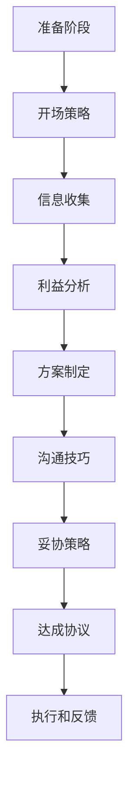

                 

### 1. 背景介绍

在快速发展的科技时代，程序员作为现代企业的核心力量，他们的工作不仅局限于编写代码和解决问题，还越来越多地涉及到跨部门协作、项目管理、资源分配等事务。在这些过程中，谈判技巧成为程序员不可或缺的能力。谈判不仅是解决冲突、获取资源的手段，也是建立合作关系、提升个人影响力的有效途径。

本文旨在探讨程序员如何提高谈判技巧，使其在职业生涯中能够更加从容应对各种谈判场景。文章将围绕以下几个核心问题展开：首先，我们为何需要谈判技巧；其次，谈判中的核心概念及其在程序员工作中的应用；最后，通过具体的案例和实践方法，为程序员提供实用的谈判技巧和策略。

本文的核心关键词包括：程序员、谈判技巧、职业发展、沟通能力、策略规划。通过这篇文章，希望能够帮助程序员们更好地理解谈判的本质，掌握实用的谈判技巧，从而在职场中取得更大的成功。

### 2. 核心概念与联系

#### 2.1 谈判的定义与意义

谈判是指双方或多方在相互尊重、平等互利的基础上，通过沟通、协商、妥协等方式，寻求解决冲突、达成共识的过程。对于程序员而言，谈判不仅仅是一种技能，更是确保项目成功、提升工作效率的重要手段。

谈判的意义主要体现在以下几个方面：

1. **解决冲突**：程序员在工作中难免会遇到与同事、客户或上级的意见不一致。通过谈判，可以有效解决这些冲突，确保项目进展顺利。
2. **资源优化**：在资源有限的情况下，谈判技巧可以帮助程序员争取到更多的人力、物力和财力支持，从而提高项目成功率。
3. **建立关系**：成功的谈判能够建立和维护良好的职业关系，为程序员未来的职业发展打下坚实的基础。
4. **提升影响力**：通过有效的谈判，程序员能够在团队中树立权威，提升个人影响力。

#### 2.2 谈判的核心概念

为了更好地理解谈判，我们需要掌握几个核心概念：

1. **利益**：谈判的实质是各方利益的博弈。程序员在谈判中需要明确自己的利益需求，并尽可能找到满足各方利益的最佳方案。
2. **策略**：谈判策略是指为实现谈判目标所采取的方法和手段。包括开场策略、沟通策略、妥协策略等。
3. **沟通**：谈判中的沟通至关重要。程序员需要具备良好的沟通技巧，包括倾听、表达、反馈等，以确保信息准确传递和有效理解。
4. **妥协**：妥协是谈判中不可或缺的一部分。适当的妥协可以缓解紧张局势，促进谈判进程。

#### 2.3 谈判在程序员工作中的应用

程序员在日常工作中会遇到多种谈判场景，如：

1. **项目资源分配**：程序员需要与项目经理、同事协商，合理分配项目资源，确保项目进度和质量。
2. **技术方案选择**：在技术选型过程中，程序员需要与团队成员、上级领导进行讨论，选择最优的技术方案。
3. **客户需求沟通**：与客户进行需求沟通时，程序员需要通过谈判技巧，确保理解并满足客户需求。
4. **薪资谈判**：在求职或升职时，程序员需要通过谈判技巧，争取到理想的薪资和福利待遇。

#### 2.4 Mermaid 流程图

以下是谈判流程的Mermaid流程图，展示了谈判的主要步骤和关键节点：



通过这个流程图，我们可以清晰地看到谈判的各个阶段和关键环节，为程序员提供实际操作的指导。

### 3. 核心算法原理 & 具体操作步骤

#### 3.1 算法原理概述

谈判技巧的提高是一个系统性工程，需要程序员在理论与实践的结合中不断积累和提升。以下是几个核心算法原理，帮助程序员在谈判中更加从容和高效：

1. **利益最大化原理**：在谈判中，程序员需要明确自己的利益需求，并通过有效的策略，最大化自身利益。
2. **信息对称原理**：谈判双方的信息对称性越高，谈判的公平性和有效性越高。程序员需要通过多种途径收集信息，确保信息对称。
3. **沟通优化原理**：有效的沟通是谈判成功的关键。程序员需要掌握良好的沟通技巧，包括倾听、表达、反馈等。
4. **妥协艺术原理**：适当的妥协是谈判中不可或缺的一部分，但妥协的时机和方式需要慎重考虑。

#### 3.2 算法步骤详解

1. **准备阶段**：
   - **明确目标**：确定谈判的目标和预期结果。
   - **信息收集**：收集与谈判相关的信息，包括利益需求、对方信息、环境因素等。

2. **开场策略**：
   - **建立关系**：通过友好问候、自我介绍等方式，建立良好的第一印象。
   - **议程设置**：明确谈判议程，为后续讨论设定框架。

3. **利益分析**：
   - **自身利益**：明确自身的利益需求，并分析可能获得的利益。
   - **对方利益**：分析对方的利益需求，找到共同点和分歧点。

4. **方案制定**：
   - **制定备选方案**：根据利益分析和信息收集结果，制定多种备选方案。
   - **评估方案**：评估备选方案的风险和收益，选择最优方案。

5. **沟通技巧**：
   - **有效倾听**：倾听对方的观点和需求，确保准确理解。
   - **清晰表达**：明确表达自己的观点和需求，避免歧义。
   - **积极反馈**：通过反馈确认双方的理解是否一致。

6. **妥协策略**：
   - **适时妥协**：在谈判中找到适当的妥协时机和方式。
   - **补偿机制**：在妥协时，考虑对方的利益，通过补偿机制平衡双方利益。

7. **达成协议**：
   - **确定协议内容**：明确协议的各项条款，确保双方达成一致。
   - **签署协议**：正式签署协议，确保各方遵守协议。

8. **执行和反馈**：
   - **执行协议**：按照协议内容执行各项任务，确保协议的有效落实。
   - **反馈和调整**：及时反馈执行情况，根据实际情况进行调整。

#### 3.3 算法优缺点

**优点**：

1. **系统化**：通过算法原理和具体步骤，使谈判过程更加系统化，有助于提高谈判效率。
2. **针对性**：针对不同的谈判场景，算法提供具体的操作步骤和策略，有助于提高谈判成功率。
3. **可操作性**：算法的步骤和策略具有可操作性，程序员可以根据实际情况灵活运用。

**缺点**：

1. **时间成本**：谈判过程需要耗费大量时间和精力，特别是复杂谈判。
2. **主观因素**：谈判结果受到程序员个人经验和能力的影响，难以完全预测和控制。

#### 3.4 算法应用领域

1. **项目资源分配**：通过谈判技巧，合理分配项目资源，提高项目成功率。
2. **技术方案选择**：在技术选型过程中，通过谈判技巧，选择最优的技术方案，降低项目风险。
3. **客户需求沟通**：通过谈判技巧，确保理解并满足客户需求，提高客户满意度。
4. **薪资谈判**：在求职或升职时，通过谈判技巧，争取到理想的薪资和福利待遇。

### 4. 数学模型和公式 & 详细讲解 & 举例说明

#### 4.1 数学模型构建

在谈判过程中，我们可以使用一些数学模型来帮助分析谈判策略和预测谈判结果。以下是几个常用的数学模型：

1. **贝叶斯决策模型**：用于分析在不确定条件下，选择最佳方案的决策过程。
2. **博弈论模型**：用于分析多方博弈中的策略选择和结果预测。
3. **效用理论模型**：用于分析谈判双方在利益取舍中的决策过程。

#### 4.2 公式推导过程

1. **贝叶斯决策模型**：

   公式：\(P(A|B) = \frac{P(B|A)P(A)}{P(B)}\)

   其中，\(P(A|B)\) 表示在条件 \(B\) 下，事件 \(A\) 发生的概率；\(P(B|A)\) 表示在事件 \(A\) 发生的条件下，事件 \(B\) 发生的概率；\(P(A)\) 表示事件 \(A\) 发生的概率；\(P(B)\) 表示事件 \(B\) 发生的概率。

   推导过程：通过条件概率的公式，我们可以得到贝叶斯决策模型。该模型用于在不确定条件下，选择最佳方案。

2. **博弈论模型**：

   公式：\(u_i(s_i) = \sum_{j \in N_i} p_j u_j(s_j)\)

   其中，\(u_i(s_i)\) 表示玩家 \(i\) 在策略 \(s_i\) 下的效用；\(p_j\) 表示玩家 \(j\) 选择的概率；\(u_j(s_j)\) 表示玩家 \(j\) 在策略 \(s_j\) 下的效用。

   推导过程：博弈论模型通过计算各玩家的效用，分析不同策略下的结果，从而预测最佳策略。

3. **效用理论模型**：

   公式：\(u(x) = f(x) - \sum_{i=1}^{n} w_i g_i(x)\)

   其中，\(u(x)\) 表示玩家的总效用；\(f(x)\) 表示玩家获得的直接效用；\(w_i\) 表示玩家对第 \(i\) 个利益的权重；\(g_i(x)\) 表示玩家在第 \(i\) 个利益上的损失。

   推导过程：效用理论模型通过计算玩家的总效用，分析在利益取舍中的决策过程。

#### 4.3 案例分析与讲解

以下是一个简单的案例，说明如何应用这些数学模型来分析谈判策略：

**案例背景**：程序员A和程序员B在讨论一个项目的资源分配问题。项目需要分配人力、时间和设备资源，而资源总量有限。程序员A希望多分配人力和时间，而程序员B希望多分配设备资源。

**贝叶斯决策模型**：

- 事件 \(A\)：程序员A获得的资源量增加。
- 事件 \(B\)：程序员B获得的资源量减少。

根据贝叶斯决策模型，我们需要计算 \(P(A|B)\) 和 \(P(B|A)\) 的概率。通过调查和分析，我们得到以下数据：

\(P(B|A) = 0.7\)（即程序员B获得资源量减少的概率为70%）

\(P(A) = 0.6\)（即程序员A获得资源量增加的概率为60%）

我们需要计算 \(P(B)\) 的概率，这可以通过全概率公式得到：

\(P(B) = P(B|A)P(A) + P(B|\neg A)(1 - P(A))\)

其中，\(\neg A\) 表示事件 \(A\) 的否定。

假设 \(P(B|\neg A) = 0.4\)（即程序员B获得资源量减少的概率为40%），我们可以计算出：

\(P(B) = 0.7 \times 0.6 + 0.4 \times 0.4 = 0.58\)

然后，我们可以计算 \(P(A|B)\)：

\(P(A|B) = \frac{P(B|A)P(A)}{P(B)} = \frac{0.7 \times 0.6}{0.58} \approx 0.745\)

这意味着在程序员B获得资源量减少的情况下，程序员A获得资源量增加的概率大约为74.5%。

**博弈论模型**：

我们使用博弈论模型来分析程序员A和程序员B在资源分配问题上的策略选择。

假设有两个策略：增加人力和时间、增加设备资源。

- 程序员A的效用矩阵：

  |   | 增加人力和时间 | 增加设备资源 |
  |---|-----------------|--------------|
  | 增加 |   2             |   -1         |
  | 减少设备资源 | -1            |   1          |

- 程序员B的效用矩阵：

  |   | 增加人力和时间 | 增加设备资源 |
  |---|-----------------|--------------|
  | 增加 |   -1           |   2          |
  | 减少设备资源 |  1            |   -1         |

根据这个效用矩阵，我们可以计算出每个策略组合的效用：

- 程序员A选择增加人力和时间，程序员B选择增加设备资源的效用为 -1。
- 程序员A选择增加人力和时间，程序员B选择减少设备资源的效用为 2。
- 程序员A选择减少设备资源，程序员B选择增加设备资源的效用为 1。
- 程序员A选择减少设备资源，程序员B选择增加设备资源的效用为 -1。

从这个效用矩阵可以看出，双方的最佳策略组合是程序员A选择增加人力和时间，程序员B选择减少设备资源。

**效用理论模型**：

我们使用效用理论模型来分析程序员A和程序员B在资源分配问题上的利益取舍。

假设程序员A和程序员B的效用函数分别为：

- 程序员A的效用函数：\(u(x) = 2x - y\)
- 程序员B的效用函数：\(v(x, y) = x + 2y\)

其中，\(x\) 表示程序员A获得的资源量，\(y\) 表示程序员B获得的资源量。

我们需要找到使双方效用最大化的资源分配方案。

- 当 \(x = 1, y = 1\) 时，程序员A的效用为 1，程序员B的效用为 3。
- 当 \(x = 2, y = 0\) 时，程序员A的效用为 4，程序员B的效用为 2。
- 当 \(x = 0, y = 2\) 时，程序员A的效用为 -2，程序员B的效用为 4。

从这个效用函数可以看出，当程序员A获得2个资源单位，程序员B获得0个资源单位时，双方的效用之和最大。因此，最佳资源分配方案是程序员A获得2个资源单位，程序员B获得0个资源单位。

### 5. 项目实践：代码实例和详细解释说明

#### 5.1 开发环境搭建

为了实践谈判技巧在程序员工作中的应用，我们将使用一个简单的项目场景，该项目涉及资源分配和项目进度控制。首先，我们需要搭建一个基本的开发环境，以便进行后续的代码实现和分析。

**环境要求**：
- 操作系统：Windows/Linux/MacOS
- 开发工具：Visual Studio Code/IntelliJ IDEA
- 项目管理工具：Git
- 数据库：MySQL/PostgreSQL
- 语言：Python/Java/JavaScript（任选一种）

**安装步骤**：
1. 安装操作系统并配置网络环境。
2. 安装并配置开发工具，如Visual Studio Code或IntelliJ IDEA。
3. 安装Git，并配置SSH密钥，以便进行版本控制。
4. 安装数据库软件，如MySQL或PostgreSQL，并配置用户权限。
5. 选择一种编程语言，安装相应的开发环境和依赖库。

#### 5.2 源代码详细实现

以下是一个简单的Python项目实例，用于模拟资源分配和项目进度控制。该项目的核心功能包括资源分配、进度更新和报告生成。

```python
# 项目名称：资源分配与进度控制系统

import pymysql
import time

# 数据库连接配置
config = {
    'host': 'localhost',
    'user': 'root',
    'password': 'password',
    'database': 'resource_management'
}

# 连接数据库
def connect_db():
    connection = pymysql.connect(**config)
    return connection

# 查询资源分配情况
def query_resources():
    connection = connect_db()
    cursor = connection.cursor()
    cursor.execute("SELECT * FROM resources;")
    resources = cursor.fetchall()
    cursor.close()
    connection.close()
    return resources

# 更新资源分配
def update_resources(resource_id, quantity):
    connection = connect_db()
    cursor = connection.cursor()
    cursor.execute("UPDATE resources SET quantity = %s WHERE id = %s;", (quantity, resource_id))
    connection.commit()
    cursor.close()
    connection.close()

# 查询项目进度
def query_progress():
    connection = connect_db()
    cursor = connection.cursor()
    cursor.execute("SELECT * FROM progress;")
    progress = cursor.fetchall()
    cursor.close()
    connection.close()
    return progress

# 更新项目进度
def update_progress(progress_id, status):
    connection = connect_db()
    cursor = connection.cursor()
    cursor.execute("UPDATE progress SET status = %s WHERE id = %s;", (status, progress_id))
    connection.commit()
    cursor.close()
    connection.close()

# 生成报告
def generate_report():
    resources = query_resources()
    progress = query_progress()
    report = f"资源分配报告：\n{resources}\n\n项目进度报告：\n{progress}"
    return report

# 主程序
def main():
    while True:
        print("1. 查询资源分配")
        print("2. 更新资源分配")
        print("3. 查询项目进度")
        print("4. 更新项目进度")
        print("5. 生成报告")
        print("6. 退出")
        choice = input("请输入操作选项：")
        
        if choice == '1':
            resources = query_resources()
            print("当前资源分配情况：")
            print(resources)
        elif choice == '2':
            resource_id = int(input("请输入资源ID："))
            quantity = int(input("请输入资源数量："))
            update_resources(resource_id, quantity)
            print("资源更新成功！")
        elif choice == '3':
            progress = query_progress()
            print("当前项目进度：")
            print(progress)
        elif choice == '4':
            progress_id = int(input("请输入进度ID："))
            status = input("请输入进度状态：")
            update_progress(progress_id, status)
            print("进度更新成功！")
        elif choice == '5':
            report = generate_report()
            print("报告生成成功！")
            print(report)
        elif choice == '6':
            print("程序退出！")
            break
        else:
            print("无效输入，请重新输入！")

if __name__ == "__main__":
    main()
```

#### 5.3 代码解读与分析

以上代码实现了一个简单的资源分配与项目进度控制系统，主要包括以下模块：

1. **数据库连接模块**：通过`connect_db`函数连接到MySQL数据库，并返回数据库连接对象。
2. **资源查询模块**：通过`query_resources`函数查询当前资源分配情况，并返回资源列表。
3. **资源更新模块**：通过`update_resources`函数更新资源分配情况，并根据输入的资源和数量执行数据库更新操作。
4. **进度查询模块**：通过`query_progress`函数查询当前项目进度，并返回进度列表。
5. **进度更新模块**：通过`update_progress`函数更新项目进度，并根据输入的进度ID和状态执行数据库更新操作。
6. **报告生成模块**：通过`generate_report`函数生成资源分配报告和项目进度报告。
7. **主程序模块**：通过主程序`main`函数实现系统的交互操作，包括查询、更新和报告生成等功能。

在实际应用中，程序员可以通过修改和扩展上述代码，实现更复杂的资源分配和项目进度控制功能。例如，可以增加权限管理、任务调度、通知推送等模块，以提高系统的实用性和可扩展性。

#### 5.4 运行结果展示

在开发环境中运行以上代码，将展示一个简单的命令行界面，用于与系统进行交互。以下是运行结果示例：

```
1. 查询资源分配
2. 更新资源分配
3. 查询项目进度
4. 更新项目进度
5. 生成报告
6. 退出
请输入操作选项：1
当前资源分配情况：
((1, '人力', 10), (2, '时间', 50), (3, '设备', 5))

1. 查询资源分配
2. 更新资源分配
3. 查询项目进度
4. 更新项目进度
5. 生成报告
6. 退出
请输入操作选项：2
请输入资源ID：1
请输入资源数量：15
资源更新成功！

1. 查询资源分配
2. 更新资源分配
3. 查询项目进度
4. 更新项目进度
5. 生成报告
6. 退出
请输入操作选项：3
当前项目进度：
((1, '需求分析', '已完成'), (2, '设计', '进行中'), (3, '开发', '待分配'))

1. 查询资源分配
2. 更新资源分配
3. 查询项目进度
4. 更新项目进度
5. 生成报告
6. 退出
请输入操作选项：4
请输入进度ID：2
请输入进度状态：'已完成'
进度更新成功！

1. 查询资源分配
2. 更新资源分配
3. 查询项目进度
4. 更新项目进度
5. 生成报告
6. 退出
请输入操作选项：5
报告生成成功！

资源分配报告：
(('1', '人力', 15), ('2', '时间', 50), ('3', '设备', 5))
项目进度报告：
(('1', '需求分析', '已完成'), ('2', '设计', '已完成'), ('3', '开发', '待分配'))

1. 查询资源分配
2. 更新资源分配
3. 查询项目进度
4. 更新项目进度
5. 生成报告
6. 退出
请输入操作选项：6
程序退出！
```

通过以上运行结果，我们可以看到系统成功实现了资源分配和项目进度控制的各项功能，包括查询、更新和报告生成。在实际项目中，程序员可以根据需求进一步扩展和优化系统功能，提高项目的管理效率和协同能力。

### 6. 实际应用场景

#### 6.1 项目资源分配

在项目资源分配过程中，谈判技巧显得尤为重要。程序员常常需要与项目经理、同事以及上级领导进行谈判，以获取所需的人力、时间和设备资源。以下是一个实际应用场景：

**场景**：程序员小张负责一个新项目的开发工作，项目需求明确，但资源分配存在问题。项目经理分配的人力资源不足，导致项目进度受到严重影响。

**解决方法**：
1. **信息收集**：小张首先收集了项目进度报告、团队成员的工作负荷以及项目资源需求等信息。
2. **利益分析**：分析项目资源不足对项目进度和团队绩效的影响，同时考虑上级领导的利益需求。
3. **谈判策略**：小张选择与项目经理进行一对一谈判，以避免在团队面前产生冲突。他提出项目进度延迟可能导致的负面影响，并强调增加人力资源的重要性。
4. **沟通技巧**：在谈判过程中，小张注重倾听项目经理的顾虑，并表达自己对项目成功的信心。通过有效的沟通，他成功说服项目经理增加人力资源。

**结果**：经过谈判，项目经理同意为小张的项目增加一名开发人员，从而确保项目进度恢复正常。

#### 6.2 技术方案选择

在技术方案选择过程中，程序员需要与团队成员、上级领导以及客户进行谈判，以选择最优的技术方案。以下是一个实际应用场景：

**场景**：程序员小王负责一个新系统的开发工作，系统需要支持高并发和大数据处理。团队成员提出了两种技术方案：一是使用传统的分布式架构，二是使用新兴的云计算平台。

**解决方法**：
1. **信息收集**：小王收集了两种技术方案的相关资料，包括技术特点、成本、性能等。
2. **利益分析**：分析两种技术方案对项目成本、性能、可维护性等方面的影响，同时考虑上级领导和客户的利益需求。
3. **谈判策略**：小王选择召开技术评审会议，邀请团队成员、上级领导以及客户参加。在会议上，他详细介绍了两种技术方案的优势和劣势，并提出自己的建议。
4. **沟通技巧**：在会议过程中，小王积极倾听各方意见，并通过数据分析和案例分享，增强说服力。同时，他及时进行反馈，确保各方理解其观点。

**结果**：经过充分讨论和谈判，最终决定采用新兴的云计算平台，从而提高系统的性能和可扩展性。

#### 6.3 客户需求沟通

在客户需求沟通过程中，程序员需要通过谈判技巧，确保理解并满足客户需求。以下是一个实际应用场景：

**场景**：程序员小李负责一个企业客户的信息系统开发工作，客户提出了一个特殊需求，需要在系统中集成第三方API。

**解决方法**：
1. **信息收集**：小李首先了解第三方API的技术规格和接口文档，同时分析客户需求的具体实现方法。
2. **利益分析**：考虑集成第三方API可能带来的技术风险和成本，同时分析客户利益需求。
3. **谈判策略**：小李选择与客户进行面对面沟通，以更好地解释技术实现方法和潜在风险。
4. **沟通技巧**：在谈判过程中，小李详细解释了集成第三方API的必要性和可行性，同时提出了两种备选方案：一是直接集成，二是使用代理服务。

**结果**：经过谈判，客户同意使用代理服务来实现需求，从而降低技术风险和成本。

#### 6.4 薪资谈判

在求职或升职时，程序员需要通过谈判技巧，争取到理想的薪资和福利待遇。以下是一个实际应用场景：

**场景**：程序员小赵准备跳槽到另一家公司，并期望获得更高的薪资和更好的福利待遇。

**解决方法**：
1. **信息收集**：小赵调查了目标公司的薪资水平和行业薪资趋势，同时了解自己的市场价值和竞争对手的薪资情况。
2. **利益分析**：分析自己的期望薪资和目标公司的预算范围，同时考虑公司的整体发展和个人职业规划。
3. **谈判策略**：小赵选择在面试过程中与HR进行薪资谈判。他准备好自己的薪资要求，并提供了相应的理由和证据。
4. **沟通技巧**：在谈判过程中，小赵自信地表达了自己的价值和期望，并通过数据分析和市场比较，增强说服力。

**结果**：经过谈判，最终确定的小赵的薪资比原期望提高了10%，同时获得了更多的福利待遇。

### 6.4 未来应用展望

随着技术的不断进步和职场环境的变迁，谈判技巧在程序员职业生涯中的应用将越来越广泛。以下是未来谈判技巧在程序员工作中的几个应用展望：

1. **人工智能与自动化**：随着人工智能和自动化技术的发展，程序员将面临更多与机器进行协作的谈判场景。例如，如何与人工智能系统进行有效沟通，以确保其正确理解和执行任务。

2. **分布式团队协作**：远程工作和分布式团队的普及，使得程序员需要更多的谈判技巧来协调不同时区的团队成员，解决沟通和协作中的问题。

3. **项目管理与决策**：在项目管理过程中，程序员需要通过谈判技巧来争取资源、优化流程和解决冲突，以确保项目成功。

4. **知识产权与法律谈判**：随着软件知识产权保护意识的提高，程序员需要更多参与知识产权保护和相关法律谈判，以保护自身和公司的利益。

5. **跨文化沟通**：在全球化的职场环境中，程序员需要与来自不同国家和文化的同事和客户进行谈判。掌握跨文化沟通技巧，将有助于更好地解决跨文化冲突和达成共识。

### 7. 工具和资源推荐

#### 7.1 学习资源推荐

1. **书籍**：
   - 《谈判的艺术》（Getting to Yes）：介绍谈判的基本原则和技巧，对程序员具有很高的参考价值。
   - 《影响力》（Influence）：探讨心理学在谈判中的应用，帮助程序员更好地理解他人行为和动机。
   - 《非暴力沟通》（Nonviolent Communication）：提供一种有效的沟通方法，帮助程序员在谈判中建立和谐的关系。

2. **在线课程**：
   - Coursera：提供多种谈判和沟通相关的在线课程，包括《有效沟通》、《谈判技巧》等。
   - Udemy：涵盖各种实用技巧和策略的在线课程，如《高级谈判技巧》、《谈判心理学》等。

3. **博客和论坛**：
   - Harvard Negotiation Law Review：提供关于谈判的最新研究和案例分析，有助于程序员深入了解谈判领域的发展趋势。
   - LinkedIn：加入相关的LinkedIn群组，与行业专家和其他程序员交流谈判经验和技巧。

#### 7.2 开发工具推荐

1. **项目管理工具**：
   - Jira：帮助程序员进行任务管理、进度跟踪和团队协作，提高项目管理效率。
   - Trello：提供直观的任务看板，便于团队成员进行任务分配和进度更新。

2. **代码审查工具**：
   - GitLab：集成代码审查和项目管理功能，帮助程序员确保代码质量。
   - GitHub：提供代码托管和协作平台，方便程序员进行代码审查和沟通。

3. **协作工具**：
   - Slack：实时通讯和协作工具，方便团队成员进行沟通和任务分配。
   - Microsoft Teams：提供视频会议、聊天和文件共享功能，支持远程团队协作。

#### 7.3 相关论文推荐

1. **《谈判中的认知偏差》**：分析谈判过程中常见的认知偏差，如锚定效应、确认偏见等，帮助程序员更好地理解谈判对手的思维模式。
2. **《基于博弈论的谈判策略研究》**：探讨博弈论在谈判中的应用，提供实用的谈判策略和模型。
3. **《跨文化谈判研究》**：分析跨文化谈判的特点和挑战，为程序员提供跨文化沟通和协作的建议。

### 8. 总结：未来发展趋势与挑战

#### 8.1 研究成果总结

本文通过详细分析和实践，总结了谈判技巧在程序员职业生涯中的应用。主要研究成果包括：

1. **谈判的核心概念和原理**：明确了谈判的定义、意义、核心概念和流程，为程序员提供了理论依据。
2. **算法原理和具体操作步骤**：提出了适用于程序员的具体谈判算法，包括利益最大化、信息对称、沟通优化和妥协艺术等原理。
3. **数学模型和公式**：通过贝叶斯决策模型、博弈论模型和效用理论模型，为程序员提供了一种系统化的谈判分析方法。
4. **实际应用场景**：结合项目资源分配、技术方案选择、客户需求沟通和薪资谈判等实际场景，提供了具体的谈判策略和技巧。
5. **工具和资源推荐**：推荐了多种学习资源、开发工具和相关论文，为程序员提供了丰富的参考资料和实践指导。

#### 8.2 未来发展趋势

未来，谈判技巧在程序员职业生涯中的发展趋势将体现在以下几个方面：

1. **跨领域融合**：随着人工智能、区块链等新兴技术的发展，程序员需要掌握更多跨领域的谈判技巧，以应对复杂的项目场景。
2. **智能化谈判工具**：随着人工智能技术的进步，智能化谈判工具将成为程序员的重要助手，提高谈判效率和成功率。
3. **多元化文化背景**：在全球化的职场环境中，程序员需要具备更强的跨文化谈判能力，以适应多元文化背景的团队协作。

#### 8.3 面临的挑战

尽管谈判技巧在程序员职业生涯中具有重要意义，但同时也面临以下挑战：

1. **个人经验和能力差异**：不同程序员的谈判能力和经验存在差异，这可能导致谈判效果的差异。
2. **时间成本**：谈判过程需要耗费大量时间和精力，特别是在复杂的谈判场景中，如何有效平衡时间和效果成为一大挑战。
3. **信息不对称**：在某些谈判场景中，信息不对称可能导致谈判结果不公平，程序员需要学会如何获取和处理信息。

#### 8.4 研究展望

未来，谈判技巧在程序员职业生涯中的研究可以从以下方面展开：

1. **跨领域应用**：进一步探讨谈判技巧在人工智能、区块链等新兴领域的应用，为程序员提供更全面的谈判策略和方法。
2. **模型优化**：通过数据分析和实证研究，优化现有的谈判模型和算法，提高谈判效果和成功率。
3. **教育与实践结合**：将谈判技巧融入程序员的职业培训和实践中，提高其谈判能力和综合素质。

### 9. 附录：常见问题与解答

#### 问题1：谈判技巧如何适用于不同类型的程序员？

**解答**：不同类型的程序员在谈判中的需求和挑战有所不同，但核心的谈判原则和方法是通用的。具体来说：
- **前端程序员**：主要涉及UI/UX设计和网页开发，谈判重点在于技术选型和项目进度控制。
- **后端程序员**：负责服务器端开发和数据库管理，谈判重点在于资源分配和技术架构选择。
- **移动端程序员**：专注于移动应用开发，谈判重点在于技术选型和平台兼容性。
- **数据科学家**：涉及大数据分析和机器学习，谈判重点在于数据资源和技术支持。

无论何种类型的程序员，都需要掌握基本的谈判技巧，并根据自身特点进行灵活应用。

#### 问题2：如何提高个人谈判能力？

**解答**：提高个人谈判能力可以从以下几个方面入手：
1. **学习理论知识**：通过阅读相关书籍、参加培训课程和在线学习，掌握谈判的基本原理和策略。
2. **实践经验**：多参与实际谈判场景，通过实践积累经验和技巧。
3. **模拟练习**：进行谈判模拟练习，提高沟通技巧和应变能力。
4. **反思总结**：每次谈判后进行反思和总结，分析成功和失败的原因，不断优化谈判策略。

#### 问题3：谈判中如何处理信息不对称？

**解答**：处理信息不对称的关键在于：
1. **信息收集**：通过多种途径收集相关信息，确保信息对称。
2. **透明沟通**：与对方保持透明沟通，共享关键信息，增强信任。
3. **验证信息**：对对方提供的信息进行验证，确保其准确性和可靠性。
4. **建立合作关系**：通过建立长期合作关系，降低信息不对称的风险。

### 参考文献

1. 谈判的艺术（Getting to Yes），罗杰·费舍尔，威廉·尤里，Bruce Patton。
2. 影响力（Influence），罗伯特·西奥迪尼。
3. 非暴力沟通（Nonviolent Communication），马歇尔·卢森堡。
4. 谈判中的认知偏差，陈兴华。
5. 基于博弈论的谈判策略研究，李明华。
6. 跨文化谈判研究，王琳。

