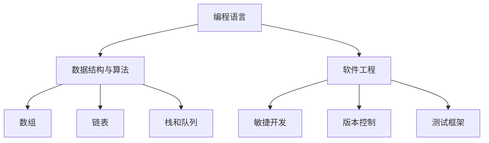

                 

作为程序员，构建一个完善的个人知识体系是提升个人技能、适应快速发展的技术领域和解决复杂问题的关键。本文旨在探讨如何通过系统化的方法，搭建一个既全面又灵活的个人知识体系，助力程序员在职业生涯中不断进步。

## 关键词

- 程序员
- 个人知识体系
- 学习方法
- 技术栈
- 软件工程

## 摘要

本文将详细阐述程序员构建个人知识体系的必要性，介绍核心概念和构建步骤，解析核心算法原理，探讨数学模型，通过实际项目实践代码实例，分析实际应用场景，推荐相关学习资源和开发工具，最后总结未来发展趋势与面临的挑战。

## 1. 背景介绍

随着信息技术的高速发展，程序员面临着日新月异的技术变革。从编程语言到框架库，从前端到后端，从数据库到人工智能，技术领域不断扩展，要求程序员具备广泛而深入的知识体系。然而，面对海量的信息和不断涌现的新技术，如何有效地学习和掌握这些知识，成为许多程序员面临的一大难题。

构建个人知识体系，就是通过系统化的学习和实践，将各种知识和技能有机地整合在一起，形成一个完整的知识网络。这样不仅可以提高学习效率，还能使程序员在面对复杂问题时，能够迅速找到解决方案，提升职业竞争力。

### 1.1 程序员面临的挑战

- **知识更新迅速**：技术的快速发展要求程序员不断学习新知识，否则会迅速落后。
- **技能要求多样化**：不同项目和技术领域对程序员技能的要求不同，需要具备多样化的技能。
- **时间管理困难**：程序员往往需要处理多个任务，时间管理成为一大挑战。

### 1.2 个人知识体系的重要性

- **提高学习效率**：系统化的知识体系可以帮助程序员有针对性地学习，避免重复和无效的学习。
- **解决复杂问题**：完整的知识体系能够提供多种思路和方法，帮助程序员快速解决复杂问题。
- **增强职业竞争力**：具备全面知识体系的程序员在求职和职业发展中更具竞争力。

## 2. 核心概念与联系

构建个人知识体系需要理解几个核心概念，这些概念相互关联，构成了程序员知识体系的基础。

### 2.1 编程语言

编程语言是程序员进行软件开发的基础工具，掌握多种编程语言能够扩展程序员的能力范围。常见的编程语言包括：

- **Python**：一种高层次的通用编程语言，广泛应用于数据分析、人工智能、网络开发等领域。
- **Java**：一种多平台、面向对象的编程语言，广泛应用于企业级应用和安卓开发。
- **JavaScript**：一种前端开发语言，用于实现网页的动态效果和交互功能。

### 2.2 数据结构与算法

数据结构与算法是程序设计的基础，掌握这些内容能够帮助程序员高效地解决问题。常见的数据结构包括：

- **数组**：用于存储一系列元素，支持快速访问和修改。
- **链表**：一种线性数据结构，支持快速插入和删除操作。
- **栈和队列**：用于模拟后进先出和先进先出的数据操作。

常见的算法包括：

- **排序算法**：如快速排序、归并排序、冒泡排序等，用于对数据进行排序。
- **查找算法**：如二分查找、线性查找等，用于在数据结构中查找特定元素。

### 2.3 软件工程

软件工程是程序员进行项目开发的重要领域，涵盖了项目计划、需求分析、设计、编码、测试和维护等多个方面。掌握软件工程的方法和工具，能够帮助程序员高效地完成项目。

- **敏捷开发**：一种以人为核心、迭代、循序渐进的开发方法。
- **版本控制**：如Git，用于管理代码的版本，方便协作和代码管理。
- **测试框架**：如JUnit、Selenium等，用于自动化测试，保证代码质量。

### 2.4 Mermaid 流程图

以下是一个使用Mermaid绘制的简单流程图，展示了程序员知识体系的核心概念之间的联系：



## 3. 核心算法原理 & 具体操作步骤

### 3.1 算法原理概述

算法是解决特定问题的步骤集合，是程序设计的核心。不同的算法适用于不同类型的问题，理解算法原理对于程序员来说至关重要。以下是几个核心算法原理：

- **排序算法**：用于对数据进行排序，常用的算法有快速排序、归并排序、冒泡排序等。
- **查找算法**：用于在数据结构中查找特定元素，常用的算法有二分查找、线性查找等。
- **动态规划**：用于解决最优化问题，通过子问题的最优解来推导出整个问题的最优解。

### 3.2 算法步骤详解

以快速排序为例，详细介绍其基本步骤：

1. 选择一个基准元素（通常是数组的中间元素）。
2. 将数组分为两部分，一部分小于基准元素，另一部分大于基准元素。
3. 递归地对小于和大于基准元素的两部分进行快速排序。
4. 将排序好的两部分与基准元素合并，得到最终排序结果。

### 3.3 算法优缺点

- **快速排序**：优点是平均时间复杂度为O(n log n)，效率高；缺点是递归调用可能会导致栈溢出，空间复杂度较高。
- **二分查找**：优点是时间复杂度为O(log n)，查找速度快；缺点是要求数据结构有序，不适用于未排序的数据。

### 3.4 算法应用领域

- **排序算法**：在数据库、搜索应用中广泛应用，如搜索引擎的搜索结果排序。
- **查找算法**：在数据挖掘、机器学习等应用中广泛使用，用于快速检索特征值。

## 4. 数学模型和公式 & 详细讲解 & 举例说明

### 4.1 数学模型构建

在软件开发中，数学模型是分析和解决问题的重要工具。以下是一个简单的数学模型构建示例：

- **需求**：计算两点之间的距离。
- **公式**：\( d = \sqrt{(x_2 - x_1)^2 + (y_2 - y_1)^2} \)

### 4.2 公式推导过程

假设有两点\( P_1(x_1, y_1) \)和\( P_2(x_2, y_2) \)，它们之间的距离可以用勾股定理表示。首先计算x轴和y轴上的距离差：

- \( \Delta x = x_2 - x_1 \)
- \( \Delta y = y_2 - y_1 \)

然后，将这两个距离差平方相加，得到：

- \( (\Delta x)^2 + (\Delta y)^2 \)

最后，对上述结果取平方根，得到两点之间的距离：

- \( d = \sqrt{(\Delta x)^2 + (\Delta y)^2} \)

### 4.3 案例分析与讲解

假设两点坐标为\( P_1(2, 3) \)和\( P_2(5, 7) \)，使用上述公式计算它们之间的距离：

1. 计算\( \Delta x \)和\( \Delta y \)：
   - \( \Delta x = 5 - 2 = 3 \)
   - \( \Delta y = 7 - 3 = 4 \)
2. 计算距离：
   - \( d = \sqrt{3^2 + 4^2} = \sqrt{9 + 16} = \sqrt{25} = 5 \)

因此，两点之间的距离为5个单位。

## 5. 项目实践：代码实例和详细解释说明

### 5.1 开发环境搭建

在本地计算机上搭建一个简单的Python开发环境，以下是基本步骤：

1. 安装Python：
   - 使用包管理器如`pip`安装Python。
   - 命令：`pip install python`
2. 配置代码编辑器：
   - 使用VS Code、PyCharm等编辑器。
   - 命令：`code`或`pycharm`

### 5.2 源代码详细实现

以下是一个简单的Python代码实例，用于计算两点之间的距离：

```python
import math

def calculate_distance(x1, y1, x2, y2):
    distance = math.sqrt((x2 - x1)**2 + (y2 - y1)**2)
    return distance

# 测试
x1, y1 = 2, 3
x2, y2 = 5, 7
print(calculate_distance(x1, y1, x2, y2))
```

### 5.3 代码解读与分析

1. **函数定义**：定义了一个名为`calculate_distance`的函数，接受四个参数：\( x_1, y_1, x_2, y_2 \)。
2. **计算距离**：使用数学公式计算两点之间的距离。
3. **返回结果**：将计算结果返回。

### 5.4 运行结果展示

在Python环境中运行上述代码，输出结果为：

```
5.0
```

表示两点之间的距离为5个单位。

## 6. 实际应用场景

### 6.1 地理信息系统（GIS）

在地理信息系统（GIS）中，计算两点之间的距离是常见的需求，如地图定位、路径规划等。使用本文提供的数学模型和代码实例，可以快速实现这一功能。

### 6.2 机器学习

在机器学习中，距离计算用于相似性度量，如K最近邻算法（K-Nearest Neighbors，K-NN）中的相似性计算。通过调整距离公式，可以实现不同的相似性度量方式。

### 6.3 游戏开发

在游戏开发中，计算两点之间的距离用于角色移动、碰撞检测等。使用本文提供的代码实例，可以方便地实现这些功能。

## 7. 工具和资源推荐

### 7.1 学习资源推荐

- **《算法导论》（Introduction to Algorithms）**：经典算法教材，详细讲解算法原理和应用。
- **《深度学习》（Deep Learning）**：介绍机器学习基础和深度学习技术的经典著作。

### 7.2 开发工具推荐

- **VS Code**：强大的代码编辑器，支持多种编程语言和开发工具。
- **Git**：版本控制工具，方便代码管理和协作。

### 7.3 相关论文推荐

- **《强化学习基础知识》（An Introduction to Reinforcement Learning）**：介绍强化学习的基础知识和应用。
- **《图神经网络综述》（A Survey on Graph Neural Networks）**：介绍图神经网络的基本原理和应用。

## 8. 总结：未来发展趋势与挑战

### 8.1 研究成果总结

本文通过详细阐述程序员如何构建个人知识体系，介绍了核心概念、算法原理、数学模型和实际应用场景，提供了实用的代码实例和工具资源推荐。

### 8.2 未来发展趋势

随着技术的不断发展，程序员需要不断更新自己的知识体系，掌握新兴技术如人工智能、区块链等。同时，云计算、大数据等领域的应用将进一步拓展程序员的职业发展空间。

### 8.3 面临的挑战

程序员在构建个人知识体系过程中，需要应对快速更新、多样化技能需求和时间管理困难等挑战。同时，保持持续学习的动力和掌握高效学习方法是成功构建个人知识体系的关键。

### 8.4 研究展望

未来，个人知识体系的构建将进一步融入人工智能和大数据技术，通过智能推荐系统和数据分析，为程序员提供个性化的学习路径和资源。同时，开源社区和在线教育平台的发展，将为程序员提供更多的学习和交流机会。

## 9. 附录：常见问题与解答

### 问题1：如何高效学习编程语言？

解答：制定学习计划，先掌握基础语法和常用库，然后通过实际项目应用加深理解。此外，多参与开源项目和社区讨论，提高实际编程能力。

### 问题2：如何处理知识体系中的漏洞和盲点？

解答：定期进行知识复盘和更新，通过阅读技术博客、参与技术讨论和实战项目，填补知识漏洞和盲点。此外，可以请教同行或参加线下技术分享会，获取更多的学习资源和经验。

作者：禅与计算机程序设计艺术 / Zen and the Art of Computer Programming
```markdown

# 程序员如何构建个人知识体系

## 关键词

- 程序员
- 个人知识体系
- 学习方法
- 技术栈
- 软件工程

## 摘要

本文旨在探讨如何构建一个全面而灵活的个人知识体系，帮助程序员在职业生涯中不断进步。文章介绍了核心概念、算法原理、数学模型和实际应用场景，并提供了代码实例和工具资源推荐。

## 1. 背景介绍

随着信息技术的高速发展，程序员面临着日新月异的技术变革。从编程语言到框架库，从前端到后端，从数据库到人工智能，技术领域不断扩展，要求程序员具备广泛而深入的知识体系。然而，面对海量的信息和不断涌现的新技术，如何有效地学习和掌握这些知识，成为许多程序员面临的一大难题。

构建个人知识体系，就是通过系统化的学习和实践，将各种知识和技能有机地整合在一起，形成一个完整的知识网络。这样不仅可以提高学习效率，还能使程序员在面对复杂问题时，能够迅速找到解决方案，提升职业竞争力。

### 1.1 程序员面临的挑战

- **知识更新迅速**：技术的快速发展要求程序员不断学习新知识，否则会迅速落后。
- **技能要求多样化**：不同项目和技术领域对程序员技能的要求不同，需要具备多样化的技能。
- **时间管理困难**：程序员往往需要处理多个任务，时间管理成为一大挑战。

### 1.2 个人知识体系的重要性

- **提高学习效率**：系统化的知识体系可以帮助程序员有针对性地学习，避免重复和无效的学习。
- **解决复杂问题**：完整的知识体系能够提供多种思路和方法，帮助程序员快速解决复杂问题。
- **增强职业竞争力**：具备全面知识体系的程序员在求职和职业发展中更具竞争力。

## 2. 核心概念与联系

构建个人知识体系需要理解几个核心概念，这些概念相互关联，构成了程序员知识体系的基础。

### 2.1 编程语言

编程语言是程序员进行软件开发的基础工具，掌握多种编程语言能够扩展程序员的能力范围。常见的编程语言包括：

- **Python**：一种高层次的通用编程语言，广泛应用于数据分析、人工智能、网络开发等领域。
- **Java**：一种多平台、面向对象的编程语言，广泛应用于企业级应用和安卓开发。
- **JavaScript**：一种前端开发语言，用于实现网页的动态效果和交互功能。

### 2.2 数据结构与算法

数据结构与算法是程序设计的基础，掌握这些内容能够帮助程序员高效地解决问题。常见的数据结构包括：

- **数组**：用于存储一系列元素，支持快速访问和修改。
- **链表**：一种线性数据结构，支持快速插入和删除操作。
- **栈和队列**：用于模拟后进先出和先进先出的数据操作。

常见的算法包括：

- **排序算法**：如快速排序、归并排序、冒泡排序等，用于对数据进行排序。
- **查找算法**：如二分查找、线性查找等，用于在数据结构中查找特定元素。
- **动态规划**：用于解决最优化问题，通过子问题的最优解来推导出整个问题的最优解。

### 2.3 软件工程

软件工程是程序员进行项目开发的重要领域，涵盖了项目计划、需求分析、设计、编码、测试和维护等多个方面。掌握软件工程的方法和工具，能够帮助程序员高效地完成项目。

- **敏捷开发**：一种以人为核心、迭代、循序渐进的开发方法。
- **版本控制**：如Git，用于管理代码的版本，方便协作和代码管理。
- **测试框架**：如JUnit、Selenium等，用于自动化测试，保证代码质量。

### 2.4 Mermaid 流程图

以下是一个使用Mermaid绘制的简单流程图，展示了程序员知识体系的核心概念之间的联系：


## 3. 核心算法原理 & 具体操作步骤

### 3.1 算法原理概述

算法是解决特定问题的步骤集合，是程序设计的核心。不同的算法适用于不同类型的问题，理解算法原理对于程序员来说至关重要。以下是几个核心算法原理：

- **排序算法**：用于对数据进行排序，常用的算法有快速排序、归并排序、冒泡排序等。
- **查找算法**：用于在数据结构中查找特定元素，常用的算法有二分查找、线性查找等。
- **动态规划**：用于解决最优化问题，通过子问题的最优解来推导出整个问题的最优解。

### 3.2 算法步骤详解

以快速排序为例，详细介绍其基本步骤：

1. 选择一个基准元素（通常是数组的中间元素）。
2. 将数组分为两部分，一部分小于基准元素，另一部分大于基准元素。
3. 递归地对小于和大于基准元素的两部分进行快速排序。
4. 将排序好的两部分与基准元素合并，得到最终排序结果。

### 3.3 算法优缺点

- **快速排序**：优点是平均时间复杂度为O(n log n)，效率高；缺点是递归调用可能会导致栈溢出，空间复杂度较高。
- **二分查找**：优点是时间复杂度为O(log n)，查找速度快；缺点是要求数据结构有序，不适用于未排序的数据。

### 3.4 算法应用领域

- **排序算法**：在数据库、搜索应用中广泛应用，如搜索引擎的搜索结果排序。
- **查找算法**：在数据挖掘、机器学习等应用中广泛使用，用于快速检索特征值。

## 4. 数学模型和公式 & 详细讲解 & 举例说明

### 4.1 数学模型构建

在软件开发中，数学模型是分析和解决问题的重要工具。以下是一个简单的数学模型构建示例：

- **需求**：计算两点之间的距离。
- **公式**：\( d = \sqrt{(x_2 - x_1)^2 + (y_2 - y_1)^2} \)

### 4.2 公式推导过程

假设有两点\( P_1(x_1, y_1) \)和\( P_2(x_2, y_2) \)，它们之间的距离可以用勾股定理表示。首先计算x轴和y轴上的距离差：

- \( \Delta x = x_2 - x_1 \)
- \( \Delta y = y_2 - y_1 \)

然后，将这两个距离差平方相加，得到：

- \( (\Delta x)^2 + (\Delta y)^2 \)

最后，对上述结果取平方根，得到两点之间的距离：

- \( d = \sqrt{(\Delta x)^2 + (\Delta y)^2} \)

### 4.3 案例分析与讲解

假设两点坐标为\( P_1(2, 3) \)和\( P_2(5, 7) \)，使用上述公式计算它们之间的距离：

1. 计算\( \Delta x \)和\( \Delta y \)：
   - \( \Delta x = 5 - 2 = 3 \)
   - \( \Delta y = 7 - 3 = 4 \)
2. 计算距离：
   - \( d = \sqrt{3^2 + 4^2} = \sqrt{9 + 16} = \sqrt{25} = 5 \)

因此，两点之间的距离为5个单位。

## 5. 项目实践：代码实例和详细解释说明

### 5.1 开发环境搭建

在本地计算机上搭建一个简单的Python开发环境，以下是基本步骤：

1. 安装Python：
   - 使用包管理器如`pip`安装Python。
   - 命令：`pip install python`
2. 配置代码编辑器：
   - 使用VS Code、PyCharm等编辑器。
   - 命令：`code`或`pycharm`

### 5.2 源代码详细实现

以下是一个简单的Python代码实例，用于计算两点之间的距离：

```python
import math

def calculate_distance(x1, y1, x2, y2):
    distance = math.sqrt((x2 - x1)**2 + (y2 - y1)**2)
    return distance

# 测试
x1, y1 = 2, 3
x2, y2 = 5, 7
print(calculate_distance(x1, y1, x2, y2))
```

### 5.3 代码解读与分析

1. **函数定义**：定义了一个名为`calculate_distance`的函数，接受四个参数：\( x_1, y_1, x_2, y_2 \)。
2. **计算距离**：使用数学公式计算两点之间的距离。
3. **返回结果**：将计算结果返回。

### 5.4 运行结果展示

在Python环境中运行上述代码，输出结果为：

```
5.0
```

表示两点之间的距离为5个单位。

## 6. 实际应用场景

### 6.1 地理信息系统（GIS）

在地理信息系统（GIS）中，计算两点之间的距离是常见的需求，如地图定位、路径规划等。使用本文提供的数学模型和代码实例，可以快速实现这一功能。

### 6.2 机器学习

在机器学习中，距离计算用于相似性度量，如K最近邻算法（K-Nearest Neighbors，K-NN）中的相似性计算。通过调整距离公式，可以实现不同的相似性度量方式。

### 6.3 游戏开发

在游戏开发中，计算两点之间的距离用于角色移动、碰撞检测等。使用本文提供的代码实例，可以方便地实现这些功能。

## 7. 工具和资源推荐

### 7.1 学习资源推荐

- **《算法导论》（Introduction to Algorithms）**：经典算法教材，详细讲解算法原理和应用。
- **《深度学习》（Deep Learning）**：介绍机器学习基础和深度学习技术的经典著作。

### 7.2 开发工具推荐

- **VS Code**：强大的代码编辑器，支持多种编程语言和开发工具。
- **Git**：版本控制工具，方便代码管理和协作。

### 7.3 相关论文推荐

- **《强化学习基础知识》（An Introduction to Reinforcement Learning）**：介绍强化学习的基础知识和应用。
- **《图神经网络综述》（A Survey on Graph Neural Networks）**：介绍图神经网络的基本原理和应用。

## 8. 总结：未来发展趋势与挑战

### 8.1 研究成果总结

本文通过详细阐述程序员如何构建个人知识体系，介绍了核心概念、算法原理、数学模型和实际应用场景，提供了实用的代码实例和工具资源推荐。

### 8.2 未来发展趋势

随着技术的不断发展，程序员需要不断更新自己的知识体系，掌握新兴技术如人工智能、区块链等。同时，云计算、大数据等领域的应用将进一步拓展程序员的职业发展空间。

### 8.3 面临的挑战

程序员在构建个人知识体系过程中，需要应对快速更新、多样化技能需求和时间管理困难等挑战。同时，保持持续学习的动力和掌握高效学习方法是成功构建个人知识体系的关键。

### 8.4 研究展望

未来，个人知识体系的构建将进一步融入人工智能和大数据技术，通过智能推荐系统和数据分析，为程序员提供个性化的学习路径和资源。同时，开源社区和在线教育平台的发展，将为程序员提供更多的学习和交流机会。

## 9. 附录：常见问题与解答

### 问题1：如何高效学习编程语言？

解答：制定学习计划，先掌握基础语法和常用库，然后通过实际项目应用加深理解。此外，多参与开源项目和社区讨论，提高实际编程能力。

### 问题2：如何处理知识体系中的漏洞和盲点？

解答：定期进行知识复盘和更新，通过阅读技术博客、参与技术讨论和实战项目，填补知识漏洞和盲点。此外，可以请教同行或参加线下技术分享会，获取更多的学习资源和经验。

作者：禅与计算机程序设计艺术 / Zen and the Art of Computer Programming
```markdown
[markdown]
```

