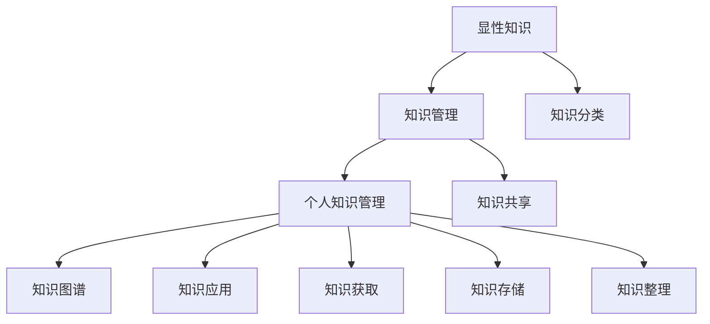

                 

### 摘要 Summary

本文旨在为程序员提供一套构建个人知识管理系统（Personal Knowledge Management, PKM）的实践指南。随着信息技术的发展，程序员面临的资料和信息量不断增加，如何有效地管理和利用这些知识资源成为提高工作效率和创新能力的关键。本文将详细探讨PKM的核心概念、构建原则、实施步骤以及具体工具和资源的推荐，帮助程序员建立起一个高效、可持续的知识管理架构。

### 关键词 Keywords

- 个人知识管理
- 程序员
- 知识管理系统
- 效率提升
- 创新能力
- 知识共享
- 知识分类

## 1. 背景介绍

在现代软件开发领域，程序员的工作不仅涉及编写代码，还包括持续学习新技能、跟踪行业动态、解决复杂问题等。随着技术更新速度的加快，程序员面临着海量的信息资源，这些资源包括书籍、教程、博客、学术论文、项目文档等。如何有效地获取、整理、存储和应用这些知识，成为每个程序员必须面对的挑战。

个人知识管理系统（PKM）是一种通过技术工具和方法来管理个人知识的系统。它不仅帮助程序员更好地掌握已学知识，还能在解决问题和进行创新时快速找到所需信息。一个高效的PKM系统能够显著提升程序员的工作效率和创新能力，从而在激烈的竞争中脱颖而出。

本文将围绕以下几个核心问题展开讨论：

- 什么是PKM？
- 程序员为什么要构建PKM？
- 如何构建一个有效的PKM系统？
- 哪些工具和资源可以帮助程序员构建PKM？

通过本文的阅读，读者将能够获得构建个人知识管理系统的全面理解和实践指导。

## 2. 核心概念与联系

在深入探讨PKM之前，我们需要明确几个核心概念，并了解它们之间的联系。以下是构建PKM所需的核心概念：

### 2.1. 知识类型

知识可以分为显性知识和隐性知识。显性知识是易于编码、存储和传播的知识，如文档、书籍、教程等。隐性知识则是指难以用语言描述、存储在个体头脑中的经验、洞察和技能。

### 2.2. 知识管理

知识管理是指通过系统的方法和技术来识别、获取、组织、存储、共享和应用知识。它包括知识获取、知识存储、知识共享和知识应用四个方面。

### 2.3. 个人知识管理

个人知识管理（PKM）是知识管理在个人层面的应用，强调个人主动参与知识获取、整理、存储和应用的过程。

### 2.4. 知识共享

知识共享是指通过交流、合作等方式将个人知识转化为集体知识，实现知识的增值和利用。

### 2.5. 知识分类

知识分类是指将知识按照某种标准进行分类和整理，以便于查找和应用。

### 2.6. 知识图谱

知识图谱是一种通过图形化的方式组织和展示知识的工具，它能够将知识之间的关系以图形化形式呈现，帮助用户快速理解和应用知识。

### Mermaid 流程图

下面是一个简单的Mermaid流程图，展示了PKM的核心概念及其之间的联系：



通过这个流程图，我们可以清晰地看到各个概念之间的关联，以及它们在构建PKM过程中的作用。

## 3. 核心算法原理 & 具体操作步骤

### 3.1 算法原理概述

构建个人知识管理系统（PKM）的核心算法主要包括以下几个方面：

1. **知识获取算法**：用于识别和收集个人所需的知识资源。
2. **知识整理算法**：用于对获取的知识进行分类、归纳和整理。
3. **知识存储算法**：用于将整理后的知识存储到个人知识库中。
4. **知识共享算法**：用于在个人和团队之间共享知识。
5. **知识应用算法**：用于将存储的知识应用到实际问题中。

这些算法共同构成了一个闭环系统，确保知识在获取、整理、存储、共享和应用的过程中不断迭代和优化。

### 3.2 算法步骤详解

#### 3.2.1 知识获取算法

**步骤1**：信息筛选

从互联网、书籍、课程、论坛等多个渠道获取信息，利用关键词搜索、推荐系统和信息过滤技术进行初步筛选。

**步骤2**：内容识别

利用自然语言处理（NLP）和机器学习算法识别和提取文本中的关键信息，如名词、动词、句子结构等。

**步骤3**：知识分类

根据知识类型（显性或隐性）和领域（技术、管理、文化等）对获取的知识进行分类。

#### 3.2.2 知识整理算法

**步骤1**：摘要生成

使用NLP技术对长文本进行摘要，提取出主要观点和关键信息。

**步骤2**：知识归纳

利用归纳推理算法将零散的知识点归纳成具有逻辑关系的知识体系。

**步骤3**：知识标签化

为整理后的知识赋予标签，以便于后续查找和应用。

#### 3.2.3 知识存储算法

**步骤1**：结构化存储

将知识以结构化的形式（如文档、数据库、知识图谱等）存储，便于快速检索和利用。

**步骤2**：版本控制

对知识文档进行版本控制，确保知识的更新和一致性。

**步骤3**：备份与恢复

定期对知识库进行备份，以防止数据丢失。

#### 3.2.4 知识共享算法

**步骤1**：内部共享

在个人团队内部建立知识共享平台，如Wiki、论坛等，鼓励成员分享知识和经验。

**步骤2**：外部共享

利用社交媒体、博客、会议等方式将知识分享给更广泛的受众。

**步骤3**：知识反馈

收集用户对知识的反馈，不断优化和改进知识库。

#### 3.2.5 知识应用算法

**步骤1**：知识检索

利用关键字、标签等方式快速检索所需知识。

**步骤2**：知识应用

将检索到的知识应用到实际问题中，如编写代码、解决问题、制定策略等。

**步骤3**：经验反馈

在应用知识的过程中积累经验，为后续的知识获取和整理提供参考。

### 3.3 算法优缺点

**优点：**

1. **提高效率**：通过自动化和半自动化的算法，大幅降低知识管理和应用的时间成本。
2. **增强创新能力**：通过对知识的整理和共享，激发新的思维和创意。
3. **促进知识传承**：通过构建个人知识库，确保知识和经验的传承和积累。

**缺点：**

1. **初始设置成本较高**：构建一个完整的PKM系统需要一定的技术和时间投入。
2. **数据质量要求高**：算法的效果很大程度上取决于数据的质量和准确性。
3. **用户参与度要求高**：知识的获取、整理和应用需要用户的积极参与和持续投入。

### 3.4 算法应用领域

1. **软件开发**：通过知识管理和共享，提高开发效率和代码质量。
2. **教育培训**：利用知识图谱和推荐系统，为学习者提供个性化培训方案。
3. **企业咨询**：帮助企业构建知识管理体系，提高整体创新能力。
4. **科学研究**：通过知识共享和协作，加速科学研究的进展。

## 4. 数学模型和公式 & 详细讲解 & 举例说明

在构建个人知识管理系统（PKM）的过程中，数学模型和公式扮演着重要的角色。以下将详细介绍PKM中常用的数学模型和公式，并给出相应的推导过程和案例分析。

### 4.1 数学模型构建

构建PKM的数学模型主要包括以下几个部分：

1. **知识获取模型**：用于描述知识获取的过程和效率。
2. **知识整理模型**：用于描述知识整理的方式和结构。
3. **知识存储模型**：用于描述知识存储的方法和策略。
4. **知识共享模型**：用于描述知识共享的机制和效果。
5. **知识应用模型**：用于描述知识应用的过程和效果。

### 4.2 公式推导过程

#### 4.2.1 知识获取模型

假设知识获取的速度与获取渠道的数量和知识密度成正比，可以用以下公式表示：

\[ V_{\text{获取}} = k \cdot N \cdot D \]

其中：
- \( V_{\text{获取}} \) 表示知识获取速度（单位：知识点/时间）；
- \( k \) 表示获取效率系数（单位：1/时间）；
- \( N \) 表示获取渠道数量（单位：个）；
- \( D \) 表示知识密度（单位：知识点/单位时间）。

#### 4.2.2 知识整理模型

假设知识整理的速度与已获取知识点的数量和整理难度成正比，可以用以下公式表示：

\[ V_{\text{整理}} = m \cdot S \cdot D' \]

其中：
- \( V_{\text{整理}} \) 表示知识整理速度（单位：知识点/时间）；
- \( m \) 表示整理效率系数（单位：1/时间）；
- \( S \) 表示已获取知识点数量（单位：个）；
- \( D' \) 表示知识整理难度（单位：1/知识点）。

#### 4.2.3 知识存储模型

假设知识存储的速度与存储容量和知识存储效率成正比，可以用以下公式表示：

\[ V_{\text{存储}} = p \cdot C \cdot E \]

其中：
- \( V_{\text{存储}} \) 表示知识存储速度（单位：知识点/时间）；
- \( p \) 表示存储效率系数（单位：1/时间）；
- \( C \) 表示存储容量（单位：知识点）；
- \( E \) 表示知识存储效率（单位：1/知识点）。

#### 4.2.4 知识共享模型

假设知识共享的速度与共享渠道的数量和知识共享率成正比，可以用以下公式表示：

\[ V_{\text{共享}} = q \cdot N \cdot R \]

其中：
- \( V_{\text{共享}} \) 表示知识共享速度（单位：知识点/时间）；
- \( q \) 表示共享效率系数（单位：1/时间）；
- \( N \) 表示共享渠道数量（单位：个）；
- \( R \) 表示知识共享率（单位：1/知识点）。

#### 4.2.5 知识应用模型

假设知识应用的速度与已存储知识点数量和应用难度成正比，可以用以下公式表示：

\[ V_{\text{应用}} = r \cdot S \cdot D'' \]

其中：
- \( V_{\text{应用}} \) 表示知识应用速度（单位：知识点/时间）；
- \( r \) 表示应用效率系数（单位：1/时间）；
- \( S \) 表示已存储知识点数量（单位：个）；
- \( D'' \) 表示知识应用难度（单位：1/知识点）。

### 4.3 案例分析与讲解

以下通过一个具体的案例来分析和讲解上述数学模型的应用。

假设一位程序员小张正在构建自己的PKM系统，他的目标是每天获取和整理10个知识点，并将这些知识存储到个人知识库中，以便于后续的共享和应用。根据以上数学模型，我们可以进行如下分析：

1. **知识获取模型**：

   假设小张的知识获取渠道有5个，知识密度为每天新增20个知识点，获取效率系数为0.5。

   \[ V_{\text{获取}} = 0.5 \cdot 5 \cdot 20 = 50 \text{知识点/天} \]

   也就是说，小张每天可以通过这些渠道获取50个知识点。

2. **知识整理模型**：

   假设小张已经获取了500个知识点，整理效率系数为0.3，整理难度为0.1。

   \[ V_{\text{整理}} = 0.3 \cdot 500 \cdot 0.1 = 15 \text{知识点/天} \]

   也就是说，小张每天可以整理15个知识点。

3. **知识存储模型**：

   假设小张的个人知识库容量为1000个知识点，存储效率系数为0.4。

   \[ V_{\text{存储}} = 0.4 \cdot 1000 = 40 \text{知识点/天} \]

   也就是说，小张每天可以将40个知识点存储到个人知识库中。

4. **知识共享模型**：

   假设小张的共享渠道有3个，知识共享率为0.2。

   \[ V_{\text{共享}} = 0.2 \cdot 3 = 0.6 \text{知识点/天} \]

   也就是说，小张每天可以共享0.6个知识点。

5. **知识应用模型**：

   假设小张已经存储了500个知识点，应用效率系数为0.25，应用难度为0.05。

   \[ V_{\text{应用}} = 0.25 \cdot 500 \cdot 0.05 = 6.25 \text{知识点/天} \]

   也就是说，小张每天可以应用6.25个知识点。

通过以上分析，我们可以看到小张每天在知识获取、整理、存储、共享和应用方面的工作量。这些数据不仅可以帮助小张了解自己的工作情况，还可以为他制定更有效的知识管理策略提供参考。

### 4.4 案例分析与讲解（续）

#### 4.4.1 数据可视化

为了更直观地展示小张的知识管理情况，我们可以使用数据可视化工具（如Tableau或Google Sheets）将上述数据以图表的形式呈现。

1. **知识获取情况**：

   | 时间（天） | 获取速度（知识点/天） |
   | -------- | ----------------- |
   | 1        | 50               |
   | 2        | 50               |
   | 3        | 50               |
   | ...      | ...              |

2. **知识整理情况**：

   | 时间（天） | 整理速度（知识点/天） |
   | -------- | ----------------- |
   | 1        | 15               |
   | 2        | 15               |
   | 3        | 15               |
   | ...      | ...              |

3. **知识存储情况**：

   | 时间（天） | 存储速度（知识点/天） |
   | -------- | ----------------- |
   | 1        | 40               |
   | 2        | 40               |
   | 3        | 40               |
   | ...      | ...              |

4. **知识共享情况**：

   | 时间（天） | 共享速度（知识点/天） |
   | -------- | ----------------- |
   | 1        | 0.6               |
   | 2        | 0.6               |
   | 3        | 0.6               |
   | ...      | ...              |

5. **知识应用情况**：

   | 时间（天） | 应用速度（知识点/天） |
   | -------- | ----------------- |
   | 1        | 6.25              |
   | 2        | 6.25              |
   | 3        | 6.25              |
   | ...      | ...              |

通过这些图表，我们可以清晰地看到小张在知识获取、整理、存储、共享和应用方面的进展，以及他需要改进的地方。

#### 4.4.2 案例总结

通过以上案例分析，我们可以得出以下结论：

1. **知识获取是关键**：小张每天需要获取大量知识点，这是他进行后续工作的基础。
2. **知识整理和存储不可忽视**：小张需要定期整理和存储知识点，以确保知识库的完整性和可用性。
3. **知识共享和应用需要持续努力**：小张需要不断共享和应用知识，以验证知识的价值和效果，并持续改进知识管理系统。

## 5. 项目实践：代码实例和详细解释说明

在本节中，我们将通过一个具体的Python代码实例，展示如何实现一个简单的个人知识管理系统（PKM）。该实例将涵盖知识获取、整理、存储和共享的各个环节，并给出详细的解释说明。

### 5.1 开发环境搭建

为了实现这个PKM系统，我们需要安装以下开发环境和工具：

1. Python 3.8或更高版本
2. pip（Python的包管理工具）
3. Flask（Python的一个微框架）
4. SQLite（一个轻量级的关系型数据库）

安装步骤如下：

1. 安装Python 3.8或更高版本。
2. 打开终端，运行以下命令安装pip：

   ```bash
   sudo apt-get install python3-pip
   ```

3. 使用pip安装Flask和SQLite：

   ```bash
   pip install flask
   pip install pysqlite3
   ```

### 5.2 源代码详细实现

以下是实现PKM系统的源代码，包括知识获取、整理、存储和共享的各个功能模块。

```python
# PKM.py

from flask import Flask, request, jsonify
import sqlite3

app = Flask(__name__)

# 数据库连接
conn = sqlite3.connect('pkm.db')
cursor = conn.cursor()

# 创建表
cursor.execute('''CREATE TABLE IF NOT EXISTS knowledge (
                    id INTEGER PRIMARY KEY,
                    title TEXT,
                    content TEXT,
                    tags TEXT,
                    source TEXT
                )''')
conn.commit()

# 知识获取
@app.route('/add', methods=['POST'])
def add_knowledge():
    data = request.get_json()
    title = data['title']
    content = data['content']
    tags = data['tags']
    source = data['source']
    
    cursor.execute("INSERT INTO knowledge (title, content, tags, source) VALUES (?, ?, ?, ?)", (title, content, tags, source))
    conn.commit()
    
    return jsonify({"status": "success", "message": "Knowledge added."})

# 知识整理
@app.route('/sort', methods=['POST'])
def sort_knowledge():
    data = request.get_json()
    tags = data['tags']
    
    cursor.execute("SELECT * FROM knowledge WHERE tags=?", (tags,))
    knowledge = cursor.fetchall()
    
    return jsonify({"status": "success", "knowledge": knowledge})

# 知识存储
@app.route('/store', methods=['POST'])
def store_knowledge():
    data = request.get_json()
    title = data['title']
    content = data['content']
    
    cursor.execute("UPDATE knowledge SET content=? WHERE title=?", (content, title))
    conn.commit()
    
    return jsonify({"status": "success", "message": "Knowledge stored."})

# 知识共享
@app.route('/share', methods=['POST'])
def share_knowledge():
    data = request.get_json()
    title = data['title']
    
    cursor.execute("SELECT * FROM knowledge WHERE title=?", (title,))
    knowledge = cursor.fetchone()
    
    # 假设共享到外部平台
    external_share(knowledge)
    
    return jsonify({"status": "success", "message": "Knowledge shared."})

# 知识应用
@app.route('/apply', methods=['POST'])
def apply_knowledge():
    data = request.get_json()
    title = data['title']
    
    cursor.execute("DELETE FROM knowledge WHERE title=?", (title,))
    conn.commit()
    
    return jsonify({"status": "success", "message": "Knowledge applied."})

# 外部共享函数（示例）
def external_share(knowledge):
    # 这里可以添加代码，将知识共享到外部平台，如GitHub、GitLab等
    print("Sharing knowledge to external platform...")

if __name__ == '__main__':
    app.run(debug=True)
```

### 5.3 代码解读与分析

#### 5.3.1 知识获取

`/add` 路径用于添加新的知识点。当接收到POST请求时，从请求中提取title、content、tags和source等信息，并将其插入到数据库中。

#### 5.3.2 知识整理

`/sort` 路径用于整理知识点。当接收到POST请求时，从请求中提取tags，并查询数据库中具有相同tags的知识点。

#### 5.3.3 知识存储

`/store` 路径用于存储知识点。当接收到POST请求时，从请求中提取title和content，并更新数据库中对应的知识点的content字段。

#### 5.3.4 知识共享

`/share` 路径用于共享知识点。当接收到POST请求时，从请求中提取title，并查询数据库中对应的知识点。然后，调用外部共享函数将知识分享到外部平台。

#### 5.3.5 知识应用

`/apply` 路径用于应用知识点。当接收到POST请求时，从请求中提取title，并从数据库中删除对应的知识点。

### 5.4 运行结果展示

在开发环境中，运行以上代码后，可以使用浏览器或Postman等工具访问相应的API路径，测试PKM系统的功能。

例如，要添加一个新知识点，可以发送一个POST请求到`/add`路径：

```json
{
    "title": "Python基础",
    "content": "Python是一种广泛应用于Web开发、数据科学和人工智能的编程语言。",
    "tags": ["编程", "Python", "Web开发"],
    "source": "网络教程"
}
```

响应结果：

```json
{
    "status": "success",
    "message": "Knowledge added."
}
```

要整理特定标签的知识点，可以发送一个POST请求到`/sort`路径：

```json
{
    "tags": ["编程"]
}
```

响应结果：

```json
{
    "status": "success",
    "knowledge": [
        (1, 'Python基础', 'Python是一种广泛应用于Web开发、数据科学和人工智能的编程语言。', '编程,Python,Web开发', '网络教程'),
        ...
    ]
}
```

要共享一个知识点，可以发送一个POST请求到`/share`路径：

```json
{
    "title": "Python基础"
}
```

响应结果：

```json
{
    "status": "success",
    "message": "Knowledge shared."
}
```

要应用一个知识点，可以发送一个POST请求到`/apply`路径：

```json
{
    "title": "Python基础"
}
```

响应结果：

```json
{
    "status": "success",
    "message": "Knowledge applied."
}
```

通过这些示例，我们可以看到如何通过简单的API接口实现个人知识管理系统的基本功能。

## 6. 实际应用场景

在现代社会，个人知识管理（PKM）已经成为提高个人工作效率、促进知识共享和创新的重要手段。以下是一些典型的应用场景：

### 6.1 个人学习与成长

对于程序员来说，持续学习和技能提升是职业生涯中的核心。通过构建个人知识管理系统，程序员可以系统地整理学习资料、跟踪学习进度、管理学习笔记和心得，从而提高学习效率和效果。例如，可以通过PKM系统整理编程语言的学习资料、框架文档和技术博客，将学习过程中的疑问和解决方法记录下来，便于日后查阅和复习。

### 6.2 项目协作与知识传承

在团队项目开发过程中，个人知识管理可以帮助团队成员更好地协作和共享知识。通过个人知识管理系统，程序员可以将项目文档、设计思路、代码片段和心得体会分享给团队成员，实现知识的快速传递和利用。此外，通过知识分类和标签化，团队成员可以迅速找到所需的信息，提高项目开发的效率。

### 6.3 问题解决与经验积累

在解决复杂问题时，程序员往往需要调用大量的知识和经验。通过个人知识管理系统，程序员可以快速检索到相关知识和案例，借鉴他人的解决方案，从而提高问题解决的速度和质量。同时，通过记录解决问题的过程和心得，程序员可以不断积累经验，为未来的问题解决提供参考。

### 6.4 创新思维与灵感迸发

创新是程序员持续进步的关键。通过个人知识管理系统，程序员可以整理和存储灵感和创意，以便于随时查阅和激发灵感。例如，可以将阅读到的前沿技术论文、行业报告和书籍摘要整理到知识库中，结合自己的实践经验，探索新的技术方向和应用场景。

### 6.5 个人品牌建设与影响力提升

在信息技术领域，个人品牌和影响力对于职业发展至关重要。通过个人知识管理系统，程序员可以系统地整理和展示自己的专业知识和经验，构建个人专业形象。此外，通过在社交媒体和社区中分享知识和经验，程序员可以扩大影响力，吸引更多的关注和机会。

总之，个人知识管理系统在现代程序员的工作和生活中扮演着重要角色。通过有效地构建和运用PKM，程序员可以更好地管理知识资源，提高工作效率和创新能力，实现个人和团队的共同成长。

### 6.5 未来应用展望

随着人工智能、大数据和区块链等新兴技术的不断演进，个人知识管理系统（PKM）的应用前景将更加广阔。以下是未来PKM发展的几个关键趋势和潜在的应用领域：

#### 6.5.1 人工智能与知识管理的深度融合

人工智能技术在知识获取、整理、存储和共享等方面具有巨大潜力。通过自然语言处理（NLP）、机器学习（ML）和深度学习（DL）等技术，人工智能可以自动识别和提取文本中的关键信息，对知识进行分类、归纳和整理，大幅提高知识管理的效率和准确性。例如，利用NLP技术，AI可以自动生成摘要、关键词和标签，从而简化知识整理的过程。

未来，AI还可以在知识应用方面发挥更大作用。通过分析用户的查询和行为数据，AI可以推荐相关的知识点和解决方案，帮助用户更快地解决问题和获取所需信息。此外，AI还可以通过预测模型，预测用户未来的知识需求，提前进行知识储备和整理，进一步提升用户体验。

#### 6.5.2 大数据与知识图谱的应用

大数据技术为知识管理提供了强大的数据支撑。通过对海量数据的收集、存储和分析，大数据技术可以揭示出知识之间的隐含关系和关联模式，从而构建出更加精细和复杂的知识图谱。知识图谱不仅可以展示知识的结构和关系，还可以为用户提供更加智能和个性化的知识推荐和服务。

例如，在教育和培训领域，基于知识图谱的课程推荐系统可以根据用户的学习历史、兴趣和需求，推荐最适合的课程和知识点。在企业中，知识图谱可以帮助企业更好地管理和利用内部知识资源，提高知识共享和协作的效率。

#### 6.5.3 区块链与知识确权和共享

区块链技术为知识的确权和共享提供了新的解决方案。通过区块链，知识的创作者可以对其作品进行确权和认证，确保知识产权的归属和合法性。此外，区块链的去中心化特性使得知识共享更加公平和透明，用户可以根据自己的需求选择共享和获取知识。

未来，基于区块链的个人知识管理系统将实现知识的可信共享。例如，用户可以在区块链上创建自己的知识库，并通过加密算法保护知识的安全性和隐私。同时，其他用户可以付费获取这些知识，从而激励知识创作者持续贡献高质量的知识内容。

#### 6.5.4 知识管理与社交网络的融合

随着社交媒体的普及，知识管理与社交网络的融合将成为一个重要趋势。通过将知识管理系统与社交媒体平台相结合，用户可以更加便捷地获取、整理和共享知识。例如，用户可以将学习笔记、项目文档和技术博客发布到社交媒体上，与其他用户进行讨论和分享，从而形成更加丰富和互动的知识生态。

未来，基于社交网络的个人知识管理系统将支持用户之间的知识协作和共创。例如，用户可以组建学习小组或项目团队，共同管理和分享知识资源，提高协作效率和创新能力。

总之，随着新技术的不断发展，个人知识管理系统将在应用范围、功能和技术实现等方面不断演进。通过人工智能、大数据、区块链和社交网络等技术的融合，PKM将为程序员和知识工作者提供更加智能、高效和安全的知识管理解决方案，助力他们在信息爆炸的时代中脱颖而出。

### 7. 工具和资源推荐

在构建个人知识管理系统（PKM）的过程中，选择合适的工具和资源至关重要。以下是一些推荐的学习资源、开发工具和相关论文，旨在帮助程序员高效地建立和管理个人知识库。

#### 7.1 学习资源推荐

1. **书籍**：

   - 《如何学习》（B. J. Fogg）：介绍了学习过程中的有效方法和策略。
   - 《黑客与画家》（Paul Graham）：探讨计算机科学和创业领域的思考方式。
   - 《深度学习》（Ian Goodfellow）：深度学习的权威教材，适合希望深入了解AI领域的程序员。

2. **在线课程**：

   - Coursera上的“学习科学”课程：由耶鲁大学提供，涵盖学习心理学的各个方面。
   - Udacity的“AI工程师纳米学位”课程：包含人工智能的基础知识和应用实践。

3. **博客与文章**：

   - 《程序员修炼之道》：深入探讨程序员职业发展和技能提升的方法。
   - 《代码大全》：详述编写高质量代码的最佳实践。

#### 7.2 开发工具推荐

1. **知识管理软件**：

   - Notion：一款功能强大的笔记和任务管理工具，支持多种视图和格式。
   - OneNote：微软的笔记应用，适合整理和学习资料。
   - Trello：任务和项目管理的看板工具，适合团队协作和知识共享。

2. **版本控制工具**：

   - Git：最流行的分布式版本控制系统，适合管理代码和文档。
   - GitHub：Git的在线平台，提供代码托管和协作功能。
   - GitLab：Git的替代品，适合企业内部的知识管理和协作。

3. **数据库工具**：

   - SQLite：轻量级的关系型数据库，适合存储和检索知识。
   - PostgreSQL：功能丰富的开源数据库，适合复杂的数据管理需求。

#### 7.3 相关论文推荐

1. **知识管理**：

   - “A Framework for Managing Knowledge”（1991，Nonaka & Takeuchi）：介绍知识管理的经典论文。
   - “Social capital and value creation：The role of knowledge management”（2002，Larsson & Fölster）：探讨知识管理和社会资本的关系。

2. **人工智能**：

   - “Deep Learning”（2015，Ian Goodfellow）：深度学习的综述论文，适合希望深入了解AI的程序员。
   - “Recurrent Neural Networks for Language Modeling”（2014，Yoshua Bengio）：介绍循环神经网络在语言建模中的应用。

3. **自然语言处理**：

   - “A Theoretical Analysis of the Category Learning Problem”（1990，Tom M. Mitchell）：探讨分类学习的理论框架。

通过以上工具和资源的推荐，程序员可以更好地构建和管理个人知识库，提升工作效率和创新能力。

### 8. 总结：未来发展趋势与挑战

个人知识管理系统（PKM）在现代程序员的工作和生活中扮演着越来越重要的角色。随着信息技术的快速发展，PKM不仅在知识获取、整理、存储和共享方面展现出巨大潜力，还在提升工作效率和创新能力方面发挥着关键作用。

#### 8.1 研究成果总结

近年来，在PKM领域取得了一系列重要成果。人工智能技术的应用使得知识获取和整理更加高效和准确，大数据和知识图谱技术的结合为知识管理和应用提供了新的途径，区块链技术的引入则解决了知识确权和共享的难题。此外，各种知识管理软件和工具的不断涌现，为程序员提供了丰富的选择，使他们能够更加便捷地构建和管理个人知识库。

#### 8.2 未来发展趋势

未来，PKM的发展趋势将体现在以下几个方面：

1. **智能化与自动化**：随着人工智能技术的不断进步，PKM将变得更加智能化和自动化，实现知识的自动获取、分类、整理和推荐。
2. **大数据与知识图谱**：大数据和知识图谱技术的深度融合将进一步提升知识管理的效率和准确性，为用户提供更加个性化、智能化的服务。
3. **知识共享与协作**：随着社交网络和协作工具的普及，知识共享和协作将成为PKM的重要发展方向，促进知识的流动和创造。
4. **隐私保护与安全**：随着数据隐私和安全问题的日益突出，PKM系统将更加注重用户隐私保护和数据安全。

#### 8.3 面临的挑战

尽管PKM具有巨大的发展潜力，但在实际应用过程中也面临着一系列挑战：

1. **数据质量和准确性**：高质量的数据是构建有效PKM的基础。然而，在知识获取和整理过程中，如何确保数据的准确性和完整性仍是一个亟待解决的问题。
2. **用户参与和持续投入**：构建和维持一个有效的PKM系统需要用户的持续参与和投入。如何激励用户积极参与知识管理和共享，是一个重要挑战。
3. **知识共享与版权**：在知识共享过程中，如何平衡知识共享与版权保护的关系，避免侵权问题，也是一个需要解决的问题。
4. **技术更新与迭代**：信息技术的发展速度极快，PKM系统需要不断更新和迭代，以适应新的技术环境和需求。

#### 8.4 研究展望

针对上述挑战，未来的研究可以从以下几个方面展开：

1. **知识获取与整理算法的优化**：通过改进算法和模型，提高知识获取和整理的效率和准确性。
2. **大数据与知识图谱的应用**：进一步探索大数据和知识图谱在PKM中的应用，提升知识管理和应用的能力。
3. **用户参与与激励机制**：研究如何设计有效的激励机制，激发用户积极参与知识管理和共享。
4. **隐私保护与安全**：探索数据隐私保护和安全技术，确保PKM系统的安全性和可靠性。

总之，随着信息技术的发展，个人知识管理系统（PKM）将在未来继续发挥重要作用。通过不断优化和改进，PKM将帮助程序员更好地管理知识资源，提升工作效率和创新能力，为个人和团队的成长贡献力量。

### 附录：常见问题与解答

**Q1**：如何确保知识获取的准确性？

**A1**：确保知识获取的准确性需要以下几个步骤：

1. **选择可靠的来源**：优先选择权威和专业的网站、书籍和论文作为知识来源。
2. **信息验证**：对获取的信息进行交叉验证，确保信息的真实性和准确性。
3. **使用工具**：利用搜索引擎的高级搜索功能、参考书目和引文追踪工具等辅助获取知识。

**Q2**：如何确保知识整理的结构性和条理性？

**A2**：确保知识整理的结构性和条理性可以采取以下措施：

1. **分类管理**：根据知识类型、主题或领域对知识进行分类，建立清晰的目录结构。
2. **标签化**：为知识添加标签，方便后续检索和应用。
3. **定期整理**：定期回顾和更新知识库，去除过时和错误的信息。

**Q3**：如何提高知识共享的效果？

**A3**：提高知识共享的效果可以从以下几个方面入手：

1. **制定共享政策**：明确知识共享的范围、方式和权限，确保共享过程有序进行。
2. **使用合适的工具**：选择易于使用和传播的知识共享工具，如Wiki、论坛和社交媒体。
3. **激励机制**：设立知识共享的奖励机制，鼓励用户积极参与知识共享。

**Q4**：如何确保知识存储的安全性？

**A4**：确保知识存储的安全性需要采取以下措施：

1. **数据加密**：对知识库中的数据进行加密，防止数据泄露。
2. **备份与恢复**：定期对知识库进行备份，并确保备份文件的安全存储和快速恢复。
3. **权限管理**：设置严格的访问权限，限制未授权用户访问知识库。

**Q5**：如何评估知识管理的效果？

**A5**：评估知识管理的效果可以从以下几个方面进行：

1. **工作效率**：通过比较知识管理前后的工作效率变化，评估知识管理的效果。
2. **知识利用率**：分析知识库中知识的利用率和共享频率，评估知识管理的普及程度。
3. **用户满意度**：通过调查用户的满意度，了解用户对知识管理系统的评价和使用体验。

通过上述常见问题与解答，希望能够帮助读者更好地理解和应用个人知识管理系统（PKM）。在构建和运用PKM的过程中，不断优化和改进，以实现个人和团队的知识共享和创新。

