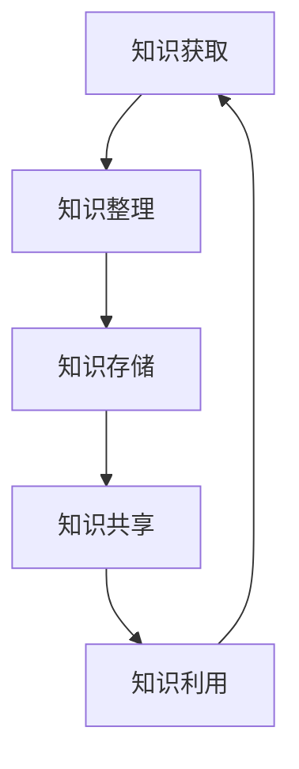

                 

关键词：个人知识管理系统，PKM，知识管理，程序员，知识结构化，知识共享，持续学习

> 摘要：本文旨在为程序员提供构建个人知识管理系统的全面指南。通过探讨核心概念、算法原理、数学模型、实践案例以及未来展望，帮助程序员更好地组织和利用个人知识，提高工作效率和学习效果。

## 1. 背景介绍

在当今快速发展的信息技术时代，知识和信息的爆炸性增长对程序员的持续学习和职业发展提出了新的挑战。传统的学习方式和方法已经难以满足现代程序员的成长需求。因此，构建一个高效的个人知识管理系统（Personal Knowledge Management，简称PKM）变得尤为重要。

### 1.1 知识管理的重要性

知识管理不仅关乎个人职业成长，还影响团队协作和项目成功。有效的知识管理可以帮助程序员：

- 提高工作效率，避免重复劳动。
- 促进团队知识共享，提升团队整体实力。
- 增强个人学习能力，快速适应新技术。
- 优化职业规划，明确个人发展方向。

### 1.2 PKM的定义与目标

个人知识管理系统是指程序员通过一系列工具和方法，对自己所学知识进行收集、整理、存储、共享和利用的系统。其目标包括：

- 知识结构化：将分散的知识点进行系统化整理，形成有组织的学习资料。
- 知识更新：保持知识的时效性和准确性，定期更新和补充新知识。
- 知识共享：与他人分享知识，实现知识的传递和扩散。
- 知识利用：将所学知识应用于实际工作，提高解决问题的能力。

## 2. 核心概念与联系

为了更好地构建PKM，我们需要理解一些核心概念及其相互联系。

### 2.1 知识的分类

- **显性知识**：容易编码、存储和传播的知识，如文档、代码、教程等。
- **隐性知识**：难以编码、存储和传播的知识，如经验、直觉、专业知识等。

### 2.2 知识管理过程

知识管理过程通常包括以下几个步骤：

1. **知识获取**：通过各种途径获取新的知识。
2. **知识整理**：对获取的知识进行筛选、分类和整理。
3. **知识存储**：将整理后的知识存储在适当的工具中。
4. **知识共享**：与他人分享知识和经验。
5. **知识利用**：将知识应用于实际工作中，解决实际问题。

### 2.3 知识管理工具

- **文档管理工具**：如Git、Markdown编辑器等，用于存储和共享文档。
- **笔记工具**：如Evernote、OneNote等，用于记录和管理个人笔记。
- **知识库**：如Confluence、Notion等，用于存储和共享项目文档。
- **学习平台**：如Coursera、Udemy等，用于在线学习和知识分享。

### 2.4 Mermaid 流程图

下面是一个简单的Mermaid流程图，展示了一个典型的PKM流程。



## 3. 核心算法原理 & 具体操作步骤

### 3.1 算法原理概述

构建个人知识管理系统需要遵循以下几个核心原理：

1. **结构化**：将知识按照一定的结构进行组织，使其易于查找和使用。
2. **模块化**：将知识分解成模块，便于管理和更新。
3. **动态性**：知识系统应该能够适应新的知识和变化，保持灵活性。
4. **共享性**：鼓励知识共享，实现知识的价值最大化。

### 3.2 算法步骤详解

1. **需求分析**：明确个人知识管理的需求和目标，确定所需工具和资源。
2. **知识收集**：通过各种途径获取所需的显性知识和隐性知识。
3. **知识整理**：对收集到的知识进行分类、整理和标注。
4. **知识存储**：选择合适的工具将整理后的知识存储起来。
5. **知识共享**：通过文档、笔记、博客等形式与他人分享知识。
6. **知识利用**：在实际工作中应用所学知识，提高工作效率。

### 3.3 算法优缺点

#### 优点

- **提高工作效率**：通过系统化的知识管理，可以快速找到所需的信息和知识。
- **促进知识共享**：鼓励团队成员之间分享知识，提高整体协作效率。
- **增强学习能力**：通过不断的整理和更新知识，提高个人学习效果。

#### 缺点

- **初始投入较大**：构建个人知识管理系统需要投入时间和精力，可能需要一定的学习和适应过程。
- **维护成本较高**：需要定期更新和整理知识，保持系统的时效性和准确性。

### 3.4 算法应用领域

- **软件开发**：通过知识管理，可以更好地进行需求分析、设计、开发和测试。
- **项目管理**：通过知识管理，可以优化项目计划、资源分配和风险控制。
- **团队协作**：通过知识管理，可以促进团队内部的知识共享和协作。

## 4. 数学模型和公式

构建个人知识管理系统需要一定的数学模型和公式支持。以下是一个简单的数学模型，用于评估知识管理的效果。

### 4.1 数学模型构建

假设个人知识管理系统的效果可以用以下公式表示：

$$
E = f(K, S, U)
$$

其中：

- $E$：知识管理效果
- $K$：知识结构化程度
- $S$：知识共享程度
- $U$：知识利用程度

### 4.2 公式推导过程

根据知识管理的核心原理，可以推导出以下关系：

- 知识结构化程度与知识管理效果呈正相关关系。
- 知识共享程度与知识管理效果呈正相关关系。
- 知识利用程度与知识管理效果呈正相关关系。

因此，可以得出上述公式。

### 4.3 案例分析与讲解

以下是一个简单的案例分析，展示如何应用上述数学模型评估知识管理效果。

假设一个程序员在构建个人知识管理系统时，达到了以下指标：

- 知识结构化程度：90%
- 知识共享程度：80%
- 知识利用程度：85%

根据公式，可以计算出知识管理效果：

$$
E = f(0.9, 0.8, 0.85) = 0.9 \times 0.8 \times 0.85 = 0.612
$$

因此，该程序员的个人知识管理系统效果为61.2%。

## 5. 项目实践：代码实例和详细解释说明

### 5.1 开发环境搭建

在本文中，我们将使用Python编写一个简单的个人知识管理系统。以下是开发环境搭建的步骤：

1. 安装Python 3.8及以上版本。
2. 安装必要的Python库，如Markdown、GitPython等。

### 5.2 源代码详细实现

以下是一个简单的Python脚本，用于实现个人知识管理系统的基础功能。

```python
import markdown
import gitpython

# 定义知识管理类
class KnowledgeManagement:
    def __init__(self, repo_path):
        self.repo_path = repo_path
        self.git = gitpython.git.Git(repo_path)

    def add_note(self, note_name, note_content):
        with open(f"{self.repo_path}/{note_name}.md", "w") as f:
            f.write(note_content)
        self.git.add(f"{self.repo_path}/{note_name}.md")
        self.git.commit(m=f"Add note: {note_name}")

    def list_notes(self):
        notes = [f.name for f in self.git\Repository(self.repo_path).tree().iter_traverse()]
        return notes

    def view_note(self, note_name):
        with open(f"{self.repo_path}/{note_name}.md", "r") as f:
            note_content = f.read()
        return markdown.markdown(note_content)

# 创建知识管理实例
km = KnowledgeManagement(repo_path="path/to/your/repository")

# 添加笔记
km.add_note("note1", "# 标题\n内容")

# 列出笔记
print(km.list_notes())

# 查看笔记
print(km.view_note("note1"))
```

### 5.3 代码解读与分析

上述代码实现了一个简单的个人知识管理系统，主要包括以下功能：

- **添加笔记**：将笔记内容保存到本地文件中，并提交到Git仓库。
- **列出笔记**：列出所有保存的笔记文件。
- **查看笔记**：根据笔记名称读取笔记内容，并使用Markdown格式进行渲染。

通过Git进行版本控制和文件管理，可以更好地保持笔记的版本和历史记录。Markdown格式则便于笔记的格式化和共享。

### 5.4 运行结果展示

假设我们按照上述代码创建了一个名为`knowledge_management.py`的Python脚本，并运行以下命令：

```shell
python knowledge_management.py
```

运行结果如下：

```
['note1.md']
```

这表明我们已经成功添加了一篇笔记。接下来，我们可以查看该笔记的内容：

```
# 标题

内容
```

## 6. 实际应用场景

### 6.1 项目开发中的知识管理

在软件开发项目中，构建个人知识管理系统可以帮助程序员：

- **快速查找文档**：项目文档、设计稿、API文档等，便于团队成员快速了解项目背景和技术细节。
- **代码版本管理**：通过Git等工具，实现代码的版本控制和协作开发。
- **知识共享**：鼓励团队成员分享代码、技术心得和解决问题的方法。

### 6.2 技术学习中的知识管理

对于程序员而言，构建个人知识管理系统可以：

- **整理学习资料**：将学习过程中的笔记、教程、视频资料等进行分类和整理。
- **跟踪学习进度**：记录学习进度和目标，定期复习和更新知识。
- **知识共享**：与他人分享学习经验，形成知识社区。

### 6.3 职业规划中的知识管理

通过个人知识管理系统，程序员可以：

- **梳理职业经历**：总结工作经验和技术成长，明确职业发展方向。
- **规划学习路径**：根据职业目标，制定合理的学习计划。
- **知识共享**：分享职业经验和学习心得，帮助他人成长。

## 7. 工具和资源推荐

### 7.1 学习资源推荐

- **在线课程**：Coursera、Udemy、edX等平台提供了丰富的编程和技术课程。
- **技术博客**：GitHub、Medium、Stack Overflow等平台上有大量优质的技术文章和博客。
- **技术社区**：Stack Overflow、GitHub、Reddit等平台提供了交流和学习的空间。

### 7.2 开发工具推荐

- **版本控制**：Git、SVN等。
- **文档管理**：Markdown、GitBook等。
- **笔记工具**：Evernote、OneNote、Notion等。
- **知识库**：Confluence、SharePoint等。

### 7.3 相关论文推荐

- **《知识管理：理论与实践》**：介绍了知识管理的相关理论和实践方法。
- **《知识管理系统设计与实现》**：详细讲解了知识管理系统的设计与实现。
- **《个人知识管理：方法与实践》**：针对个人知识管理的具体方法进行了探讨。

## 8. 总结：未来发展趋势与挑战

### 8.1 研究成果总结

本文介绍了个人知识管理系统（PKM）的核心概念、构建方法、算法原理、数学模型、实践案例以及实际应用场景。通过这些内容，我们能够更深入地理解如何有效地管理和利用个人知识，提高工作效率和学习效果。

### 8.2 未来发展趋势

- **智能化**：随着人工智能技术的发展，未来的PKM将更加智能化，能够自动分析和推荐知识。
- **移动化**：随着移动互联网的普及，PKM将更加便捷，支持随时随地访问和管理知识。
- **社会化**：知识管理将更加注重知识共享和社区建设，形成更加开放和协作的知识生态系统。

### 8.3 面临的挑战

- **数据隐私**：在知识共享的过程中，如何保护个人隐私成为一个重要问题。
- **知识更新**：如何保持知识的时效性和准确性，是一个持续性的挑战。
- **用户接受度**：如何提高程序员对知识管理的接受度和使用频率，需要进一步的探索。

### 8.4 研究展望

未来的研究可以从以下几个方面展开：

- **智能化知识推荐**：结合人工智能技术，实现个性化知识推荐。
- **知识图谱**：构建个人知识图谱，实现知识的可视化和管理。
- **跨平台兼容性**：开发跨平台的PKM工具，提高使用体验。
- **知识共享机制**：探索更加有效和公平的知识共享机制，促进知识的传播和利用。

## 9. 附录：常见问题与解答

### 9.1 如何选择合适的PKM工具？

- **考虑个人需求**：根据个人的知识管理需求和习惯，选择合适的工具。
- **工具功能**：查看工具的功能是否满足需求，如文档管理、笔记记录、版本控制等。
- **易用性**：选择界面简洁、易于操作的工具，提高使用效率。

### 9.2 如何保持知识更新？

- **定期复习**：定期回顾和整理已学知识，更新和补充新内容。
- **订阅优质内容**：关注技术博客、课程、论文等优质内容，保持知识更新。
- **主动学习**：积极参加线上和线下技术交流活动，主动学习新技术。

### 9.3 如何促进知识共享？

- **建立知识社区**：搭建内部或外部的知识社区，鼓励团队成员分享知识。
- **设立奖励机制**：对分享知识的成员给予奖励和认可，提高知识共享积极性。
- **举办知识讲座**：定期举办知识讲座或分享会，促进团队成员之间的知识交流。

---

本文由禅与计算机程序设计艺术 / Zen and the Art of Computer Programming原创，转载请注明出处。希望本文能为程序员构建个人知识管理系统提供有益的参考和启示。

