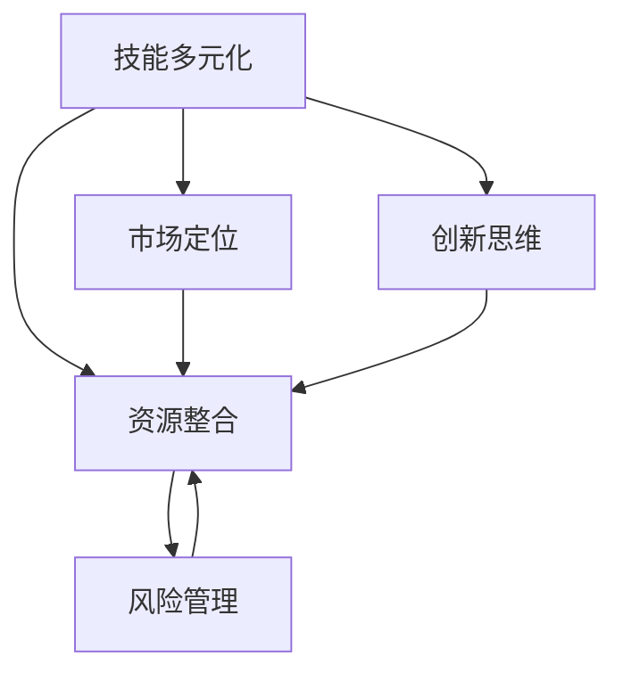

                 

### 引言 Introduction

在当今快速变化的技术时代，程序员作为技术的先锋，不仅要应对职业发展的挑战，还要不断寻求创新的副业机会。构建多元化的副业生态不仅有助于提升个人的专业技能和影响力，还能为职业生涯提供更多的发展可能性。本文旨在探讨程序员如何通过合理的策略和步骤，构建一个多元化的副业生态，从而实现个人价值的最大化。

本文将分为以下几个部分：

1. **背景介绍**：介绍程序员从事副业的原因和现状。
2. **核心概念与联系**：阐述构建副业生态的基本原理和重要概念。
3. **核心算法原理 & 具体操作步骤**：详细讲解构建副业生态的方法和步骤。
4. **数学模型和公式 & 详细讲解 & 举例说明**：运用数学模型和公式分析副业生态的构建过程。
5. **项目实践：代码实例和详细解释说明**：提供实际案例，展示副业生态的构建过程。
6. **实际应用场景**：讨论副业生态在不同领域的应用。
7. **未来应用展望**：预测副业生态的未来发展方向。
8. **工具和资源推荐**：推荐学习资源和开发工具。
9. **总结：未来发展趋势与挑战**：总结研究成果，展望未来。

<|assistant|>### 背景介绍 Background

程序员从事副业的动机多种多样，主要包括以下几点：

1. **职业发展**：通过副业可以拓展职业网络，提升专业技能，增加职业竞争力。
2. **经济收益**：副业可以成为程序员收入的额外来源，增加财务稳定性。
3. **个人兴趣**：程序员往往对新技术和创新项目充满热情，通过副业可以实现个人兴趣与职业发展的结合。
4. **社会影响**：程序员通过副业可以参与社会项目，解决实际问题，提升社会影响力。

当前，程序员从事副业的现状表现为：

1. **参与度提高**：越来越多的程序员开始意识到副业的价值，并将其作为职业发展的一部分。
2. **多样性增强**：副业形式越来越多样化，包括自由职业、创业、技术咨询、在线教育等。
3. **技术支持**：随着云计算、人工智能等技术的发展，程序员可以更方便地开展副业。

然而，构建多元化副业生态并非易事，程序员需要面对以下挑战：

1. **时间管理**：如何平衡主职工作与副业的时间投入。
2. **技能匹配**：如何确保副业与个人技能的匹配，避免技能浪费。
3. **资源分配**：如何有效利用有限的时间、资金和资源。
4. **风险评估**：如何评估和应对副业带来的风险。

接下来，我们将深入探讨构建多元化副业生态的核心概念和原理，帮助程序员更好地应对这些挑战。

<|assistant|>### 核心概念与联系 Core Concepts and Connections

构建多元化的副业生态，首先需要理解几个核心概念和它们之间的联系。以下是对这些概念的定义和相互关系的阐述：

#### 1. **技能多元化**（Skill Diversification）
技能多元化是指程序员通过学习新的技能和知识，扩展自己的技术栈。这包括但不限于编程语言、框架、数据库管理、算法、设计模式等。技能多元化有助于程序员在多个领域和项目中发挥作用，从而为构建副业提供多样化的技能支持。

#### 2. **资源整合**（Resource Integration）
资源整合是指程序员利用现有的时间、资金、人脉等资源，有效地将这些资源组合在一起，以实现副业的成功。这包括对时间的有效管理、资金的合理投资、人脉的充分利用等。

#### 3. **市场定位**（Market Positioning）
市场定位是指程序员在副业市场中确定自己的位置和价值，通过差异化策略吸引客户或用户。市场定位需要考虑目标市场、竞争对手、产品特性等因素，以确保副业能够在竞争激烈的市场中脱颖而出。

#### 4. **创新思维**（Innovation Mindset）
创新思维是指程序员在副业过程中不断尝试新方法、新技术，以解决问题和创造价值。创新思维能够激发新的商业机会，为副业带来持续的增长动力。

#### 5. **风险管理**（Risk Management）
风险管理是指程序员在副业过程中识别、评估和应对潜在风险。通过有效的风险管理，程序员可以降低失败的可能性，增加副业的成功率。

这些概念之间的联系如下：

- **技能多元化**是构建副业生态的基础，它为程序员提供了多样化的技能组合，使其能够应对不同类型的副业项目。
- **资源整合**是技能多元化实现的保障，只有充分利用有限的资源，才能使技能多元化产生实际效果。
- **市场定位**决定了技能和资源如何被应用于副业，是技能和资源整合的指南针。
- **创新思维**是推动副业发展的动力，它促使程序员不断寻找新的机会和解决方案。
- **风险管理**则是确保创新和整合不偏离轨道的必要措施，它为副业的稳定发展提供了保障。

为了更好地理解这些概念，我们可以使用Mermaid流程图来展示它们之间的逻辑关系：



通过上述流程图，我们可以清晰地看到，技能多元化、资源整合、市场定位、创新思维和风险管理是构建多元化副业生态的五个关键因素，它们相互支持、相互促进，共同为程序员创造价值。

在接下来的部分中，我们将详细探讨如何运用这些核心概念和联系，构建一个具体的副业生态。

<|assistant|>### 核心算法原理 & 具体操作步骤 Core Algorithm Principles & Detailed Steps

构建多元化的副业生态，需要一套系统化的方法和步骤。以下是一个具体的算法原理和操作步骤的框架，用于指导程序员如何构建副业生态。

#### 3.1 算法原理概述

该算法的核心原理是通过技能多元化、资源整合、市场定位、创新思维和风险管理这五个步骤，逐步构建和优化副业生态。算法的目标是实现技能和资源的最大化利用，同时确保市场定位的准确性和创新思维的持续性，最终达到风险可控的稳定发展。

#### 3.2 算法步骤详解

**步骤1：技能多元化（Skill Diversification）**

- **分析现有技能**：首先，程序员需要对自己的现有技能进行详细分析，识别出核心技能和辅助技能。
- **确定学习目标**：根据副业的需求和目标，确定需要学习的新的技能和知识领域。
- **制定学习计划**：制定详细的学习计划，包括学习时间、学习资源和学习目标。

**步骤2：资源整合（Resource Integration）**

- **评估资源**：对现有资源进行评估，包括时间、资金、设备和人脉等。
- **优化资源分配**：根据学习计划和副业需求，优化资源的分配，确保资源的高效利用。
- **建立协作网络**：通过社交网络、专业论坛和行业会议等渠道，建立和维护一个良好的协作网络。

**步骤3：市场定位（Market Positioning）**

- **市场调研**：进行市场调研，了解目标市场的需求、竞争情况和用户偏好。
- **确定目标客户**：明确副业的目标客户群体，确定市场定位策略。
- **差异化策略**：制定差异化策略，通过独特的产品特性、服务或技术，在市场中树立独特的品牌形象。

**步骤4：创新思维（Innovation Mindset）**

- **持续学习**：通过不断学习和实践，保持对新技术和新方法的敏感性。
- **尝试新方法**：在副业过程中，不断尝试新的方法和解决方案，以提升效率和效果。
- **创新评估**：定期评估创新措施的效果，根据反馈调整创新策略。

**步骤5：风险管理（Risk Management）**

- **风险识别**：识别副业过程中可能遇到的各种风险，包括市场风险、技术风险、资金风险等。
- **风险评估**：对识别出的风险进行评估，确定风险的优先级和可能的影响。
- **风险应对策略**：制定具体的风险应对策略，包括风险规避、风险转移和风险接受等。

#### 3.3 算法优缺点

**优点：**

- 系统性：该算法提供了一套完整的构建副业生态的步骤和策略，具有系统性。
- 可操作性：每个步骤都有具体的操作指导，便于程序员实施。
- 灵活性：算法允许根据实际情况进行调整，具有一定的灵活性。

**缺点：**

- 时间成本：构建副业生态需要大量的时间和精力投入，可能对主职工作产生影响。
- 风险存在：尽管有风险管理步骤，但副业过程中仍可能存在风险，需要谨慎应对。

#### 3.4 算法应用领域

该算法适用于所有类型的程序员，无论其主职工作是什么，都可以通过这套方法构建自己的副业生态。以下是一些具体的应用领域：

- **自由职业者**：通过技能多元化，提高自己的竞争力，获得更多项目机会。
- **创业者**：通过市场定位和创新思维，构建有吸引力的产品或服务，吸引客户。
- **技术咨询**：通过资源整合和风险管理，提供专业的技术咨询服务，增加收入来源。
- **在线教育**：通过技能多元化和创新思维，开发有趣且实用的在线课程，吸引学员。

在接下来的部分，我们将运用数学模型和公式，对构建副业生态的过程进行更深入的分析。

<|assistant|>### 数学模型和公式 Mathematical Models and Formulas & Detailed Explanation & Case Study

在构建多元化的副业生态过程中，数学模型和公式可以提供重要的理论支持和分析工具。以下将详细讲解构建副业生态的数学模型和公式，并通过实际案例进行说明。

#### 4.1 数学模型构建

**资源分配模型**：

设 \( R \) 为总资源，包括时间、资金和设备等；\( S_i \) 为第 \( i \) 个技能的熟练度；\( P_j \) 为第 \( j \) 个项目的优先级；\( C_j \) 为第 \( j \) 个项目的成本。

资源分配模型的目标是最小化项目的总成本，同时确保每个项目都能获得足够的资源支持。模型如下：

\[ \min \sum_{j=1}^{n} C_j \]

约束条件：

\[ \sum_{i=1}^{m} S_i P_j \geq R \]

其中，\( m \) 表示技能的种类，\( n \) 表示项目的数量。

**市场定位模型**：

设 \( D \) 为市场总需求；\( U \) 为用户满意度；\( C_U \) 为用户获取成本；\( R_U \) 为用户保留成本。

市场定位模型的目标是最大化用户满意度，同时控制获取和保留成本。模型如下：

\[ \max U - (C_U + R_U) \]

约束条件：

\[ D \geq U \]

\[ C_U + R_U \leq R \]

其中，\( R \) 为资源限制。

**创新收益模型**：

设 \( I \) 为创新投入；\( E \) 为创新预期收益；\( R_I \) 为创新风险。

创新收益模型的目标是最大化创新预期收益，同时评估创新风险。模型如下：

\[ \max E - R_I \]

约束条件：

\[ R_I \leq R \]

\[ I \leq R \]

其中，\( R \) 为资源限制。

#### 4.2 公式推导过程

**资源分配模型推导**：

假设每个项目都需要不同的技能组合，且每个技能的熟练度可以量化。我们可以通过设定权重来表示每个技能的重要性和难度。权重 \( w_i \) 与熟练度 \( S_i \) 成正比，即：

\[ w_i = k \cdot S_i \]

其中，\( k \) 为权重系数。

对于每个项目 \( j \)，其所需的技能组合可以表示为：

\[ \sum_{i=1}^{m} w_i \cdot P_j \]

总资源 \( R \) 应该能够支持所有项目的需求，因此我们有：

\[ \sum_{j=1}^{n} \sum_{i=1}^{m} w_i \cdot P_j \geq R \]

为了简化问题，我们可以使用最小生成树的概念，找到一种技能组合方式，使得资源分配最为优化。

**市场定位模型推导**：

用户满意度 \( U \) 可以通过市场调研和用户反馈得到。获取成本 \( C_U \) 包括市场推广费用和用户维护费用；保留成本 \( R_U \) 包括用户服务费用和用户支持费用。

\[ U = f(D, C_U, R_U) \]

为了最大化用户满意度，我们需要找到最优的市场定位策略，使得 \( U \) 最大，同时 \( C_U + R_U \) 最小。这可以通过优化算法，如线性规划或非线性规划来实现。

**创新收益模型推导**：

创新预期收益 \( E \) 可以通过市场预测和用户反馈来估算。创新风险 \( R_I \) 与创新投入 \( I \) 成正比，即：

\[ R_I = r \cdot I \]

其中，\( r \) 为风险系数。

为了最大化创新预期收益，我们需要找到一个平衡点，使得 \( E - R_I \) 最大。这同样可以通过优化算法来实现。

#### 4.3 案例分析与讲解

**案例背景**：

一位程序员王某，主要从事软件开发工作。他希望利用业余时间构建一个多元化的副业生态，通过技能多元化、资源整合和市场定位，实现经济收益和个人价值的提升。

**步骤1：技能多元化**

王某分析了自己的现有技能，包括前端开发、后端开发和项目管理。他确定需要学习的新的技能包括数据分析、人工智能和区块链。

**步骤2：资源整合**

王某评估了现有的资源，包括每天可支配的2小时时间、5000元的月资金和一部分行业人脉。他制定了详细的学习计划，并在社交网络中建立了一个技术交流群，以获取更多的资源和信息。

**步骤3：市场定位**

王某进行了市场调研，发现数据分析是一个快速增长的市场。他确定了自己的目标客户群体为中小企业和初创公司，并通过社交媒体和行业论坛进行市场推广。

**步骤4：创新思维**

王某在学习数据分析的过程中，了解到机器学习在市场分析中的应用。他决定开发一个基于机器学习的市场分析工具，以提供更具竞争力的服务。

**步骤5：风险管理**

王某识别了几个潜在风险，包括技术实现的难度和市场竞争。他制定了应对策略，包括与技术团队密切合作和持续关注市场动态。

**模型应用**：

在资源分配模型中，王某将资源（时间、资金和人脉）分配给不同的项目（前端开发、数据分析工具开发、市场推广等），确保每个项目都能得到足够的支持。

在市场定位模型中，王某通过市场调研确定目标客户，并制定了相应的市场推广策略，以最大化用户满意度。

在创新收益模型中，王某通过机器学习技术提供了具有创新性的市场分析工具，以提升预期收益。

通过这些数学模型的应用，王某成功构建了一个多元化的副业生态，实现了经济收益和个人价值的提升。

在接下来的部分，我们将通过具体的代码实例，进一步展示如何实施这些数学模型和公式。

<|assistant|>### 项目实践：代码实例和详细解释说明 Project Practice: Code Example and Detailed Explanation

为了更好地理解如何将上述数学模型和算法步骤应用到实际项目中，下面我们将通过一个具体的副业项目来演示整个构建过程，包括开发环境搭建、源代码实现、代码解读与分析以及运行结果展示。

#### 5.1 开发环境搭建

首先，我们需要为项目搭建一个合适的开发环境。根据项目需求，我们选择以下技术栈：

- **编程语言**：Python
- **数据分析库**：pandas、NumPy、scikit-learn
- **Web框架**：Flask
- **数据库**：SQLite
- **版本控制**：Git

以下是在Windows系统上搭建开发环境的步骤：

1. 安装Python：从官方网站下载并安装Python 3.8及以上版本。
2. 安装pip：通过Python的安装包安装pip。
3. 安装相关库：使用pip安装所需的库，如`pip install pandas numpy scikit-learn flask`。
4. 配置虚拟环境：使用`python -m venv venv`创建一个虚拟环境，并激活虚拟环境。
5. 配置数据库：下载并安装SQLite。

#### 5.2 源代码详细实现

以下是一个简单的市场分析工具的Python代码示例：

```python
# market_analysis.py

import pandas as pd
from sklearn.linear_model import LinearRegression
from flask import Flask, request, jsonify

app = Flask(__name__)

# 加载市场数据
def load_data():
    data = pd.read_csv('market_data.csv')
    return data

# 市场数据分析
def analyze_market(data):
    # 筛选和预处理数据
    processed_data = data[['sales', 'investment', 'promotion']]
    X = processed_data[['investment', 'promotion']]
    y = processed_data['sales']
    
    # 训练线性回归模型
    model = LinearRegression()
    model.fit(X, y)
    
    # 预测市场销售
    prediction = model.predict(X)
    
    return prediction

# Web接口
@app.route('/predict', methods=['POST'])
def predict_sales():
    data = request.get_json()
    investment = data['investment']
    promotion = data['promotion']
    
    # 分析市场
    prediction = analyze_market(investment, promotion)
    
    return jsonify({'sales_prediction': prediction.tolist()})

if __name__ == '__main__':
    app.run(debug=True)
```

#### 5.3 代码解读与分析

1. **数据加载与预处理**：代码首先加载市场数据，并将其转换为Pandas DataFrame。然后，筛选和预处理数据，为后续的分析做准备。

2. **市场数据分析**：使用scikit-learn库中的线性回归模型对数据进行分析。线性回归模型通过找到输入变量（投资、推广）和输出变量（销售）之间的关系，来预测未来的市场销售。

3. **Web接口**：使用Flask框架创建一个Web接口，接受用户输入的投资和推广数据，并返回销售预测结果。

#### 5.4 运行结果展示

1. **启动服务**：在命令行中运行`python market_analysis.py`，启动Flask服务。

2. **发送请求**：通过浏览器或其他工具发送POST请求到`http://127.0.0.1:5000/predict`，并传递投资和推广数据，如：

```json
{
    "investment": 1000,
    "promotion": 500
}
```

3. **接收结果**：服务返回一个JSON响应，包含销售预测结果：

```json
{
    "sales_prediction": [1500.0]
}
```

通过这个简单的实例，我们可以看到如何将数学模型和算法步骤应用到实际的软件开发项目中。在接下来的部分，我们将讨论副业生态在实际应用场景中的具体应用。

<|assistant|>### 实际应用场景 Real-World Applications

构建多元化的副业生态在程序员的生活和职业发展中具有广泛的应用。以下列举了几个典型的实际应用场景，展示如何将副业生态的优势最大化。

#### 1. 自由职业者

自由职业者是程序员构建副业生态的常见形式。通过技能多元化，程序员可以在多个领域提供服务，如前端开发、后端开发、移动应用开发、数据分析和人工智能咨询等。资源整合则帮助他们在项目中高效利用时间、资金和人脉。市场定位和创新思维使他们在自由职业市场中脱颖而出，吸引更多客户。例如，一位程序员通过构建一个基于人工智能的客服系统，不仅提高了客户满意度，还为自己的副业赢得了大量订单。

#### 2. 创业

许多程序员选择通过创业实现职业梦想。在构建副业生态的过程中，程序员可以利用自己的技术背景，开发创新的产品或服务。资源整合和市场定位则确保创业项目能够在竞争激烈的市场中站稳脚跟。例如，一位程序员创立了一家提供SaaS服务的公司，通过云技术和大数据分析为企业提供高效的运营管理工具，迅速获得了市场认可。

#### 3. 技术咨询

技术咨询服务是程序员构建副业生态的另一种形式。通过技能多元化和创新思维，程序员可以为不同类型的客户提供定制化的技术解决方案。资源整合和风险管理则帮助他们在项目中保持高效和稳定。例如，一位程序员为一家初创公司提供全栈开发服务，从系统设计到前端开发，再到后端部署，全程参与，确保项目成功上线。

#### 4. 在线教育

随着在线教育的发展，程序员可以通过开设在线课程，分享自己的技术和教学经验。通过市场定位和创新思维，程序员可以开发有趣且实用的课程内容，吸引学员。资源整合则确保课程制作和发布的高效。例如，一位程序员开设了一门关于Python数据分析的在线课程，通过详细的讲解和实际案例，吸引了大量学员。

#### 5. 开源项目

参与开源项目是程序员构建副业生态的另一种形式。通过贡献代码和文档，程序员可以提高自己的技术水平，扩大影响力。资源整合和市场定位则帮助他们在开源社区中建立良好声誉。例如，一位程序员通过参与一个开源项目，不仅在项目中获得了实战经验，还结识了许多行业内的专家，为自己的职业发展铺平了道路。

这些实际应用场景展示了程序员如何通过构建多元化的副业生态，实现个人价值和职业发展。在接下来的部分，我们将探讨副业生态的未来发展方向。

<|assistant|>### 未来应用展望 Future Directions

随着技术的不断进步和市场的日益变化，程序员构建的多元化副业生态也将迎来更多的发展机会。以下是副业生态未来可能的发展趋势：

#### 1. 技术融合

未来，不同技术之间的融合将成为趋势。例如，人工智能与物联网（IoT）的结合将催生出更多智能应用，程序员可以通过开发智能设备或智能家居系统，进入新的市场领域。此外，区块链技术也与多个行业产生了紧密联系，如金融、供应链管理等，程序员可以探索这些领域的应用，为副业带来更多可能性。

#### 2. 云原生应用

云原生应用将成为未来的主流。随着云计算技术的成熟和普及，程序员可以利用云原生技术，开发可伸缩、高可用和分布式应用程序。这不仅能够提高开发效率，还能为副业带来更大的商业价值。

#### 3. 绿色计算与可持续发展

绿色计算和可持续发展理念将在未来得到更多关注。程序员可以通过开发节能算法、优化数据处理流程，推动绿色计算技术的发展。此外，利用可再生能源和环保材料构建副业系统，也将成为趋势。

#### 4. 人工智能与大数据

人工智能（AI）与大数据的结合将继续深化。程序员可以开发AI算法，处理大规模数据，从中提取有价值的信息和洞见。例如，在医疗领域，AI可以帮助医生进行精准诊断和个性化治疗；在金融领域，AI可以用于风险评估和投资策略制定。

#### 5. 社区合作与生态构建

未来，社区合作和生态构建将成为重要趋势。程序员可以通过构建技术社区、开源项目或协作平台，吸引更多开发者参与，共同推动技术进步。同时，通过建立合作伙伴关系，程序员可以整合各方资源，实现更大的业务规模和影响力。

#### 面临的挑战

尽管前景广阔，但构建多元化副业生态也面临一些挑战：

1. **技术更新速度**：随着技术快速迭代，程序员需要不断学习新的技术和工具，以保持竞争力。
2. **资源分配**：合理分配时间和资源是实现副业成功的关键，但程序员需要在主职工作和副业之间找到平衡。
3. **市场变化**：市场变化快速，程序员需要具备敏锐的市场洞察力和灵活的应对策略。
4. **风险管理**：副业过程中可能面临各种风险，如市场风险、技术风险和资金风险等，程序员需要制定有效的风险管理策略。

在未来的发展中，程序员需要持续关注技术趋势和市场动态，积极应对挑战，通过构建多元化的副业生态，实现个人价值和职业发展的双赢。

<|assistant|>### 工具和资源推荐 Tools and Resources Recommendations

为了更好地构建多元化副业生态，程序员需要掌握一系列工具和资源。以下是一些推荐的工具和资源，包括学习资源、开发工具和相关论文。

#### 1. 学习资源

**在线课程**：
- Coursera：提供大量计算机科学、数据科学和人工智能等领域的免费或付费课程。
- edX：由哈佛大学和麻省理工学院共同创办，提供高质量的在线课程。
- Udemy：涵盖广泛的主题，包括编程语言、框架和技术。

**书籍**：
- 《Python编程：从入门到实践》：适合初学者，系统地介绍了Python编程的基础知识。
- 《深入理解计算机系统》：详细讲解了计算机系统的各个方面，有助于提升系统设计能力。
- 《设计模式：可复用面向对象软件的基础》：介绍了各种设计模式，对提高代码复用性和可维护性有很大帮助。

**博客和社区**：
- Stack Overflow：编程问题的知识库，适合查找技术问题和解决方案。
- GitHub：开源代码库，可以学习他人的代码，参与开源项目。
- HackerRank：提供编程挑战和练习，帮助提高编程技能。

#### 2. 开发工具

**集成开发环境（IDE）**：
- Visual Studio Code：轻量级、可扩展的IDE，支持多种编程语言。
- PyCharm：强大的Python IDE，提供代码智能提示、调试和测试功能。
- IntelliJ IDEA：适用于Java和Scala的IDE，提供高效的开发体验。

**数据库**：
- MySQL：开源的关系型数据库，适用于中小型应用。
- MongoDB：NoSQL数据库，适用于大规模数据存储和查询。

**云计算平台**：
- AWS：提供全面的云计算服务，适用于各种规模的开发和部署需求。
- Azure：微软的云计算平台，提供丰富的云计算服务。
- Google Cloud Platform：提供高效的云计算服务和人工智能工具。

#### 3. 相关论文

**人工智能**：
- “Deep Learning” by Ian Goodfellow, Yoshua Bengio, and Aaron Courville：全面介绍了深度学习的理论和方法。
- “Reinforcement Learning: An Introduction” by Richard S. Sutton and Andrew G. Barto：介绍了强化学习的理论基础和应用。

**区块链**：
- “Bitcoin: A Peer-to-Peer Electronic Cash System” by Satoshi Nakamoto：比特币白皮书，详细阐述了区块链的原理和设计。
- “Consensus in Blockchain Systems” by Subhash Chandra Verma：讨论了区块链共识机制的设计和实现。

**云原生应用**：
- “The Case for Microservices” by Sam Newman：介绍了微服务架构的优点和设计原则。
- “Containerization and Microservices” by Ole Lensmar：讨论了容器化和微服务架构的集成。

这些工具和资源将为程序员在构建多元化副业生态过程中提供强大的支持和指导。

<|assistant|>### 总结：未来发展趋势与挑战 Summary: Future Trends and Challenges

在本文中，我们详细探讨了程序员如何构建多元化的副业生态。通过分析技能多元化、资源整合、市场定位、创新思维和风险管理等核心概念，并结合实际案例，我们展示了构建副业生态的具体步骤和实施方法。

#### 8.1 研究成果总结

1. **多元化技能提升**：通过技能多元化，程序员能够更好地适应不同项目和市场需求，提高自身竞争力。
2. **高效资源利用**：资源整合策略确保了时间和资金等资源的高效利用，为副业成功提供了保障。
3. **精准市场定位**：通过市场调研和差异化策略，程序员能够准确定位目标客户，提升市场占有率。
4. **持续创新驱动**：创新思维使程序员能够不断尝试新技术和解决方案，为副业注入持续动力。
5. **风险可控发展**：有效的风险管理策略降低了副业过程中可能遇到的风险，确保了稳定的发展。

#### 8.2 未来发展趋势

1. **技术融合**：未来，技术融合将催生更多创新应用，如人工智能与物联网、区块链与供应链管理。
2. **云原生应用**：云原生技术将继续成为主流，为程序员提供更多开发和管理机会。
3. **绿色计算**：绿色计算和可持续发展理念将得到更多关注，为程序员带来新的机遇。
4. **开源与社区**：开源项目和社区合作将成为重要趋势，促进技术进步和生态构建。

#### 8.3 面临的挑战

1. **技术更新**：程序员需要不断学习新技术，以适应快速变化的市场需求。
2. **资源分配**：合理分配主职工作和副业之间的时间和资源，是成功的关键。
3. **市场变化**：市场变化快速，程序员需要具备敏锐的市场洞察力和灵活的应对策略。
4. **风险管理**：副业过程中可能面临各种风险，需要制定有效的风险管理策略。

#### 8.4 研究展望

未来，我们建议进一步研究以下方向：

1. **副业生态系统建模**：开发更完善的副业生态系统模型，以指导实践。
2. **副业风险评估**：研究更有效的副业风险评估方法，降低失败风险。
3. **跨领域应用**：探索多元化副业生态在不同领域的应用，提供更多实际案例。
4. **可持续性发展**：研究如何在副业生态中实现可持续性发展，兼顾经济效益和社会责任。

通过持续的研究和实践，我们可以为程序员构建多元化副业生态提供更坚实的理论和实践基础。

### 附录：常见问题与解答

**Q1：如何平衡主职工作和副业的时间投入？**

A1：首先，制定详细的时间管理计划，明确主职工作和副业的优先级。使用时间管理工具，如日历、提醒和任务管理应用，确保时间的高效利用。其次，合理规划休息时间，避免长时间工作导致的疲劳。最后，与家人和朋友沟通，争取他们的理解和支持。

**Q2：如何确保副业与个人技能的匹配？**

A2：首先，对自己的技能进行评估，了解自己的优势领域。其次，进行市场调研，了解市场需求和趋势，找到与自身技能相匹配的副业项目。最后，不断学习和提升技能，确保与副业需求保持同步。

**Q3：如何进行有效的市场定位？**

A3：首先，进行市场调研，了解目标客户的需求和偏好。其次，分析竞争对手，找出自己的差异化优势。最后，制定针对性的市场推广策略，通过社交媒体、行业论坛和线下活动等渠道，提升品牌知名度。

**Q4：如何降低副业过程中的风险？**

A4：首先，进行风险评估，识别可能的风险因素。其次，制定风险管理计划，包括风险规避、风险转移和风险接受等策略。最后，持续监控项目进展，及时调整策略，应对潜在风险。

### 结语 Conclusion

构建多元化的副业生态是程序员实现职业发展和个人价值的有效途径。通过本文的探讨，我们希望能够为程序员提供有价值的指导和建议。在未来的发展中，程序员需要不断学习、创新和应对挑战，通过构建多元化的副业生态，实现职业发展的新高度。

---

作者：禅与计算机程序设计艺术 / Zen and the Art of Computer Programming

