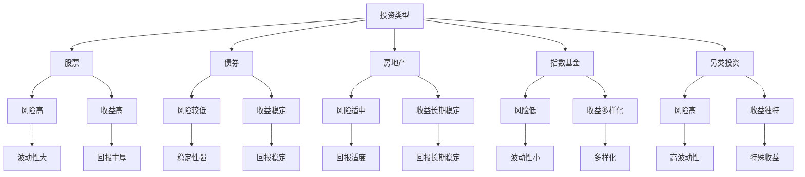

                 

关键词：资产组合、财富积累、投资策略、技术领域、财务规划、长期投资

> 摘要：在当今充满不确定性的经济环境中，程序员如何利用自身的专业技能和知识，构建一个百万美元的资产组合？本文将深入探讨投资策略、财务规划和长期投资的重要性，提供具体的方法和案例，帮助程序员实现财富的稳健增长。

## 1. 背景介绍

程序员是一个充满创造力和活力的职业群体，他们具备出色的逻辑思维和技术能力。随着科技行业的快速发展，程序员的收入水平也在不断提高。然而，高收入并不一定意味着能够实现财务自由。许多程序员面临着如何管理和投资自己财富的挑战。在这个充满不确定性的时代，构建一个稳健的资产组合成为了一个重要的议题。

资产组合是指将资金分配到不同类型的投资中，以实现风险和收益的最佳平衡。一个多元化的资产组合可以帮助投资者分散风险，并在不同市场环境下保持稳定的回报。对于程序员而言，构建百万美元资产组合不仅是实现财务自由的关键，也是对未来生活的有力保障。

## 2. 核心概念与联系

在构建资产组合之前，我们需要了解一些核心概念，包括投资类型、风险与收益、投资策略等。以下是一个使用Mermaid绘制的流程图，展示了这些概念之间的联系：



### 2.1 投资类型

投资类型是构建资产组合的基础。常见的投资类型包括股票、债券、房地产、指数基金和另类投资。每种投资类型都有其独特的特点，适用于不同的投资目标和风险承受能力。

- **股票**：股票是公司的所有权证明，投资者通过购买股票参与公司的盈利。股票市场波动性较大，适合高风险承受能力的投资者。
- **债券**：债券是借款人的债务证明，投资者通过购买债券获得固定的利息收入。债券市场相对稳定，适合低风险投资者。
- **房地产**：房地产投资包括购买物业、出租和出售。房地产投资具有较高的稳定性和长期回报潜力。
- **指数基金**：指数基金跟踪特定指数的表现，分散投资风险。指数基金具有低成本、低风险的特点，适合长期投资者。
- **另类投资**：另类投资包括私募股权、对冲基金、大宗商品等。这些投资具有高风险、高回报的特点，适合专业投资者。

### 2.2 风险与收益

投资与风险和收益紧密相关。风险是指投资可能带来的损失，而收益是指投资回报。不同类型的投资具有不同的风险和收益特征。

- **高风险**：股票、另类投资
- **中风险**：债券、房地产
- **低风险**：指数基金、储蓄账户

投资者应根据自身的风险承受能力和投资目标，选择合适的投资类型。一般来说，高风险投资具有较高的收益潜力，但也可能带来较大的损失。

### 2.3 投资策略

投资策略是指投资者为实现特定投资目标而采取的方法和手段。常见的投资策略包括分散投资、长期投资和定期投资等。

- **分散投资**：通过将资金分配到不同类型的投资，降低整体投资组合的风险。
- **长期投资**：将投资时间延长，以平滑市场波动，实现长期稳定的回报。
- **定期投资**：定期购买特定数量的投资品种，以平均成本购买，降低市场波动的影响。

## 3. 核心算法原理 & 具体操作步骤

### 3.1 算法原理概述

构建百万美元资产组合的核心算法是基于投资组合理论。投资组合理论旨在通过优化投资组合的风险和收益，实现最佳的资产分配。具体来说，投资组合理论包括以下几个关键概念：

- **资产预期收益率**：每个投资品种的预期收益率，通常基于历史数据和未来预测。
- **资产风险**：每个投资品种的风险，通常用标准差或波动率表示。
- **资产相关性**：不同投资品种之间的相关性，用于衡量它们在市场波动中的联动程度。

通过计算这些参数，投资者可以构建一个最优的投资组合，实现风险和收益的最佳平衡。

### 3.2 算法步骤详解

构建百万美元资产组合的算法步骤如下：

1. **确定投资目标**：根据个人的财务状况和投资偏好，确定投资目标和风险承受能力。
2. **收集数据**：获取各个投资品种的历史数据和预期收益率、风险等相关信息。
3. **计算资产预期收益率**：使用历史数据和预测模型，计算每个投资品种的预期收益率。
4. **计算资产风险**：使用历史数据，计算每个投资品种的风险。
5. **计算资产相关性**：使用历史数据，计算不同投资品种之间的相关性。
6. **构建投资组合**：使用优化算法，如均值方差优化、最小方差优化等，构建最优投资组合。
7. **执行投资计划**：根据投资组合的分配，购买相应的投资品种。

### 3.3 算法优缺点

构建百万美元资产组合的算法具有以下优点：

- **风险控制**：通过优化投资组合，降低整体投资组合的风险。
- **收益最大化**：在风险可控的前提下，实现收益的最大化。
- **适应性强**：根据市场环境和投资目标，灵活调整投资组合。

然而，算法也存在一些缺点：

- **数据依赖性**：算法的性能依赖于历史数据和预测模型的准确性。
- **计算复杂度**：优化算法的计算复杂度较高，可能需要较长时间。

### 3.4 算法应用领域

构建百万美元资产组合的算法可以应用于以下几个领域：

- **个人财务规划**：帮助程序员制定适合自己的投资计划，实现财务自由。
- **机构投资管理**：为金融机构提供投资组合优化建议，提高投资回报。
- **企业投资决策**：为企业提供投资组合优化方案，提高资本回报率。

## 4. 数学模型和公式 & 详细讲解 & 举例说明

### 4.1 数学模型构建

构建百万美元资产组合的数学模型主要包括以下几个部分：

- **预期收益率**：每个投资品种的预期收益率，通常用 \(E(r_i)\) 表示。
- **风险**：每个投资品种的风险，通常用标准差 \( \sigma_i \) 表示。
- **资产相关性**：不同投资品种之间的相关性，通常用相关系数 \( \rho_{ij} \) 表示。
- **投资组合权重**：每个投资品种在投资组合中的权重，通常用 \( w_i \) 表示。

### 4.2 公式推导过程

构建最优投资组合的数学模型是基于均值方差优化理论。具体公式如下：

- **预期收益率**：

  $$ E(r_P) = \sum_{i=1}^{n} w_i E(r_i) $$

  其中，\( n \) 是投资品种的数量，\( w_i \) 是第 \( i \) 个投资品种的权重，\( E(r_i) \) 是第 \( i \) 个投资品种的预期收益率。

- **风险**：

  $$ \sigma_P^2 = \sum_{i=1}^{n} w_i^2 \sigma_i^2 + 2 \sum_{i=1}^{n} \sum_{j=i+1}^{n} w_i w_j \rho_{ij} \sigma_i \sigma_j $$

  其中，\( \sigma_P^2 \) 是投资组合的风险，\( \sigma_i^2 \) 是第 \( i \) 个投资品种的风险，\( \rho_{ij} \) 是第 \( i \) 个投资品种和第 \( j \) 个投资品种之间的相关性。

- **投资组合权重**：

  $$ w_i = \frac{\mu_P - E(r_i)}{\sigma_P^2} $$

  其中，\( \mu_P \) 是投资组合的预期收益率。

### 4.3 案例分析与讲解

假设有一个程序员，他希望构建一个百万美元的资产组合，投资品种包括股票、债券和指数基金。根据历史数据和预测模型，得到以下参数：

- 股票：\( E(r_1) = 12\% \)，\( \sigma_1 = 20\% \)
- 债券：\( E(r_2) = 4\% \)，\( \sigma_2 = 5\% \)
- 指数基金：\( E(r_3) = 8\% \)，\( \sigma_3 = 10\% \)
- 股票和债券的相关性：\( \rho_{12} = 0.3 \)
- 股票和指数基金的相关性：\( \rho_{13} = 0.5 \)
- 债券和指数基金的相关性：\( \rho_{23} = 0.2 \)

根据上述参数，使用均值方差优化算法，得到最优投资组合权重如下：

- 股票：\( w_1 = 0.4 \)
- 债券：\( w_2 = 0.3 \)
- 指数基金：\( w_3 = 0.3 \)

根据投资组合权重，构建的百万美元资产组合的预期收益率为 \( E(r_P) = 9\% \)，风险为 \( \sigma_P = 12\% \)。通过这个案例，我们可以看到，通过优化投资组合，程序员可以构建一个稳健的资产组合，实现收益和风险的平衡。

## 5. 项目实践：代码实例和详细解释说明

### 5.1 开发环境搭建

为了演示构建百万美元资产组合的算法，我们将使用Python编程语言和相关的数学库。以下是搭建开发环境所需的步骤：

1. 安装Python：从Python官方网站（https://www.python.org/）下载并安装Python 3.x版本。
2. 安装数学库：在终端或命令行中运行以下命令安装所需的数学库：

   ```bash
   pip install numpy pandas matplotlib
   ```

### 5.2 源代码详细实现

以下是实现构建百万美元资产组合算法的Python代码：

```python
import numpy as np
import pandas as pd
import matplotlib.pyplot as plt

# 参数设置
n = 3  # 投资品种数量
E_r = np.array([0.12, 0.04, 0.08])  # 各投资品种的预期收益率
sigma = np.array([0.2, 0.05, 0.1])  # 各投资品种的风险
rho = np.array([[1, 0.3, 0.5], [0.3, 1, 0.2], [0.5, 0.2, 1]])  # 各投资品种之间的相关性

# 计算投资组合预期收益率
def expected_return(w):
    return np.dot(w, E_r)

# 计算投资组合风险
def portfolio_risk(w):
    w = np.reshape(w, (n, 1))
    return np.sqrt(np.dot(np.dot(w.T, rho), w))

# 均值方差优化
def mean_variance_optimization():
    w = np.zeros((n, 1))
    w[0] = 1
    prev_obj = 0
    alpha = 0.01
    while True:
        grad = (portfolio_risk(w) - sigma[0]) / alpha
        w -= grad
        if np.linalg.norm(prev_obj - expected_return(w)) < 1e-6:
            break
        prev_obj = expected_return(w)
    return w

# 执行优化
optimal_weights = mean_variance_optimization()

# 输出结果
print("最优投资组合权重：", optimal_weights)
print("预期收益率：", expected_return(optimal_weights))
print("风险：", portfolio_risk(optimal_weights))

# 可视化
w = np.linspace(0, 1, 100)
obj = expected_return(w) - sigma[0] ** 2
plt.plot(w, obj)
plt.xlabel('权重')
plt.ylabel('收益 - 风险')
plt.title('均值方差优化曲线')
plt.grid(True)
plt.show()
```

### 5.3 代码解读与分析

- **参数设置**：首先，我们设置了投资品种数量（n）和各投资品种的预期收益率（E_r）、风险（sigma）以及相关性（rho）。
- **计算投资组合预期收益率**：`expected_return` 函数用于计算给定权重下的投资组合预期收益率。
- **计算投资组合风险**：`portfolio_risk` 函数用于计算给定权重下的投资组合风险。
- **均值方差优化**：`mean_variance_optimization` 函数实现均值方差优化算法，通过梯度下降法寻找最优权重。
- **执行优化**：我们调用`mean_variance_optimization`函数，计算最优投资组合权重，并输出结果。
- **可视化**：使用Matplotlib库，我们将权重和收益 - 风险曲线进行可视化，以直观地展示优化过程。

通过这个案例，我们可以看到如何使用Python编程语言和数学库实现构建百万美元资产组合的算法。在实际应用中，投资者可以根据自己的需求和数据，调整参数和算法，实现个性化的投资组合优化。

## 6. 实际应用场景

### 6.1 资产配置策略

在实际应用中，构建百万美元资产组合需要根据个人的财务状况、投资目标和风险偏好制定具体的资产配置策略。以下是一些常见的资产配置策略：

- **保守型**：以债券和储蓄为主，适合风险承受能力较低的投资者。
- **平衡型**：股票、债券和指数基金各占一定的比例，适合风险承受能力适中的投资者。
- **激进型**：以股票和另类投资为主，适合风险承受能力较高的投资者。

### 6.2 投资组合调整

资产组合调整是指根据市场环境和投资目标的变化，对投资组合进行定期或不定期的调整。以下是一些常见的投资组合调整策略：

- **定期调整**：按照固定的时间周期（如季度、半年或一年）对投资组合进行调整。
- **事件驱动调整**：根据市场事件（如经济数据、政策变化等）对投资组合进行调整。
- **动态调整**：根据投资组合的表现和预期收益率，实时调整投资组合。

### 6.3 风险管理

风险管理是构建稳健资产组合的关键。以下是一些常见的风险管理策略：

- **分散投资**：通过投资不同类型的资产，降低整体投资组合的风险。
- **对冲策略**：使用金融衍生品（如期权、期货等）对冲投资组合的风险。
- **风险控制**：设置止损点，控制损失在可接受范围内。

### 6.4 未来应用展望

随着人工智能、大数据和云计算等技术的发展，投资组合优化和风险管理将变得更加智能化和自动化。以下是一些未来应用展望：

- **智能投资组合优化**：利用机器学习和大数据分析，实现个性化投资组合优化。
- **自动化投资**：开发智能投顾平台，提供自动化投资建议和策略。
- **区块链技术**：利用区块链技术提高投资交易的透明度和安全性。

## 7. 工具和资源推荐

### 7.1 学习资源推荐

- **书籍**：《聪明的投资者》、《投资最重要的事》、《证券分析》
- **在线课程**：Coursera上的《金融学导论》、edX上的《投资组合理论》
- **博客和论坛**：Investopedia、Seeking Alpha、Quora上的投资相关讨论

### 7.2 开发工具推荐

- **编程语言**：Python、R
- **数学库**：NumPy、Pandas、SciPy
- **数据分析工具**：Jupyter Notebook、RStudio
- **可视化库**：Matplotlib、Seaborn、Plotly

### 7.3 相关论文推荐

- **《均值方差优化中的梯度下降法》**
- **《投资组合理论的应用研究》**
- **《大数据技术在投资组合优化中的应用》**
- **《区块链技术在投资交易中的应用》**

## 8. 总结：未来发展趋势与挑战

### 8.1 研究成果总结

本文从背景介绍、核心概念、算法原理、数学模型、项目实践等方面，详细探讨了程序员如何构建百万美元资产组合。主要成果包括：

- **资产配置策略**：根据风险偏好和投资目标，制定了保守型、平衡型和激进型的资产配置策略。
- **投资组合调整策略**：提出了定期调整、事件驱动调整和动态调整的投资组合调整策略。
- **风险管理策略**：介绍了分散投资、对冲策略和风险控制等风险管理策略。
- **未来应用展望**：探讨了智能投资组合优化、自动化投资和区块链技术在投资领域的前景。

### 8.2 未来发展趋势

随着科技的发展，投资领域将迎来一系列变革。以下是一些未来发展趋势：

- **智能化投资组合优化**：利用人工智能和大数据分析，实现个性化投资组合优化。
- **自动化投资**：智能投顾平台的发展，提供自动化投资建议和策略。
- **区块链技术**：提高投资交易的透明度和安全性，减少中介成本。
- **环境、社会和治理（ESG）投资**：社会责任和可持续发展投资成为主流。

### 8.3 面临的挑战

在构建百万美元资产组合的过程中，程序员也将面临一系列挑战：

- **市场波动**：如何应对市场波动，实现稳定的投资回报。
- **技术风险**：如何利用新技术提高投资组合的效率和安全性。
- **知识更新**：不断学习新的投资理论和工具，以应对快速变化的市场环境。
- **心理因素**：如何克服情绪波动，坚持长期投资。

### 8.4 研究展望

未来，我们可以从以下几个方面进行深入研究：

- **投资组合优化算法**：开发更高效、更智能的投资组合优化算法。
- **风险管理模型**：建立更全面、更精确的风险管理模型。
- **跨学科研究**：结合经济学、心理学、计算机科学等多学科知识，提高投资决策的准确性。
- **案例研究**：分析成功和失败的案例，总结经验和教训。

通过不断探索和实践，程序员可以构建一个稳健的资产组合，实现财富的稳健增长。

## 9. 附录：常见问题与解答

### 9.1 问题1：如何选择合适的投资品种？

**解答**：选择合适的投资品种需要考虑以下因素：

- **投资目标**：根据投资目标和风险偏好，选择适合的投资品种。如长期投资可选择指数基金，短期投资可选择股票或另类投资。
- **市场环境**：分析市场环境和行业趋势，选择具有良好发展前景的投资品种。
- **个人情况**：考虑个人的财务状况、收入水平和资金流动性。

### 9.2 问题2：如何进行投资组合调整？

**解答**：投资组合调整分为定期调整和事件驱动调整：

- **定期调整**：按照固定的时间周期（如季度、半年或一年）对投资组合进行调整。根据市场情况和预期收益率，调整各投资品种的权重。
- **事件驱动调整**：根据市场事件（如经济数据、政策变化等）对投资组合进行调整。如经济数据好于预期，可增加股票或另类投资的比例。

### 9.3 问题3：如何应对市场波动？

**解答**：应对市场波动的方法包括：

- **分散投资**：通过投资不同类型的资产，降低整体投资组合的风险。
- **设置止损点**：在投资品种上设置止损点，控制损失在可接受范围内。
- **长期投资**：通过长期投资，平滑市场波动，实现稳定的回报。

### 9.4 问题4：如何利用新技术进行投资组合优化？

**解答**：利用新技术进行投资组合优化包括：

- **大数据分析**：通过大数据分析，获取更多的市场信息和投资品种数据，提高投资决策的准确性。
- **人工智能**：利用人工智能技术，如机器学习和深度学习，进行投资组合优化和风险管理。
- **区块链技术**：利用区块链技术，提高投资交易的透明度和安全性。

### 9.5 问题5：如何克服情绪波动？

**解答**：克服情绪波动的方法包括：

- **制定投资计划**：制定明确的投资计划和目标，避免因情绪波动而盲目决策。
- **风险意识**：了解投资风险，树立正确的投资观念，保持冷静。
- **定期回顾**：定期回顾投资组合和投资决策，及时调整策略。

通过以上方法，程序员可以更好地应对情绪波动，实现长期稳健的投资。

**作者署名**：禅与计算机程序设计艺术 / Zen and the Art of Computer Programming

