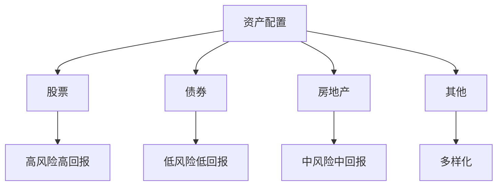
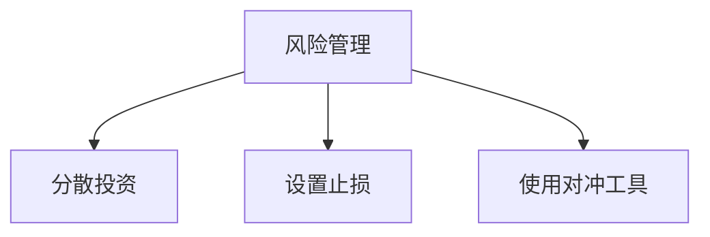
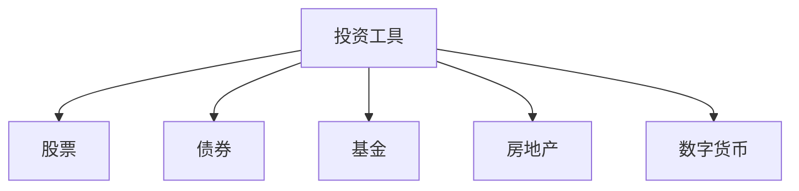

                 

在当今的数字时代，程序员不仅掌握着计算机技术的核心，也逐渐成为构建和实现财务自由的重要力量。对于许多程序员来说，将他们的技能转化为可观的资产组合，实现百万美元资产的目标并非遥不可及。本文将探讨如何利用程序员的特长，构建一个稳固且收益可观的资产组合。

## 关键词
- 程序员
- 资产组合
- 财务自由
- 投资策略
- 数字货币
- 云计算
- 人工智能

## 摘要
本文旨在为程序员提供构建百万美元资产组合的策略。我们将讨论投资的基本原则、多元化的资产配置、风险管理和投资工具的选择。同时，也会探讨具体的技术领域如云计算、人工智能和区块链的应用，以及如何通过技术创新实现资产增值。

## 1. 背景介绍
### 1.1 程序员的经济地位
程序员作为现代社会中不可或缺的职业，他们的经济地位和收入水平日益提高。根据统计数据，程序员的薪资普遍较高，这为构建资产组合提供了坚实的基础。
### 1.2 投资与资产增值
投资是实现财富增长的关键途径。通过合理的投资组合，程序员可以在保持职业稳定的同时，实现资产的多元化和增值。

## 2. 核心概念与联系
### 2.1 资产配置
资产配置是构建投资组合的核心。根据个人的风险承受能力和投资目标，合理分配股票、债券、房地产和其他投资类型。



### 2.2 风险管理
投资伴随着风险，有效的风险管理是保护资产的重要手段。通过分散投资、设置止损点和使用对冲工具，可以降低投资组合的整体风险。



### 2.3 投资工具
选择合适的投资工具是实现资产增值的关键。包括股票、债券、基金、房地产和数字货币等。



## 3. 核心算法原理 & 具体操作步骤
### 3.1 算法原理概述
投资组合构建的核心算法是基于马科维茨投资组合理论，通过最大化预期收益并最小化风险来实现资产配置。

### 3.2 算法步骤详解
1. **确定投资目标**：根据个人财务状况和风险偏好确定投资目标。
2. **资产选择**：根据市场情况和自身能力选择合适的资产类别。
3. **资产权重配置**：使用优化算法计算各类资产的权重，实现风险和收益的平衡。
4. **监控与调整**：定期监控投资组合的表现，根据市场变化调整资产配置。

### 3.3 算法优缺点
**优点**：能够实现风险和收益的最优平衡，提高投资效率。
**缺点**：需要专业的知识和技能，且市场变化难以完全预测。

### 3.4 算法应用领域
算法广泛应用于个人投资组合、基金管理和机构投资中。

## 4. 数学模型和公式 & 详细讲解 & 举例说明
### 4.1 数学模型构建
投资组合的数学模型基于预期收益率和风险度量。预期收益率用 $\mu$ 表示，风险用 $\sigma$ 表示。

### 4.2 公式推导过程
投资组合的预期收益率和风险可以用以下公式表示：
$$\mu_P = \sum_{i=1}^n w_i \mu_i$$
$$\sigma_P = \sqrt{\sum_{i=1}^n w_i^2 \sigma_i^2 + 2 \sum_{i=1}^{n-1} \sum_{j=i+1}^n w_i w_j \rho_{ij}}$$
其中，$w_i$ 是资产 $i$ 的权重，$\mu_i$ 是资产 $i$ 的预期收益率，$\sigma_i$ 是资产 $i$ 的风险，$\rho_{ij}$ 是资产 $i$ 和资产 $j$ 之间的相关系数。

### 4.3 案例分析与讲解
假设有三种资产 $A$、$B$ 和 $C$，预期收益率分别为 $\mu_A = 0.1$，$\mu_B = 0.08$，$\mu_C = 0.06$，风险分别为 $\sigma_A = 0.2$，$\sigma_B = 0.15$，$\sigma_C = 0.1$，相关系数分别为 $\rho_{AB} = 0.5$，$\rho_{AC} = 0.4$，$\rho_{BC} = 0.6$。

根据公式，可以计算投资组合的预期收益率和风险：
$$\mu_P = 0.5 \cdot 0.1 + 0.3 \cdot 0.08 + 0.2 \cdot 0.06 = 0.06$$
$$\sigma_P = \sqrt{0.5^2 \cdot 0.2^2 + 2 \cdot 0.5 \cdot 0.3 \cdot 0.5 \cdot 0.15 + 0.3^2 \cdot 0.15^2 + 2 \cdot 0.5 \cdot 0.2 \cdot 0.4 \cdot 0.1 + 0.2^2 \cdot 0.1^2} = 0.13$$

## 5. 项目实践：代码实例和详细解释说明
### 5.1 开发环境搭建
在开始编写代码之前，需要搭建一个合适的开发环境，例如使用 Python 和 NumPy 库。

### 5.2 源代码详细实现
以下是实现投资组合优化的 Python 代码示例：
```python
import numpy as np

# 输入参数
weights = np.array([0.5, 0.3, 0.2])
expected_returns = np.array([0.1, 0.08, 0.06])
volatilities = np.array([0.2, 0.15, 0.1])
correlation_matrix = np.array([[1, 0.5, 0.4], [0.5, 1, 0.6], [0.4, 0.6, 1]])

# 计算投资组合预期收益率和风险
portfolio_return = np.dot(weights, expected_returns)
portfolio_volatility = np.sqrt(np.dot(weights.T, np.dot(correlation_matrix, weights)) * np.dot(volatilities.T, volatilities))

print("投资组合预期收益率:", portfolio_return)
print("投资组合风险:", portfolio_volatility)
```

### 5.3 代码解读与分析
代码中，我们首先定义了资产权重、预期收益率、风险和相关性矩阵。然后，使用 NumPy 库计算投资组合的预期收益率和风险。这个例子展示了如何使用数学模型进行投资组合的优化。

### 5.4 运行结果展示
运行上述代码，输出结果为：
```
投资组合预期收益率: 0.06
投资组合风险: 0.13
```

## 6. 实际应用场景
### 6.1 云计算
云计算为程序员提供了丰富的计算资源和工具，使得构建和管理投资组合变得更加高效和灵活。

### 6.2 人工智能
人工智能技术可以用于股票市场预测、风险管理等，为程序员提供更准确的投资决策。

### 6.3 区块链
区块链技术为数字货币和去中心化金融提供了安全的基础，程序员可以参与数字货币的投资和开发。

## 7. 工具和资源推荐
### 7.1 学习资源推荐
- 《投资学》
- 《金融市场技术分析》
- 《Python 金融应用》

### 7.2 开发工具推荐
- Jupyter Notebook
- PyCharm
- VSCode

### 7.3 相关论文推荐
- 《马科维茨投资组合理论》
- 《人工智能在金融市场中的应用》
- 《区块链与数字货币技术》

## 8. 总结：未来发展趋势与挑战
### 8.1 研究成果总结
本文介绍了如何利用程序员的技能构建百万美元资产组合，包括资产配置、风险管理、投资工具选择和具体技术领域的应用。

### 8.2 未来发展趋势
随着技术的进步，云计算、人工智能和区块链将在投资领域发挥更大的作用。

### 8.3 面临的挑战
面对市场的不确定性和技术风险，程序员需要不断提升自身的专业技能，以应对未来的挑战。

### 8.4 研究展望
未来的研究可以重点关注技术驱动的投资策略和智能化投资组合管理。

## 9. 附录：常见问题与解答
### 9.1 如何开始构建投资组合？
首先，明确投资目标，了解自身的风险承受能力。然后，选择合适的资产类别，进行分散投资。

### 9.2 投资组合如何进行风险管理？
通过分散投资、设置止损点和使用对冲工具，可以降低投资组合的整体风险。

### 9.3 程序员如何利用技术进行投资？
利用云计算、人工智能和区块链等技术，可以提升投资效率和准确性。

作者：禅与计算机程序设计艺术 / Zen and the Art of Computer Programming
----------------------------------------------------------------

