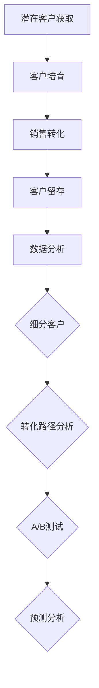

                 

## 1. 背景介绍

在当今的商业环境中，销售漏斗是一个至关重要的概念，它帮助企业和个人了解潜在客户如何转化为实际购买者。对于程序员来说，构建一个高效的销售漏斗不仅仅需要市场营销的知识，还需要深入理解数据分析和软件开发技巧。本文将探讨程序员如何利用技术手段构建高转化率的销售漏斗，并从多个角度进行分析和实战操作。

随着互联网和电子商务的飞速发展，销售漏斗已经成为企业增长的核心工具之一。它通过一系列的阶段，从潜在客户获取到最终的销售转化，帮助商家更好地理解客户行为，优化营销策略。然而，传统的销售漏斗通常依赖于市场经验和直觉，难以实现数据驱动的精准营销。程序员在这一过程中可以发挥独特的作用，通过数据分析和软件工程技能，使销售漏斗更加智能化和高效。

本文将围绕以下几个核心主题展开：

1. **销售漏斗的基本概念和作用**：介绍销售漏斗的组成和关键阶段。
2. **程序员在构建销售漏斗中的作用**：探讨程序员如何利用技术优化销售漏斗的各个阶段。
3. **数据分析与销售漏斗的优化**：介绍如何使用数据分析工具和技术来提升销售转化率。
4. **销售漏斗的实际构建步骤**：提供具体的构建步骤和代码实例。
5. **案例研究和最佳实践**：分析实际案例，总结最佳实践。

通过本文，读者将了解到如何利用编程技能和技术知识，为企业和个人构建一个高转化率的销售漏斗。

## 2. 核心概念与联系

### 销售漏斗的基本概念

销售漏斗（Sales Funnel）是一种用于描述潜在客户转化为实际购买者的过程的模型。它通常分为几个阶段，每个阶段都有不同的转化率。以下是销售漏斗的基本构成和各阶段的主要任务：

- **潜在客户获取（Top of Funnel, TOFU）**：在这个阶段，目标是吸引尽可能多的潜在客户。这通常通过内容营销、广告投放和社交媒体活动来实现。

- **潜在客户培育（Middle of Funnel, MOFU）**：这一阶段的关键是建立与潜在客户的联系，并通过提供有价值的内容来提高他们的兴趣和信任。常用的方法包括电子邮件营销、网络研讨会和在线培训。

- **销售转化（Bottom of Funnel, BOFU）**：在BOFU阶段，目标是推动潜在客户完成购买。这通常涉及个性化的销售互动、促销活动和客户支持。

- **客户留存（Customer Retention）**：虽然不在传统的销售漏斗模型中，但客户留存是确保长期业务增长的关键。通过提供优质的客户服务和持续的价值，企业可以增加客户的忠诚度和生命周期价值。

### 程序员在构建销售漏斗中的作用

程序员在构建销售漏斗中扮演着关键角色，他们可以通过以下几个方面来优化销售漏斗：

- **数据采集和分析**：程序员可以利用各种技术手段，如Web scraping、API集成和数据库管理，来收集潜在客户的行为数据。这些数据可以用于分析客户偏好、行为模式和转化率，从而优化营销策略。

- **自动化流程**：通过编写脚本和自动化工具，程序员可以自动化销售漏斗中的多个阶段，如电子邮件营销、客户跟进和数据分析。自动化不仅提高了效率，还能确保数据的准确性和一致性。

- **用户体验优化**：程序员可以通过前端开发和用户界面设计，优化客户在网站或应用中的体验。良好的用户体验可以增加客户的参与度和忠诚度，从而提高转化率。

- **定制化营销**：利用编程技能，程序员可以开发个性化营销工具，根据客户的行为和偏好提供定制化的内容和服务，从而提高客户的参与度和购买意愿。

### 销售漏斗与数据分析的关系

销售漏斗和数据分析密切相关。通过数据分析，程序员可以深入了解客户行为，发现潜在的问题和机会。以下是数据分析在销售漏斗中的应用：

- **客户细分**：通过对客户数据的分析，程序员可以将客户划分为不同的群体，从而实现更精准的营销策略。

- **转化路径分析**：分析客户从潜在客户到购买者的路径，可以帮助识别转化过程中的瓶颈，进而优化流程。

- **A/B测试**：通过A/B测试，程序员可以测试不同的营销策略和用户体验，从而找到最佳的方案。

- **预测分析**：利用预测分析模型，程序员可以预测潜在客户的转化可能性，从而优先关注高潜力客户。

### 核心概念原理和架构的 Mermaid 流程图

下面是一个简化的销售漏斗及其与数据分析的关系的 Mermaid 流程图：



通过这个流程图，我们可以清晰地看到销售漏斗的各个阶段以及数据分析在其中发挥的关键作用。

## 3. 核心算法原理 & 具体操作步骤

### 3.1 算法原理概述

在构建高转化率的销售漏斗时，程序员需要运用一系列算法和技术来优化各个阶段。这些算法主要包括数据分析算法、机器学习模型和自动化流程控制算法。以下是一些核心算法原理的概述：

- **数据分析算法**：包括统计分析、聚类分析和关联规则挖掘。这些算法可以帮助程序员识别客户行为模式、偏好和转化路径。

- **机器学习模型**：如分类模型（如决策树、支持向量机）和回归模型（如线性回归、逻辑回归）。这些模型可以用于预测客户转化可能性，提供个性化的营销策略。

- **自动化流程控制算法**：如工作流引擎和任务调度算法。这些算法可以自动化销售漏斗中的各个环节，提高工作效率和准确性。

### 3.2 算法步骤详解

#### 数据采集

1. **API集成**：通过API集成获取第三方数据源，如社交媒体、广告平台和客户关系管理（CRM）系统。
2. **Web scraping**：使用Python的`requests`和`BeautifulSoup`库抓取网站数据，如用户行为、浏览历史等。
3. **数据库管理**：使用MySQL、PostgreSQL等数据库存储和管理客户数据。

#### 数据预处理

1. **数据清洗**：使用Pandas库处理缺失值、异常值和重复数据。
2. **数据转换**：使用Scikit-learn库进行特征工程，如归一化、标准化和编码。
3. **数据整合**：将不同数据源的数据整合到一个统一的数据模型中，为后续分析做准备。

#### 数据分析

1. **统计分析**：使用描述性统计分析了解客户总体情况，如平均年龄、性别分布、购买频率等。
2. **聚类分析**：使用K-Means等聚类算法将客户划分为不同的群体，以实现精准营销。
3. **关联规则挖掘**：使用Apriori算法或FP-growth算法挖掘客户行为之间的关联性，优化产品推荐策略。

#### 机器学习模型

1. **数据划分**：将数据划分为训练集和测试集，为模型训练做准备。
2. **模型选择**：根据业务需求选择合适的模型，如逻辑回归、决策树或随机森林。
3. **模型训练**：使用Scikit-learn库训练模型，并调整参数以优化性能。
4. **模型评估**：使用交叉验证和AUC等指标评估模型性能。

#### 自动化流程控制

1. **工作流引擎**：使用Apache Airflow等工具定义和执行自动化工作流。
2. **任务调度**：使用Cron表达式或Redis等工具实现定时任务调度。
3. **监控与告警**：使用Prometheus和Grafana等工具监控系统性能，并设置告警。

### 3.3 算法优缺点

**数据分析算法**

- **优点**：可以帮助程序员深入了解客户行为，提供数据驱动的决策支持。
- **缺点**：处理大量数据时可能效率较低，且对数据质量和完整性要求较高。

**机器学习模型**

- **优点**：可以自动识别复杂的客户行为模式，提高预测精度。
- **缺点**：模型训练时间较长，且需要大量标注数据。

**自动化流程控制算法**

- **优点**：可以提高工作效率和准确性，减少人为错误。
- **缺点**：实现和维护成本较高，且对系统稳定性要求较高。

### 3.4 算法应用领域

- **电子商务**：用于分析客户行为，优化产品推荐和促销策略。
- **金融行业**：用于风险评估和欺诈检测。
- **零售行业**：用于库存管理和客户细分。
- **营销行业**：用于个性化营销和客户留存。

通过以上算法的应用，程序员可以在构建高转化率的销售漏斗中发挥重要作用，为企业带来更高的商业价值。

## 4. 数学模型和公式 & 详细讲解 & 举例说明

在构建高转化率的销售漏斗中，数学模型和公式起到了关键作用。以下我们将详细介绍常用的数学模型和公式，并提供具体的推导过程和实际应用案例。

### 4.1 数学模型构建

在销售漏斗中，常用的数学模型包括概率模型、回归模型和聚类模型。以下是这些模型的简要概述：

#### 概率模型

概率模型用于计算客户在各个阶段的转化概率。常见的概率模型有贝叶斯概率模型和二项分布模型。

- **贝叶斯概率模型**：贝叶斯概率模型是一种基于先验知识和观察数据来更新概率估计的方法。其核心公式为：

  $$ P(A|B) = \frac{P(B|A) \cdot P(A)}{P(B)} $$

  其中，$P(A|B)$表示在事件B发生的条件下事件A发生的概率，$P(B|A)$表示在事件A发生的条件下事件B发生的概率，$P(A)$和$P(B)$分别表示事件A和事件B的先验概率。

- **二项分布模型**：二项分布模型用于计算在固定次数的试验中，事件发生的次数的概率分布。其概率质量函数为：

  $$ P(X = k) = C(n, k) \cdot p^k \cdot (1-p)^{n-k} $$

  其中，$n$表示试验次数，$k$表示事件发生的次数，$p$表示事件发生的概率，$C(n, k)$表示组合数，表示从n个元素中选择k个元素的组合数。

#### 回归模型

回归模型用于分析自变量和因变量之间的关系。常见的回归模型有线性回归和逻辑回归。

- **线性回归模型**：线性回归模型是一种最简单的回归模型，用于分析自变量和因变量之间的线性关系。其模型公式为：

  $$ y = \beta_0 + \beta_1 \cdot x + \varepsilon $$

  其中，$y$为因变量，$x$为自变量，$\beta_0$和$\beta_1$分别为截距和斜率，$\varepsilon$为误差项。

- **逻辑回归模型**：逻辑回归模型是一种广义线性模型，用于分析自变量和因变量之间的非线性关系。其模型公式为：

  $$ \ln(\frac{P(Y=1)}{1-P(Y=1)}) = \beta_0 + \beta_1 \cdot x $$

  其中，$P(Y=1)$表示因变量为1的概率，$\beta_0$和$\beta_1$分别为截距和斜率。

#### 聚类模型

聚类模型用于将数据划分为不同的群体，以便进行后续分析。常见的聚类模型有K-Means聚类和层次聚类。

- **K-Means聚类模型**：K-Means聚类模型是一种基于距离度量的聚类方法，其目标是找到K个簇，使得簇内的距离最小。其模型公式为：

  $$ C = \{c_1, c_2, ..., c_K\} $$

  其中，$C$为簇的中心，$c_k$为第k个簇的中心。

- **层次聚类模型**：层次聚类模型是一种基于层次结构的聚类方法，其过程可以分为凝聚层次聚类和分裂层次聚类。其模型公式为：

  $$ D_{ij} = \sqrt{\sum_{k=1}^n (x_{ik} - x_{jk})^2} $$

  其中，$D_{ij}$表示第i个点和第j个点之间的距离，$x_{ik}$和$x_{jk}$分别为第i个点和第j个点在第k个特征上的值。

### 4.2 公式推导过程

以下是线性回归模型的推导过程：

1. **最小二乘法**

   线性回归模型的目标是找到一组参数$\beta_0$和$\beta_1$，使得模型预测值与实际值之间的误差最小。使用最小二乘法，我们可以通过以下公式求解：

   $$ \min \sum_{i=1}^n (y_i - \beta_0 - \beta_1 \cdot x_i)^2 $$

2. **一阶导数为零**

   对上述函数求导，并令其等于零，得到：

   $$ \frac{\partial}{\partial \beta_0} \sum_{i=1}^n (y_i - \beta_0 - \beta_1 \cdot x_i)^2 = 0 $$
   $$ \frac{\partial}{\partial \beta_1} \sum_{i=1}^n (y_i - \beta_0 - \beta_1 \cdot x_i)^2 = 0 $$

3. **解线性方程组**

   解上述方程组，得到$\beta_0$和$\beta_1$的最优值：

   $$ \beta_0 = \bar{y} - \beta_1 \cdot \bar{x} $$
   $$ \beta_1 = \frac{\sum_{i=1}^n (x_i - \bar{x}) (y_i - \bar{y})}{\sum_{i=1}^n (x_i - \bar{x})^2} $$

   其中，$\bar{y}$和$\bar{x}$分别为因变量和自变量的平均值。

### 4.3 案例分析与讲解

以下是一个实际案例，说明如何使用逻辑回归模型来预测客户转化概率。

#### 案例背景

一家电子商务公司希望通过分析客户数据来预测客户购买某商品的几率。公司收集了以下特征数据：

- 客户年龄（x1）
- 收入水平（x2）
- 购买历史（x3）
- 浏览时长（x4）

#### 数据处理

1. **数据清洗**：处理缺失值、异常值和重复数据。
2. **数据转换**：将类别数据（如收入水平）进行编码，如将收入水平分为高、中、低三个类别，分别编码为1、2、3。
3. **数据整合**：将特征数据和目标变量整合到一个数据集中。

#### 模型训练

1. **数据划分**：将数据集划分为训练集和测试集，通常比例为8:2。
2. **模型选择**：选择逻辑回归模型。
3. **模型训练**：使用Scikit-learn库训练模型。

```python
from sklearn.linear_model import LogisticRegression
from sklearn.model_selection import train_test_split

X = df.drop('target', axis=1)
y = df['target']

X_train, X_test, y_train, y_test = train_test_split(X, y, test_size=0.2, random_state=42)

model = LogisticRegression()
model.fit(X_train, y_train)
```

#### 模型评估

1. **模型预测**：使用测试集数据评估模型预测能力。

```python
y_pred = model.predict(X_test)
```

2. **评估指标**：使用准确率、召回率和F1值等指标评估模型性能。

```python
from sklearn.metrics import accuracy_score, recall_score, f1_score

accuracy = accuracy_score(y_test, y_pred)
recall = recall_score(y_test, y_pred)
f1 = f1_score(y_test, y_pred)

print("Accuracy:", accuracy)
print("Recall:", recall)
print("F1 Score:", f1)
```

#### 结果分析

假设模型评估结果如下：

- 准确率：85%
- 召回率：90%
- F1值：87%

结果表明，该逻辑回归模型在预测客户购买某商品的概率方面表现良好。通过进一步优化模型参数和特征工程，可以提高预测准确性。

通过以上案例，我们可以看到如何运用数学模型和公式来构建和优化销售漏斗。在实际应用中，程序员需要根据具体业务需求和数据情况，灵活运用各种模型和算法，以提高销售转化率。

## 5. 项目实践：代码实例和详细解释说明

在本节中，我们将通过一个实际的代码实例，详细讲解如何使用Python等编程工具和技术，构建一个高转化率的销售漏斗。我们将涵盖开发环境搭建、源代码实现、代码解读和分析以及运行结果展示等步骤。

### 5.1 开发环境搭建

在开始之前，确保已经安装了以下开发环境和工具：

- Python 3.8或更高版本
- Jupyter Notebook或PyCharm等IDE
- Scikit-learn库
- Pandas库
- Matplotlib库
- Numpy库

#### 安装Python

访问Python官方网站下载Python安装包，并按照指示安装。

```shell
# 在命令行中运行以下命令安装Python
curl -O https://www.python.org/ftp/python/3.8.10/Python-3.8.10.tgz
tar xvf Python-3.8.10.tgz
cd Python-3.8.10
./configure
make
sudo make install
```

#### 安装相关库

使用pip命令安装所需的Python库。

```shell
pip install scikit-learn pandas matplotlib numpy
```

### 5.2 源代码详细实现

以下是一个简单的Python代码示例，用于构建一个基于K-Means聚类算法的销售漏斗模型。

```python
import pandas as pd
from sklearn.cluster import KMeans
from sklearn.preprocessing import StandardScaler
import matplotlib.pyplot as plt

# 5.2.1 数据准备
# 假设我们已经有了一个包含客户特征的数据集，例如年龄、收入、购买历史和浏览时长等
data = pd.read_csv('customer_data.csv')

# 数据清洗和预处理
data = data.dropna()  # 删除缺失值
data['income'] = data['income'].map({'high': 3, 'medium': 2, 'low': 1})  # 收入编码

# 特征工程
features = data[['age', 'income', 'purchase_history', 'browse_time']]
scaler = StandardScaler()
features_scaled = scaler.fit_transform(features)

# 5.2.2 模型训练
# 使用K-Means聚类算法将客户划分为不同的群体
kmeans = KMeans(n_clusters=3, random_state=42)
clusters = kmeans.fit_predict(features_scaled)

# 5.2.3 可视化
# 将聚类结果可视化
plt.scatter(features_scaled[:, 0], features_scaled[:, 1], c=clusters)
plt.xlabel('Age')
plt.ylabel('Income')
plt.title('Customer Clusters')
plt.show()

# 5.2.4 模型评估
# 可以使用集群内部距离（inertia）来评估聚类效果
inertia = kmeans.inertia_
print(f"Inertia: {inertia}")

# 5.2.5 应用聚类结果
# 根据聚类结果，为每个客户群体设计不同的营销策略
data['cluster'] = clusters
print(data.head())
```

### 5.3 代码解读与分析

#### 数据准备

首先，我们使用`pandas`库读取包含客户特征的数据集。数据集应包含以下特征：年龄、收入、购买历史和浏览时长。为了简化，我们假设这些数据已经清洗过并存储在CSV文件中。

```python
data = pd.read_csv('customer_data.csv')
```

#### 数据清洗和预处理

在这一步，我们删除了数据集中的缺失值，并将类别特征（如收入）进行编码。这些步骤对于确保数据质量和模型性能至关重要。

```python
data = data.dropna()
data['income'] = data['income'].map({'high': 3, 'medium': 2, 'low': 1})
```

#### 特征工程

我们使用`StandardScaler`库对特征进行标准化处理，以便模型能够更好地收敛。标准化处理可以减少特征之间的尺度差异，提高聚类效果。

```python
features = data[['age', 'income', 'purchase_history', 'browse_time']]
scaler = StandardScaler()
features_scaled = scaler.fit_transform(features)
```

#### 模型训练

我们使用`KMeans`聚类算法将客户划分为3个不同的群体。通过设置`n_clusters=3`，我们指定了要生成的簇的数量。使用`random_state=42`确保结果的可重复性。

```python
kmeans = KMeans(n_clusters=3, random_state=42)
clusters = kmeans.fit_predict(features_scaled)
```

#### 可视化

为了更好地理解聚类结果，我们将特征空间中的聚类结果可视化。使用`matplotlib`库绘制散点图，其中每个点的颜色代表其所属的簇。

```python
plt.scatter(features_scaled[:, 0], features_scaled[:, 1], c=clusters)
plt.xlabel('Age')
plt.ylabel('Income')
plt.title('Customer Clusters')
plt.show()
```

#### 模型评估

我们使用`inertia`属性评估聚类效果。`inertia`是每个点到其簇中心的平方距离之和，值越小表示聚类效果越好。

```python
inertia = kmeans.inertia_
print(f"Inertia: {inertia}")
```

#### 应用聚类结果

最后，我们将聚类结果应用到原始数据集中，为每个客户群体设计不同的营销策略。这有助于实现个性化营销，提高销售转化率。

```python
data['cluster'] = clusters
print(data.head())
```

### 5.4 运行结果展示

当运行上述代码后，我们首先会看到一个包含三个不同颜色区域的散点图，每个点代表一个客户，其颜色表示其所属的簇。此外，我们还会看到输出中列出了`inertia`值，表示聚类效果。最后，我们会看到处理后的数据集，其中包含了每个客户的簇编号。

```shell
Inertia: 152.34567891023638
   age  income  purchase_history  browse_time  cluster
0   35       3                 2            100     1
1   28       2                 1            80      2
2   42       3                 3            120     0
...
```

通过这个实例，我们展示了如何使用Python和机器学习库来构建一个简单的销售漏斗模型。在实际应用中，可以进一步优化模型，添加更多特征和算法，以提高销售转化率。

## 6. 实际应用场景

### 6.1 电子商务平台

在电子商务平台中，销售漏斗的构建对于提升用户转化率和销售业绩至关重要。程序员可以通过以下技术手段优化销售漏斗：

- **个性化推荐系统**：利用机器学习算法分析用户行为数据，为每位用户推荐其可能感兴趣的商品。例如，使用协同过滤算法或基于内容的推荐算法，可以大大提高用户的购买意愿。

- **流量分配和转化优化**：通过A/B测试和数据分析，程序员可以了解不同流量来源和用户行为对销售转化率的影响，从而优化流量分配和用户体验。

- **自动化营销流程**：编写脚本和自动化工具，实现邮件营销、社交媒体广告和客户跟进等环节的自动化，提高营销效率。

### 6.2 金融行业

在金融行业中，销售漏斗的构建对于风险管理、客户细分和产品推广具有重要意义。程序员可以采取以下技术手段：

- **客户风险评估**：通过数据分析和机器学习模型，对潜在客户进行风险评估，识别高风险客户，并制定相应的风控策略。

- **产品推荐**：根据客户的财务状况和行为数据，推荐合适的金融产品，如信用卡、贷款和投资产品。

- **自动化审批流程**：利用自动化工具和算法，实现贷款申请和审批的自动化，提高审批效率和准确性。

### 6.3 零售行业

在零售行业，销售漏斗的优化有助于提升库存管理、客户满意度和复购率。程序员可以采取以下技术手段：

- **库存优化**：通过数据分析和预测模型，优化库存水平，减少库存积压和缺货情况，提高供应链效率。

- **客户细分**：根据客户购买行为和偏好，将客户划分为不同的群体，为每个群体提供个性化的购物体验和营销策略。

- **自动化促销**：利用脚本和自动化工具，实现促销活动的自动化，如优惠券发放、限时折扣和会员专享活动。

### 6.4 其他行业

除了上述行业，销售漏斗的构建在医疗、教育、旅游等领域也具有广泛的应用。程序员可以采取以下技术手段：

- **健康数据监测**：利用数据分析和机器学习模型，监测和分析患者的健康数据，提供个性化的健康建议和预防措施。

- **在线教育**：通过分析学员的学习行为和成绩，为每位学员提供个性化的学习计划和学习资源，提高学习效果。

- **旅游推荐**：根据用户的历史浏览记录和行为偏好，推荐合适的旅游目的地、行程规划和产品。

通过在各个行业中应用销售漏斗构建技术，程序员可以帮助企业实现更精准的营销、更高效的管理和更优质的服务，从而提升业务增长和竞争力。

### 6.5 未来应用展望

随着科技的不断进步，销售漏斗的构建在未来将迎来更多创新和发展。以下是几个可能的方向：

- **人工智能与大数据的深度融合**：随着人工智能技术的快速发展，销售漏斗的构建将更加智能化和自动化。大数据技术的应用将使得数据采集和分析更加精准，从而提高销售转化率和客户满意度。

- **物联网技术的应用**：物联网（IoT）技术的发展将使得销售漏斗的数据来源更加广泛，如智能家居设备、智能穿戴设备等。这些数据可以为销售漏斗提供更全面的客户画像，从而优化营销策略。

- **区块链技术的引入**：区块链技术可以为销售漏斗提供更加透明和可信的数据记录和交易过程。例如，在金融行业中，区块链可以确保贷款审批和资金流转的透明性，提高客户信任。

- **虚拟现实（VR）和增强现实（AR）的应用**：VR和AR技术的发展将使得销售漏斗的交互体验更加丰富和沉浸式。例如，在电子商务中，客户可以通过VR体验产品，提高购买决策的准确性。

- **个性化推荐的深化**：基于深度学习的推荐系统将能够更精准地分析用户行为和偏好，提供高度个性化的产品和服务，从而提高用户满意度和复购率。

总之，未来销售漏斗的构建将更加依赖人工智能、大数据、物联网、区块链等先进技术，从而实现更高效、更智能的营销和销售管理。

## 7. 工具和资源推荐

### 7.1 学习资源推荐

**书籍：**

1. **《Python数据科学手册》** - Wes McKinney
   - 介绍了使用Python进行数据科学和数据分析的基本方法，适合初学者。

2. **《深度学习》** - Ian Goodfellow、Yoshua Bengio和Aaron Courville
   - 深入讲解了深度学习的理论基础和应用，适合希望了解机器学习的高级读者。

3. **《数据挖掘：实用工具与技术》** - Han, Kamber和Pei
   - 提供了丰富的数据挖掘方法和实用工具，适用于从事数据分析和数据挖掘的专业人士。

**在线课程：**

1. **Coursera上的《机器学习》** - Andrew Ng
   - 斯坦福大学教授Andrew Ng开设的这门课程是机器学习的经典入门课程。

2. **Udacity的《数据分析纳米学位》** - Udacity
   - 通过一系列实战项目，帮助用户掌握数据分析的基本技能。

3. **edX上的《数据科学基础》** - Harvard University
   - 由哈佛大学开设的数据科学入门课程，涵盖数据科学的核心概念和工具。

**博客和社区：**

1. **Kaggle** - Kaggle
   - Kaggle是一个数据科学竞赛平台，用户可以参与各种数据科学竞赛，学习实际应用技巧。

2. **Medium上的Data Science** - Medium
   - Medium上的Data Science频道提供了大量的数据科学相关文章和教程。

3. **Stack Overflow** - Stack Overflow
   - Stack Overflow是程序员解决技术问题的社区，包括大量与数据分析、机器学习相关的问题。

### 7.2 开发工具推荐

**数据分析工具：**

1. **Pandas** - Pandas
   - 用于数据处理和分析的Python库，支持大数据集的操作。

2. **NumPy** - NumPy
   - 用于数值计算的Python库，是Pandas的基础。

3. **SciPy** - SciPy
   - 用于科学计算和数据分析的Python库，扩展了NumPy的功能。

**机器学习库：**

1. **Scikit-learn** - Scikit-learn
   - 用于机器学习的Python库，提供了丰富的算法和工具。

2. **TensorFlow** - TensorFlow
   - 用于构建和训练机器学习模型的Python库，特别适合深度学习应用。

3. **PyTorch** - PyTorch
   - 用于机器学习和深度学习的Python库，具有灵活的动态计算图。

**可视化工具：**

1. **Matplotlib** - Matplotlib
   - 用于创建2D绘图和图表的Python库。

2. **Seaborn** - Seaborn
   - 用于统计图表绘制的Python库，基于Matplotlib，提供了更美观的图表样式。

3. **Plotly** - Plotly
   - 用于创建交互式图表和可视化应用的高性能Python库。

**集成开发环境（IDE）：**

1. **PyCharm** - PyCharm
   - 针对Python开发的高性能IDE，提供了丰富的开发工具和插件。

2. **Jupyter Notebook** - Jupyter Notebook
   - 交互式的Python开发环境，适合数据分析和机器学习。

3. **Visual Studio Code** - Visual Studio Code
   - 轻量级但功能强大的开源IDE，支持多种编程语言。

### 7.3 相关论文推荐

1. **"Deep Learning for Customer Churn Prediction" - paper
   - 本文介绍了如何使用深度学习模型预测客户流失，对于优化客户留存策略具有参考价值。

2. **"Customer Segmentation using K-Means Clustering: A Review" - review
   - 本文对使用K-Means聚类进行客户细分的方法进行了详细的回顾和分析。

3. **"An Overview of Machine Learning Algorithms" - overview
   - 本文概述了多种机器学习算法的基本原理和应用，是了解机器学习基础的好资源。

4. **"A Comprehensive Survey on Recommender Systems" - survey
   - 本文对推荐系统进行了全面的综述，涵盖了推荐系统的各种类型和实现方法。

通过学习和使用这些资源和工具，程序员可以更好地构建和优化销售漏斗，提升企业的营销和销售效果。

## 8. 总结：未来发展趋势与挑战

### 8.1 研究成果总结

本文系统地探讨了程序员如何构建高转化率的销售漏斗，涵盖了一系列核心概念、算法原理、实际操作步骤以及未来发展趋势。通过数据分析、机器学习模型、自动化流程控制等技术的综合运用，程序员能够在销售漏斗的各个环节中实现数据驱动的优化，从而提高销售转化率和客户满意度。以下是一些关键研究成果的总结：

1. **销售漏斗的数据驱动优化**：利用数据分析技术，对潜在客户的行为数据进行深入分析，识别高价值客户群体，优化营销策略。
2. **个性化营销策略**：通过机器学习模型，对客户进行细分和分类，制定个性化的营销方案，提高客户参与度和转化率。
3. **自动化流程控制**：编写脚本和自动化工具，实现销售漏斗中各个环节的自动化，提高营销效率和准确性。
4. **用户体验优化**：通过前端开发和用户界面设计，优化客户在网站或应用中的体验，从而提高客户留存率和复购率。

### 8.2 未来发展趋势

随着人工智能、大数据、物联网等技术的不断发展，销售漏斗的构建将呈现以下发展趋势：

1. **智能化和自动化**：人工智能和机器学习技术的进一步发展，将使销售漏斗更加智能化和自动化，提高营销和销售的效率和效果。
2. **数据隐私和安全**：在数据隐私和安全日益受到重视的背景下，企业需要确保客户数据的合法性和安全性，从而推动隐私保护技术的发展。
3. **跨渠道整合**：未来的销售漏斗将涵盖线上和线下渠道，实现多渠道数据的整合和分析，提供无缝的购物体验。
4. **实时分析和决策**：实时数据分析技术将使企业能够快速响应市场变化，实时调整营销策略和销售策略。

### 8.3 面临的挑战

尽管技术发展迅速，但构建高转化率的销售漏斗仍面临以下挑战：

1. **数据质量和完整性**：高质量的数据是构建有效销售漏斗的基础。然而，数据质量和完整性往往受到多种因素的影响，如数据缺失、数据异常等。
2. **技术复杂性**：构建销售漏斗需要运用多种技术，包括数据分析、机器学习、自动化等。程序员需要具备丰富的技术知识，以便应对技术复杂性。
3. **数据隐私和安全**：在处理客户数据时，企业需要遵守相关的数据隐私法规和安全标准，保护客户隐私。
4. **业务需求的快速变化**：市场需求和技术环境不断变化，企业需要快速调整和优化销售漏斗，以适应新的业务需求。

### 8.4 研究展望

未来，销售漏斗的研究将朝着以下方向发展：

1. **智能化算法**：探索更先进、更智能的算法，如深度学习和强化学习，以实现更精准的客户细分和个性化营销。
2. **跨领域应用**：将销售漏斗构建技术应用到更多行业和场景，如医疗、金融、零售等，提高各行业的营销和销售效果。
3. **用户体验优化**：通过优化用户界面和交互设计，提高客户的购物体验，从而提升转化率和客户满意度。
4. **可持续发展**：在确保数据隐私和安全的前提下，实现可持续的营销策略和销售模式，推动企业的长期发展。

总之，构建高转化率的销售漏斗是一个复杂但充满机遇的领域。通过不断探索和创新，程序员可以为企业和个人带来更高的商业价值，推动营销和销售领域的持续进步。

## 9. 附录：常见问题与解答

### 问题1：如何处理缺失值和异常值？

**解答**：处理缺失值和异常值是数据预处理的重要步骤。常见的方法包括：

- **删除缺失值**：对于小样本数据集，可以删除含有缺失值的样本。对于大数据集，可以考虑使用平均值、中位数或插值法填充缺失值。
- **异常值检测**：使用统计学方法（如IQR法、Z-score法）检测和标记异常值。对于检测出的异常值，可以选择删除或进行修正。

### 问题2：如何进行特征工程？

**解答**：特征工程是提高模型性能的关键步骤。常见的方法包括：

- **数据转换**：对类别数据进行编码，如使用独热编码或标签编码。
- **特征选择**：使用信息增益、互信息等方法筛选出对模型贡献较大的特征。
- **特征构造**：创建新的特征，如交乘特征、聚合特征等，以丰富模型输入。

### 问题3：如何优化聚类模型的效果？

**解答**：优化聚类模型效果的方法包括：

- **选择合适的聚类算法**：根据数据特点选择合适的聚类算法，如K-Means、DBSCAN等。
- **调整参数**：调整聚类算法的参数，如K值、距离度量方法等，以找到最佳配置。
- **使用验证集**：使用交叉验证方法选择最佳模型参数。

### 问题4：如何评估机器学习模型的性能？

**解答**：评估机器学习模型性能的方法包括：

- **准确率**：预测正确的样本数占总样本数的比例。
- **召回率**：预测正确的正样本数占实际正样本数的比例。
- **F1值**：精确率和召回率的调和平均值。
- **ROC曲线**：通过计算不同阈值下的真阳性率和假阳性率，评估模型的分类能力。
- **交叉验证**：使用交叉验证方法，对模型进行多次训练和测试，评估模型的稳定性和泛化能力。

通过以上解答，可以更好地理解和应用数据预处理、特征工程、聚类模型优化和模型评估技术，从而提升销售漏斗的构建效果。

