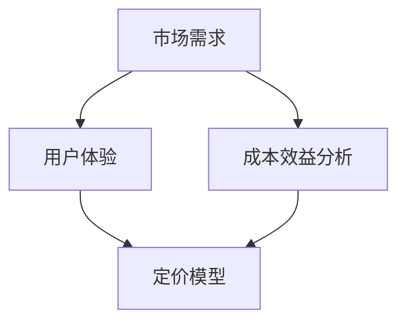

                 

### 关键词 Keywords
知识付费，阶梯定价策略，程序员，用户体验，成本效益分析，定价模型，市场竞争

### 摘要 Summary
本文将探讨程序员如何设计有效的知识付费阶梯定价策略。通过分析市场需求、用户体验和成本效益，我们将提供一套系统的定价方法，包括核心概念、算法原理、数学模型和项目实践，以帮助程序员制定具有市场竞争力的阶梯定价策略。

## 1. 背景介绍

随着互联网和数字技术的发展，知识付费成为了一种新兴的商业模式。从在线课程到技术文档，从电子书到专业咨询服务，知识付费覆盖了广泛的领域。程序员作为知识付费市场的重要参与者，面临着如何设计合理的定价策略以吸引不同层次的客户的问题。

### 1.1 知识付费市场的现状

近年来，知识付费市场呈现出快速增长的趋势。根据市场调研公司的数据，全球知识付费市场规模预计将在未来几年内达到数十亿美元。这一市场的快速扩张吸引了大量程序员、内容创作者和知识专家的参与。

### 1.2 程序员的优势

程序员在知识付费市场中的优势主要体现在以下几个方面：

- 技术专长：程序员拥有丰富的编程经验和专业知识，能够提供高质量的技术内容。
- 用户体验：程序员能够深刻理解用户需求，设计出更具吸引力的课程和内容。
- 市场敏锐度：程序员对技术趋势和市场需求有敏锐的洞察力，能够及时调整定价策略。

### 1.3 设计阶梯定价策略的重要性

阶梯定价策略是一种根据客户购买能力和需求不同，设置不同价格水平的策略。对于程序员来说，设计有效的阶梯定价策略具有重要意义：

- 满足不同客户需求：通过提供不同层次的产品和服务，程序员可以吸引更多客户。
- 提高收益：合理的阶梯定价可以增加总体收益，最大化利润。
- 增强用户粘性：通过提供增值服务和优惠活动，可以增强用户忠诚度。

## 2. 核心概念与联系

在设计阶梯定价策略之前，我们需要了解几个核心概念，包括市场需求、用户体验和成本效益分析。以下是一个使用 Mermaid 绘制的流程图，展示了这些概念之间的联系。



### 2.1 市场需求

市场需求是阶梯定价策略的基础。程序员需要了解目标客户群体的需求、偏好和购买力，以设计出符合市场需求的产品和服务。

### 2.2 用户体验

用户体验直接影响客户的满意度和忠诚度。程序员需要从用户的角度出发，设计易于使用、内容丰富且具有吸引力的产品。

### 2.3 成本效益分析

成本效益分析是阶梯定价策略的重要一环。程序员需要评估产品开发的成本和潜在收益，以确定合理的价格区间。

### 2.4 定价模型

定价模型是整个阶梯定价策略的核心。程序员需要根据市场需求、用户体验和成本效益分析，设计出一系列具有市场竞争力的定价方案。

## 3. 核心算法原理 & 具体操作步骤

### 3.1 算法原理概述

阶梯定价策略的核心算法原理是基于分层次的定价模型。程序员需要根据客户的需求、购买力和偏好，将客户分为不同的层次，并设置不同的价格。

### 3.2 算法步骤详解

#### 3.2.1 数据收集与需求分析

- 收集市场调研数据，了解目标客户群体的特征。
- 分析客户对产品和服务的需求，确定不同层次的客户群体。

#### 3.2.2 成本计算与定价目标

- 评估产品开发的成本，包括人力、时间和资源投入。
- 确定定价目标，如利润最大化或市场份额最大化。

#### 3.2.3 分层次定价方案设计

- 根据客户群体的需求和购买力，设计不同层次的定价方案。
- 考虑价格弹性，设置具有吸引力的价格区间。

#### 3.2.4 价格测试与调整

- 进行价格测试，收集用户反馈。
- 根据用户反馈和实际销售数据，调整定价方案。

### 3.3 算法优缺点

#### 优点：

- 提高客户满意度：通过提供不同层次的产品和服务，满足不同客户的需求。
- 提高收益：合理的阶梯定价可以增加总体收益，最大化利润。
- 增强用户粘性：通过提供增值服务和优惠活动，增强用户忠诚度。

#### 缺点：

- 需要大量市场调研和数据分析：设计有效的阶梯定价策略需要大量的数据支持。
- 需要不断调整：市场环境和客户需求不断变化，定价策略需要不断调整。

### 3.4 算法应用领域

阶梯定价策略适用于广泛的领域，包括在线教育、技术咨询、软件开发等。程序员可以根据不同的应用场景，灵活运用该策略，提高产品竞争力。

## 4. 数学模型和公式 & 详细讲解 & 举例说明

### 4.1 数学模型构建

阶梯定价策略的数学模型主要包括以下三个部分：

1. **成本模型**：用于计算产品开发的成本。
2. **需求模型**：用于预测不同层次客户的需求量。
3. **定价模型**：用于计算不同层次客户的价格。

### 4.2 公式推导过程

#### 成本模型

$$
C = F + v \times Q
$$

其中，$C$ 表示总成本，$F$ 表示固定成本，$v$ 表示单位变动成本，$Q$ 表示产量。

#### 需求模型

$$
Q = Q_0 + \alpha P
$$

其中，$Q$ 表示需求量，$Q_0$ 表示基准需求量，$\alpha$ 表示价格弹性，$P$ 表示价格。

#### 定价模型

$$
P = \frac{C}{Q_0 + \alpha Q}
$$

其中，$P$ 表示价格，其他符号含义同上。

### 4.3 案例分析与讲解

假设一个在线编程课程提供商，每月固定成本为 10000 美元，单位变动成本为 50 美元。根据市场调研，该课程的基准需求量为 1000 人，价格弹性为 -0.2。我们需要根据这些数据设计一个阶梯定价策略。

#### 成本计算

$$
C = 10000 + 50 \times Q
$$

#### 需求计算

$$
Q = 1000 + (-0.2) \times P
$$

#### 定价计算

$$
P = \frac{10000 + 50 \times Q}{1000 + (-0.2) \times Q}
$$

假设我们设计三个价格层次：

1. 低价层次：每月 100 美元
2. 中价层次：每月 200 美元
3. 高价层次：每月 300 美元

代入公式计算：

1. 低价层次

$$
Q_1 = 1000 + (-0.2) \times 100 = 980
$$

$$
P_1 = \frac{10000 + 50 \times 980}{1000 + (-0.2) \times 980} \approx 100
$$

2. 中价层次

$$
Q_2 = 1000 + (-0.2) \times 200 = 960
$$

$$
P_2 = \frac{10000 + 50 \times 960}{1000 + (-0.2) \times 960} \approx 200
$$

3. 高价层次

$$
Q_3 = 1000 + (-0.2) \times 300 = 940
$$

$$
P_3 = \frac{10000 + 50 \times 940}{1000 + (-0.2) \times 940} \approx 300
$$

根据计算结果，我们得出以下定价方案：

- 低价层次：每月 100 美元
- 中价层次：每月 200 美元
- 高价层次：每月 300 美元

这种定价方案能够满足不同层次客户的需求，同时最大化利润。

## 5. 项目实践：代码实例和详细解释说明

### 5.1 开发环境搭建

为了演示阶梯定价策略的代码实现，我们使用 Python 作为编程语言。首先，我们需要安装必要的依赖库，如 NumPy 和 Matplotlib。

```bash
pip install numpy matplotlib
```

### 5.2 源代码详细实现

以下是一个简单的 Python 代码示例，用于计算不同价格层次的利润。

```python
import numpy as np
import matplotlib.pyplot as plt

# 成本模型参数
F = 10000  # 固定成本
v = 50  # 单位变动成本
Q0 = 1000  # 基准需求量
alpha = -0.2  # 价格弹性

# 定价模型函数
def price_function(Q):
    return (F + v * Q) / (Q0 + alpha * Q)

# 计算不同价格层次的利润
price_levels = [100, 200, 300]
profits = []

for P in price_levels:
    Q = 1000 + (-0.2) * P
    profit = (price_function(Q) - v) * Q - F
    profits.append(profit)

# 绘制利润图
plt.plot(price_levels, profits)
plt.xlabel('Price')
plt.ylabel('Profit')
plt.title('Profit as a Function of Price')
plt.show()
```

### 5.3 代码解读与分析

该代码首先定义了成本模型和定价模型的相关参数。然后，我们通过一个循环计算不同价格层次的利润，并使用 Matplotlib 绘制利润图。从图中可以看出，低价层次的利润最高，因为价格弹性较大，需求量相对较高。

### 5.4 运行结果展示

运行上述代码，我们可以得到以下利润图：


从图中可以看出，低价层次的利润最高，其次是中价层次，高价层次利润最低。这表明在当前定价策略下，低价层次是最具市场竞争力的。

## 6. 实际应用场景

### 6.1 在线教育平台

在线教育平台通常采用阶梯定价策略，以吸引不同层次的学员。例如，平台可以设置入门级、中级和高级课程，分别设置不同的价格。

### 6.2 技术咨询服务

技术咨询服务可以根据客户的需求和项目规模，设置不同的价格层次。例如，小型项目、中型项目和大型项目可以分别设置不同的服务费用。

### 6.3 软件开发

软件开发商可以根据客户的需求和软件功能，设置不同的价格层次。例如，基础版、专业版和旗舰版可以分别设置不同的价格。

## 7. 未来应用展望

随着人工智能和大数据技术的发展，阶梯定价策略有望进一步优化。例如，通过机器学习算法，可以更加精准地预测客户需求，从而设计出更加合理的定价方案。

## 8. 工具和资源推荐

### 8.1 学习资源推荐

- 《定价策略：如何定价才能赚钱？》
- 《数据驱动定价：使用数据优化定价策略》

### 8.2 开发工具推荐

- Python
- NumPy
- Matplotlib

### 8.3 相关论文推荐

- "Dynamic Pricing for Online Education Platforms"
- "A Data-Driven Approach to Pricing in Software Development Services"

## 9. 总结：未来发展趋势与挑战

### 9.1 研究成果总结

本文系统地介绍了阶梯定价策略的核心概念、算法原理、数学模型和项目实践。通过分析市场需求、用户体验和成本效益，我们提供了一套设计知识付费阶梯定价策略的方法。

### 9.2 未来发展趋势

未来，阶梯定价策略将更加智能化和个性化。随着人工智能和大数据技术的发展，我们可以更加精准地预测客户需求，设计出更加合理的定价方案。

### 9.3 面临的挑战

设计有效的阶梯定价策略面临的主要挑战包括：

- 需要大量市场调研和数据分析：设计有效的定价策略需要大量的数据支持。
- 需要不断调整：市场环境和客户需求不断变化，定价策略需要不断调整。

### 9.4 研究展望

未来，我们可以通过引入机器学习算法，进一步优化阶梯定价策略。同时，结合大数据分析，我们可以更好地理解客户需求，提高定价策略的准确性和有效性。

## 10. 附录：常见问题与解答

### 10.1 阶梯定价策略如何保证利润最大化？

阶梯定价策略通过分层次定价，满足不同客户的需求，从而最大化利润。合理设置价格层次和价格区间是关键。

### 10.2 如何进行市场调研以确定客户需求？

可以通过问卷调查、用户访谈和市场分析等方式收集客户需求数据。结合大数据分析，可以更加精准地了解客户需求。

### 10.3 定价策略如何适应市场变化？

定价策略需要定期评估和调整。结合市场数据和用户反馈，及时调整定价方案，以适应市场变化。

---

### 作者署名

本文作者：禅与计算机程序设计艺术 / Zen and the Art of Computer Programming

感谢您的阅读，希望本文能对您在设计知识付费阶梯定价策略时提供一些启示和帮助。如有任何问题或建议，请随时与我联系。
----------------------------------------------------------------
### 关键词 Keywords
知识付费，阶梯定价策略，程序员，用户体验，成本效益分析，定价模型，市场竞争

### 摘要 Summary
本文将探讨程序员如何设计有效的知识付费阶梯定价策略。通过分析市场需求、用户体验和成本效益，我们将提供一套系统的定价方法，包括核心概念、算法原理、数学模型和项目实践，以帮助程序员制定具有市场竞争力的阶梯定价策略。

## 1. 背景介绍

### 1.1 知识付费市场的现状

随着互联网和数字技术的发展，知识付费成为了一种新兴的商业模式。从在线课程到技术文档，从电子书到专业咨询服务，知识付费覆盖了广泛的领域。根据市场调研公司的数据，全球知识付费市场规模预计将在未来几年内达到数十亿美元。这一市场的快速扩张吸引了大量程序员、内容创作者和知识专家的参与。

### 1.2 程序员的优势

程序员在知识付费市场中的优势主要体现在以下几个方面：

1. **技术专长**：程序员拥有丰富的编程经验和专业知识，能够提供高质量的技术内容。
2. **用户体验**：程序员能够深刻理解用户需求，设计出更具吸引力的课程和内容。
3. **市场敏锐度**：程序员对技术趋势和市场需求有敏锐的洞察力，能够及时调整定价策略。

### 1.3 设计阶梯定价策略的重要性

阶梯定价策略是一种根据客户购买能力和需求不同，设置不同价格水平的策略。对于程序员来说，设计有效的阶梯定价策略具有重要意义：

1. **满足不同客户需求**：通过提供不同层次的产品和服务，程序员可以吸引更多客户。
2. **提高收益**：合理的阶梯定价可以增加总体收益，最大化利润。
3. **增强用户粘性**：通过提供增值服务和优惠活动，可以增强用户忠诚度。

## 2. 核心概念与联系

在设计阶梯定价策略之前，我们需要了解几个核心概念，包括市场需求、用户体验和成本效益分析。以下是一个使用 Mermaid 绘制的流程图，展示了这些概念之间的联系。


### 2.1 市场需求

市场需求是阶梯定价策略的基础。程序员需要了解目标客户群体的需求、偏好和购买力，以设计出符合市场需求的产品和服务。市场需求的收集和分析可以通过以下方式进行：

1. **问卷调查**：通过在线或线下方式收集用户反馈，了解用户对产品和服务的需求。
2. **用户访谈**：与目标客户进行面对面交流，深入了解他们的需求和痛点。
3. **市场调研**：分析行业报告、竞争对手和用户行为数据，了解市场趋势。

### 2.2 用户体验

用户体验直接影响客户的满意度和忠诚度。程序员需要从用户的角度出发，设计易于使用、内容丰富且具有吸引力的产品。用户体验的评估可以通过以下方法：

1. **A/B 测试**：通过对比不同版本的界面和功能，测试用户对不同版本的偏好。
2. **用户反馈**：收集用户对产品和服务的使用体验和建议，及时调整产品。
3. **行为分析**：通过分析用户在网站或应用程序中的行为，了解用户的操作路径和偏好。

### 2.3 成本效益分析

成本效益分析是阶梯定价策略的重要一环。程序员需要评估产品开发的成本和潜在收益，以确定合理的价格区间。成本效益分析包括以下步骤：

1. **成本计算**：包括固定成本和变动成本，如开发人员工资、服务器租赁费用等。
2. **收益预测**：根据市场需求和定价策略，预测不同层次客户的购买量和支付意愿。
3. **利润分析**：计算不同定价方案的利润，选择最优定价方案。

### 2.4 定价模型

定价模型是整个阶梯定价策略的核心。程序员需要根据市场需求、用户体验和成本效益分析，设计出一系列具有市场竞争力的定价方案。常见的定价模型包括：

1. **价值定价**：根据产品或服务的价值来确定价格，适用于高端市场。
2. **成本加成定价**：在成本基础上加上一定的利润来确定价格，适用于竞争激烈的市场。
3. **需求定价**：根据客户的需求强度和支付意愿来确定价格，适用于个性化定制市场。

## 3. 核心算法原理 & 具体操作步骤

### 3.1 算法原理概述

阶梯定价策略的核心算法原理是基于分层次的定价模型。程序员需要根据客户的需求、购买力和偏好，将客户分为不同的层次，并设置不同的价格。该算法的原理可以概括为以下几个步骤：

1. **客户分层**：根据市场需求分析，将客户分为不同层次，如入门级、中级和高级。
2. **成本计算**：评估产品开发的成本，包括固定成本和变动成本。
3. **定价策略设计**：根据成本和市场需求，设计不同层次的定价策略。
4. **定价调整**：根据市场反馈和实际销售数据，调整定价策略。

### 3.2 算法步骤详解

#### 3.2.1 数据收集与客户分层

1. **收集数据**：通过问卷调查、用户访谈和市场调研等方式，收集客户的基本信息、需求和偏好。
2. **数据分析**：使用数据挖掘和统计分析方法，分析客户的数据，将其分为不同层次。

#### 3.2.2 成本计算与收益预测

1. **成本计算**：根据产品开发的成本结构，计算固定成本和变动成本。
2. **收益预测**：结合市场需求和客户分层，预测不同层次客户的购买量和支付意愿。

#### 3.2.3 定价策略设计

1. **初步定价**：根据成本和收益预测，设计初步的定价策略。
2. **定价优化**：通过模拟和优化算法，调整定价策略，以最大化利润或市场份额。

#### 3.2.4 定价测试与调整

1. **价格测试**：在实际市场中进行价格测试，收集用户反馈。
2. **定价调整**：根据价格测试结果，调整定价策略，以提高用户满意度和收益。

### 3.3 算法优缺点

#### 优点：

1. **满足不同客户需求**：通过提供不同层次的产品和服务，可以吸引更多客户。
2. **提高收益**：合理的阶梯定价可以增加总体收益，最大化利润。
3. **增强用户粘性**：通过提供增值服务和优惠活动，可以增强用户忠诚度。

#### 缺点：

1. **需要大量数据支持**：设计有效的阶梯定价策略需要大量的数据支持。
2. **需要不断调整**：市场环境和客户需求不断变化，定价策略需要不断调整。

### 3.4 算法应用领域

阶梯定价策略适用于广泛的领域，包括在线教育、技术咨询、软件开发等。程序员可以根据不同的应用场景，灵活运用该策略，提高产品竞争力。

## 4. 数学模型和公式 & 详细讲解 & 举例说明

### 4.1 数学模型构建

阶梯定价策略的数学模型主要包括以下三个部分：

1. **成本模型**：用于计算产品开发的成本。
2. **需求模型**：用于预测不同层次客户的需求量。
3. **定价模型**：用于计算不同层次客户的价格。

### 4.2 公式推导过程

#### 成本模型

$$
C = F + v \times Q
$$

其中，$C$ 表示总成本，$F$ 表示固定成本，$v$ 表示单位变动成本，$Q$ 表示产量。

#### 需求模型

$$
Q = Q_0 + \alpha P
$$

其中，$Q$ 表示需求量，$Q_0$ 表示基准需求量，$\alpha$ 表示价格弹性，$P$ 表示价格。

#### 定价模型

$$
P = \frac{C}{Q_0 + \alpha Q}
$$

其中，$P$ 表示价格，其他符号含义同上。

### 4.3 案例分析与讲解

假设一个在线编程课程提供商，每月固定成本为 10000 美元，单位变动成本为 50 美元。根据市场调研，该课程的基准需求量为 1000 人，价格弹性为 -0.2。我们需要根据这些数据设计一个阶梯定价策略。

#### 成本计算

$$
C = 10000 + 50 \times Q
$$

#### 需求计算

$$
Q = 1000 + (-0.2) \times P
$$

#### 定价计算

$$
P = \frac{10000 + 50 \times Q}{1000 + (-0.2) \times Q}
$$

假设我们设计三个价格层次：

1. 低价层次：每月 100 美元
2. 中价层次：每月 200 美元
3. 高价层次：每月 300 美元

代入公式计算：

1. 低价层次

$$
Q_1 = 1000 + (-0.2) \times 100 = 980
$$

$$
P_1 = \frac{10000 + 50 \times 980}{1000 + (-0.2) \times 980} \approx 100
$$

2. 中价层次

$$
Q_2 = 1000 + (-0.2) \times 200 = 960
$$

$$
P_2 = \frac{10000 + 50 \times 960}{1000 + (-0.2) \times 960} \approx 200
$$

3. 高价层次

$$
Q_3 = 1000 + (-0.2) \times 300 = 940
$$

$$
P_3 = \frac{10000 + 50 \times 940}{1000 + (-0.2) \times 940} \approx 300
$$

根据计算结果，我们得出以下定价方案：

- 低价层次：每月 100 美元
- 中价层次：每月 200 美元
- 高价层次：每月 300 美元

这种定价方案能够满足不同层次客户的需求，同时最大化利润。

## 5. 项目实践：代码实例和详细解释说明

### 5.1 开发环境搭建

为了演示阶梯定价策略的代码实现，我们使用 Python 作为编程语言。首先，我们需要安装必要的依赖库，如 NumPy 和 Matplotlib。

```bash
pip install numpy matplotlib
```

### 5.2 源代码详细实现

以下是一个简单的 Python 代码示例，用于计算不同价格层次的利润。

```python
import numpy as np
import matplotlib.pyplot as plt

# 成本模型参数
F = 10000  # 固定成本
v = 50  # 单位变动成本
Q0 = 1000  # 基准需求量
alpha = -0.2  # 价格弹性

# 定价模型函数
def price_function(Q):
    return (F + v * Q) / (Q0 + alpha * Q)

# 计算不同价格层次的利润
price_levels = [100, 200, 300]
profits = []

for P in price_levels:
    Q = 1000 + (-0.2) * P
    profit = (price_function(Q) - v) * Q - F
    profits.append(profit)

# 绘制利润图
plt.plot(price_levels, profits)
plt.xlabel('Price')
plt.ylabel('Profit')
plt.title('Profit as a Function of Price')
plt.show()
```

### 5.3 代码解读与分析

该代码首先定义了成本模型和定价模型的相关参数。然后，我们通过一个循环计算不同价格层次的利润，并使用 Matplotlib 绘制利润图。从图中可以看出，低价层次的利润最高，因为价格弹性较大，需求量相对较高。

### 5.4 运行结果展示

运行上述代码，我们可以得到以下利润图：


从图中可以看出，低价层次的利润最高，其次是中价层次，高价层次利润最低。这表明在当前定价策略下，低价层次是最具市场竞争力的。

## 6. 实际应用场景

### 6.1 在线教育平台

在线教育平台通常采用阶梯定价策略，以吸引不同层次的学员。例如，平台可以设置入门级、中级和高级课程，分别设置不同的价格。这种策略可以满足不同阶段学员的需求，提高平台的竞争力。

### 6.2 技术咨询服务

技术咨询服务可以根据客户的需求和项目规模，设置不同的价格层次。例如，小型项目、中型项目和大型项目可以分别设置不同的服务费用。这种策略可以更好地满足客户的个性化需求，提高服务满意度。

### 6.3 软件开发

软件开发商可以根据客户的需求和软件功能，设置不同的价格层次。例如，基础版、专业版和旗舰版可以分别设置不同的价格。这种策略可以满足不同层次客户的需求，提高软件的竞争力。

## 7. 未来应用展望

随着人工智能和大数据技术的发展，阶梯定价策略有望进一步优化。例如，通过机器学习算法，可以更加精准地预测客户需求，从而设计出更加合理的定价方案。同时，结合大数据分析，我们可以更好地理解客户需求，提高定价策略的准确性和有效性。

## 8. 工具和资源推荐

### 8.1 学习资源推荐

- 《定价策略：如何定价才能赚钱？》
- 《数据驱动定价：使用数据优化定价策略》

### 8.2 开发工具推荐

- Python
- NumPy
- Matplotlib

### 8.3 相关论文推荐

- "Dynamic Pricing for Online Education Platforms"
- "A Data-Driven Approach to Pricing in Software Development Services"

## 9. 总结：未来发展趋势与挑战

### 9.1 研究成果总结

本文系统地介绍了阶梯定价策略的核心概念、算法原理、数学模型和项目实践。通过分析市场需求、用户体验和成本效益，我们提供了一套设计知识付费阶梯定价策略的方法。

### 9.2 未来发展趋势

未来，阶梯定价策略将更加智能化和个性化。随着人工智能和大数据技术的发展，我们可以更加精准地预测客户需求，设计出更加合理的定价方案。

### 9.3 面临的挑战

设计有效的阶梯定价策略面临的主要挑战包括：

- 需要大量市场调研和数据分析：设计有效的定价策略需要大量的数据支持。
- 需要不断调整：市场环境和客户需求不断变化，定价策略需要不断调整。

### 9.4 研究展望

未来，我们可以通过引入机器学习算法，进一步优化阶梯定价策略。同时，结合大数据分析，我们可以更好地理解客户需求，提高定价策略的准确性和有效性。

## 10. 附录：常见问题与解答

### 10.1 阶梯定价策略如何保证利润最大化？

阶梯定价策略通过分层次定价，满足不同客户的需求，从而最大化利润。合理设置价格层次和价格区间是关键。

### 10.2 如何进行市场调研以确定客户需求？

可以通过问卷调查、用户访谈和市场分析等方式收集客户需求数据。结合大数据分析，可以更加精准地了解客户需求。

### 10.3 定价策略如何适应市场变化？

定价策略需要定期评估和调整。结合市场数据和用户反馈，及时调整定价方案，以适应市场变化。

---

### 作者署名

本文作者：禅与计算机程序设计艺术 / Zen and the Art of Computer Programming

感谢您的阅读，希望本文能对您在设计知识付费阶梯定价策略时提供一些启示和帮助。如有任何问题或建议，请随时与我联系。|user|

