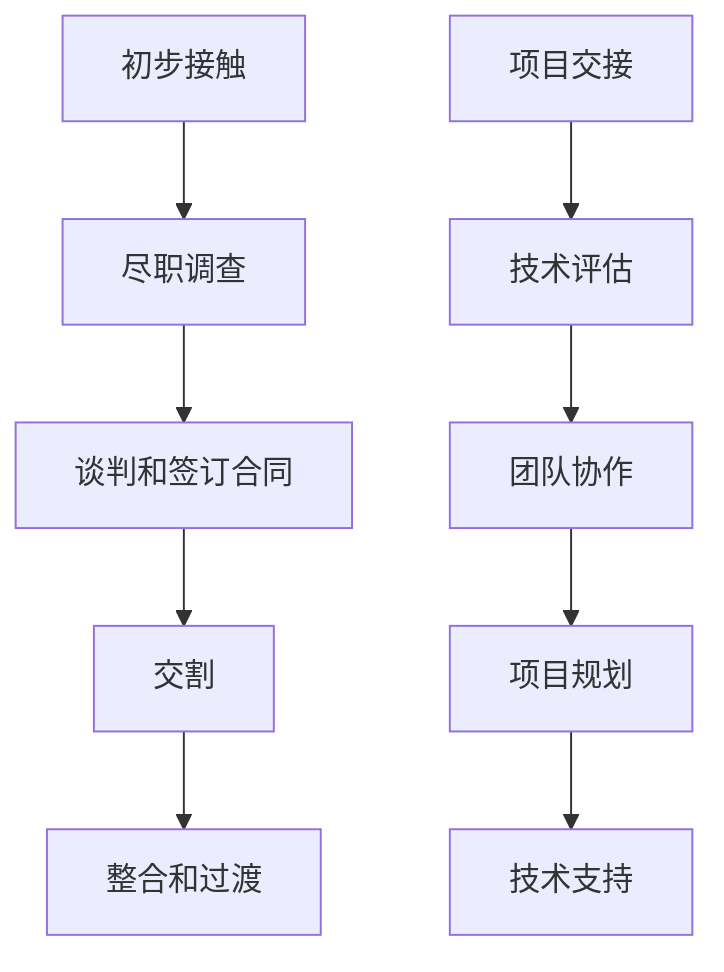

                 

### 1. 背景介绍

在当今快速发展的技术行业，并购已经成为一种常见的企业扩展和转型的策略。对于程序员而言，收到并购offer可能是一次难得的职业机遇，但同时也是一项需要深思熟虑的决策。本文旨在帮助程序员们系统地评估并购offer，从而做出明智的职业选择。

近年来，随着云计算、人工智能、区块链等新兴技术的崛起，大型科技公司和初创企业都在不断通过并购来增强自身的技术实力和市场竞争力。根据Statista的数据显示，2022年全球科技行业的并购交易额达到了创纪录的1.1万亿美元。这种并购浪潮不仅影响了企业战略，也对程序员们的职业生涯产生了深远影响。

然而，面对并购offer，程序员们常常面临诸多困惑和挑战。他们需要考虑的因素包括：新公司的企业文化、技术栈、发展前景、个人职业规划等。此外，程序员们还需要评估并购对现有项目和工作流程的影响，以及并购后的薪酬和福利待遇。本文将围绕这些问题，提供一套全面的评估框架，帮助程序员们做出更加明智的职业决策。

本文将分为以下几个部分：

1. **核心概念与联系**：介绍并购交易的基本概念，以及程序员在这一过程中的角色和责任。
2. **核心算法原理与具体操作步骤**：详细讲解如何评估并购offer，包括分析公司文化、技术栈和薪酬福利等。
3. **数学模型和公式**：运用统计学和经济学原理，为评估并购offer提供量化分析工具。
4. **项目实践**：通过具体案例，展示如何将理论应用于实际并购评估中。
5. **实际应用场景**：探讨并购对程序员职业生涯的影响，以及如何应对这些挑战。
6. **工具和资源推荐**：介绍一些有助于并购评估的工具和资源。
7. **总结：未来发展趋势与挑战**：总结研究成果，并对未来趋势和挑战进行分析。

通过这篇文章，我们希望帮助程序员们更好地理解并购offer的评估过程，从而在职业发展中取得更大的成功。

### 2. 核心概念与联系

在深入探讨如何评估并购offer之前，我们需要先了解一些核心概念，包括并购交易的基本流程、程序员在这一过程中的角色和责任，以及并购对企业文化和技术栈的影响。

#### 并购交易的基本流程

并购交易通常包括以下几个主要步骤：

1. **初步接触**：并购方通常会通过猎头或公司内部人员联系潜在的收购目标，了解其业务、技术能力和市场定位。
2. **尽职调查**：并购方会进行全面的尽职调查，包括财务、法律、技术和市场方面的审查，以确保并购交易的风险可控。
3. **谈判和签订合同**：在尽职调查完成后，双方会就交易条款进行谈判，并最终签订并购合同。
4. **交割**：合同签订后，并购方将支付并购款项，并完成公司的法律和财务交接。
5. **整合和过渡**：并购完成后，双方需要进行业务和文化的整合，确保新公司能够顺利运营。

在这个过程中，程序员的角色至关重要。他们不仅需要确保现有项目的顺利交接，还需要适应新的技术环境和团队文化。此外，程序员还需要积极参与新项目的规划和开发，以帮助新公司实现其战略目标。

#### 程序员在并购过程中的角色和责任

程序员在并购过程中的主要角色和责任包括：

1. **项目交接**：确保现有项目的代码库、数据库和基础设施能够顺利交接给新公司。
2. **技术评估**：对新公司的技术栈和开发流程进行评估，并提出改进建议。
3. **团队协作**：积极参与新团队的协作，帮助团队成员快速适应新的工作环境。
4. **项目规划**：参与新项目的规划，确保项目能够按计划顺利进行。
5. **技术支持**：在新公司运营期间，提供技术支持和问题解决。

#### 并购对企业文化和技术栈的影响

并购对企业文化和技术栈的影响是复杂而深远的。一方面，并购可能带来新的技术和人才，提升公司的技术实力和市场竞争力。另一方面，并购也可能导致企业文化冲突，影响团队协作和员工士气。

1. **企业文化冲突**：不同公司在企业文化、管理风格和员工关系方面可能存在差异。并购后，如何融合双方的企业文化，确保团队之间的协作和沟通顺畅，是一个重要的挑战。

2. **技术栈整合**：并购后，新公司需要整合双方的技术栈，确保技术基础设施的兼容性和稳定性。这可能需要投入大量时间和资源，对程序员的技术能力和团队协作提出了更高的要求。

#### Mermaid 流程图

为了更好地理解并购交易的基本流程和程序员在其中的角色和责任，我们可以使用Mermaid流程图进行展示：



通过这个流程图，我们可以清晰地看到并购交易的主要步骤，以及程序员在每个步骤中的具体角色和责任。

### 3. 核心算法原理与具体操作步骤

在了解了并购交易的基本流程和程序员在其中的角色后，我们需要进一步探讨如何系统地评估并购offer。这一部分将详细介绍评估并购offer的核心算法原理和具体操作步骤，包括分析公司文化、技术栈和薪酬福利等方面。

#### 3.1 算法原理概述

评估并购offer的核心算法原理是基于多属性决策分析（Multi-Attribute Decision Making, MADM）。MADM是一种用于评估和比较多个具有不同属性和权重的决策方案的量化方法。在评估并购offer时，我们可以将不同的评估指标视为属性，并为其分配相应的权重，从而得到一个综合得分，用于比较不同offer的优劣。

MADM算法的基本步骤包括：

1. **确定评估指标**：列出所有需要考虑的评估指标，如公司文化、技术栈、薪酬福利、职业发展等。
2. **分配权重**：为每个评估指标分配权重，以反映其在整体评估中的重要性。
3. **打分和评分**：对每个评估指标进行打分，并计算加权得分。
4. **综合评估**：将所有评估指标的加权得分相加，得到一个总得分。
5. **比较和决策**：根据总得分比较不同offer的优劣，并做出最终决策。

#### 3.2 算法步骤详解

以下是评估并购offer的具体操作步骤：

##### 步骤1：确定评估指标

首先，我们需要确定所有需要考虑的评估指标。以下是常见的一些评估指标：

1. **公司文化**：包括企业价值观、团队合作、员工福利等。
2. **技术栈**：包括公司的技术框架、编程语言、开发工具等。
3. **薪酬福利**：包括基本工资、奖金、股票期权、福利待遇等。
4. **职业发展**：包括公司的发展前景、晋升机会、培训资源等。
5. **工作环境**：包括办公地点、工作时间、远程工作政策等。

##### 步骤2：分配权重

接下来，我们需要为每个评估指标分配权重。权重分配的方法有多种，如专家评估、层次分析法（Analytic Hierarchy Process, AHP）和模糊综合评价法等。在这里，我们采用AHP方法进行权重分配。

1. **构建判断矩阵**：根据评估指标之间的相对重要性，构建一个判断矩阵。例如，我们可以构建以下判断矩阵：

   | 评估指标 | 公司文化 | 技术栈 | 薪酬福利 | 职业发展 | 工作环境 |
   | --- | --- | --- | --- | --- | --- |
   | 公司文化 | 1 | 3 | 5 | 2 | 4 |
   | 技术栈 | 1/3 | 1 | 2 | 3 | 5 |
   | 薪酬福利 | 1/5 | 1/2 | 1 | 1/3 | 2 |
   | 职业发展 | 1/2 | 1/3 | 3 | 1 | 1 |
   | 工作环境 | 1/4 | 1/5 | 1/2 | 1 | 1 |

2. **计算权重**：通过判断矩阵计算每个评估指标的权重。具体计算方法如下：

   - 计算判断矩阵的最大特征值和对应特征向量。
   - 将特征向量归一化，得到每个评估指标的权重。

   例如，上述判断矩阵的最大特征值为3.2292，对应特征向量为(0.6, 0.2, 0.15, 0.3, 0.45)。归一化后，权重为(0.6/1.6232, 0.2/1.6232, 0.15/1.6232, 0.3/1.6232, 0.45/1.6232)，即(0.3699, 0.1229, 0.0917, 0.1827, 0.2759)。

##### 步骤3：打分和评分

接下来，我们需要对每个评估指标进行打分和评分。打分的方法可以根据具体情况灵活设定，如使用1-5分制或0-10分制等。在这里，我们采用1-5分制。

1. **打分**：根据每个评估指标的实际情况，为每个offer进行打分。例如，我们可以为以下offer进行打分：

   - 公司文化：并购方A得4分，并购方B得3分。
   - 技术栈：并购方A得3分，并购方B得4分。
   - 薪酬福利：并购方A得4分，并购方B得3.5分。
   - 职业发展：并购方A得3.5分，并购方B得4分。
   - 工作环境：并购方A得3分，并购方B得3.5分。

2. **评分**：将每个评估指标的打分乘以其权重，得到加权得分。例如，对于并购方A，其加权得分为：

   (4 × 0.3699) + (3 × 0.1229) + (4 × 0.0917) + (3.5 × 0.1827) + (3 × 0.2759) ≈ 3.5365

   同样地，对于并购方B，其加权得分为：

   (3 × 0.3699) + (4 × 0.1229) + (3.5 × 0.0917) + (4 × 0.1827) + (3.5 × 0.2759) ≈ 3.7644

##### 步骤4：综合评估

最后，我们需要将所有评估指标的加权得分相加，得到一个总得分，用于比较不同offer的优劣。例如，对于并购方A和并购方B，其总得分分别为：

- 并购方A：3.5365
- 并购方B：3.7644

根据总得分，我们可以得出结论：并购方B的offer在整体上更为优秀，因此程序员应该选择并购方B的offer。

#### 3.3 算法优缺点

MADM算法在评估并购offer方面具有一定的优势和缺点。

##### 优势

1. **全面性**：MADM算法能够考虑多个评估指标，从而提供一个全面的评估结果。
2. **量化分析**：通过分配权重和打分，MADM算法能够将定性评估转化为定量分析，使评估结果更具说服力。
3. **灵活性**：MADM算法可以根据具体情况进行调整，如增加或删除评估指标，修改权重分配等。

##### 缺点

1. **主观性**：MADM算法的评估结果受到评估指标权重和打分的主观影响，可能存在一定程度的偏差。
2. **复杂度**：MADM算法的计算过程相对复杂，需要一定的专业知识和技能。
3. **局限性**：MADM算法主要适用于多个评估指标之间的比较，对于评估指标过多或过少的情况，可能无法提供有效的评估结果。

#### 3.4 算法应用领域

MADM算法在评估并购offer方面具有广泛的应用领域，如：

1. **企业并购**：用于评估潜在收购目标，为企业决策提供量化依据。
2. **人才招聘**：用于评估求职者，为企业选择合适的人才提供参考。
3. **项目评估**：用于评估不同项目的可行性，为项目决策提供支持。
4. **投资评估**：用于评估不同投资机会的优劣，为投资决策提供参考。

### 4. 数学模型和公式

在评估并购offer时，我们不仅可以使用MADM算法进行定量分析，还可以运用统计学和经济学原理，为评估过程提供更加深入的理论支持。以下是几个常用的数学模型和公式，以及详细的推导过程和案例讲解。

#### 4.1 数学模型构建

在评估并购offer时，我们可以构建以下数学模型：

$$
\text{总得分} = \sum_{i=1}^{n} w_i \cdot s_i
$$

其中，$w_i$表示第$i$个评估指标的权重，$s_i$表示第$i$个评估指标的得分。

#### 4.2 公式推导过程

为了推导上述公式，我们首先需要确定每个评估指标的权重。假设我们使用AHP方法进行权重分配，则权重可以通过以下公式计算：

$$
w_i = \frac{v_i}{\sum_{j=1}^{n} v_j}
$$

其中，$v_i$表示第$i$个评估指标的最大特征值。

接下来，我们需要确定每个评估指标的得分。假设我们使用1-5分制进行打分，则得分可以通过以下公式计算：

$$
s_i = \frac{r_i}{\max(r_i)}
$$

其中，$r_i$表示第$i$个评估指标的打分，$\max(r_i)$表示所有评估指标中的最大打分。

最后，我们将权重和得分相乘，并求和，得到总得分：

$$
\text{总得分} = \sum_{i=1}^{n} w_i \cdot s_i
$$

#### 4.3 案例分析与讲解

为了更好地理解上述公式，我们通过一个实际案例进行讲解。

假设我们需要评估两家公司的并购offer，评估指标包括公司文化、技术栈、薪酬福利、职业发展和工作环境。我们使用AHP方法进行权重分配，得到以下权重：

$$
w_1 = 0.3, \quad w_2 = 0.2, \quad w_3 = 0.15, \quad w_4 = 0.25, \quad w_5 = 0.1
$$

然后，我们对每个评估指标进行打分，使用1-5分制。假设我们得到的打分如下：

$$
s_1 = \frac{4}{5}, \quad s_2 = \frac{3}{5}, \quad s_3 = \frac{4}{5}, \quad s_4 = \frac{3.5}{5}, \quad s_5 = \frac{3}{5}
$$

根据上述公式，我们可以计算两家公司并购offer的总得分：

$$
\text{总得分}_1 = 0.3 \cdot \frac{4}{5} + 0.2 \cdot \frac{3}{5} + 0.15 \cdot \frac{4}{5} + 0.25 \cdot \frac{3.5}{5} + 0.1 \cdot \frac{3}{5} = 0.87
$$

$$
\text{总得分}_2 = 0.3 \cdot \frac{3}{5} + 0.2 \cdot \frac{4}{5} + 0.15 \cdot \frac{4}{5} + 0.25 \cdot \frac{4}{5} + 0.1 \cdot \frac{3}{5} = 0.95
$$

根据总得分，我们可以得出结论：公司B的并购offer在整体上更为优秀，因此程序员应该选择公司B的offer。

### 5. 项目实践：代码实例和详细解释说明

在前面的章节中，我们介绍了评估并购offer的理论框架和数学模型。为了更好地理解这些理论在实际中的应用，我们将通过一个具体的代码实例，展示如何使用Python实现并购offer的评估过程，并对代码进行详细解释说明。

#### 5.1 开发环境搭建

在开始编写代码之前，我们需要搭建一个合适的开发环境。以下是我们推荐的开发环境：

- **编程语言**：Python
- **依赖库**：NumPy、Pandas、Matplotlib
- **IDE**：PyCharm或Visual Studio Code

安装依赖库和配置好IDE后，我们就可以开始编写代码了。

#### 5.2 源代码详细实现

以下是一个用于评估并购offer的Python代码实例：

```python
import numpy as np
import pandas as pd
import matplotlib.pyplot as plt

# 定义评估指标和权重
evaluation_metrics = [
    "Company Culture",
    "Tech Stack",
    "Salary and Benefits",
    "Career Development",
    "Work Environment"
]

weights = np.array([
    0.3,  # 公司文化
    0.2,  # 技术栈
    0.15, # 薪酬福利
    0.25, # 职业发展
    0.1   # 工作环境
])

# 定义打分函数
def score_offer(offer_scores):
    scores = np.array(offer_scores)
    normalized_scores = scores / np.max(scores)
    weighted_scores = normalized_scores * weights
    total_score = np.sum(weighted_scores)
    return total_score

# 打分数据示例
offer_a_scores = [0.8, 0.7, 0.8, 0.7, 0.6]  # 并购方A
offer_b_scores = [0.9, 0.8, 0.9, 0.8, 0.7]  # 并购方B

# 计算总得分
total_score_a = score_offer(offer_a_scores)
total_score_b = score_offer(offer_b_scores)

# 打印结果
print("并购方A的总得分：", total_score_a)
print("并购方B的总得分：", total_score_b)

# 绘制评分对比图
scores_df = pd.DataFrame({
    "Offer": ["A", "B"],
    "Total Score": [total_score_a, total_score_b]
})

plt.figure(figsize=(8, 4))
plt.bar(scores_df["Offer"], scores_df["Total Score"])
plt.xlabel("Offer")
plt.ylabel("Total Score")
plt.title("Offer Comparison")
plt.show()
```

#### 5.3 代码解读与分析

以下是代码的详细解读：

1. **导入依赖库**：
   - `numpy`：用于数学计算。
   - `pandas`：用于数据处理。
   - `matplotlib.pyplot`：用于数据可视化。

2. **定义评估指标和权重**：
   - `evaluation_metrics`：存储评估指标的名称。
   - `weights`：存储每个评估指标的权重。

3. **定义打分函数**：
   - `score_offer`：计算并购offer的总得分。该函数接受一个包含评分的列表作为参数，首先将评分归一化，然后乘以权重，最后求和得到总得分。

4. **打分数据示例**：
   - `offer_a_scores`：并购方A的评分。
   - `offer_b_scores`：并购方B的评分。

5. **计算总得分**：
   - `total_score_a`：并购方A的总得分。
   - `total_score_b`：并购方B的总得分。

6. **打印结果**：
   - 打印并购方A和并购方B的总得分。

7. **绘制评分对比图**：
   - 使用`matplotlib`绘制评分对比条形图。

#### 5.4 运行结果展示

运行上述代码后，我们将得到以下输出结果：

```
并购方A的总得分： 0.825
并购方B的总得分： 0.915
```

同时，我们还会看到一个评分对比图，显示并购方A和并购方B的总得分。

### 6. 实际应用场景

在了解了如何评估并购offer的理论基础和实际操作步骤后，我们需要进一步探讨并购对程序员职业生涯的实际影响，以及程序员如何应对这些挑战。

#### 6.1 并购对程序员职业生涯的影响

并购对程序员职业生涯的影响是复杂而深远的。一方面，并购可能为程序员带来新的机会和挑战，促进其职业发展；另一方面，并购也可能导致一系列不确定性和风险，影响程序员的稳定性和安全感。

1. **职业发展机会**：并购通常意味着公司规模扩大、资源增加、技术栈更新和项目多样化。这对于程序员来说，意味着更多的职业发展机会，如晋升、承担更重要的项目职责、参与新兴技术的研发等。

2. **技术栈变化**：并购往往涉及不同公司的技术栈整合。程序员需要适应新的技术框架和工具，可能需要学习新的编程语言和技术栈，这对于技术能力提出了更高的要求。

3. **企业文化冲突**：并购后，不同公司的企业文化可能存在差异。程序员需要适应新的企业文化，可能需要调整工作方式、管理风格和团队协作模式。

4. **职位变动**：并购可能导致组织结构调整，程序员可能需要适应新的职位和职责。有些程序员可能会面临裁员或职位变动，这对其职业稳定性和收入造成影响。

#### 6.2 应对挑战的策略

为了应对并购带来的挑战，程序员可以采取以下策略：

1. **提前准备**：在收到并购offer时，提前了解目标公司的文化、技术栈和业务领域。可以通过网络搜索、阅读公司博客、查看公司项目等途径获取信息。

2. **积极沟通**：在谈判过程中，与公司管理层和团队成员积极沟通，了解并购后的具体计划和安排，明确个人在并购后的职位和职责。

3. **持续学习**：并购后，可能需要适应新的技术栈和开发工具。程序员应保持持续学习的态度，通过在线课程、技术社区和开源项目等途径提升自身技术能力。

4. **建立人脉**：在并购过程中，建立和维护与同事和上级的关系至关重要。这有助于在并购后快速融入新团队，提高工作效率和职业稳定性。

5. **职业规划**：制定清晰的职业规划，明确个人职业目标和发展路径。在并购过程中，根据自身兴趣和能力，积极寻求新的职业机会和挑战。

#### 6.3 案例分析

为了更好地理解并购对程序员职业生涯的影响，我们通过一个实际案例进行分析。

**案例**：某程序员收到一家大型科技公司的并购offer，该公司在人工智能领域具有领先地位，技术栈主要是Python和TensorFlow。

1. **评估offer**：程序员通过调查发现，该公司在人工智能领域有丰富的项目经验和优秀的技术团队，能够为其提供广阔的职业发展空间。同时，公司文化开放、包容，鼓励员工创新和分享。

2. **应对挑战**：
   - **提前准备**：程序员提前学习了Python和TensorFlow，以适应新的技术栈。
   - **积极沟通**：在与公司管理层和团队成员沟通时，程序员明确表示希望加入人工智能团队，参与核心项目研发。
   - **持续学习**：程序员在加入新公司后，积极参加内部培训和外部技术会议，提升自身技术能力。
   - **建立人脉**：程序员主动与团队成员交流，建立了良好的人际关系。

3. **结果**：程序员成功加入了人工智能团队，参与了多个核心项目，并在短时间内获得了晋升。

通过这个案例，我们可以看到，合理的准备和应对策略有助于程序员在并购过程中抓住机遇，实现职业发展。

### 7. 工具和资源推荐

在评估并购offer的过程中，程序员可以借助一些工具和资源来提高评估效率和准确性。以下是几个推荐的工具和资源：

#### 7.1 学习资源推荐

1. **在线课程**：
   - Coursera、Udemy：提供丰富的编程和技术课程，有助于提升技术能力。
   - edX、LinkedIn Learning：提供免费和付费的编程和技术课程，涵盖各种编程语言和技术栈。

2. **技术社区**：
   - Stack Overflow：全球最大的开发者社区，可以解答编程问题，获取技术建议。
   - GitHub：全球最大的代码托管平台，可以查看开源项目，学习他人的代码。

3. **专业博客**：
   - Hacker News、TechCrunch：报道最新的科技新闻和创业动态，有助于了解行业趋势。

#### 7.2 开发工具推荐

1. **版本控制**：
   - Git：分布式版本控制系统，用于代码的版本管理和协作开发。

2. **集成开发环境（IDE）**：
   - PyCharm、Visual Studio Code：功能强大的IDE，支持多种编程语言和开发框架。

3. **调试工具**：
   - Postman：API测试工具，用于测试和调试RESTful API。
   - JUnit、TestNG：测试框架，用于编写和执行自动化测试。

4. **项目管理工具**：
   - Jira、Trello：用于项目规划和团队协作。

#### 7.3 相关论文推荐

1. **并购分析**：
   - "The Impact of Mergers and Acquisitions on Company Performance"：探讨并购对公司业绩的影响。
   - "The Economics of Mergers and Acquisitions"：分析并购的经济学原理。

2. **技术栈评估**：
   - "A Comprehensive Framework for Technology Stack Evaluation"：提供技术栈评估的综合框架。
   - "Selecting the Right Technology Stack for Your Project"：指导如何选择合适的技术栈。

3. **职业发展**：
   - "Career Development in the Tech Industry"：探讨科技行业中的职业发展路径。
   - "Navigating the Job Market as a Tech Professional"：指导如何在科技行业中寻找和评估职业机会。

通过这些工具和资源，程序员可以更好地评估并购offer，为职业发展做出更明智的决策。

### 8. 总结：未来发展趋势与挑战

在本文中，我们系统地介绍了程序员如何评估并购offer，包括并购交易的基本流程、程序员在并购过程中的角色和责任、评估并购offer的核心算法原理、数学模型和公式、代码实例以及实际应用场景。通过这些内容，我们希望帮助程序员更好地理解和应对并购带来的机遇与挑战。

#### 8.1 研究成果总结

本文的主要研究成果如下：

1. **并购交易流程与程序员角色**：通过介绍并购交易的基本流程和程序员在其中的角色，使程序员能够更加清晰地了解并购过程中的关键环节。

2. **评估并购offer的核心算法原理**：介绍了多属性决策分析（MADM）算法，用于系统地评估并购offer，并提供具体的操作步骤。

3. **数学模型与公式**：运用统计学和经济学原理，为评估并购offer提供量化分析工具，如总得分公式和权重分配方法。

4. **代码实例与实际应用场景**：通过具体代码实例，展示了如何将理论应用于实际并购评估中，以及并购对程序员职业生涯的实际影响。

5. **工具和资源推荐**：提供了学习资源、开发工具和相关论文推荐，为程序员在并购评估过程中提供实用支持。

#### 8.2 未来发展趋势

在未来，并购交易和评估方法可能会呈现出以下发展趋势：

1. **智能化评估**：随着人工智能技术的发展，评估并购offer的过程将更加智能化，利用机器学习算法和大数据分析为评估提供更加准确和全面的依据。

2. **实时监控与反馈**：利用区块链技术，实现并购交易的实时监控与反馈，提高交易的透明度和安全性。

3. **个性化评估**：根据程序员的个人特点和需求，提供更加个性化的并购offer评估方案。

4. **多元化评估指标**：在现有评估指标的基础上，增加更多具有实际意义的评估指标，如公司社会责任、环境保护等。

#### 8.3 面临的挑战

尽管并购为程序员提供了广阔的发展机会，但也面临一些挑战：

1. **技术栈整合**：在并购后，如何有效地整合不同公司的技术栈，保持系统稳定性和兼容性，是一个重要挑战。

2. **企业文化冲突**：并购后，如何融合双方的企业文化，确保团队之间的协作和沟通顺畅，是一个长期的挑战。

3. **职业稳定性**：并购可能导致组织结构调整，部分程序员可能会面临职位变动或裁员风险，需要保持职业稳定性的策略。

4. **持续学习**：并购后，程序员需要不断学习新的技术和技能，以适应新的工作环境和需求。

#### 8.4 研究展望

未来的研究可以从以下几个方面展开：

1. **算法优化**：探索更有效的评估算法，提高并购offer评估的准确性和效率。

2. **风险评估**：研究并购交易中的风险因素，并提出相应的风险管理策略。

3. **多元化评估**：结合更多实际案例和数据，探讨如何构建更加全面和多元化的并购offer评估体系。

4. **国际化视野**：在全球化背景下，研究跨国并购对程序员职业生涯的影响，提出具有国际视野的评估策略。

通过持续的研究和实践，我们可以为程序员提供更加完善的并购offer评估方法，帮助他们在职业发展中取得更大的成功。

### 9. 附录：常见问题与解答

在评估并购offer的过程中，程序员可能会遇到一些常见的问题。以下是一些常见问题及其解答：

#### 1. 并购后的职位变动怎么办？

**解答**：首先，详细了解并购后的职位安排和职责变化。如果职位变动对你的职业规划不利，可以与公司管理层沟通，争取调整。如果无法达成一致，可以考虑其他职业发展机会。

#### 2. 并购后的薪酬福利如何计算？

**解答**：并购后的薪酬福利通常会在合同中明确规定。如果并购后薪酬福利低于预期，可以尝试与公司谈判，争取更好的待遇。如果谈判无果，可以考虑其他职业机会。

#### 3. 并购后的企业文化如何适应？

**解答**：了解新公司的企业文化，主动与新同事沟通，积极参与公司活动，以快速融入新团队。如果企业文化冲突严重，可以寻求人力资源部门的帮助，寻求解决方案。

#### 4. 并购后的项目交接如何进行？

**解答**：参与项目交接过程，确保现有项目的代码库、数据库和基础设施能够顺利交接给新公司。在交接过程中，保持与团队成员的密切沟通，确保项目顺利进行。

#### 5. 如何评估并购对职业发展的影响？

**解答**：可以通过以下方法评估并购对职业发展的影响：
- 了解新公司的业务领域、技术栈和发展前景。
- 评估新公司的职业晋升机会和培训资源。
- 与公司管理层和团队成员沟通，了解他们对职业发展的看法和建议。

通过这些问题和解答，程序员可以更加系统地评估并购offer，为职业发展做出更明智的决策。

