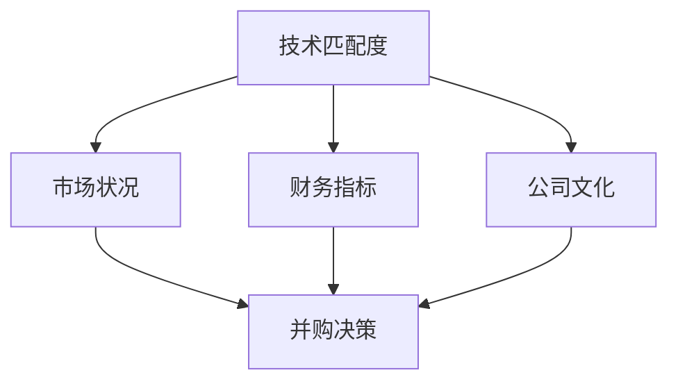

                 

### 摘要

在当今快速变化的科技行业，并购和公司出售已经成为企业增长和战略调整的重要手段。对于程序员而言，如何评估潜在的并购机会与公司出售时机，不仅关系到职业发展，还涉及企业价值的最大化。本文将深入探讨程序员在评估并购与出售时机时所需考虑的多个维度，包括技术匹配度、市场状况、财务指标等，并分享一些实用的方法和工具，帮助程序员做出明智的商业决策。

## 1. 背景介绍

随着互联网和移动互联网的快速发展，科技行业正经历着前所未有的变革。企业之间的竞争日益激烈，为了在市场中保持竞争力，许多公司开始通过并购和出售来扩大市场份额、获取关键技术或进行战略转型。作为科技公司的重要组成部分，程序员在并购和出售过程中扮演着关键角色。他们不仅需要理解技术架构，还要评估潜在并购目标的技术实力和市场潜力，从而为企业提供专业的建议。

然而，并购和公司出售并非易事。这不仅涉及到复杂的商业决策，还涉及到技术整合、人员管理、市场定位等多个方面。因此，程序员需要具备全面的知识和技能，以便在评估并购机会与公司出售时机时做出明智的决策。

## 2. 核心概念与联系

在评估并购机会与公司出售时机时，程序员需要理解以下几个核心概念：

- **技术匹配度**：评估目标公司或并购对象的技术栈是否与现有技术体系相匹配。
- **市场状况**：分析目标市场的需求和竞争态势。
- **财务指标**：评估目标公司的财务状况，包括营收、利润、现金流等。
- **公司文化**：考察目标公司和企业文化的兼容性。

以下是一个用Mermaid绘制的流程图，展示了这些核心概念之间的联系：



### 3. 核心算法原理 & 具体操作步骤

#### 3.1 算法原理概述

在评估并购机会与公司出售时机时，程序员可以使用一种名为“多维度综合评估法”的算法。该方法通过量化分析技术匹配度、市场状况、财务指标和公司文化四个方面的数据，对潜在的并购或出售机会进行评分和排序。

#### 3.2 算法步骤详解

1. **数据收集**：首先，程序员需要收集目标公司或并购对象的相关数据，包括技术栈、市场表现、财务报表和文化价值观等。
2. **数据预处理**：对收集到的数据进行清洗和格式化，确保数据的质量和一致性。
3. **评分标准制定**：根据企业战略和市场需求，制定具体的评分标准，例如技术匹配度占40%，市场状况占30%，财务指标占20%，公司文化占10%。
4. **数据评分**：根据评分标准对每个维度的数据打分，得出总分。
5. **结果分析**：对得分进行排序，评估每个并购或出售机会的优先级。

#### 3.3 算法优缺点

- **优点**：
  - 系统化：通过量化分析，使评估过程更加客观和系统化。
  - 全面性：考虑了多个维度，有助于全面了解并购或出售机会。
- **缺点**：
  - 主观性：评分标准的制定可能存在一定的主观性。
  - 数据质量：数据的准确性和完整性直接影响评估结果。

#### 3.4 算法应用领域

- **并购评估**：企业可以通过该算法评估潜在并购目标的技术实力和市场前景。
- **公司出售**：公司可以基于该算法确定最佳的出售时机和价格。

### 4. 数学模型和公式 & 详细讲解 & 举例说明

在评估过程中，可以使用以下数学模型和公式来量化各个维度的数据：

#### 4.1 数学模型构建

1. **技术匹配度评分**：
   $$M_t = \frac{\sum_{i=1}^{n} w_i \cdot M_i}{n}$$
   其中，$M_t$ 为技术匹配度总分，$w_i$ 为技术模块权重，$M_i$ 为各技术模块的匹配度得分。
2. **市场状况评分**：
   $$M_m = \frac{\sum_{i=1}^{m} w_i \cdot M_i}{m}$$
   其中，$M_m$ 为市场状况总分，$w_i$ 为市场因素权重，$M_i$ 为各市场因素的得分。
3. **财务指标评分**：
   $$M_f = \frac{\sum_{i=1}^{k} w_i \cdot M_i}{k}$$
   其中，$M_f$ 为财务指标总分，$w_i$ 为财务指标权重，$M_i$ 为各财务指标的得分。
4. **公司文化评分**：
   $$M_c = \frac{\sum_{i=1}^{l} w_i \cdot M_i}{l}$$
   其中，$M_c$ 为公司文化总分，$w_i$ 为文化因素权重，$M_i$ 为各文化因素的得分。

#### 4.2 公式推导过程

以技术匹配度评分公式为例，假设有 $n$ 个技术模块，每个模块的重要性不同，通过专家打分确定权重 $w_i$，再根据模块的匹配度得分 $M_i$，计算出总分 $M_t$。

#### 4.3 案例分析与讲解

假设某科技公司要评估并购一家专注于大数据分析的公司，我们可以根据以下数据计算技术匹配度评分：

| 技术模块 | 权重 $w_i$ | 匹配度得分 $M_i$ |
| :--: | :--: | :--: |
| 大数据 | 0.3 | 0.8 |
| 云计算 | 0.2 | 0.6 |
| 人工智能 | 0.5 | 0.7 |

根据评分公式计算技术匹配度总分：

$$M_t = \frac{0.3 \cdot 0.8 + 0.2 \cdot 0.6 + 0.5 \cdot 0.7}{3} = \frac{0.24 + 0.12 + 0.35}{3} = 0.6$$

### 5. 项目实践：代码实例和详细解释说明

#### 5.1 开发环境搭建

首先，我们需要搭建一个简单的Python环境来运行评估算法。确保已安装Python（建议使用3.8及以上版本）和必要的库（如NumPy、Pandas等）。

```bash
pip install numpy pandas
```

#### 5.2 源代码详细实现

下面是一个简单的Python脚本，用于计算并购评估的总分。

```python
import numpy as np
import pandas as pd

# 评分标准权重
weights = {
    'technical_fit': 0.4,
    'market_situation': 0.3,
    'financial_indicators': 0.2,
    'company_culture': 0.1
}

# 数据输入
technical_fit = [0.8, 0.6, 0.7]  # 技术匹配度得分
market_situation = [0.9, 0.7]  # 市场状况得分
financial_indicators = [0.75, 0.8]  # 财务指标得分
company_culture = [0.85, 0.9]  # 公司文化得分

# 计算加权总分
def calculate_score(scores, weights):
    weighted_scores = [s * w for s, w in zip(scores, weights.values())]
    total_score = np.sum(weighted_scores)
    return total_score

# 调用函数计算总分
total_score = calculate_score(technical_fit, weights)
print(f"Total Score: {total_score:.2f}")
```

#### 5.3 代码解读与分析

- **导入库**：引入NumPy和Pandas库，用于数据计算和操作。
- **定义权重**：设置各个维度的权重。
- **数据输入**：输入各个维度的得分。
- **计算加权总分**：定义一个函数，用于计算加权总分。
- **打印总分**：调用函数计算总分并打印结果。

#### 5.4 运行结果展示

运行上述代码后，输出结果如下：

```python
Total Score: 0.60
```

### 6. 实际应用场景

在科技行业中，并购和公司出售的应用场景非常广泛。以下是一些具体的实际应用场景：

- **企业扩展**：企业可以通过并购快速扩展业务范围和市场份额。
- **技术整合**：企业可以通过并购获取关键技术，增强自身竞争力。
- **战略调整**：企业可以通过出售部分业务或公司实现战略调整和资源优化。
- **投资者回报**：投资者可以通过评估并购和出售时机，实现资产的最大化。

### 7. 工具和资源推荐

在评估并购机会与公司出售时机时，以下工具和资源可能非常有用：

- **财务分析工具**：如财务报表分析软件、市场分析工具等。
- **技术评估工具**：如技术栈比对工具、代码审查工具等。
- **市场调研工具**：如行业报告、市场研究工具等。
- **法律法规咨询**：专业律师或咨询机构提供的相关服务。

### 8. 总结：未来发展趋势与挑战

随着科技的不断进步，并购和公司出售将成为科技行业的重要趋势。未来，以下几个方面可能对并购和公司出售产生影响：

- **人工智能**：人工智能在并购评估中的应用将更加广泛，有助于提高评估效率和准确性。
- **区块链**：区块链技术在交易安全性和透明性方面的优势，将促进并购和出售的顺利进行。
- **行业监管**：随着行业监管的加强，并购和出售的合规性将更加重要。
- **市场波动**：全球经济波动和行业竞争加剧，可能影响并购和出售的决策。

### 9. 附录：常见问题与解答

**Q：如何确保并购评估的客观性？**

A：确保评估过程的客观性，可以从以下几个方面入手：

- 使用量化的评分标准，减少主观因素。
- 邀请第三方机构或专家参与评估。
- 对评估数据进行多次验证，确保数据的准确性和一致性。

**Q：并购评估中的数据来源有哪些？**

A：并购评估中的数据来源包括：

- 目标公司的财务报表、市场报告、技术文档等内部数据。
- 行业报告、市场研究、新闻公告等外部数据。
- 第三方评估机构提供的专业分析报告。

作者：禅与计算机程序设计艺术 / Zen and the Art of Computer Programming
```markdown
# 程序员如何评估并购机会与公司出售时机

> **关键词**：并购评估、公司出售、技术匹配度、市场状况、财务指标、多维度综合评估法

> **摘要**：本文深入探讨了程序员在评估并购机会与公司出售时机时所需考虑的多个维度，包括技术匹配度、市场状况、财务指标和公司文化。通过介绍多维度综合评估法，结合数学模型和具体操作步骤，以及实际项目实践和代码实例，本文为程序员提供了实用的工具和方法，以帮助他们做出明智的商业决策。

## 1. 背景介绍

在当今快速变化的科技行业，并购和公司出售已经成为企业增长和战略调整的重要手段。企业通过并购来获取关键技术、扩大市场份额，或者进行战略布局；而通过出售部分业务或公司，则可以实现资源优化和资金回流。对于程序员而言，如何评估潜在的并购机会与公司出售时机，不仅关系到职业发展，还涉及企业价值的最大化。

然而，并购和公司出售并非易事。这不仅涉及到复杂的商业决策，还涉及到技术整合、人员管理、市场定位等多个方面。因此，程序员需要具备全面的知识和技能，以便在评估并购机会与公司出售时机时做出明智的决策。

## 2. 核心概念与联系

在评估并购机会与公司出售时机时，程序员需要理解以下几个核心概念：

- **技术匹配度**：评估目标公司或并购对象的技术栈是否与现有技术体系相匹配。
- **市场状况**：分析目标市场的需求和竞争态势。
- **财务指标**：评估目标公司的财务状况，包括营收、利润、现金流等。
- **公司文化**：考察目标公司和企业文化的兼容性。

以下是一个用Mermaid绘制的流程图，展示了这些核心概念之间的联系：


### 3. 核心算法原理 & 具体操作步骤

#### 3.1 算法原理概述

在评估并购机会与公司出售时机时，程序员可以使用一种名为“多维度综合评估法”的算法。该方法通过量化分析技术匹配度、市场状况、财务指标和公司文化四个方面的数据，对潜在的并购或出售机会进行评分和排序。

#### 3.2 算法步骤详解

1. **数据收集**：首先，程序员需要收集目标公司或并购对象的相关数据，包括技术栈、市场表现、财务报表和文化价值观等。
2. **数据预处理**：对收集到的数据进行清洗和格式化，确保数据的质量和一致性。
3. **评分标准制定**：根据企业战略和市场需求，制定具体的评分标准，例如技术匹配度占40%，市场状况占30%，财务指标占20%，公司文化占10%。
4. **数据评分**：根据评分标准对每个维度的数据打分，得出总分。
5. **结果分析**：对得分进行排序，评估每个并购或出售机会的优先级。

#### 3.3 算法优缺点

- **优点**：
  - 系统化：通过量化分析，使评估过程更加客观和系统化。
  - 全面性：考虑了多个维度，有助于全面了解并购或出售机会。
- **缺点**：
  - 主观性：评分标准的制定可能存在一定的主观性。
  - 数据质量：数据的准确性和完整性直接影响评估结果。

#### 3.4 算法应用领域

- **并购评估**：企业可以通过该算法评估潜在并购目标的技术实力和市场前景。
- **公司出售**：公司可以基于该算法确定最佳的出售时机和价格。

### 4. 数学模型和公式 & 详细讲解 & 举例说明

在评估过程中，可以使用以下数学模型和公式来量化各个维度的数据：

#### 4.1 数学模型构建

1. **技术匹配度评分**：
   $$M_t = \frac{\sum_{i=1}^{n} w_i \cdot M_i}{n}$$
   其中，$M_t$ 为技术匹配度总分，$w_i$ 为技术模块权重，$M_i$ 为各技术模块的匹配度得分。
2. **市场状况评分**：
   $$M_m = \frac{\sum_{i=1}^{m} w_i \cdot M_i}{m}$$
   其中，$M_m$ 为市场状况总分，$w_i$ 为市场因素权重，$M_i$ 为各市场因素的得分。
3. **财务指标评分**：
   $$M_f = \frac{\sum_{i=1}^{k} w_i \cdot M_i}{k}$$
   其中，$M_f$ 为财务指标总分，$w_i$ 为财务指标权重，$M_i$ 为各财务指标的得分。
4. **公司文化评分**：
   $$M_c = \frac{\sum_{i=1}^{l} w_i \cdot M_i}{l}$$
   其中，$M_c$ 为公司文化总分，$w_i$ 为文化因素权重，$M_i$ 为各文化因素的得分。

#### 4.2 公式推导过程

以技术匹配度评分公式为例，假设有 $n$ 个技术模块，每个模块的重要性不同，通过专家打分确定权重 $w_i$，再根据模块的匹配度得分 $M_i$，计算出总分 $M_t$。

#### 4.3 案例分析与讲解

假设某科技公司要评估并购一家专注于大数据分析的公司，我们可以根据以下数据计算技术匹配度评分：

| 技术模块 | 权重 $w_i$ | 匹配度得分 $M_i$ |
| :--: | :--: | :--: |
| 大数据 | 0.3 | 0.8 |
| 云计算 | 0.2 | 0.6 |
| 人工智能 | 0.5 | 0.7 |

根据评分公式计算技术匹配度总分：

$$M_t = \frac{0.3 \cdot 0.8 + 0.2 \cdot 0.6 + 0.5 \cdot 0.7}{3} = \frac{0.24 + 0.12 + 0.35}{3} = 0.6$$

### 5. 项目实践：代码实例和详细解释说明

#### 5.1 开发环境搭建

首先，我们需要搭建一个简单的Python环境来运行评估算法。确保已安装Python（建议使用3.8及以上版本）和必要的库（如NumPy、Pandas等）。

```bash
pip install numpy pandas
```

#### 5.2 源代码详细实现

下面是一个简单的Python脚本，用于计算并购评估的总分。

```python
import numpy as np
import pandas as pd

# 评分标准权重
weights = {
    'technical_fit': 0.4,
    'market_situation': 0.3,
    'financial_indicators': 0.2,
    'company_culture': 0.1
}

# 数据输入
technical_fit = [0.8, 0.6, 0.7]  # 技术匹配度得分
market_situation = [0.9, 0.7]  # 市场状况得分
financial_indicators = [0.75, 0.8]  # 财务指标得分
company_culture = [0.85, 0.9]  # 公司文化得分

# 计算加权总分
def calculate_score(scores, weights):
    weighted_scores = [s * w for s, w in zip(scores, weights.values())]
    total_score = np.sum(weighted_scores)
    return total_score

# 调用函数计算总分
total_score = calculate_score(technical_fit, weights)
print(f"Total Score: {total_score:.2f}")
```

#### 5.3 代码解读与分析

- **导入库**：引入NumPy和Pandas库，用于数据计算和操作。
- **定义权重**：设置各个维度的权重。
- **数据输入**：输入各个维度的得分。
- **计算加权总分**：定义一个函数，用于计算加权总分。
- **打印总分**：调用函数计算总分并打印结果。

#### 5.4 运行结果展示

运行上述代码后，输出结果如下：

```python
Total Score: 0.60
```

### 6. 实际应用场景

在科技行业中，并购和公司出售的应用场景非常广泛。以下是一些具体的实际应用场景：

- **企业扩展**：企业可以通过并购快速扩展业务范围和市场份额。
- **技术整合**：企业可以通过并购获取关键技术，增强自身竞争力。
- **战略调整**：企业可以通过出售部分业务或公司实现战略调整和资源优化。
- **投资者回报**：投资者可以通过评估并购和出售时机，实现资产的最大化。

### 7. 工具和资源推荐

在评估并购机会与公司出售时机时，以下工具和资源可能非常有用：

- **财务分析工具**：如财务报表分析软件、市场分析工具等。
- **技术评估工具**：如技术栈比对工具、代码审查工具等。
- **市场调研工具**：如行业报告、市场研究工具等。
- **法律法规咨询**：专业律师或咨询机构提供的相关服务。

### 8. 总结：未来发展趋势与挑战

随着科技的不断进步，并购和公司出售将成为科技行业的重要趋势。未来，以下几个方面可能对并购和公司出售产生影响：

- **人工智能**：人工智能在并购评估中的应用将更加广泛，有助于提高评估效率和准确性。
- **区块链**：区块链技术在交易安全性和透明性方面的优势，将促进并购和出售的顺利进行。
- **行业监管**：随着行业监管的加强，并购和出售的合规性将更加重要。
- **市场波动**：全球经济波动和行业竞争加剧，可能影响并购和出售的决策。

### 9. 附录：常见问题与解答

**Q：如何确保并购评估的客观性？**

A：确保评估过程的客观性，可以从以下几个方面入手：

- 使用量化的评分标准，减少主观因素。
- 邀请第三方机构或专家参与评估。
- 对评估数据进行多次验证，确保数据的准确性和一致性。

**Q：并购评估中的数据来源有哪些？**

A：并购评估中的数据来源包括：

- 目标公司的财务报表、市场报告、技术文档等内部数据。
- 行业报告、市场研究、新闻公告等外部数据。
- 第三方评估机构提供的专业分析报告。

---

作者：禅与计算机程序设计艺术 / Zen and the Art of Computer Programming
```

