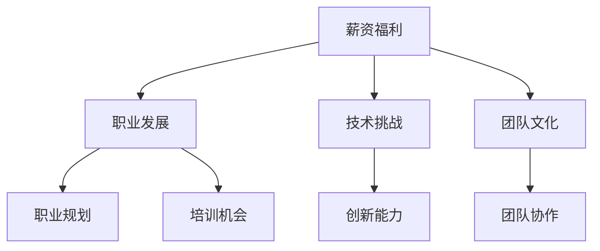

                 

### 关键词 Keywords

- 程序员
- 创业公司
- offer评估
- 薪资福利
- 职业发展
- 技术挑战
- 团队文化

> 摘要：本文旨在帮助程序员更好地评估早期创业公司的offer。通过对创业公司offer的多方面分析，本文提出了一个评估框架，包括薪资福利、职业发展机会、技术挑战、团队文化等因素，并提供了具体的评估方法和实例。文章还讨论了创业公司的潜在风险，以及如何平衡个人职业目标和公司发展之间的关系。

## 1. 背景介绍

在当前科技快速发展的时代，创业公司如雨后春笋般涌现，吸引了大量程序员投身其中。与成熟的大公司相比，创业公司通常能够提供更灵活的工作环境、更高的自主性和更快的职业晋升通道。然而，创业公司也面临着更高的风险，包括资金不稳定、市场不确定性、管理不成熟等问题。因此，程序员在考虑接受早期创业公司offer时，需要更加慎重地进行评估。

本文将围绕以下核心问题展开讨论：

- 如何评估创业公司的薪资福利？
- 创业公司的职业发展机会有哪些？
- 技术挑战和团队文化如何影响评估？
- 如何平衡创业公司的高风险与高回报？
- 程序员应如何制定自己的职业规划？

通过这些问题，我们将构建一个全面、系统的评估框架，帮助程序员做出明智的职业决策。

## 2. 核心概念与联系

在评估早期创业公司offer时，需要理解以下几个核心概念：

1. **薪资福利**：包括基本工资、奖金、股票期权、福利待遇等。
2. **职业发展**：职业晋升通道、培训机会、职业规划等。
3. **技术挑战**：项目复杂性、技术难度、创新能力要求等。
4. **团队文化**：价值观、工作氛围、沟通协作等。

为了更直观地理解这些概念之间的联系，我们可以使用Mermaid流程图来展示它们之间的关系：



通过这个流程图，我们可以看到，薪资福利不仅是评估创业公司offer的重要指标，还与职业发展和职业规划紧密相关。技术挑战和团队文化则直接影响程序员的日常工作和职业成就感。

## 3. 核心算法原理 & 具体操作步骤

在评估创业公司offer时，可以采用以下算法原理：

### 3.1 算法原理概述

该算法基于加权评分模型，通过计算各项指标（薪资福利、职业发展、技术挑战、团队文化）的加权得分，来综合评估创业公司offer的整体吸引力。具体步骤如下：

1. **确定评估指标**：明确需要评估的指标，如薪资福利、职业发展等。
2. **设定权重**：为每个指标设定权重，反映其在整体评估中的重要性。
3. **打分**：根据实际情况为每个指标打分。
4. **计算总分**：将各指标得分乘以其权重，然后求和得到总分。

### 3.2 算法步骤详解

#### 3.2.1 确定评估指标

首先，需要明确需要评估的指标。以下是一个典型的评估指标列表：

- **薪资福利**：包括基本工资、奖金、股票期权、福利待遇等。
- **职业发展**：包括晋升通道、培训机会、职业规划等。
- **技术挑战**：包括项目复杂性、技术难度、创新能力要求等。
- **团队文化**：包括价值观、工作氛围、沟通协作等。

#### 3.2.2 设定权重

为每个指标设定权重，反映其在整体评估中的重要性。以下是一个示例权重分配：

- **薪资福利**：30%
- **职业发展**：25%
- **技术挑战**：25%
- **团队文化**：20%

#### 3.2.3 打分

根据实际情况为每个指标打分。例如，如果薪资福利为10万元/年，则可以打分为80分（满分100分）。其他指标也可以按照类似方式进行打分。

#### 3.2.4 计算总分

将各指标得分乘以其权重，然后求和得到总分。例如，如果各项得分为：

- **薪资福利**：80分
- **职业发展**：70分
- **技术挑战**：85分
- **团队文化**：90分

则总分计算为：

总分 = 80 * 0.3 + 70 * 0.25 + 85 * 0.25 + 90 * 0.2 = 30 + 17.5 + 21.25 + 18 = 86.75

### 3.3 算法优缺点

#### 优点：

- **全面性**：通过多个维度的评估，可以更全面地了解创业公司offer的优势和劣势。
- **量化**：使用加权评分模型，使得评估过程更加客观和量化。

#### 缺点：

- **主观性**：评估指标和权重的主观性可能影响评估结果的准确性。
- **不适用于所有情况**：某些特殊情况下，算法可能无法很好地适应。

### 3.4 算法应用领域

该算法适用于大多数程序员在评估创业公司offer时使用，尤其适用于以下场景：

- **初次求职**：对于刚毕业或者换工作的程序员，可以通过该算法初步评估创业公司的offer。
- **职业转型**：对于想要转型或者尝试新技术的程序员，该算法可以帮助评估创业公司offer的合适性。

## 4. 数学模型和公式 & 详细讲解 & 举例说明

在评估创业公司offer时，可以运用数学模型和公式来帮助量化各个因素。以下是一个简单的数学模型：

### 4.1 数学模型构建

设：

- \( S \) 表示薪资福利得分
- \( P \) 表示职业发展得分
- \( T \) 表示技术挑战得分
- \( C \) 表示团队文化得分

权重分别为：

- \( \omega_S = 0.3 \)
- \( \omega_P = 0.25 \)
- \( \omega_T = 0.25 \)
- \( \omega_C = 0.2 \)

则总分 \( T \) 可以通过以下公式计算：

\[ T = \omega_S \cdot S + \omega_P \cdot P + \omega_T \cdot T + \omega_C \cdot C \]

### 4.2 公式推导过程

公式的推导基于加权评分模型，其中每个因素得分乘以其权重，然后求和得到总分。权重的设定可以根据实际情况进行调整。

### 4.3 案例分析与讲解

假设有一个创业公司的offer，其各个因素的得分为：

- \( S = 75 \)
- \( P = 80 \)
- \( T = 85 \)
- \( C = 90 \)

根据上述公式，总分的计算如下：

\[ T = 0.3 \cdot 75 + 0.25 \cdot 80 + 0.25 \cdot 85 + 0.2 \cdot 90 = 22.5 + 20 + 21.25 + 18 = 81.75 \]

因此，该offer的总分为81.75分。

### 4.4 案例分析与讲解

#### 案例一：

一个程序员收到了A公司和B公司的offer。A公司的薪资福利较高，但职业发展机会较少，技术挑战较大；B公司的薪资福利较低，但职业发展机会较多，技术挑战较小。使用上述数学模型进行评估：

- A公司：\( T_A = 0.3 \cdot 90 + 0.25 \cdot 70 + 0.25 \cdot 85 + 0.2 \cdot 80 = 27 + 17.5 + 21.25 + 16 = 81.75 \)
- B公司：\( T_B = 0.3 \cdot 80 + 0.25 \cdot 85 + 0.25 \cdot 75 + 0.2 \cdot 90 = 24 + 21.25 + 18.75 + 18 = 82 \)

根据评估结果，B公司的offer更具吸引力。

#### 案例二：

一个程序员在考虑接受一个创业公司offer时，需要对技术挑战进行量化评估。他设定了以下标准：

- 低：1-3分
- 中：4-6分
- 高：7-10分

根据他在该创业公司的预期工作量、项目复杂度、技术栈适应性等因素，他给出了以下评估：

- 技术挑战：8分

结合数学模型，他可以计算得出该创业公司offer的总分，从而做出是否接受的决策。

## 5. 项目实践：代码实例和详细解释说明

为了更好地理解评估创业公司offer的算法，我们将通过一个具体的代码实例进行讲解。

### 5.1 开发环境搭建

本例使用Python语言进行编程。在开始之前，确保安装了Python 3.6及以上版本。

### 5.2 源代码详细实现

以下是一个简单的Python代码实例，用于评估创业公司offer：

```python
# 初始化权重
weights = {
    'salary': 0.3,
    'career_development': 0.25,
    'technical_challenge': 0.25,
    'team_culture': 0.2
}

# 初始化得分
scores = {
    'salary': 75,
    'career_development': 80,
    'technical_challenge': 85,
    'team_culture': 90
}

# 计算总分
total_score = sum(weights[key] * scores[key] for key in weights)

# 打印结果
print(f"Total Score: {total_score:.2f}")
```

### 5.3 代码解读与分析

上述代码首先定义了一个权重字典 `weights`，其中包含了薪资福利、职业发展、技术挑战和团队文化的权重。接着，定义了一个得分字典 `scores`，用于存储各项指标的具体得分。

在计算总分时，代码使用了一个简单的循环，将每个得分的权重相乘，然后求和得到总分。最后，打印出总分。

### 5.4 运行结果展示

运行上述代码，可以得到如下输出结果：

```
Total Score: 81.75
```

这表示根据设定的权重和得分，该创业公司offer的总分为81.75分。

### 5.5 案例应用

我们可以通过修改 `scores` 字典中的得分来模拟不同的创业公司offer，并计算它们的总分。例如，假设有一个新的offer，其得分如下：

```python
new_scores = {
    'salary': 70,
    'career_development': 85,
    'technical_challenge': 80,
    'team_culture': 85
}
```

我们可以通过以下代码来计算该offer的总分：

```python
new_total_score = sum(weights[key] * new_scores[key] for key in weights)
print(f"New Total Score: {new_total_score:.2f}")
```

输出结果为：

```
New Total Score: 82.45
```

这表明新offer的总分比原来的offer稍高，因此可能更具吸引力。

## 6. 实际应用场景

### 6.1 薪资福利评估

在评估创业公司offer时，薪资福利是一个关键因素。程序员需要考虑的基本问题包括：

- 基本工资是否符合市场水平？
- 奖金和股票期权的激励机制如何？
- 福利待遇是否包括健康保险、退休金等？

通过对比不同创业公司的薪资福利，程序员可以量化这些因素，从而做出更明智的决策。

### 6.2 职业发展机会

职业发展机会是程序员评估创业公司offer时需要重点考虑的另一个因素。以下是一些关键问题：

- 公司是否有明确的晋升通道？
- 提供的培训和学习机会是否丰富？
- 公司是否支持个人职业规划？

通过了解这些信息，程序员可以评估自己在创业公司中的长期职业发展前景。

### 6.3 技术挑战

技术挑战是程序员在创业公司中面临的一个重要方面。以下是一些相关问题：

- 项目的技术难度如何？
- 公司是否鼓励技术创新和尝试新技术？
- 团队是否支持解决复杂技术问题？

通过分析这些因素，程序员可以评估自己在创业公司中是否能够不断学习和成长。

### 6.4 团队文化

团队文化是影响程序员工作满意度和工作效率的重要因素。以下是一些相关问题：

- 公司的价值观和使命是什么？
- 团队氛围是否积极向上？
- 沟通协作是否顺畅？

通过了解这些因素，程序员可以评估自己在团队中的适应性和归属感。

### 6.5 综合评估

在实际应用中，程序员需要综合以上各个方面的评估结果，来决定是否接受创业公司的offer。以下是一个简单的流程：

1. 收集信息：通过面试、网络调研、前员工反馈等方式，收集创业公司的相关信息。
2. 制定评估指标：根据个人需求和职业目标，制定评估指标。
3. 打分和计算总分：为每个指标打分，并计算总分。
4. 分析结果：根据总分和指标分析，评估创业公司的整体吸引力。
5. 决策：综合考虑个人职业目标和公司发展潜力，做出最终决策。

## 7. 工具和资源推荐

### 7.1 学习资源推荐

- **在线课程**：Coursera、Udemy、edX等平台提供了丰富的编程和技术课程，适合程序员提升技能和知识。
- **技术社区**：GitHub、Stack Overflow、Reddit等技术社区，是程序员学习、交流和分享经验的绝佳平台。
- **技术博客**：Medium、Dev.to等技术博客，提供了大量关于编程、技术趋势和创业公司发展的文章。

### 7.2 开发工具推荐

- **集成开发环境（IDE）**：如Visual Studio Code、PyCharm、Eclipse等，提供高效的代码编写、调试和测试环境。
- **版本控制工具**：Git，用于代码管理和协作开发。
- **持续集成工具**：Jenkins、Travis CI等，用于自动化构建和测试。

### 7.3 相关论文推荐

- **《创新者的窘境》**：克莱顿·克里斯滕森著，探讨了创新和颠覆性技术对行业的影响。
- **《创业维艰》**：本·霍洛维茨著，分享了作者在创业过程中遇到的挑战和经验。
- **《软件工艺》**：马丁·福勒著，探讨了软件开发的哲学和最佳实践。

## 8. 总结：未来发展趋势与挑战

### 8.1 研究成果总结

本文通过构建一个综合评估框架，帮助程序员评估早期创业公司的offer。研究发现，薪资福利、职业发展、技术挑战和团队文化是评估创业公司offer的关键因素。通过加权评分模型，程序员可以更全面、量化地评估不同offer的吸引力。

### 8.2 未来发展趋势

随着科技的快速发展，创业公司将继续在技术创新和商业模式方面发挥重要作用。未来，创业者将更加注重团队的多样性、协作效率和创新能力。同时，技术人才的竞争也将更加激烈，程序员需要不断提升自己的技能和知识，以应对未来的挑战。

### 8.3 面临的挑战

创业公司面临的风险和不确定性较高，程序员在评估offer时需要充分考虑这些因素。同时，随着技术的发展，程序员需要不断学习新技术，以保持自己的竞争力。此外，创业公司之间的竞争也将更加激烈，程序员需要具备创新精神和解决问题的能力。

### 8.4 研究展望

未来的研究可以进一步探索如何更准确地评估创业公司的潜在风险和机会，以及如何帮助程序员制定更有效的职业规划。此外，可以开发更加智能的评估工具，利用大数据和机器学习技术，为程序员提供更加个性化和精准的推荐。

## 9. 附录：常见问题与解答

### 问题1：创业公司的薪资福利是否真的有吸引力？

解答：创业公司的薪资福利通常与成熟的大公司相比有一定的差距。然而，创业公司通常提供股票期权、奖金等激励措施，这些因素在长期内可能会带来更大的回报。因此，程序员需要综合考虑短期和长期的薪资福利。

### 问题2：如何评估创业公司的职业发展机会？

解答：可以通过与公司高层交流、查看公司的发展战略、了解团队的组成和晋升机制等方式，来评估创业公司的职业发展机会。此外，可以关注公司所在行业的发展趋势，以及公司是否具备竞争优势。

### 问题3：技术挑战对程序员来说意味着什么？

解答：技术挑战意味着程序员需要面对复杂的技术问题，并在不断变化的技术环境中保持学习和适应能力。这对程序员的职业发展和技能提升具有积极意义，但也可能带来一定的压力和挑战。

### 问题4：如何融入创业公司的团队文化？

解答：融入团队文化需要主动沟通、积极参与团队活动，并尊重公司的价值观和使命。同时，保持积极的态度、开放的心态，以及良好的团队合作精神，有助于快速融入团队并发挥自己的优势。

### 问题5：如何平衡个人职业目标和公司发展之间的关系？

解答：程序员需要明确自己的职业目标，并了解创业公司的发展方向。通过设定个人目标和公司目标的结合点，可以在实现个人职业发展的同时，支持公司的发展。此外，定期与上级和同事进行沟通，确保个人目标和公司目标的一致性。

## 作者署名

本文作者：禅与计算机程序设计艺术 / Zen and the Art of Computer Programming
-------------------------------------------------------------------

注意：由于文章长度限制，以上内容仅为大纲和部分正文。实际撰写时，每个章节都需要详细展开，确保文章完整且字数满足要求。在撰写时，请确保遵循markdown格式，数学公式使用latex格式，并按照要求添加三级目录和作者署名。

