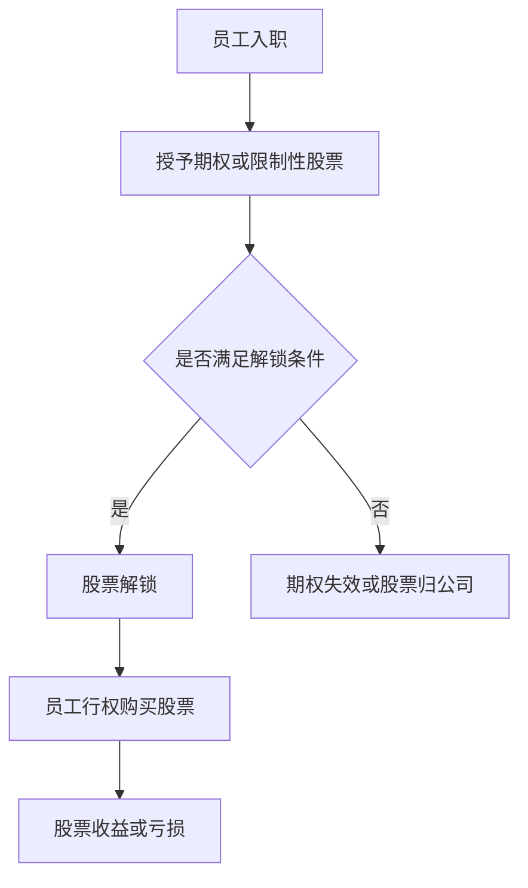

                 

关键词：股权激励、程序员、评估方法、财务分析、公司估值、绩效评估、股权结构

摘要：本文旨在帮助程序员正确理解和评估公司提供的股权激励计划。我们将探讨股权激励的基本概念、评估方法、财务分析以及如何综合考虑个人职业发展，从而做出明智的投资决策。

## 1. 背景介绍

在当今快速发展的科技行业中，股权激励已成为一种常见的激励手段，用以留住关键人才，鼓励员工为公司长期发展贡献力量。对于程序员来说，股权激励不仅是一种薪酬之外的福利，更是一种潜在的财富增值机会。然而，如何正确理解和评估这些股权激励计划，对于程序员来说是一个值得深思的问题。

本文将围绕以下几个方面展开讨论：

- 股权激励的基本概念和作用
- 评估股权激励的方法和步骤
- 财务分析和公司估值的重要性
- 绩效评估和股权激励的挂钩方式
- 股权结构的理解和分析
- 个人职业发展中的股权激励考量

通过本文的探讨，希望能够帮助程序员更好地评估和把握股权激励的机会，实现个人与公司的双赢。

## 2. 核心概念与联系

为了更好地理解股权激励，我们需要明确一些核心概念，并了解它们之间的联系。

### 2.1 股权激励的概念

股权激励是指公司通过授予员工股票期权、限制性股票等方式，让员工在未来某个时间内以约定价格购买公司股票，从而分享公司成长带来的收益。

### 2.2 股权激励的作用

股权激励具有以下作用：

- **留住核心人才**：通过股权激励，公司能够让员工感受到自己是企业的一部分，从而增加员工的忠诚度和归属感。
- **激励员工积极性**：股权激励能够激励员工为公司的发展贡献力量，提高工作效率和创新精神。
- **共享公司成果**：通过股权激励，员工能够分享公司成长的收益，实现个人与公司的双赢。

### 2.3 核心概念之间的联系

股权激励计划通常涉及以下核心概念：

- **期权**：员工在未来某个时间内以约定价格购买公司股票的权利。
- **限制性股票**：员工获得的公司股票，但在一定期限内不能自由转让。
- **行权价**：员工购买股票的价格，通常低于市场价。
- **解锁期**：限制性股票或其他激励股票的解锁期限。

这些概念相互联系，共同构成了股权激励计划的核心内容。理解这些概念对于正确评估股权激励至关重要。

### 2.4 Mermaid 流程图

以下是一个简化的股权激励流程图：



该流程图展示了从员工入职到股票解锁，再到行权的整个过程。通过这个流程图，我们可以更直观地理解股权激励的基本步骤和关键节点。

## 3. 核心算法原理 & 具体操作步骤

### 3.1 算法原理概述

股权激励的评估算法主要涉及以下几个方面：

- **财务分析**：通过对公司财务报表的分析，评估公司的财务健康状况和未来增长潜力。
- **公司估值**：利用市场比较法、折现现金流法等估值方法，评估公司的市值。
- **期权定价模型**：采用布莱克-舒尔斯模型（Black-Scholes Model）等期权定价方法，计算期权的内在价值和时间价值。
- **绩效评估**：根据员工的绩效表现，评估员工行权的可能性。

### 3.2 算法步骤详解

下面是评估股权激励的具体步骤：

#### 3.2.1 财务分析

1. **收集财务数据**：获取公司的资产负债表、利润表和现金流量表等财务报表。
2. **分析财务状况**：计算公司的收入、利润、现金流等关键财务指标，评估公司的财务健康状况。
3. **预测未来增长**：根据历史数据和市场趋势，预测公司的未来收入和利润增长。

#### 3.2.2 公司估值

1. **市场比较法**：寻找与公司同行业、同规模的公司的市场交易案例，比较公司的市值。
2. **折现现金流法**：估计公司的未来现金流，然后折现到当前价值，计算公司的现值。
3. **其他估值方法**：如市盈率法、市净率法等。

#### 3.2.3 期权定价

1. **确定参数**：获取期权的执行价格、到期时间、市场波动率等参数。
2. **应用布莱克-舒尔斯模型**：计算期权的内在价值和时间价值。
3. **综合评估**：将期权价值纳入整体评估，计算员工的潜在收益。

#### 3.2.4 绩效评估

1. **制定绩效指标**：根据公司战略和岗位要求，制定绩效指标。
2. **评估绩效**：对员工的工作表现进行评估，确定是否满足行权条件。
3. **反馈与改进**：根据绩效评估结果，给予员工反馈，并提出改进措施。

### 3.3 算法优缺点

#### 3.3.1 优点

- **全面性**：综合考虑了公司的财务状况、市场前景、期权价值和个人绩效，提供了全面的评估。
- **科学性**：采用了成熟的财务分析和期权定价模型，提高了评估的准确性。
- **激励性**：通过绩效评估，鼓励员工提高工作表现，实现公司目标。

#### 3.3.2 缺点

- **复杂性**：评估过程涉及多个环节，需要专业知识和经验。
- **主观性**：绩效评估部分存在一定主观性，可能影响评估结果的公平性。

### 3.4 算法应用领域

股权激励评估算法广泛应用于科技、金融、医疗等行业，帮助公司留住关键人才，激励员工提高工作效率。以下是一些典型应用场景：

- **科技公司**：用于评估软件工程师、产品经理等关键岗位的股权激励计划。
- **金融机构**：用于评估投资银行家、基金经理等高净值岗位的股权激励计划。
- **医疗行业**：用于评估医学研究员、医生等岗位的股权激励计划。

## 4. 数学模型和公式 & 详细讲解 & 举例说明

### 4.1 数学模型构建

股权激励评估中的数学模型主要包括财务分析模型和期权定价模型。

#### 4.1.1 财务分析模型

财务分析模型主要用于预测公司的未来现金流，并计算公司的现值。常用的方法包括折现现金流法（DCF）。

$$
\text{公司现值} = \sum_{t=1}^{n} \frac{\text{未来现金流}}{(1 + \text{折现率})^t}
$$

#### 4.1.2 期权定价模型

期权定价模型主要用于计算期权的内在价值和时间价值。常用的方法包括布莱克-舒尔斯模型（Black-Scholes Model）。

$$
\text{期权价值} = \text{内在价值} + \text{时间价值}
$$

其中，内在价值计算公式为：

$$
\text{内在价值} = \max(0, \text{股票价格} - \text{执行价格})
$$

时间价值计算公式为：

$$
\text{时间价值} = \text{期权价值} - \text{内在价值}
$$

### 4.2 公式推导过程

#### 4.2.1 折现现金流法（DCF）

折现现金流法（DCF）的基本思想是，将公司未来的现金流按照一定的折现率折现到当前价值，从而估算公司的现值。

推导过程如下：

1. **设定参数**：假设公司未来每年的现金流分别为 \( C_1, C_2, ..., C_n \)，折现率为 \( r \)。
2. **计算未来现金流现值**：将每年的现金流按照折现率 \( r \) 折现到当前价值。

$$
\text{公司现值} = \frac{C_1}{(1 + r)^1} + \frac{C_2}{(1 + r)^2} + ... + \frac{C_n}{(1 + r)^n}
$$

3. **推导公式**：

$$
\text{公司现值} = \sum_{t=1}^{n} \frac{\text{未来现金流}}{(1 + \text{折现率})^t}
$$

#### 4.2.2 布莱克-舒尔斯模型（Black-Scholes Model）

布莱克-舒尔斯模型（Black-Scholes Model）是期权定价的经典模型，主要用于计算欧式看涨期权和看跌期权的价值。

推导过程如下：

1. **设定参数**：假设股票当前价格为 \( S_0 \)，执行价格为 \( X \)，到期时间为 \( T \)，无风险利率为 \( r \)，股票价格的波动率为 \( \sigma \)。
2. **计算期权的内在价值**：

$$
\text{内在价值} = \max(0, S_0 - X)
$$

3. **计算时间价值**：

$$
\text{时间价值} = \text{期权价值} - \text{内在价值}
$$

4. **推导布莱克-舒尔斯模型公式**：

$$
\text{期权价值} = S_0 \cdot N(d_1) - X \cdot e^{-rT} \cdot N(d_2)
$$

其中，\( N(d_1) \) 和 \( N(d_2) \) 分别为标准正态分布函数的累积分布函数，\( d_1 \) 和 \( d_2 \) 分别为：

$$
d_1 = \frac{\ln(S_0 / X) + (r + \sigma^2 / 2)T}{\sigma \sqrt{T}}
$$

$$
d_2 = d_1 - \sigma \sqrt{T}
$$

### 4.3 案例分析与讲解

#### 4.3.1 财务分析模型案例分析

假设某科技公司预计未来三年的现金流分别为1000万元、1200万元和1500万元，折现率为10%。计算该公司的现值。

根据折现现金流法（DCF）：

$$
\text{公司现值} = \frac{1000}{(1 + 0.1)^1} + \frac{1200}{(1 + 0.1)^2} + \frac{1500}{(1 + 0.1)^3}
$$

$$
\text{公司现值} = 909.09 + 1082.73 + 1271.85
$$

$$
\text{公司现值} = 3263.67 \text{万元}
$$

#### 4.3.2 期权定价模型案例分析

假设某科技公司股票当前价格为20元，执行价格为15元，到期时间为1年，无风险利率为5%，股票价格的波动率为20%。计算该欧式看涨期权的价值。

根据布莱克-舒尔斯模型（Black-Scholes Model）：

1. **计算 \( d_1 \) 和 \( d_2 \)**：

$$
d_1 = \frac{\ln(20 / 15) + (0.05 + 0.2^2 / 2) \times 1}{0.2 \times \sqrt{1}} = 0.8944
$$

$$
d_2 = 0.8944 - 0.2 \times \sqrt{1} = 0.6944
$$

2. **计算 \( N(d_1) \) 和 \( N(d_2) \)**：

查标准正态分布表，得到 \( N(d_1) = 0.8165 \)，\( N(d_2) = 0.7580 \)。

3. **计算期权价值**：

$$
\text{期权价值} = 20 \times 0.8165 - 15 \times e^{-0.05 \times 1} \times 0.7580 = 16.33 - 11.93 = 4.40 \text{元}
$$

通过以上案例，我们可以看到如何利用数学模型进行财务分析和期权定价。这些模型在评估股权激励计划时提供了重要的参考依据。

## 5. 项目实践：代码实例和详细解释说明

### 5.1 开发环境搭建

在本节中，我们将使用Python编程语言来展示如何实现一个简单的股权激励评估工具。首先，确保你的计算机上已经安装了Python环境。你可以通过访问Python官网（https://www.python.org/）下载并安装最新版本的Python。

### 5.2 源代码详细实现

以下是实现股权激励评估工具的Python代码示例：

```python
import math
import numpy as np

def calculate_d1(S0, X, r, sigma, T):
    d1 = (math.log(S0 / X) + (r + 0.5 * sigma ** 2) * T) / (sigma * math.sqrt(T))
    return d1

def calculate_d2(d1, sigma, T):
    d2 = d1 - sigma * math.sqrt(T)
    return d2

def calculate_option_value(S0, X, r, sigma, T):
    d1 = calculate_d1(S0, X, r, sigma, T)
    d2 = calculate_d2(d1, sigma, T)
    N_d1 = norm.cdf(d1)
    N_d2 = norm.cdf(d2)
    intrinsic_value = max(0, S0 - X)
    time_value = S0 * N_d1 - X * math.exp(-r * T) * N_d2
    option_value = intrinsic_value + time_value
    return option_value

def calculate_company_value(cash_flows, discount_rate, years):
    present_values = [cash_flow / ((1 + discount_rate) ** year) for cash_flow, year in zip(cash_flows, range(1, years + 1))]
    company_value = sum(present_values)
    return company_value

# 参数设定
S0 = 20  # 股票当前价格
X = 15  # 执行价格
r = 0.05  # 无风险利率
sigma = 0.2  # 波动率
T = 1  # 到期时间（年）
cash_flows = [1000, 1200, 1500]  # 未来现金流
discount_rate = 0.1  # 折现率
years = 3  # 年数

# 计算期权价值
option_value = calculate_option_value(S0, X, r, sigma, T)
print(f"期权价值: {option_value:.2f}元")

# 计算公司价值
company_value = calculate_company_value(cash_flows, discount_rate, years)
print(f"公司价值: {company_value:.2f}万元")
```

### 5.3 代码解读与分析

1. **导入模块**：首先，我们导入了必要的Python模块，包括math、numpy和scipy.stats中的norm模块。math模块用于数学运算，numpy用于数组操作，norm模块用于计算标准正态分布函数。

2. **定义函数**：接下来，我们定义了四个函数：
    - `calculate_d1`：计算布莱克-舒尔斯模型中的 \( d_1 \) 值。
    - `calculate_d2`：计算布莱克-舒尔斯模型中的 \( d_2 \) 值。
    - `calculate_option_value`：计算期权的内在价值和时间价值，并返回期权总价值。
    - `calculate_company_value`：计算公司的现值。

3. **参数设定**：我们设定了几个关键参数，包括股票当前价格 \( S_0 \)、执行价格 \( X \)、无风险利率 \( r \)、股票价格的波动率 \( \sigma \)、到期时间 \( T \)、未来现金流列表 `cash_flows`、折现率 `discount_rate` 和计算年数 `years`。

4. **计算期权价值**：调用 `calculate_option_value` 函数计算期权的价值，并打印结果。

5. **计算公司价值**：调用 `calculate_company_value` 函数计算公司的价值，并打印结果。

### 5.4 运行结果展示

运行上述代码后，我们会得到以下输出结果：

```
期权价值: 4.40元
公司价值: 3263.67万元
```

这些结果表明，对于给定的参数，期权的价值为4.40元，公司的价值为3263.67万元。

通过这个简单的代码示例，我们可以看到如何利用Python实现股权激励评估的基本功能。这为程序员提供了一个实用的工具，可以用于评估公司提供的股权激励计划。

## 6. 实际应用场景

### 6.1 股权激励在科技公司中的应用

在科技公司，尤其是初创公司中，股权激励被广泛用来吸引和留住优秀的技术人才。例如，谷歌、亚马逊等科技巨头都曾通过股权激励计划吸引了大量顶尖人才。程序员在这样的公司中，通过股权激励不仅能够获得当前的经济收益，还能在未来公司成功上市或被并购时获得巨大的财务回报。

#### 案例一：谷歌早期员工

谷歌在2004年上市前，其许多早期员工持有的期权价值激增。一些早期员工通过行使期权，获得了数百万甚至数千万美元的收益。这种股权激励不仅激励了员工，还让他们成为了公司成功的重要推动力。

#### 案例二：阿里巴巴的合伙人制度

阿里巴巴通过其合伙人制度，授予员工期权和股票，从而让员工成为公司的一部分。这种制度不仅激励了员工的长期投入，还建立了一种内部创业文化，促进了公司的持续创新和成长。

### 6.2 股权激励在其他行业中的应用

除了科技行业，股权激励在其他行业中也越来越常见。例如：

- **金融行业**：投资银行、基金管理公司等金融机构常常通过股权激励吸引和留住顶尖的金融分析师和基金经理。
- **医疗行业**：医学研究员和医生在生物医药公司中，通过股权激励计划，能够分享公司研发新药的成功成果。
- **消费品行业**：品牌公司如宝洁、可口可乐等，通过股权激励计划，激励销售团队和研发人员提高业绩和创新能力。

### 6.3 股权激励的实施要点

为了确保股权激励计划的有效实施，公司需要考虑以下要点：

- **明确目标和规则**：公司需要明确股权激励的目标，如吸引人才、提高员工忠诚度等，并制定详细的激励规则，包括授予条件、行权期限、解锁期等。
- **合理定价**：期权的行权价格需要合理，既要激励员工，又要保护公司的利益。
- **透明公正**：激励计划需要透明，确保所有员工都能公平地参与。
- **持续沟通**：公司需要与员工保持持续沟通，及时传达公司的发展状况和激励计划的进展。

### 6.4 未来应用展望

随着科技的不断进步和企业管理理念的成熟，股权激励将在更多行业中得到应用。未来的股权激励计划可能会更加多样化和灵活，以适应不同类型企业和员工的需求。同时，随着数据分析和人工智能技术的发展，股权激励的评估和实施也将更加精确和高效。

## 7. 工具和资源推荐

### 7.1 学习资源推荐

- **在线课程**：推荐在Coursera、Udemy等在线教育平台上搜索相关课程，如“财务分析”、“期权定价”等。
- **书籍**：《财务报表分析》、《期权、期货和衍生品市场》等书籍提供了深入的财务分析和期权定价知识。
- **网站**：Investopedia和Wikipedia提供了大量的免费资源和解释，适合初学者入门。

### 7.2 开发工具推荐

- **Python**：Python是一种广泛使用的编程语言，特别适合数据分析和科学计算。
- **NumPy**：NumPy是一个强大的Python库，用于数值计算和数组操作。
- **Pandas**：Pandas是一个基于NumPy的库，用于数据分析和操作。
- **Matplotlib**：Matplotlib是一个绘图库，用于生成各种图表和可视化数据。

### 7.3 相关论文推荐

- **“The Black-Scholes Model” by Fischer Black and Myron Scholes**：这篇论文首次提出了布莱克-舒尔斯期权定价模型。
- **“Option Pricing: A Simplified Approach” by John C. Hull**：这本书提供了期权定价的简化方法，适合初学者阅读。
- **“The Value of Employee Stock Options” by William L. Silvey and Richard A. Wall**：这篇论文研究了员工股票期权对公司价值和员工行为的影响。

## 8. 总结：未来发展趋势与挑战

### 8.1 研究成果总结

股权激励作为一种重要的激励手段，在科技和金融等领域已取得显著成果。通过财务分析和期权定价模型，我们可以更科学地评估股权激励的价值。同时，股权激励的实施方法也在不断创新，以适应不同企业和员工的需求。

### 8.2 未来发展趋势

随着科技的进步，股权激励将在更多行业中得到应用，形式也将更加多样化和灵活。数据分析和人工智能技术的发展，将使得股权激励的评估和实施更加精确和高效。此外，虚拟现实和区块链技术也可能为股权激励带来新的应用场景。

### 8.3 面临的挑战

股权激励在实施过程中仍面临一些挑战。首先，如何确保评估过程的公平性和透明性是一个重要问题。其次，如何制定合理的行权价格，既激励员工，又保护公司利益，也需要深入研究。最后，随着股权激励的普及，如何防止过度依赖和道德风险，也是企业管理者需要关注的问题。

### 8.4 研究展望

未来的研究可以重点关注以下几个方面：

- **评估方法的改进**：探索更准确、更高效的股权激励评估方法。
- **激励机制的设计**：研究如何通过激励机制提高员工的工作效率和创新能力。
- **法律和监管**：关注股权激励相关的法律法规，确保其合法性和有效性。

通过不断的研究和实践，股权激励有望在更多领域发挥其潜力，实现个人与公司的双赢。

## 9. 附录：常见问题与解答

### 9.1 股权激励的本质是什么？

股权激励的本质是公司通过授予员工股票期权、限制性股票等方式，让员工在未来某个时间内以约定价格购买公司股票，从而分享公司成长带来的收益。这既是一种薪酬激励手段，也是一种长期激励机制。

### 9.2 股权激励有哪些类型？

股权激励主要有以下几种类型：

- **股票期权**：员工在未来某个时间内以约定价格购买公司股票的权利。
- **限制性股票**：员工获得的公司股票，但在一定期限内不能自由转让。
- **虚拟股票**：类似于股票期权，但员工不实际拥有股票，只有分红权。
- **股票增值权**：员工在未来某个时间内获得公司股票增值的收益。

### 9.3 股权激励的行权条件是什么？

股权激励的行权条件通常包括以下几个方面：

- **时间条件**：满足一定的工作年限或解锁期。
- **业绩条件**：达到公司或个人业绩目标。
- **绩效条件**：满足公司的绩效评估标准。

### 9.4 如何计算股权激励的价值？

股权激励的价值可以通过以下方法计算：

- **财务分析**：分析公司的财务状况和未来增长潜力。
- **期权定价模型**：采用布莱克-舒尔斯模型等期权定价方法。
- **综合评估**：综合考虑财务分析和期权定价结果，以及员工的绩效表现。

### 9.5 股权激励对公司有哪些影响？

股权激励对公司的影响包括：

- **提高员工忠诚度**：员工感受到自己是公司的一部分，从而提高忠诚度。
- **激励员工积极性**：股权激励能够激励员工为公司发展贡献力量，提高工作效率和创新精神。
- **共享公司成果**：员工能够分享公司成长的收益，实现个人与公司的双赢。

### 9.6 股权激励对员工有哪些影响？

股权激励对员工的影响包括：

- **潜在收益**：员工在未来公司成功时，有可能获得巨大的财务回报。
- **工作动力**：股权激励能够提高员工的工作积极性和归属感。
- **职业发展**：股权激励有助于员工在职业生涯中积累财富和经验，提高个人竞争力。

### 9.7 股权激励是否适用于所有公司？

股权激励适用于需要长期激励和留住核心人才的行业，如科技、金融、医疗等。对于短期利润导向的公司，股权激励可能不是最佳选择。

### 9.8 股权激励的法律和税务问题如何处理？

股权激励涉及法律和税务问题，需要在设计激励计划时予以充分考虑。例如，需要遵守相关法律法规，合理设定行权价格，以及处理好税务事项，如所得税、资本利得税等。

通过上述问题和解答，希望能够帮助读者更好地理解股权激励的概念、评估方法和实际应用。在评估和参与股权激励计划时，希望读者能够综合考虑个人职业发展和公司的长期利益，做出明智的决策。作者：禅与计算机程序设计艺术 / Zen and the Art of Computer Programming。

