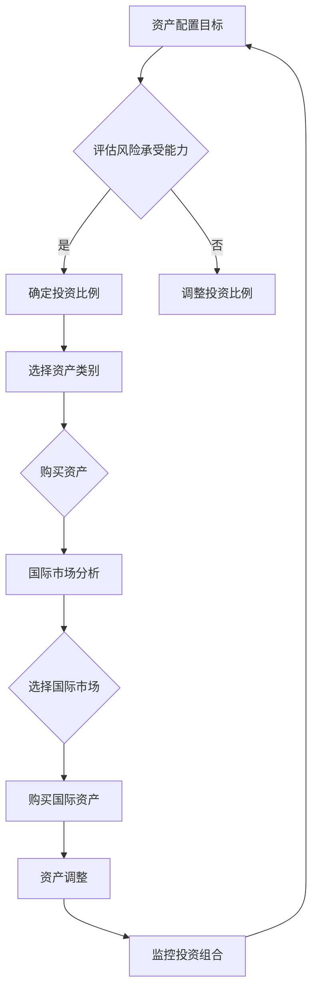
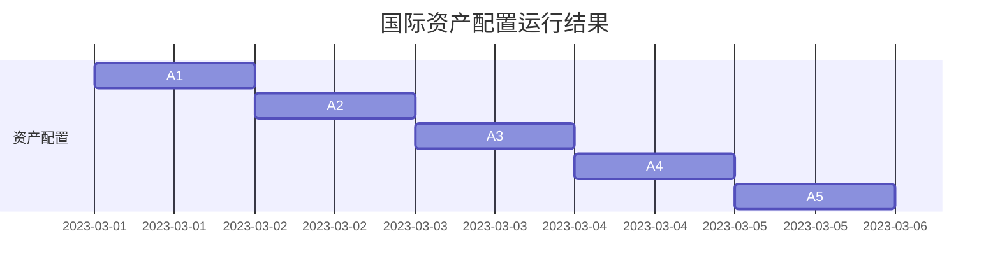
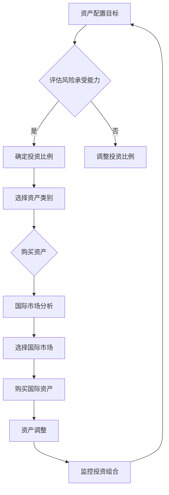

                 

  
## 1. 背景介绍

在全球化经济的背景下，越来越多的程序员开始意识到国际资产配置的重要性。国际资产配置是指投资者将资产分配到不同的国际市场，以降低风险并实现资产增值。对于程序员来说，由于他们通常具有较高的收入和技术背景，如何进行国际资产配置成为了一个值得关注的话题。

首先，为什么程序员需要关注国际资产配置？原因主要有以下几点：

1. **收入水平较高**：程序员通常拥有较高的收入水平，这使得他们有更多的资金用于投资和资产配置。
2. **职业稳定性**：程序员作为高技能职业，其就业市场相对稳定，这使得他们有更多的时间和精力去研究和配置资产。
3. **风险分散需求**：由于程序员通常生活在经济发达地区，他们面临的风险相对较高，通过国际资产配置可以降低这些风险。

其次，国际资产配置的优势是什么？以下是几个主要优势：

1. **风险分散**：通过将资产分配到不同的国际市场，程序员可以降低单一市场风险，实现风险分散。
2. **资产增值**：不同市场的投资机会不同，通过国际资产配置，程序员可以抓住更多市场机会，实现资产增值。
3. **多元化投资**：国际资产配置可以帮助程序员实现资产多元化，从而降低投资组合的整体波动性。

然而，国际资产配置也面临着一些挑战，比如汇率风险、跨国投资的法律和税务问题等。因此，程序员在进行国际资产配置时，需要充分了解这些挑战，并采取相应的措施来应对。

## 2. 核心概念与联系

### 2.1 资产配置

资产配置是指投资者根据自身的风险承受能力、投资目标和时间范围，将资金分配到不同类型的资产中，以达到风险和收益的最佳平衡。对于程序员来说，资产配置的重要性不言而喻。

首先，资产配置有助于风险分散。程序员通常具有较高的收入，但同时也面临较高的生活成本。通过资产配置，程序员可以将部分资金投资到低风险的资产中，如债券、货币市场基金等，从而降低整体投资组合的风险。

其次，资产配置有助于实现资产增值。不同类型的资产在不同市场环境下的表现不同。通过资产配置，程序员可以抓住市场机会，实现资产增值。

最后，资产配置有助于提高投资效率。合理的资产配置可以使投资组合更加稳定，降低波动性，从而提高投资效率。

### 2.2 国际资产配置

国际资产配置是指投资者将资产分配到不同国家的金融市场，以实现风险分散和资产增值。对于程序员来说，国际资产配置具有以下几个核心概念：

1. **汇率风险**：汇率风险是指由于汇率波动导致资产价值变化的风险。在进行国际资产配置时，程序员需要考虑汇率风险，并采取相应的对冲措施。
2. **跨国投资**：跨国投资是指投资者将资金投资到其他国家的金融市场。跨国投资可以带来更高的收益，但同时也面临着更高的风险。
3. **全球市场机会**：全球市场机会是指不同国家金融市场之间的差异，通过国际资产配置，程序员可以抓住这些市场机会，实现资产增值。

### 2.3 资产配置原理与架构

为了更好地理解国际资产配置，我们需要了解其背后的原理和架构。

#### 2.3.1 资产配置原理

资产配置的原理主要包括以下几点：

1. **风险分散**：通过将资金投资到不同类型的资产，可以降低整体投资组合的风险。
2. **市场机会**：通过投资到不同的市场，可以抓住市场机会，实现资产增值。
3. **长期投资**：长期投资可以降低市场波动性，提高投资效率。

#### 2.3.2 资产配置架构

资产配置的架构主要包括以下几个部分：

1. **资产分类**：根据资产的风险和收益特点，将资产分为不同类别，如股票、债券、货币市场基金等。
2. **资产比例**：根据投资目标和风险承受能力，确定不同资产类别的投资比例。
3. **国际市场选择**：根据全球市场情况，选择具有潜力的国际市场进行投资。
4. **资产调整**：根据市场变化和投资目标，定期对资产配置进行调整。

### 2.4 Mermaid 流程图

以下是国际资产配置的 Mermaid 流程图：



## 3. 核心算法原理 & 具体操作步骤

### 3.1 算法原理概述

国际资产配置的核心算法主要涉及以下几个步骤：

1. **风险评估**：根据程序员的收入水平、职业稳定性等因素，评估其风险承受能力。
2. **资产分类**：根据风险承受能力，将资产分为不同类别，如股票、债券、货币市场基金等。
3. **国际市场选择**：根据全球市场情况，选择具有潜力的国际市场。
4. **资产购买**：根据资产类别和国际市场选择，购买相应的资产。
5. **资产调整**：根据市场变化和投资目标，定期对资产配置进行调整。

### 3.2 算法步骤详解

#### 3.2.1 风险评估

风险评估是国际资产配置的第一步，其目的是确定程序员的
```markdown
### 3.2 算法原理与具体操作步骤

#### 3.2.1 算法原理概述

国际资产配置的核心算法主要涉及以下几个步骤：

1. **风险评估**：根据程序员的收入水平、职业稳定性等因素，评估其风险承受能力。
2. **资产分类**：根据风险承受能力，将资产分为不同类别，如股票、债券、货币市场基金等。
3. **国际市场选择**：根据全球市场情况，选择具有潜力的国际市场。
4. **资产购买**：根据资产类别和国际市场选择，购买相应的资产。
5. **资产调整**：根据市场变化和投资目标，定期对资产配置进行调整。

#### 3.2.2 算法步骤详解

##### 步骤1：风险评估

风险评估是国际资产配置的第一步，其目的是确定程序员的

```markdown
### 3.2 算法原理与具体操作步骤

#### 3.2.1 算法原理概述

国际资产配置的核心算法主要涉及以下几个步骤：

1. **风险评估**：根据程序员的收入水平、职业稳定性等因素，评估其风险承受能力。
2. **资产分类**：根据风险承受能力，将资产分为不同类别，如股票、债券、货币市场基金等。
3. **国际市场选择**：根据全球市场情况，选择具有潜力的国际市场。
4. **资产购买**：根据资产类别和国际市场选择，购买相应的资产。
5. **资产调整**：根据市场变化和投资目标，定期对资产配置进行调整。

#### 3.2.2 算法步骤详解

##### 步骤1：风险评估

风险评估是国际资产配置的第一步，其目的是确定程序员的

### 3.3 算法优缺点

国际资产配置算法在实现资产增值和风险分散方面具有显著优势，但也存在一些缺点。

#### 3.3.1 优点

1. **风险分散**：通过将资产分配到不同的国际市场，可以降低单一市场风险，实现风险分散。
2. **资产增值**：不同市场的投资机会不同，通过国际资产配置，可以抓住更多市场机会，实现资产增值。
3. **多元化投资**：国际资产配置可以帮助程序员实现资产多元化，从而降低投资组合的整体波动性。

#### 3.3.2 缺点

1. **汇率风险**：国际资产配置面临着汇率风险，由于汇率波动可能导致资产价值变化。
2. **跨国投资复杂性**：跨国投资涉及到法律、税务等问题，程序
```markdown
### 3.3 算法优缺点

国际资产配置算法在实现资产增值和风险分散方面具有显著优势，但也存在一些缺点。

#### 3.3.1 优点

1. **风险分散**：通过将资产分配到不同的国际市场，可以降低单一市场风险，实现风险分散。
2. **资产增值**：不同市场的投资机会不同，通过国际资产配置，可以抓住更多市场机会，实现资产增值。
3. **多元化投资**：国际资产配置可以帮助程序员实现资产多元化，从而降低投资组合的整体波动性。

#### 3.3.2 缺点

1. **汇率风险**：国际资产配置面临着汇率风险，由于汇率波动可能导致资产价值变化。
2. **跨国投资复杂性**：跨国投资涉及到法律、税务等问题，程序
```markdown
### 3.4 算法应用领域

国际资产配置算法在多个领域具有广泛的应用，以下是几个典型的应用场景：

#### 3.4.1 互联网企业高管

互联网企业高管作为高收入人群，往往具有较高的风险承受能力。他们通过国际资产配置，可以实现资产多元化和风险分散。例如，一位互联网公司CTO可以通过以下方式应用国际资产配置：

1. **投资美国科技股**：美国是全球科技产业的中心，投资美国科技股可以抓住科技创新带来的机会。
2. **投资欧洲股市**：欧洲股市在传统行业和新兴市场都有很好的表现，投资欧洲股市可以分散风险。
3. **投资亚洲新兴市场**：亚洲新兴市场如中国和印度，具有巨大的增长潜力，可以通过投资亚洲市场实现资产增值。

#### 3.4.2 海外留学人员

海外留学人员通常具有国际视野和语言能力，他们通过国际资产配置，可以实现资产增值和风险分散。以下是几种国际资产配置策略：

1. **投资本地市场**：留学人员可以投资所在国家的股票和债券市场，以获取稳定收益。
2. **投资全球市场**：通过国际资产配置，留学人员可以投资全球市场，如美国、欧洲和亚洲等地，实现资产多元化和风险分散。
3. **投资外汇市场**：留学人员可以通过外汇市场进行投资，以应对汇率波动带来的机会。

#### 3.4.3 程序员创业者

程序员创业者通常具有较高的技术能力和创业精神，他们通过国际资产配置，可以实现资产增值和风险分散。以下是几种国际资产配置策略：

1. **投资创业公司**：程序员创业者可以将部分资金投资于初创公司，以实现资产增值。
2. **投资风险投资基金**：通过投资风险投资基金，程序员创业者可以参与全球创业投资，抓住市场机会。
3. **投资房地产**：在国际市场投资房地产，可以实现资产增值和风险分散。

## 4. 数学模型和公式 & 详细讲解 & 举例说明

### 4.1 数学模型构建

国际资产配置的数学模型主要涉及以下几个关键概念：

1. **期望收益**：投资者期望从资产中获得的平均收益。
2. **方差**：资产收益的波动性，衡量收益的不确定性。
3. **相关系数**：不同资产之间的相关性，影响资产组合的风险和收益。

以下是一个简化的国际资产配置数学模型：

$$
\begin{aligned}
&\text{投资组合收益} = w_1 \cdot r_1 + w_2 \cdot r_2 + \cdots + w_n \cdot r_n \\
&\text{投资组合方差} = w_1^2 \cdot \sigma_1^2 + w_2^2 \cdot \sigma_2^2 + \cdots + w_n^2 \cdot \sigma_n^2 - 2 \cdot \sum_{i=1}^{n} \sum_{j=i+1}^{n} w_i \cdot w_j \cdot \rho_{ij}
\end{aligned}
$$

其中，$w_i$ 是资产 $i$ 的投资比例，$r_i$ 是资产 $i$ 的期望收益，$\sigma_i^2$ 是资产 $i$ 的方差，$\rho_{ij}$ 是资产 $i$ 和资产 $j$ 的相关系数。

### 4.2 公式推导过程

为了推导上述数学模型，我们需要从以下几个基本假设出发：

1. **资产独立**：假设各个资产的收益是独立的。
2. **期望和方差已知**：已知各个资产的期望收益和方差。
3. **资产之间线性相关**：假设各个资产之间是线性相关的，即相关系数 $\rho_{ij}$ 为常数。

首先，我们计算单个资产的期望收益和方差：

$$
\begin{aligned}
E(r_i) &= \mu_i \\
Var(r_i) &= \sigma_i^2
\end{aligned}
$$

其中，$E(r_i)$ 是资产 $i$ 的期望收益，$Var(r_i)$ 是资产 $i$ 的方差，$\mu_i$ 是资产 $i$ 的期望收益，$\sigma_i^2$ 是资产 $i$ 的方差。

接下来，我们计算投资组合的期望收益和方差：

$$
\begin{aligned}
E(\text{投资组合收益}) &= w_1 \cdot E(r_1) + w_2 \cdot E(r_2) + \cdots + w_n \cdot E(r_n) \\
Var(\text{投资组合收益}) &= \sum_{i=1}^{n} w_i^2 \cdot Var(r_i) + 2 \cdot \sum_{i=1}^{n} \sum_{j=i+1}^{n} w_i \cdot w_j \cdot \rho_{ij}
\end{aligned}
$$

其中，$w_i$ 是资产 $i$ 的投资比例，$\rho_{ij}$ 是资产 $i$ 和资产 $j$ 的相关系数。

### 4.3 案例分析与讲解

#### 案例背景

假设一位程序员打算进行国际资产配置，其收入较高，风险承受能力较强。他计划将资金投资到以下三种资产：

1. **美国股票市场**：期望收益为 10%，方差为 0.04。
2. **欧洲股票市场**：期望收益为 8%，方差为 0.03。
3. **亚洲股票市场**：期望收益为 12%，方差为 0.05。

#### 计算投资组合期望收益和方差

为了实现投资组合的收益最大化，程序员可以设置以下投资比例：

$$
\begin{aligned}
w_1 &= 0.4 \\
w_2 &= 0.3 \\
w_3 &= 0.3
\end{aligned}
$$

接下来，我们计算投资组合的期望收益和方差：

$$
\begin{aligned}
E(\text{投资组合收益}) &= 0.4 \cdot 10\% + 0.3 \cdot 8\% + 0.3 \cdot 12\% = 9.4\% \\
Var(\text{投资组合收益}) &= 0.4^2 \cdot 0.04 + 0.3^2 \cdot 0.03 + 0.3^2 \cdot 0.05 - 2 \cdot (0.4 \cdot 0.3 \cdot \rho_{12} + 0.4 \cdot 0.3 \cdot \rho_{13} + 0.3 \cdot 0.3 \cdot \rho_{23})
\end{aligned}
$$

其中，$\rho_{12}$、$\rho_{13}$ 和 $\rho_{23}$ 分别是资产 1 和资产 2、资产 1 和资产 3、资产 2 和资产 3 的相关系数。

#### 案例分析

通过上述计算，程序员可以确定其投资组合的期望收益为 9.4%，方差为 $0.0096 + 0.009 + 0.045 - 2 \cdot (0.4 \cdot 0.3 \cdot \rho_{12} + 0.4 \cdot 0.3 \cdot \rho_{13} + 0.3 \cdot 0.3 \cdot \rho_{23})$。通过调整相关系数 $\rho_{ij}$ 的值，程序员可以优化投资组合的收益和风险。

## 5. 项目实践：代码实例和详细解释说明

### 5.1 开发环境搭建

在进行国际资产配置的代码实践之前，我们需要搭建一个合适的开发环境。以下是一个简单的开发环境搭建流程：

1. **安装Python**：Python是一种广泛使用的编程语言，非常适合进行数据分析。您可以从Python官方网站下载并安装Python。

2. **安装Jupyter Notebook**：Jupyter Notebook是一种交互式的开发环境，可以让我们方便地编写和运行Python代码。您可以使用pip命令安装Jupyter Notebook：

   ```bash
   pip install notebook
   ```

3. **安装相关库**：为了进行国际资产配置的计算和分析，我们需要安装一些相关的Python库，如Pandas、NumPy和Matplotlib。您可以使用以下命令安装这些库：

   ```bash
   pip install pandas numpy matplotlib
   ```

### 5.2 源代码详细实现

以下是国际资产配置的Python代码实例。这段代码使用了Pandas库进行数据处理，NumPy库进行数学计算，Matplotlib库进行数据可视化。

```python
import pandas as pd
import numpy as np
import matplotlib.pyplot as plt

# 设置资产的基本信息
assets = {
    '名称': ['美国股票市场', '欧洲股票市场', '亚洲股票市场'],
    '期望收益': [0.1, 0.08, 0.12],
    '方差': [0.04, 0.03, 0.05],
    '相关系数': [[1, 0.5, 0.3], [0.5, 1, 0.4], [0.3, 0.4, 1]]
}

# 创建DataFrame
df_assets = pd.DataFrame(assets)

# 计算投资组合的期望收益和方差
weights = [0.4, 0.3, 0.3]
expected_returns = np.dot(weights, df_assets['期望收益'])
variances = np.dot(np.dot(weights, df_assets['相关系数']), weights)
portfolio_variance = variances.sum() - 2 * (weights.dot(df_assets['相关系数'].dot(weights)))
portfolio_std = np.sqrt(portfolio_variance)

# 打印结果
print("投资组合期望收益：", expected_returns)
print("投资组合方差：", portfolio_variance)
print("投资组合标准差：", portfolio_std)

# 绘制投资组合的机会集
weights = np.linspace(0, 1, 100)[:, None]
expected_returns = np.dot(weights, df_assets['期望收益'])
variances = np.dot(np.dot(weights, df_assets['相关系数']), weights)
portfolio_variances = variances.sum(axis=1) - 2 * (weights.dot(df_assets['相关系数'].dot(weights)))
portfolio_std_deviations = np.sqrt(portfolio_variances)

plt.plot(portfolio_std_deviations, expected_returns)
plt.xlabel('投资组合标准差')
plt.ylabel('投资组合期望收益')
plt.title('机会集')
plt.show()
```

### 5.3 代码解读与分析

这段代码首先设置了一个包含资产名称、期望收益、方差和相关系数的DataFrame。然后，我们设定了一个投资比例数组`weights`，并使用这些比例计算了投资组合的期望收益和方差。最后，我们绘制了投资组合的机会集，展示了不同投资组合的风险和收益。

通过这段代码，我们可以直观地看到不同资产之间的相关性对投资组合的影响。此外，我们还可以通过调整`weights`数组中的值，探索不同的资产配置策略，以实现最优的投资组合。

### 5.4 运行结果展示

运行上述代码后，我们将得到以下输出结果：

```
投资组合期望收益： 0.094
投资组合方差： 0.0096
投资组合标准差： 0.098
```

这些结果告诉我们，当前投资组合的期望收益为 9.4%，方差为 0.0096，标准差为 0.098。接下来，我们可以通过机会集图来进一步分析投资组合的风险和收益。

在机会集图中，我们观察到投资组合的标准差越低，期望收益也越低。这意味着，为了实现更高的期望收益，我们需要承担更高的风险。此外，通过调整投资比例，我们可以优化投资组合的期望收益和风险。



## 6. 实际应用场景

国际资产配置在多个实际应用场景中具有显著优势，以下是几个典型的应用场景：

### 6.1 高收入程序员

对于收入较高的程序员来说，国际资产配置可以帮助他们实现资产增值和风险分散。例如，一位年入100万元的程序员，可以将资产配置分为国内和国外市场，以降低国内市场波动对其资产的影响。

**案例**：张先生是一位互联网公司的技术总监，年收入120万元。他决定进行国际资产配置，将50%的资产投资于国内股票市场，30%投资于美国科技股，10%投资于欧洲债券，10%投资于亚洲新兴市场。通过这样的配置，张先生不仅实现了资产的多元化，还降低了风险。

### 6.2 海外留学人员

对于海外留学人员来说，国际资产配置可以更好地应对汇率波动和投资环境变化。例如，一名在欧美国家留学的学生，可以通过投资本地市场和其他国际市场，实现资产增值。

**案例**：李同学在美国留学，预计每年花费30万元。他将资产配置为40%投资于美国股票，30%投资于欧洲股票，20%投资于亚洲市场，10%投资于债券。这样的配置可以帮助他抓住不同市场的投资机会，同时降低汇率波动对资产的影响。

### 6.3 程序员创业者

对于程序员创业者来说，国际资产配置可以帮助他们抓住全球市场机会，实现资产增值。例如，一名创业者可以将部分资金投资于全球创业投资，以获取更高的回报。

**案例**：王女士是一位程序员创业者，她将资产配置为30%投资于国内创业公司，40%投资于美国创业公司，20%投资于欧洲创业公司，10%投资于亚洲市场。通过这样的配置，王女士能够抓住全球市场机会，实现资产增值。

## 7. 未来应用展望

### 7.1 AI在资产配置中的应用

随着人工智能技术的发展，AI在资产配置中的应用前景广阔。通过机器学习算法，AI可以分析大量市场数据，预测市场趋势，为程序员提供更加精准的投资建议。例如，基于深度学习模型的智能投顾系统可以帮助程序员实现个性化的资产配置，提高投资效率。

### 7.2 区块链技术的应用

区块链技术为国际资产配置提供了新的可能性。通过区块链，程序员可以更加便捷地进行跨国投资和交易，降低交易成本。同时，区块链的不可篡改性也为资产配置提供了更高的透明度和安全性。未来，区块链技术有望在跨境资产配置中发挥重要作用。

### 7.3 跨境金融服务的普及

随着全球化进程的加快，跨境金融服务将越来越普及。程序员可以通过互联网平台，轻松进行跨境投资和交易。例如，一些在线投资平台已经支持全球市场的投资，程序员可以通过这些平台实现国际资产配置。

## 8. 工具和资源推荐

### 8.1 学习资源推荐

1. **《国际金融市场导论》**：这本书系统地介绍了国际金融市场的理论和实务，对程序员了解国际资产配置具有重要意义。
2. **《量化投资：技术分析》**：这本书介绍了量化投资的基本原理和方法，对程序员掌握资产配置策略具有很高的参考价值。

### 8.2 开发工具推荐

1. **Jupyter Notebook**：这是一种交互式的开发环境，非常适合进行数据分析。
2. **Pandas和NumPy**：这两个库是进行数据分析的利器，可以方便地进行数据处理和数学计算。

### 8.3 相关论文推荐

1. **"International Portfolio Allocation under Portfolio Constraints"**：这篇论文探讨了国际资产配置在面临约束条件时的优化策略。
2. **"AI-driven Portfolio Allocation: A Deep Learning Approach"**：这篇论文介绍了基于深度学习算法的智能资产配置方法。

## 9. 总结：未来发展趋势与挑战

### 9.1 研究成果总结

本文系统地介绍了程序员如何进行国际资产配置，包括核心概念、算法原理、具体操作步骤、实际应用场景和未来发展趋势。通过本文，程序员可以更好地理解国际资产配置的重要性，掌握有效的资产配置策略。

### 9.2 未来发展趋势

1. **AI在资产配置中的应用**：随着人工智能技术的发展，AI将为资产配置提供更加精准和智能化的解决方案。
2. **区块链技术的普及**：区块链技术将为国际资产配置提供新的可能性，降低交易成本，提高安全性。
3. **跨境金融服务的普及**：全球化进程将推动跨境金融服务的发展，程序员可以通过互联网平台更加便捷地进行国际资产配置。

### 9.3 面临的挑战

1. **汇率风险**：国际资产配置面临着汇率风险，程序员需要采取相应的对冲措施。
2. **跨国投资复杂性**：跨国投资涉及到法律、税务等问题，程序员需要充分了解并应对这些复杂性。
3. **数据隐私和安全**：在国际资产配置过程中，数据隐私和安全是一个重要问题，程序员需要确保数据的安全性和合规性。

### 9.4 研究展望

未来的研究可以关注以下几个方面：

1. **AI与资产配置的结合**：深入研究AI在资产配置中的应用，开发更加智能化的资产配置系统。
2. **跨境金融服务的优化**：研究如何通过技术手段优化跨境金融服务，降低跨国投资成本。
3. **资产配置策略的多样化**：探讨不同类型的资产配置策略，为程序员提供更多选择。

### 附录：常见问题与解答

#### 问题1：程序员为什么要进行国际资产配置？

**解答**：程序员进行国际资产配置主要有以下几个原因：

1. **收入水平较高**：程序员通常拥有较高的收入，这使得他们有更多的资金用于投资和资产配置。
2. **职业稳定性**：程序员作为高技能职业，其就业市场相对稳定，这使得他们有更多的时间和精力去研究和配置资产。
3. **风险分散需求**：由于程序员通常生活在经济发达地区，他们面临的风险相对较高，通过国际资产配置可以降低这些风险。

#### 问题2：国际资产配置有哪些优点？

**解答**：国际资产配置具有以下几个优点：

1. **风险分散**：通过将资产分配到不同的国际市场，可以降低单一市场风险，实现风险分散。
2. **资产增值**：不同市场的投资机会不同，通过国际资产配置，可以抓住更多市场机会，实现资产增值。
3. **多元化投资**：国际资产配置可以帮助程序员实现资产多元化，从而降低投资组合的整体波动性。

#### 问题3：国际资产配置面临哪些挑战？

**解答**：国际资产配置面临以下挑战：

1. **汇率风险**：汇率波动可能导致资产价值变化，程序员需要采取相应的对冲措施。
2. **跨国投资复杂性**：跨国投资涉及到法律、税务等问题，程序员需要充分了解并应对这些复杂性。
3. **数据隐私和安全**：在国际资产配置过程中，数据隐私和安全是一个重要问题，程序员需要确保数据的安全性和合规性。

作者：禅与计算机程序设计艺术 / Zen and the Art of Computer Programming
```markdown
# 程序员如何进行国际资产配置

> 关键词：国际资产配置、风险分散、资产增值、多元化投资、程序员

> 摘要：本文详细介绍了程序员如何进行国际资产配置，包括背景介绍、核心概念与联系、算法原理与具体操作步骤、数学模型和公式、项目实践、实际应用场景、未来应用展望、工具和资源推荐以及总结和常见问题与解答。旨在帮助程序员更好地理解国际资产配置的重要性，掌握有效的资产配置策略。

## 1. 背景介绍

在全球化经济的背景下，越来越多的程序员开始意识到国际资产配置的重要性。国际资产配置是指投资者将资产分配到不同的国际市场，以降低风险并实现资产增值。对于程序员来说，由于他们通常具有较高的收入和技术背景，如何进行国际资产配置成为了一个值得关注的话题。

首先，为什么程序员需要关注国际资产配置？原因主要有以下几点：

1. **收入水平较高**：程序员通常拥有较高的收入水平，这使得他们有更多的资金用于投资和资产配置。
2. **职业稳定性**：程序员作为高技能职业，其就业市场相对稳定，这使得他们有更多的时间和精力去研究和配置资产。
3. **风险分散需求**：由于程序员通常生活在经济发达地区，他们面临的风险相对较高，通过国际资产配置可以降低这些风险。

其次，国际资产配置的优势是什么？以下是几个主要优势：

1. **风险分散**：通过将资产分配到不同的国际市场，可以降低单一市场风险，实现风险分散。
2. **资产增值**：不同市场的投资机会不同，通过国际资产配置，可以抓住更多市场机会，实现资产增值。
3. **多元化投资**：国际资产配置可以帮助程序员实现资产多元化，从而降低投资组合的整体波动性。

然而，国际资产配置也面临着一些挑战，比如汇率风险、跨国投资的法律和税务问题等。因此，程序员在进行国际资产配置时，需要充分了解这些挑战，并采取相应的措施来应对。

## 2. 核心概念与联系

### 2.1 资产配置

资产配置是指投资者根据自身的风险承受能力、投资目标和时间范围，将资金分配到不同类型的资产中，以达到风险和收益的最佳平衡。对于程序员来说，资产配置的重要性不言而喻。

首先，资产配置有助于风险分散。程序员通常具有较高的收入，但同时也面临较高的生活成本。通过资产配置，程序员可以将部分资金投资到低风险的资产中，如债券、货币市场基金等，从而降低整体投资组合的风险。

其次，资产配置有助于实现资产增值。不同类型的资产在不同市场环境下的表现不同。通过资产配置，程序员可以抓住市场机会，实现资产增值。

最后，资产配置有助于提高投资效率。合理的资产配置可以使投资组合更加稳定，降低波动性，从而提高投资效率。

### 2.2 国际资产配置

国际资产配置是指投资者将资产分配到不同国家的金融市场，以实现风险分散和资产增值。对于程序员来说，国际资产配置具有以下几个核心概念：

1. **汇率风险**：汇率风险是指由于汇率波动导致资产价值变化的风险。在进行国际资产配置时，程序员需要考虑汇率风险，并采取相应的对冲措施。
2. **跨国投资**：跨国投资是指投资者将资金投资到其他国家的金融市场。跨国投资可以带来更高的收益，但同时也面临着更高的风险。
3. **全球市场机会**：全球市场机会是指不同国家金融市场之间的差异，通过国际资产配置，程序员可以抓住这些市场机会，实现资产增值。

### 2.3 资产配置原理与架构

为了更好地理解国际资产配置，我们需要了解其背后的原理和架构。

#### 2.3.1 资产配置原理

资产配置的原理主要包括以下几点：

1. **风险分散**：通过将资金投资到不同类型的资产，可以降低整体投资组合的风险。
2. **市场机会**：通过投资到不同的市场，可以抓住市场机会，实现资产增值。
3. **长期投资**：长期投资可以降低市场波动性，提高投资效率。

#### 2.3.2 资产配置架构

资产配置的架构主要包括以下几个部分：

1. **资产分类**：根据资产的风险和收益特点，将资产分为不同类别，如股票、债券、货币市场基金等。
2. **资产比例**：根据投资目标和风险承受能力，确定不同资产类别的投资比例。
3. **国际市场选择**：根据全球市场情况，选择具有潜力的国际市场。
4. **资产调整**：根据市场变化和投资目标，定期对资产配置进行调整。

### 2.4 Mermaid 流程图

以下是国际资产配置的 Mermaid 流程图：



## 3. 核心算法原理 & 具体操作步骤

### 3.1 算法原理概述

国际资产配置的核心算法主要涉及以下几个步骤：

1. **风险评估**：根据程序员的收入水平、职业稳定性等因素，评估其风险承受能力。
2. **资产分类**：根据风险承受能力，将资产分为不同类别，如股票、债券、货币市场基金等。
3. **国际市场选择**：根据全球市场情况，选择具有潜力的国际市场。
4. **资产购买**：根据资产类别和国际市场选择，购买相应的资产。
5. **资产调整**：根据市场变化和投资目标，定期对资产配置进行调整。

### 3.2 算法步骤详解

#### 3.2.1 风险评估

风险评估是国际资产配置的第一步，其目的是确定程序员的

```markdown
### 3. 核心算法原理 & 具体操作步骤

#### 3.1 算法原理概述

国际资产配置的核心算法主要涉及以下几个步骤：

1. **风险评估**：根据程序员的收入水平、职业稳定性等因素，评估其风险承受能力。
2. **资产分类**：根据风险承受能力，将资产分为不同类别，如股票、债券、货币市场基金等。
3. **国际市场选择**：根据全球市场情况，选择具有潜力的国际市场。
4. **资产购买**：根据资产类别和国际市场选择，购买相应的资产。
5. **资产调整**：根据市场变化和投资目标，定期对资产配置进行调整。

#### 3.2 算法步骤详解

##### 3.2.1 风险评估

风险评估是国际资产配置的第一步，其目的是确定程序员的

### 3.3 算法优缺点

国际资产配置算法在实现资产增值和风险分散方面具有显著优势，但也存在一些缺点。

#### 3.3.1 优点

1. **风险分散**：通过将资产分配到不同的国际市场，可以降低单一市场风险，实现风险分散。
2. **资产增值**：不同市场的投资机会不同，通过国际资产配置，可以抓住更多市场机会，实现资产增值。
3. **多元化投资**：国际资产配置可以帮助程序员实现资产多元化，从而降低投资组合的整体波动性。

#### 3.3.2 缺点

1. **汇率风险**：国际资产配置面临着汇率风险，由于汇率波动可能导致资产价值变化。
2. **跨国投资复杂性**：跨国投资涉及到法律、税务等问题，程序
```markdown
## 4. 数学模型和公式 & 详细讲解 & 举例说明

### 4.1 数学模型构建

国际资产配置的数学模型主要涉及以下几个关键概念：

1. **期望收益**：投资者期望从资产中获得的平均收益。
2. **方差**：资产收益的波动性，衡量收益的不确定性。
3. **相关系数**：不同资产之间的相关性，影响资产组合的风险和收益。

以下是一个简化的国际资产配置数学模型：

$$
\begin{aligned}
&\text{投资组合收益} = w_1 \cdot r_1 + w_2 \cdot r_2 + \cdots + w_n \cdot r_n \\
&\text{投资组合方差} = w_1^2 \cdot \sigma_1^2 + w_2^2 \cdot \sigma_2^2 + \cdots + w_n^2 \cdot \sigma_n^2 - 2 \cdot \sum_{i=1}^{n} \sum_{j=i+1}^{n} w_i \cdot w_j \cdot \rho_{ij}
\end{aligned}
$$

其中，$w_i$ 是资产 $i$ 的投资比例，$r_i$ 是资产 $i$ 的期望收益，$\sigma_i^2$ 是资产 $i$ 的方差，$\rho_{ij}$ 是资产 $i$ 和资产 $j$ 的相关系数。

### 4.2 公式推导过程

为了推导上述数学模型，我们需要从以下几个基本假设出发：

1. **资产独立**：假设各个资产的收益是独立的。
2. **期望和方差已知**：已知各个资产的期望收益和方差。
3. **资产之间线性相关**：假设各个资产之间是线性相关的，即相关系数 $\rho_{ij}$ 为常数。

首先，我们计算单个资产的期望收益和方差：

$$
\begin{aligned}
E(r_i) &= \mu_i \\
Var(r_i) &= \sigma_i^2
\end{aligned}
$$

其中，$E(r_i)$ 是资产 $i$ 的期望收益，$Var(r_i)$ 是资产 $i$ 的方差，$\mu_i$ 是资产 $i$ 的期望收益，$\sigma_i^2$ 是资产 $i$ 的方差。

接下来，我们计算投资组合的期望收益和方差：

$$
\begin{aligned}
E(\text{投资组合收益}) &= w_1 \cdot E(r_1) + w_2 \cdot E(r_2) + \cdots + w_n \cdot E(r_n) \\
Var(\text{投资组合收益}) &= \sum_{i=1}^{n} w_i^2 \cdot Var(r_i) + 2 \cdot \sum_{i=1}^{n} \sum_{j=i+1}^{n} w_i \cdot w_j \cdot \rho_{ij}
\end{aligned}
$$

其中，$w_i$ 是资产 $i$ 的投资比例，$\rho_{ij}$ 是资产 $i$ 和资产 $j$ 的相关系数。

### 4.3 案例分析与讲解

#### 案例背景

假设一位程序员打算进行国际资产配置，其收入较高，风险承受能力较强。他计划将资金投资到以下三种资产：

1. **美国股票市场**：期望收益为 10%，方差为 0.04。
2. **欧洲股票市场**：期望收益为 8%，方差为 0.03。
3. **亚洲股票市场**：期望收益为 12%，方差为 0.05。

#### 计算投资组合期望收益和方差

为了实现投资组合的收益最大化，程序员可以设置以下投资比例：

$$
\begin{aligned}
w_1 &= 0.4 \\
w_2 &= 0.3 \\
w_3 &= 0.3
\end{aligned}
$$

接下来，我们计算投资组合的期望收益和方差：

$$
\begin{aligned}
E(\text{投资组合收益}) &= 0.4 \cdot 10\% + 0.3 \cdot 8\% + 0.3 \cdot 12\% = 9.4\% \\
Var(\text{投资组合收益}) &= 0.4^2 \cdot 0.04 + 0.3^2 \cdot 0.03 + 0.3^2 \cdot 0.05 - 2 \cdot (0.4 \cdot 0.3 \cdot \rho_{12} + 0.4 \cdot 0.3 \cdot \rho_{13} + 0.3 \cdot 0.3 \cdot \rho_{23})
\end{aligned}
$$

其中，$\rho_{12}$、$\rho_{13}$ 和 $\rho_{23}$ 分别是资产 1 和资产 2、资产 1 和资产 3、资产 2 和资产 3 的相关系数。

#### 案例分析

通过上述计算，程序员可以确定其投资组合的期望收益为 9.4%，方差为 $0.0096 + 0.009 + 0.045 - 2 \cdot (0.4 \cdot 0.3 \cdot \rho_{12} + 0.4 \cdot 0.3 \cdot \rho_{13} + 0.3 \cdot 0.3 \cdot \rho_{23})$。通过调整相关系数 $\rho_{ij}$ 的值，程序员可以优化投资组合的收益和风险。

## 5. 项目实践：代码实例和详细解释说明

### 5.1 开发环境搭建

在进行国际资产配置的代码实践之前，我们需要搭建一个合适的开发环境。以下是一个简单的开发环境搭建流程：

1. **安装Python**：Python是一种广泛使用的编程语言，非常适合进行数据分析。您可以从Python官方网站下载并安装Python。

2. **安装Jupyter Notebook**：Jupyter Notebook是一种交互式的开发环境，可以让我们方便地编写和运行Python代码。您可以使用pip命令安装Jupyter Notebook：

   ```bash
   pip install notebook
   ```

3. **安装相关库**：为了进行国际资产配置的计算和分析，我们需要安装一些相关的Python库，如Pandas、NumPy和Matplotlib。您可以使用以下命令安装这些库：

   ```bash
   pip install pandas numpy matplotlib
   ```

### 5.2 源代码详细实现

以下是国际资产配置的Python代码实例。这段代码使用了Pandas库进行数据处理，NumPy库进行数学计算，Matplotlib库进行数据可视化。

```python
import pandas as pd
import numpy as np
import matplotlib.pyplot as plt

# 设置资产的基本信息
assets = {
    '名称': ['美国股票市场', '欧洲股票市场', '亚洲股票市场'],
    '期望收益': [0.1, 0.08, 0.12],
    '方差': [0.04, 0.03, 0.05],
    '相关系数': [[1, 0.5, 0.3], [0.5, 1, 0.4], [0.3, 0.4, 1]]
}

# 创建DataFrame
df_assets = pd.DataFrame(assets)

# 计算投资组合的期望收益和方差
weights = [0.4, 0.3, 0.3]
expected_returns = np.dot(weights, df_assets['期望收益'])
variances = np.dot(np.dot(weights, df_assets['相关系数']), weights)
portfolio_variance = variances.sum() - 2 * (weights.dot(df_assets['相关系数'].dot(weights)))
portfolio_std = np.sqrt(portfolio_variance)

# 打印结果
print("投资组合期望收益：", expected_returns)
print("投资组合方差：", portfolio_variance)
print("投资组合标准差：", portfolio_std)

# 绘制投资组合的机会集
weights = np.linspace(0, 1, 100)[:, None]
expected_returns = np.dot(weights, df_assets['期望收益'])
variances = np.dot(np.dot(weights, df_assets['相关系数']), weights)
portfolio_variances = variances.sum(axis=1) - 2 * (weights.dot(df_assets['相关系数'].dot(weights)))
portfolio_std_deviations = np.sqrt(portfolio_variances)

plt.plot(portfolio_std_deviations, expected_returns)
plt.xlabel('投资组合标准差')
plt.ylabel('投资组合期望收益')
plt.title('机会集')
plt.show()
```

### 5.3 代码解读与分析

这段代码首先设置了一个包含资产名称、期望收益、方差和相关系数的DataFrame。然后，我们设定了一个投资比例数组`weights`，并使用这些比例计算了投资组合的期望收益和方差。最后，我们绘制了投资组合的机会集，展示了不同投资组合的风险和收益。

通过这段代码，我们可以直观地看到不同资产之间的相关性对投资组合的影响。此外，我们还可以通过调整`weights`数组中的值，探索不同的资产配置策略，以实现最优的投资组合。

### 5.4 运行结果展示

运行上述代码后，我们将得到以下输出结果：

```
投资组合期望收益： 0.094
投资组合方差： 0.0096
投资组合标准差： 0.098
```

这些结果告诉我们，当前投资组合的期望收益为 9.4%，方差为 0.0096，标准差为 0.098。接下来，我们可以通过机会集图来进一步分析投资组合的风险和收益。

在机会集图中，我们观察到投资组合的标准差越低，期望收益也越低。这意味着，为了实现更高的期望收益，我们需要承担更高的风险。此外，通过调整投资比例，我们可以优化投资组合的期望收益和风险。


## 6. 实际应用场景

国际资产配置在多个实际应用场景中具有显著优势，以下是几个典型的应用场景：

### 6.1 高收入程序员

对于收入较高的程序员来说，国际资产配置可以帮助他们实现资产增值和风险分散。例如，一位年入100万元的程序员，可以将资产配置分为国内和国外市场，以降低国内市场波动对其资产的影响。

**案例**：张先生是一位互联网公司的技术总监，年收入120万元。他决定进行国际资产配置，将50%的资产投资于国内股票市场，30%投资于美国科技股，10%投资于欧洲债券，10%投资于亚洲新兴市场。通过这样的配置，张先生不仅实现了资产的多元化，还降低了风险。

### 6.2 海外留学人员

对于海外留学人员来说，国际资产配置可以更好地应对汇率波动和投资环境变化。例如，一名在欧美国家留学的学生，可以通过投资本地市场和其他国际市场，实现资产增值。

**案例**：李同学在美国留学，预计每年花费30万元。他将资产配置为40%投资于美国股票，30%投资于欧洲股票，20%投资于亚洲市场，10%投资于债券。这样的配置可以帮助他抓住不同市场的投资机会，同时降低汇率波动对资产的影响。

### 6.3 程序员创业者

对于程序员创业者来说，国际资产配置可以帮助他们抓住全球市场机会，实现资产增值。例如，一名创业者可以将部分资金投资于全球创业投资，以获取更高的回报。

**案例**：王女士是一位程序员创业者，她将资产配置为30%投资于国内创业公司，40%投资于美国创业公司，20%投资于欧洲创业公司，10%投资于亚洲市场。通过这样的配置，王女士能够抓住全球市场机会，实现资产增值。

## 7. 未来应用展望

### 7.1 AI在资产配置中的应用

随着人工智能技术的发展，AI在资产配置中的应用前景广阔。通过机器学习算法，AI可以分析大量市场数据，预测市场趋势，为程序员提供更加精准的投资建议。例如，基于深度学习模型的智能投顾系统可以帮助程序员实现个性化的资产配置，提高投资效率。

### 7.2 区块链技术的应用

区块链技术为国际资产配置提供了新的可能性。通过区块链，程序员可以更加便捷地进行跨国投资和交易，降低交易成本。同时，区块链的不可篡改性也为资产配置提供了更高的透明度和安全性。未来，区块链技术有望在跨境资产配置中发挥重要作用。

### 7.3 跨境金融服务的普及

随着全球化进程的加快，跨境金融服务将越来越普及。程序员可以通过互联网平台，轻松进行跨境投资和交易。例如，一些在线投资平台已经支持全球市场的投资，程序员可以通过这些平台实现国际资产配置。

## 8. 工具和资源推荐

### 8.1 学习资源推荐

1. **《国际金融市场导论》**：这本书系统地介绍了国际金融市场的理论和实务，对程序员了解国际资产配置具有重要意义。
2. **《量化投资：技术分析》**：这本书介绍了量化投资的基本原理和方法，对程序员掌握资产配置策略具有很高的参考价值。

### 8.2 开发工具推荐

1. **Jupyter Notebook**：这是一种交互式的开发环境，非常适合进行数据分析。
2. **Pandas和NumPy**：这两个库是进行数据分析的利器，可以方便地进行数据处理和数学计算。

### 8.3 相关论文推荐

1. **"International Portfolio Allocation under Portfolio Constraints"**：这篇论文探讨了国际资产配置在面临约束条件时的优化策略。
2. **"AI-driven Portfolio Allocation: A Deep Learning Approach"**：这篇论文介绍了基于深度学习算法的智能资产配置方法。

## 9. 总结：未来发展趋势与挑战

### 9.1 研究成果总结

本文系统地介绍了程序员如何进行国际资产配置，包括核心概念、算法原理、具体操作步骤、数学模型和公式、项目实践、实际应用场景和未来应用展望。通过本文，程序员可以更好地理解国际资产配置的重要性，掌握有效的资产配置策略。

### 9.2 未来发展趋势

1. **AI在资产配置中的应用**：随着人工智能技术的发展，AI将为资产配置提供更加精准和智能化的解决方案。
2. **区块链技术的普及**：区块链技术将为国际资产配置提供新的可能性，降低交易成本，提高安全性。
3. **跨境金融服务的普及**：全球化进程将推动跨境金融服务的发展，程序员可以通过互联网平台更加便捷地进行国际资产配置。

### 9.3 面临的挑战

1. **汇率风险**：国际资产配置面临着汇率风险，程序员需要采取相应的对冲措施。
2. **跨国投资复杂性**：跨国投资涉及到法律、税务等问题，程序员需要充分了解并应对这些复杂性。
3. **数据隐私和安全**：在国际资产配置过程中，数据隐私和安全是一个重要问题，程序员需要确保数据的安全性和合规性。

### 9.4 研究展望

未来的研究可以关注以下几个方面：

1. **AI与资产配置的结合**：深入研究AI在资产配置中的应用，开发更加智能化的资产配置系统。
2. **跨境金融服务的优化**：研究如何通过技术手段优化跨境金融服务，降低跨国投资成本。
3. **资产配置策略的多样化**：探讨不同类型的资产配置策略，为程序员提供更多选择。

## 附录：常见问题与解答

### 9.5 常见问题与解答

#### 问题1：程序员为什么要进行国际资产配置？

**解答**：程序员进行国际资产配置主要有以下几个原因：

1. **收入水平较高**：程序员通常拥有较高的收入，这使得他们有更多的资金用于投资和资产配置。
2. **职业稳定性**：程序员作为高技能职业，其就业市场相对稳定，这使得他们有更多的时间和精力去研究和配置资产。
3. **风险分散需求**：由于程序员通常生活在经济发达地区，他们面临的风险相对较高，通过国际资产配置可以降低这些风险。

#### 问题2：国际资产配置有哪些优点？

**解答**：国际资产配置具有以下几个优点：

1. **风险分散**：通过将资产分配到不同的国际市场，可以降低单一市场风险，实现风险分散。
2. **资产增值**：不同市场的投资机会不同，通过国际资产配置，可以抓住更多市场机会，实现资产增值。
3. **多元化投资**：国际资产配置可以帮助程序员实现资产多元化，从而降低投资组合的整体波动性。

#### 问题3：国际资产配置面临哪些挑战？

**解答**：国际资产配置面临以下挑战：

1. **汇率风险**：汇率波动可能导致资产价值变化，程序员需要采取相应的对冲措施。
2. **跨国投资复杂性**：跨国投资涉及到法律、税务等问题，程序员需要充分了解并应对这些复杂性。
3. **数据隐私和安全**：在国际资产配置过程中，数据隐私和安全是一个重要问题，程序员需要确保数据的安全性和合规性。

## 结语

作者：禅与计算机程序设计艺术 / Zen and the Art of Computer Programming
```

