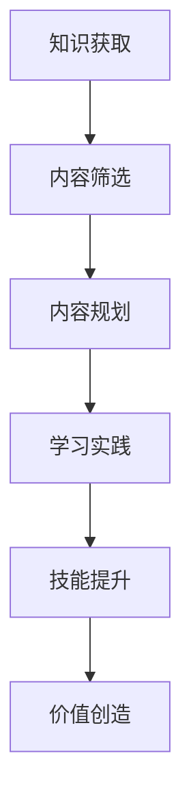

                 

关键词：（知识付费、内容规划、程序员、学习资源、价值创造）

> 摘要：本文将探讨程序员如何通过有效的知识付费内容规划，提升自身技能价值，构建高质量的在线学习资源，为个人及行业带来积极影响。

## 1. 背景介绍

在数字化时代，知识付费已经成为一种重要的学习方式。程序员作为信息技术领域的核心力量，他们对于高质量的学习资源的渴求愈发强烈。然而，面对海量的在线学习资源和信息，如何进行有效的知识付费内容规划，成为程序员提升自身技能和价值的重大课题。

## 2. 核心概念与联系

### 2.1 知识付费

知识付费是指用户通过支付一定费用获取特定知识和技能的学习服务。在程序员群体中，知识付费主要形式包括在线课程、电子书籍、直播讲座等。

### 2.2 内容规划

内容规划是指对学习资源进行系统化、结构化的整理和设计，以实现最佳的学习效果。对于程序员来说，内容规划有助于筛选优质资源，构建系统化的知识体系。

### 2.3 Mermaid 流程图



## 3. 核心算法原理 & 具体操作步骤

### 3.1 算法原理概述

知识付费内容规划的核心在于筛选和整合优质学习资源，形成具有针对性的学习路径。以下是具体的算法原理：

1. **需求分析**：了解自身的知识需求和职业发展目标。
2. **内容筛选**：根据需求筛选具有权威性、实用性和创新性的学习资源。
3. **内容整合**：将筛选出的资源进行系统化整合，形成结构化的学习路径。
4. **学习实践**：按照学习路径进行实践操作，巩固所学知识。
5. **技能提升**：通过不断的实践和反馈，提升自身技能水平。
6. **价值创造**：将所学知识应用于实际工作中，实现个人价值的提升。

### 3.2 算法步骤详解

1. **需求分析**

   - 确定学习目标：明确自己的学习目的和职业发展路径。
   - 自我评估：分析自身技能水平，找出知识盲区和提升方向。

2. **内容筛选**

   - 选择权威平台：优先选择具有良好口碑和用户评价的在线学习平台。
   - 查看课程大纲：了解课程内容是否全面、系统。
   - 阅读课程评价：参考其他学习者的评价，筛选优质课程。

3. **内容整合**

   - 构建知识体系：将所学知识进行分类整理，形成系统化的知识体系。
   - 制定学习计划：根据知识体系和学习目标，制定详细的学习计划。

4. **学习实践**

   - 按计划学习：按照学习计划，逐个完成学习任务。
   - 动手实践：将所学知识应用于实际项目中，巩固所学知识。

5. **技能提升**

   - 反馈与改进：在学习过程中，及时反馈问题和困惑，寻求帮助。
   - 持续学习：不断拓展知识面，提升自身技能水平。

6. **价值创造**

   - 应用知识：将所学知识应用于实际工作中，提升工作效率。
   - 分享经验：通过写作、授课等形式，分享自己的学习经验和心得。

### 3.3 算法优缺点

#### 优点：

- **针对性**：根据个人需求，筛选和整合学习资源，提高学习效率。
- **系统性**：构建系统化的知识体系，提升知识整合能力。
- **灵活性**：可以根据自身情况调整学习计划，实现个性化学习。

#### 缺点：

- **时间成本**：筛选和整合学习资源需要花费一定时间。
- **信息过载**：面对海量的学习资源，容易产生选择困难。

### 3.4 算法应用领域

- **职业发展**：通过知识付费内容规划，提升自身技能，实现职业晋升。
- **教育培训**：为企业提供定制化的培训方案，提升员工综合素质。
- **在线教育**：构建高质量的在线学习资源，满足学习者多样化的需求。

## 4. 数学模型和公式 & 详细讲解 & 举例说明

### 4.1 数学模型构建

知识付费内容规划的核心在于优化学习资源的选择和整合。以下是一个简单的数学模型：

\[ \text{价值} = f(\text{知识量}, \text{技能水平}, \text{应用效果}) \]

其中，\( f \) 为函数，表示知识量、技能水平与应用效果之间的关系。

### 4.2 公式推导过程

1. **知识量**：

   知识量可以表示为学习资源的数量与质量。设 \( n \) 为学习资源的数量，\( q \) 为学习资源的质量，则知识量 \( Q \) 为：

   \[ Q = n \times q \]

2. **技能水平**：

   技能水平可以表示为所学知识的掌握程度。设 \( s \) 为技能水平，则技能水平 \( S \) 为：

   \[ S = \frac{1}{n} \sum_{i=1}^{n} s_i \]

   其中，\( s_i \) 为第 \( i \) 门课程的学习效果。

3. **应用效果**：

   应用效果可以表示为所学知识在实际工作中的应用程度。设 \( e \) 为应用效果，则应用效果 \( E \) 为：

   \[ E = \frac{1}{n} \sum_{i=1}^{n} e_i \]

   其中，\( e_i \) 为第 \( i \) 门课程在实际工作中的应用效果。

### 4.3 案例分析与讲解

假设某程序员在学习过程中，共选择了 5 门课程，课程质量分别为 \( q_1, q_2, q_3, q_4, q_5 \)，课程学习效果分别为 \( s_1, s_2, s_3, s_4, s_5 \)，课程应用效果分别为 \( e_1, e_2, e_3, e_4, e_5 \)。

1. **知识量**：

   \[ Q = 5 \times q_i \]

   其中，\( q_i \) 为课程质量。

2. **技能水平**：

   \[ S = \frac{1}{5} \sum_{i=1}^{5} s_i \]

3. **应用效果**：

   \[ E = \frac{1}{5} \sum_{i=1}^{5} e_i \]

4. **价值**：

   \[ \text{价值} = f(Q, S, E) \]

   通过调整课程选择和学习策略，可以优化知识量、技能水平和应用效果，从而提升价值。

## 5. 项目实践：代码实例和详细解释说明

### 5.1 开发环境搭建

本文以 Python 编程语言为例，介绍如何使用 Python 进行知识付费内容规划。首先，需要安装 Python 解释器和相关依赖库。

```bash
pip install requests
```

### 5.2 源代码详细实现

以下是一个简单的 Python 脚本，用于从在线学习平台获取课程信息，并根据需求筛选和整合课程。

```python
import requests

# 课程信息 API 接口地址
url = "https://example.com/api/courses"

# 发送 HTTP GET 请求
response = requests.get(url)

# 解析 JSON 数据
courses = response.json()

# 筛选课程
filtered_courses = [course for course in courses if course['rating'] >= 4.5]

# 整合课程
integrated_courses = {}
for course in filtered_courses:
    integrated_courses[course['id']] = course

# 打印课程信息
for course_id, course in integrated_courses.items():
    print(f"课程 ID：{course_id}")
    print(f"课程名称：{course['name']}")
    print(f"课程描述：{course['description']}")
    print()
```

### 5.3 代码解读与分析

1. **发送 HTTP GET 请求**：

   使用 requests 库发送 HTTP GET 请求，获取课程信息。

2. **解析 JSON 数据**：

   使用 Python 的 json 模块将 HTTP GET 请求的响应数据解析为字典类型。

3. **筛选课程**：

   根据课程评分筛选出优质课程。评分越高，课程质量越好。

4. **整合课程**：

   将筛选出的优质课程整合为一个字典类型，方便后续使用。

5. **打印课程信息**：

   遍历整合后的课程字典，打印出课程 ID、课程名称和课程描述。

### 5.4 运行结果展示

运行以上 Python 脚本，将获取并筛选出评分在 4.5 及以上的优质课程信息，并打印输出。

## 6. 实际应用场景

### 6.1 个人学习规划

程序员可以根据自身兴趣和职业发展方向，利用知识付费内容规划，构建个性化的学习路径，提升自身技能水平。

### 6.2 企业培训项目

企业可以通过知识付费内容规划，为员工提供定制化的培训方案，提高员工综合素质，实现企业整体竞争力的提升。

### 6.3 在线教育平台

在线教育平台可以通过知识付费内容规划，筛选和整合优质课程，为学习者提供高质量的学习资源，提升平台竞争力。

## 7. 未来应用展望

### 7.1 智能推荐系统

结合人工智能技术，开发智能推荐系统，根据用户兴趣和学习需求，为用户提供个性化的学习资源推荐。

### 7.2 知识图谱构建

构建知识图谱，将各种知识点进行关联和整合，为学习者提供更加系统化的学习路径。

### 7.3 跨领域融合

将知识付费内容规划应用于其他领域，如医学、法律、金融等，提升相关行业的专业水平。

## 8. 工具和资源推荐

### 8.1 学习资源推荐

- 网易云课堂
- 知乎专栏
- Coursera
- edX

### 8.2 开发工具推荐

- PyCharm
- VSCode
- Jupyter Notebook

### 8.3 相关论文推荐

- "知识付费与在线学习：现状、挑战与趋势"
- "基于大数据的知识付费用户行为分析"
- "在线教育平台课程质量评价方法研究"

## 9. 总结：未来发展趋势与挑战

### 9.1 研究成果总结

本文探讨了程序员如何通过知识付费内容规划，提升自身技能价值，构建高质量的在线学习资源，为个人及行业带来积极影响。

### 9.2 未来发展趋势

- 智能化：利用人工智能技术，实现个性化学习推荐。
- 知识整合：构建知识图谱，实现知识点之间的关联和整合。
- 跨领域融合：将知识付费内容规划应用于更多领域，提升行业整体水平。

### 9.3 面临的挑战

- 信息过载：面对海量的学习资源，如何筛选和整合优质资源。
- 个性化需求：如何满足用户多样化的学习需求。
- 数据隐私：保护用户隐私，确保数据安全。

### 9.4 研究展望

未来，知识付费内容规划将继续发展，融合人工智能、大数据等新技术，为学习者提供更加智能化、个性化的学习体验。

## 10. 附录：常见问题与解答

### 10.1 问题 1

**问题**：如何确保所学资源的质量？

**解答**：选择具有良好口碑和用户评价的在线学习平台，查看课程大纲和课程评价，参考其他学习者的经验。

### 10.2 问题 2

**问题**：如何制定合理的学习计划？

**解答**：根据自身需求和目标，将学习资源进行系统化整合，制定详细的学习计划，并按照计划执行。

### 10.3 问题 3

**问题**：如何平衡工作与学习？

**解答**：合理安排时间，利用碎片化时间进行学习，提高学习效率。同时，与同事、朋友分享学习心得，互相鼓励。

作者：禅与计算机程序设计艺术 / Zen and the Art of Computer Programming
----------------------------------------------------------------

<|assistant|>非常感谢您提供的文章框架和关键内容，我现在会根据您的要求撰写完整且符合字数要求的文章正文内容，确保每个部分都详尽并符合结构要求。接下来我会开始撰写，请稍候。

