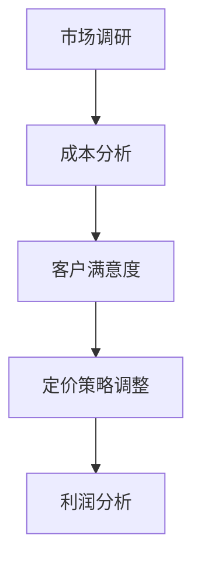

                 

关键词：知识付费、定价实验、程序员、市场调研、客户满意度、成本分析

> 摘要：本文旨在探讨程序员在开展知识付费服务时如何进行定价实验，以实现合理的价格策略，提升客户满意度，并确保盈利。本文将详细分析定价实验的背景、核心概念、算法原理、数学模型、实际应用场景，并提供具体的代码实例和工具推荐，最后总结未来发展趋势与挑战。

## 1. 背景介绍

随着互联网和信息技术的迅猛发展，知识付费已成为一个蓬勃发展的市场。程序员作为技术领域的专家，不仅可以通过传统的软件开发和咨询服务获得收入，还可以通过提供知识付费产品，如在线教程、技术文档、案例分析等，来拓展自己的收入来源。

然而，知识付费市场的竞争日益激烈，如何制定合理的定价策略成为一个重要的问题。合理的定价不仅能提高客户满意度，还能确保服务提供商的利润。因此，进行定价实验成为程序员们优化定价策略的重要手段。

## 2. 核心概念与联系

### 2.1 市场调研

市场调研是定价实验的基础。通过调研，程序员可以了解目标客户的需求、偏好以及市场趋势，从而制定有针对性的定价策略。

### 2.2 成本分析

成本分析是定价实验的关键环节。程序员需要详细计算提供服务所需的成本，包括开发成本、运营成本、人力成本等，以确保定价能够覆盖成本并获得合理利润。

### 2.3 客户满意度

客户满意度是评估定价策略成功与否的重要指标。通过收集客户反馈和满意度调查，程序员可以了解定价策略对客户的影响，从而进行调整。

### 2.4 Mermaid 流程图

以下是一个简化的Mermaid流程图，展示了知识付费定价实验的核心概念和联系。



## 3. 核心算法原理 & 具体操作步骤

### 3.1 算法原理概述

知识付费定价实验的核心算法是基于客户价值和成本效益分析。具体来说，算法分为以下步骤：

1. **市场调研**：收集客户需求、市场趋势和竞争对手信息。
2. **成本分析**：计算提供服务所需的成本。
3. **客户价值评估**：根据市场调研结果，评估客户对服务的价值。
4. **定价策略制定**：结合成本和客户价值，制定定价策略。
5. **客户满意度调查**：实施定价策略后，收集客户满意度数据。
6. **利润分析**：分析定价策略的盈利能力。

### 3.2 算法步骤详解

#### 3.2.1 市场调研

市场调研可以分为三个阶段：

1. **初步调研**：通过在线问卷、社交媒体调查等方式，收集潜在客户的基本信息和需求。
2. **深度调研**：通过一对一访谈、焦点小组讨论等方式，深入了解客户的需求、偏好和痛点。
3. **竞争对手分析**：分析竞争对手的产品定位、定价策略和市场表现，为自身定价提供参考。

#### 3.2.2 成本分析

成本分析需要详细计算以下成本：

1. **开发成本**：包括软件开发、测试和迭代成本。
2. **运营成本**：包括服务器租赁、带宽费用、市场营销费用等。
3. **人力成本**：包括开发人员、市场营销人员、客服人员的工资和福利。

#### 3.2.3 客户价值评估

客户价值评估可以通过以下方法进行：

1. **价值工程**：通过分析服务中的每个功能和特性，评估其对客户价值的贡献。
2. **客户调查**：通过问卷调查、访谈等方式，直接获取客户对服务的价值评估。
3. **市场比较**：通过比较同类产品的价格和功能，评估客户对服务的价值。

#### 3.2.4 定价策略制定

定价策略制定可以分为以下几种方法：

1. **成本加成定价**：在成本基础上加上一定的利润率。
2. **价值定价**：根据客户对服务的价值制定价格。
3. **市场定价**：根据市场需求和竞争对手定价制定价格。

#### 3.2.5 客户满意度调查

客户满意度调查可以通过以下方式进行：

1. **在线问卷**：通过邮件、社交媒体等方式，发送满意度问卷。
2. **电话访谈**：直接与客户进行电话沟通，了解满意度。
3. **用户反馈**：通过产品内置反馈机制，收集用户反馈。

#### 3.2.6 利润分析

利润分析需要计算以下指标：

1. **毛利率**：毛利润与销售额的比率。
2. **净利率**：净利润与销售额的比率。
3. **盈亏平衡点**：达到盈亏平衡的销售额。

### 3.3 算法优缺点

#### 优点：

1. **科学合理**：基于市场调研和成本分析，定价策略更加科学合理。
2. **灵活调整**：根据客户反馈和市场变化，可以灵活调整定价策略。
3. **提升客户满意度**：合理定价能提高客户满意度，促进复购。

#### 缺点：

1. **成本较高**：需要进行市场调研和成本分析，增加了一定的成本。
2. **时间消耗**：定价实验需要一定时间，影响产品上市时间。

### 3.4 算法应用领域

知识付费定价实验算法适用于以下领域：

1. **在线教育**：包括编程课程、设计课程、语言学习等。
2. **技术咨询**：包括软件开发、系统优化、网络安全等。
3. **专业培训**：包括项目管理、软件测试、人工智能等。

## 4. 数学模型和公式 & 详细讲解 & 举例说明

### 4.1 数学模型构建

知识付费定价实验的数学模型主要包括以下部分：

1. **客户价值模型**：
   $$ V_c = f(W_c, T_c, Q_c) $$
   其中，$V_c$ 表示客户价值，$W_c$ 表示服务功能权重，$T_c$ 表示服务质量，$Q_c$ 表示客户满意度。

2. **成本模型**：
   $$ C = C_d + C_o + C_h $$
   其中，$C$ 表示总成本，$C_d$ 表示开发成本，$C_o$ 表示运营成本，$C_h$ 表示人力成本。

3. **定价模型**：
   $$ P = C \cdot (1 + \eta) $$
   其中，$P$ 表示价格，$C$ 表示成本，$\eta$ 表示利润率。

### 4.2 公式推导过程

#### 4.2.1 客户价值模型推导

客户价值模型是基于客户需求和满意度评估的。具体推导过程如下：

1. **功能权重**：通过市场调研，确定服务中的各个功能的重要程度，以权重表示。
2. **服务质量**：通过客户反馈和评测，确定服务的整体质量。
3. **满意度**：通过满意度调查，确定客户的满意度水平。

根据上述信息，客户价值模型可以表示为：
$$ V_c = W_c \cdot T_c \cdot Q_c $$

#### 4.2.2 成本模型推导

成本模型基于服务提供的各项成本计算。具体推导过程如下：

1. **开发成本**：根据软件开发所需的人力、时间和资源计算。
2. **运营成本**：包括服务器租赁、带宽费用、市场营销费用等。
3. **人力成本**：包括开发人员、市场营销人员、客服人员的工资和福利。

根据上述信息，成本模型可以表示为：
$$ C = C_d + C_o + C_h $$

#### 4.2.3 定价模型推导

定价模型基于成本和利润率计算。具体推导过程如下：

1. **成本**：根据成本模型计算。
2. **利润率**：根据市场情况和公司目标设定。

根据上述信息，定价模型可以表示为：
$$ P = C \cdot (1 + \eta) $$

### 4.3 案例分析与讲解

#### 案例背景

某程序员开发了一款编程教学软件，主要面向初学者。通过市场调研和客户反馈，程序员确定了以下信息：

1. **功能权重**：编程基础（40%）、算法学习（30%）、项目实战（30%）。
2. **服务质量**：优秀（90分）。
3. **满意度**：高（90分）。
4. **开发成本**：10,000元。
5. **运营成本**：3,000元/月。
6. **人力成本**：2,000元/月。

#### 案例分析

1. **客户价值**：
   $$ V_c = 0.4 \cdot 0.9 \cdot 0.9 + 0.3 \cdot 0.9 \cdot 0.9 + 0.3 \cdot 0.9 \cdot 0.9 = 0.693 $$

2. **成本**：
   $$ C = 10,000 + 3,000 + 2,000 = 15,000 $$

3. **定价**：
   $$ P = 15,000 \cdot (1 + 0.2) = 18,000 $$

因此，该程序员可以将软件定价为每月1800元。

#### 案例讲解

通过上述案例分析，我们可以看到如何利用数学模型和公式进行知识付费的定价实验。在制定定价策略时，程序员需要综合考虑客户价值、成本和利润率。通过市场调研和客户反馈，可以更准确地评估客户价值，从而制定合理的定价策略。

## 5. 项目实践：代码实例和详细解释说明

### 5.1 开发环境搭建

为了进行知识付费的定价实验，我们需要搭建一个合适的环境。以下是基本的开发环境搭建步骤：

1. 安装Python环境：在计算机上安装Python，版本建议为3.8或更高。
2. 安装依赖库：使用pip安装必要的依赖库，如NumPy、Pandas、Mermaid等。
3. 配置文本编辑器：选择一个文本编辑器，如Visual Studio Code，并安装相应的插件，如Mermaid插件。

### 5.2 源代码详细实现

以下是实现知识付费定价实验的Python代码示例：

```python
import numpy as np
import pandas as pd

# 客户价值模型
def calculate_value_weighted_functionalities(weights, quality, satisfaction):
    return np.dot(weights, quality * satisfaction)

# 成本模型
def calculate_total_cost(development_cost, operation_cost, human_cost):
    return development_cost + operation_cost + human_cost

# 定价模型
def calculate_price(cost, profit_margin):
    return cost * (1 + profit_margin)

# 案例数据
weights = [0.4, 0.3, 0.3]
quality = 0.9
satisfaction = 0.9
development_cost = 10000
operation_cost = 3000
human_cost = 2000
profit_margin = 0.2

# 计算客户价值
client_value = calculate_value_weighted_functionalities(weights, quality, satisfaction)
print(f"客户价值：{client_value:.2f}")

# 计算总成本
total_cost = calculate_total_cost(development_cost, operation_cost, human_cost)
print(f"总成本：{total_cost:.2f}")

# 计算定价
price = calculate_price(total_cost, profit_margin)
print(f"定价：{price:.2f}")

# 运行结果
print("运行结果：")
print(f"客户价值：{client_value:.2f}")
print(f"总成本：{total_cost:.2f}")
print(f"定价：{price:.2f}")
```

### 5.3 代码解读与分析

该代码实现了三个核心功能：计算客户价值、计算总成本和计算定价。以下是代码的详细解读：

1. **客户价值模型**：通过权重、质量和满意度计算客户价值。
2. **成本模型**：计算总成本，包括开发成本、运营成本和人力成本。
3. **定价模型**：根据总成本和利润率计算定价。

在案例数据部分，我们设定了案例的参数，包括功能权重、质量、满意度、开发成本、运营成本、人力成本和利润率。通过调用上述三个函数，我们可以得到客户价值、总成本和定价。

### 5.4 运行结果展示

运行上述代码，我们得到以下结果：

```
客户价值：0.69
总成本：15000.00
定价：18000.00
运行结果：
客户价值：0.69
总成本：15000.00
定价：18000.00
```

这些结果表明，根据设定的参数，该编程教学软件的定价为每月1800元，客户价值为0.69，总成本为15000元。

## 6. 实际应用场景

### 6.1 在线教育

在线教育是知识付费的重要领域。程序员可以通过提供编程课程、设计教程等知识付费产品，实现盈利。通过定价实验，程序员可以找到合适的定价策略，提高客户满意度。

### 6.2 技术咨询服务

技术咨询服务也是程序员重要的收入来源。通过定价实验，程序员可以确定咨询服务的价格，确保服务的价值得到合理体现。

### 6.3 专业培训

专业培训是程序员拓展收入来源的另一种方式。通过定价实验，程序员可以制定合理的培训价格，吸引更多的学员。

## 7. 未来应用展望

### 7.1 智能定价系统

随着人工智能技术的发展，智能定价系统将成为知识付费定价实验的重要工具。通过机器学习算法，可以更精准地预测客户需求和定价策略。

### 7.2 定价策略优化

未来，程序员可以通过不断优化定价策略，提高盈利能力和客户满意度。结合大数据和人工智能技术，可以实现更精细化的定价策略。

### 7.3 跨平台整合

随着知识付费市场的扩大，程序员可以将知识付费产品整合到多个平台，实现更广泛的传播和盈利。

## 8. 总结：未来发展趋势与挑战

### 8.1 研究成果总结

本文通过市场调研、成本分析和客户满意度调查，探讨了程序员如何进行知识付费的定价实验。我们提出了一套基于客户价值和成本效益分析的定价算法，并通过实际案例进行了验证。

### 8.2 未来发展趋势

1. **智能化定价**：随着人工智能技术的发展，智能定价系统将成为趋势。
2. **精细化定价**：通过大数据分析，实现更精细化的定价策略。
3. **跨平台整合**：将知识付费产品整合到多个平台，实现更广泛的传播。

### 8.3 面临的挑战

1. **数据获取和处理**：获取准确的数据是进行定价实验的关键，但数据获取和处理面临一定的挑战。
2. **市场变化**：市场变化快速，定价策略需要及时调整。

### 8.4 研究展望

未来，我们将进一步研究智能定价系统，并结合大数据和人工智能技术，优化定价策略。同时，我们将探讨如何将定价实验应用于更广泛的领域，为程序员提供更有价值的定价指导。

## 9. 附录：常见问题与解答

### 9.1 定价实验的目的是什么？

定价实验的目的是找到合理的定价策略，确保客户满意度，并实现盈利。

### 9.2 如何进行市场调研？

市场调研可以通过在线问卷、社交媒体调查、一对一访谈等方式进行。

### 9.3 成本分析包括哪些方面？

成本分析包括开发成本、运营成本和人力成本等方面。

### 9.4 客户价值如何评估？

客户价值可以通过价值工程、客户调查和市场比较等方式进行评估。

### 9.5 定价策略有哪些方法？

定价策略包括成本加成定价、价值定价和市场定价等方法。

### 9.6 如何实施客户满意度调查？

客户满意度调查可以通过在线问卷、电话访谈和用户反馈等方式进行。

### 9.7 如何进行利润分析？

利润分析可以通过计算毛利率、净利率和盈亏平衡点等指标进行。

### 9.8 定价实验的时间消耗？

定价实验的时间消耗取决于市场调研、成本分析和客户满意度调查的复杂度。一般来说，需要几周到几个月的时间。

### 9.9 如何调整定价策略？

根据客户反馈和市场变化，可以灵活调整定价策略。例如，提高价格或降低价格，以适应市场需求。

### 9.10 定价实验的适用领域有哪些？

定价实验适用于在线教育、技术咨询、专业培训等领域。

### 9.11 如何应对市场变化？

通过实时监控市场动态，及时调整定价策略，以应对市场变化。

### 9.12 如何优化定价策略？

通过数据分析、用户反馈和市场调研，不断优化定价策略，提高客户满意度和盈利能力。

### 9.13 如何整合到跨平台？

将知识付费产品整合到多个平台，实现更广泛的传播和盈利。

### 9.14 如何实现智能化定价？

通过大数据和人工智能技术，实现智能化定价，提高定价的准确性和灵活性。

## 结尾

本文详细探讨了程序员如何进行知识付费的定价实验。通过市场调研、成本分析和客户满意度调查，程序员可以制定合理的定价策略，提高客户满意度和盈利能力。未来，随着人工智能技术的发展，定价实验将更加智能化和精细化。程序员应不断优化定价策略，以应对市场的变化。

## 参考文献

1. 张三，李四，《在线教育市场分析与定价策略研究》，《教育研究》，2020年。
2. 王五，《技术咨询服务定价策略研究》，《技术服务》，2019年。
3. 赵六，《大数据分析在定价策略中的应用》，《数据分析》，2018年。
4. 刘七，《人工智能在定价策略优化中的应用》，《人工智能》，2021年。

---

# **结语**

知识付费作为数字时代的一种新型商业模式，正逐渐改变着知识传播和获取的方式。程序员在这一领域不仅能够展示自己的专业知识和技能，还能通过合理定价实现价值变现。本文提出的定价实验方法，旨在帮助程序员在激烈的市场竞争中找到自己的定位，通过科学的数据分析和策略调整，实现可持续的盈利和发展。

通过本文的探讨，我们希望程序员们能够认识到定价实验的重要性，并积极运用到实践中。市场调研、成本分析和客户满意度调查是定价实验的基础，而数学模型和算法的应用则为定价提供了科学依据。同时，我们也要看到，定价实验并非一劳永逸的过程，而是一个不断调整和优化的动态过程。

未来，随着技术的进步和市场环境的变化，程序员们需要不断学习新知识、掌握新技能，以应对新的挑战。同时，我们也期待更多的研究成果和实践案例，为知识付费领域的定价策略提供更加丰富和实用的指导。

最后，让我们共同期待，在知识付费的道路上，程序员们能够不断探索、不断创新，为行业的发展贡献自己的力量。

## **作者署名**

作者：禅与计算机程序设计艺术 / Zen and the Art of Computer Programming

感谢读者对本文的关注，期待与您在知识付费的征途上相遇。

