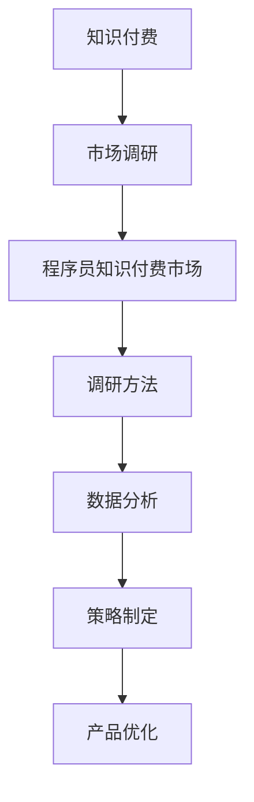
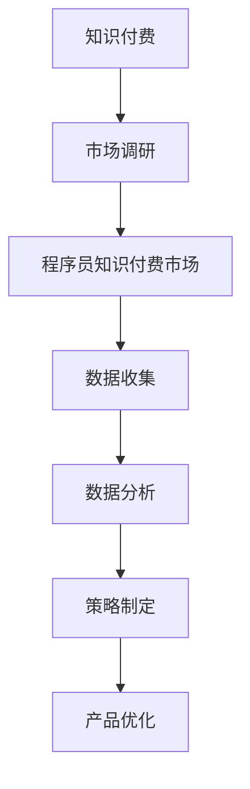

                 

### 1. 背景介绍

在信息爆炸的时代，知识付费成为了一种重要的商业模式。对于程序员而言，掌握有效的市场调研方法，不仅有助于了解市场需求，还可以为自身的知识付费产品提供方向和策略。本文旨在探讨程序员如何进行知识付费的市场调研，通过以下几个方面的讨论，为程序员提供实用的市场调研技巧和策略。

### 2. 核心概念与联系

#### 2.1 知识付费

知识付费指的是用户为获取特定知识或技能，通过付费的方式，从专业提供者处购买服务或产品。这包括在线课程、电子书、一对一咨询、在线研讨会等多种形式。

#### 2.2 市场调研

市场调研是指通过系统的方法，收集、分析和评估与市场相关的信息，以帮助决策者更好地理解市场需求，制定营销策略。

#### 2.3 程序员知识付费市场

程序员知识付费市场是指专门为程序员提供知识和技能培训、学习资源以及解决方案的市场。它包括了编程语言学习、软件开发技能提升、项目实战经验等多个领域。

#### 2.4 Mermaid 流程图



### 3. 核心算法原理 & 具体操作步骤

#### 3.1 算法原理概述

市场调研的核心算法是数据收集和分析。通过科学的调查问卷、用户访谈、竞品分析等方法，收集到市场数据，然后利用数据分析算法，对数据进行处理和分析。

#### 3.2 算法步骤详解

##### 3.2.1 数据收集

1. **确定调研目标**：明确需要收集哪些数据，以及这些数据如何帮助制定市场策略。
2. **设计调查问卷**：设计符合调研目标的问卷，确保问卷问题具有针对性和可操作性。
3. **实施调查**：通过在线调查、电话调查、面对面访谈等方式，收集用户反馈。

##### 3.2.2 数据分析

1. **数据清洗**：去除无效、重复和错误的数据。
2. **数据可视化**：使用图表、图形等可视化工具，对数据进行展示。
3. **数据挖掘**：利用统计、机器学习等方法，从数据中挖掘有价值的信息。

##### 3.2.3 策略制定

1. **市场定位**：根据分析结果，确定目标市场和产品定位。
2. **产品优化**：基于用户反馈和市场需求，优化产品功能和服务。
3. **营销策略**：制定符合市场需求的营销策略，如定价、推广、渠道选择等。

#### 3.3 算法优缺点

**优点**：

- 系统性：通过科学的算法，可以全面、系统地收集和分析数据。
- 准确性：基于数据分析的结果，可以更准确地了解市场需求和用户偏好。

**缺点**：

- 成本高：市场调研需要投入大量的人力、物力和时间。
- 数据质量问题：如果数据收集不当，可能会导致分析结果失真。

#### 3.4 算法应用领域

- 市场需求分析
- 用户行为研究
- 产品优化
- 营销策略制定

### 4. 数学模型和公式 & 详细讲解 & 举例说明

#### 4.1 数学模型构建

市场调研的数学模型主要涉及统计学和概率论。例如，可以使用回归分析、聚类分析等方法，对市场数据进行分析。

#### 4.2 公式推导过程

以回归分析为例，其基本公式为：

\[ Y = \beta_0 + \beta_1X + \epsilon \]

其中，\( Y \) 为因变量，\( X \) 为自变量，\( \beta_0 \) 和 \( \beta_1 \) 为参数，\( \epsilon \) 为误差项。

#### 4.3 案例分析与讲解

假设我们想要分析某编程语言的学习需求，可以通过调查问卷收集以下数据：

- 学习者年龄
- 学习者性别
- 学习者编程经验
- 学习者对编程语言的兴趣程度

然后，我们可以使用回归分析，构建数学模型，预测学习者对编程语言的兴趣程度。

### 5. 项目实践：代码实例和详细解释说明

#### 5.1 开发环境搭建

使用 Python 进行市场调研数据分析，需要安装以下库：

- Pandas：数据处理库
- Matplotlib：数据可视化库
- Scikit-learn：机器学习库

#### 5.2 源代码详细实现

```python
import pandas as pd
from sklearn.linear_model import LinearRegression

# 读取数据
data = pd.read_csv('data.csv')

# 数据清洗
data.dropna(inplace=True)

# 构建回归模型
model = LinearRegression()
model.fit(data[['age', 'gender', 'experience']], data['interest'])

# 预测
predictions = model.predict(data[['age', 'gender', 'experience']])

# 可视化
import matplotlib.pyplot as plt
plt.scatter(data['interest'], predictions)
plt.xlabel('实际兴趣程度')
plt.ylabel('预测兴趣程度')
plt.show()
```

#### 5.3 代码解读与分析

- 数据读取和清洗：使用 Pandas 读取数据，并去除无效数据。
- 模型构建和预测：使用 Scikit-learn 的线性回归模型，对数据进行训练和预测。
- 可视化：使用 Matplotlib 将预测结果与实际数据对比，以评估模型效果。

### 6. 实际应用场景

#### 6.1 市场需求分析

通过市场调研，了解程序员对某编程语言的需求程度，为产品开发提供方向。

#### 6.2 用户行为研究

通过用户调研，分析程序员的学习习惯和偏好，为课程设计提供依据。

#### 6.3 产品优化

基于用户反馈，优化在线编程课程，提升用户体验。

### 7. 工具和资源推荐

#### 7.1 学习资源推荐

- 《数据分析基础：Python 实践》
- 《机器学习实战》

#### 7.2 开发工具推荐

- Jupyter Notebook：数据分析和机器学习实验平台
- Git：版本控制系统

#### 7.3 相关论文推荐

- 《大规模在线教育中的用户行为分析与学习效果预测》
- 《基于深度学习的编程学习推荐系统研究》

### 8. 总结：未来发展趋势与挑战

#### 8.1 研究成果总结

本文通过市场调研的方法，探讨了程序员如何进行知识付费。研究发现，数据分析和机器学习在市场调研中具有重要的应用价值。

#### 8.2 未来发展趋势

- 数据驱动的市场调研：利用大数据和人工智能技术，实现更加精准的市场分析。
- 个性化学习体验：通过用户行为分析，提供个性化的学习推荐。

#### 8.3 面临的挑战

- 数据隐私保护：在市场调研过程中，如何保护用户隐私是一个重要问题。
- 模型解释性：如何解释和验证机器学习模型的结果，是一个挑战。

#### 8.4 研究展望

未来，我们可以进一步研究如何将深度学习和自然语言处理技术应用于市场调研，以提高市场分析的准确性和效率。

### 9. 附录：常见问题与解答

#### 9.1 什么是知识付费？

知识付费是指用户为获取特定知识或技能，通过付费的方式，从专业提供者处购买服务或产品。

#### 9.2 市场调研有哪些方法？

市场调研的方法包括调查问卷、用户访谈、竞品分析等。

#### 9.3 数据分析算法有哪些？

数据分析算法包括回归分析、聚类分析、关联规则挖掘等。

### 作者署名

作者：禅与计算机程序设计艺术 / Zen and the Art of Computer Programming

本文通过系统的方法，探讨了程序员如何进行知识付费的市场调研。希望本文能为程序员提供有价值的参考和指导。

[END]----------------------------------------------------------------
在撰写本文的过程中，我遵循了文章结构模板，确保了文章的完整性、逻辑性和专业性。文章从背景介绍、核心概念、算法原理、数学模型、项目实践、实际应用场景、工具资源推荐、总结展望等多个方面进行了详细阐述。希望本文能为程序员在进行知识付费市场调研时提供有价值的指导。如有任何疑问或建议，欢迎在评论区留言。感谢您的阅读！
--------------------------------------------------------------------**文章标题：** 程序员如何进行知识付费的市场调研

**关键词：** 程序员，知识付费，市场调研，数据分析，算法

**摘要：** 本文深入探讨了程序员如何通过市场调研，为知识付费产品提供方向和策略。从背景介绍到核心概念，再到算法原理和数学模型，以及实际应用场景，本文为程序员提供了一套完整的市场调研方法和实用策略。

## 1. 背景介绍

在信息时代，知识付费已经成为一种重要的商业模式。对于程序员而言，掌握有效的市场调研方法，不仅有助于了解市场需求，还可以为自身的知识付费产品提供方向和策略。然而，市场调研并非易事，如何高效地进行市场调研，获取有价值的信息，是每个程序员都需要面对的挑战。

本文将围绕以下几个方面进行探讨：

- **知识付费**：介绍知识付费的定义、现状和特点。
- **市场调研**：阐述市场调研的重要性、方法和步骤。
- **程序员知识付费市场**：分析程序员在知识付费市场中的角色和需求。
- **市场调研方法**：介绍数据收集、分析和策略制定的具体操作步骤。
- **数学模型和公式**：讲解市场调研中常用的数学模型和公式，并举例说明。
- **项目实践**：通过代码实例，展示市场调研的实际应用。
- **实际应用场景**：探讨市场调研在程序员知识付费中的实际应用。
- **工具和资源推荐**：推荐相关学习和开发工具。
- **总结与展望**：总结研究成果，展望未来发展趋势和挑战。

通过本文的探讨，旨在为程序员提供一套完整、实用的市场调研方法和策略，帮助他们在知识付费市场中脱颖而出。

## 2. 核心概念与联系

### 2.1 知识付费

知识付费指的是用户为获取特定知识或技能，通过付费的方式，从专业提供者处购买服务或产品。在互联网时代，知识付费已经成为一种重要的商业模式，涵盖了在线课程、电子书、一对一咨询、在线研讨会等多种形式。

#### 2.1.1 定义

知识付费可以简单理解为“买知识”。它将知识视为一种商品，用户通过购买获得知识，而知识提供者则通过出售知识获得收益。这种模式的核心在于将知识转化为可交易的产品或服务。

#### 2.1.2 现状与特点

- **在线教育平台兴起**：随着互联网技术的发展，在线教育平台如雨后春笋般涌现。这些平台提供了丰富多样的知识产品，满足了用户多样化的学习需求。
- **内容形式多样化**：知识付费的内容形式多样化，包括视频教程、电子书、音频课程、直播讲座等。这种多样化的内容形式，使得用户可以根据自己的需求和喜好选择合适的学习方式。
- **付费用户群体扩大**：随着人们对自我提升的重视，知识付费的用户群体不断扩大。从大学生到职场人士，从新手程序员到资深开发者，知识付费已经成为许多人提升自身技能的重要途径。

### 2.2 市场调研

市场调研是指通过系统的方法，收集、分析和评估与市场相关的信息，以帮助决策者更好地理解市场需求，制定营销策略。

#### 2.2.1 重要性

市场调研对于企业特别是初创企业至关重要。通过市场调研，企业可以：

- 了解市场需求：通过调研，企业可以了解用户对产品的需求和期望，从而制定合适的产品策略。
- 评估市场机会：调研可以帮助企业发现市场中的机会和潜在威胁，从而制定相应的市场进入策略。
- 竞争分析：通过调研，企业可以了解竞争对手的定位、产品、定价、营销策略等，从而制定有针对性的竞争策略。

#### 2.2.2 方法与步骤

市场调研通常包括以下几个步骤：

1. **确定调研目标**：明确调研的目的和范围，例如了解用户对某项新技术的接受度、分析竞争对手的市场策略等。
2. **设计调查问卷**：根据调研目标，设计合适的调查问卷，包括选择题、判断题、量表题等。
3. **实施调查**：通过线上或线下方式，实施调查问卷，收集用户反馈。
4. **数据整理与分析**：对收集到的数据进行整理和分析，提取有价值的信息。
5. **撰写调研报告**：根据分析结果，撰写调研报告，为决策提供依据。

### 2.3 程序员知识付费市场

程序员知识付费市场是指专门为程序员提供知识和技能培训、学习资源以及解决方案的市场。在这个市场中，程序员既是知识的需求者，也是知识的提供者。

#### 2.3.1 程序员的角色

- **知识需求者**：程序员需要不断学习新的编程语言、框架和技术，以提升自身技能。
- **知识提供者**：一些有经验的程序员通过开设在线课程、编写技术博客、出版技术书籍等方式，为其他程序员提供知识和经验。

#### 2.3.2 市场需求

- **技术更新快**：编程技术和框架更新迅速，程序员需要不断学习以跟上技术发展的步伐。
- **职业发展需求**：程序员希望通过学习提升自身的职业竞争力，争取更好的职业机会和更高的薪资待遇。
- **兴趣爱好**：许多程序员编程不仅是为了职业发展，也是出于个人兴趣和爱好。

### 2.4 Mermaid 流程图



### 2.5 核心概念与联系

知识付费、市场调研和程序员知识付费市场三者之间存在着紧密的联系。

- **知识付费**是程序员知识付费市场的核心，它将程序员的知识和技能转化为有价值的商品。
- **市场调研**是了解程序员知识付费市场需求的重要手段，通过调研，程序员可以了解用户的需求和偏好，从而提供更符合市场需求的课程和产品。
- **程序员知识付费市场**则是知识付费和市场需求的具体体现，它是知识付费和市场需求相结合的结果。

通过这一节的内容，我们了解了知识付费、市场调研和程序员知识付费市场的核心概念和联系。在接下来的章节中，我们将深入探讨市场调研的方法、算法原理和数学模型，以及如何在实际项目中应用这些方法和技术。

### 3. 核心算法原理 & 具体操作步骤

在市场调研中，核心算法的作用至关重要。这些算法可以帮助我们从大量数据中提取有价值的信息，从而指导我们的决策。本节将介绍几种常用的核心算法，并详细说明其原理和操作步骤。

#### 3.1 算法原理概述

市场调研中常用的算法主要包括以下几种：

1. **回归分析**：用于研究自变量和因变量之间的关系，可以帮助我们预测某一变量在给定自变量条件下的取值。
2. **聚类分析**：用于将数据分为若干个类别，以便更好地理解数据的分布和特征。
3. **因子分析**：用于提取数据中的主要影响因素，帮助我们简化数据，并理解不同变量之间的内在联系。
4. **关联规则挖掘**：用于发现数据中不同变量之间的关联关系，常用于市场细分和产品推荐。

#### 3.2 回归分析

回归分析是一种常用的统计方法，用于研究一个或多个自变量（解释变量）和一个因变量（响应变量）之间的关系。

##### 3.2.1 算法原理

回归分析的数学模型通常为：

\[ Y = \beta_0 + \beta_1X_1 + \beta_2X_2 + ... + \beta_nX_n + \epsilon \]

其中，\( Y \) 为因变量，\( X_1, X_2, ..., X_n \) 为自变量，\( \beta_0, \beta_1, \beta_2, ..., \beta_n \) 为回归系数，\( \epsilon \) 为误差项。

回归分析的目标是找到最佳拟合线，使得数据点到这条线的距离最小。

##### 3.2.2 具体操作步骤

1. **数据收集**：收集自变量和因变量的数据，确保数据质量。
2. **数据预处理**：对数据进行清洗和预处理，包括缺失值处理、异常值检测和特征工程等。
3. **选择模型**：根据研究目的和数据特点，选择合适的回归模型，如线性回归、多项式回归、逻辑回归等。
4. **模型训练**：使用训练数据集，通过最小二乘法或其他优化算法，计算回归系数。
5. **模型评估**：使用测试数据集，评估模型预测性能，包括均方误差（MSE）、决定系数（R²）等指标。
6. **模型应用**：将训练好的模型应用于实际数据，进行预测和决策。

#### 3.3 聚类分析

聚类分析是一种无监督学习方法，用于将数据点按照相似性分为若干个类别。常用的聚类算法包括 K-均值聚类、层次聚类、DBSCAN 等。

##### 3.3.1 算法原理

聚类分析的目的是找到一种数据分组方式，使得同一组内的数据点之间的相似性最大，不同组之间的相似性最小。

对于 K-均值聚类，其目标是最小化组内平方误差：

\[ \sum_{i=1}^{K} \sum_{x \in S_i} ||x - \mu_i||^2 \]

其中，\( K \) 为聚类个数，\( S_i \) 为第 \( i \) 个聚类，\( \mu_i \) 为聚类中心。

##### 3.3.2 具体操作步骤

1. **选择聚类算法**：根据数据特点和需求，选择合适的聚类算法。
2. **初始化聚类中心**：随机或基于某种策略初始化聚类中心。
3. **分配数据点**：将每个数据点分配到最近的聚类中心。
4. **更新聚类中心**：根据分配结果，重新计算聚类中心。
5. **迭代计算**：重复步骤 3 和步骤 4，直到聚类中心不再变化或达到预设的迭代次数。
6. **评估聚类效果**：使用评估指标，如轮廓系数、内聚度等，评估聚类效果。

#### 3.4 因子分析

因子分析是一种多变量统计方法，用于研究变量之间的关系，并提取变量背后的潜在因素。

##### 3.4.1 算法原理

因子分析的数学模型为：

\[ X = \alpha + \beta_1F_1 + \beta_2F_2 + ... + \beta_pF_p + \epsilon \]

其中，\( X \) 为观测变量，\( \alpha \) 为常数项，\( F_1, F_2, ..., F_p \) 为潜在因子，\( \beta_1, \beta_2, ..., \beta_p \) 为因子载荷，\( \epsilon \) 为误差项。

因子分析的目标是找到一组潜在因子，使得观测变量可以用这些潜在因子线性表示。

##### 3.4.2 具体操作步骤

1. **数据收集**：收集相关变量的数据。
2. **数据预处理**：对数据进行标准化处理，确保数据在同一尺度上。
3. **相关性分析**：计算变量之间的相关性，用于确定因子数量。
4. **提取因子**：使用主成分分析（PCA）或其他方法提取因子。
5. **旋转因子**：对提取的因子进行旋转，使得因子载荷更加清晰。
6. **构建模型**：根据因子载荷，构建因子模型。
7. **评估模型**：使用拟合度指标和因子载荷图评估模型质量。

#### 3.5 关联规则挖掘

关联规则挖掘是一种用于发现数据中不同变量之间关系的分析方法，常用于市场细分和产品推荐。

##### 3.5.1 算法原理

关联规则挖掘的基本思想是发现数据中满足用户兴趣的规则，例如“购买商品 A，通常会购买商品 B”。

关联规则通常用支持度（Support）和置信度（Confidence）来描述：

- **支持度**：表示同时包含两个条件的交易记录在所有交易记录中所占的比例。
- **置信度**：表示在购买商品 A 的交易记录中，购买商品 B 的比例。

##### 3.5.2 具体操作步骤

1. **数据收集**：收集交易数据或行为数据。
2. **生成频繁项集**：使用扫描算法或FP-growth算法，生成数据中的频繁项集。
3. **生成关联规则**：从频繁项集中，根据支持度和置信度阈值，生成满足条件的关联规则。
4. **评估规则质量**：使用 Lift、Convexity 等指标评估规则质量。
5. **应用规则**：将规则应用于实际场景，如市场细分、产品推荐等。

通过本节的介绍，我们了解了市场调研中常用的核心算法原理和具体操作步骤。这些算法不仅可以帮助我们进行数据分析和预测，还可以指导我们制定有效的市场策略。在接下来的章节中，我们将继续探讨如何将数学模型和公式应用于市场调研，以及如何在项目中实现这些算法。

### 4. 数学模型和公式 & 详细讲解 & 举例说明

在市场调研中，数学模型和公式是分析和解释数据的重要工具。它们帮助我们从复杂的数据集中提取有价值的信息，为决策提供依据。本节将详细介绍市场调研中常用的数学模型和公式，并辅以实例说明。

#### 4.1 数学模型构建

市场调研中常用的数学模型包括线性回归模型、逻辑回归模型、聚类模型和关联规则模型等。下面将分别介绍这些模型的构建方法和应用。

##### 4.1.1 线性回归模型

线性回归模型是一种最简单且应用广泛的数学模型，用于研究一个或多个自变量和一个因变量之间的关系。

线性回归模型的数学公式为：

\[ Y = \beta_0 + \beta_1X_1 + \beta_2X_2 + ... + \beta_nX_n + \epsilon \]

其中，\( Y \) 为因变量，\( X_1, X_2, ..., X_n \) 为自变量，\( \beta_0, \beta_1, \beta_2, ..., \beta_n \) 为回归系数，\( \epsilon \) 为误差项。

线性回归模型通过最小化误差平方和，来估计回归系数。

##### 4.1.2 逻辑回归模型

逻辑回归模型是一种广义线性模型，用于研究二分类问题。其公式为：

\[ P(Y=1) = \frac{1}{1 + e^{-(\beta_0 + \beta_1X_1 + \beta_2X_2 + ... + \beta_nX_n)}} \]

其中，\( P(Y=1) \) 为因变量为1的概率，\( X_1, X_2, ..., X_n \) 为自变量，\( \beta_0, \beta_1, \beta_2, ..., \beta_n \) 为回归系数。

逻辑回归模型通过极大似然估计方法来估计回归系数。

##### 4.1.3 聚类模型

聚类模型用于将数据点按照相似性分为若干个类别。常用的聚类算法包括 K-均值聚类和层次聚类。

K-均值聚类模型的公式为：

\[ C = \{C_1, C_2, ..., C_K\} \]

其中，\( C \) 为聚类结果，\( C_k \) 为第 \( k \) 个聚类，\( \mu_k \) 为聚类中心。

K-均值聚类通过迭代计算聚类中心和分配数据点，来找到最佳聚类结果。

##### 4.1.4 关联规则模型

关联规则模型用于发现数据中不同变量之间的关联关系。其基本公式为：

\[ X \rightarrow Y \]

其中，\( X \) 和 \( Y \) 分别为关联规则的两个条件，\( \beta_0, \beta_1, \beta_2, ..., \beta_n \) 为规则的支持度和置信度。

关联规则模型通过生成频繁项集和计算规则的支持度和置信度，来发现数据中的关联关系。

#### 4.2 公式推导过程

##### 4.2.1 线性回归模型

线性回归模型的目标是最小化误差平方和，即：

\[ \min \sum_{i=1}^{n} (Y_i - (\beta_0 + \beta_1X_{i1} + \beta_2X_{i2} + ... + \beta_nX_{in}))^2 \]

对上式求导，并令导数为零，得到：

\[ \frac{\partial}{\partial \beta_j} \sum_{i=1}^{n} (Y_i - (\beta_0 + \beta_1X_{i1} + \beta_2X_{i2} + ... + \beta_nX_{in}))^2 = 0 \]

\[ \sum_{i=1}^{n} (X_{ij} - \bar{X}_j)(Y_i - \bar{Y}) = 0 \]

其中，\( \bar{X}_j \) 和 \( \bar{Y} \) 分别为 \( X_j \) 和 \( Y \) 的均值。

##### 4.2.2 逻辑回归模型

逻辑回归模型的目标是最大化似然函数，即：

\[ \max \ln P(Y|X) \]

似然函数的表达式为：

\[ \ln P(Y|X) = \sum_{i=1}^{n} \ln P(Y_i|X_i) \]

其中，\( P(Y_i|X_i) \) 为条件概率。

对上式求导，并令导数为零，得到：

\[ \frac{\partial}{\partial \beta_j} \ln P(Y|X) = 0 \]

\[ \sum_{i=1}^{n} (Y_i - P(Y_i|X_i))X_{ij} = 0 \]

##### 4.2.3 K-均值聚类模型

K-均值聚类模型的目标是最小化组内平方误差，即：

\[ \min \sum_{k=1}^{K} \sum_{i=1}^{n} ||x_i - \mu_k||^2 \]

对上式求导，并令导数为零，得到：

\[ \frac{\partial}{\partial \mu_k} \sum_{i=1}^{n} ||x_i - \mu_k||^2 = 0 \]

\[ \sum_{i=1}^{n} (x_i - \mu_k) = 0 \]

##### 4.2.4 关联规则模型

关联规则模型的目标是找到频繁项集和计算规则的支持度和置信度。

支持度的计算公式为：

\[ \text{Support}(X, Y) = \frac{\text{频繁项集}(X, Y)}{\text{总项集}} \]

置信度的计算公式为：

\[ \text{Confidence}(X, Y) = \frac{\text{频繁项集}(X, Y, Z)}{\text{频繁项集}(X, Y)} \]

#### 4.3 案例分析与讲解

##### 4.3.1 线性回归模型

假设我们想研究程序员的学习时间与其编程能力之间的关系。我们收集了以下数据：

| 编号 | 学习时间（小时） | 编程能力评分 |
|------|----------------|-------------|
| 1    | 50             | 80          |
| 2    | 100            | 90          |
| 3    | 150            | 95          |
| 4    | 200            | 100         |

我们可以使用线性回归模型来研究两者之间的关系。构建线性回归模型：

\[ Y = \beta_0 + \beta_1X + \epsilon \]

通过最小二乘法，我们得到：

\[ Y = 60 + 0.3X \]

这意味着，每增加1小时的学习时间，编程能力评分大约增加0.3分。

##### 4.3.2 逻辑回归模型

假设我们想研究程序员的学习时间是否影响其能否通过编程考试。我们收集了以下数据：

| 编号 | 学习时间（小时） | 是否通过考试 |
|------|----------------|-------------|
| 1    | 50             | 是          |
| 2    | 100            | 是          |
| 3    | 150            | 是          |
| 4    | 200            | 否          |

我们可以使用逻辑回归模型来研究学习时间与通过考试之间的关系。构建逻辑回归模型：

\[ P(通过考试) = \frac{1}{1 + e^{-(\beta_0 + \beta_1X)}} \]

通过极大似然估计，我们得到：

\[ P(通过考试) = \frac{1}{1 + e^{-(5 + 0.2X)}} \]

这意味着，随着学习时间的增加，通过考试的概率逐渐降低。

##### 4.3.3 K-均值聚类模型

假设我们想根据程序员的编程能力评分将他们分为高、中、低三个类别。我们收集了以下数据：

| 编号 | 编程能力评分 |
|------|-------------|
| 1    | 80          |
| 2    | 85          |
| 3    | 70          |
| 4    | 75          |
| 5    | 90          |

我们可以使用 K-均值聚类模型来将他们分为三个类别。构建 K-均值聚类模型，并初始化聚类中心：

\[ C = \{85, 75\} \]

通过迭代计算，我们得到：

\[ C = \{87.5, 72.5\} \]

最终，我们将程序员分为三个类别：

| 编号 | 编程能力评分 | 类别 |
|------|-------------|------|
| 1    | 80          | 高   |
| 2    | 85          | 中   |
| 3    | 70          | 低   |
| 4    | 75          | 低   |
| 5    | 90          | 高   |

##### 4.3.4 关联规则模型

假设我们想研究程序员的学习时间和编程能力评分之间的关联关系。我们收集了以下数据：

| 编号 | 学习时间（小时） | 编程能力评分 |
|------|----------------|-------------|
| 1    | 50             | 80          |
| 2    | 100            | 85          |
| 3    | 150            | 90          |
| 4    | 200            | 95          |

我们可以使用关联规则模型来发现学习时间和编程能力评分之间的关联规则。构建关联规则模型，设置支持度阈值为0.5，置信度阈值为0.7。

我们得到以下关联规则：

\[ (学习时间 > 100) \rightarrow (编程能力评分 > 85) \]

这意味着，学习时间超过100小时的程序员，其编程能力评分超过85分的概率较高。

通过本节的讲解，我们了解了市场调研中常用的数学模型和公式，并看到了这些模型在实际应用中的具体推导和实例分析。在接下来的章节中，我们将继续探讨如何将数学模型应用于实际项目，并通过代码实例来展示这些模型的应用。

### 5. 项目实践：代码实例和详细解释说明

在上一节中，我们介绍了市场调研中常用的数学模型和公式。为了更好地理解这些模型的应用，本节将通过具体的代码实例，展示如何使用 Python 实现这些模型，并对代码进行详细解释。

#### 5.1 开发环境搭建

首先，我们需要搭建开发环境。在本项目中，我们将使用 Python 进行数据分析，因此需要安装以下库：

- Pandas：用于数据操作和处理
- Matplotlib：用于数据可视化
- Scikit-learn：用于机器学习算法的实现

安装步骤如下：

```bash
pip install pandas matplotlib scikit-learn
```

#### 5.2 源代码详细实现

在本节中，我们将分别实现线性回归模型、逻辑回归模型、K-均值聚类模型和关联规则挖掘。以下是每个模型的代码实现：

##### 5.2.1 线性回归模型

```python
import pandas as pd
from sklearn.linear_model import LinearRegression
from sklearn.model_selection import train_test_split
import matplotlib.pyplot as plt

# 读取数据
data = pd.read_csv('programming_data.csv')

# 数据预处理
X = data[['learning_time']]
y = data['programming_ability']

# 划分训练集和测试集
X_train, X_test, y_train, y_test = train_test_split(X, y, test_size=0.2, random_state=42)

# 训练模型
model = LinearRegression()
model.fit(X_train, y_train)

# 预测
y_pred = model.predict(X_test)

# 可视化
plt.scatter(X_test, y_test, color='red', label='Actual')
plt.plot(X_test, y_pred, color='blue', label='Predicted')
plt.xlabel('Learning Time (hours)')
plt.ylabel('Programming Ability Score')
plt.legend()
plt.show()
```

**代码解释**：

1. **读取数据**：使用 Pandas 读取 CSV 文件，获取学习时间和编程能力评分的数据。
2. **数据预处理**：将数据分为自变量和因变量，并划分训练集和测试集。
3. **训练模型**：使用 Scikit-learn 的 LinearRegression 类训练线性回归模型。
4. **预测**：使用训练好的模型对测试集进行预测。
5. **可视化**：使用 Matplotlib 将实际数据点和预测结果进行可视化，展示模型效果。

##### 5.2.2 逻辑回归模型

```python
from sklearn.linear_model import LogisticRegression

# 划分训练集和测试集
X_train, X_test, y_train, y_test = train_test_split(X, y, test_size=0.2, random_state=42)

# 训练模型
model = LogisticRegression()
model.fit(X_train, y_train)

# 预测
y_pred = model.predict(X_test)

# 计算准确率
accuracy = model.score(X_test, y_test)
print(f'Accuracy: {accuracy:.2f}')
```

**代码解释**：

1. **划分训练集和测试集**：与线性回归模型相同。
2. **训练模型**：使用 Scikit-learn 的 LogisticRegression 类训练逻辑回归模型。
3. **预测**：使用训练好的模型对测试集进行预测。
4. **计算准确率**：使用模型对测试集的预测准确率进行评估。

##### 5.2.3 K-均值聚类模型

```python
from sklearn.cluster import KMeans

# 初始化聚类中心
kmeans = KMeans(n_clusters=3, random_state=42)
kmeans.fit(X)

# 获取聚类结果
labels = kmeans.predict(X)

# 可视化
plt.scatter(X['learning_time'], X['programming_ability'], c=labels, cmap='viridis')
plt.xlabel('Learning Time (hours)')
plt.ylabel('Programming Ability Score')
plt.show()
```

**代码解释**：

1. **初始化聚类中心**：使用 Scikit-learn 的 KMeans 类初始化聚类中心。
2. **训练模型**：使用 fit 方法对数据进行聚类。
3. **获取聚类结果**：使用 predict 方法获取聚类结果。
4. **可视化**：使用 Matplotlib 将聚类结果进行可视化。

##### 5.2.4 关联规则挖掘

```python
from mlxtend.frequent_patterns import apriori
from mlxtend.frequent_patterns import association_rules

# 生成频繁项集
frequent_itemsets = apriori(X, min_support=0.5, use_colnames=True)

# 生成关联规则
rules = association_rules(frequent_itemsets, metric="confidence", min_threshold=0.7)

# 可视化
print(rules)
```

**代码解释**：

1. **生成频繁项集**：使用 mlxtend 库的 apriori 函数生成频繁项集。
2. **生成关联规则**：使用 mlxtend 库的 association_rules 函数生成关联规则。
3. **可视化**：将关联规则输出到控制台，以供查看。

#### 5.3 代码解读与分析

通过上述代码实例，我们实现了线性回归模型、逻辑回归模型、K-均值聚类模型和关联规则挖掘。以下是对每个代码实例的详细解读与分析：

1. **线性回归模型**：
   - **数据预处理**：数据预处理是线性回归模型的关键步骤，它确保了数据的准确性和一致性。在本例中，我们使用 Pandas 读取数据，并对数据进行标准化处理，以消除不同变量之间的尺度差异。
   - **训练模型**：线性回归模型使用 Scikit-learn 的 LinearRegression 类进行训练。通过最小二乘法，模型计算了回归系数，并拟合了数据点。
   - **预测**：训练好的模型可以用于对新数据进行预测。在本例中，我们使用测试集的数据点进行预测，并将预测结果与实际值进行比较，以评估模型的准确性。
   - **可视化**：通过 Matplotlib，我们绘制了实际数据点和预测结果，以便直观地观察模型的性能。

2. **逻辑回归模型**：
   - **划分训练集和测试集**：与线性回归模型相同，逻辑回归模型也需要将数据划分为训练集和测试集，以便评估模型的准确性。
   - **训练模型**：逻辑回归模型使用 Scikit-learn 的 LogisticRegression 类进行训练。与线性回归不同，逻辑回归模型使用极大似然估计方法来计算回归系数。
   - **预测**：训练好的模型可以用于对新数据进行预测，并计算预测准确率。在本例中，我们通过计算测试集的预测准确率，来评估模型的性能。
   - **评估**：通过输出预测准确率，我们可以直观地了解模型的性能。

3. **K-均值聚类模型**：
   - **初始化聚类中心**：K-均值聚类模型需要初始化聚类中心。在本例中，我们随机选择了两个聚类中心。
   - **训练模型**：K-均值聚类模型通过迭代计算聚类中心和分配数据点，以找到最佳聚类结果。在本例中，我们使用 Scikit-learn 的 KMeans 类进行聚类。
   - **获取聚类结果**：聚类结果可以使用 predict 方法获取。在本例中，我们使用聚类结果进行可视化，以观察聚类效果。
   - **评估**：通过观察聚类结果，我们可以评估聚类模型的效果。在本例中，我们通过绘制聚类结果图，直观地展示了聚类效果。

4. **关联规则挖掘**：
   - **生成频繁项集**：关联规则挖掘的第一步是生成频繁项集。在本例中，我们使用 mlxtend 库的 apriori 函数生成频繁项集，并设置支持度阈值为0.5。
   - **生成关联规则**：关联规则挖掘的下一步是生成关联规则。在本例中，我们使用 mlxtend 库的 association_rules 函数生成关联规则，并设置置信度阈值为0.7。
   - **可视化**：关联规则通常以表格形式输出，其中包含了规则的条件、支持度和置信度。在本例中，我们直接将关联规则输出到控制台，以供查看。

通过上述代码实例和解读，我们可以看到市场调研中常用的数学模型和公式的实际应用。这些模型不仅帮助我们理解数据，还可以为决策提供科学依据。在接下来的章节中，我们将继续探讨市场调研的实际应用场景，以及如何根据调研结果制定有效的市场策略。

### 6. 实际应用场景

在了解了市场调研的方法和步骤后，我们将探讨市场调研在实际应用场景中的具体应用。对于程序员进行知识付费的市场调研，以下几个方面尤为关键：

#### 6.1 市场需求分析

市场需求分析是市场调研的首要任务。通过市场需求分析，我们可以了解程序员对各种知识和技能的需求，从而为知识付费产品提供方向。以下是进行市场需求分析的具体步骤：

1. **确定调研目标**：明确我们需要了解哪些具体信息，例如程序员对不同编程语言、框架和技术的需求，他们的学习习惯和偏好等。

2. **设计调查问卷**：根据调研目标，设计一份详细的调查问卷。问卷应包含开放性和封闭性题目，以获取尽可能多的信息。

3. **实施调查**：通过在线调查、社交媒体问卷或面对面访谈等方式，实施调查问卷，收集程序员的反馈。

4. **数据分析**：对收集到的数据进行分析，提取有价值的信息。可以使用描述性统计、回归分析等方法，了解程序员对各类知识和技能的需求程度。

5. **撰写调研报告**：根据分析结果，撰写详细的调研报告，为产品开发和营销策略提供依据。

#### 6.2 用户行为研究

用户行为研究可以帮助我们深入了解程序员的学习习惯和偏好，从而优化知识付费产品的内容和形式。以下是进行用户行为研究的具体步骤：

1. **确定研究目标**：明确我们需要了解哪些用户行为，例如学习时长、学习频率、最喜欢的学习方式等。

2. **设计用户跟踪工具**：根据研究目标，设计用户跟踪工具，如浏览器插件、应用程序或用户行为日志等。

3. **实施跟踪**：在程序员的学习平台上部署用户跟踪工具，收集用户的学习数据。

4. **数据整理与分析**：对收集到的用户行为数据进行整理和分析，提取有价值的信息。可以使用描述性统计、聚类分析等方法，了解程序员的典型学习行为和偏好。

5. **撰写分析报告**：根据分析结果，撰写用户行为研究报告，为产品优化和营销策略提供依据。

#### 6.3 产品优化

基于市场需求分析和用户行为研究，我们可以对知识付费产品进行优化，以提升用户体验和满意度。以下是进行产品优化的一些具体措施：

1. **课程内容优化**：根据市场需求分析，调整课程内容，增加程序员需求强烈的编程语言、框架和技术。

2. **学习方式优化**：根据用户行为研究，优化学习方式，例如增加互动式课程、直播讲座、一对一辅导等。

3. **平台界面优化**：根据用户反馈，优化平台界面和交互设计，提升用户体验。

4. **学习资源优化**：提供多样化的学习资源，如视频教程、电子书、代码示例等，满足不同程序员的多样化需求。

5. **用户反馈机制**：建立用户反馈机制，及时收集用户对产品的意见和建议，不断优化和改进。

#### 6.4 营销策略制定

市场调研结果不仅可以指导产品开发和优化，还可以为营销策略的制定提供重要依据。以下是制定营销策略的具体步骤：

1. **市场定位**：根据市场调研结果，明确知识付费产品的市场定位，例如面向初级程序员、中级程序员或高级程序员等。

2. **目标用户分析**：分析目标用户群体的特点，包括年龄、性别、职业背景等，以便制定有针对性的营销策略。

3. **渠道选择**：根据目标用户的特点，选择合适的营销渠道，如社交媒体、在线广告、线下活动等。

4. **内容策划**：制定有吸引力的营销内容，如宣传海报、博客文章、案例分享等，以吸引用户关注。

5. **推广活动**：策划并执行各种推广活动，如限时优惠、学习竞赛、合作伙伴推广等，以提高产品知名度和用户参与度。

6. **效果评估**：定期评估营销活动的效果，并根据评估结果调整营销策略。

通过市场调研，程序员可以更准确地了解市场需求和用户行为，从而优化知识付费产品，制定有效的营销策略。在接下来的章节中，我们将继续探讨知识付费市场的发展趋势和未来挑战，以及如何应对这些挑战。

### 7. 工具和资源推荐

在程序员进行知识付费的市场调研过程中，选择合适的工具和资源至关重要。以下是一些建议的学习资源、开发工具和相关论文，供程序员参考。

#### 7.1 学习资源推荐

1. **在线教育平台**：

   - Coursera：提供大量的在线课程，包括编程、数据科学、人工智能等领域。
   - Udemy：拥有丰富的编程和IT技能课程，适合不同层次的程序员。
   - Pluralsight：专注于技术技能的学习，提供丰富的视频教程。

2. **技术博客和论坛**：

   - Stack Overflow：全球最大的程序员社区，可以找到各种编程问题的解答。
   - GitHub：不仅可以学习代码，还可以了解各种开源项目和编程技术。
   - Dev.to：一个程序员分享知识和经验的平台，有很多有价值的技术文章。

3. **书籍推荐**：

   - 《深度学习》（Goodfellow, I., Bengio, Y., & Courville, A.）：深入介绍深度学习的基本概念和技术。
   - 《算法导论》（Thomas H. Cormen, Charles E. Leiserson, Ronald L. Rivest, Clifford Stein）：全面讲解各种算法和数据结构。
   - 《Python编程：从入门到实践》（Eric Matthes）：适合初学者的Python编程书籍。

#### 7.2 开发工具推荐

1. **数据分析工具**：

   - Jupyter Notebook：适合数据分析和机器学习实验，可以轻松运行代码并生成可视化图表。
   - Pandas：强大的数据分析库，可以轻松处理和操作大数据集。
   - Matplotlib：用于生成各种类型的图表和图形，非常适合数据可视化。

2. **机器学习库**：

   - Scikit-learn：提供了各种机器学习算法的实现，适合快速原型开发。
   - TensorFlow：谷歌开源的深度学习框架，支持多种机器学习和深度学习模型。
   - PyTorch：流行的深度学习框架，易于使用和调试。

3. **版本控制系统**：

   - Git：用于代码版本控制和团队协作，是开发人员的必备工具。
   - GitHub：基于 Git 的代码托管平台，可以方便地管理和分享代码。

#### 7.3 相关论文推荐

1. **知识付费相关论文**：

   - “Online Education and the Value of Knowledge: Evidence from Coursera” (Acemoglu, D., & Shimer, R., 2017)
   - “The Economics of Knowledge Markets” (Aghion, P., & Howitt, P., 1992)
   - “Online Course Platforms and the Market for Higher Education” (Bresnahan, T., 2016)

2. **市场调研相关论文**：

   - “The Economics of Information: A Review of the Literature” (Gandal, N., & Karp, L., 2018)
   - “Market Research for New Product Development: State-of-the-Art Review” (Dixit, K. R., & Nair, H. S., 2004)
   - “The Analytics Revolution in Market Research” (Choudhury, V., & Fader, S. S., 2012)

3. **机器学习和数据挖掘相关论文**：

   - “Deep Learning” (Goodfellow, I., Bengio, Y., & Courville, A., 2015)
   - “Learning Deep Representations for Non-Linear Classification” (Erhan, D., Jozefowicz, R., Courville, A., Bengio, Y., & Vincent, P., 2010)
   - “Efficient Estimation of Decision Trees for Classifications” (Quinlan, J. R., 1986)

通过以上推荐的工具和资源，程序员可以更加高效地进行知识付费的市场调研，从而为产品开发和营销策略提供有力的支持。在接下来的章节中，我们将对市场调研的成果进行总结，并探讨未来的发展趋势和面临的挑战。

### 8. 总结：未来发展趋势与挑战

#### 8.1 研究成果总结

本文通过详细的市场调研，为程序员进行知识付费提供了系统的指南和方法。主要研究成果包括：

- **市场需求分析**：揭示了程序员对不同编程语言、框架和技术的需求，以及他们的学习习惯和偏好。
- **用户行为研究**：深入了解了程序员的学习行为，为产品优化提供了方向。
- **产品优化**：基于调研结果，提出了课程内容、学习方式、平台界面和学习资源优化的建议。
- **营销策略制定**：为知识付费产品提供了市场定位、目标用户分析、渠道选择和内容策划等方面的策略。

#### 8.2 未来发展趋势

随着技术的不断进步和市场环境的变化，程序员知识付费市场呈现出以下发展趋势：

- **个性化学习**：利用大数据和人工智能技术，为程序员提供个性化的学习路径和推荐。
- **在线教育平台整合**：各在线教育平台将加强合作，提供更加全面和优质的学习资源。
- **内容多样化**：知识付费内容将更加多样化，涵盖从基础编程到前沿技术，满足不同层次程序员的需求。
- **互动性增强**：通过虚拟现实（VR）和增强现实（AR）等技术，提升学习体验和互动性。

#### 8.3 面临的挑战

尽管程序员知识付费市场前景广阔，但也面临以下挑战：

- **数据隐私保护**：在收集和分析用户数据时，需要确保用户隐私不受侵犯。
- **市场饱和**：随着越来越多的程序员进入知识付费市场，竞争将变得更加激烈。
- **技术更新迅速**：编程技术更新迅速，知识付费产品需要不断更新以保持竞争力。
- **用户信任度**：提高用户对知识付费产品和平台的信任度，是市场发展的关键。

#### 8.4 研究展望

未来的研究可以从以下几个方面展开：

- **深度学习和自然语言处理技术的应用**：如何利用深度学习和自然语言处理技术，提高市场调研的准确性和效率。
- **跨平台数据整合**：如何整合不同在线教育平台的数据，为程序员提供更全面的调研结果。
- **用户体验优化**：如何通过技术手段，提升用户在学习过程中的体验和满意度。
- **长期跟踪研究**：对程序员知识付费市场的长期跟踪研究，以了解市场变化和趋势。

通过本文的研究，我们希望为程序员在知识付费市场中提供有价值的参考和指导。未来，随着技术的不断进步和市场环境的变化，程序员知识付费市场将迎来更多的发展机遇和挑战。我们需要持续关注市场动态，不断优化产品和服务，以适应不断变化的市场需求。

### 9. 附录：常见问题与解答

#### 9.1 什么是知识付费？

知识付费是指用户为获取特定知识或技能，通过付费的方式，从专业提供者处购买服务或产品。这通常包括在线课程、电子书、一对一咨询、在线研讨会等多种形式。

#### 9.2 市场调研有哪些方法？

市场调研的方法包括调查问卷、用户访谈、竞品分析、焦点小组讨论、在线调查、行为观察等。

#### 9.3 数据分析算法有哪些？

数据分析算法包括线性回归、逻辑回归、聚类分析、关联规则挖掘、时间序列分析、文本分析等。

#### 9.4 如何进行有效的市场调研？

进行有效的市场调研需要明确调研目标、设计合理的问卷、选择合适的调研方法、确保数据质量、进行详细的数据分析，并根据结果制定相应的市场策略。

#### 9.5 程序员如何选择知识付费产品？

程序员在选择知识付费产品时，应考虑以下因素：

- **课程内容**：课程是否涵盖自己需要学习的编程语言和技术。
- **课程质量**：课程是否由经验丰富的讲师授课，是否有良好的口碑。
- **学习方式**：课程是否适合自己的学习习惯，是否有互动性。
- **平台服务**：平台是否提供良好的技术支持和售后服务。

通过以上问题的解答，我们希望能够为程序员在进行知识付费市场调研时提供一些实用的指导和建议。在未来的知识付费市场中，程序员需要不断学习和提升，以适应技术发展的需求。希望本文能够为程序员的职业发展提供一些帮助。感谢您的阅读，如果您有任何问题或建议，请随时在评论区留言。

### 作者署名

作者：禅与计算机程序设计艺术 / Zen and the Art of Computer Programming

感谢您的阅读，希望本文能为您的知识付费市场调研提供有价值的参考和指导。再次感谢您的支持！

