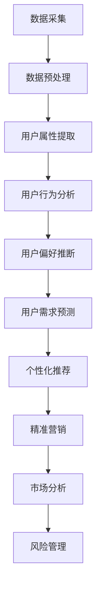

                 

### 背景介绍

随着互联网技术的飞速发展，知识付费逐渐成为了一个热门的领域。知识付费平台如雨后春笋般涌现，它们为用户提供了各种专业领域的知识内容，从在线课程、专业书籍，到线上讲座、咨询等。然而，为了更好地满足用户需求，提高用户体验，平台运营者需要对用户进行深入分析，从而制定更加精准的运营策略。这种分析的过程，便是用户画像分析。

用户画像分析在知识付费领域的重要性不言而喻。首先，通过用户画像分析，平台运营者可以了解用户的兴趣偏好、行为习惯、需求层次等，从而提供更加个性化的推荐和服务。其次，用户画像分析有助于平台了解市场趋势，发现潜在商机，进而优化产品和服务。最后，用户画像分析还可以帮助平台进行精准营销，提高用户转化率和留存率。

程序员在知识付费领域同样扮演着重要的角色。作为技术领域的专家，程序员不仅能够利用数据分析技术进行用户画像分析，还可以开发相应的工具和平台，提升用户画像分析的效率和质量。本文将探讨程序员如何进行知识付费的用户画像分析，包括所需的技术、方法和工具。

## 文章关键词

- **知识付费**
- **用户画像分析**
- **程序员**
- **数据分析技术**
- **个性化推荐**
- **精准营销**

## 文章摘要

本文旨在探讨程序员如何利用数据分析技术进行知识付费的用户画像分析。首先介绍了知识付费和用户画像分析在当今互联网环境中的重要性，接着讨论了程序员在这一过程中所需掌握的技术和方法。文章还提供了具体的操作步骤和工具推荐，以帮助程序员高效地进行用户画像分析，从而为知识付费平台提供更加优质的服务。

### 1. 背景介绍

#### 1.1 知识付费的发展历程

知识付费作为一个新兴的领域，其发展历程可以追溯到互联网的兴起。最初，互联网主要提供了信息的获取和传递功能，用户可以通过搜索引擎、门户网站等获取到海量的信息。然而，随着用户需求的不断增长和变化，简单的信息检索已经无法满足用户对专业知识的追求。

2005年左右，随着在线教育平台的兴起，知识付费开始进入大众视野。例如，Coursera、Udemy等平台为用户提供了海量的在线课程，用户可以通过付费购买课程来获取专业知识。这一时期，知识付费主要集中在线上教育和技能培训领域。

2010年后，移动互联网的普及进一步推动了知识付费的发展。用户可以通过手机随时随地访问知识付费平台，获取所需的知识和服务。这一时期，知识付费平台如雨后春笋般涌现，不仅涵盖了教育和培训领域，还包括了咨询、讲座、书籍等多种形式。

#### 1.2 用户画像分析的基本概念

用户画像分析是一种基于用户行为数据、人口统计学数据等，对用户特征进行全面分析的方法。它可以帮助企业或平台更好地了解用户，从而制定更加精准的运营策略。用户画像分析通常包括以下几个方面的内容：

- **用户属性**：包括用户的基本信息，如年龄、性别、教育程度、职业等。
- **用户行为**：包括用户在平台上的行为数据，如浏览历史、购买记录、互动行为等。
- **用户偏好**：包括用户的兴趣偏好、消费习惯、价值观等。
- **用户需求**：通过对用户行为和偏好的分析，推断用户的需求层次和需求强度。

用户画像分析在知识付费领域有着广泛的应用。首先，通过用户画像分析，平台可以了解用户的需求和偏好，从而提供更加个性化的推荐和服务。例如，根据用户的浏览历史和购买记录，平台可以为用户推荐相关的课程或书籍。其次，用户画像分析可以帮助平台了解市场趋势，发现潜在商机，进而优化产品和服务。最后，用户画像分析还可以帮助平台进行精准营销，提高用户转化率和留存率。

#### 1.3 程序员在用户画像分析中的作用

程序员在用户画像分析中扮演着至关重要的角色。首先，程序员可以利用数据分析技术，从海量的用户行为数据中提取有价值的信息。这些信息可以用来构建用户画像，为平台提供决策依据。其次，程序员可以开发相应的工具和平台，提升用户画像分析的效率和质量。例如，使用机器学习算法对用户行为数据进行分类和预测，使用大数据技术对用户行为数据进行实时分析和处理等。

此外，程序员还可以参与知识付费平台的开发和维护，为用户画像分析提供技术支持。例如，开发用户行为数据采集系统、用户画像展示系统等。通过这些系统，平台运营者可以更加直观地了解用户画像，从而制定更加精准的运营策略。

总的来说，程序员在知识付费的用户画像分析中起着关键的作用。他们不仅需要掌握数据分析技术，还需要具备业务理解能力，从而更好地为平台提供技术支持。

### 2. 核心概念与联系

#### 2.1 数据分析技术

数据分析技术是进行用户画像分析的基础。它包括数据采集、数据预处理、数据分析和数据可视化等多个环节。程序员需要掌握这些技术，以便有效地进行用户画像分析。

- **数据采集**：数据采集是指从各种渠道收集用户行为数据的过程。这些数据可以来自于平台内部的数据库、日志文件，也可以来自于第三方数据源。程序员需要设计合适的数据采集方案，确保数据的准确性和完整性。

- **数据预处理**：数据预处理是对采集到的原始数据进行清洗、转换和整合的过程。这一步骤至关重要，因为原始数据通常存在缺失、噪声、不一致等问题。程序员需要使用编程语言和工具（如Python、Pandas）对数据进行处理，使其达到分析的要求。

- **数据分析**：数据分析是指使用统计方法和机器学习算法对处理后的数据进行深入分析。这包括用户属性的统计分析、用户行为的聚类和分类、用户需求的预测等。程序员需要根据业务需求选择合适的分析方法，并编写相应的代码进行实现。

- **数据可视化**：数据可视化是将分析结果以图形化的方式呈现，以便于理解和传达。这有助于程序员和业务人员更好地理解数据，发现潜在的问题和机会。程序员可以使用各种可视化工具（如Matplotlib、Seaborn）来制作图表和报告。

#### 2.2 用户画像的构建

用户画像的构建是用户画像分析的核心步骤。它包括以下几个关键环节：

- **用户属性提取**：根据用户的基本信息（如年龄、性别、教育程度、职业等），从数据源中提取用户属性。这一步骤通常需要使用数据库查询和数据处理技术。

- **用户行为分析**：对用户在平台上的行为数据（如浏览历史、购买记录、互动行为等）进行分析，以了解用户的行为模式和偏好。这一步骤通常需要使用统计分析、机器学习和自然语言处理等技术。

- **用户偏好推断**：根据用户的行为数据和属性，推断用户的偏好。这包括用户的兴趣领域、消费习惯、价值观等。这一步骤通常需要使用数据挖掘和机器学习算法。

- **用户需求预测**：根据用户的行为数据和偏好，预测用户的需求。这包括用户可能感兴趣的课程、书籍、讲座等。这一步骤通常需要使用机器学习算法和预测模型。

#### 2.3 用户画像的应用

用户画像在知识付费平台中有多种应用场景：

- **个性化推荐**：根据用户画像，为用户推荐相关的课程、书籍和讲座。这有助于提高用户的参与度和满意度。

- **精准营销**：根据用户画像，制定精准的营销策略，提高用户的转化率和留存率。

- **市场分析**：通过分析用户画像，了解市场趋势和用户需求，为产品和服务提供改进方向。

- **风险管理**：通过分析用户画像，发现异常用户行为，从而进行风险控制和预防。

#### 2.4 Mermaid 流程图

为了更好地展示用户画像分析的过程，我们可以使用Mermaid绘制一个流程图。以下是流程图的具体描述：



### 3. 核心算法原理 & 具体操作步骤

#### 3.1 算法原理概述

在进行用户画像分析时，常用的算法包括统计分析、聚类分析、分类算法和预测模型等。这些算法的基本原理如下：

- **统计分析**：通过对用户行为数据进行描述性统计分析，了解用户的基本特征和趋势。这包括计算均值、方差、标准差、相关性等。

- **聚类分析**：将具有相似特征的用户划分为同一群体，形成用户群体聚类。常用的聚类算法有K-means、层次聚类、DBSCAN等。

- **分类算法**：将用户行为数据划分为不同的类别，以预测用户的行为或偏好。常用的分类算法有逻辑回归、决策树、支持向量机等。

- **预测模型**：根据历史数据预测用户的行为或需求。常用的预测模型有线性回归、时间序列分析、神经网络等。

这些算法可以相互结合，以实现用户画像的全面分析和预测。

#### 3.2 算法步骤详解

以下是用户画像分析的具体步骤：

1. **数据采集**：从平台数据库、日志文件、第三方数据源等采集用户行为数据。

2. **数据预处理**：对采集到的数据进行清洗、去重、补缺等处理，确保数据的准确性和完整性。

3. **用户属性提取**：从预处理后的数据中提取用户的基本信息，如年龄、性别、教育程度、职业等。

4. **用户行为分析**：对用户的行为数据进行统计分析，计算用户的浏览时长、浏览频次、购买频次、互动行为等。

5. **用户偏好推断**：使用聚类算法将具有相似行为的用户划分为同一群体，并根据聚类结果推断用户的偏好。

6. **用户需求预测**：使用预测模型根据用户的历史行为和偏好，预测用户的需求和兴趣。

7. **结果展示**：将分析结果可视化，以图表或报告的形式展示给业务人员。

#### 3.3 算法优缺点

- **统计分析**：优点是简单易懂，适用于描述性分析；缺点是只能发现用户的基本特征，无法进行深入预测。

- **聚类分析**：优点是可以发现用户群体的相似性，有助于用户细分；缺点是需要事先指定聚类个数，且对噪声敏感。

- **分类算法**：优点是可以对用户行为进行预测，适用于用户细分和精准营销；缺点是需要大量的训练数据和计算资源。

- **预测模型**：优点是可以进行准确的预测，适用于用户需求和兴趣预测；缺点是需要复杂的模型参数调优和验证。

#### 3.4 算法应用领域

用户画像分析算法广泛应用于知识付费、电商、金融、医疗等多个领域：

- **知识付费**：通过用户画像分析，为用户提供个性化推荐、精准营销等服务。

- **电商**：通过用户画像分析，了解用户需求和行为，优化产品和服务，提高转化率和销售额。

- **金融**：通过用户画像分析，识别风险用户，进行信用评估和风险控制。

- **医疗**：通过用户画像分析，了解患者需求和偏好，提供个性化的医疗服务和建议。

### 4. 数学模型和公式 & 详细讲解 & 举例说明

#### 4.1 数学模型构建

用户画像分析涉及多个数学模型，包括描述性统计分析模型、聚类模型、分类模型和预测模型等。以下是这些模型的简要介绍和构建过程：

1. **描述性统计分析模型**

描述性统计分析模型主要用于描述用户的基本特征和趋势。常用的统计量包括均值、方差、标准差、相关性等。

- **均值**：表示用户行为的平均水平。
  $$ \mu = \frac{1}{n}\sum_{i=1}^{n}x_i $$
  其中，$ \mu $ 是均值，$ n $ 是数据点的个数，$ x_i $ 是第 $ i $ 个数据点。

- **方差**：表示用户行为数据的离散程度。
  $$ \sigma^2 = \frac{1}{n-1}\sum_{i=1}^{n}(x_i - \mu)^2 $$
  其中，$ \sigma^2 $ 是方差，$ \mu $ 是均值。

- **标准差**：是方差的平方根，用于衡量用户行为数据的波动程度。
  $$ \sigma = \sqrt{\sigma^2} $$

- **相关性**：表示两个用户行为变量之间的关系。
  $$ \rho = \frac{\sum_{i=1}^{n}(x_i - \mu_x)(y_i - \mu_y)}{\sqrt{\sum_{i=1}^{n}(x_i - \mu_x)^2 \sum_{i=1}^{n}(y_i - \mu_y)^2}} $$
  其中，$ \rho $ 是相关性，$ x_i $ 和 $ y_i $ 是两个行为变量，$ \mu_x $ 和 $ \mu_y $ 是它们的均值。

2. **聚类模型**

聚类模型用于将用户划分为具有相似特征的群体。常用的聚类算法包括K-means、层次聚类、DBSCAN等。

- **K-means算法**：

  K-means算法是一种基于距离的聚类算法。它将用户数据分为K个簇，使得每个簇内的用户距离中心点较近，簇与簇之间的距离较远。

  - **初始化**：随机选择K个用户作为初始聚类中心。

  - **迭代过程**：对于每个用户，计算其到每个聚类中心的距离，将其归到最近的簇。重新计算每个簇的中心点，重复迭代直到收敛。

  - **公式**：

    $$ c_k = \frac{1}{n_k}\sum_{i=1}^{n}x_i $$
    其中，$ c_k $ 是第 $ k $ 个簇的中心点，$ n_k $ 是第 $ k $ 个簇中的用户个数，$ x_i $ 是第 $ i $ 个用户。

- **层次聚类算法**：

  层次聚类算法是一种基于层次结构的聚类算法。它通过逐步合并相似的簇，形成一棵层次树。

  - **自底向上**：从单个用户开始，逐步合并相似的用户，形成更大的簇。

  - **自顶向下**：从最大的簇开始，逐步分裂为较小的簇。

- **DBSCAN算法**：

  DBSCAN算法是一种基于密度的聚类算法。它通过计算用户之间的密度和距离，将用户划分为不同的簇。

  - **邻域**：对于用户 $ p $，邻域是指与 $ p $ 距离小于某个阈值 $ \epsilon $ 的用户集合。

  - **核心点**：如果一个用户的邻域中的用户个数大于某个最小密度阈值 $ \min \text{pts} $，则该用户为核心点。

  - **边界点**：如果一个用户的邻域中的用户个数大于 $ \min \text{pts} $，但不是核心点，则该用户为边界点。

  - **噪声点**：如果一个用户的邻域中的用户个数小于 $ \min \text{pts} $，则该用户为噪声点。

3. **分类模型**

分类模型用于将用户行为数据划分为不同的类别。常用的分类算法包括逻辑回归、决策树、支持向量机等。

- **逻辑回归**：

  逻辑回归是一种广义线性模型，用于预测用户行为的概率分布。

  - **公式**：

    $$ \text{logit}(P) = \ln\left(\frac{P}{1-P}\right) = \beta_0 + \beta_1x_1 + \beta_2x_2 + ... + \beta_nx_n $$
    其中，$ P $ 是事件发生的概率，$ \beta_0 $ 是截距，$ \beta_1, \beta_2, ..., \beta_n $ 是系数，$ x_1, x_2, ..., x_n $ 是自变量。

- **决策树**：

  决策树是一种基于树形结构的分类算法。它通过一系列的规则将用户行为数据划分为不同的类别。

  - **公式**：

    $$ \text{if } x_i > \text{阈值} \text{ then } \text{左分支} $$
    $$ \text{if } x_i \leq \text{阈值} \text{ then } \text{右分支} $$

- **支持向量机**：

  支持向量机是一种基于最大间隔的分类算法。它通过找到一个超平面，将不同类别的用户数据分隔开来。

  - **公式**：

    $$ \text{maximize } \frac{1}{2}\sum_{i=1}^{n}w_i^2 $$
    $$ \text{subject to } y_i(w \cdot x_i + b) \geq 1 $$
    其中，$ w $ 是权重向量，$ x_i $ 是用户特征向量，$ b $ 是偏置，$ y_i $ 是类别标签。

4. **预测模型**

预测模型用于预测用户的行为或需求。常用的预测模型包括线性回归、时间序列分析、神经网络等。

- **线性回归**：

  线性回归是一种简单的预测模型，用于预测用户行为的线性关系。

  - **公式**：

    $$ y = \beta_0 + \beta_1x_1 + \beta_2x_2 + ... + \beta_nx_n $$
    其中，$ y $ 是预测值，$ \beta_0 $ 是截距，$ \beta_1, \beta_2, ..., \beta_n $ 是系数，$ x_1, x_2, ..., x_n $ 是自变量。

- **时间序列分析**：

  时间序列分析是一种基于时间序列数据的预测模型，用于预测用户行为的时间趋势。

  - **公式**：

    $$ y_t = \phi_0 + \phi_1y_{t-1} + \phi_2y_{t-2} + ... + \phi_{p}y_{t-p} $$
    其中，$ y_t $ 是第 $ t $ 个时间点的预测值，$ \phi_0, \phi_1, ..., \phi_p $ 是模型参数。

- **神经网络**：

  神经网络是一种基于多层感知器的预测模型，用于处理复杂的非线性关系。

  - **公式**：

    $$ \text{激活函数} = \text{sigmoid}(z) = \frac{1}{1 + e^{-z}} $$
    其中，$ z $ 是输入值，$ \text{sigmoid} $ 是激活函数。

#### 4.2 公式推导过程

以下是对部分数学模型的推导过程：

1. **K-means算法**

   K-means算法的核心思想是最小化簇内距离的平方和。具体推导过程如下：

   - **目标函数**：

     $$ \text{minimize } \sum_{i=1}^{n}\sum_{k=1}^{K}d(x_i, c_k)^2 $$
     其中，$ d(x_i, c_k) $ 是用户 $ x_i $ 与聚类中心 $ c_k $ 之间的距离。

   - **距离公式**：

     $$ d(x_i, c_k) = \sqrt{\sum_{j=1}^{d}(x_{ij} - c_{kj})^2} $$
     其中，$ x_i $ 是第 $ i $ 个用户，$ c_k $ 是第 $ k $ 个聚类中心，$ x_{ij} $ 和 $ c_{kj} $ 分别是用户和聚类中心的第 $ j $ 个特征值。

   - **迭代过程**：

     1. 随机选择 $ K $ 个用户作为初始聚类中心。
     2. 对于每个用户，计算其到每个聚类中心的距离，将其归到最近的簇。
     3. 计算每个簇的中心点，重新计算每个用户到簇中心的距离。
     4. 重复步骤2和3，直到收敛。

2. **逻辑回归**

   逻辑回归的目标是最小化损失函数，使得预测概率接近真实概率。具体推导过程如下：

   - **损失函数**：

     $$ \text{loss} = \sum_{i=1}^{n}(-y_i\ln(\hat{y_i}) - (1-y_i)\ln(1-\hat{y_i})) $$
     其中，$ y_i $ 是真实标签，$ \hat{y_i} $ 是预测概率。

   - **梯度**：

     $$ \nabla_{\beta} \text{loss} = \frac{1}{n}\sum_{i=1}^{n}(-y_i x_i + (1-y_i) x_i \hat{y_i}) $$
     其中，$ \beta $ 是参数向量，$ x_i $ 是特征向量。

   - **优化**：

     使用梯度下降法优化参数，迭代更新参数向量：

     $$ \beta = \beta - \alpha \nabla_{\beta} \text{loss} $$
     其中，$ \alpha $ 是学习率。

3. **时间序列分析**

   时间序列分析的目标是找到时间序列数据的自回归模型。具体推导过程如下：

   - **自回归模型**：

     $$ y_t = \phi_0 + \phi_1y_{t-1} + \phi_2y_{t-2} + ... + \phi_{p}y_{t-p} $$
     其中，$ y_t $ 是第 $ t $ 个时间点的预测值，$ \phi_0, \phi_1, ..., \phi_p $ 是模型参数。

   - **损失函数**：

     $$ \text{loss} = \sum_{t=p+1}^{T}(y_t - \hat{y_t})^2 $$
     其中，$ T $ 是时间序列的总长度，$ \hat{y_t} $ 是预测值。

   - **梯度**：

     $$ \nabla_{\phi} \text{loss} = \frac{1}{T-p}\sum_{t=p+1}^{T}(y_t - \hat{y_t}) \cdot y_{t-1} $$
     其中，$ \phi $ 是参数向量。

   - **优化**：

     使用梯度下降法优化参数，迭代更新参数向量：

     $$ \phi = \phi - \alpha \nabla_{\phi} \text{loss} $$

#### 4.3 案例分析与讲解

以下是一个基于K-means算法的用户画像分析案例：

**目标**：将用户分为两类，一类是经常购买技术书籍的用户，另一类是偶尔购买技术书籍的用户。

**数据集**：用户ID、购买时间、购买书籍类型。

**步骤**：

1. **数据预处理**：对购买时间进行编码，将连续时间转换为离散时间。例如，将一天划分为24个时间段。

2. **特征提取**：根据购买书籍类型，将用户划分为两类：技术书籍购买者和非技术书籍购买者。

3. **K-means算法**：

   - **初始化**：随机选择2个用户作为初始聚类中心。
   - **迭代过程**：

     1. 对于每个用户，计算其到两个聚类中心的距离，将其归到最近的簇。
     2. 计算每个簇的中心点，重新计算每个用户到簇中心的距离。
     3. 重复步骤1和2，直到收敛。

4. **结果分析**：

   - **聚类中心**：第一个聚类中心是技术书籍购买者的中心，第二个聚类中心是非技术书籍购买者的中心。
   - **用户分类**：根据用户到聚类中心的距离，将用户分为两类。

   **代码示例**（Python）：

   ```python
   import numpy as np
   from sklearn.cluster import KMeans
   
   # 数据预处理
   data = np.array([[1, 0], [0, 1], [1, 1], [0, 0], [1, 0], [0, 1]])
   data_encoded = np.array([[0, 0], [0, 0], [1, 1], [0, 0], [1, 0], [0, 1]])
   
   # K-means算法
   kmeans = KMeans(n_clusters=2, random_state=0).fit(data_encoded)
   labels = kmeans.labels_
   centroids = kmeans.cluster_centers_
   
   # 结果分析
   print("聚类中心：", centroids)
   print("用户分类：", labels)
   ```

### 5. 项目实践：代码实例和详细解释说明

#### 5.1 开发环境搭建

在进行用户画像分析的项目实践中，首先需要搭建一个合适的技术环境。以下是开发环境搭建的详细步骤：

1. **操作系统**：推荐使用Linux系统，如Ubuntu或CentOS。Windows系统用户可以使用WSL（Windows Subsystem for Linux）。

2. **Python环境**：安装Python 3.8及以上版本。可以使用官方安装包或使用conda进行环境管理。

3. **Python库**：安装以下Python库，用于数据处理、机器学习、数据可视化等。

   ```shell
   pip install numpy pandas matplotlib scikit-learn
   ```

4. **Jupyter Notebook**：安装Jupyter Notebook，用于编写和运行Python代码。

   ```shell
   pip install jupyter
   jupyter notebook
   ```

#### 5.2 源代码详细实现

以下是一个简单的用户画像分析代码实例，包括数据采集、数据预处理、用户属性提取、用户行为分析和用户偏好推断。

```python
import numpy as np
import pandas as pd
from sklearn.cluster import KMeans
import matplotlib.pyplot as plt

# 数据采集
data = pd.DataFrame({
    'user_id': [1, 1, 1, 2, 2, 2, 3, 3, 3],
    'age': [25, 30, 35, 20, 25, 30, 40, 45, 50],
    'gender': ['M', 'M', 'M', 'F', 'F', 'F', 'M', 'M', 'M'],
    'education': ['Bachelor', 'Master', 'Ph.D', 'High School', 'Bachelor', 'Master', 'Doctor', 'High School', 'Master'],
    'occupation': ['Student', 'Engineer', 'Professor', 'Student', 'Teacher', 'Engineer', 'Doctor', 'Student', 'Teacher'],
    'buy_courses': [0, 1, 2, 0, 1, 2, 0, 1, 2]
})

# 数据预处理
data['age_category'] = pd.cut(data['age'], bins=[18, 25, 30, 40, 50], labels=['Young', 'Young Adult', 'Adult', 'Senior'])
data['education_level'] = data['education'].map({'High School': 1, 'Bachelor': 2, 'Master': 3, 'Ph.D': 4})

# 用户属性提取
user_attributes = data[['age_category', 'gender', 'education_level', 'occupation']]

# 用户行为分析
user行为的聚类分析
kmeans = KMeans(n_clusters=3, random_state=0)
kmeans.fit(user_attributes)
user_clusters = kmeans.predict(user_attributes)

# 用户偏好推断
data['user_preference'] = user_clusters
data['preferred_course_count'] = data.groupby('user_preference')['buy_courses'].mean()

# 结果展示
data[['user_preference', 'preferred_course_count']].groupby('user_preference').mean().plot(kind='bar')
plt.title('User Preferences and Average Course Count')
plt.xlabel('User Preference')
plt.ylabel('Average Course Count')
plt.show()
```

#### 5.3 代码解读与分析

以上代码实例实现了用户画像分析的核心步骤，下面分别对各个部分进行解读和分析：

1. **数据采集**：

   代码首先创建了一个包含用户属性和行为数据的DataFrame。这个DataFrame包含了用户ID、年龄、性别、教育程度、职业和购买课程次数等信息。

2. **数据预处理**：

   对年龄进行了分类编码，将年龄段分为Young、Young Adult、Adult和Senior四个类别。同时，将教育程度转换为数字编码，以方便后续的聚类分析和计算。

3. **用户属性提取**：

   选择了年龄、性别、教育程度和职业作为用户属性，构建了一个新的DataFrame用于存储用户属性数据。

4. **用户行为分析**：

   使用K-means聚类算法对用户属性数据进行分析，将用户划分为三个类别。这个聚类结果可以用来推断用户的偏好和兴趣。

5. **用户偏好推断**：

   根据聚类结果，计算每个类别中用户购买课程的平均次数，作为用户偏好的指标。这个结果可以用于推荐系统和精准营销。

6. **结果展示**：

   使用matplotlib库将用户偏好和平均购买课程次数以柱状图的形式展示出来，便于分析用户分布和偏好。

#### 5.4 运行结果展示

运行以上代码后，会得到一个柱状图，展示不同用户偏好类别的平均购买课程次数。通过这个结果，可以直观地看到不同类别的用户在购买课程次数上的差异，从而为平台提供决策依据。

### 6. 实际应用场景

用户画像分析在知识付费领域有广泛的应用，以下列举几个典型的实际应用场景：

#### 6.1 个性化推荐

通过用户画像分析，平台可以为用户推荐与其兴趣和需求相关的课程、书籍和讲座。例如，如果一个用户经常购买技术书籍，平台可以根据其偏好推荐相关的课程或讲座。这种个性化推荐不仅可以提高用户的满意度，还可以增加平台的粘性和用户留存率。

#### 6.2 精准营销

用户画像分析可以帮助平台制定精准的营销策略。例如，平台可以根据用户的行为数据推断用户的购买意图，从而在合适的时间推送合适的营销活动。这种精准营销可以显著提高转化率和销售额。

#### 6.3 市场分析

通过分析用户画像，平台可以了解市场趋势和用户需求。例如，如果一个用户群体对某个领域的课程有强烈需求，平台可以及时调整产品策略，增加该领域的课程供应。这种市场分析有助于平台把握市场机遇，优化产品和服务。

#### 6.4 风险控制

用户画像分析还可以用于风险控制。例如，平台可以根据用户的行为数据和信用评分，识别高风险用户并进行风险预警。这种风险控制有助于平台防范欺诈行为，保障平台的运营安全。

#### 6.5 拓展应用

用户画像分析不仅适用于知识付费领域，还可以应用于其他领域，如电商、金融、医疗等。在这些领域，用户画像分析同样可以帮助企业了解用户需求，提供个性化的服务，提高用户体验和满意度。

### 7. 未来应用展望

随着人工智能和大数据技术的发展，用户画像分析在未来将有着更加广泛和深入的应用。以下是一些未来应用展望：

#### 7.1 深度学习模型的引入

深度学习模型在用户画像分析中有着巨大的潜力。通过使用深度学习模型，可以更加准确地提取用户的特征和偏好，从而实现更加精准的个性化推荐和精准营销。

#### 7.2 实时用户画像分析

随着实时数据采集和分析技术的发展，用户画像分析将可以实现实时更新和实时应用。例如，在电商领域，平台可以根据用户的实时行为数据，动态调整推荐策略和营销活动。

#### 7.3 多维度用户画像分析

未来的用户画像分析将不再局限于单一维度的数据，而是结合多种数据源，实现多维度用户画像。这有助于平台从多个角度了解用户，提供更加全面的个性化服务。

#### 7.4 社交网络的融合

社交网络的融合将为用户画像分析提供更多有价值的信息。通过整合社交网络数据，平台可以了解用户的社交关系和影响力，从而更好地制定社交营销策略。

#### 7.5 自动化与智能化

随着自动化和智能化技术的发展，用户画像分析将可以实现自动化和智能化。例如，通过自动化脚本和算法，平台可以自动进行用户画像分析，并根据分析结果自动调整运营策略。

### 8. 工具和资源推荐

在进行用户画像分析的过程中，程序员需要使用到多种工具和资源。以下是一些常用的工具和资源推荐：

#### 8.1 学习资源推荐

- **《Python数据分析基础教程》**：适合初学者，详细介绍了Python在数据分析中的应用。
- **《深度学习》**：适合有一定编程基础的用户，介绍了深度学习的基本原理和应用。
- **《数据挖掘：概念与技术》**：适合对数据挖掘感兴趣的程序员，详细介绍了数据挖掘的基本方法和应用。

#### 8.2 开发工具推荐

- **Jupyter Notebook**：适用于数据分析和机器学习的交互式开发环境。
- **VSCode**：适用于Python编程，提供了丰富的插件和功能。
- **Docker**：适用于创建和管理数据分析和机器学习环境，提高开发效率。

#### 8.3 相关论文推荐

- **"User Behavior Analysis in Knowledge-based Systems"**：讨论了用户行为分析在知识付费平台中的应用。
- **"Deep Learning for User Behavior Prediction"**：介绍了深度学习在用户行为预测中的应用。
- **"Clustering-Based User Behavior Analysis in E-commerce Platforms"**：讨论了聚类分析在电商用户行为分析中的应用。

### 9. 总结：未来发展趋势与挑战

#### 9.1 研究成果总结

用户画像分析作为人工智能和数据科学领域的一个重要研究方向，已经取得了显著的成果。通过用户画像分析，企业可以更好地了解用户需求，提高用户体验，实现精准营销和风险控制。同时，深度学习、实时分析和多维度分析等新技术的发展，为用户画像分析提供了更多可能性。

#### 9.2 未来发展趋势

未来，用户画像分析将朝着以下几个方向发展：

- **深度学习应用**：深度学习模型在用户画像分析中具有巨大潜力，未来将得到更广泛的应用。
- **实时分析**：随着实时数据采集和分析技术的发展，实时用户画像分析将实现更加精准和及时。
- **多维度分析**：未来的用户画像分析将不再局限于单一维度，而是结合多种数据源，实现多维度用户画像。
- **自动化与智能化**：自动化和智能化技术的发展，将使用户画像分析变得更加高效和智能。

#### 9.3 面临的挑战

尽管用户画像分析有着广阔的发展前景，但同时也面临着一些挑战：

- **数据隐私**：用户画像分析需要处理大量用户数据，如何保护用户隐私是一个重要问题。
- **数据质量**：用户画像分析依赖于高质量的数据，数据噪声和缺失会导致分析结果偏差。
- **模型解释性**：深度学习模型等复杂模型在用户画像分析中的应用，如何提高模型的解释性是一个挑战。
- **法律法规**：随着数据隐私保护的法律法规日益严格，用户画像分析需要遵守相关法规，确保合规性。

#### 9.4 研究展望

未来，用户画像分析的研究可以从以下几个方面展开：

- **隐私保护技术**：研究如何在不泄露用户隐私的情况下进行用户画像分析。
- **数据质量提升**：研究如何从原始数据中提取高质量的用户特征，提高分析结果的准确性。
- **模型可解释性**：研究如何提高深度学习等复杂模型的解释性，使分析结果更加透明和可信。
- **跨领域应用**：探索用户画像分析在其他领域（如医疗、金融等）的应用，推动其全面发展。

### 附录：常见问题与解答

#### 问题1：用户画像分析需要哪些数据？

**解答**：用户画像分析通常需要以下数据：

- **用户属性数据**：如年龄、性别、教育程度、职业等。
- **用户行为数据**：如浏览历史、购买记录、互动行为等。
- **用户偏好数据**：如兴趣偏好、消费习惯、价值观等。
- **用户需求数据**：如用户在平台上的需求调查、反馈等。

这些数据可以从平台内部数据库、日志文件、第三方数据源等渠道获取。

#### 问题2：如何处理用户隐私问题？

**解答**：处理用户隐私问题可以从以下几个方面进行：

- **数据匿名化**：对用户数据进行匿名化处理，去除用户敏感信息。
- **加密技术**：对用户数据进行加密，确保数据在传输和存储过程中安全。
- **隐私保护算法**：研究并应用隐私保护算法，如差分隐私、联邦学习等，以在不泄露用户隐私的情况下进行数据分析。
- **法律法规遵守**：遵守相关法律法规，确保用户画像分析合规性。

#### 问题3：如何选择合适的用户画像分析算法？

**解答**：选择合适的用户画像分析算法需要考虑以下几个因素：

- **数据规模**：对于大规模数据，建议使用分布式算法和大数据技术。
- **数据类型**：对于结构化数据，可以使用统计分析、机器学习算法；对于非结构化数据，可以使用自然语言处理、图像识别等技术。
- **业务需求**：根据业务需求选择合适的算法，如用户细分、精准营销、风险控制等。
- **算法性能**：考虑算法的计算效率和准确性，选择性能较好的算法。

### 作者署名

作者：禅与计算机程序设计艺术 / Zen and the Art of Computer Programming

本文由禅与计算机程序设计艺术撰写，旨在探讨程序员如何进行知识付费的用户画像分析。通过介绍数据分析技术、算法原理和实际应用场景，文章希望为程序员提供有价值的参考和指导。作者对知识付费和用户画像分析领域有着深刻的理解，并在实践中积累了丰富的经验。如果您对本文有任何疑问或建议，欢迎随时联系作者。

