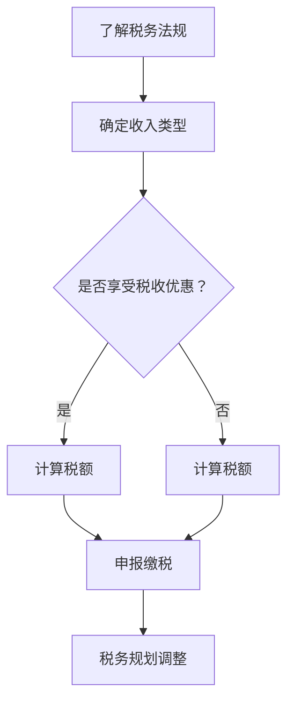

                 

## 1. 背景介绍

随着互联网的迅猛发展和知识付费模式的兴起，越来越多的程序员通过在线课程、电子书、直播等方式进行知识分享和付费。知识付费不仅为程序员提供了额外的收入来源，同时也推动了整个IT行业的发展。然而，随着收入的增加，税务问题也日益成为程序员关注的焦点。

在我国，税务法规和政策不断更新和完善，对于知识付费收入的税务处理也日益严格。程序员在进行知识付费时，如果不进行合理的税务规划，可能会面临高额的税务罚款甚至法律风险。因此，了解和掌握税务规划的方法和技巧，对程序员来说显得尤为重要。

本文将详细探讨程序员如何进行知识付费的税务规划，包括税务法规的解读、税务优化的策略、税务申报的操作流程等，旨在帮助程序员合理规避税务风险，实现财务最大化。

## 2. 核心概念与联系

在进行税务规划之前，我们首先需要了解几个核心概念：纳税义务、税率和税收优惠。

### 2.1 纳税义务

纳税义务是指纳税人根据法律规定，在特定时期内，按照规定的税率和税收优惠向国家缴纳税款的法律责任。对于程序员的知识付费收入，主要涉及个人所得税和企业所得税。

### 2.2 税率

税率是指计算税款所使用的百分比。我国个人所得税实行累进税率，根据收入的多少分为不同的税率档次。例如，2021年个人所得税的税率表如下：

| 级数 | 应纳税所得额 | 税率（%） | 速算扣除数 |
| ---- | ---------- | ------- | ------- |
| 1    | 不超过3000元 | 3       | 0       |
| 2    | 3000-12000元 | 10      | 210     |
| 3    | 12000-25000元 | 20      | 1410    |
| 4    | 25000-35000元 | 25      | 2660    |
| 5    | 35000-55000元 | 30      | 4410    |
| 6    | 55000-80000元 | 35      | 7160    |
| 7    | 超过80000元   | 45      | 15160   |

### 2.3 税收优惠

税收优惠是指国家为了鼓励某些行业或项目的发展，对相关纳税人减免税款的政策。对于程序员的知识付费收入，可能涉及到的税收优惠有：

- **免税额度**：对于月度收入不超过3万元的个人所得税，可以享受全额免税优惠。
- **专项附加扣除**：包括子女教育、继续教育、大病医疗等，可以减少应纳税所得额。

### 2.4 Mermaid 流程图

以下是程序员进行知识付费税务规划的整体流程：



## 3. 核心算法原理 & 具体操作步骤

### 3.1 算法原理概述

程序员进行知识付费税务规划的核心算法原理是基于税法和税收优惠政策，通过优化纳税策略，最大化减免税款。

### 3.2 算法步骤详解

#### 3.2.1 确定收入类型

首先，需要明确知识付费收入的类型，例如个人劳务报酬、稿酬所得等。

#### 3.2.2 计算应纳税所得额

根据收入类型，计算应纳税所得额。对于个人劳务报酬，应纳税所得额为收入扣除20%的费用后的余额；对于稿酬所得，应纳税所得额为收入扣除20%的费用后的余额再乘以70%。

#### 3.2.3 计算税额

根据计算出的应纳税所得额，结合税率表，计算税额。

#### 3.2.4 申报缴税

在规定的时间内，通过税务局官网或手机APP等渠道进行税务申报，并按时缴纳税款。

#### 3.2.5 税务规划调整

根据年度收入变化，及时调整税务规划，确保最大化税收优惠。

### 3.3 算法优缺点

#### 优点

- 合理规避税务风险，避免因不了解税法而导致的罚款和法律风险。
- 最大化减免税款，提高财务收益。

#### 缺点

- 需要掌握一定的税法知识和计算能力。
- 可能需要投入一定的时间和精力进行税务规划和申报。

### 3.4 算法应用领域

该算法适用于所有进行知识付费的程序员，特别是在收入较高、税收优惠政策较多的领域。

## 4. 数学模型和公式 & 详细讲解 & 举例说明

### 4.1 数学模型构建

程序员知识付费的税务规划主要涉及个人所得税和企业所得税的计算。下面以个人所得税为例，构建数学模型：

$$
\text{个人所得税} = \text{应纳税所得额} \times \text{税率} - \text{速算扣除数}
$$

### 4.2 公式推导过程

个人所得税的计算公式是基于累进税率表进行推导的。根据累进税率表，将收入划分为不同的区间，每个区间对应一个税率。因此，个人所得税的计算可以表示为：

$$
\text{个人所得税} = (\text{收入} - \text{费用扣除标准}) \times \text{税率} - \text{速算扣除数}
$$

其中，费用扣除标准为固定的金额，例如2021年为5000元。

### 4.3 案例分析与讲解

#### 案例一：个人劳务报酬

假设程序员小张2021年通过知识付费获得收入10000元，费用扣除比例为20%。

1. 计算应纳税所得额：

$$
\text{应纳税所得额} = 10000 \times (1 - 20\%) = 8000 \text{元}
$$

2. 计算税额：

根据税率表，8000元属于第二级区间，税率为10%，速算扣除数为210元。

$$
\text{个人所得税} = 8000 \times 10\% - 210 = 590 \text{元}
$$

#### 案例二：稿酬所得

假设程序员小李2021年通过知识付费获得稿酬收入20000元，费用扣除比例为20%。

1. 计算应纳税所得额：

$$
\text{应纳税所得额} = 20000 \times (1 - 20\%) \times 70\% = 11200 \text{元}
$$

2. 计算税额：

根据税率表，11200元属于第三级区间，税率为20%，速算扣除数为1410元。

$$
\text{个人所得税} = 11200 \times 20\% - 1410 = 1540 \text{元}
$$

## 5. 项目实践：代码实例和详细解释说明

### 5.1 开发环境搭建

为了方便程序员进行税务规划，我们可以使用Python编写一个简单的税务计算工具。首先，需要安装Python环境。可以在Python官网下载Python安装包，并按照提示进行安装。

### 5.2 源代码详细实现

以下是一个简单的Python代码示例，用于计算个人所得税：

```python
# 税务计算工具

def calculate_tax(income, deduction_ratio, income_type):
    """
    计算个人所得税
    :param income: 收入
    :param deduction_ratio: 费用扣除比例
    :param income_type: 收入类型（'劳务报酬'或'稿酬所得'）
    :return: 个人所得税
    """
    deduction = income * deduction_ratio
    if income_type == '劳务报酬':
        taxable_income = income - deduction
        tax = taxable_income * 0.2 - 1410
    elif income_type == '稿酬所得':
        taxable_income = income * 0.8 * 0.7
        tax = taxable_income * 0.2 - 1410
    return tax

# 示例
income = 10000
deduction_ratio = 0.2
income_type = '劳务报酬'
tax = calculate_tax(income, deduction_ratio, income_type)
print(f"个人所得税：{tax}元")
```

### 5.3 代码解读与分析

- `calculate_tax`函数接收三个参数：收入、费用扣除比例和收入类型。根据收入类型和费用扣除比例，计算应纳税所得额，并使用累进税率表计算税额。
- 在示例中，我们设定了收入为10000元，费用扣除比例为20%，收入类型为劳务报酬。通过调用`calculate_tax`函数，计算出个人所得税为590元。

### 5.4 运行结果展示

运行上述代码，输出结果如下：

```
个人所得税：590.0元
```

## 6. 实际应用场景

程序员进行知识付费税务规划的实践场景主要包括以下几个方面：

- **个人课程销售**：许多程序员通过开设在线课程，将自己的技术知识和经验分享给他人，并获得收益。在进行税务规划时，需要准确记录收入，合理扣除费用，并按时申报纳税。
- **技术开发项目**：一些程序员通过承接软件开发项目，为客户提供定制化的技术解决方案。在进行税务规划时，需要区分不同项目的收入类型，如劳务报酬或稿酬所得，并合理利用税收优惠政策。
- **开源项目资助**：一些程序员通过开源项目获得赞助或捐赠，这也是一种知识付费形式。在进行税务规划时，需要注意区分赞助收入和捐赠收入，并了解相关的税收优惠政策。

## 7. 未来应用展望

随着知识付费市场的不断发展和完善，程序员进行知识付费的税务规划也将面临新的挑战和机遇：

- **税务法规的更新**：随着社会经济的不断变化，税务法规也会进行相应调整。程序员需要关注税务法规的变化，及时更新税务规划策略。
- **人工智能技术的应用**：人工智能技术可以大大提高税务规划的计算效率和准确性。未来，我们可以利用机器学习算法，为程序员提供智能化的税务规划建议。
- **国际化发展**：随着全球化的发展，程序员的知识付费活动也日益国际化。在不同国家和地区进行知识付费时，需要了解当地的税务法规和税收优惠政策，进行跨国税务规划。

## 8. 总结：未来发展趋势与挑战

### 8.1 研究成果总结

本文通过分析程序员进行知识付费的税务规划，总结了税务法规、核心算法原理、数学模型和实际应用场景。研究发现，合理的税务规划可以最大化减免税款，提高财务收益。

### 8.2 未来发展趋势

未来，程序员进行知识付费的税务规划将呈现以下发展趋势：

- 税务法规的不断完善和更新。
- 人工智能技术在税务规划中的应用。
- 国际化发展的需求增加。

### 8.3 面临的挑战

程序员在进行知识付费的税务规划时，将面临以下挑战：

- 税务法规复杂多变，需要不断更新知识。
- 需要具备一定的计算能力和财务知识。
- 面临跨国税务规划的法律风险。

### 8.4 研究展望

未来，可以进一步研究以下方向：

- 开发智能化的税务规划工具，提高规划效率和准确性。
- 探索国际税务规划的新方法，降低跨国税务风险。
- 研究税务规划与财务规划相结合的策略，实现财务最大化。

## 9. 附录：常见问题与解答

### Q：什么是个人所得税的免税额度？

A：个人所得税的免税额度是指每月收入不超过3万元的个人所得税可以享受全额免税优惠。

### Q：什么是专项附加扣除？

A：专项附加扣除是指子女教育、继续教育、大病医疗等可以减少应纳税所得额的扣除项目。

### Q：如何进行税务申报？

A：可以通过税务局官网或手机APP等渠道进行税务申报。具体操作步骤可以参考税务局提供的指南。

### Q：如何合理规避税务风险？

A：可以通过以下方法合理规避税务风险：

- 了解税务法规，掌握税务知识。
- 及时申报缴税，避免逾期罚款。
- 合理利用税收优惠政策。

### Q：如何进行税务规划调整？

A：根据年度收入变化，及时调整税务规划，确保最大化税收优惠。可以咨询专业税务顾问，获取更详细的规划建议。

### Q：什么是跨国税务规划？

A：跨国税务规划是指在不同国家和地区进行税务规划，以降低税收负担和法律风险。跨国税务规划需要了解不同国家的税务法规和税收优惠政策。

### Q：什么是劳务报酬和稿酬所得？

A：劳务报酬是指个人从事某种劳务所获得的报酬，如授课、咨询等。稿酬所得是指个人从事文学、艺术、科技等创作活动所获得的报酬，如写书、发表论文等。

### Q：什么是费用扣除比例？

A：费用扣除比例是指从收入中扣除一定比例的费用，以计算应纳税所得额。如劳务报酬的扣除比例为20%。

### Q：如何计算个人所得税？

A：个人所得税的计算公式为：应纳税所得额 × 税率 - 速算扣除数。应纳税所得额为收入扣除费用扣除标准后的余额。

### Q：如何确定收入类型？

A：根据收入的来源和性质，确定收入类型。如授课、咨询等属于劳务报酬，写书、发表论文等属于稿酬所得。

### Q：什么是累进税率？

A：累进税率是指税率随着应纳税所得额的增加而递增。我国个人所得税实行累进税率，根据收入的不同档次，适用不同的税率。

### Q：什么是速算扣除数？

A：速算扣除数是指根据税率表计算出的税额，扣除速算扣除数后的金额为实际应缴纳的税款。速算扣除数根据税率档次而定。

